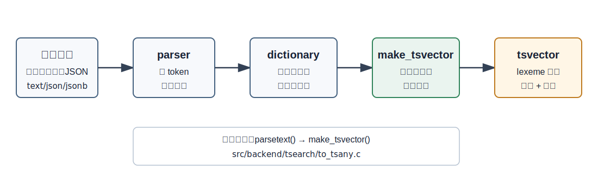
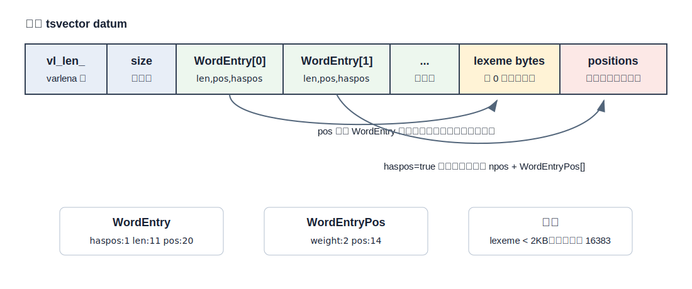
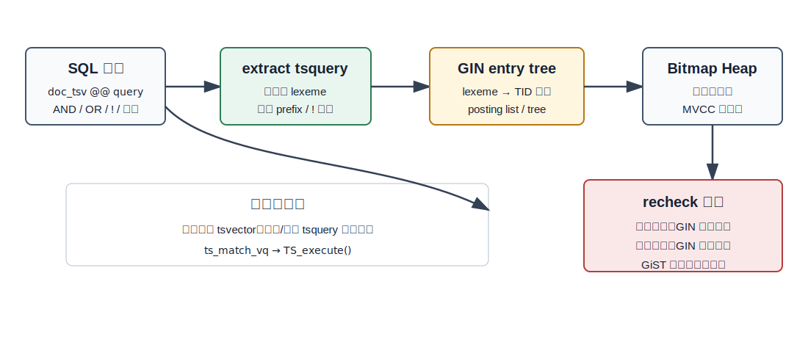
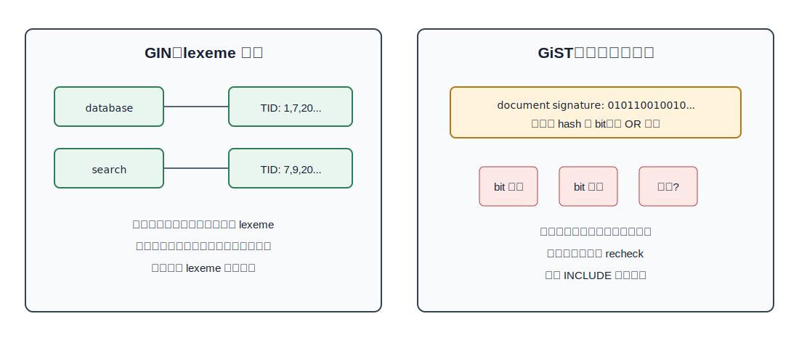
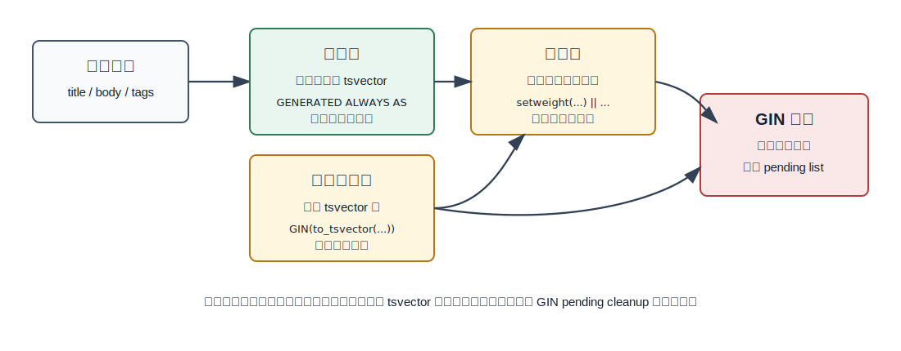

## 数据库筑基课 - tsvector 数据类型
                                                                                            
### 作者                                                                
digoal                                                                
                                                                       
### 日期                                                                     
2026-05-26                                                      
                                                                    
### 标签                                                                  
PostgreSQL , 应用开发者 , DBA , 数据库筑基课 , 数据类型与算子 , tsvector , tsquery , 全文检索 , GIN , GiST  
                                                                                           
----                                                                    

## 背景


本节属于“数据类型与算子”基础能力。当前工作区没有发现“数据库筑基课”总纲文件，因此本文先独立成篇。

业务系统里经常会出现一种尴尬：用户要搜文章、商品、工单、日志、简历、知识库，但数据库里保存的是自然语言文本。`LIKE '%数据库%'` 能用，但它只是在字符串里找子串；它不理解词形归一、停用词、词距、标题权重，也很难把“包含多个词的文档集合”变成高效的索引访问。

PostgreSQL 的全文检索把问题拆成两步：

1. 把文档预处理成 `tsvector`：一组排序、去重的 lexeme，并可带位置和权重。
2. 把用户查询预处理成 `tsquery`：一棵由 lexeme 和逻辑/短语操作符组成的查询树。

这两个类型不是搜索引擎的全部，但它们是 PostgreSQL 原生全文检索的基础数据模型。理解 `tsvector`，就能看清为什么 GIN 适合全文检索，为什么权重和短语查询会回表，为什么更新正文会带来索引写放大，也能判断什么时候应该把搜索交给专门搜索系统。

本文关键结论以本地 PostgreSQL 源码和官方文档核对；DeepWiki `postgres/postgres` 仅作为源码导航辅助。

## 一、它解决什么问题？

`tsvector` 解决的是“把自然语言文档变成数据库能索引、能匹配、能估算选择率的结构化值”。

如果没有 `tsvector`，常见做法有三种：

| 做法 | 优点 | 主要问题 |
|---|---|---|
| `LIKE` / 正则 | 简单，不需要额外类型 | 通常难以利用普通 B-tree；不做词形归一；多词组合和排序能力弱 |
| 应用层分词后存数组 | 模型直观，可用数组 GIN | 缺少全文检索配置、权重、位置、短语距离、排名函数的统一语义 |
| 外部搜索系统 | 功能完整，适合复杂检索 | 需要跨系统同步、一致性、事务边界和运维成本 |

`tsvector` 把文档从“字符串”变成“词项集合 + 可选位置/权重”：

```sql
SELECT to_tsvector('english', 'The Fat Rats');
-- 典型输出：'fat':2 'rat':3
```

这里 `The` 被英文配置识别为停用词，`Rats` 被归一为 `rat`，位置保留原文中的词序。这样 `to_tsquery('english', 'fat & rat')` 就不是字符串匹配，而是对归一化词项集合做逻辑匹配。

代价也很明确：`tsvector` 不是原文，不能替代文档字段；它是为检索服务的派生表示。字段更新时，派生值和相关索引都要维护。

## 二、它是什么？

官方文档在 `datatype.sgml` 中定义得很直接：`tsvector` 表示为全文检索优化过的文档；它的值是排序后的不同 lexeme 列表。lexeme 是经过归一化的词，目的是把同一个词的不同形式合并起来。

一个 `tsvector` lexeme 可以附带两类信息：

- **位置**：源词在文档中的位置，范围是 1 到 16383，用于短语、邻近度和 ranking。
- **权重**：`A`、`B`、`C`、`D` 四档，常用来表达标题、摘要、正文、标签的相对重要性；`D` 是默认值。

需要强调一点：`tsvector` 类型本身不负责分词和归一化。直接写 `'The Fat Rats'::tsvector`，它只会接受这些词项；真正调用 parser 和 dictionary 的是 `to_tsvector(config, text)`、`jsonb_to_tsvector` 等函数。



图 1 说明：`to_tsvector` 的关键不是“把字符串塞进一个类型”，而是通过 text search configuration 选择 parser 和 dictionary，把 token 归一化成 lexeme，再由 `make_tsvector()` 排序、去重、合并位置。

## 三、核心原理

### 3.1 内部布局：varlena + WordEntry 数组 + 词串区

源码 `src/include/tsearch/ts_type.h` 给出了 `tsvector` 的磁盘/内存表示：

- 标准 varlena 头。
- `int32 size`，表示 lexeme 数量。
- `WordEntry[]`，每个 lexeme 一个条目，必须按 `tsCompareString()` 排序。
- 后续数据区保存 lexeme 字符串；如果该 lexeme 有位置，还会保存位置数组。

`WordEntry` 只有 4 字节，内部位域是：

```c
haspos:1
len:11
pos:20
```

这解释了几个边界：单个 lexeme 小于 2KB，词串区偏移最大约 1MB。位置使用 `WordEntryPos`，本质是 `uint16`，高 2 bit 存权重，低 14 bit 存位置，所以位置最大 16383。



图 2 说明：`tsvector` 是一个紧凑的变长 datum。`WordEntry` 不直接保存字符串指针，而是保存相对偏移和长度；位置数组只有在 `haspos=true` 时才存在。这种布局适合比较、二分查找和 TOAST 存储。

### 3.2 构建路径：解析文本、合并重复词、写入紧凑结构

`to_tsvector_byid()` 在 `src/backend/tsearch/to_tsany.c` 中完成入口工作：

1. 根据输入长度预估 `ParsedWord` 数组大小。
2. 调用 `parsetext(cfgId, &prs, ...)`，让 parser 和 dictionary 产出 lexeme。
3. 调用 `make_tsvector(&prs)` 生成最终 `TSVector`。

`make_tsvector()` 的关键动作是：

- 调用 `uniqueWORD()` 合并重复 lexeme。
- 计算词串和位置数据需要的空间。
- 检查 `lenstr > MAXSTRPOS` 时抛错。
- 写入 `WordEntry[]`、lexeme bytes、`npos + WordEntryPos[]`。

因此，`tsvector` 的“排序去重”不是文档层面的建议，而是类型构造阶段的硬约束。这个约束让后续匹配可以利用有序 lexeme 做查找。

### 3.3 匹配语义：`@@` 执行的是 tsquery 树

`tsvector @@ tsquery` 的操作符定义在 `src/include/catalog/pg_operator.dat`，选择率函数是 `tsmatchsel`。执行时，`tsvector_op.c` 中的匹配逻辑会在 `tsvector` 的 lexeme 数组上查找 `tsquery` 操作数，再由 `TS_execute()` 执行查询树。

这棵树可以表达：

- `&`：同时包含。
- `|`：包含任意一个。
- `!`：不包含。
- `<->` 或 `<N>`：短语/距离关系。
- `:*`：prefix match。
- `:AB`：匹配特定权重。

如果查询需要位置，例如短语匹配，执行器必须能拿到位置数组；如果 `tsvector` 被 `strip()` 去掉位置，某些语义就只能退化为“可能匹配”或无法用于精确排名。

### 3.4 GIN：只索引 lexeme，不索引权重和位置

`tsvector` 最常用的索引是 GIN。`src/backend/utils/adt/tsginidx.c` 中 `gin_extract_tsvector()` 对一个 `TSVector` 做的事情很克制：遍历 `WordEntry[]`，把每个 lexeme 转成 `text` key 返回给 GIN。也就是说，GIN 的 key 是 lexeme，不是完整的 `WordEntryPos`。

查询侧 `gin_extract_tsquery()` 从 `tsquery` 中抽取查询 lexeme。若查询没有任何必须正向匹配的词，例如 `!foo`，它会把 `searchMode` 设成 `GIN_SEARCH_MODE_ALL`，这意味着只能扫描更大范围，因为单纯“不包含某词”不能从倒排 key 直接定位候选行。

`checkcondition_gin()` 里还有一个关键判断：如果 query operand 带权重限制，或者调用者需要位置信息，就把确定命中降级成 `GIN_MAYBE`。原因很简单：GIN tsvector_ops 不保存权重和位置，必须回表读取原始 `tsvector` 再复查。



图 3 说明：GIN 能快速把 lexeme 映射到候选 TID 集合，但 `@@` 的完整语义仍然属于 `tsquery` 执行树。凡是索引里没有的信息，例如权重、位置、MVCC 可见性，都要在 heap 层复查。

### 3.5 GiST：把文档压成签名，换空间与覆盖能力

PostgreSQL 也支持 GiST 上的 `tsvector_ops`。官方文档明确说：GiST 文本搜索索引是 lossy 的，每个文档被表示为固定长度签名。签名由每个词 hash 到一个 bit，再 OR 到一起。两个不同词可能 hash 到同一 bit，所以会有误判。

源码 `src/backend/utils/adt/tsgistidx.c` 对应这套模型：

- `gtsvector_compress()` 在叶子项上把 lexeme 转成 CRC 值数组；如果太大，再变成签名。
- `gtsvector_union()` 把子节点签名 OR 成父节点签名。
- `gtsvector_consistent()` 对所有情况都设置 `*recheck = true`。
- `siglen` 由 `GistTsVectorOptions` 控制，默认 `31 * 4 = 124` 字节。



图 4 说明：GIN 是 lexeme 到 TID 的倒排结构，适合高选择性的词项检索；GiST 是签名近似结构，签名越长误判越少，但索引越大。GiST 的一个特殊优势是可以用 `INCLUDE` 做 covering index，而 GIN 不能因此保存权重/位置语义。

### 3.6 统计信息：优化器看的是常见 lexeme

`tsvector` 在 `pg_type.dat` 中配置了 `typanalyze => 'ts_typanalyze'`。`src/backend/tsearch/ts_typanalyze.c` 会从采样行里遍历每个 `tsvector` 的 lexeme，统计 most common elements，写入 `STATISTIC_KIND_MCELEM`。

`tsmatchsel()` 在估算 `@@` 选择率时，如果右侧是常量 `tsquery` 且左侧是 `tsvector` 列，就会读取这些 MCELEM 统计。没有统计或查询不是常量时，只能退回默认估计。

工程含义是：全文检索列也需要 `ANALYZE`。如果词分布变化很大，优化器对 Bitmap Index Scan、Seq Scan 和 join 顺序的判断会变差。

## 四、横向对比

| 维度 | `tsvector` | `text` + `LIKE` | `text[]`/标签数组 + GIN | 外部搜索引擎 |
|---|---|---|---|---|
| 主要目标 | 数据库内全文检索 | 子串匹配 | 精确标签/词项集合 | 复杂相关性、分布式检索 |
| 分词归一 | 依赖 text search config | 无 | 应用自己负责 | 通常较强 |
| 位置/短语 | 支持位置和短语距离 | 弱 | 通常无 | 强 |
| 权重 | A/B/C/D 四档 | 无 | 需要自定义 | 强 |
| 索引支持 | GIN/GiST | 依赖表达式、trigram 或全扫 | GIN | 专用倒排索引 |
| 事务一致性 | 与表数据同事务 | 同事务 | 同事务 | 需要同步链路 |
| 不适合场景 | 复杂搜索体验和大规模排序 | 语义检索 | 自然语言全文检索 | 强事务内查询 |

这里的核心差别不是“谁更快”，而是“谁拥有语义”。`tsvector` 的语义在数据库内，和事务、备份、权限、SQL 组合天然一致；外部搜索引擎语义更丰富，但一致性和运维边界更复杂。

## 五、效果如何？

`tsvector` 的收益来自三个方向：

1. **读路径变短**：文档已经预处理，查询时不必逐行分词。
2. **索引可用**：GIN 可以把 lexeme 映射到 TID 集合，多词查询可以做集合组合。
3. **排名可解释**：位置、权重和词频为 `ts_rank`、`ts_rank_cd` 提供输入。

代价也要算进去：

- **写放大**：正文变化会重算 `tsvector`，并更新 GIN/GiST 索引；一行文档可能产生很多 lexeme。
- **空间放大**：物化 `tsvector` 列和索引都会占空间；位置和权重越多，datum 越大。
- **回表复查**：GIN 不保存权重/位置；GiST 签名有误判；这些都会带来 heap recheck。
- **配置敏感**：分词配置、字典和停用词直接决定检索结果。配置一旦变化，旧的物化 `tsvector` 需要重算。

不要给 `tsvector` 制造不存在的性能数字。真实效果取决于语料规模、词分布、查询词频、索引 pending list、缓存命中率、排序和 LIMIT。

## 六、实操 DEMO

下面是最小可验证脚本。本文尝试启动本机临时 PostgreSQL 实例验证，但当前沙箱阻止创建共享内存段，实例未能启动。因此以下 SQL 只标注为可执行示例，不编造执行输出。

### 6.1 直接观察类型行为

```sql
SELECT 'a fat cat sat on a mat and ate a fat rat'::tsvector;

SELECT to_tsvector('english', 'The Fat Rats');

SELECT 'a:1A fat:2B,4C cat:5D'::tsvector;

SELECT strip('a:1A fat:2B,4C cat:5D'::tsvector);
```

要观察三个点：

- 直接 cast 只排序、去重，不做语言归一。
- `to_tsvector('english', ...)` 会使用英文配置处理停用词和词形。
- `strip()` 会去掉位置和权重，节省空间但影响短语和 ranking。

### 6.2 建表、物化 tsvector、建立 GIN

```sql
CREATE TABLE docs (
  id bigserial PRIMARY KEY,
  title text NOT NULL,
  body text NOT NULL,
  search_tsv tsvector GENERATED ALWAYS AS (
    setweight(to_tsvector('english', coalesce(title, '')), 'A') ||
    setweight(to_tsvector('english', coalesce(body,  '')), 'D')
  ) STORED
);

CREATE INDEX docs_search_tsv_gin ON docs USING gin (search_tsv);

INSERT INTO docs(title, body) VALUES
  ('PostgreSQL text search', 'GIN indexes accelerate lexeme lookup.'),
  ('Vector search', 'Embeddings solve a different retrieval problem.');

EXPLAIN
SELECT id, title
FROM docs
WHERE search_tsv @@ websearch_to_tsquery('english', 'postgresql text');
```

实践建议：生产查询应使用 `plainto_tsquery`、`phraseto_tsquery` 或 `websearch_to_tsquery` 接收用户输入，避免把未清洗的用户字符串直接拼到 `to_tsquery` 语法里。

### 6.3 观察权重和排名

```sql
SELECT id, title,
       ts_rank(search_tsv, websearch_to_tsquery('english', 'postgresql text')) AS rank
FROM docs
WHERE search_tsv @@ websearch_to_tsquery('english', 'postgresql text')
ORDER BY rank DESC;
```

如果查询限定权重，例如 `'postgresql':A`，GIN 仍然只能先按 lexeme 找候选行，再回表检查权重，因为索引 entry 没保存权重。

## 七、最佳实践



图 5 说明：`tsvector` 的建模选择不是“是否建 GIN”这么简单。先确定文本配置、字段组合和权重，再决定是表达式索引、生成列还是触发器维护。

### 面向数据库架构师

- 把 `tsvector` 当作检索投影，不要替代原文字段。
- 优先用生成列表达稳定、可审计的组合规则；规则复杂或版本演进频繁时再考虑触发器。
- 多语言内容不要混用一个默认配置。可以按语言分列、分区，或用配置列配合触发器维护。
- 对需要复杂排序、拼写纠错、同义词运营、跨库聚合的搜索，尽早评估外部搜索系统。

### 面向 DBA

- 对高写入表监控 GIN pending list。`fastupdate` 提升写入吞吐，但 pending list 太大会拖慢查询。
- 大批量导入时，通常先导入数据再建 GIN；已有大 GIN 上持续写入要关注 `maintenance_work_mem`、autovacuum 和 `gin_pending_list_limit`。
- 定期 `ANALYZE` 全文检索列。词频统计影响 `@@` 选择率估算。
- 当用户抱怨“同样查询忽快忽慢”，检查是否触发了前台 pending list cleanup，以及是否存在高频词导致候选集过大。

### 面向业务开发者

- 用户输入优先用 `websearch_to_tsquery` 或 `plainto_tsquery`，不要让普通用户直接面对 `to_tsquery` 的操作符语法。
- 只把真正需要参与检索的字段放进 `tsvector`。把长而低价值的字段全塞进去，会放大索引和写入成本。
- 用 `setweight` 区分标题、摘要、正文、标签，但不要误以为权重能让 GIN 直接过滤；它主要服务 ranking 和回表语义。
- 配置改动后要安排重算物化 `tsvector`，否则新旧规则会混在同一列里。

## 八、适合与不适合场景

适合：

- 中小到较大规模的站内搜索，要求与 PostgreSQL 事务一致。
- 文档、工单、商品、日志摘要等以关键词检索为主的场景。
- 需要用 SQL 同时组合结构化过滤和全文过滤，例如租户、状态、时间范围、权限条件。
- 搜索结果规模可控，排序逻辑不依赖复杂外部特征。

不适合：

- 需要搜索引擎级相关性调优、拼写纠错、复杂同义词运营、学习排序。
- 超高写入且每行文本很长，GIN 维护成本超过查询收益。
- 用户主要做子串、模糊匹配、拼音或 trigram 相似度搜索；这类问题可能更适合 `pg_trgm`。
- 需要跨多个 PostgreSQL 集群做统一检索和全局排序。

## 九、常见坑

1. **把 cast 当成分词**：`'The Fat Rats'::tsvector` 不会变成 `'fat' 'rat'`，应使用 `to_tsvector('english', ...)`。
2. **忘记配置固定化**：省略 config 会使用 `default_text_search_config`。生产环境应显式写配置，避免环境变化导致结果变化。
3. **以为 GIN 保存所有语义**：GIN 保存 lexeme，不保存权重和位置。短语、权重、ranking 都可能需要回表。
4. **忽视 pending list**：写入很快不代表系统健康，pending list 变大会让查询线性扫描额外数据。
5. **配置变化不重算**：字典、停用词、分词规则变化后，已有物化 `tsvector` 不会自动更新。
6. **把全文检索当权限过滤**：`@@` 只能给候选文档，权限、租户和状态条件仍要显式建模并加索引。
7. **过度 strip**：去掉位置能省空间，但短语、邻近排名和覆盖密度排名会受影响。

## 十、扩展问题

- 为什么 `tsvector` 要按 lexeme 排序去重，而不是保留原始 token 流？
- 如果 GIN tsvector_ops 保存位置和权重，索引体积、写入代价和查询能力会怎样变化？
- `ts_rank` 和 `ts_rank_cd` 对位置的依赖有什么差别？`strip()` 后哪些排名信息会丢失？
- 当查询词是高频词时，数据库内全文检索和外部搜索引擎分别如何控制候选集？
- 多语言字段应该建一个 `tsvector` 还是多个 `tsvector`？选择会如何影响索引和排序？

## 十一、扩展阅读

- PostgreSQL 官方文档：`../postgres/doc/src/sgml/datatype.sgml`，`tsvector` / `tsquery` 数据类型。
- PostgreSQL 官方文档：`../postgres/doc/src/sgml/textsearch.sgml`，全文检索、索引、限制和示例。
- PostgreSQL 官方文档：`../postgres/doc/src/sgml/func/func-textsearch.sgml`，全文检索函数和操作符。
- PostgreSQL GIN 文档与源码说明：`../postgres/doc/src/sgml/gin.sgml`，`../postgres/src/backend/access/gin/README`。
- PostgreSQL GiST 文档与 tsvector 支持：`../postgres/doc/src/sgml/gist.sgml`，`../postgres/src/backend/utils/adt/tsgistidx.c`。
- `tsvector` 类型定义：`../postgres/src/include/tsearch/ts_type.h`。
- `to_tsvector` 构建路径：`../postgres/src/backend/tsearch/to_tsany.c`，`../postgres/src/backend/tsearch/ts_parse.c`。
- `tsvector` I/O 与操作：`../postgres/src/backend/utils/adt/tsvector.c`，`../postgres/src/backend/utils/adt/tsvector_op.c`。
- GIN tsvector opclass：`../postgres/src/backend/utils/adt/tsginidx.c`。
- 统计与选择率：`../postgres/src/backend/tsearch/ts_typanalyze.c`，`../postgres/src/backend/tsearch/ts_selfuncs.c`。
- DeepWiki：`postgres/postgres`，用于源码导航；本文关键结论已回到本地源码和官方文档核对。

---

## 校验记录

- 标题、分类、结构已按“数据库筑基课 - tsvector 数据类型”整理。
- 5 个 SVG 均为独立文件，使用相对路径引用，不包含 JavaScript、`foreignObject`、远程资源或动画。
- SQL 示例为可执行脚本；当前沙箱阻止临时 PostgreSQL 实例创建共享内存段，因此没有粘贴实测输出。
- 性能部分未编造数字，只解释机制带来的收益和代价。
  
## 附录  
  
1、克隆代码  
```  
git clone --depth 1 https://github.com/postgres/postgres
```  
  
2、启用 codex, 使用 [数据库筑基课 skill](../skills/README.md).  
````
文章标题: 
  数据库筑基课 - tsvector 数据类型
项目源码(已克隆到当前项目如下目录中):  
  postgres
项目 deepwiki reponame:  
  postgres/postgres
项目参考信息: 
  postgres/CLAUDE.md
````
  
  
#### [PostgreSQL 解决方案集合](../201706/20170601_02.md "40cff096e9ed7122c512b35d8561d9c8")
  
  
#### [德哥 / digoal's Github - 公益是一辈子的事.](https://github.com/digoal/blog/blob/master/README.md "22709685feb7cab07d30f30387f0a9ae")
  
  
#### [About 德哥](https://github.com/digoal/blog/blob/master/me/readme.md "a37735981e7704886ffd590565582dd0")
  
  

  
