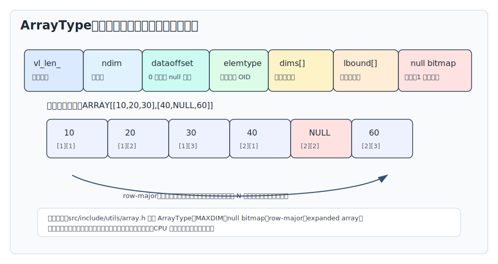
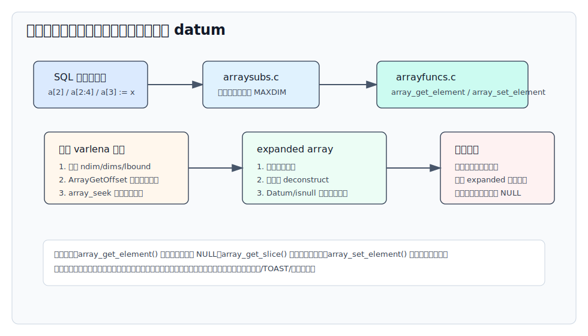
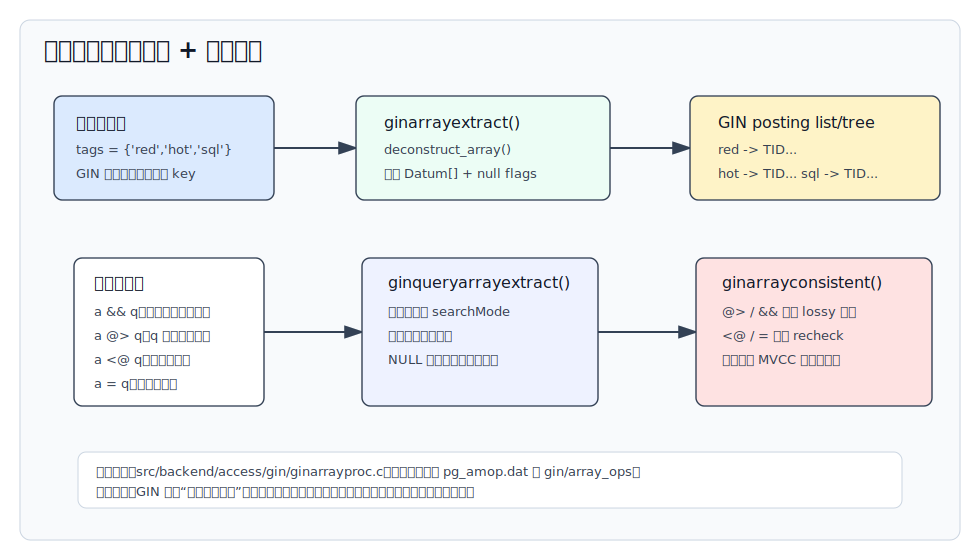
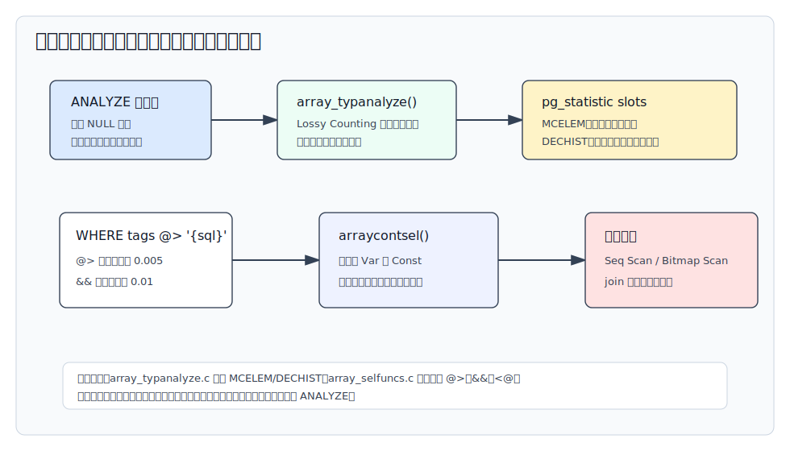
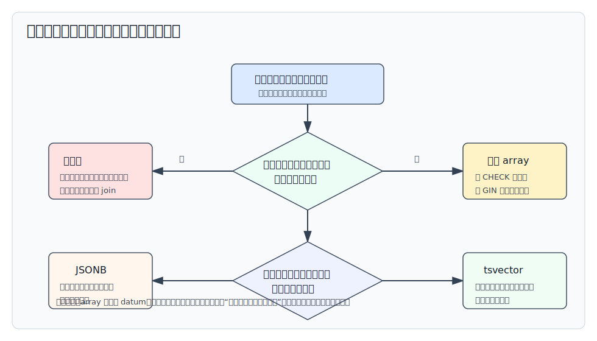

## 数据库筑基课 - array 数据类型
                                                                                            
### 作者                                                                
digoal                                                                
                                                                       
### 日期                                                                     
2026-05-26                                                      
                                                                    
### 标签                                                                  
PostgreSQL , 应用开发者 , DBA , 数据库筑基课 , 数据类型与算子 , array , GIN , 优化器统计  
                                                                                           
----                                                                    

## 背景
  

本节属于“数据类型与算子”基础能力。当前工作区没有发现“数据库筑基课”总纲文件，因此本文先独立成篇。

业务建模里经常会遇到“一个对象有多个同类值”的问题：

- 商品有多个标签。
- 用户有多个候选渠道。
- 订单有多个风控命中规则。
- 指标按季度、月份或固定位置保存一组数值。
- 查询参数里需要一次传入一组 ID、状态或枚举值。

最自然的冲动是建一张子表。但如果这组值小、同类型、随主行一起读写、很少作为独立实体维护，子表会带来额外 join、约束和写入路径。PostgreSQL 的 `array` 类型给了另一个选择：把一组同类型元素放进一个字段，并提供下标访问、切片、集合操作符、聚合函数、GIN 索引和优化器统计。

这不是“反范式万能药”。PostgreSQL 官方数组文档直接提醒：数组不是集合；如果经常搜索数组内单个元素，可能是数据库设计不当，拆成子表通常更容易搜索，也更能扩展。理解 array 的价值，关键不是会写 `integer[]`，而是知道它把成本转移到了哪里：单个 datum 的存储、TOAST、整行更新、元素扫描、GIN 倒排、统计信息和查询计划。

本文关键结论以本地 PostgreSQL 源码、官方 SGML 文档和 DeepWiki `postgres/postgres` 导航交叉核对。DeepWiki 用于定位源码脉络，机制性结论以源码和官方文档为准。

## 一、它解决什么问题？

`array` 解决的是“在一个关系字段里保存同类型、多值、有顺序和下界信息的数据”。

如果不用 array，常见做法有几种：

| 做法 | 优点 | 主要问题 |
|---|---|---|
| 子表一行一个元素 | 关系模型清晰；可外键、可单元素更新、可 join | 需要额外表和 join；小集合读写路径偏重 |
| 分隔字符串 | 简单、跨系统容易 | 类型丢失；转义复杂；难索引；约束弱 |
| JSONB 数组 | 适合半结构化文档 | 元素类型不如 SQL array 明确；数字、文本、对象混合后语义复杂 |
| `array` | 类型明确；表达紧凑；支持下标、切片、集合操作和 GIN | 单个 datum 更新；大数组随机访问和修改代价高；不适合复杂明细关系 |

因此，array 的核心价值是把“有限的同类型集合属性”变成一个原生 SQL 值：

```sql
CREATE TABLE items (
  id bigserial PRIMARY KEY,
  name text NOT NULL,
  tags text[] NOT NULL DEFAULT '{}',
  scores integer[] NOT NULL DEFAULT '{}'
);

SELECT *
FROM items
WHERE tags && ARRAY['database', 'postgres'];
```

它牺牲的是关系模型的细粒度：数组元素不能像子表行一样自然拥有主键、外键、行级审计、单独 MVCC 版本和独立统计。数组列更新时，数据库看到的是一个字段值变了，而不是某个“元素行”变了。

## 二、它是什么？

PostgreSQL 文档定义得很直接：表列可以声明为变长、多维数组，元素类型可以是内置类型、用户定义 base type、枚举、复合类型、range 或 domain。声明方式包括：

```sql
CREATE TABLE sal_emp (
  name text,
  pay_by_quarter integer[],
  schedule text[][]
);
```

几个容易误解的点：

1. `integer[3]` 和 `integer[]` 在当前实现里是同一种类型。声明中的长度限制不会被执行。
2. 声明中的维度数量也不会被执行。相同元素类型的数组，不因为声明了几维而成为不同类型。
3. 默认下标从 1 开始，但数组值本身可以保存其他下界，例如 `'[2:4]={10,20,30}'::int[]`。
4. 多维数组要求每一层 extent 一致，不能一行 2 个元素、另一行 3 个元素。
5. `cardinality()` 返回总元素数；`array_length(a, n)` 返回第 n 维长度，空数组时可能返回 NULL。

从类型系统看，array 是“某个元素类型的数组类型”。`pg_type.dat` 里大量 base type 通过 `array_type_oid` 自动生成数组类型。执行函数则通过 `anyarray`、`anycompatiblearray`、`anyelement` 这类多态伪类型复用同一套 C 实现。

## 三、核心原理

### 3.1 内部布局：varlena + 维度 + 下界 + 可选 null bitmap + 数据区

源码 `src/include/utils/array.h` 定义了标准变长数组的内存/磁盘表示：

```c
typedef struct ArrayType
{
  int32 vl_len_;
  int   ndim;
  int32 dataoffset;
  Oid   elemtype;
} ArrayType;
```

这个头后面紧跟：

- `dimensions[]`：每个维度的长度。
- `lower bounds[]`：每个维度的下界。
- `null bitmap`：可选。如果没有 NULL 元素，`dataoffset` 为 0，不保存位图。
- `actual data`：元素数据区，整体按 `MAXALIGN` 对齐，单个元素按元素类型对齐规则存放。

元素按 row-major 顺序保存，也就是最后一个下标变化最快。二维数组 `ARRAY[[10,20,30],[40,NULL,60]]` 的线性顺序是 `[1][1]`、`[1][2]`、`[1][3]`、`[2][1]`、`[2][2]`、`[2][3]`。



图 1 说明：array 的磁盘表示优先考虑紧凑性。它保留维度和下界，因此不是一个简单 C 数组；它可以有 NULL 位图，因此元素是否存在也属于值的一部分。对变长元素来说，定位第 N 个元素经常需要跳过前面的元素，这是后续访问代价的根源之一。

源码里还有几个重要边界：

- `MAXDIM` 是 6，超过 6 维会报错。
- `MaxArraySize` 受 `MaxAllocSize / sizeof(Datum)` 限制，避免很多分配路径溢出。
- 数组元素如果是 toastable 类型，数组内部不能保存 out-of-line toasted 指针；TOAST 只能理解整个数组 datum，而不知道数组内部还有元素。
- `oidvector` 和 `int2vector` 与普通数组存储兼容，但只支持一维、无 NULL，并且不支持 TOAST。

### 3.2 输入输出：先按数组语法解析，再调用元素类型 I/O

`src/backend/utils/adt/arrayfuncs.c` 中的 `array_in()` 是文本输入入口。它做的事情不是“按逗号 split 字符串”，而是：

1. 读取可选维度说明，例如 `[2:4]=...`。
2. 检查 `{...}` 数组结构。
3. 通过 `get_type_io_data()` 找到元素类型的输入函数、分隔符、长度、对齐信息。
4. 调用 `ReadArrayStr()` 解析嵌套花括号、引号、转义、NULL 和多维 extent。
5. 计算是否需要 null bitmap 和数据区字节数。
6. 构造最终 `ArrayType`。

这解释了两个工程细节：

- 数组文本分隔符来自元素类型的 `typdelim`。大多数内置类型用逗号，`box` 用分号。
- `'{NULL}'::text[]` 里未加引号的 `NULL` 是 SQL NULL 元素；`'{"NULL"}'::text[]` 才是字符串 `"NULL"`。

二进制输入由 `array_recv()` 负责。它同样会检查维度上限、元素类型、NULL 标记和元素收发函数。

### 3.3 下标、切片与更新：读路径可定位，写路径通常复制

SQL 下标表达式由 `src/backend/utils/adt/arraysubs.c` 接入执行器，真正访问和更新在 `arrayfuncs.c`：

- `array_get_element()`：按维度、下界和下标计算线性 offset，再从数据区取元素。
- `array_get_slice()`：取矩形切片，越界部分会被截断；结果下界重置为 1。
- `array_set_element()`：返回修改后的新数组；只有传入可读写 expanded array 时才可能原地更新。

普通数组取元素时，非法下标返回 NULL；赋值时，非法下标会报错。对一维数组，PostgreSQL 允许给现有范围外的位置赋值，中间空洞补 NULL；多维数组没有对应扩展行为。



图 2 说明：array 的读操作先把多维下标映射成线性 offset。平面 varlena 表示适合存储，但对变长元素和频繁修改不一定适合计算。expanded array 是 PostgreSQL 的内存优化路径，可以把数组拆成 `Datum[]` 和 `isnull[]`，让重复访问、PL/pgSQL 变量修改等场景少走平面格式扫描。

### 3.4 expanded array：为计算优化的内存表示

官方存储文档在 “Out-of-Line, In-Memory TOAST Storage” 中用 array 举例说明 expanded datum：标准 varlena array 紧凑，适合磁盘；但变长元素要找第 N 个值，只能扫描前面的元素。expanded 表示会把元素起始位置识别出来，甚至保存成 `Datum/isnull` 数组，适合计算。

源码 `array.h` 中的 `ExpandedArrayHeader` 保存：

- `ndims`、`dims`、`lbound`。
- 元素类型 OID、长度、byval、align 信息。
- `Datum *dvalues` 和 `bool *dnulls`。
- 可选的平面数组 `fvalue` 以及数据区起止指针。

`src/backend/utils/adt/array_expanded.c` 中的 `expand_array()`、`DatumGetExpandedArray()`、`deconstruct_expanded_array()` 负责转换和惰性拆解。普通函数如果只会 `PG_DETOAST_DATUM`，仍然能拿到传统平面表示；懂 expanded array 的函数则可以直接在内存对象上操作。

工程含义：不要把 “array 字段修改” 简化理解成总是逐字节重写整块内存。执行期有 expanded 优化。但一旦写回表行、写 WAL、更新索引，数据库持久化的仍是列值变化；大数组高频局部修改仍然不是 array 的舒适区。

### 3.5 比较、包含、重叠：集合语义不关心重复次数

数组有两类重要操作符。

第一类是普通比较：`=`、`<>`、`<`、`<=`、`>`、`>=`。官方函数文档说明，数组比较会按 row-major 顺序逐元素比较，使用元素类型默认 B-tree 比较函数；如果内容相同但维度信息不同，维度差异决定排序。

第二类是数组专用集合操作符：

| 操作符 | 含义 | 例子 |
|---|---|---|
| `@>` | 左数组是否包含右数组每个元素 | `ARRAY[1,4,3] @> ARRAY[3,1,3]` 为 true |
| `<@` | 左数组是否被右数组包含 | `ARRAY[2,2,7] <@ ARRAY[1,7,4,2,6]` 为 true |
| `&&` | 两个数组是否有共同元素 | `ARRAY[1,4,3] && ARRAY[2,1]` 为 true |
| `||` | 连接数组或一维数组与元素 | `ARRAY[1,2] || ARRAY[3]` |

`arrayfuncs.c` 中 `array_contain_compare()` 实现 `@>`、`<@`、`&&` 的核心逻辑。它使用元素类型的 equality operator，对数组元素做匹配。源码注释和官方文档都明确：重复元素不特殊处理，所以 `ARRAY[1]` 和 `ARRAY[1,1]` 互相包含。

NULL 元素要特别小心。`array_contain_compare()` 假定比较操作符是 strict，NULL 不能匹配任何东西。选择率估算代码也有对应逻辑：`column @> '{anything, null}'` 被估成 0，因为包含 NULL 元素无法按普通元素相等来满足。

### 3.6 GIN：把数组拆成元素倒排

GIN 的内置 `array_ops` 支持四个操作符：

- `&& (anyarray, anyarray)`
- `@> (anyarray, anyarray)`
- `<@ (anyarray, anyarray)`
- `= (anyarray, anyarray)`

目录定义在 `src/include/catalog/pg_amop.dat` 的 `gin/array_ops`，支持函数在 `src/backend/access/gin/ginarrayproc.c`。

写入索引时，`ginarrayextract()` 会复制数组输入，调用 `deconstruct_array()` 拆成元素数组，把每个元素作为 GIN key。查询时，`ginqueryarrayextract()` 根据操作符策略设置 search mode：

- `&&`：默认搜索，至少一个非 NULL 查询元素命中即可。
- `@>`：查询数组非空时默认搜索；空数组时使用 `GIN_SEARCH_MODE_ALL`，因为所有数组都包含空数组。
- `<@`：使用 `GIN_SEARCH_MODE_INCLUDE_EMPTY`，并需要 recheck。
- `=`：非空时默认搜索，空数组时 include empty，并需要 recheck。

`ginarrayconsistent()` 的 recheck 策略也很重要：

- `&&` 和 `@>` 可以根据 key 命中做非 lossy 判断，`recheck=false`。
- `<@` 和 `=` 需要 `recheck=true`，因为索引只能说明“候选行含有某些查询元素”，不能完整证明“候选数组没有其他元素”或“维度、重复、NULL 等整体语义完全相等”。



图 3 说明：GIN array_ops 的本质是元素倒排。它擅长回答“哪些行的数组里出现过这些元素”，但数组整体语义仍可能需要回表复查。MVCC 可见性也不在 GIN key 里，所以实际计划常见 Bitmap Index Scan + Bitmap Heap Scan。

### 3.7 统计信息：ANALYZE 会统计常见元素，不只统计整个数组

如果优化器只把整个数组当成一个标量值，`tags @> ARRAY['sql']` 的估算会很差：整数组合可能很少重复，但单个标签元素可能高度重复。PostgreSQL 为数组列提供专门 typanalyze。

`src/backend/utils/adt/array_typanalyze.c` 中的 `array_typanalyze()` 会：

1. 先调用标准 `std_typanalyze()`，保留数组整体比较需要的标量统计。
2. 找到元素类型的 equality、comparison 和 hash 函数。
3. 在 `compute_array_stats()` 中采样数组值，跳过 NULL 数组和过宽数组。
4. 用 Lossy Counting 算法跟踪 most common elements。
5. 每一行内重复出现的同一元素只计一次，因为 `@>`、`<@`、`&&` 的语义不关心重复次数。
6. 写入 `STATISTIC_KIND_MCELEM`，并写入 `STATISTIC_KIND_DECHIST` 表示每行不同元素数的直方图。

`src/backend/utils/adt/array_selfuncs.c` 中的 `arraycontsel()` 使用这些统计信息估算 `@>`、`&&`、`<@`。如果表达式不是 “Var op Const” 或 “Const op Var”，右侧不是常量，元素类型对不上，或统计不可用，就回退默认值：`@>` / `<@` 默认 0.005，`&&` 默认 0.01。join 选择率函数 `arraycontjoinsel()` 当前还是 stub，也返回默认值。



图 4 说明：数组列是否及时 `ANALYZE` 会影响计划质量。批量导入标签、权限集合、规则命中列表后，如果元素分布变化明显，优化器对 GIN Bitmap Scan、Seq Scan、join 顺序的判断可能偏离真实数据。

## 四、横向对比

| 维度 | PostgreSQL `array` | 子表一行一个元素 | JSONB 数组 | `tsvector` |
|---|---|---|---|---|
| 主要目标 | 同类型有限集合属性 | 关系型明细 | 半结构化文档 | 全文检索词项 |
| 元素类型 | 强类型、同类型 | 强类型，可多列 | 可混合，需运行期检查 | lexeme + 可选位置/权重 |
| 单元素更新 | 不自然，通常改整个 datum | 自然 | 可用函数改文档，但仍是文档值 | 不适合单元素业务更新 |
| 约束能力 | CHECK 可控长度/维度；元素级外键弱 | 外键、唯一、行级约束强 | 依赖表达式/检查约束 | 主要服务检索 |
| 搜索能力 | `@>`、`<@`、`&&`，GIN 支持 | 普通索引、join 灵活 | GIN JSONB 操作符 | GIN/GiST 全文语义 |
| 顺序/下标 | 原生支持 | 需 position 列 | JSON 数组有顺序 | 位置服务全文，不是业务下标 |
| 适合场景 | 小集合、随主行读写、集合过滤 | 大集合、高频单元素维护、强约束 | 键值差异大、文档结构 | 自然语言检索、排名、短语 |
| 不适合场景 | 明细关系、复杂 join、超长高频修改 | 极小固定集合读写可能偏重 | 强类型数值数组和维度计算 | 标签集合或普通多值字段 |

这张表背后的判断标准是：这个“多值”是不是独立业务实体？如果元素需要自己的生命周期、权限、审计、外键或高频局部修改，用子表。若只是主行的有限集合属性，array 更直接。



图 5 说明：array 的合理边界不是“能不能存多个值”，而是“这些值是否应该成为关系模型中的独立行”。数组越长、更新越频繁、约束越复杂、查询越像 join，越应该拆成子表或换专门类型。

## 五、效果如何？

array 的收益主要来自三个方面：

1. **模型紧凑**：小集合随主行保存，读一行就能拿到完整属性。
2. **表达力直接**：下标、切片、`unnest()`、`array_agg()`、`@>`、`&&` 等能力都是 SQL 原生。
3. **索引可用**：GIN `array_ops` 能把元素集合过滤变成倒排索引访问。

代价也必须提前算：

- **写放大**：更新数组元素通常意味着列值变化；行版本、TOAST、索引维护和 WAL 都要考虑。
- **CPU 扫描**：没有索引或需要函数遍历时，数组内元素仍要逐个比较。变长元素定位也更贵。
- **统计边界**：数组统计主要帮助常量查询的 `@>`、`&&`、`<@`；复杂表达式和 join 估算可能退回默认值。
- **索引维护成本**：一个数组行会产生多个 GIN key。数组元素越多，索引写入、pending list、VACUUM 和查询合并成本越高。
- **语义边界**：包含操作不关心重复次数；NULL 元素不能按普通等值匹配；维度和下界对整体相等/排序有影响。

不要给 array 制造固定性能数字。真实效果取决于数组长度、元素类型、NULL 比例、重复度、查询选择率、GIN pending list、表膨胀、缓存命中率和 autovacuum 状态。

## 六、实操 DEMO

下面 SQL 是面向 PostgreSQL 的最小可验证示例。本文未在当前环境启动 PostgreSQL 实例执行这些语句，因此不提供伪造输出；示例语法来自 PostgreSQL 官方文档和回归测试用例风格。

### 6.1 观察数组边界、下界与维度

```sql
SELECT array_ndims(ARRAY[[1,2,3],[4,5,6]]) AS ndims,
       array_length(ARRAY[[1,2,3],[4,5,6]], 1) AS dim1,
       array_length(ARRAY[[1,2,3],[4,5,6]], 2) AS dim2,
       cardinality(ARRAY[[1,2,3],[4,5,6]]) AS total_elems;

SELECT array_lower('[2:4]={10,20,30}'::int[], 1) AS lb,
       array_upper('[2:4]={10,20,30}'::int[], 1) AS ub,
       ('[2:4]={10,20,30}'::int[])[2] AS first_value;

SELECT array_length('{}'::int[], 1) AS empty_len,
       cardinality('{}'::int[]) AS empty_cardinality;
```

要观察三点：默认下界通常是 1，但值可以携带其他下界；`array_length()` 是按维度返回；`cardinality()` 是总元素数。

### 6.2 使用 GIN 支持标签集合过滤

```sql
DROP TABLE IF EXISTS item_demo;

CREATE TABLE item_demo (
  id bigserial PRIMARY KEY,
  name text NOT NULL,
  tags text[] NOT NULL DEFAULT '{}',
  CHECK (cardinality(tags) <= 16)
);

INSERT INTO item_demo (name, tags) VALUES
  ('postgres array', ARRAY['postgres','database','array']),
  ('postgres gin', ARRAY['postgres','database','gin']),
  ('redis cache', ARRAY['redis','cache']);

CREATE INDEX item_demo_tags_gin ON item_demo USING gin (tags);

ANALYZE item_demo;

EXPLAIN (ANALYZE, BUFFERS)
SELECT *
FROM item_demo
WHERE tags @> ARRAY['postgres'];

EXPLAIN (ANALYZE, BUFFERS)
SELECT *
FROM item_demo
WHERE tags && ARRAY['gin', 'cache'];
```

在小表上优化器可能仍选择 Seq Scan，这是合理的。要验证 GIN 路径，可以扩大数据量，或临时设置 `SET enable_seqscan = off;` 观察备选计划。正式压测不能用关闭 Seq Scan 的结果当性能结论。

### 6.3 数组转行与重新聚合

```sql
SELECT i.id, t.tag
FROM item_demo AS i
CROSS JOIN LATERAL unnest(i.tags) AS t(tag)
ORDER BY i.id, t.tag;

SELECT tag, count(*) AS n
FROM item_demo AS i
CROSS JOIN LATERAL unnest(i.tags) AS t(tag)
GROUP BY tag
ORDER BY n DESC, tag;

SELECT array_agg(tag ORDER BY tag) AS all_tags
FROM (
  SELECT DISTINCT t.tag
  FROM item_demo AS i
  CROSS JOIN LATERAL unnest(i.tags) AS t(tag)
) AS s;
```

`unnest()` 是把数组转回关系形态的常用桥梁。只要查询经常需要这样做并参与复杂 join，就要重新评估是否应该拆子表。

### 6.4 用约束给 array 建模加边界

```sql
CREATE TABLE user_channels (
  user_id bigint PRIMARY KEY,
  channels text[] NOT NULL DEFAULT '{}',
  CHECK (array_ndims(channels) IS NULL OR array_ndims(channels) = 1),
  CHECK (cardinality(channels) <= 8),
  CHECK (channels <@ ARRAY['app','web','partner','offline']::text[])
);
```

这里的 CHECK 表达了三个业务假设：一维、最多 8 个、只能取白名单值。它不能替代子表外键，但能避免 array 变成无边界垃圾桶。

## 七、最佳实践

### 面向数据库架构师

1. 把 array 定位为“有限集合属性”，不是子表替代品。元素是否有独立生命周期，是建模分界线。
2. 用 `CHECK` 固化维度、长度、白名单和空数组约定，例如 `cardinality(tags) <= 32`。
3. 如果数组元素来自另一张业务字典表，且必须强一致引用，优先拆子表。
4. 若需要自然语言检索、分词、排名、短语，不要用 `text[]` 冒充全文索引，应使用 `tsvector` 或外部搜索系统。

### 面向 DBA

1. 对 `@>`、`&&`、`<@` 的高频查询建立 GIN 索引：`CREATE INDEX ... USING gin (array_col);`。
2. 批量导入或元素分布变化后执行 `ANALYZE`，必要时提高数组列统计目标：

```sql
ALTER TABLE item_demo ALTER COLUMN tags SET STATISTICS 1000;
ANALYZE item_demo;
```

3. 监控 GIN 索引大小、pending list、autovacuum、表膨胀和 WAL。长数组频繁更新会把问题转成索引维护和版本清理。
4. 排查计划时同时看 `EXPLAIN (ANALYZE, BUFFERS)` 和 `pg_stats`。数组列的 `most_common_elems`、`most_common_elem_freqs`、`elem_count_histogram` 对选择率估算很关键。

### 面向业务开发者

1. 优先用 `ARRAY[...]` 构造数组，避免手写复杂字符串 literal。
2. 注意 `NULL` 元素和字符串 `"NULL"` 的区别。
3. 不要默认数组从 0 开始。PostgreSQL 默认从 1 开始，但值可携带非 1 下界。
4. `@>` 不是“包含相同次数”。`ARRAY[1] @> ARRAY[1,1]` 为 true，不能用它做 multiset 计数语义。
5. 如果经常 `unnest()` 后 join、聚合、过滤，说明关系模型可能应该显式建子表。

## 八、适合与不适合场景

适合：

- 标签、枚举集合、候选状态、少量渠道、少量特征开关。
- 固定位置的数值序列，例如一年 12 个月指标、四个季度值。
- SQL 参数传递，例如 `WHERE id = ANY($1::bigint[])`。
- 小集合过滤，配合 GIN 做 `@>` 或 `&&`。
- 聚合结果表达，例如 `array_agg()` 返回一组排序后的值。

不适合：

- 元素很多、增长无上限、频繁按单元素增删改。
- 元素需要外键、唯一约束、行级权限、审计字段或独立状态。
- 查询主要是 `unnest(array_col)` 后和其他表 join。
- 需要按元素位置做复杂范围查询或排序分页。
- 需要全文检索语义，例如分词、词形归一、权重、短语、排名。
- 需要精确表达重复次数的 multiset 语义。

## 九、常见坑

1. **把声明长度当约束**：`integer[3]` 不会限制只能存 3 个元素。要写 `CHECK (cardinality(a) = 3)`。
2. **把数组当集合表**：数组没有元素级 MVCC、外键和行级统计。复杂业务关系应拆表。
3. **忽略 NULL 语义**：NULL 元素不能按普通等值匹配；`@>` 包含 NULL 的查询很容易和直觉不一致。
4. **忘记 ANALYZE**：GIN 索引能提供访问路径，但优化器是否选择它依赖选择率估算。
5. **数组太长**：长数组会放大 GIN key 数量、TOAST 成本、WAL 和 vacuum 压力。
6. **误解重复元素**：`@>`、`<@`、`&&` 对重复元素不做多重计数。
7. **默认 0 下标**：PostgreSQL 默认 1 下标，且可保存非 1 下界。应用层映射要统一。
8. **用 `LIKE` 查数组输出文本**：不要把数组 cast 成 text 再字符串匹配；这会绕过类型语义和索引。
9. **把 `ANY(array)` 和数组包含混为一谈**：`x = ANY(tags)` 是标量对数组元素的比较；`tags @> ARRAY[x]` 是数组包含操作，优化器和索引路径不同。
10. **把 GIN 当覆盖索引**：GIN array_ops 保存元素 key，不保存完整数组值和 MVCC 可见性；实际查询常需访问 heap。

## 十、扩展问题

1. 如果一个 `text[] tags` 列平均 5 个元素，但 1% 的行有 5000 个元素，GIN 索引和选择率估算会受什么影响？
2. 为什么 `array_typanalyze()` 要对一行内重复元素去重后计数？这和 `@>` 的语义有什么关系？
3. `tags @> ARRAY['a','b']` 和 `tags && ARRAY['a','b']` 的选择率组合公式为什么不同？
4. 如果应用需要“至少出现两次某标签”的语义，array 操作符还能直接表达吗？
5. 什么时候 `jsonb` 数组比 SQL array 更合适？什么时候 `tsvector` 比 `text[]` 更合适？
6. 对高频更新的标签集合，为什么拆成子表可能比 array + GIN 更稳定？

## 十一、扩展阅读

- PostgreSQL 官方文档：`postgres/doc/src/sgml/array.sgml`，数组声明、输入输出、访问、修改、搜索和设计提示。
- PostgreSQL 官方文档：`postgres/doc/src/sgml/func/func-array.sgml`，数组操作符和函数。
- PostgreSQL 官方文档：`postgres/doc/src/sgml/gin.sgml`，内置 GIN `array_ops` 支持的操作符。
- PostgreSQL 官方文档：`postgres/doc/src/sgml/storage.sgml`，expanded TOAST datum 和 array 的计算型表示。
- PostgreSQL 源码：`postgres/src/include/utils/array.h`，`ArrayType`、`ExpandedArrayHeader`、`MAXDIM` 和数组布局。
- PostgreSQL 源码：`postgres/src/backend/utils/adt/arrayfuncs.c`，输入输出、下标、切片、比较、包含、`unnest()` 等实现。
- PostgreSQL 源码：`postgres/src/backend/utils/adt/array_expanded.c`，expanded array 转换和拆解。
- PostgreSQL 源码：`postgres/src/backend/utils/adt/arraysubs.c`，SQL subscripting 执行入口。
- PostgreSQL 源码：`postgres/src/backend/access/gin/ginarrayproc.c`，GIN array support functions。
- PostgreSQL 源码：`postgres/src/backend/utils/adt/array_typanalyze.c`，数组元素统计信息收集。
- PostgreSQL 源码：`postgres/src/backend/utils/adt/array_selfuncs.c`，数组包含/重叠选择率估算。
- PostgreSQL 目录数据：`postgres/src/include/catalog/pg_amop.dat`、`pg_proc.dat`、`pg_type.dat`，操作符族、函数和数组类型定义。
- PostgreSQL 回归测试：`postgres/src/test/regress/sql/arrays.sql`、`expected/arrays.out`，大量数组边界用例。
- DeepWiki：`postgres/postgres`，用于源码导航和架构脉络确认。

## 校验记录

- 标题、分类、结构已按“数据库筑基课 - array 数据类型”整理。
- 主要机制均落到 PostgreSQL 官方文档、源码路径或 DeepWiki 导航后源码验证。
- SQL 示例未在当前环境执行，文中已明确说明不提供执行输出。
- 没有编造性能数字；性能讨论只给出收益、代价和验证方法。
- SVG 图均为独立文件，使用相对路径引用，不包含 JavaScript、`foreignObject`、外部图片或远程 CSS。
  
## 附录  
  
1、克隆代码  
```  
git clone --depth 1 https://github.com/postgres/postgres
```  
  
2、启用 codex, 使用 [数据库筑基课 skill](../skills/README.md).  
````
文章标题: 
  数据库筑基课 - array 数据类型
项目源码(已克隆到当前项目如下目录中):  
  postgres
项目 deepwiki reponame:  
  postgres/postgres
项目参考信息: 
  postgres/CLAUDE.md
````
  
  
  
#### [PostgreSQL 解决方案集合](../201706/20170601_02.md "40cff096e9ed7122c512b35d8561d9c8")
  
  
#### [德哥 / digoal's Github - 公益是一辈子的事.](https://github.com/digoal/blog/blob/master/README.md "22709685feb7cab07d30f30387f0a9ae")
  
  
#### [About 德哥](https://github.com/digoal/blog/blob/master/me/readme.md "a37735981e7704886ffd590565582dd0")
  
  

  
