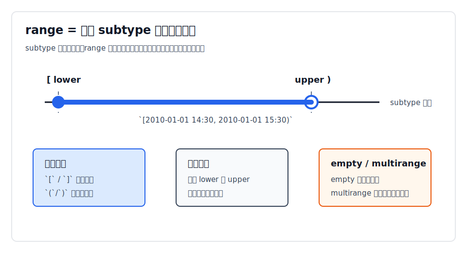
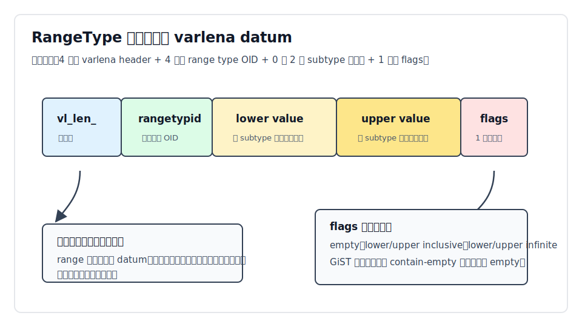
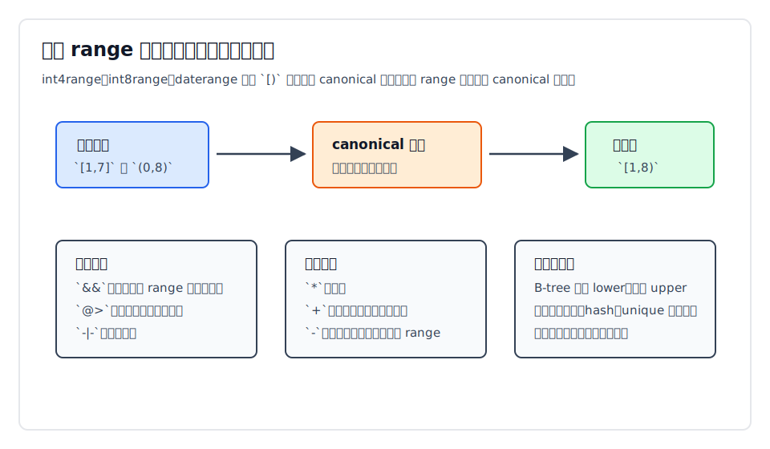
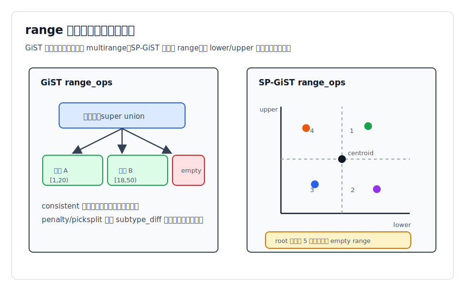
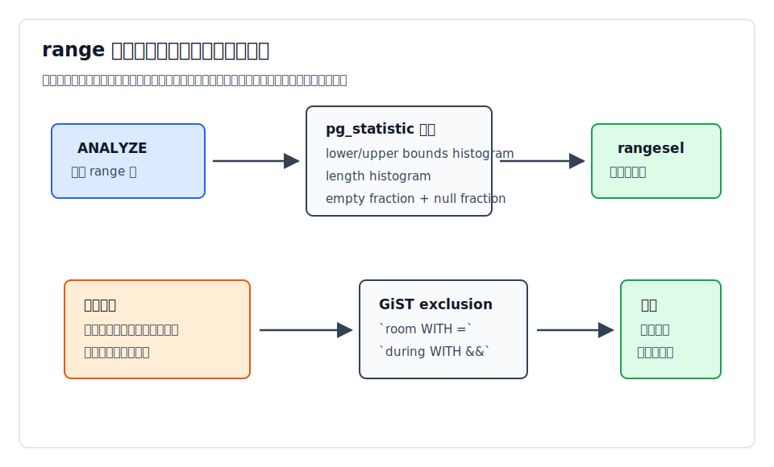

## 数据库筑基课 - range 数据类型
                                                                                            
### 作者                                                                
digoal                                                                
                                                                       
### 日期                                                                     
2026-05-26                                                      
                                                                    
### 标签                                                                  
PostgreSQL , 应用开发者 , DBA , 数据库筑基课 , 数据类型与算子 , range , multirange , GiST , SP-GiST , exclusion constraint  
                                                                                           
----                                                                    

## 背景
  

本节属于“数据类型与算子”基础能力。当前工作区没有发现“数据库筑基课”总纲文件，因此本文先独立成篇。

很多业务问题本质上不是“一个点”，而是“一段区间”：

- 会议室在某个时间段被占用。
- 商品价格在某个有效期内生效。
- IP、号码、金额、年龄、里程、温度落在某个区间内。
- 慢变维表保存一个实体在多个时间段里的版本。
- 时态主键要求同一个业务键的有效期不能重叠。

如果只用两个普通列 `start_at`、`end_at`，应用就要自己处理开闭边界、无穷边界、空区间、重叠判断、相邻合并、索引选择和并发冲突。问题看起来简单，实际很容易出现边界 bug：`BETWEEN` 是否包含右端点？`end_at = next_start_at` 算不算冲突？`NULL` 是未知还是无穷？两个事务同时插入相交时间段时谁来拦截？

PostgreSQL 的 `range` 类型把这些问题收进类型系统：一个列值表达一个有序 subtype 上的连续值域，并提供清晰的操作符、函数、GiST/SP-GiST 索引、统计信息和排他约束。它不是“两个列的语法糖”。它的价值在于让数据库理解“这是一段区间”，从而能参与优化器估算、索引搜索和一致性约束。

本文关键结论以本地 PostgreSQL 源码、官方 SGML 文档和 DeepWiki `postgres/postgres` 导航交叉核对。DeepWiki 用于定位源码脉络，机制性结论以源码和官方文档为准。

## 一、它解决什么问题？

`range` 解决的是“用一个 SQL 值表达一段连续区间，并让数据库理解区间关系”。

不用 `range` 时，常见做法如下：

| 做法 | 优点 | 主要问题 |
|---|---|---|
| `start_col` + `end_col` 两列 | 跨数据库；容易理解 | 开闭边界、无穷边界、空区间和重叠判断都要手写；约束难写严密 |
| 文本保存区间 | 接入简单 | 类型丢失；排序和比较不可靠；难索引 |
| JSONB 保存 `{from,to}` | 适合接口原样入库 | 约束、统计、索引和运算语义弱于原生类型 |
| 子表保存多个区间 | 可表达多段区间 | 单段场景过重；重叠约束仍要依赖索引或触发器 |
| `range` / `multirange` | 类型语义明确；操作符丰富；可用 GiST/SP-GiST；可做排他约束 | 需要理解 canonical、empty、索引代价和统计边界 |

最典型的业务价值是防重叠：

```sql
CREATE EXTENSION IF NOT EXISTS btree_gist;

CREATE TABLE room_reservation (
  room text NOT NULL,
  during tsrange NOT NULL,
  EXCLUDE USING gist (room WITH =, during WITH &&)
);
```

这条约束的意思是：如果两行 `room` 相等，`during` 不能重叠。它把“会议室同一时间不能被两次预约”变成数据库级并发约束，而不是应用层先查再插的脆弱逻辑。

## 二、它是什么？

官方文档把 `range` 定义为：表示某个元素类型的一段值域的数据类型；这个元素类型称为 subtype。subtype 必须有全序，否则无法判断一个元素是否在区间内、在区间前方还是后方。

PostgreSQL 内置 6 组 range/multirange：

| range | multirange | subtype | 离散/连续 | canonical |
|---|---|---|---|---|
| `int4range` | `int4multirange` | `integer` | 离散 | 有 |
| `int8range` | `int8multirange` | `bigint` | 离散 | 有 |
| `daterange` | `datemultirange` | `date` | 离散 | 有 |
| `numrange` | `nummultirange` | `numeric` | 连续 | 无 |
| `tsrange` | `tsmultirange` | `timestamp` | 连续处理 | 无 |
| `tstzrange` | `tstzmultirange` | `timestamptz` | 连续处理 | 无 |

几个基础术语必须先分清：

- `lower` / `upper`：下界和上界。
- inclusive / exclusive：`[` 和 `]` 包含端点，`(` 和 `)` 不包含端点。
- unbounded：省略某一侧边界，例如 `(,3]` 或 `[today,)`。
- `empty`：空区间，不包含任何点。它不是 SQL `NULL`。
- `multirange`：有序、非连续、非空、非 NULL range 的列表。每个 range 类型都有对应 multirange 类型。



图 1 说明：range 的关键不是“两个值”，而是 subtype 的排序、边界开闭和特殊状态共同构成一个值。`empty` 没有上下界；multirange 则把多个不连续片段组织成一个值。

## 三、核心原理

### 3.1 物理表示：varlena + range OID + 可选边界 + flags

源码 `src/include/utils/rangetypes.h` 定义：

```c
typedef struct
{
    int32       vl_len_;
    Oid         rangetypid;
    /* Following the OID are zero to two bound values, then a flags byte */
} RangeType;
```

`src/backend/utils/adt/rangetypes.c` 顶部注释给出实际存储格式：

1. 4 字节 varlena header。
2. 4 字节 range 类型自身 OID。
3. 可选 lower boundary value，按 subtype 的 `typalign` 对齐。
4. 可选 upper boundary value，按 subtype 的 `typalign` 对齐。
5. 1 字节 flags。

flags 里记录 `RANGE_EMPTY`、`RANGE_LB_INC`、`RANGE_UB_INC`、`RANGE_LB_INF`、`RANGE_UB_INF` 等状态。GiST 内部页还使用 `RANGE_CONTAIN_EMPTY` 标记子树里是否含有 empty range，用来支持 contained-by、equality 等搜索。



图 2 说明：range 是一个单独 varlena datum，不是两列拼接。这样它才能绑定到 `pg_range` 系统目录、类型缓存、I/O 函数、操作符、索引操作类和统计信息上。

### 3.2 输入输出：先解析区间语法，再调用 subtype I/O

文本输入入口是 `range_in()`。它的路径是：

1. `range_parse()` 解析 `empty` 或 `(`、`[`、`,`、`]`、`)` 形式。
2. 对存在的上下界调用 subtype 输入函数。
3. 构造 `RangeBound` 内存结构。
4. `make_range()` 序列化，并在需要时调用 canonical 函数。

因此 range literal 不是简单字符串切分。边界值里如果有逗号、括号、方括号、双引号或反斜杠，需要按文档规则引用或转义。

构造函数比 literal 更适合写业务 SQL：

```sql
SELECT tsrange(
  timestamp '2026-05-26 09:00',
  timestamp '2026-05-26 10:00',
  '[)'
);

SELECT daterange(date '2026-01-01', date '2026-02-01'); -- 默认 `[)`
```

如果任一边界参数为 `NULL`，构造出的 range 在该侧无界，而不是边界值为 SQL `NULL`。

### 3.3 canonical：离散区间必须把等价表达统一

离散 subtype 有明确的 next/previous 概念。例如 integer 上 `[1,7]`、`[1,8)`、`(0,8)` 表示同一组整数。如果不规范化，这些值会被当作不同表示，影响相等判断、索引和约束。

内置离散 range 的 canonical 定义在 `pg_range.dat`：

- `int4range` 使用 `int4range_canonical`。
- `int8range` 使用 `int8range_canonical`。
- `daterange` 使用 `daterange_canonical`。

连续 range 通常没有 canonical 函数，例如 `numrange`、`tsrange`、`tstzrange`。原因是连续类型通常不存在业务上统一的“下一步”。虽然 timestamp 实现上有有限精度，但文档建议按连续类型理解，因为步长通常不是业务语义的一部分。



图 3 说明：canonical 的目标不是“把所有 range 都变成 `[)`”，而是让同一个 range 类型内等价的离散值有唯一表示。自定义 range 如果 subtype 是离散的，应该提供 canonical 函数。

### 3.4 操作符：数据库直接理解区间关系

range 的常用操作符包括：

| 操作符 | 含义 | 典型用途 |
|---|---|---|
| `@>` | 左 range 包含右 range 或元素 | 某时刻是否落在有效期内 |
| `<@` | 左 range 被右 range 包含 | 某区间是否在权限/合同范围内 |
| `&&` | 两个 range 是否重叠 | 预约冲突、版本有效期冲突 |
| `<<` / `>>` | 严格在左侧 / 右侧 | 快速排除不相交区间 |
| `&<` / `&>` | 不延伸到右侧 / 左侧 | 边界型过滤 |
| `-|-` | 是否相邻 | 区间合并前判断 |
| `+` | 并集，要求重叠或相邻 | 合并单段区间 |
| `*` | 交集 | 取共同有效期 |
| `-` | 差集，结果必须仍是单 range | 剪掉一侧或重叠端 |

源码中的 `range_overlaps_internal()`、`range_contains_internal()`、`range_adjacent_internal()`、`range_union_internal()`、`range_minus_internal()` 等函数都先 `range_deserialize()` 出上下界，再通过 subtype 比较函数判断边界关系。

一个重要边界：`+` 和 `-` 的结果类型仍是单个 range。如果两个不相邻 range 做 `+`，或者一个 range 减去中间一段后会裂成两段，普通 range 运算不能表示这种结果。需要多段结果时，应使用 multirange 或 `range_minus_multi()` 这类路径。

### 3.5 GiST：用包围区间组织子树

文档明确：range 列可建 GiST 和 SP-GiST 索引，multirange 列可建 GiST 索引。GiST range_ops 支持 `=`, `&&`, `<@`, `@>`, `<<`, `>>`, `-|-`, `&<`, `&>`，还支持 range 与 multirange 的交叉操作。

GiST 的核心不是把每个值线性排序，而是在内部页保存“能覆盖子树所有 range 的 super union”。`src/backend/utils/adt/rangetypes_gist.c` 里的 `range_super_union()` 与普通 `range_union` 有两个关键差异：

1. 即使两个 range 不相邻，也会吸收中间空隙形成覆盖区间，而不是报错。
2. 会追踪子树是否包含 empty range，以便某些搜索不能错误剪枝。

`range_gist_consistent()` 在内部页和叶子页分别判断是否需要继续下探。`range_gist_picksplit()` 会按 range 类别、无穷边界、empty 状态和上下界排序做分裂。`subtype_diff` 不是正确性的必要条件，但文档和源码都指向同一个结论：有它，GiST/SP-GiST 的代价估算和分裂通常更有效率。

### 3.6 SP-GiST：把 range 映射成 lower/upper 二维点

`src/backend/utils/adt/rangetypes_spgist.c` 的文件注释很直观：SP-GiST range_ops 实现的是“ranges mapped to 2d-points”的 quad tree。

映射方式：

- lower bound 是横轴。
- upper bound 是纵轴。
- picksplit 用 lower 和 upper 的中位数构造 centroid。
- 每个非空 range 按相对 centroid 的位置进入 4 个象限之一。
- empty range 没有上下界，root 可以有第 5 个分支专门保存 empty。



图 4 说明：GiST 更像“子树包围盒”，SP-GiST 更像“二维空间划分”。GiST 支持 range 和 multirange，且是排他约束的常用选择；SP-GiST 只支持 range，但在数据分布适合空间划分时可以减少重叠访问。

### 3.7 统计与选择率：ANALYZE 不只看整个值

range 查询如果没有统计信息，优化器只能退回默认选择率。`src/backend/utils/adt/rangetypes_typanalyze.c` 为 range/multirange 提供专门统计：

- `STATISTIC_KIND_BOUNDS_HISTOGRAM`：采样 lower 和 upper，分别排序，再组合成 bounds histogram。
- `STATISTIC_KIND_RANGE_LENGTH_HISTOGRAM`：用 `subtype_diff` 计算长度分布；没有 `subtype_diff` 时长度默认按 `1.0` 处理。
- empty fraction：统计非 NULL 值中 empty range 的比例。
- null fraction 和平均宽度。

`src/backend/utils/adt/rangetypes_selfuncs.c` 的 `rangesel()` 使用这些统计估算 `&&`、`@>`、`<@`、`<<`、`>>` 等操作符选择率。对于 `range @> element`，源码会把元素常量转换成包含单点的 range，再复用 range 选择率逻辑。



图 5 说明：range 的可优化性来自“边界直方图 + 长度直方图 + empty 比例”。如果数据分布变化很快、统计目标太低或 subtype 没有可靠 `subtype_diff`，范围查询的计划可能明显偏离真实选择率。

## 四、横向对比

| 维度 | range | 两列 start/end | multirange | array / JSONB |
|---|---|---|---|---|
| 主要目标 | 单段连续区间 | 手写区间模型 | 多段非连续区间 | 多值或半结构化属性 |
| 边界语义 | 原生支持开闭、无界、empty | 需要约定和约束 | 原生支持多个 range 片段 | 需要应用解释 |
| 操作符 | `@>`, `&&`, `<@`, `-|-`, `+`, `*`, `-` | 手写比较表达式 | 大部分 range 操作也可用 | 依类型和索引而定 |
| 索引支持 | GiST、SP-GiST；B-tree/hash 主要服务相等和内部需求 | 普通 B-tree，复杂重叠查询不自然 | GiST | GIN/GiST/B-tree 视类型而定 |
| 约束能力 | 排他约束、`WITHOUT OVERLAPS` | 需要复杂 exclusion 表达式或触发器 | 可用于 `WITHOUT OVERLAPS` | 通常不适合直接表达重叠约束 |
| 统计信息 | bounds/length histogram、empty fraction | 标量统计分散在两列 | 以覆盖整个 multirange 的最小 range 做统计 | 依类型而定 |
| 适合场景 | 预约、有效期、价格区间、测量范围 | 简单跨库模型、少量点查 | 一行内保存多个非连续有效片段 | 标签、文档属性、接口原样入库 |
| 不适合场景 | 需要表达多段结果或区间内部复杂属性 | 需要强区间语义和并发约束 | 需要对每段做独立行级审计 | 需要数据库理解连续区间关系 |

公平地说，两列模型不是错误。它在跨数据库、ORM 简单映射、只有少量等值/范围过滤时足够好。range 的优势出现在业务真正依赖区间语义时：重叠、包含、相邻、合并、排他约束和优化器能否理解谓词。

## 五、效果如何？

收益主要体现在四个方面：

1. 语义收益：`during && tsrange(...)` 比 `start_at < end2 AND end_at > start2` 更不容易写错，也能统一处理开闭边界和无界端。
2. 约束收益：`EXCLUDE USING gist (... WITH &&)` 能在数据库层拦截并发冲突。
3. 优化收益：GiST/SP-GiST 操作类让 overlap/contains 类查询有可用索引路径；ANALYZE 为 range 提供专门统计。
4. 建模收益：`multirange` 可表达一个值内的多个不连续片段，避免把“多段有效期”硬塞进 JSON 或字符串。

代价也要明确：

1. 写入代价：GiST/SP-GiST 索引维护比普通 B-tree 更重，排他约束还需要冲突检查。
2. 空间代价：range 是 varlena，边界值和 flags 有额外元数据；索引内部页保存覆盖范围，可能有重叠和空隙。
3. 估算风险：没有 `subtype_diff` 或统计不足时，长度分布估算会弱。
4. 表达边界：普通 range 只能表示单段连续区间；非连续结果需要 multirange。
5. 迁移成本：应用和团队要统一使用 `[)`、`empty`、无界端和 canonical 约定。

## 六、实操 DEMO

以下 SQL 根据 PostgreSQL 官方文档和回归测试整理，语法可执行；本文没有连接本地 PostgreSQL 实例运行，因此不提供伪造输出。

### 6.1 基本建模与查询

```sql
CREATE TABLE reservation (
  id bigserial PRIMARY KEY,
  room text NOT NULL,
  during tsrange NOT NULL
);

INSERT INTO reservation(room, during) VALUES
  ('A101', tsrange('2026-05-26 09:00', '2026-05-26 10:00', '[)')),
  ('A101', tsrange('2026-05-26 10:00', '2026-05-26 11:00', '[)')),
  ('B201', tsrange('2026-05-26 09:30', '2026-05-26 10:30', '[)'));

-- 查询 09:30 时刻正在占用的会议室
SELECT *
FROM reservation
WHERE during @> timestamp '2026-05-26 09:30';

-- 查询与目标时间段重叠的预约
SELECT *
FROM reservation
WHERE during && tsrange('2026-05-26 09:45', '2026-05-26 10:15', '[)');
```

### 6.2 索引与执行计划验证

```sql
CREATE INDEX reservation_during_gist
ON reservation USING gist (during);

ANALYZE reservation;

EXPLAIN
SELECT *
FROM reservation
WHERE during && tsrange('2026-05-26 09:45', '2026-05-26 10:15', '[)');
```

如果表足够大且选择率合适，计划可能选择 GiST 索引路径。小表上选择顺序扫描是正常的，因为随机访问和索引启动成本可能高于扫全表。

### 6.3 排他约束防止同房间时间重叠

```sql
CREATE EXTENSION IF NOT EXISTS btree_gist;

CREATE TABLE room_reservation (
  room text NOT NULL,
  during tsrange NOT NULL,
  EXCLUDE USING gist (room WITH =, during WITH &&)
);

INSERT INTO room_reservation VALUES
  ('A101', tsrange('2026-05-26 09:00', '2026-05-26 10:00', '[)'));

-- 相邻不重叠，可以写入
INSERT INTO room_reservation VALUES
  ('A101', tsrange('2026-05-26 10:00', '2026-05-26 11:00', '[)'));

-- 重叠，应被排他约束拒绝
INSERT INTO room_reservation VALUES
  ('A101', tsrange('2026-05-26 09:30', '2026-05-26 10:30', '[)'));
```

### 6.4 自定义 range 类型

```sql
CREATE TYPE floatrange AS RANGE (
  subtype = float8,
  subtype_diff = float8mi
);

SELECT '[1.234,5.678]'::floatrange;
```

如果自定义 subtype 是离散的，应再提供 `canonical` 函数。否则两个等价但边界写法不同的值可能不会规范成同一个表示。

## 七、最佳实践

面向数据库架构师：

- 把 range 用在“连续区间是业务事实”的字段上，而不是为了少建两列。
- 对时间有效期优先统一 `[)`，避免右端点重复归属。
- 需要同一实体内不重叠时，用 `EXCLUDE USING gist` 或支持的 `WITHOUT OVERLAPS` 语法，而不是应用层先查再插。
- 多段非连续语义优先考虑 multirange，避免把多个 range 串成文本。

面向 DBA：

- 对 `&&`、`@>`、`<@` 高频查询建立 GiST 或 SP-GiST 索引，并用真实数据验证计划。
- 排他约束通常依赖 GiST；标量列与 range 组合时，按文档使用 `btree_gist`。
- 建索引后执行 `ANALYZE`，必要时提高 range 列的 statistics target。
- 关注 empty range 的业务含义。empty 不是 NULL，它会影响选择率和某些操作符行为。

面向业务开发者：

- 用构造函数 `tsrange(lower, upper, '[)')`，少手写复杂 literal。
- 不要把无界端和 SQL `NULL` 混为一谈。构造函数参数为 `NULL` 表示该侧无界；列值为 `NULL` 表示整个 range 未知。
- 写查询时优先使用 range 操作符，不要重复手写 `lower()`/`upper()` 比较，除非有明确优化理由。
- 对相邻是否冲突做显式业务定义。`[09:00,10:00)` 和 `[10:00,11:00)` 不重叠，但它们相邻。

## 八、适合与不适合场景

适合：

- 会议室、设备、人员排班、库存锁定等预约场景。
- 价格、合同、权限、配置的有效期。
- 地理以外的一维测量范围，例如温度、金额、年龄、里程。
- 慢变维、时态主键、同一业务键下有效期不能重叠。
- 需要以 `&&`、`@>`、`<@` 为核心谓词的查询。

不适合：

- 区间只是展示字段，数据库不需要查询、约束或计算它。
- 需要频繁修改区间内部的多个子段，且每段要独立审计或关联其他实体。
- 区间是二维或多维空间问题。range 是一维值域，空间数据应考虑 PostGIS 或几何类型。
- subtype 没有合理全序，或者排序规则不是业务希望的“区间顺序”。
- 团队无法统一开闭边界和 empty 语义，导致同一业务混用 `[ ]`、`[)`、`NULL`、特殊日期哨兵值。

## 九、常见坑

1. 把 `empty` 当成 `NULL`。`empty` 是确定的空集合，`NULL` 是未知值。操作符和统计对二者处理不同。
2. 忽略 canonical。离散 range 如果没有 canonical，等价区间可能相等性不一致。自定义离散 range 时尤其危险。
3. 对时间区间使用闭区间。`[start,end]` 容易让相邻区间在端点处重叠；有效期建模通常更适合 `[start,end)`。
4. 用 B-tree 索引期待加速 overlap。文档明确 B-tree/hash 对 range 主要有用的是相等、排序和内部需求；`&&` 等应考虑 GiST/SP-GiST。
5. 忽略 `subtype_diff`。自定义 range 没有 `subtype_diff` 仍可工作，但 GiST/SP-GiST 和统计长度估算可能明显变差。
6. 用排他约束组合普通标量列时忘记 `btree_gist`。默认 GiST 支持 range 类型，普通 text/int 等 equality 通常要扩展提供操作类。
7. 低估小表顺序扫描。建了 GiST 索引不代表所有查询都会用它；优化器会比较成本。
8. 把 multirange 当 array of range。multirange 有规范化、排序、非连续片段语义，不是任意数组容器。

## 十、扩展问题

1. 如果你的系统现在用 `start_at`/`end_at` 两列，哪些 bug 是由边界开闭不一致造成的？
2. 业务上“相邻”是否允许？如果允许，应统一 `[)` 还是用额外间隔规则？
3. 你的排他约束需要立即检查还是可延迟检查？并发写入冲突时业务如何重试？
4. 自定义 range 的 subtype 是否真的有全序？排序规则和业务语义是否一致？
5. 查询主要是“点落在区间内”，还是“区间与区间重叠”？这会影响索引和统计验证方式。
6. 是否需要保存多个不连续片段？如果是，multirange、子表、还是事件表更适合？

## 十一、扩展阅读

- `postgres/doc/src/sgml/rangetypes.sgml`：官方 range/multirange 概念、内置类型、离散 range、索引、排他约束。
- `postgres/doc/src/sgml/func/func-range.sgml`：range/multirange 操作符和函数列表。
- `postgres/doc/src/sgml/ref/create_table.sgml`：`EXCLUDE`、`WITHOUT OVERLAPS`、时态键相关语法说明。
- `postgres/src/include/utils/rangetypes.h`：`RangeType`、`RangeBound`、flags 和策略号定义。
- `postgres/src/backend/utils/adt/rangetypes.c`：range I/O、canonical、操作符和支持函数实现。
- `postgres/src/backend/utils/adt/multirangetypes.c`：multirange 输入输出和操作实现。
- `postgres/src/backend/utils/adt/rangetypes_gist.c`：range GiST 操作类实现。
- `postgres/src/backend/utils/adt/rangetypes_spgist.c`：range SP-GiST quad tree 实现。
- `postgres/src/backend/utils/adt/rangetypes_typanalyze.c`：range/multirange 统计信息采集。
- `postgres/src/backend/utils/adt/rangetypes_selfuncs.c`：range 操作符选择率估算。
- `postgres/src/include/catalog/pg_range.dat`：内置 range 与 multirange 的系统目录初始定义。
- `postgres/src/include/catalog/pg_amop.dat`、`postgres/src/include/catalog/pg_amproc.dat`：range/multirange 索引操作类目录定义。
- `postgres/src/test/regress/sql/rangetypes.sql`、`postgres/src/test/regress/sql/multirangetypes.sql`：官方回归测试中的语义、索引和边界案例。
- DeepWiki `postgres/postgres`：用于导航源码架构；本文机制性结论已回查本地源码。
  
## 附录  
  
1、克隆代码  
```  
git clone --depth 1 https://github.com/postgres/postgres
```  
  
2、启用 codex, 使用 [数据库筑基课 skill](../skills/README.md).  
````
文章标题: 
  数据库筑基课 - range 数据类型
项目源码(已克隆到当前项目如下目录中):  
  postgres
项目 deepwiki reponame:  
  postgres/postgres
项目参考信息: 
  postgres/CLAUDE.md
````
  
  
#### [PostgreSQL 解决方案集合](../201706/20170601_02.md "40cff096e9ed7122c512b35d8561d9c8")
  
  
#### [德哥 / digoal's Github - 公益是一辈子的事.](https://github.com/digoal/blog/blob/master/README.md "22709685feb7cab07d30f30387f0a9ae")
  
  
#### [About 德哥](https://github.com/digoal/blog/blob/master/me/readme.md "a37735981e7704886ffd590565582dd0")
  
  

  
