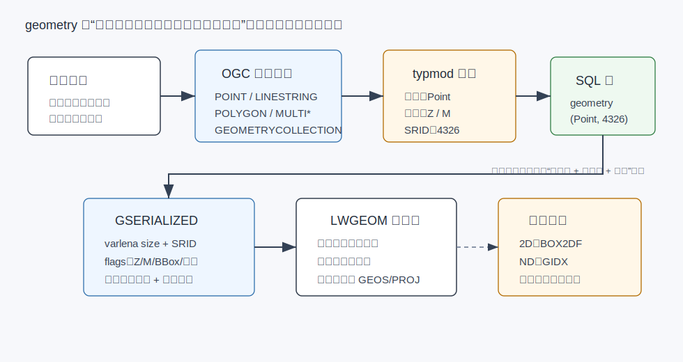
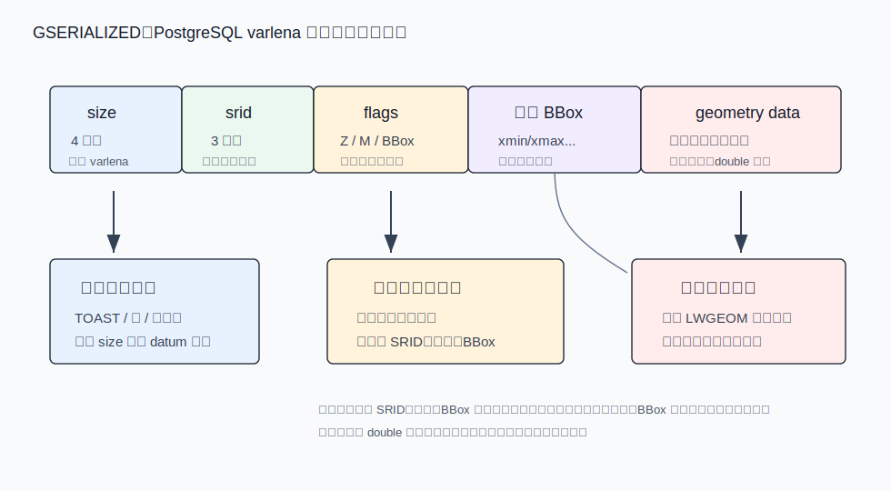
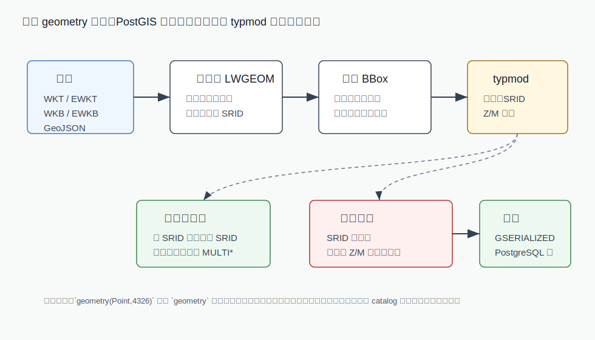
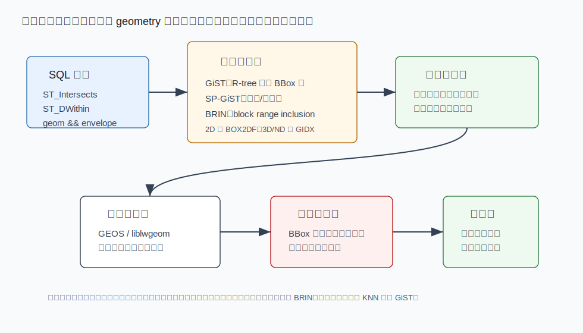

## 数据库筑基课 - geometry 数据类型
                                                                                            
### 作者                                                                
digoal                                                                
                                                                       
### 日期                                                                     
2026-05-26                                                      
                                                                    
### 标签                                                                  
PostgreSQL , 应用开发者 , DBA , 数据库筑基课 , 数据类型与算子 , geometry , 空间数据 , GiST , SP-GiST , BRIN  
                                                                                           
----                                                                    

## 背景
  


本节属于“数据类型与算子”基础能力。当前工作区没有发现“数据库筑基课”总纲文件，因此本文先独立成篇。

很多业务表一开始只存经纬度：

- 门店表有 `longitude`、`latitude` 两列，要找 3 公里内最近门店。
- 围栏表把多边形存成 JSON，应用层循环判断车辆是否进入区域。
- 地块、管线、道路、配送区域用字符串保存，数据库只能做文本等值和模糊匹配。
- 轨迹点越来越多后，范围查询、相交判断、最近邻搜索都变成全表扫描。

这些做法的问题不在于“坐标不能存”，而在于数据库不知道这些数字共同表达了一个空间对象。PostGIS 的 `geometry` 把问题变成：**把空间对象作为一等数据类型存储，并让类型、SRID、维度、边界框、操作符、索引和优化器形成一套闭环。**

本文关键结论以本地 PostGIS 源码、PostGIS 文档源码和 `postgis/CLAUDE.md` 核对。DeepWiki `postgis/postgis` 已读取到 “Core Data Types / Geometry Type” 等架构页面，但只作为源码导航辅助，不作为未核验事实来源。

## 一、它解决什么问题？

`geometry` 解决的是“平面空间对象如何进入数据库类型系统”的问题。

如果没有 `geometry`，常见替代方案有三类：

| 做法 | 优点 | 主要问题 |
|---|---|---|
| 拆成 `x/y` 或 `lon/lat` 数值列 | 简单，B-tree 能处理单列范围 | 无法表达线、面、集合；距离、相交、包含需要应用层实现；索引不能理解空间关系 |
| 存 WKT/GeoJSON 文本 | 保留对象结构，和外部系统兼容 | 数据库只知道它是字符串；每次计算都要解析；难以做 typmod 约束和空间索引 |
| EAV/点表拆边界 | 灵活，可表达复杂对象 | 拓扑、合法性、聚合、索引和事务一致性都复杂，开发成本高 |

`geometry` 的折中是：

- 用 SQL 类型承载 Point、LineString、Polygon、Multi*、GeometryCollection 等对象。
- 用 typmod 描述列级约束，例如 `geometry(Point,4326)`、`geometry(MultiPolygonZ,3857)`。
- 用 GSERIALIZED 保存 SRID、维度、可选 bounding box 和递归几何数据。
- 用 `&&`、`&&&`、`@`、`~`、`<->` 等操作符接入 GiST、SP-GiST、BRIN 等索引。
- 用 PostGIS 函数体系提供构造、输出、测量、关系、叠加、校验、投影转换。

代价也要先讲清楚：`geometry` 默认是平面几何。它不会自动把经纬度当成球面距离来计算。SRID 是元数据和坐标参考系统标识，不会让两个不同 SRID 的对象自动变成同一坐标系；需要 `ST_Transform` 时必须显式转换。空间索引通常索引的是边界框摘要，不是完整几何对象本身，所以很多空间谓词天然是“先粗过滤，再精确计算”。

## 二、它是什么？

在 SQL 层，`geometry` 是 PostGIS 注册到 PostgreSQL 的一个变长类型。本地源码 `postgis/postgis/postgis.sql.in` 定义了：

- `geometry_in` / `geometry_out`：文本输入输出。
- `geometry_recv` / `geometry_send`：二进制收发。
- `geometry_typmod_in` / `geometry_typmod_out`：解析和显示列 typmod。
- `geometry_analyze`：接入空间统计信息收集。
- `CREATE TYPE geometry`：`internallength = variable`、`alignment = double`、`storage = main`、`analyze = geometry_analyze`。

从建模角度看，`geometry` 同时包含四层语义：

1. **几何类型**：点、线、面、集合。
2. **坐标维度**：XY、XYZ、XYM、XYZM。
3. **空间参考系统**：SRID，例如 4326、3857、4490。
4. **空间运算语义**：平面笛卡尔几何上的相交、包含、距离、面积、长度等。



图 1 说明：业务对象先被建模成 OGC 几何对象，再通过 typmod 约束到列级语义，最终以 GSERIALIZED 写入 PostgreSQL 行。索引并不直接保存完整几何计算结果，而是保存 bounding box 摘要，用于先排除“不可能命中”的对象。

一个生产表通常不建议只写裸 `geometry`：

```sql
CREATE TABLE store (
  id       bigserial PRIMARY KEY,
  name     text NOT NULL,
  geom     geometry(Point, 4326) NOT NULL
);
```

`geometry(Point,4326)` 比 `geometry` 多了两个工程收益：错误数据会更早失败，客户端和优化器相关函数也能从 catalog 看到更明确的列语义。

## 三、核心原理

### 3.1 输入路径：WKT/WKB/GeoJSON 先变成 LWGEOM，再序列化

源码 `postgis/postgis/lwgeom_inout.c` 的 `LWGEOM_in()` 注释写明，输入格式是 `[SRID=#;]wkt|wkb`，也支持 GeoJSON 字符串。它的关键路径是：

1. 解析输入字符串，识别是否有 `SRID=` 前缀。
2. 如果是 WKB/EWKB，调用 `lwgeom_from_wkb()`。
3. 如果是 GeoJSON，调用 `lwgeom_from_geojson()`，并尝试从 SRS 信息解析 SRID。
4. 否则按 WKT 解析，调用 `lwgeom_parse_wkt()`。
5. 对需要缓存 bounding box 的对象调用 `lwgeom_add_bbox()`。
6. 调用 `geometry_serialize()` 转为 GSERIALIZED。
7. 如果列有 typmod，调用 `postgis_valid_typmod()` 校验或修正。

文档 `doc/reference_input.xml` 也能核对常用构造函数行为：`ST_GeomFromText(text)` 不带 SRID 时返回 SRID 0；`ST_GeomFromText(text, srid)` 会把 SRID 写入几何元数据。`ST_MakePoint` 不是 OGC 标准函数，但文档明确说它通常比 `ST_GeomFromText` 更快，适合从数值列构造点，再用 `ST_SetSRID` 标记坐标系。

```sql
-- 文本构造，适合少量手写和标准 WKT 输入
SELECT ST_GeomFromText('POINT(-71.1043 42.315)', 4326);

-- 数值构造，适合批量点数据
SELECT ST_SetSRID(ST_MakePoint(-71.1043, 42.315), 4326);
```

注意：`ST_SetSRID` 只是标记 SRID，不改变坐标数值。坐标系转换要用 `ST_Transform`。

### 3.2 GSERIALIZED：把元数据放前面，把坐标保持 double 对齐

PostGIS 的磁盘表示不是 WKT，也不是 GeoJSON，而是 `GSERIALIZED`。本地 `liblwgeom/gserialized.txt` 对设计目标写得很清楚：

- 顶部有 `uint32 size`，兼容 PostgreSQL varlena datum。
- SRID 是必备字段，因为生产 PostGIS 数据通常会使用 SRID。
- 维度、SRID、bounding box 放在结构前部，便于快速读取。
- bounding box 是可选的，避免小对象为冗余 bbox 付出空间成本。
- 坐标数组保持 double 对齐，减少访问坐标时的拷贝和对齐成本。
- 集合对象可以递归序列化。



图 2 说明：`GSERIALIZED` 的前部服务于数据库存储和快速过滤，后部服务于真实几何计算。很多函数只需要 SRID、flags 或 bbox，不必完整构造内存几何树；真正做拓扑关系、距离、叠加时，才会转成 `LWGEOM` 或调用 GEOS。

`GSERIALIZED` 里 flags 的典型信息包括：

- `HasZ`：是否有 Z 维。
- `HasM`：是否有 M 维。
- `HasBBox`：是否内嵌 bounding box。
- `IsGeodetic`：是否为 geodetic 数据路径。
- 版本与扩展标志。

这解释了一个常见现象：同一个 `geometry` 值既可以被当成完整空间对象处理，也可以被快速抽取 bbox 做索引过滤。PostGIS 把“精确几何”和“可索引摘要”放在同一个类型体系里。

### 3.3 typmod：列级空间契约

`geometry(Point,4326)` 里的 `Point,4326` 不是注释，而是 PostgreSQL typmod。源码 `postgis/postgis/gserialized_typmod.c` 的 `postgis_valid_typmod()` 负责 enforcing：

- typmod 为负时，不做额外约束。
- 如果列要求 SRID，输入对象 SRID 为 0，可以把输入对象 SRID 补成列 SRID。
- 如果列要求 SRID，输入对象 SRID 非 0 且不匹配，报错。
- 如果列是 `MULTI*`，输入是对应单对象，可提升为 Multi。
- 如果类型不匹配，报错。
- 如果 Z/M 维度不匹配，报错。



图 3 说明：typmod 不是简单的字符串解析。它是写入路径的一道空间契约：能无歧义修正的，PostGIS 会修正；会破坏列语义的，必须拒绝。对 DBA 来说，这比应用层约定更可靠，因为所有写入路径都会经过同一套类型机制。

几个建模建议由此自然推出：

- 表示门店、设备、事件点：优先 `geometry(Point,4326)` 或业务常用投影坐标系。
- 表示行政区、围栏、地块：优先 `geometry(MultiPolygon,<srid>)`，允许单 Polygon 自动提升。
- 表示路线、管线：优先 `geometry(MultiLineString,<srid>)` 或 `geometry(LineString,<srid>)`，取决于业务是否允许多段。
- 如果需要 Z 或 M，必须在列类型里写清楚，例如 `geometry(LineStringM,4326)`。

### 3.4 平面几何语义：SRID 决定单位，不保证正确投影

`geometry` 的测量和关系计算走平面几何语义。文档 `doc/reference_measure.xml` 对面积、长度、距离相关函数反复强调：geometry 的结果单位由 SRID 指定的坐标单位决定。

这点在经纬度数据上尤其容易踩坑：

```sql
-- SRID 4326 的坐标单位是度，这个距离不是米
SELECT ST_Distance(
  'SRID=4326;POINT(120.1 30.2)'::geometry,
  'SRID=4326;POINT(120.2 30.3)'::geometry
);

-- 需要米制距离时，常见做法之一是转 geography 或转合适投影
SELECT ST_Distance(
  'SRID=4326;POINT(120.1 30.2)'::geography,
  'SRID=4326;POINT(120.2 30.3)'::geography
);
```

简单原则是：

- 范围展示、瓦片、Web Mercator 附近计算：可能会用 `geometry` + 3857，但要理解面积和距离畸变。
- 本地工程、城市、园区、管网：选本地投影坐标系，`geometry` 很适合。
- 跨大范围的地球距离和面积：优先评估 `geography` 或先转换到适合的投影。

### 3.5 操作符：很多“空间索引能力”来自 bbox 操作符

`postgis/postgis/postgis.sql.in` 定义了大量 geometry 操作符，其中最常见的是：

| 操作符 | 含义 | 常见索引用途 |
|---|---|---|
| `&&` | 2D bounding box 相交 | GiST、SP-GiST、BRIN 的基础范围过滤 |
| `&&&` | n-D bounding box 相交 | 3D/4D/ND 过滤 |
| `@` | 左侧 bbox 被右侧包含 | bbox containment |
| `~` | 左侧 bbox 包含右侧 | bbox containment |
| `<->` | 距离排序操作符 | GiST KNN，`ORDER BY geom <-> const LIMIT n` |
| `<#>` | bounding box 距离 | 近似或预过滤距离排序 |

文档 `doc/reference_operator.xml` 明确说明，`&&` 判断的是 geometry A 和 B 的 2D bounding box 是否相交；`&&&` 判断的是 n-D float precision bounding box 是否相交。它们不是完整拓扑谓词。

因此，下面两个查询语义不同：

```sql
-- 只判断边界框相交，速度快，可能有误命中
SELECT id FROM parcel
WHERE geom && ST_MakeEnvelope(120.0, 30.0, 120.2, 30.2, 4326);

-- 判断真实几何是否相交，PostGIS 可利用索引先加 bbox 条件，再精确判断
SELECT id FROM parcel
WHERE ST_Intersects(
  geom,
  ST_MakeEnvelope(120.0, 30.0, 120.2, 30.2, 4326)
);
```

源码 `postgis/postgis/gserialized_supportfn.c` 说明了 PostGIS 如何给 `ST_Intersects`、`ST_DWithin`、`ST_Contains`、`ST_Within` 等可索引函数添加索引条件：支持函数只对 GiST、SP-GiST、BRIN 这类空间 opclass 生成可用的 index condition，并按 opfamily 维度避免把 3D 过滤错误套到 2D 函数上。

### 3.6 空间索引：GiST、SP-GiST、BRIN 各有边界

PostGIS 给 `geometry` 提供多种索引 opclass。

`postgis/postgis/postgis.sql.in` 定义：

- `gist_geometry_ops_2d`：默认 `geometry USING gist`，存储 `box2df`。
- `gist_geometry_ops_nd`：n-D GiST，存储 `gidx`。

`postgis/postgis/postgis_spgist.sql.in` 定义：

- `spgist_geometry_ops_2d`：2D SP-GiST。
- `spgist_geometry_ops_3d`：3D SP-GiST。
- `spgist_geometry_ops_nd`：n-D SP-GiST。

`postgis/postgis/postgis_brin.sql.in` 定义：

- `brin_geometry_inclusion_ops_2d`：2D BRIN inclusion。
- `brin_geometry_inclusion_ops_3d`、`brin_geometry_inclusion_ops_4d`：3D/4D BRIN inclusion。



图 4 说明：索引层保存的是空间摘要。GiST 更像 R-tree 风格的 bbox 树；SP-GiST 用空间分区思想组织 box；BRIN 用块范围摘要过滤大表。它们共同点是先减少候选，再由精确函数剔除误命中。

常用索引写法：

```sql
-- 默认二维 GiST，最常用
CREATE INDEX store_geom_gist_idx ON store USING gist (geom);

-- 明确使用 n-D opclass，适合确实要用 Z/M 参与 &&& 过滤的场景
CREATE INDEX track_geom_gist_nd_idx
ON track USING gist (geom gist_geometry_ops_nd);

-- 物理装载顺序和空间位置高度相关的大表，可评估 BRIN
CREATE INDEX event_geom_brin_idx ON event USING brin (geom);

-- 数据分布适合空间分区时，可评估 SP-GiST
CREATE INDEX point_geom_spgist_idx ON point_event USING spgist (geom);
```

源码细节能解释这些索引的差异：

- `gserialized_gist_2d.c` 的 GiST `consistent` 根据 strategy 判断 entry bbox 和 query bbox 是否可能匹配；`penalty` 用新增 bbox 后的面积变化选择插入子树；`union` 把页内 box 合成一个覆盖 box。
- `gserialized_spgist_2d.c` 的 SP-GiST `picksplit` 取 bbox 坐标中位数形成中心，再按象限分配；`inner_consistent` 根据查询 box 决定访问哪些子分区。
- `postgis_brin.sql.in` 的 BRIN inclusion opclass 使用 PostgreSQL BRIN inclusion support functions，对 block range 维护 box 摘要。

### 3.7 统计信息：ANALYZE 不只是普通直方图

`geometry` 类型定义里指定了 `analyze = geometry_analyze`。源码 `postgis/postgis/gserialized_estimate.c` 的 “THEORY OF OPERATION” 说明：

- `ANALYZE` 调用 `gserialized_analyze_nd`。
- PostGIS 为 2D `&&` 和 ND `&&&` 维护空间直方图。
- 常量查询调用 selectivity 估算函数，空间 join 调用 join selectivity 估算函数。
- 2D 模式会取 2D histogram；ND 模式会按多维计算。

估算函数不是“知道真实结果”，而是估计搜索 box 与空间直方图的重叠比例。源码里的 `estimate_selectivity()` 会把查询 box 和 histogram extent 相交，累加重叠 cell 的 prorated count，再除以参与统计的 feature 数量。

这给 DBA 两个直接建议：

```sql
-- 批量导入、批量更新空间列之后，必须更新统计信息
ANALYZE store;

-- PostGIS 提供调试函数观察空间统计和选择率估计
SELECT _postgis_stats('store', 'geom');

SELECT _postgis_selectivity(
  'store',
  'geom',
  ST_MakeEnvelope(120.0, 30.0, 120.2, 30.2, 4326)
);
```

如果空间统计过旧，优化器可能错误估计候选规模，导致选错连接顺序、扫描方式或是否使用索引。

## 四、横向对比

| 维度 | PostGIS `geometry` | PostGIS `geography` | PostgreSQL 内置 `point/box/path/polygon` | WKT/GeoJSON 文本 |
|---|---|---|---|---|
| 主要目标 | 平面空间对象建模、分析、索引 | 地球椭球/球面语义上的距离和面积 | 简单几何类型 | 交换格式或原始报文 |
| 坐标系统 | 任意 SRID，计算单位取决于 SRID | 面向经纬度地理坐标 | 无完整 CRS/SRID 体系 | 可携带也可不携带，但数据库不理解 |
| 支持对象 | OGC/SFS 几何族，含 Multi 和 Collection | 支持范围较 geometry 小，更偏地理测量 | 类型有限 | 取决于格式 |
| 索引能力 | GiST、SP-GiST、BRIN、bbox、KNN | GiST、SP-GiST 等，函数范围较小 | 主要是内置几何操作符 | 需表达式索引或外部解析 |
| 计算代价 | 平面计算通常较低 | 地理测量通常更贵 | 简单 | 每次解析成本高 |
| 适合场景 | 本地投影、Web 地图、空间 join、围栏、工程数据 | 全球范围距离/面积、经纬度测量 | 简单几何实验、小工具 | 数据交换、日志、归档 |
| 主要风险 | SRID 错用、经纬度距离单位误解、bbox 误命中 | 函数覆盖不如 geometry，成本更高 | 生态和功能不足 | 类型系统、索引、约束都弱 |

选择时不要用一句“经纬度就 geography，平面就 geometry”结束。更实用的判断是：

- 查询主要是展示、相交、包含、地图范围过滤，且可以接受投影坐标语义：`geometry`。
- 查询核心是地球表面的距离、面积、缓冲，且跨区域较大：评估 `geography`。
- 数据只是临时交换，不在数据库内计算：WKT/GeoJSON 文本可以保留，但最好另存一列 `geometry` 用于查询。
- 只是 PostgreSQL 内部简单几何，不依赖 PostGIS 生态：内置类型可以用，但不适合 GIS 级场景。

## 五、效果如何？

`geometry` 的收益来自三个方向。

第一，数据质量更早收敛。`geometry(Point,4326)` 能在写入时拒绝错类型、错维度、错 SRID 的值。相比应用层约定，这个约束离数据更近，也覆盖更多写入路径。

第二，空间查询从全表精算变成两阶段过滤。PostGIS 文档和 DeepWiki 架构页都强调 spatial indexing 的基本模式：先用 bounding box 和空间索引快速过滤，再做精确几何判断。源码里 GiST、SP-GiST、BRIN opclass 都围绕 `box2df` 或 `gidx` 建立这一层摘要。

第三，优化器能参与空间计划。`geometry_analyze`、`gserialized_gist_sel_2d`、`gserialized_gist_joinsel_2d`、`gserialized_gist_sel_nd`、`gserialized_gist_joinsel_nd` 让 PostgreSQL 可以估计空间谓词选择率，而不是把空间函数完全当黑盒。

但不要制造不存在的确定性：

- 索引收益取决于数据分布、bbox 重叠程度、查询窗口大小、SRID、统计信息和返回候选比例。
- 很大的多边形或跨越大范围的对象，bbox 可能很粗，误命中会增多。
- `ST_DWithin`、`ST_Intersects` 之类函数能用索引，并不表示所有表达式写法都能用索引。常量、函数包裹、SRID 转换位置都会影响计划。
- 大对象更新仍然走 PostgreSQL MVCC 更新路径，会产生新行版本，并维护相关索引。

工程评价时建议看 `EXPLAIN (ANALYZE, BUFFERS)` 中的候选行数、回表行数、过滤行数、索引扫描成本和 buffer 访问，而不是只看“有没有用索引”。

## 六、实操 DEMO

以下 SQL 未在当前环境执行，因为当前工作区只有 PostGIS 源码，没有运行中的 PostgreSQL/PostGIS 实例和测试数据。语法按本地 PostGIS SQL 定义和文档编写。

### 6.1 点数据建模与 KNN 查询

```sql
CREATE EXTENSION IF NOT EXISTS postgis;

CREATE TABLE store (
  id   bigserial PRIMARY KEY,
  name text NOT NULL,
  geom geometry(Point, 4326) NOT NULL
);

INSERT INTO store(name, geom)
VALUES
  ('a', ST_SetSRID(ST_MakePoint(120.1000, 30.2000), 4326)),
  ('b', ST_SetSRID(ST_MakePoint(120.1200, 30.2100), 4326)),
  ('c', ST_SetSRID(ST_MakePoint(121.0000, 31.0000), 4326));

CREATE INDEX store_geom_gist_idx ON store USING gist (geom);
ANALYZE store;

EXPLAIN (ANALYZE, BUFFERS)
SELECT id, name
FROM store
ORDER BY geom <-> ST_SetSRID(ST_MakePoint(120.11, 30.20), 4326)
LIMIT 2;
```

期望验证点：计划里应优先观察是否使用 GiST KNN 路径。不要把 `ST_Distance` 直接写在 `ORDER BY` 里期待同样的索引排序行为；PostGIS 的 KNN 能力来自 `<->` ordering operator 和 GiST distance support function。

### 6.2 面数据范围查询

```sql
CREATE TABLE parcel (
  id   bigserial PRIMARY KEY,
  geom geometry(MultiPolygon, 4326) NOT NULL
);

CREATE INDEX parcel_geom_gist_idx ON parcel USING gist (geom);
ANALYZE parcel;

EXPLAIN (ANALYZE, BUFFERS)
SELECT id
FROM parcel
WHERE ST_Intersects(
  geom,
  ST_MakeEnvelope(120.0, 30.0, 120.2, 30.2, 4326)
);
```

期望验证点：`ST_Intersects` 是精确谓词，但 PostGIS support function 可以给它补充空间索引条件。若计划没有使用索引，先检查表规模、统计信息、查询窗口选择性、SRID 是否一致、表达式是否让索引列不可识别。

### 6.3 SRID 错误应当尽早失败

```sql
CREATE TABLE gps_event (
  id   bigserial PRIMARY KEY,
  geom geometry(Point, 4326) NOT NULL
);

-- SRID 0 可以被列 typmod 补成 4326
INSERT INTO gps_event(geom)
VALUES (ST_MakePoint(120.1, 30.2));

-- SRID 不匹配应报错，而不是静默写入
INSERT INTO gps_event(geom)
VALUES (ST_SetSRID(ST_MakePoint(120.1, 30.2), 3857));
```

这个例子对应 `postgis_valid_typmod()` 的逻辑：未知 SRID 可以继承列 SRID；非零且不匹配的 SRID 必须失败。

## 七、最佳实践

### 面向数据库架构师

1. 明确几何对象的业务含义，再定列类型。能写 `geometry(Point,4326)` 就不要只写 `geometry`。
2. 把坐标系纳入模型设计。不要把 SRID 当备注；它决定单位、索引窗口和测量语义。
3. 对大对象和高频更新对象分层建模。大 polygon 适合单独表或冷热拆分，热点属性不要和大 geometry 频繁一起更新。
4. 经纬度距离查询要提前决定：用 `geography`，还是转本地投影后用 `geometry`。
5. 如果空间和时间总是一起过滤，评估组合索引、分区或冷热分层，而不是只给 `geom` 单列建索引。

### 面向 DBA

1. 大批量导入后执行 `ANALYZE`，让空间直方图更新。
2. 用 `EXPLAIN (ANALYZE, BUFFERS)` 看候选集和过滤比例，不只看索引名字。
3. 普通二维空间过滤优先 GiST；点数据或分区特征明显时评估 SP-GiST；追加型大表且空间相关性高时评估 BRIN。
4. 关注索引膨胀、表膨胀和 VACUUM。geometry 是普通 PostgreSQL 行的一部分，大对象更新会产生 MVCC 版本。
5. 对极复杂 geometry，考虑 `ST_Subdivide`、简化层、瓦片层或 bbox 物化列，避免每次让一个巨大 bbox 造成大量误命中。

### 面向业务开发者

1. 构造点优先 `ST_MakePoint` + `ST_SetSRID`，不要拼 WKT 字符串。
2. `ST_SetSRID` 不转换坐标，只贴标签；转换坐标用 `ST_Transform`。
3. 不要把 `lon/lat` 顺序写反。PostGIS 的 WKT 和 `ST_MakePoint(x,y)` 通常是 x=longitude、y=latitude。
4. `&&` 是 bbox 判断，不等同于 `ST_Intersects`。
5. API 可以传 GeoJSON/WKT，但入库时最好转换为 `geometry` 并加 typmod 和索引。

## 八、适合与不适合场景

适合：

- 门店、车辆、设备、事件点的范围过滤和最近邻。
- 围栏、地块、行政区、配送区域的相交、包含、覆盖判断。
- 管线、道路、轨迹段的交叉、长度、缓冲、切分、匹配。
- GIS 数据入库后在 SQL 中做空间 join、聚合、切片和质量检查。
- 本地投影坐标系下的工程测量。

不适合或需要谨慎：

- 只需要原样保存空间报文，不在数据库内查询或计算：文本/JSON 归档即可，但可增加派生 `geometry` 列服务查询。
- 大范围地球表面高精度距离/面积：优先评估 `geography` 或合适投影。
- 坐标系混乱且无法清洗的数据：先治理 SRID 和坐标顺序，否则建 `geometry` 只是把错误包装起来。
- 极高频更新的大型几何对象：注意 MVCC、TOAST、索引维护和 vacuum 压力。
- 大量巨大 polygon 的粗 bbox 查询：索引可能返回过多候选，需要切分或分层建模。

## 九、常见坑

1. **把 SRID 当作转换函数。** `ST_SetSRID` 不改变坐标值；`ST_Transform` 才转换坐标。
2. **用 4326 geometry 直接算米。** SRID 4326 的单位是度；米制距离要转投影或用 geography。
3. **裸 `geometry` 列吞掉坏数据。** 没有类型和 SRID typmod，错误更晚暴露。
4. **把 bbox 操作符当精确谓词。** `&&` 只看边界框，复杂 polygon 很容易误命中。
5. **导入后不 ANALYZE。** 空间统计旧，优化器可能严重误判。
6. **函数包裹索引列导致索引用不上。** 例如每次查询写 `ST_Transform(geom, 4326)`，应考虑函数索引或存储常用 SRID 的派生列。
7. **经纬度顺序反了。** `POINT(lat lon)` 会悄悄成为另一个位置，typmod 不能替你发现。
8. **Multi 和 single 混用无策略。** 列定义为 `MultiPolygon` 可接受单 polygon 自动提升；反过来不一定成立。
9. **3D 数据仍用 2D 谓词。** 默认很多索引和操作符是 2D bbox；需要 Z 参与过滤时看 `&&&` 和 ND opclass。
10. **以为建了空间索引就一定快。** 大查询窗口、bbox 高重叠、统计过旧、返回比例高时，顺序扫描可能更合理。

## 十、扩展问题

1. 为什么 `geometry(Point,4326)` 中的 4326 不能自动保证距离单位是米？
2. PostGIS 为什么选择在 GSERIALIZED 前部放 SRID、flags 和可选 BBox？
3. 对一个跨全省的大 polygon，bbox 过滤为什么可能很差？`ST_Subdivide` 能改变什么？
4. `GiST`、`SP-GiST`、`BRIN` 三种索引分别依赖什么数据分布假设？
5. 如果业务查询总是“空间范围 + 时间范围”，应该用组合索引、分区，还是拆冷热表？如何用 `EXPLAIN` 验证？
6. `geometry` 和 `geography` 能否在同一个系统中并存？哪些列存源数据，哪些列做派生查询？

## 十一、扩展阅读

- 本地源码：`postgis/CLAUDE.md`，PostGIS 架构、组件目录和构建测试说明。
- 本地源码：`postgis/postgis/postgis.sql.in`，`geometry` 类型、GiST opclass、bbox 操作符、选择率函数定义。
- 本地源码：`postgis/postgis/lwgeom_inout.c`，`LWGEOM_in()`、WKT/WKB/GeoJSON 输入和 GSERIALIZED 序列化路径。
- 本地源码：`postgis/postgis/gserialized_typmod.c`，typmod 解析和 `postgis_valid_typmod()` 校验逻辑。
- 本地源码：`postgis/liblwgeom/gserialized.txt`，GSERIALIZED 格式设计说明。
- 本地源码：`postgis/postgis/gserialized_gist_2d.c`，2D GiST consistent、penalty、union、distance 等支持函数。
- 本地源码：`postgis/postgis/gserialized_spgist_2d.c`，2D SP-GiST choose、picksplit、inner/leaf consistent。
- 本地源码：`postgis/postgis/postgis_brin.sql.in`，geometry BRIN inclusion opclass。
- 本地源码：`postgis/postgis/gserialized_estimate.c`，空间统计、选择率和 join 选择率估计。
- 本地文档：`postgis/doc/reference_input.xml`，`ST_GeomFromText`、`ST_MakePoint`、WKT/WKB 输入函数。
- 本地文档：`postgis/doc/reference_operator.xml`，`&&`、`&&&`、`<->`、`<#>` 等空间操作符。
- 本地文档：`postgis/doc/reference_measure.xml`，geometry 测量函数的单位语义。
- DeepWiki：`postgis/postgis`，页面包括 “PostGIS Overview”、“System Architecture”、“Core Data Types / Geometry Type”、“Performance Optimization”。本文仅用其导航，事实结论已回到本地源码和文档核验。
  
## 附录  
  
1、克隆代码  
```  
git clone --depth 1 https://github.com/postgres/postgres
```  
  
2、启用 codex, 使用 [数据库筑基课 skill](../skills/README.md).  
````
文章标题: 
  数据库筑基课 - geometry 数据类型  
项目源码(已克隆到当前项目如下目录中):  
  postgis
项目 deepwiki reponame:  
  postgis/postgis
项目参考信息: 
  postgis/CLAUDE.md
````
  
  
#### [PostgreSQL 解决方案集合](../201706/20170601_02.md "40cff096e9ed7122c512b35d8561d9c8")
  
  
#### [德哥 / digoal's Github - 公益是一辈子的事.](https://github.com/digoal/blog/blob/master/README.md "22709685feb7cab07d30f30387f0a9ae")
  
  
#### [About 德哥](https://github.com/digoal/blog/blob/master/me/readme.md "a37735981e7704886ffd590565582dd0")
  
  

  
