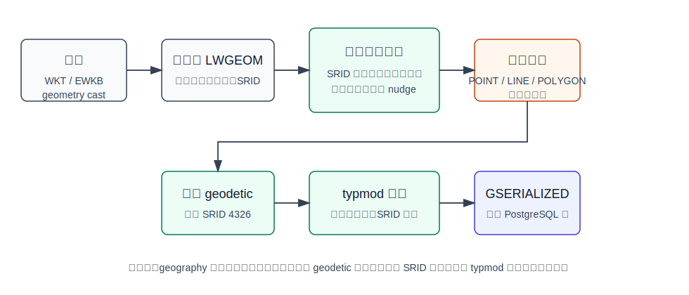
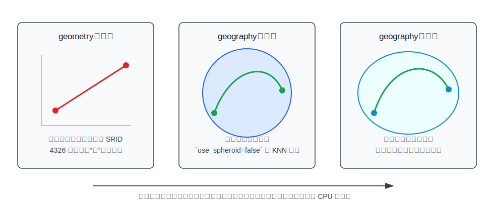
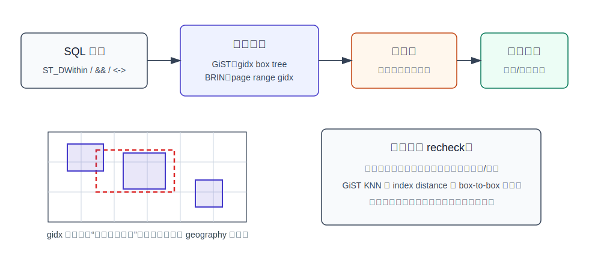
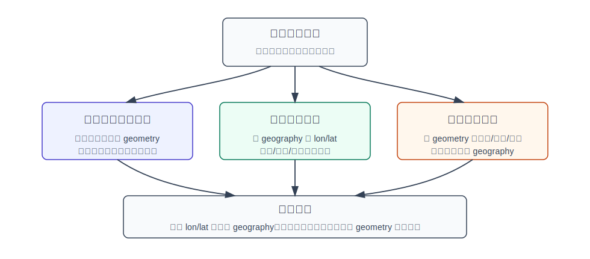

## 数据库筑基课 - geography 数据类型
                                                                                            
### 作者                                                                
digoal                                                                
                                                                       
### 日期                                                                     
2026-05-26                                                      
                                                                    
### 标签                                                                  
PostgreSQL , PostGIS , 应用开发者 , DBA , 数据库筑基课 , 数据类型与算子 , geography , 空间数据 , GiST , BRIN  
                                                                                           
----                                                                    

## 背景
  

本节属于“数据类型与算子”基础能力。当前工作区没有发现“数据库筑基课”总纲文件，因此本文先独立成篇。

很多系统一开始把位置存成两列：

```sql
longitude numeric,
latitude  numeric
```

这能保存点，却不能让数据库理解“这两个数共同表示地球表面上的一个位置”。问题很快会出现：

- 要找用户 3 公里内门店，应用层循环算距离，数据库只能全表扫。
- 要判断航线到城市的最近距离，用 4326 `geometry` 算出来的单位是“度”，业务却当成“米”。
- 要跨省、跨国、跨洲做距离和覆盖，局部投影坐标系不再适用。
- 要建空间索引，B-tree 无法表达“球面上的距离、范围和相交”。

PostGIS 的 `geography` 解决的是：**把经纬度对象作为地球表面上的空间类型存储，让距离、长度、面积和范围查询默认以米为单位，并接入 PostgreSQL 的类型、约束、统计和空间索引体系。**

本文关键结论以本地 PostGIS 源码、文档源码和 `postgis/CLAUDE.md` 核对。用户给出的 DeepWiki repo 为 `postgis/postgis`，但本次 `deepwiki ask` 返回通用错误，未能作为可靠来源使用。

## 一、它解决什么问题？

`geometry` 适合表达平面空间对象；`geography` 适合表达地球经纬度对象。

如果业务只在一个城市内做空间查询，常见正确做法是选一个适合当地的投影坐标系，把经纬度转成米制平面坐标后用 `geometry`。但如果业务天然跨大范围，例如全球门店、国际航线、跨境物流、海缆、卫星覆盖、地理围栏，单个局部投影很难同时保证单位直观、误差可控和模型简单。

`geography` 的价值是把问题换成：

- 输入仍使用 WKT/EWKT/EWKB 这类空间格式。
- 坐标是经纬度，第一维是 longitude，第二维是 latitude。
- 测量函数的结果或参数使用米，例如 `ST_Distance`、`ST_Length`、`ST_Area`、`ST_DWithin`。
- 默认使用椭球计算，必要时可以用球面近似换速度。
- GiST/BRIN 索引先用 `gidx` 边界摘要排除不可能命中的对象，再做精确复核。

代价也很明确：球面/椭球数学比平面几何更复杂，所以 `geography` 支持的函数少于 `geometry`，CPU 成本更高；很多复杂空间处理仍会转成合适投影下的 `geometry` 来完成。PostGIS 文档源码 `doc/using_postgis_dataman.xml` 对这一点说得很直接：`geography` 更容易处理大范围经纬度数据，但函数更少、执行更慢。

## 二、它是什么？

在 SQL 层，`geography` 是 PostGIS 注册到 PostgreSQL 的变长类型。本地源码 `postgis/postgis/geography.sql.in` 定义了：

- `geography_in` / `geography_out`：文本输入输出。
- `geography_recv` / `geography_send`：二进制收发。
- `geography_typmod_in` / `geography_typmod_out`：解析列类型修饰，例如 `geography(Point,4326)`。
- `geography_analyze`：接入 `gserialized_analyze_nd`，让优化器有空间统计信息。
- `CREATE TYPE geography`：`internallength = variable`、`storage = main`、`alignment = double`。
- `gist_geography_ops`：默认 GiST opclass，存储类型是 `gidx`。
- `brin_geography_inclusion_ops`：默认 BRIN inclusion opclass，存储类型也是 `gidx`。

它支持的空间对象是简单要素里的常见类型：

- `POINT`
- `LINESTRING`
- `POLYGON`
- `MULTIPOINT`
- `MULTILINESTRING`
- `MULTIPOLYGON`
- `GEOMETRYCOLLECTION`

不支持曲线、TIN、PolyhedralSurface 这类类型。文档源码 `doc/using_postgis_dataman.xml` 和老文档 `doc/geography.txt` 都强调：正确处理球面曲线会显著增加复杂度，所以 `geography` 的类型面比 `geometry` 窄。

生产建表时通常不要使用裸 `geography`，而应写清楚类型和 SRID：

```sql
CREATE TABLE stores (
  id       bigserial PRIMARY KEY,
  name     text NOT NULL,
  location geography(Point, 4326) NOT NULL
);

CREATE INDEX stores_location_gix
  ON stores USING gist (location);
```

`geography(Point,4326)` 是列级契约：写入非点对象、非经纬度 SRID 或维度不匹配的数据时，PostGIS 会在类型路径上拒绝，而不是等应用层发现。

## 三、核心原理

### 3.1 输入路径：先当空间对象解析，再加 geodetic 语义

源码 `postgis/postgis/geography_inout.c` 的 `geography_in()` 先把输入解析为 `LWGEOM`，再调用 `gserialized_geography_from_lwgeom()`。关键步骤是：

1. 空字符串直接报错。
2. 以 `0` 开头时尝试按 hex WKB 解析，否则按 WKT 解析。
3. 调用 `srid_check_latlong()`，拒绝非经纬度坐标系。
4. 设置 geodetic 标志。
5. 检查类型是否为 geography 支持的简单类型。
6. 对非常接近边界的坐标调用 `lwgeom_nudge_geodetic()` 贴边修正。
7. 对越界坐标调用 `lwgeom_force_geodetic()` 做经纬度归一化，并发出 notice。
8. SRID 小于等于 0 时使用默认 SRID 4326。
9. 序列化为 `GSERIALIZED`。
10. 如果列有 typmod，调用 `postgis_valid_typmod()` 校验类型、维度和 SRID。



图 1 说明：`geography` 不是“把经纬度字符串换个类型名”。它会进入 PostGIS 的空间解析路径，设置 geodetic 标志，经过经纬度 SRID 校验、坐标范围处理和 typmod 校验，最后以 `GSERIALIZED` 写入 PostgreSQL 行。

这里有一个版本差异要注意：老文档 `postgis/doc/geography.txt` 写的是 geography 只假定 WGS84/4326；当前文档源码 `doc/using_postgis_dataman.xml` 写的是可使用 `spatial_ref_sys` 中任意 geodetic long/lat SRID，非经纬度投影会报错。当前源码也调用 `srid_check_latlong()`，所以本文以当前文档源码和代码为准。

### 3.2 typmod：把空间契约放进 PostgreSQL 类型系统

`geography(Point,4326)` 中的 `Point,4326` 是 PostgreSQL typmod。源码 `postgis/postgis/gserialized_typmod.c` 中的 `geography_typmod_in()` 先调用 `gserialized_typmod_in(arr, LW_TRUE)` 解析 typmod，再调用 `srid_check_latlong(srid)` 校验 SRID 是否为经纬度坐标系。

写入时 `geography_enforce_typmod()` 会调用 `postgis_valid_typmod()`，这和 `geometry` 共用核心约束逻辑：

- typmod 缺省时，不额外限制具体类型和 SRID。
- typmod 指定类型时，输入类型必须匹配；可无歧义提升的单对象到 Multi 对象由通用逻辑处理。
- typmod 指定 Z/M 维度时，输入维度必须一致。
- typmod 指定 SRID 时，输入 SRID 必须一致；SRID 未定义的情况可被补为列 SRID。

这对 DBA 的意义很实际：用列类型约束空间对象，比在应用层“约定传点、约定 4326”可靠。所有导入、批处理、SQL 写入和 ORM 写入都会走同一个类型入口。

### 3.3 测量模型：默认椭球，必要时球面

`geography` 最核心的差异在测量模型。

`geometry` 的基础是平面。两个点的最短路径是直线，距离单位取决于坐标系统。SRID 4326 的坐标单位是度，所以对 4326 `geometry` 做 `ST_Distance`，结果不是米。

`geography` 的基础是地球表面。文档源码 `doc/reference_measure.xml` 写明：`ST_Distance(geography, geography, use_spheroid boolean DEFAULT true)` 默认返回两个 geography 的最小测地距离，单位是米；`use_spheroid=false` 时使用更快但不那么准确的球面计算。

源码 `postgis/postgis/geography_measurement.c` 的 `geography_distance()` 也能看到同一条路径：

- 从 PostgreSQL 参数中取出 `GSERIALIZED`。
- 检查两个对象 SRID 是否一致。
- 按 SRID 初始化 `SPHEROID`。
- `use_spheroid=false` 时把椭球半长轴和半短轴都设为球半径。
- 空对象返回 NULL。
- 优先尝试缓存路径，失败时使用 tree-based distance。
- 对纳米级浮点误差做舍入处理。



图 2 说明：同样是两个经纬度点，`geometry` 会按平面直线理解，`geography` 会按球面或椭球上的路径理解。选择 `use_spheroid=false` 是在精度和 CPU 之间做交换，不是改变输入数据。

常用测量函数的工程语义如下：

| 函数 | geography 语义 | 单位 | 关键取舍 |
|---|---|---|---|
| `ST_Distance(geog1, geog2, use_spheroid)` | 两个对象的最小测地距离 | 米 | 默认椭球更准确；球面更快 |
| `ST_DWithin(geog1, geog2, meters, use_spheroid)` | 是否在指定米数内 | 米 | 可走索引粗过滤，再精确判断 |
| `ST_Length(geog, use_spheroid)` | 线对象长度 | 米 | 大范围线更适合 geography |
| `ST_Area(geog, use_spheroid)` | 面对象面积 | 平方米 | 大多边形 CPU 代价高 |
| `<->` | KNN 排序距离 | 米近似 | geography KNN 基于球面而不是椭球 |

`<->` 的最后一行很重要。`postgis/postgis/geography_measurement.c` 的 `geography_distance_knn()` 中 `use_spheroid = false`，注释说明索引无法与椭球距离协调，所以必须使用球面距离。文档源码 `doc/reference_operator.xml` 也说明 geography 的 KNN 基于 sphere 而不是 spheroid。

### 3.4 索引模型：gidx 粗过滤，真实关系要复核

`geography.sql.in` 定义了默认 GiST opclass：

```sql
CREATE OPERATOR CLASS gist_geography_ops
  DEFAULT FOR TYPE geography USING GIST AS
  STORAGE gidx,
  OPERATOR 3 &&,
  OPERATOR 13 <-> FOR ORDER BY pg_catalog.float_ops,
  FUNCTION 8 geography_gist_distance(...),
  FUNCTION 1 geography_gist_consistent(...),
  FUNCTION 2 geography_gist_union(...),
  FUNCTION 3 geography_gist_compress(...),
  FUNCTION 4 geography_gist_decompress(...),
  FUNCTION 5 geography_gist_penalty(...),
  FUNCTION 6 geography_gist_picksplit(...),
  FUNCTION 7 geography_gist_same(...);
```

`geography_brin.sql.in` 定义了默认 BRIN inclusion opclass：

```sql
CREATE OPERATOR CLASS brin_geography_inclusion_ops
  DEFAULT FOR TYPE geography
  USING brin AS
  ...
  OPERATOR 3 &&(geography, geography),
  OPERATOR 3 &&(geography, gidx),
  OPERATOR 3 &&(gidx, geography),
  OPERATOR 3 &&(gidx, gidx),
  STORAGE gidx;
```

核心思想是：索引里不保存完整 geography 对象的测地计算结果，而保存可比较的 `gidx` 边界摘要。`ST_DWithin`、`ST_Intersects`、`ST_Covers` 等函数在 SQL 定义里带 `SUPPORT postgis_index_supportfn`，文档 `doc/reference_relationship.xml` 也说明 `ST_DWithin` 包含 bounding box 比较，可使用可用索引。



图 3 说明：GiST/BRIN 负责快速排除“不可能命中”的对象，不能替代真实球面/椭球计算。源码 `postgis/postgis/gserialized_gist_nd.c` 的 geography GiST distance 支持函数在叶子节点设置 `recheck = true`；返回的是 box-to-box 的最小可能距离，并乘以 `WGS84_RADIUS` 转成可比较的世界单位。真正结果仍要回表或复核。

这解释了两个常见现象：

- `ST_DWithin(location, constant_geog, 3000)` 通常比 `ST_Distance(location, constant_geog) < 3000` 更容易写成可索引查询。
- 大范围、多顶点、多边形对象即使建了索引也可能慢，因为它的边界摘要很大，候选行多，精确复核还要遍历大量顶点。

### 3.5 部分函数会转到 geometry 路径

不是所有 geography 操作都在球面/椭球上直接实现。`geography.sql.in` 中 `ST_Buffer(geography, ...)` 和 `ST_Intersection(geography, geography)` 的 SQL 定义展示了一个典型策略：

1. 用 `_ST_BestSRID()` 为输入 geography 选择一个适合的临时投影。
2. 把 geography 转为 geometry。
3. 在投影平面上执行 `ST_Buffer` 或 `ST_Intersection`。
4. 再 `ST_Transform` 回原 SRID。
5. 最后转回 geography。

这是一种工程折中：复杂拓扑和构造算法在平面 geometry 路径上更成熟，但投影选择本身有边界。跨日期变更线、靠近极区、超大面、超长边时要特别小心。

## 四、横向对比

| 维度 | PostGIS `geography` | PostGIS `geometry` 4326 | 投影坐标系 `geometry` |
|---|---|---|---|
| 主要目标 | 经纬度对象的地球表面测量 | 保存经纬度平面对象 | 局部或指定投影下的平面空间计算 |
| 距离单位 | 米 | 度 | 取决于投影，常见为米 |
| 默认测量模型 | 椭球，可切球面 | 平面 | 平面 |
| 函数覆盖 | 少于 geometry | 最完整 | 最完整 |
| 计算成本 | 较高 | 较低 | 较低 |
| 索引 | GiST/BRIN，`gidx` 摘要，需复核 | GiST/SP-GiST/BRIN 等 | GiST/SP-GiST/BRIN 等 |
| KNN | `<->` 基于球面 | `<->` 平面距离，4326 为度 | `<->` 平面距离，单位由投影决定 |
| 适合场景 | 全球/跨区域距离、面积、范围过滤 | 展示、简单保存、GeoJSON/WKT 交换 | 城市/区域高频空间分析 |
| 不适合场景 | 复杂拓扑编辑、极高 QPS 局部计算 | 把度误当米 | 跨全球范围且投影难统一 |

不要用一句“经纬度就 geography”结束建模。更稳妥的判断是：

- 如果核心问题是跨大范围的“米制距离/面积/长度”，优先评估 `geography`。
- 如果核心问题是一个城市或省内的高频空间关系、叠加、聚合，优先选择合适投影后用 `geometry`。
- 如果既要保留原始经纬度，又要做高频局部计算，可以保留 `geography(Point,4326)`，再维护一个投影 `geometry` 派生列。



图 4 说明：类型选择不是宗教问题，而是 workload 问题。范围越大、越需要米制语义，`geography` 越有价值；局部计算越多、函数越复杂、性能越敏感，合适投影下的 `geometry` 越有优势。

## 五、效果如何？

`geography` 的收益主要体现在语义正确性和索引过滤能力：

- 经纬度距离、长度、面积默认按地球模型计算，结果单位对业务更直观。
- `ST_DWithin` 的距离参数是米，减少“度和米混用”的错误。
- GiST/BRIN 能为范围和近邻查询提供候选集过滤。
- typmod 能把类型、维度、SRID 契约前移到数据库。

代价主要体现在：

- CPU 更贵，尤其是大对象、多顶点对象、候选行很多时。
- 函数覆盖少于 `geometry`，复杂处理经常需要投影到 `geometry`。
- KNN `<->` 使用球面距离，不是默认 `ST_Distance` 的椭球距离。
- 大多边形的边界摘要过大，会降低索引排除效果；精确复核也更重。
- 使用非 4326 但仍为经纬度的 SRID 时，数据进入 geography 是允许的；但跨 SRID 混算仍会被 SRID mismatch 拦住，需要先统一。

本文没有构造任何 benchmark 数字。PostGIS 文档示例给过 `ST_Distance` 的 spheroid 与 sphere 输出差异，但生产系统的差异取决于几何复杂度、候选行数、索引相关性、CPU、PostgreSQL 版本和 PostGIS 构建依赖。

## 六、实操 DEMO

以下 SQL 未在当前环境执行，因为当前工作区只有 PostGIS 源码，没有已安装并加载该扩展的 PostgreSQL/PostGIS 实例。语法按 PostGIS 文档和 SQL 定义编写，可在安装 PostGIS 后执行。

### 6.1 建表、写入和索引

```sql
CREATE EXTENSION IF NOT EXISTS postgis;

DROP TABLE IF EXISTS stores;

CREATE TABLE stores (
  id       bigserial PRIMARY KEY,
  name     text NOT NULL,
  location geography(Point, 4326) NOT NULL
);

INSERT INTO stores(name, location) VALUES
  ('hangzhou-a', 'SRID=4326;POINT(120.1551 30.2741)'::geography),
  ('shanghai-a', 'SRID=4326;POINT(121.4737 31.2304)'::geography),
  ('beijing-a',  'SRID=4326;POINT(116.4074 39.9042)'::geography);

CREATE INDEX stores_location_gix
  ON stores USING gist (location);

ANALYZE stores;
```

### 6.2 米制范围查询

```sql
EXPLAIN (ANALYZE, BUFFERS)
SELECT id, name
FROM stores
WHERE ST_DWithin(
  location,
  'SRID=4326;POINT(120.1551 30.2741)'::geography,
  3000
);
```

验证重点不是死记某一种计划，而是观察：

- 是否使用 `stores_location_gix`。
- 候选行过滤后是否还存在 recheck 或 filter。
- `3000` 的单位是米，不是度。

### 6.3 spheroid 与 sphere 的取舍

```sql
SELECT
  ST_Distance(
    'SRID=4326;POINT(120.1551 30.2741)'::geography,
    'SRID=4326;POINT(121.4737 31.2304)'::geography
  ) AS dist_spheroid_m,
  ST_Distance(
    'SRID=4326;POINT(120.1551 30.2741)'::geography,
    'SRID=4326;POINT(121.4737 31.2304)'::geography,
    false
  ) AS dist_sphere_m;
```

默认值走椭球计算；第三个参数为 `false` 时走球面近似。是否可接受要由业务误差预算决定，不要只因为“更快”就全局改成球面。

### 6.4 KNN 最近邻

```sql
EXPLAIN (ANALYZE, BUFFERS)
SELECT id, name,
       location <-> 'SRID=4326;POINT(120.1551 30.2741)'::geography AS approx_dist_m
FROM stores
ORDER BY location <-> 'SRID=4326;POINT(120.1551 30.2741)'::geography
LIMIT 10;
```

`<->` 能触发 GiST KNN，但 geography 的 KNN 使用球面距离。若结果需要按椭球精确排序，可用两阶段查询：

```sql
WITH candidates AS (
  SELECT id, name, location
  FROM stores
  ORDER BY location <-> 'SRID=4326;POINT(120.1551 30.2741)'::geography
  LIMIT 100
)
SELECT id, name,
       ST_Distance(location, 'SRID=4326;POINT(120.1551 30.2741)'::geography) AS dist_m
FROM candidates
ORDER BY dist_m
LIMIT 10;
```

第一阶段用索引拿候选，第二阶段用默认椭球距离精排。

## 七、最佳实践

### 数据库架构师

1. 先按 workload 选类型，不按字段名选类型。跨区域米制测量用 `geography`；局部高频空间分析用投影 `geometry`。
2. 列定义写 typmod，例如 `geography(Point,4326)`、`geography(MultiPolygon,4326)`，不要裸用 `geography`。
3. 大对象不要“一坨面走天下”。如果大多边形常被小范围查询命中，评估 `ST_Subdivide` 或业务分片，让索引摘要更有排除能力。
4. 需要复杂叠加、缓冲、拓扑编辑时，设计清楚投影 `geometry` 的处理链路，不要假设所有 geography 函数都直接在椭球上完成。

### DBA

1. 对常见范围查询建 GiST：`CREATE INDEX ... USING gist (geog_col)`。
2. 对按物理插入顺序具有空间相关性的超大表，评估 BRIN inclusion：它空间小，但过滤精度依赖 page range 内数据聚集程度。
3. `ANALYZE` 不要省。`geography` 类型定义绑定了 `gserialized_analyze_nd`，统计信息会影响优化器估算。
4. 观察 `EXPLAIN (ANALYZE, BUFFERS)` 中候选行数和回表代价；索引命中不等于查询便宜。
5. 对 KNN 查询明确 `<->` 是球面距离；需要椭球精确排序时做候选集精排。

### 业务开发者

1. WKT 点的顺序是 `POINT(longitude latitude)`，不是 `POINT(latitude longitude)`。
2. `ST_DWithin(geog, point, 3000)` 的 3000 是米；不要自己把米换成度。
3. 不要对 4326 `geometry` 的 `ST_Distance` 结果叫“米”。
4. 写入前保证 SRID 正确。`ST_SetSRID` 是贴标签，不是坐标转换；转换要用 `ST_Transform`。
5. 对“附近的人、附近门店”这类接口，优先用 `ST_DWithin` 过滤，再按 `ST_Distance` 或 `<->` 排序。

## 八、适合与不适合场景

适合：

- 全球或跨区域点位检索，例如全球门店、航班、船舶、物流节点。
- 以米为单位的经纬度范围查询，例如“当前位置 5 公里内”。
- 大范围线或面的长度、面积估算，且业务接受 PostGIS geography 函数覆盖范围。
- 不想为每个地区维护不同投影坐标系的中低频空间计算。
- 原始数据就是 lon/lat，且查询语义确实发生在地球表面。

不适合：

- 单城高 QPS 最近邻、围栏、叠加分析，且已有合适投影坐标系。
- 复杂拓扑编辑、精细缓冲、多步骤 overlay 工作流。
- 极大多边形直接参与大量小范围查询。
- 需要 geography 不支持的曲线、TIN、PolyhedralSurface 等类型。
- 对 KNN 排序要求严格椭球距离且候选集无法容忍二阶段精排。

## 九、常见坑

1. **经纬度顺序写反。** WKT/EWKT 里是 `POINT(lon lat)`。`POINT(30 120)` 表示东经 30、北纬 120，纬度越界，会触发错误或归一化问题。
2. **把 4326 geometry 的距离当米。** `geometry` 的 4326 单位是度，米制距离请用 `geography` 或合适投影。
3. **只建索引，不写可索引谓词。** 范围查询优先写 `ST_DWithin`，不要只写 `ST_Distance(...) < r` 后期待一定走索引。
4. **忽视 KNN 的球面语义。** geography `<->` 是球面距离；默认 `ST_Distance` 是椭球距离。
5. **大多边形拖垮复核。** 大对象 bbox 过大，索引会拉出大量候选；真实计算还要遍历顶点。
6. **误解 `ST_Buffer(geography)`。** 它不是纯椭球 buffer，而是选择临时投影，转 geometry 处理后再转回 geography。
7. **以为 SRID 0 没影响。** geography 输入会把未定义 SRID 默认到 4326，但生产数据最好显式写 SRID，减少导入歧义。
8. **不同 SRID 混算。** geography 允许 geodetic SRID，但两个对象计算前仍要求 SRID 一致。

## 十、扩展问题

1. 为什么 geography 的 GiST 索引只能保存 `gidx` 摘要，而不能直接保存“椭球距离”？
2. 如果一个外卖系统只服务一个城市，`geography(Point,4326)` 和本地投影 `geometry(Point,<srid>)` 哪个更适合最近门店查询？
3. 为什么 `<->` 可以用来快速找候选，但严格结果还需要 `ST_Distance` 精排？
4. 大行政区多边形为什么会让索引过滤效果变差？`ST_Subdivide` 改善的是哪一层代价？
5. 如果业务既要保存原始经纬度，又要做局部高频分析，应该如何设计双列、派生列或物化视图？

## 十一、扩展阅读

- PostGIS geography 用户文档源码：[postgis/doc/using_postgis_dataman.xml](../postgis/doc/using_postgis_dataman.xml)
- PostGIS geography 早期说明：[postgis/doc/geography.txt](../postgis/doc/geography.txt)
- PostGIS geography SQL 定义：[postgis/postgis/geography.sql.in](../postgis/postgis/geography.sql.in)
- PostGIS geography 输入输出源码：[postgis/postgis/geography_inout.c](../postgis/postgis/geography_inout.c)
- PostGIS typmod 源码：[postgis/postgis/gserialized_typmod.c](../postgis/postgis/gserialized_typmod.c)
- PostGIS geography 测量源码：[postgis/postgis/geography_measurement.c](../postgis/postgis/geography_measurement.c)
- PostGIS geography BRIN 定义：[postgis/postgis/geography_brin.sql.in](../postgis/postgis/geography_brin.sql.in)
- PostGIS GiST ND 源码：[postgis/postgis/gserialized_gist_nd.c](../postgis/postgis/gserialized_gist_nd.c)
- PostGIS 测量函数文档源码：[postgis/doc/reference_measure.xml](../postgis/doc/reference_measure.xml)
- PostGIS 关系函数文档源码：[postgis/doc/reference_relationship.xml](../postgis/doc/reference_relationship.xml)
- PostGIS KNN 操作文档源码：[postgis/doc/reference_operator.xml](../postgis/doc/reference_operator.xml)
- 项目本地架构说明：[postgis/CLAUDE.md](../postgis/CLAUDE.md)
  
## 附录  
  
1、克隆代码  
```  
git clone --depth 1 https://github.com/postgres/postgres
```  
  
2、启用 codex, 使用 [数据库筑基课 skill](../skills/README.md).  
````
文章标题: 
  数据库筑基课 - geography 数据类型  
项目源码(已克隆到当前项目如下目录中):  
  postgis
项目 deepwiki reponame:  
  postgis/postgis
项目参考信息: 
  postgis/CLAUDE.md
````
  
  
#### [PostgreSQL 解决方案集合](../201706/20170601_02.md "40cff096e9ed7122c512b35d8561d9c8")
  
  
#### [德哥 / digoal's Github - 公益是一辈子的事.](https://github.com/digoal/blog/blob/master/README.md "22709685feb7cab07d30f30387f0a9ae")
  
  
#### [About 德哥](https://github.com/digoal/blog/blob/master/me/readme.md "a37735981e7704886ffd590565582dd0")
  
  

  
