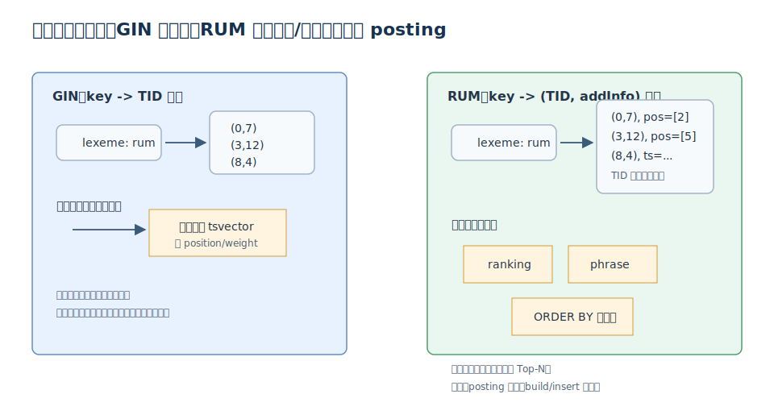
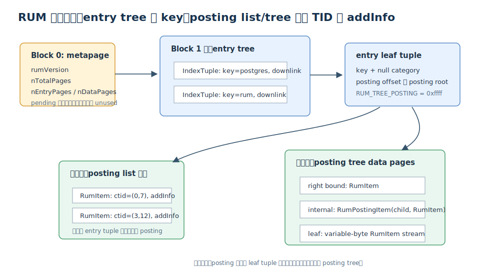
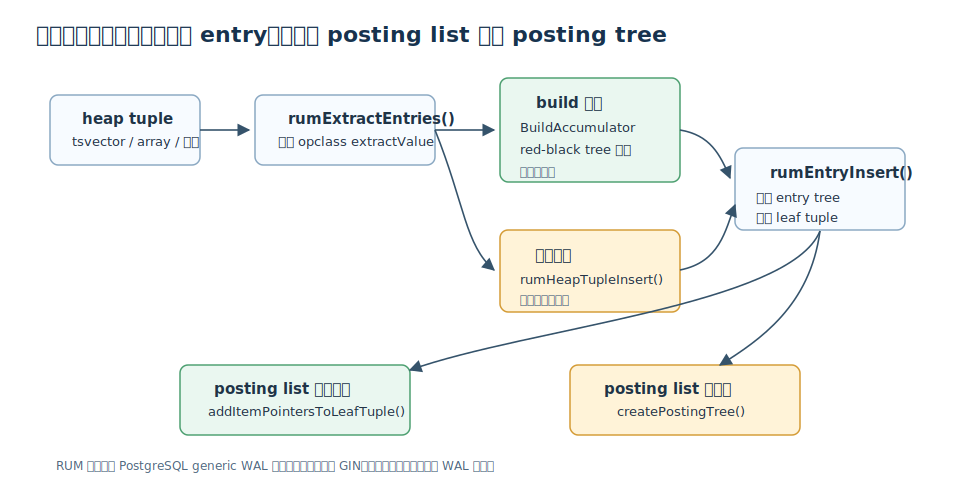
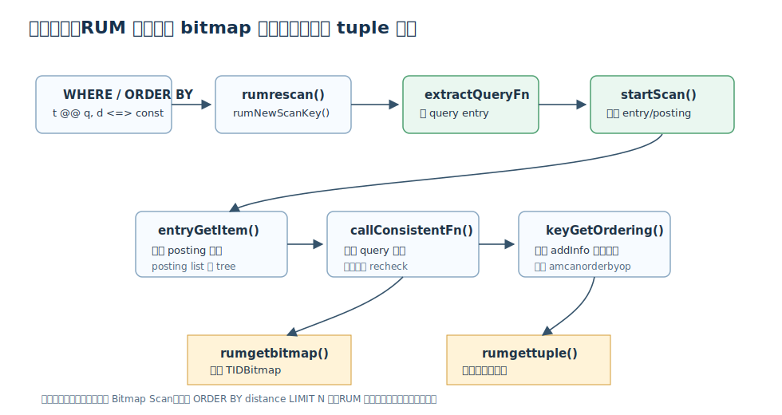
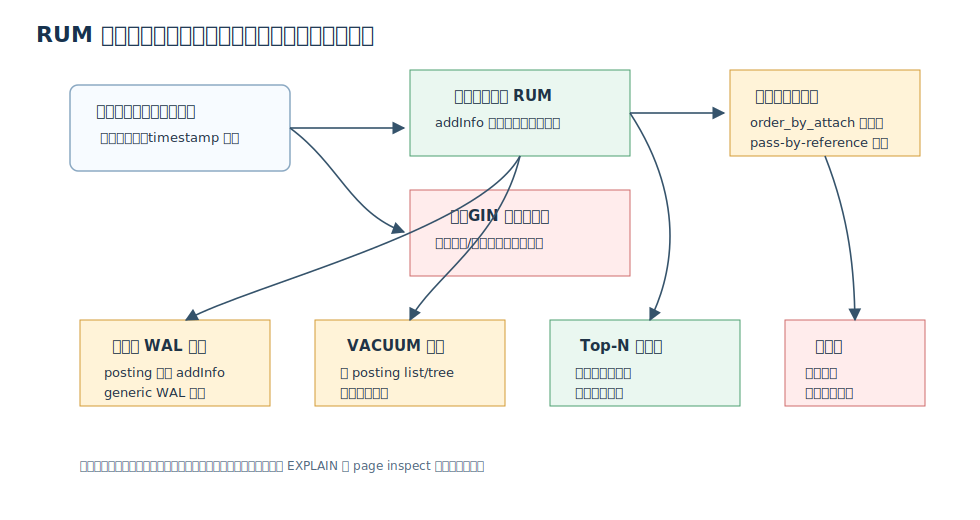

## 数据库筑基课 - rum 索引结构
                                                                                            
### 作者                                                                
digoal                                                                
                                                                       
### 日期                                                                     
2026-05-27                                                      
                                                                    
### 标签                                                                  
PostgreSQL , 应用开发者 , DBA , 数据库筑基课 , 索引结构 , RUM , GIN , 倒排索引 , 全文检索  
                                                                                           
----                                                                    

## 背景
   


本节属于“索引结构”基础能力。当前工作区已有多篇 `database-foundation-*` 文章，但没有发现单独的“数据库筑基课”总纲文件，因此本文先独立成篇。

业务里经常有一种查询不是“找等于某个值的行”，而是“在一堆候选文本里找到相关结果，并按相关性或时间返回前 N 条”。例如：

```sql
SELECT id, title
FROM doc
WHERE fts @@ plainto_tsquery('postgres rum index')
ORDER BY fts <=> plainto_tsquery('postgres rum index')
LIMIT 20;
```

PostgreSQL 原生 GIN 对全文检索过滤很强，但它只保存 `tsvector` 里的 lexeme，不保存词位、权重、时间戳这类可用于排名和短语判断的附加信息。排序或短语查询经常需要先取出候选 TID，再回表拿原始 `tsvector` 或其他列计算。RUM 的设计目标就是把一部分“排名需要的局部信息”放到倒排索引的 posting 里，让索引不只负责过滤，还能更早地参与排序、短语判断和附加列距离计算。

本文以本地 `rum` 仓库为主线，结合 `rum/CODEBASE.md`、`rum/README.md`、`rum_init.sql`、`src/*.c`、DeepWiki `postgrespro/rum` 说明、PostgreSQL GIN 文档和 PGConf.RU 2017 的 RUM 分享来解释结构。性能数字只引用公开分享中的实验，不把它当成通用承诺。

## 一、它解决什么问题？

RUM 解决的是倒排索引在“过滤之后还要排序、排名、短语判断”时的信息缺口。

GIN 的基本模型是：

```text
key -> posting list/tree -> heap TID 集合
```

这对 `@@`、`@>`、`&&` 这类“候选过滤”很有效。但全文检索排名和短语搜索还需要词位信息；按时间新鲜度排序还需要时间戳或可度量的附加列。GIN posting 里主要是 heap TID，缺少这些信息时，执行器只能把候选行取出来再算。

RUM 把模型扩展成：

```text
key -> posting list/tree -> (heap TID, addInfo) 集合
```

这里的 `addInfo` 可以是 tsvector lexeme 的位置信息，也可以是通过 `WITH (attach = 'd', to = 't')` 绑定到全文列上的时间戳、整数、浮点等可排序信息。于是原来“索引过滤 -> 回表 -> 计算距离 -> 排序 -> LIMIT”的链路，有机会变成“索引过滤时就维护距离顺序 -> 更早返回 Top-N”。

代价也很直接：

- posting 项变宽，索引空间和写入成本上升。
- 一行文本拆出多个 lexeme，每个 lexeme 都可能带附加信息，写放大更明显。
- RUM 源码使用 generic WAL 写页面变化，README 也明确说 build/insert 通常慢于 GIN。
- RUM 不是 PostgreSQL core access method，而是扩展；版本兼容、构建、测试要纳入运维流程。

## 二、它是什么？

RUM 是一个 PostgreSQL index access method 扩展。`rum_init.sql` 注册：

```sql
CREATE FUNCTION rumhandler(internal) RETURNS index_am_handler
AS 'MODULE_PATHNAME', 'rumhandler'
LANGUAGE C;

CREATE ACCESS METHOD rum TYPE INDEX HANDLER rumhandler;
```

`src/rumutil.c:rumhandler()` 返回 `IndexAmRoutine`，绑定 `rumbuild`、`ruminsert`、`rumbulkdelete`、`rumvacuumcleanup`、`rumbeginscan`、`rumrescan`、`rumgettuple`、`rumgetbitmap` 等回调，并设置 `amcanorderbyop = true`、`amcanmulticol = true`、`amoptionalkey = true`、`amstorage = true`。这解释了 RUM 与 GIN 的关键差异：它不是天然按 key 有序输出的 B-tree，但它能支持 `ORDER BY index_key operator constant` 这类 ordering operator 扫描。

RUM 的核心对象有三层：

- **entry tree**：按 key 组织的树，key 可以是 lexeme、array element、标量值、tsquery 分支等。
- **posting list**：某个 key 对应的短 TID/addInfo 集合，直接塞在 entry leaf tuple 中。
- **posting tree**：某个 key 对应的集合太大时，独立拆成 data pages 组成的树。



图 1 说明：GIN 与 RUM 都是倒排索引思路。GIN 的 posting 主要回答“哪些行包含 key”；RUM 的 posting 还携带 `addInfo`，让排名、短语和附加列排序有机会在索引层完成。

## 三、核心原理

### 3.1 页面结构：RUM 是 entry tree 加 posting list/tree

`src/rum.h` 定义了固定页号：

- `RUM_METAPAGE_BLKNO = 0`
- `RUM_ROOT_BLKNO = 1`

每个 RUM 页 special space 里有 `RumPageOpaqueData`，保存 `leftlink`、`rightlink`、`maxoff`、`freespace` 和 page flags。flags 包括 `RUM_DATA`、`RUM_LEAF`、`RUM_DELETED`、`RUM_META`、`RUM_LIST`、`RUM_LIST_FULLROW`。

metapage 里的 `RumMetaPageData` 保存 `rumVersion`、`nTotalPages`、`nEntryPages`、`nDataPages`、`nEntries` 等统计信息。结构里仍有 pending list 相关字段，但源码注释写得很清楚：这些字段是 `unused - pending list is removed`。所以不要把 PostgreSQL GIN 的 fastupdate pending list 机制直接套到当前 RUM 实现上。

posting 的基本单元是：

```c
typedef struct RumItem
{
    ItemPointerData iptr;
    bool            addInfoIsNull;
    Datum           addInfo;
} RumItem;
```

这就是 RUM 的核心：每个 heap TID 旁边可以有一个附加值。非叶子 posting tree 页用 `RumPostingItem` 保存 child block 和 `RumItem` 边界；leaf data page 则以变长编码保存 leaf items。



图 2 说明：RUM 的 entry tree 负责从 key 找到 posting。如果 posting 集合小，就内联到 entry leaf tuple；如果集合太大，leaf tuple 用 `RUM_TREE_POSTING = 0xffff` 标记并指向 posting tree root。

### 3.2 operator class：RUM 只提供框架，语义由 opclass 决定

RUM 与 GIN 一样是 generalized access method。它不知道 `tsvector`、`tsquery`、数组、时间戳各自的业务语义，而是通过 operator class 支持函数完成抽取、比较、一致性判断和排序距离计算。

`rum_init.sql` 中比较重要的 opclass 包括：

| opclass | 索引对象 | 主要能力 | 注意点 |
|---|---|---|---|
| `rum_tsvector_ops` | `tsvector` | `@@` 过滤，`<=>` 排名排序，prefix search | 保存 lexeme 位置信息 |
| `rum_tsvector_hash_ops` | `tsvector` | hash key，`@@`，`<=>` | 不支持 prefix search |
| `rum_tsvector_addon_ops` | `tsvector` 加附加列 | `@@` 过滤，并按附加列距离排序 | 需要 `WITH (attach = ..., to = ...)` |
| `rum_tsvector_hash_addon_ops` | hash tsvector 加附加列 | 类似 addon，但 key 为 hash | 不支持 prefix search |
| `rum_tsquery_ops` | `tsquery` | 反向全文检索：用文档匹配查询集合 | 把 query tree 分支放入 addInfo |
| `rum_anyarray_ops` | `anyarray` | `&&`、`@>`、`<@`、`=`、`%`、`<=>` | 数组长度可作为附加信息 |
| `rum_TYPE_ops` | 多种标量类型 | 比较与距离排序 | 可作为 addon 排序列 |

源码对应关系也比较清晰：

- `src/rum_ts_utils.c`：`rum_extract_tsvector`、`rum_extract_tsquery`、`rum_tsquery_consistent`、`rum_tsquery_distance`、`rum_ts_distance_*`。
- `src/rum_arr_utils.c`：`rum_extract_anyarray`、`rum_anyarray_consistent`、`rum_anyarray_ordering`、`rum_anyarray_distance`。
- `src/btree_rum.c`：整数、浮点、时间戳、money、oid 等标量类型的比较、consistent 和 distance。
- `src/rumtsquery.c`：`tsquery` 作为索引对象时的反向全文检索。

这里有一个容易误解的边界：RUM 的 TODO 仍写着 “Allow multiple additional info (lexemes positions + timestamp)”。也就是说，`rum_tsvector_ops` 适合把词位信息放入索引用于排名和短语；`rum_tsvector_addon_ops` 适合把附加列放入索引用于按时间、数值等排序。两类收益不能简单理解为在同一个 posting 项里无限叠加。

### 3.3 写入路径：先抽 entry，再决定 list 还是 tree

`CREATE INDEX ... USING rum` 进入 `src/ruminsert.c:rumbuild()`。代码路径可以概括为：

```text
rumbuild()
  -> initRumState()
  -> RumInitMetabuffer()
  -> rumInitBA()
  -> heap scan callback
  -> rumHeapTupleBulkInsert()
  -> rumExtractEntries()
  -> rumInsertBAEntries()
  -> rumBeginBAScan()
  -> rumEntryInsert()
  -> rumUpdateStats()
```

build 阶段的 `BuildAccumulator` 在 `src/rumbulk.c` 中基于 red-black tree 聚合同一个 entry 的 posting 项，减少随机写。单行插入则进入 `ruminsert()`：

```text
ruminsert()
  -> initRumState()
  -> rumHeapTupleInsert()
  -> rumExtractEntries()
  -> rumEntryInsert()
  -> buildFreshLeafTuple() or addItemPointersToLeafTuple()
  -> optional createPostingTree()
```

`rumEntryInsert()` 是关键分叉点：如果原 entry 不存在，构造新的 leaf tuple；如果存在并且 posting list 还能放下，就扩展 leaf tuple；如果放不下，就创建或维护 posting tree。`createPostingTree()` 和相关页面修改使用 PostgreSQL generic WAL。



图 3 说明：RUM 写入成本来自两处：一行会被 opclass 拆成多个 entry；每个 posting 项不只是 TID，还可能有 addInfo。build 可以批量聚合，单行 insert/update 则更容易暴露随机维护成本。

### 3.4 扫描路径：RUM 同时有 bitmap 与逐 tuple 输出

扫描初始化在 `src/rumscan.c`：

```text
rumbeginscan()
  -> RelationGetIndexScan()
  -> allocate RumScanOpaqueData
  -> initRumState()

rumrescan()
  -> rumNewScanKey()
  -> call extractQueryFn
  -> rumFillScanKey()
  -> rumFillScanEntry()
```

真正取结果在 `src/rumget.c`：

- `rumgetbitmap()` 调用 `startScan()`、`scanGetItem()`，把结果写入 `TIDBitmap`。
- `rumgettuple()` 也调用 `startScan()`，但可以按 ordering operator 逐条返回。
- `entryGetItem()` 推进单个 entry 的 posting 游标。
- `scanPostingTree()` 扫描 posting tree。
- `callConsistentFn()` 调用 opclass 判断 query 逻辑。
- `keyGetOrdering()` 计算排序距离。

RUM 的 `amgettuple` 与 `amcanorderbyop = true` 是它能服务 Top-N 查询的基础。PostgreSQL 索引 AM 文档说明，支持 ordering operator 的访问方法需要设置 `amcanorderbyop`，以便处理 `ORDER BY index_key operator constant` 形式的扫描。



图 4 说明：只做过滤时，RUM 可以像 GIN 一样走 bitmap 路径；需要按 `<=>`、`<=|`、`|=>` 排序并限制前 N 条时，RUM 可以用 addInfo 在索引扫描阶段参与排序，避免把大量候选行全部回表后再排序。

### 3.5 VACUUM：清理的是 posting，不是简单删 entry key

`src/rumvacuum.c` 的路径包括：

```text
rumbulkdelete()
  -> rumVacuumEntryPage()
  -> rumVacuumPostingList()
  -> collect posting tree roots
  -> rumVacuumPostingTree()

rumvacuumcleanup()
  -> optional full scan / stat refresh
  -> rumUpdateStats()
```

这说明 RUM 的维护重点是从 posting list/tree 中移除已死 TID，并更新统计信息。posting tree 里还有 `rumVacuumPostingTreeLeaves()`、`rumDeletePage()` 等页面清理逻辑。对 DBA 来说，RUM 索引不是“建完不用管”的全文检索外挂；高更新表上要关注索引膨胀、VACUUM 周期、WAL 量和查询是否真的受益于排序下推。



图 5 说明：RUM 的收益来自索引层拥有更多信息；RUM 的成本也来自这些信息。是否使用 RUM，应该先看查询是否需要排名、短语或附加列排序，再看写入强度和 addInfo 类型是否可承受。

## 四、横向对比

| 维度 | RUM | GIN | B-tree | 外部搜索引擎 |
|---|---|---|---|---|
| 主要目标 | 倒排过滤加排名、短语、附加列距离排序 | 倒排过滤 | 标量等值、范围、天然有序扫描 | 复杂全文检索、分词、相关性、聚合 |
| 基本映射 | key -> (TID, addInfo) | key -> TID | value -> TID | term -> document/posting，通常有复杂 scorer |
| 排序能力 | 支持 ordering operator，例如 `<=>` | 原生 GIN 不负责相关性排序输出 | 按 key 顺序很强 | 强，取决于引擎 |
| 短语/排名 | 可利用索引内位置信息 | 常需回表读取 tsvector | 不适用 | 强 |
| 写入代价 | 高，posting 更宽且使用 generic WAL | 高于 B-tree，但结构较轻 | 通常较低 | 取决于同步链路和 refresh 策略 |
| 一致性 | PostgreSQL 事务内一致 | PostgreSQL 事务内一致 | PostgreSQL 事务内一致 | 常需要额外同步与一致性设计 |
| 适合场景 | PostgreSQL 内完成 FTS Top-N、短语、按时间新鲜度排序 | JSONB、数组、全文过滤，排序要求弱 | 主键、时间范围、分页排序 | 搜索体验复杂、BM25/向量/高亮/聚合需求强 |
| 不适合场景 | 高频更新、低选择性热词、只需简单过滤 | 需要索引内排名排序 | 行内多 key 倒排语义 | 强事务一致、低运维复杂度场景 |

RUM 和 GIN 的关系不是“谁淘汰谁”。GIN 更像倒排过滤的通用基础设施；RUM 是当过滤之后的排序或短语判断成为瓶颈时，把更多局部信息搬到 posting 中。B-tree 则完全是另一类问题：如果查询是 `created_at BETWEEN ... ORDER BY created_at LIMIT 20`，B-tree 通常更直接。外部搜索引擎适合复杂相关性和搜索产品能力，但会引入同步、双写、延迟和运维边界。

## 五、效果如何？

RUM 的效果要分场景看。

收益最大的场景通常满足三个条件：

1. 候选集大，但最终只要 Top-N。
2. 排名或短语判断所需的信息可以作为 addInfo 放进索引。
3. 表的写入/更新频率没有高到让索引维护成本吞掉读收益。

PGConf.RU 2017 的 RUM 分享给过几个直观例子：在邮件列表全文检索 Top-10 的例子中，分享材料展示了 RUM ranking 从 heap 场景相对 GIN 回表排序更快；在按 timestamp 排序的新鲜结果场景中，材料强调把 timestamp 存入 additional information 后可以避免额外排序。这些数字来自特定数据、版本和硬件，只能作为机制验证，不能直接迁移成生产 SLA。

工程上更可靠的判断方法是自己测：

- `EXPLAIN (ANALYZE, BUFFERS)` 看是否从 `Bitmap Heap Scan + Sort` 变成能利用 `Index Scan ... Order By`。
- 看 `LIMIT N` 下是否能更早返回，而不是扫描大候选集后排序。
- 看 insert/update TPS、WAL 量、autovacuum 时间和索引体积。
- 用 RUM debug/page inspect 函数观察 entry pages、data pages、posting tree 是否符合预期。

## 六、实操 DEMO

以下 SQL 参考了 `rum/README.md` 和 `rum/sql/*.sql`。本文没有启动本机 PostgreSQL 实例执行，因此不提供伪造的本机输出。你可以在安装扩展后执行，并用 `EXPLAIN (ANALYZE, BUFFERS)` 验证。

### 6.1 基础全文检索排名

```sql
CREATE EXTENSION IF NOT EXISTS rum;

DROP TABLE IF EXISTS test_rum;
CREATE TABLE test_rum (
    id bigserial PRIMARY KEY,
    t text,
    a tsvector
);

CREATE TRIGGER tsvectorupdate
BEFORE INSERT OR UPDATE ON test_rum
FOR EACH ROW
EXECUTE PROCEDURE tsvector_update_trigger('a', 'pg_catalog.english', 't');

INSERT INTO test_rum(t) VALUES
('The situation is most beautiful'),
('It is a beautiful'),
('It looks like a beautiful place');

CREATE INDEX test_rum_a_rum_idx
ON test_rum USING rum (a rum_tsvector_ops);

EXPLAIN (ANALYZE, BUFFERS, COSTS OFF)
SELECT t, a <=> to_tsquery('english', 'beautiful | place') AS distance
FROM test_rum
WHERE a @@ to_tsquery('english', 'beautiful | place')
ORDER BY a <=> to_tsquery('english', 'beautiful | place')
LIMIT 10;
```

验证点：

- 计划中是否使用 RUM 索引。
- `ORDER BY a <=> tsquery` 是否由索引路径支持。
- 小表可能被优化器选择顺序扫描，验证时可临时 `SET enable_seqscan = off`，但不要把这个设置带到生产。

### 6.2 全文过滤加 timestamp 距离排序

```sql
DROP TABLE IF EXISTS tsts;
CREATE TABLE tsts (
    id int,
    t tsvector,
    d timestamp
);

INSERT INTO tsts VALUES
(1, to_tsvector('simple', 'wr qh postgres rum'), timestamp '2016-05-16 14:21:22.326724'),
(2, to_tsvector('simple', 'wr qh index'),        timestamp '2016-05-18 17:21:22.326724'),
(3, to_tsvector('simple', 'wr only'),            timestamp '2016-05-20 20:21:22.326724');

CREATE INDEX tsts_rum_idx
ON tsts USING rum (t rum_tsvector_addon_ops, d)
WITH (attach = 'd', to = 't');

EXPLAIN (ANALYZE, BUFFERS, COSTS OFF)
SELECT id, d, d <=> timestamp '2016-05-16 14:21:25' AS distance
FROM tsts
WHERE t @@ to_tsquery('simple', 'wr & qh')
ORDER BY d <=> timestamp '2016-05-16 14:21:25'
LIMIT 5;
```

验证点：

- `rum_tsvector_addon_ops` 必须和附加列一起建多列索引。
- `WITH (attach = 'd', to = 't')` 表示把 `d` 的值附着到 `t` 的 posting 项中。
- 如果要使用 `order_by_attach`，源码限制附加列不能是 pass-by-reference 类型；时间戳、整数、浮点这类按值类型更适合。

### 6.3 页面 inspect

RUM 提供了低层页面查看函数，适合学习结构或排查索引形态：

```sql
SELECT * FROM rum_metapage_info('test_rum_a_rum_idx', 0);
SELECT * FROM rum_page_opaque_info('test_rum_a_rum_idx', 1);
SELECT * FROM rum_leaf_entry_page_items('test_rum_a_rum_idx', 1) LIMIT 20;
```

实际使用时，leaf entry page 不一定是 block 1。应先用 `rum_page_opaque_info()` 查看页面 flags，再选择 entry leaf 或 data leaf 对应函数。

## 七、最佳实践

面向数据库架构师：

- 只有当“全文过滤之后的排序/排名/短语”是核心路径时，才优先评估 RUM。
- 如果需求只是 JSONB/数组/全文的包含过滤，先用 GIN 建立基线，再看 RUM 是否真的减少回表排序成本。
- 对需要外部搜索体验的系统，明确边界：RUM 保留 PostgreSQL 事务一致性，外部搜索引擎提供更完整搜索产品能力。

面向 DBA：

- 建索引前先评估写入强度。RUM posting 更宽，insert/update、WAL、VACUUM 都可能更重。
- 对高更新表，持续观察 `pg_stat_user_indexes`、索引大小、autovacuum 日志、WAL 量和查询计划变化。
- 用 `EXPLAIN (ANALYZE, BUFFERS)` 验证 Top-N 是否真的从索引排序受益。
- 版本升级前跑 `make USE_PGXS=1 installcheck` 或项目 regression tests。`rum` 代码里有不少 PostgreSQL 版本适配文件，不要只做编译验证。

面向业务开发者：

- 不要把 `<=>` 理解成通用“相关性真理”。它是 RUM opclass 提供的距离函数，适合做工程排序特征，但最终排序质量仍要结合业务权重。
- 查询表达式要尽量稳定。RUM 能优化的是 opclass 支持的 operator 和 ordering operator，复杂表达式包装后可能失去索引路径。
- 对短语和 prefix search，要区分 `rum_tsvector_ops` 与 `rum_tsvector_hash_ops`，hash opclass 不支持 prefix search。

## 八、适合与不适合场景

适合：

- 文档、工单、知识库、邮件、日志文本中需要 PostgreSQL 内完成全文 Top-N 排名。
- 查询经常是 `WHERE fts @@ query ORDER BY fts <=> query LIMIT N`。
- 查询经常是 `WHERE fts @@ query ORDER BY timestamp <=> const LIMIT N`，并且 timestamp 可作为附加列。
- 需要短语搜索，且 GIN 回表判断位置成为明显瓶颈。
- 希望避免外部搜索系统，优先保持数据库内事务一致。

不适合：

- 写入和更新极高频，读侧 Top-N 收益不明显。
- 查询只做简单过滤，不需要排名、短语或附加列排序。
- 热词选择性极差，候选集接近全表。
- 排序字段是 pass-by-reference 类型，并且希望使用 `order_by_attach`。
- 团队无法接受非 core 扩展的构建、升级和回归测试责任。

## 九、常见坑

1. **把 RUM 当成更快的 GIN。**  
   RUM 是更重的信息布局，不是低成本替代。过滤场景先比较 GIN。

2. **小表测试误判。**  
   小表上优化器可能选择顺序扫描。验证索引能力可以临时关掉 seqscan，但最终要回到真实成本参数。

3. **只看查询延迟，不看写入和 WAL。**  
   RUM 的收益通常在读路径，成本通常在写入、索引体积和 VACUUM。

4. **忽略 opclass 差异。**  
   `rum_tsvector_hash_ops` 不支持 prefix search；addon opclass 要正确配置 `attach` 和 `to`。

5. **以为 RUM 可以同时存所有 ranking 特征。**  
   当前实现仍把“多个 additional info，例如词位加 timestamp”列在 TODO 中。要在短语、相关性、时间新鲜度之间取舍，或通过额外索引/业务排序组合处理。

6. **以为 debug 函数 block 号固定。**  
   除 metapage 和 root block 外，entry leaf 和 data page 位置取决于数据分布和 split 历史。

7. **把公开分享里的性能数字当承诺。**  
   RUM 分享展示的是机制优势，不是你的数据、硬件、查询和版本上的 SLA。

## 十、扩展问题

1. 如果你的查询是 `WHERE fts @@ q ORDER BY created_at DESC LIMIT 20`，RUM、GIN 加 B-tree、外部搜索系统分别怎么建模？
2. 如果热词命中 80% 行，RUM 的 addInfo 还能带来多少收益？回表与排序成本是否仍是主瓶颈？
3. 如果业务需要 BM25、字段权重、高亮、拼写纠错，哪些应放在 PostgreSQL 内，哪些应交给搜索引擎？
4. 如果把 timestamp 附着到全文 posting 中，更新 timestamp 的成本和更新正文的成本有什么差异？
5. RUM 的 `amcanorderbyop` 与 B-tree 的 `amcanorder` 有什么本质区别？

## 十一、扩展阅读

- 本地源码：`rum/README.md`、`rum/CODEBASE.md`、`rum/rum_init.sql`、`rum/src/rum.h`、`rum/src/rumutil.c`、`rum/src/ruminsert.c`、`rum/src/rumget.c`、`rum/src/rumvacuum.c`。
- RUM GitHub 仓库：https://github.com/postgrespro/rum
- Postgres Pro RUM 文档：https://postgrespro.com/docs/enterprise/17/rum
- PostgreSQL GIN 文档：https://www.postgresql.org/docs/current/gin.html
- PostgreSQL 全文检索索引文档：https://www.postgresql.org/docs/current/textsearch-indexes.html
- PostgreSQL Index AM scanning 文档：https://www.postgresql.org/docs/current/index-scanning.html
- PGConf.RU 2017 分享 `RUM index and its applications`：https://pgconf.ru/rmedia/2017/04/03/20170316H3_Korotkov-rum.pdf
- DeepWiki：`postgrespro/rum` 架构说明，本文用作导航，并用本地源码核对关键结论。

说明：用户提供的 `RUM: New Inverted Index for PostgreSQL` 与 `Efficient Inverted Indexing and Ranking Extensions in PostgreSQL` 我将其作为 RUM 相关论文/分享线索处理；公开搜索中没有定位到题名完全一致且可核验的第二份原文，因此本文没有引用不可确认的具体结论。
  
## 附录  
  
1、克隆代码  
```  
git clone --depth 1 https://github.com/postgrespro/rum
```  
  
2、启用 codex, 使用 [数据库筑基课 skill](../skills/README.md).  
````
文章标题: 
  数据库筑基课 - rum 索引结构 
项目源码(已克隆到当前项目如下目录中):  
  rum
相关论文或分享:
  RUM: New Inverted Index for PostgreSQL
  Efficient Inverted Indexing and Ranking Extensions in PostgreSQL
项目 deepwiki reponame:  
  postgrespro/rum
项目参考信息: 
  rum/CODEBASE.md
````
  
  
#### [PostgreSQL 解决方案集合](../201706/20170601_02.md "40cff096e9ed7122c512b35d8561d9c8")
  
  
#### [德哥 / digoal's Github - 公益是一辈子的事.](https://github.com/digoal/blog/blob/master/README.md "22709685feb7cab07d30f30387f0a9ae")
  
  
#### [About 德哥](https://github.com/digoal/blog/blob/master/me/readme.md "a37735981e7704886ffd590565582dd0")
  
  

  
