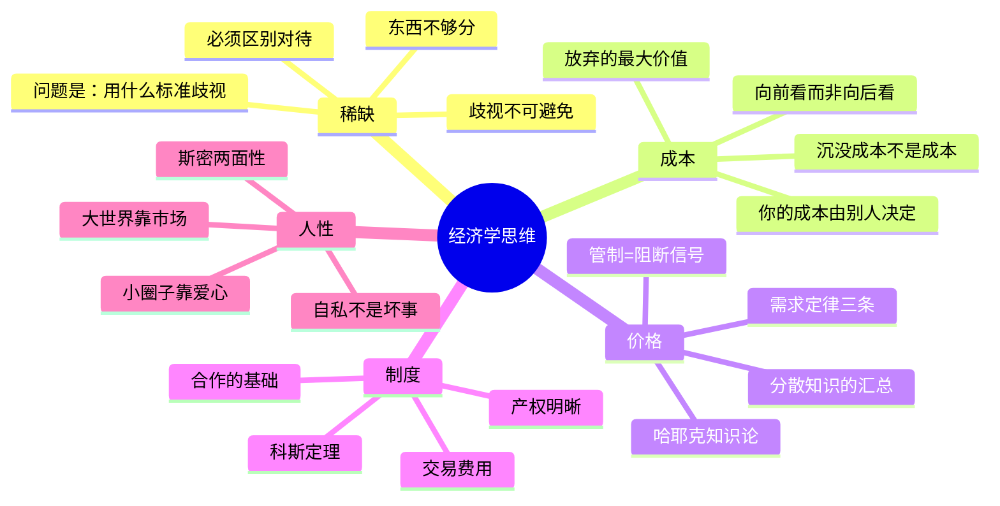

## 《薛兆丰经济学讲义》读书笔记
  
### 作者  
digoal  
  
### 日期  
2026-05-27  
  
### 标签  
读书笔记 , 薛兆丰经济学讲义   
  
----  
  
## 背景  
   
---
书名: 《薛兆丰经济学讲义》   
作者: 薛兆丰   
出版年份: 2018   
笔记日期: 2025-05-27   
豆瓣链接: https://book.douban.com/subject/30242320/   
豆瓣评分: 8.1   
标签: [经济学, 通识, 价格理论, 市场经济, 知识付费]   
---

   

> **一句话**：用价格理论这把手术刀，解剖你以为自己懂其实并不懂的日常世界。   
> **适合谁读**：对经济学一无所知却充满好奇的人；习惯用道德判断代替逻辑分析的人；想理解"为什么市场看上去冷酷却往往最有效"的人。   
> **阅读难度**：⭐⭐☆☆☆   
> **推荐指数**：⭐⭐⭐⭐☆   
   
---

## 一、时代坐标：一本从麦克风里长出来的书

2017年，中国知识付费浪潮方兴未艾。罗振宇的"得到"App正在寻找能把严肃知识讲得让人上瘾的人。薛兆丰，彼时北京大学国家发展研究院的法律经济学教授，走进了麦克风前。

他开设的专栏《薛兆丰的经济学课》迅速成为现象级产品——付费订阅者突破25万，据称是全球最大规模的经济学课堂。2018年，这些音频和图文讲义被整理成书，就是这本《薛兆丰经济学讲义》。

这本书的出身决定了它的气质：**不是写给同行看的论文，也不是传统教科书的压缩版，而是一个讲师对着几十万双眼睛，用真实案例一讲再讲、不断打磨出来的认知工具箱。**

薛兆丰的学术根在美国乔治·梅森大学——那是一个以自由主义和奥地利学派著称的经济学重镇。他的思想受阿尔钦（产权理论）、布坎南（公共选择理论）、科斯（交易费用理论）等人的直接影响。这使得他的经济学有一种鲜明的偏好：**相信市场，怀疑政府干预，强调价格信号的不可替代性。**

2018年他从北大离职，专注于"得到"平台。这个选择本身，就是一个活生生的经济学案例——机会成本与比较优势的实践。

---

## 二、核心命题：三把钥匙，开三扇门

### 命题一：稀缺是万恶之源，也是文明之母

这是全书的出发点，也是理解一切经济现象的底层逻辑。

薛兆丰用"战俘营里的经济组织"开篇——二战战俘营里，战俘们用香烟作为货币自发形成了市场。这说明，**市场不是被设计出来的，是稀缺逼出来的。** 只要资源不够用，人们就必须想办法分配，而价格正是分配稀缺资源效率最高的信号系统。

更犀利的推论是：**稀缺必然导致歧视。** 当东西不够分，就必须区别对待，这在逻辑上无法回避。区别在于：是用价格歧视、排队歧视、还是关系歧视——没有"不歧视"这个选项，只有"用哪种方式歧视"的问题。

### 命题二：成本是放弃了的最大代价，而非花出去的钱

"成本"这个词，薛兆丰花了整整一章来纠偏。

他的定义是：**成本是你做这个选择所放弃的所有其他选项中最有价值的那一个。** 这意味着：

- 你的成本由别人的机会决定，而不只由你的花费决定。（一块地皮的成本取决于它最高价值的用途，不管你花了多少钱买来的）
- **沉没成本不是成本。** 已经发生且不可挽回的支出，在决策时应该被忽略。你应该向前看，问的是"从现在开始，继续还是放弃，哪个代价更小"，而不是"我已经投入了多少"。

这个观点对大多数人来说是反直觉的——我们太习惯为沉没成本痛苦了。

### 命题三：价格是信息，管制价格就是在射杀信使

这是全书最有张力、也最有争议的部分。

薛兆丰认为，价格不只是一个数字，它是**无数分散的局部知识在市场上汇总的结果**（这里他援引了哈耶克的"知识论"）。一旦政府人为限制价格（比如限制灾区水的价格、限制春运火车票价格），就等于阻断了这个信号传递系统——表面上是"保护消费者"，实质上是让更需要这个东西的人拿不到它，让资源流向了错误的地方。

```
价格上涨的真实含义：
"这东西现在更稀缺了，请大家重新评估自己是否真的需要它"
                    ↓
供给增加 + 需求减少 → 价格回落 → 危机缓解
```

用道德愤慨代替价格机制，往往制造更大的混乱。

---

## 三、论证地图：薛兆丰如何说服你



薛兆丰的论证方式高度一致：**找一个反直觉的现象 → 用价格理论或产权理论解释 → 得出一个让读者"哦，原来如此"的结论。**

他擅用的论证工具有三类：

**① 极端案例法**：战俘营有市场、马粪争夺案讲产权——用边缘情境放大核心原理，让抽象规律变得具体可感。

**② 反向追问法**：不问"应不应该这样"，而问"不这样会怎样"。比如讨论春运票价，他不问"该不该涨价"，而问"不涨价，结果是什么"——答案是：黄牛赚走了所有差价，还额外制造了大量交易摩擦。

**③ 看不见的成本法**：反复提醒读者，决策不能只看看得见的结果，还要看看不见的机会成本和次级效应。这来自弗雷德里克·巴斯夏（Bastiat）的"看得见的与看不见的"。

---

## 四、前提假设与边界：什么时候这套逻辑会失效？

这套分析框架建立在几个重要假设上，值得检视：

**假设一：个体是理性的（或近似理性的）**
薛兆丰有时承认有限理性的存在，但全书主体框架依赖理性人假设。当面对成瘾品、恐慌行为、认知偏见时，纯粹的价格理论解释力大打折扣。行为经济学（卡尼曼、塞勒）的研究早已证明，人类系统性地偏离理性。

**假设二：市场失灵是例外，而非常态**
薛兆丰承认外部性、信息不对称等问题，但总体立场是：政府干预往往比市场失灵更糟糕。这在芝加哥-乔治·梅森传统里是共识，但并非无争议——特别是在公共卫生、气候变化、金融系统性风险等领域，市场自身解决问题的能力非常有限。

**假设三：价格能反映真实价值**
这一假设在成熟市场中大体成立，但在垄断、信息严重不对称、产权不清晰的场景里会失效。中国特定的土地制度、国有企业竞争等现实问题，用纯粹的价格理论来分析往往会得出失真的结论。

**一位UCSD经济学教授的批评很精准**：薛兆丰对经济学的认识大体停留在上世纪七八十年代的几位大师那里，对产业组织、激励理论、市场设计、政治经济学等更现代的发展理解有限。而七八十年代的经济学恰好特别意识形态化，因此有一种强烈的说服力——但简洁有时意味着过度简化。

---

## 五、思想谱系：这本书站在哪些巨人的肩膀上

薛兆丰的思想来源清晰可溯：

```
亚当·斯密（人性两面性、看不见的手）
        ↓
弗里德曼（货币主义、自由市场）
科斯（交易费用、产权理论）
阿尔钦（进化视角的经济学）
哈耶克（知识分散、价格信号）
布坎南（公共选择理论）
        ↓
薛兆丰《经济学讲义》
（中国场景 + 案例教学 + 知识付费传播）
        ↓
25万+中国普通读者的经济学启蒙
```

这个谱系里有一个鲜明的特征：**几乎全部是市场友好型、政府怀疑型的经济学传统。** 凯恩斯、斯蒂格利茨、皮凯蒂等另一个方向的大思想家，在书中基本以"对立面"的姿态出现。

这不是缺陷，是选择。每位思想者都有立场。但读者需要知道，自己拿到的是一副什么颜色的眼镜。

---

## 六、我学到了什么？

读这本书，我最大的收获不是某个具体的知识点，而是一种**思维习惯的重新校准**：

**收获一：学会问"然后呢？"**

每当看到一个政策或现象，不能只看第一层效果，还要追问"然后呢"——二阶、三阶效应是什么。比如限制房租，表面上帮了租房者，"然后呢"：房东减少供给、房屋维护减少、黑市租金出现、真正需要房子的人更难租到……这个思维习惯，某种程度上是一种智识上的诚实。

**收获二：把"应不应该"换成"会怎样"**

道德判断在经济分析里是一种干扰项。经济学最有价值的训练，是暂时悬置情感，问"如果这样做，会发生什么"。并不是说道德不重要——而是你得先搞清楚会发生什么，才能做出真正负责任的道德判断。

**收获三：理解陌生人的协作奇迹**

"铅笔的故事"（来自米尔顿·弗里德曼）是我读过最迷人的经济学寓言：没有一个人知道如何从头到尾做出一支铅笔，但每天数十亿支铅笔被生产出来，靠的是价格信号协调了无数陌生人的劳动。这让我对市场秩序充满了某种敬畏——它并不是谁设计出来的，是人类互动中自发涌现的。

---

## 七、举一反三：这个框架还能用在哪？

薛兆丰的核心分析框架——**稀缺→选择标准→成本→价格信号→制度安排**——可以迁移到很多日常决策：

**求职与跳槽**：你的薪资不只取决于你努力了多少，更取决于你能给雇主创造多少价值，以及市场上有没有人能替代你。成本不是你花了多少时间，而是你放弃了什么。

**时间管理**：时间是绝对稀缺资源。"我没时间"其实是"这件事对我来说成本太高"——你在说的其实是比较优势与机会成本。一旦这样理解，就不会再为拒绝某些事情感到愧疚。

**婚姻与承诺**：薛兆丰书中有一段关于婚姻的经济学分析颇为惊世骇俗——婚姻是一种制度安排，用来解决男女之间的信息不对称和长期合作的激励问题。这听起来很冷酷，但理解这一点，能让你更清醒地看待承诺的价值与脆弱性。

---

## 八、批判与反思：我不同意的地方

**批评一：把"有效率"等同于"好的"**

这是本书最根本的价值预设问题。效率是一个工具性指标，它回答的是"怎样做成本最低"，但不回答"什么目标值得追求"。薛兆丰有时会滑向用效率论证一切的倾向——这是经济学帝国主义的通病，把一个分析工具当成了价值体系。

**批评二：忽视了权力结构**

价格信号理论在"买卖双方地位大体对等"时最有解释力。但现实中存在大量非对称权力关系——大企业对散户、雇主对员工、平台对商家。在这些场景里，"让市场说话"很多时候是让强者说话。劳动保护法、反垄断法的存在，不只是政府的"干扰"，是对市场失灵的必要补充。

**批评三：中国的特殊语境被低估**

书中很多案例的逻辑成立有个前提：产权清晰、法律可执行、市场充分竞争。但中国的土地制度、国企补贴、信息管制等制度背景，使得直接套用西方自由市场理论会产生明显的失真。

**这本书会让你变得更理性，但如果你只读这一本，可能会变得有些冷血。** 它需要被其他视角——比如分配公平、历史制度、行为偏差——来平衡。

---

## 九、金句与记忆点

> **"改造世界，非经济学所长；但改造世界观，却是经济学的强项。"**
> ——这是理解这本书最好的引言。它不告诉你该支持哪个政策，它改变你看世界的方式。

> **"沉没成本不是成本。"**
> ——向前看，不要为覆水痛苦。已经花出去的钱、已经过去的时间，在当下决策时应该归零。

> **"稀缺必然导致歧视，问题不是要不要歧视，而是用什么标准歧视。"**
> ——这句话第一次读觉得离经叛道，读完全书才理解：歧视在这里是中性词，意思是"区别对待"。

> **"不要在家庭、朋友圈里斤斤计较，过分讲究市场规则；也不要在市场上强求陌生人表现出不切实际的爱心。"**
> ——亚当·斯密的人性观精华版。这句话值得打印贴在墙上。

> **"看得见的和看不见的。"**
> ——来自巴斯夏。每一个政策都有可见的受益者和不可见的受损者。经济学的价值，就在于训练你看见那些看不见的后果。

> **"价格是知识的载体，限制价格就是阻断信息。"**
> ——哈耶克的知识论在这里变成了最直接的政策批评工具。

> **"商业是最大的慈善。"**
> ——有争议，但值得思考：创造就业、降低成本、提高效率，长期来看比直接转移支付更能减少贫困。

---

## 十、延伸阅读

**① 《经济学通识》——薛兆丰**
本书的前身，更简短也更早期，可以作为对照，看薛兆丰思想的演变。

**② 《一课经济学》——亨利·黑兹利特**
和本书同一传统，强调"看不见的后果"。比薛更系统，适合想深入这个思想传统的读者。

**③ 《牛奶可乐经济学》——罗伯特·弗兰克**
同样是日常生活中的经济学，但弗兰克来自康奈尔，立场更平衡，也更关注外部性和不平等问题，可作为很好的补充视角。

**④ 《思考，快与慢》——卡尼曼**
行为经济学的奠基之作。读完会发现，理性人假设有多脆弱，以及薛兆丰框架的边界在哪里。

**⑤ 《国富论》——亚当·斯密**
薛兆丰反复引用斯密，但斯密本人远比他的追随者复杂。读原著会发现斯密对道德情感、贫富差距的关怀，并不亚于对市场的推崇。

---

*笔记写于 2025-05-27 | 基于公开资料与深度思考整理*
  
  
#### [PostgreSQL 解决方案集合](../201706/20170601_02.md "40cff096e9ed7122c512b35d8561d9c8")
  
  
#### [德哥 / digoal's Github - 公益是一辈子的事.](https://github.com/digoal/blog/blob/master/README.md "22709685feb7cab07d30f30387f0a9ae")
  
  
#### [About 德哥](https://github.com/digoal/blog/blob/master/me/readme.md "a37735981e7704886ffd590565582dd0")
  
  

  
