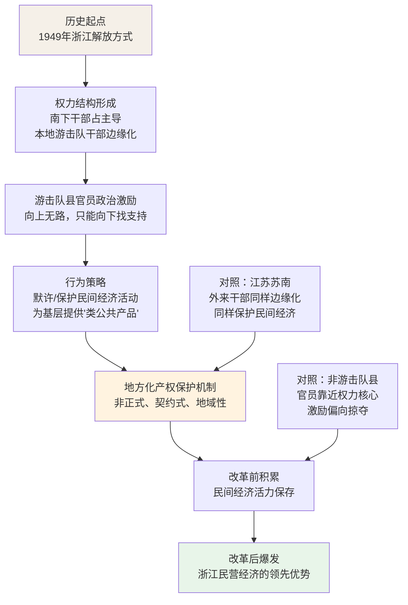

## 《权力结构、政治激励和经济增长——基于浙江民营经济发展经验的政治经济学分析》读书笔记
  
### 作者  
digoal  
  
### 日期  
2026-05-27  
  
### 标签  
读书笔记 , 权力结构、政治激励和经济增长——基于浙江民营经济发展经验的政治经济学分析   
  
----  
  
## 背景  
   
---
书名: 《权力结构、政治激励和经济增长——基于浙江民营经济发展经验的政治经济学分析》   
作者: 章奇 / 刘明兴   
出版年份: 2016   
出版社: 格致出版社 / 上海三联书店 / 上海人民出版社   
笔记日期: 2026-05-27   
ISBN: 9787543223714   
标签: [政治经济学, 中国经济, 民营经济, 产权保护, 地方治理, 浙江模式]   
---

         

> **一句话**：在一个没有可靠产权保护的集权体制里，民营经济的繁荣，恰恰来自那些被权力边缘化的官员——他们需要向下寻求政治庇护，于是意外成了民间经济的守护者。   
>   
> **适合谁读**：关心"中国经济奇迹"背后政治逻辑的读者；政治经济学、历史制度分析爱好者；想理解地方官员行为机制的政策研究者   
>   
> **阅读难度**：⭐⭐⭐⭐☆（学术性较强，大量史料和统计论证，需要一定耐心）   
>   
> **推荐指数**：⭐⭐⭐⭐⭐   

---

## 一、时代坐标：这本书从哪里来？

2016年，中国经济经历了三十余年的高速增长后开始步入"新常态"。学界对"中国奇迹"的解释已汗牛充栋：有人强调出口导向和全球化红利，有人归功于"晋升锦标赛"激励地方官员拼经济，有人关注乡镇企业的制度创新。然而，一个长期困扰经济学家的谜题始终未能得到令人信服的回答：

**在一个产权保护残缺、政府承诺随时可被撤销的环境里，民营企业家为什么还愿意投资？这套脆弱的制度环境，究竟靠什么维系着市场经济的运转？**

更令人困惑的是区域差异——同样处于中国体制之下，为何浙江的民营经济遥遥领先，而某些省份的私营部门却始终孱弱？这种差异不是改革后才出现的新事物，早在1949年之后的集体化、文革岁月里，就已悄然埋下根基。

章奇（复旦大学）和刘明兴（北京大学）两位学者，均有北大经济学博士背景，长期深耕中国政治经济学领域。他们将目光投向浙江——这片民营经济最发达的土地——试图从革命历史的遗产中，找到解开谜题的钥匙。

```
时间轴：

1922─1949  浙江本地游击队干部形成
    ↓
1949       解放：南下干部入浙，本地游击队干部被边缘化
    ↓
1950s      农业集体化：游击队县悄悄"睁一只眼闭一只眼"
    ↓
1966─1976  文化大革命：政治不确定性最高，边缘化激励最显著
    ↓
1978─      改革开放：浙江民营经济爆发，"地下火种"燃成熊熊烈焰
    ↓
2016       本书出版，理论框架系统化呈现
```

---

## 二、核心命题：作者在说什么？

### 命题一：被边缘化的官员，反而是产权的守护者

这是全书最反直觉、也最核心的发现。

通常我们会认为，官员要么被"晋升锦标赛"激励着拼经济（因为经济绩效决定升迁），要么是掠夺者（因为权力缺乏约束）。章奇和刘明兴提出了第三种可能：那些在省级权力结构中处于**边缘地位**的地方官员，由于无法向上获得庇护、晋升无望，转而向下寻求基层民众的政治支持。而要赢得这份支持，他们能给出的最实在的筹码，恰恰是**对民间经济活动的默许与保护**。

这种保护不是基于法律，不是基于意识形态，而是基于一种朴素的政治交换：**你们支持我在这片土地上的政治生存，我来保护你们做生意、积累财富。**

作者将这一机制命名为"**地方化产权保护机制**"——它是非正式的、契约式的、有地域局限性的，但在正式制度残缺的年代，它切实地发挥了作用。

### 命题二：历史的偶然，决定了权力结构；权力结构，决定了经济命运

为什么浙江会出现这种"边缘化官员守护民营经济"的格局，而不是其他省份？

答案藏在1949年的解放战争史中。由于浙江的解放方式特殊——主要是外省南下干部接管，本地游击队干部随即遭到政治边缘化——省级权力核心长期由南下干部把持，而本地干部主政的县市，恰好构成了整个省级权力结构中的"边缘地带"。

作者将这些由本地游击队干部主导的县称为"**游击队县**"，与之对应的是南下干部主导的"非游击队县"。研究发现，在集体化运动、大跃进、文革等高压政治运动中，**游击队县系统性地比非游击队县更倾向于保护基层经济利益**——这在统计上是显著的，在历史叙述上也有丰富案例支撑。

更精妙的是江苏的对照实验。江苏的情况恰好相反：省级权力核心由本地干部把持，苏南地区反而由外来根据地干部主政，处于边缘地位。研究发现，这些处于权力边缘的苏南干部，同样保护了当地的民间经济活力——为后来的"苏南模式"保留了火种。这一对照有效地排除了"本地人天然照顾本地经济"的替代解释。

### 命题三：非正式产权保护有其历史使命，也有其根本局限

地方化产权保护机制的存在有两个不可或缺的条件：一是体制内存在边缘化的精英愿意"向下找支持"，二是整体政治环境的不确定性足够高，使得向上寻求庇护的渠道不可靠。

当中央集权强化、官员晋升通道重新畅通、政治环境趋于稳定时，边缘化官员的激励就会消失，非正式产权保护的空间也随之收窄。书末的结论直接点出：**非正式的地方化保护，终究只是正式制度的临时替代品。随着经济体量扩大，中国迫切需要建立真正意义上的正式产权保护制度。**

---

## 三、论证地图：作者怎么说服你的？



**关键数据与案例**：在集体化运动时期，游击队县的农民上交粮食比例、公共食堂推进速度等指标，均显著低于非游击队县——这是边缘化官员"睁一只眼闭一只眼"的统计痕迹。1976年后浙江企业家创业故事的密集叙述，则生动展示了那些在政治压力缝隙中悄悄积累的商业活力。

**论证方式的特点**：本书采用了"历史叙述+定量检验+案例比较"三位一体的混合研究方法，学术底气相当扎实。尤其是浙江与江苏的比较设计，堪称教科书级别的反事实推理——用一个"天然对照实验"来排除竞争性解释。

---

## 四、前提假设与边界：什么情况下这不成立？

**假设一：官员是理性的政治生存最大化者**

全书的推论建立在官员"以政治生存为首要目标"这一前提上。这大体是可信的，但也可能过于简化——历史上并非所有地方官员都精于政治算计，意识形态信仰、个人道德、地方情感同样影响行为。书中部分历史叙述其实揭示了官员行为的复杂性，但理论框架有意将其简化。

**假设二：边缘化官员的激励必然指向保护民营经济**

边缘化不一定等于"向下找支持"——官员也可能选择消极怠政、明哲保身，而不是积极地为民间经济提供保护。书中对于为什么边缘化官员选择"主动保护"而非"被动沉默"的机制解释，仍有可深化之处。这也是豆瓣书评中被尖锐指出的闭环问题：边缘化官员提供产权保护，真的给他们带来了可度量的政治回报吗？

**假设三：1949年的权力分布格局长期稳定**

几十年的历史跨度中，干部的调动、退休、政治运动的洗牌，是否足以侵蚀这一初始结构？书中用大量史料证明了这一结构的延续性，但在快速变动的政治环境中，这种稳定性本身也需要更细致的检验。

**适用边界**：这一框架对于理解"体制内部的异质性如何催生非正式制度创新"有很强的解释力，但若将其推广到当代高度集中的政治环境，或者不同历史轨迹的其他国家，就需要更多修正。

---

## 五、思想谱系：这本书站在哪个传统里？

本书是两个思想传统的交汇点：

**传统一：政治生存理论**（Bueno de Mesquita等人的"选择者理论"）
政治领袖的行为逻辑，取决于其需要取悦的"关键支持者"规模。关键支持者越少，领袖越倾向于利用私人利益笼络核心圈子；关键支持者越多，越需要提供公共品。章奇、刘明兴将这一框架"缩小版"应用到县级官员层面，提出：边缘化官员的"关键支持者"是基层民众，因此他们反而有动力提供准公共品——产权保护。

**传统二：历史制度主义**
制度经济学家长期关注"路径依赖"——历史的偶然事件如何锁定长期发展轨迹。本书是这一传统的中国实践：1949年解放战争的偶然分工，竟然决定了七十年后区域经济格局的基本面貌。这与Acemoglu & Robinson关于"殖民地制度遗产如何塑造现代发展"的研究旨趣高度一致。

```
思想谱系示意：

政治生存理论                    历史制度主义
(Bueno de Mesquita)            (Acemoglu, North)
         ↘                    ↙
          章奇 & 刘明兴
          "地方化产权保护机制"
                ↓
        挑战"晋升锦标赛"理论
        (周黎安等人的主流解释)
```

本书对"晋升锦标赛"理论的挑战尤为值得关注。主流理论认为，地方官员拼经济是为了晋升；但浙江的数据显示，游击队县经济发展好，官员却没有因此获得更好的晋升机会——恰恰相反，正是晋升无望才激发了他们向下寻求支持的动力。这是对既有理论的正面反驳，也是本书最富挑战性的学术贡献之一。

---

## 六、我学到了什么？

**收获一：制度是历史的沉淀，不是设计图纸**

浙江今天的民营经济奇迹，不是哪位改革设计师的蓝图，而是七十年前一批被挤到权力边缘的地方干部，在生存压力下做出的一个又一个微小选择的积累。这提醒我们：在理解任何制度现象时，都要对历史保持足够的敬意——很多"当下的制度"，其实是某个遥远历史节点上政治博弈的残影。

**收获二：权力边缘化，可能是变革的意外温床**

这个发现让我联想到许多历史时刻：体制内的边缘人物、被主流排斥的群体，往往反而成为新事物的孵化者，因为他们没有什么可以失去。浙江的民营经济、某种程度上的苏南乡镇企业，都暗合这一逻辑。"中心"有守护既得利益的冲动，"边缘"才有破局的动力。

**收获三：非正式制度有其历史价值，但不能指望它走到最后**

在正式法律制度残缺的年代，关系、默契、非正式承诺撑起了大量经济活动。但这套东西是靠人际信任和局部政治格局维系的，一旦人走政息或政治环境改变，就会瞬间崩塌。这是浙江模式给中国经济制度建设留下的真正的警示：非正式产权保护只是过渡，正式制度的建立才是根本出路。

---

## 七、举一反三：这个框架还能用在哪？

**场景一：理解互联网平台经济的崛起**

中国互联网企业在2000年代的高速成长，某种程度上也是在"制度空白"和"监管边缘"中实现的。早期的监管模糊性，客观上给了企业家试错的空间。当然，这里的"边缘化"不是官员的，而是产业本身的——新兴行业处于旧有监管框架的边缘，正式制度尚未覆盖，才有野蛮生长的余地。

**场景二：分析组织内部的创新**

大公司的创新往往不来自核心业务部门，而来自"边缘项目组"——因为核心部门有太多利益要保护，而边缘团队可以更自由地尝试。Google、Amazon的许多重要产品，最初都是非主流团队的实验。"边缘化催生创新"的逻辑，在组织层面同样成立。

**场景三：比较政治经济学中的"地方性保护机制"**

本书的框架可以推广到其他威权体制或弱制度国家：在官员需要在体制内竞争政治生存、但又无法依靠上级庇护的地区，是否也会出现类似的"向下找支持、换取产权保护"的机制？从东欧转型国家到某些东南亚国家，都值得用这一视角重新审视。

---

## 八、批判与反思

本书的论证精彩，但有几个地方让我感到不够完整：

**一、"政治回报"的闭环问题**

书中的逻辑是：边缘化官员保护民营经济，以换取基层政治支持，从而提高政治生存概率。但问题是：这些官员最终真的因为基层支持而获得了更好的政治结果吗？书中指出他们没有因为经济绩效而晋升——那么"基层政治支持"究竟如何转化为"政治生存"的提升，这个机制仍然有些模糊。如果边缘化官员最终都没有比非边缘化官员活得更好，理性人为什么要采取这种策略？

**二、史料占比过重，定量论证相对弱**

作为政治经济学实证研究，本书的历史叙述部分极为厚重，有时显得过于冗余。若能更系统地呈现定量检验结果，论证的说服力会更强。学者型读者可能会期待更严格的因果识别策略（比如工具变量或断点回归）。

**三、当代适用性存疑**

本书的分析对象主要是1949年到改革开放初期的历史时期。随着中央政府对地方治理的深度渗透，这种"边缘化官员向下找支持"的空间已大幅压缩。书末虽然触及了这一问题，但篇幅有限，对于理解"浙江模式在新形势下能否持续"的问题，留给读者的空间多于答案。

---

## 九、金句与记忆点

1. **"掠夺之手"与"帮助之手"** — 政治上靠近权力核心的官员，趋于掠夺；被边缘化的官员，反而趋于帮助。这是全书最核心的反直觉命题。

2. **"地方化产权保护机制"** — 在正式制度残缺时，非正式的政治—经济利益交换，可以充当产权保护的替代品。这是本书对政治经济学理论最重要的概念贡献。

3. **"黑夜中狗不叫"** — 第三章标题的隐喻：集体化运动中，游击队县的基层干部保持了沉默，没有积极推行"左"的政策。这种"不作为"，恰恰是一种深刻的政治行动。

4. **"政治生存优先于税收最大化"** — 书中援引的理论命题：对于独裁者和政治精英而言，如何保住权力，比如何做大经济蛋糕更重要。这解释了为何很多威权政府不热衷发展经济。

5. **"历史的路径依赖"** — 1949年解放战争的偶然格局，塑造了七十年后的区域经济差异。初始条件的微小差异，经过时间的放大，可以产生难以逆转的结构性分化。

6. **浙江模式 vs. 江苏模式** — 两省的比较是理解本书的关键：同样的体制，因为权力结构镜像颠倒，产生了截然不同的激励，最终走向了不同的发展路径。

---

## 十、延伸阅读

1. **《独裁者手册》（The Dictator's Handbook）** — Bueno de Mesquita & Smith 著。本书理论来源，通俗版的"政治生存理论"，读来比教科书有趣得多，是理解本书理论框架必读的前置书。

2. **《国家为什么会失败》（Why Nations Fail）** — Acemoglu & Robinson 著。同一思想传统中的里程碑之作，讲述包容性制度与掠夺性制度如何在历史偶然性中分叉，宏观尺度上与本书高度互补。

3. **《黄亚生：中国模式》（Capitalism with Chinese Characteristics）** — 黄亚生著。从另一个角度研究中国私营部门发展的区域差异，对于"江苏vs.浙江"的讨论有直接的参照价值。

4. **《发展型地方国家》（The Rise of Local States）** — 中国地方政府与经济发展关系的比较研究，与本书对话密切。

5. **周黎安《转型中的地方政府》** — "晋升锦标赛"理论的重要文献，读完本书后再读，可以感受到两种理论框架之间真实的学术张力。

---

*笔记写于 2026-05-27 | 基于公开资料与深度思考整理*

*作者简介：章奇（复旦大学）、刘明兴（北京大学），均为北大经济学博士，长期从事中国政治经济学研究。本书是两人学术合作的代表作，也是「当代经济学系列丛书」中少见的兼顾历史深度与理论严谨性的著作。*
  
  
#### [PostgreSQL 解决方案集合](../201706/20170601_02.md "40cff096e9ed7122c512b35d8561d9c8")
  
  
#### [德哥 / digoal's Github - 公益是一辈子的事.](https://github.com/digoal/blog/blob/master/README.md "22709685feb7cab07d30f30387f0a9ae")
  
  
#### [About 德哥](https://github.com/digoal/blog/blob/master/me/readme.md "a37735981e7704886ffd590565582dd0")
  
  

  
