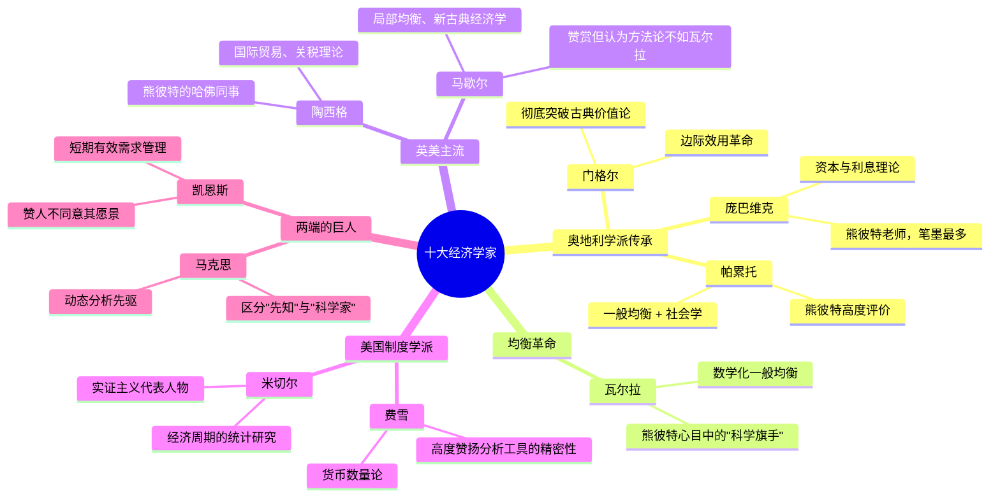

## 《从马克思到凯恩斯》读书笔记
  
### 作者  
digoal  
  
### 日期  
2026-05-27  
  
### 标签  
读书笔记 , 从马克思到凯恩斯   
  
----  
  
## 背景  
   
---
书名: 《从马克思到凯恩斯》（Ten Great Economists: From Marx to Keynes）   
作者: 约瑟夫·熊彼特（Joseph A. Schumpeter）   
译者: 韩宏等   
出版社: 江苏人民出版社   
出版年份: 2003（原著1951）   
笔记日期: 2026-05-27   
ISBN: 9787214024602   
标签: [经济思想史, 经济学家传记, 奥地利学派, 学术随笔, 熊彼特]   
---

   

> **一句话**：一位顶尖经济学家用半生时间，为他的十位前辈和同辈写下的悼词与判决书——字里行间，你读到的是整个现代经济学的灵魂地图。   
>   
> **适合谁读**：有一定经济学基础的读者；对经济思想史、学术人物传记感兴趣者；希望理解现代经济学"家谱"的人   
>   
> **阅读难度**：⭐⭐⭐⭐☆（熊彼特的文风举重若轻，大量术语，翻译难度极高）   
>   
> **推荐指数**：⭐⭐⭐⭐☆   

---

## 一、时代坐标：这本书从哪里来？

1950年1月，约瑟夫·熊彼特在睡梦中辞世，距他最后的讲课只过了短短几天。身后，他的妻子伊丽莎白整理遗稿，将他跨越四十年（1910—1950）在各大经济学期刊上发表的十篇学术评传结集出版，次年以《从马克思到凯恩斯十大经济学家》为题面世，立刻被《纽约时报》称为"迄今对凯恩斯思想最好的全面评价"之一。

这四十年，是现代经济学最动荡也最丰收的时代：第一次世界大战、大萧条、凯恩斯革命、第二次世界大战……熊彼特亲历了几乎所有这些剧变。他曾短暂出任奥地利财政部长（1919年），又弃仕从商、银行破产负债累累，最终落脚哈佛，用漫长的学者生涯消化这一切。

他为什么要写这些评传？原因并不高尚——这些文章最初大多是应约的悼词或周年纪念文章，他自己甚至一度觉得不值得结集出版，是读者和学界的强烈呼声才促成了这本书。但这种"半推半就"的起源，反而赋予了文章一种难得的坦率：没有专著的宏大叙事包袱，只有一位在场者的即兴评判。

熊彼特是庞巴维克的门徒，奥地利学派的传人，却又心仪瓦尔拉的数学化均衡体系，还对马克思的历史动力学深怀敬意——这种复杂的思想血统，使他成为唯一有资格为这十位经济学家同时做判官的人。

```
时间轴：熊彼特的人生与本书的写作背景

1883  熊彼特出生于奥匈帝国摩拉维亚省
1906  维也纳大学毕业，师从庞巴维克
1911  《经济发展理论》出版，创新理论奠基
1919  短暂出任奥地利财政部长（仅7个月）
1924  银行破产，负债
1932  转赴哈佛大学任教（直至去世）

------[十篇评传的写作时间段]------
1910 ─── 1950  为十位经济学家陆续撰写评传
  │
  ├─ 马歇尔（1924，百年纪念）
  ├─ 瓦尔拉（1910）
  ├─ 马克思（重写多稿，最具争议）
  └─ 凯恩斯（1946，凯恩斯去世次年，最后一篇）

1950  熊彼特辞世
1951  本书由妻子伊丽莎白整理出版
```

---

## 二、核心命题：这本书在说什么？

这不是一本普通的人物传记集。熊彼特给自己定的任务是：在每一位经济学家的成就与局限之间，找到分水岭。他的核心主张贯穿全书，可以归纳为三个命题：

### 命题一：伟大的经济学家，首先是"社会愿景"的携带者

熊彼特在多篇文章中反复强调，每一位影响深远的经济学家，背后都有一套关于社会运作方式的"前分析直觉"（pre-analytic vision）。马克思看到了资本主义内在的阶级矛盾与历史必然性；凯恩斯相信短期有效需求管理是政府的天职；马歇尔怀抱维多利亚时代的乐观主义，相信自由市场终将向善。

这些"愿景"不是科学结论，而是科学工作的起点。熊彼特的独特之处在于，他能将这种前提性的价值判断与技术性的分析工具截然分开，然后分别评价——他可以在批评一个人的社会愿景的同时，全力赞美他的分析贡献。他对凯恩斯有一句著名的评语，大意是：即便你认为他的社会愿景是错误的，他的每一个命题都是误导性的，你依然可以赞美这个人。这种能力，是极少数思想巨人才拥有的。

### 命题二：瓦尔拉，而非马歇尔，才是经济学的科学基础

这是本书最挑衅性的判断之一。在熊彼特心目中，里昂·瓦尔拉（Léon Walras）——那位建立了一般均衡数学体系的法国经济学家——是现代经济学方法论上最重要的革命者，其地位甚至高于马歇尔。原因在于：瓦尔拉把经济系统作为一个整体来分析，而马歇尔的局部均衡方法则更像一种实用主义的工程学。

在当时，这是需要勇气的判断。马歇尔是英国经济学的正统权威，剑桥学派如日中天。熊彼特此举，等于在挑战主流。

### 命题三：马克思，是一位被误读的经济学科学家

熊彼特关于马克思的评传，是全书最精彩也最费思量的一篇。他明确区分了马克思作为"革命先知"和"经济学科学家"的两个身份。作为先知，马克思的很多历史预言是错的；但作为科学家，马克思是历史上最早系统运用"动态分析"——把资本主义视为一个不断演化的过程而非静态均衡——的经济学家之一。熊彼特认为，马克思的剩余价值理论逻辑上存在缺陷，但他对资本主义内在动力的把握，与熊彼特自己的"创造性破坏"理论有着深刻的精神共鸣。

---

## 三、论证地图：熊彼特如何评价这十位经济学家



全书的评价标准并不统一（毕竟是四十年间写成），但有几个清晰的评判维度：

**分析工具的精密性**：熊彼特极推崇数学方法和逻辑严密性。费雪在货币理论上的工具精密，庞巴维克在资本理论上的逻辑链条，都得到高度赞扬。

**动态 vs 静态**：这是熊彼特最核心的关切。他自己的理论体系建立在动态变化和创新上，因此凡是重视"经济过程演化"的经济学家，都获得他额外的青睐——马克思因此意外地受到了相当正面的评价。

**是否混淆愿景与分析**：这是熊彼特用来批评凯恩斯的核心标准。凯恩斯的政策建议往往与他的分析工具搅在一起，很难分清哪里是"科学发现"哪里是"价值主张"。

---

## 四、前提假设与边界：什么情况下这不成立？

熊彼特的评价框架建立在几个值得追问的假设上：

**假设一：科学分析与价值愿景可以截然分开。**
这一假设本身就颇有争议。托马斯·库恩的科学哲学告诉我们，科学范式本身就嵌入了某种社会视角；后续的女性主义经济学和批判经济学也反复指出，所谓"中立的分析工具"往往内嵌了某种特定的社会假设。熊彼特的分离，可能比他自己意识到的更困难。

**假设二：经济学的进步方向是数学化和形式化。**
熊彼特对瓦尔拉的推崇，暗含了他相信一般均衡数学是经济学科学化的正途。但这一方向后来受到了来自行为经济学、复杂系统经济学和奥地利学派内部的强烈质疑——真实世界的经济是否真的可以被均衡方程捕捉？

**假设三：以对"科学分析贡献"的评价为最高标准。**
这意味着马克思在政治上引发的巨大历史影响，以及凯恩斯政策建议实际拯救了数百万人失业的现实，在熊彼特的价值体系里地位相对次要。这是一种典型的"象牙塔内的评价"——公平，但可能遗漏了最重要的东西。

---

## 五、思想谱系：熊彼特站在哪里？

```
奥地利学派内部的传承与反叛

门格尔（边际革命奠基人）
    │
庞巴维克（资本与利息，熊彼特老师）
    │
熊彼特─────────────────────────
    │          对瓦尔拉的崇拜        │
    │         （跨学派欣赏）         │
    ↓                                ↓
动态创新理论                   一般均衡方法论推崇
    │
    ↓
"创造性破坏" → 影响后世：
  ├─ 新熊彼特主义经济学（技术创新理论）
  ├─ 进化经济学（Nelson & Winter）
  └─ 硅谷创业文化话语体系
```

熊彼特是奥地利学派的叛逆者。他的老师庞巴维克对马克思持激烈批评态度，但熊彼特却给马克思写了整本书中篇幅最长的评传，并公开承认马克思是动态分析的先驱。他崇拜瓦尔拉的数学均衡，而哈耶克等奥地利学派的主流却对数学化保持强烈警惕。

同时，他与凯恩斯既是同代人、又是终生的思想对手。两人都深受1929年大萧条的冲击，却走向了截然相反的理论方向：凯恩斯给出了"短期救市"的政策工具箱；熊彼特则坚信大萧条是资本主义"创造性破坏"必经的痛苦，政府干预只会延迟必要的调整。管理学大师彼得·德鲁克后来说了一句广为引用的话：凯恩斯比熊彼特更天才，但熊彼特有大智慧，而大智慧将永垂不朽。

---

## 六、我学到了什么？

读这本书，最大的收获不是关于某个具体经济学家的知识，而是一种**思想史的观察方式**。

**第一个收获：把人和理论分开看**。熊彼特示范了一种稀有的智识美德：他可以深爱一个思想家，同时不接受他的结论；可以批评一个人的政治立场，同时全力赞美他的智识贡献。这在当下互联网的非此即彼文化里，几乎是一种失传的技艺。我们太习惯于用政治标签来过滤知识，而熊彼特告诉我们，这会让你错过最好的东西。

**第二个收获：每一个重要理论背后，都有一个时代的焦虑**。瓦尔拉的均衡理论，回应了19世纪末对社会秩序基础的追问；凯恩斯的有效需求理论，回应了大萧条时期的绝望；米切尔的统计研究，回应了对"经济科学究竟能否预测"的质疑。理论不是天外飞石，它们都是某个人在某个时代，试图解开某个让他寝食难安的问题时写下的。理解了这一点，才能真正理解理论。

**第三个收获：偏见是分析的起点，不是终点**。熊彼特特别诚实地说，每一位经济学家都携带着"前分析直觉"——某种关于世界是什么样的直觉判断。这不是缺点，而是科学工作无法避免的前提。问题不在于消灭偏见，而在于意识到它的存在，并在分析中将其与逻辑结论分开。这个智识诚实的要求，今天依然被大多数人回避。

---

## 七、举一反三：这个框架还能用在哪里？

**应用场景一：评价企业战略或管理思想**。熊彼特那套"把愿景与分析工具分开"的框架，完全可以用来评价管理学大师。德鲁克的贡献是"管理愿景"还是"分析工具"？哪些观点是时代产物，哪些是普遍真理？

**应用场景二：阅读任何经典文本**。读马克思、读凯恩斯、读哈耶克，甚至读任何一本影响深远的书，都可以先问：作者的"前分析直觉"是什么？他带着什么样的社会愿景进入这个问题？然后再问：在这个愿景之内，他的分析工具是否精密、逻辑是否自洽？

**应用场景三：反思自己的思想局限**。每个人都有"前分析直觉"，对经济、社会、人性的基本假设。熊彼特的方法是一面镜子：你在批评别人的时候，是在批评他的逻辑，还是只是不喜欢他的愿景？

---

## 八、批判与反思

这本书并非没有问题。

**选择本身就是立场**。十位经济学家，清一色都是欧美白人男性。没有一位非西方经济学家，没有一位女性。熊彼特没有解释这种选择，但这个"名单"本身就是一种关于谁的经济学"算数"的隐性判断。

**作为庞巴维克门徒的偏心**。书中对庞巴维克的评传篇幅最长，溢美之情溢于言表。一位评论家指出，熊彼特给庞巴维克的篇幅甚至超过了马歇尔和凯恩斯，这与庞巴维克在国际经济学史上的客观地位并不完全相称。

**对凯恩斯的评价有失公允？**。熊彼特赞扬凯恩斯的智识才华，却对他的政策主张保持高度警惕，认为凯恩斯的理论本质上是"短视的"。然而历史证明，凯恩斯政策在二战后帮助西方建立了"大稳健"的数十年。熊彼特的批评也许对，但他低估了短期政策的道德紧迫性——面对数百万人的失业，"等待创造性破坏完成自我清洁"并非所有人都能承受的答案。

**时代已经变了**。书中评价的许多理论，今天已经大大发展。比如米切尔的统计研究，在大数据和机器学习时代有了全新面貌；费雪的货币数量论，经历了弗里德曼的复兴和量化宽松的检验。熊彼特的判断需要放在历史语境里读，不能直接当作今天的"经济学家排行榜"。

---

## 九、金句与记忆点

1. **"对于马克思，朋友们觉得把过多的注意力放在他的经济理论上几乎是亵渎；敌人则几乎不可能承认他的工作中有任何他们自己推崇的东西。"**
   → 熊彼特对马克思的处境有着精准的同情：一个被过度政治化的人，其纯粹的科学贡献因此被双方阵营都遮蔽了。

2. **关于凯恩斯：可以赞美一个人，哪怕你认为他的社会愿景是错的、每一个命题都是误导的。**
   → 这是最高级的知识分子气度：能把"我欣赏你"和"我不同意你"同时说出口。

3. **"把多少驿站马车加在一起，也加不出一条铁路。"**（引自熊彼特对创新的定义，与本书精神相通）
   → 量变无法替代质变，这是熊彼特一生最核心的信念。

4. **瓦尔拉是经济学的牛顿。**
   → 对多数读者来说，这是本书最颠覆性的判断。我们背诵马歇尔，却是瓦尔拉在熊彼特心中排名最高。

5. **德鲁克评熊彼特："没有人比凯恩斯更天才，但熊彼特有大智慧，而大智慧将永垂不朽。"**
   → 这句话反过来也适用于本书：它不是最聪明的经济学著作，但它有大智慧。

6. **熊彼特将经济学家的贡献分为"社会愿景"和"分析工具"两层**
   → 这一分析框架本身，比书中任何一篇评传都更有价值。

---

## 十、延伸阅读

1. **熊彼特《资本主义、社会主义与民主》**——本书最重要的姊妹篇。熊彼特在那里提出了"创造性破坏"并预言资本主义终将让位于社会主义，与本书中对各位经济学家的评价遥相呼应。

2. **熊彼特《经济分析史》**——这是他真正的传世巨著（1260页），本书可以视为《经济分析史》的"精华预览版"，先读本书再读彼书，会更有感觉。

3. **罗伯特·海尔布隆纳《经济学的哲学》（The Worldly Philosophers）**——用更通俗的语言讲述与本书相近的经济思想史，对没有经济学基础的读者更友好。

4. **《凯恩斯传》（罗伯特·斯基德尔斯基著）**——三卷本，是迄今对凯恩斯最全面的传记研究。读完熊彼特对凯恩斯的评价，再看斯基德尔斯基笔下的凯恩斯本人，颇有对照之趣。

5. **《经济学帝国》或《当经济学家碰到政治》**——理解经济学家的"社会愿景"如何与政治权力相互缠绕，是读完本书后自然而然的延伸问题。

---

*笔记写于 2026-05-27 | 基于公开资料与深度思考整理*
*本笔记力图呈现思想的轮廓而非替代原著阅读。熊彼特的原文本身，尤其是关于马克思和凯恩斯的两篇，值得每位经济学爱好者亲自细读。*
  
  
#### [PostgreSQL 解决方案集合](../201706/20170601_02.md "40cff096e9ed7122c512b35d8561d9c8")
  
  
#### [德哥 / digoal's Github - 公益是一辈子的事.](https://github.com/digoal/blog/blob/master/README.md "22709685feb7cab07d30f30387f0a9ae")
  
  
#### [About 德哥](https://github.com/digoal/blog/blob/master/me/readme.md "a37735981e7704886ffd590565582dd0")
  
  

  
