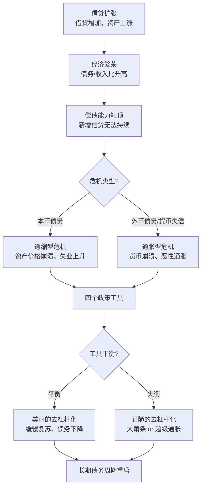

## 《债务危机：我的应对原则》读书笔记
  
### 作者  
digoal  
  
### 日期  
2026-05-27  
  
### 标签  
读书笔记 , 债务危机：我的应对原则   
  
----  
  
## 背景  
   
---
书名: 《债务危机：我的应对原则》   
作者: 瑞·达利欧（Ray Dalio）   
出版年份: 2018（中文版 2019）   
出版社: 中信出版社   
笔记日期: 2025-05-27   
豆瓣链接: https://book.douban.com/subject/30486499/   
ISBN: 9787521700077   
页数: 540   
标签: [宏观经济, 金融危机, 债务周期, 投资, 政策研究]   
---

   

> **一句话**：债务危机不是意外，是一台按固定剧本运行的机器——读懂剧本，你就不会被吓到。   
> **适合谁读**：对宏观经济感兴趣的投资者、政策研究者、金融从业者，以及想搞清楚"政府为什么不停印钱"的普通读者   
> **阅读难度**：⭐⭐⭐⭐☆（数据密集，案例详实，需要一点耐心）   
> **推荐指数**：⭐⭐⭐⭐☆   
   
---

## 一、时代坐标：这本书从哪里来？

2008年，雷曼兄弟倒塌，全球金融体系颤抖。绝大多数机构在那场风暴里焦头烂额，但达利欧创立的桥水基金（Bridgewater Associates）不仅安然无恙，还实现了盈利。

秘密是什么？不是运气，而是一套提前八年就搭建好的"萧条计量指标"系统。

2018年，金融危机爆发十周年，达利欧决定公开这套模型。这本书就是那次公开的产物——不是为了炫耀预测成绩，而是带着某种教育使命：**如果更多政策制定者和投资者理解债务周期的运作逻辑，下一次危机也许可以少死一些人，少损失一些财富。**

这本书出版的时机也耐人寻味。2018年前后，全球债务水平在两代人的时间里持续攀升。达利欧当时警告，世界可能正处于"短期和长期债务周期的晚期阶段"。今天回头看，这个判断显得格外沉重。

```
时间轴：达利欧的债务研究之路

1971 ──── 美元脱钩黄金，达利欧开始研究债务周期
1982 ──── 拉美债务危机，模型初步验证
2000s ── "萧条计量指标"系统建立
2008 ──── 危机来袭，桥水成功预判并盈利
2018 ──── 《债务危机》出版，公开完整框架
```

---

## 二、核心命题：作者在说什么？

### 命题一：债务危机是有规律可循的机器，不是随机灾难

这是全书最颠覆常识的论断。

大多数人把金融危机看作"黑天鹅"——概率极低、无法预测的突发事件。达利欧的回答是：**你之所以觉得不可预测，是因为大型债务周期在一个人的一生中只会发生一两次，罕见但绝不随机。**

他通过研究过去100年间全球48个重大债务危机案例，发现它们之间存在高度一致的结构和动态规律。尽管每次危机的触发因素、地理背景各不相同，但底层逻辑几乎是同一个剧本的不同演出。

> 核心比喻：经济运行像一台机器。机器里的每个零件都按照因果关系运转。信贷扩张→经济繁荣→债务积累→偿债能力下降→去杠杆→痛苦→修复→新一轮扩张。这个循环不会因为我们不相信它而停止。

### 命题二：债务危机分为两种，应对方式截然不同

达利欧将大型债务危机分为两类，这个分类对理解政策选择至关重要：

**通缩型债务危机（Deflationary Debt Crisis）**：债务主要以本国货币计价。政府可以印钞来稀释债务，有较大的政策操作空间。典型案例：2008年美国金融危机、1930年代美国大萧条。

**通胀型债务危机（Inflationary Debt Crisis）**：债务大量以外币计价，或本国货币公信力极低。印钱会引发恶性通胀，货币崩溃。这类危机的破坏力往往更大，政策工具更有限。典型案例：1920年代德国魏玛共和国超级通胀。

这个区分直接决定了"你能用哪些工具"。一个以美元计价债务的国家和一个以美元借外债的发展中国家，面对危机时的处境有天壤之别。

### 命题三：去杠杆有美丑之分，关键在于工具的平衡配比

这是达利欧最具操作性的洞见。

他认为，应对债务危机无非四个工具：
1. **财政紧缩**（削减支出）
2. **债务违约/重组**（让债主承担损失）
3. **央行印钞购买资产**（货币宽松）
4. **财富再分配**（增税、转移支付）

每个工具单独使用都是"丑陋的去杠杆"——只紧缩会引发经济崩溃和社会动荡；只印钱会引发恶性通胀；只赖账会摧毁信用体系。

**"美丽的去杠杆化"（Beautiful Deleveraging）** 的关键，是让这四个工具按照恰当的比例协同作用：债务重组（通缩力）和货币刺激（通胀力）相互抵消，在维持正增长的同时缓慢降低债务负担，避免两个极端。平衡拿捏得好，经济可以"慢慢好起来"；平衡失调，就是德国1923年或阿根廷2001年。

---

## 三、论证地图：作者怎么说服你的？



**数据支撑**：书中分析了48个案例，是目前为止覆盖最广的系统性债务危机研究之一。三个重点案例（魏玛德国、美国大萧条、2008年金融危机）有详尽的时间序列数据、政策时间线和经济指标对比。

**典型案例的说服力**：
- **魏玛德国（1921-1923）**：展示了外币债务+印钞失控的极端后果——马克汇率崩溃，人们用手推车运钱买面包，最终希特勒从这片废墟中崛起。
- **1930年代大萧条**：展示了过度紧缩的危险——胡佛政府的财政收缩让经济螺旋下行，直到罗斯福打破金本位、启动新政才止血。
- **2008年危机**：展示了相对"做对了"的案例——伯南克团队及时印钞、银行注资，虽然代价是大规模财富转移，但避免了系统性崩溃。

**论证方式评价**：以归纳为主，强调历史模式的重复性。这是这本书最大的力量，也是它最大的局限。

---

## 四、前提假设与边界：什么情况下这不成立？

### 假设一：历史会重复

达利欧的整套框架建立在"历史会以相似模式重复"的信念上。这个假设在大多数时候是有效的，但遇到结构性断裂时会失效——比如数字货币、去美元化、AI带来的生产力革命，或者地缘政治的大重组。这些变量不在他的模型里。

### 假设二：政策制定者是理性的且有能力执行

"美丽的去杠杆"依赖于政策制定者在正确时机使用正确工具的能力。但实际上，政治压力、利益集团、意识形态偏见，常常让"正确的政策"根本无法被采纳。达利欧的框架是工程师的框架，而不是政治经济学家的框架。

### 假设三：货币主权是前提

对于没有货币主权的国家（如欧元区成员国），"印钞"这个工具根本不在手里。希腊2010年债务危机的痛苦，恰恰来自于它是通缩型危机，却没有本国央行可以操作，只能忍受极度的财政紧缩。达利欧的框架需要针对这类情况单独补充。

---

## 五、思想谱系：这本书在哪个传统里？

达利欧是一个典型的**宏观投资者出身的经济思想家**，不隶属于任何学术门派，但他的思想有清晰的脉络可以追溯：

- **熊彼特的经济周期理论**：创造性破坏、繁荣-衰退的交替。
- **明斯基（Hyman Minsky）**：信贷驱动泡沫、"稳定本身孕育不稳定"——与达利欧的框架高度共鸣，但达利欧更侧重可操作的政策处方。
- **费雪的债务通缩理论（Irving Fisher）**：1930年代提出，过度负债后的通缩螺旋，是达利欧通缩型危机框架的直接先驱。
- **凯恩斯传统**：认可财政刺激的必要性，但达利欧更强调货币政策+债务重组的组合拳。

他与同时代的批评：部分经济学家（如代表结构主义或制度主义的学者）批评达利欧的框架过于"货币主义-投资者视角"，忽略了不平等、权力结构、社会制度对危机的塑造作用。一个债务危机背后，可能不只是技术性的杠杆问题，还有几十年不平等积累的社会爆炸。这个批评值得重视。

```
思想影响脉络

费雪(1933)
债务通缩理论
        ↓
明斯基(1970s)
金融不稳定假说
        ↓
达利欧(2018)
债务大周期模型
+政策处方四工具
```

---

## 六、我学到了什么？

**收获一：区分债务危机类型，是判断一切的前提。**

以前我看新闻，看到某国债务飙升，本能反应是"要崩了"。读完这本书，我学会先问一个问题：**这个债务是以谁的货币计价的？** 如果是本国货币，央行有操作空间；如果是外债，那才是真正危险的。日本政府债务超过GDP 250%，却没崩溃，原因之一就在这里——它的债权人主要是本国居民，以日元计价。

**收获二：政策工具之间的"平衡艺术"，比单一工具的使用更重要。**

这让我重新理解了2020年以来各国央行的疯狂印钞。那不是失控，而是在一场通缩危机里，用通胀力量去抵消通缩力量的刻意操作。它的代价是财富再分配——持有资产的人变得更富，手持现金的人相对缩水。这个"代价"不是技术失误，而是政策选择本身。

**收获三：债务危机是可以被管理的，但管理成本由谁承担，是政治问题。**

达利欧反复强调危机"可控、可管理"，但他相对轻描淡写地处理了一个问题：代价由谁承担？债务重组让债权人损失；印钞让储蓄者贬值；紧缩让工薪阶层失业；财富再分配让富人掏钱。每一个工具背后都是利益的重新分配，都会引发政治阻力。技术上的"美丽去杠杆"，在政治现实里未必美丽。

---

## 七、举一反三：这个框架还能用在哪？

**企业级别的应用**：债务周期模型不只适用于国家。一家过度扩张的企业同样会经历"信贷扩张→繁荣→偿债困难→去杠杆"的过程。2015年后中国大量房地产企业的暴雷，完全符合这个框架的通缩型危机路径——问题不是负债多，而是资产价格下跌速度快于债务消化速度。

**个人财务的启示**：在债务周期的晚期（利率极低、资产价格虚高），持有高杠杆是非常危险的赌注。读懂周期的投资者，会在"派对最热闹的时候"开始降低杠杆，而不是在崩溃来临后被迫出售。

**理解当下中国**：当前中国的地产债务问题，几乎是这本书最好的"现实教材"。债务以人民币计价（有货币主权），但资产价格下行压力和地方政府债务叠加，构成了复杂的去杠杆挑战。如何在不引发通缩螺旋的前提下完成债务出清，正是达利欧框架里最难走的那条"平衡木"。

---

## 八、批判与反思

**批评一：这是政策制定者的手册，不是普通人的生存指南。**

副标题叫"我的应对原则"，但全书95%的篇幅是在讲政府和央行该怎么做。对于一个普通投资者或普通人，能学到的具体操作建议相当有限。如果你期待"下次危机来了我该买什么"，这本书会让你失望。有读者尖锐地指出：与其叫"我的应对原则"，不如叫"政府的应对原则"。

**批评二：框架缺乏对不平等的深度处理。**

达利欧的模型本质上是货币流量模型。它能告诉你债务总量怎么变化，却很难捕捉债务危机如何加剧社会撕裂——谁损失更多、谁能抄底、谁被永久踢出中产阶级。2008年之后的美国社会极化、民粹主义崛起，是这本书框架之外的现象，却是理解当代政治的关键。

**批评三：历史归纳的边界**。

100年48个案例，在宏观历史的尺度上样本量依然有限。更重要的是，每次危机发生时，金融体系的结构都在变化——衍生品、影子银行、加密货币、AI交易系统，这些达利欧模型建立时不存在或很微小的因素，在下一次危机中可能成为决定性变量。归纳出来的"规律"，在足够大的结构断裂面前可能失效。

---

## 九、金句与记忆点

1. **"债务危机大多数都是可控和可管理的。"**
   ——这句话是全书的定心丸。它不是说危机不痛苦，而是说恐慌和绝望大多是不必要的。

2. **"美丽的去杠杆化"**
   ——这个概念本身就值得记住：通缩力量（债务重组）与通胀力量（货币刺激）的平衡，是走出债务危机的窄门。

3. **"当债务以本国货币计价，政策制定者永远有工具可用。"**
   ——理解这句话，就能理解为什么日本和美国可以"债台高筑而不倒"。

4. **"每件事都是反复发生的，通过观察规律，人们可以理解因果关系。"**
   ——这是达利欧整个思想体系的元假设：历史是可以被学习的机器，而不是随机的噪声。

5. **"整个去杠杆化过程通常需要十年或更久。"**
   ——耐心，是应对债务危机最便宜也最稀缺的资源。快速修复的期待，往往会催生更糟糕的政策。

6. **"稳定本身孕育不稳定。"**（来自明斯基，达利欧的精神先驱）
   ——繁荣期积累的风险，在下跌时爆发。太顺的日子，恰恰是埋雷的时候。

---

## 十、延伸阅读

1. **《大短路》（The Big Short）— 迈克尔·刘易斯**
   同样以2008年危机为主题，但视角完全相反——是"局内人讲故事"的叙事版，可以和达利欧的分析框架互为补充，一个给你情绪，一个给你结构。

2. **《这次不一样》（This Time Is Different）— 莱因哈特 & 罗格夫**
   学术版的债务危机历史研究，覆盖800年、66个国家，数据更严格，但结论与达利欧高度共鸣：债务危机的规律性远超人们的想象。

3. **《稳定不稳定的经济》（Stabilizing an Unstable Economy）— 海曼·明斯基**
   达利欧思想的重要先驱，金融不稳定假说的经典表述，读完后会更能理解为什么"繁荣是危机的播种机"。

4. **《原则：生活和工作》— 瑞·达利欧**
   这本书的前传，了解达利欧建立整套系统性思维框架的方法论基础——他为什么相信"一切都是可以用原则来应对的"。

5. **《债务和魔鬼》（Debt: The First 5,000 Years）— 大卫·格雷伯**
   一个截然不同的视角：人类学家看债务。格雷伯认为债务不只是经济问题，而是权力、道德、暴力的复合体。与达利欧的技术框架对比阅读，会打开完全不同的思维空间。

---

*笔记写于 2025-05-27 | 基于公开资料、书评与深度思考整理*
*核心参考：CFA Institute书评（2019）、澎湃新闻达利欧访谈、拆书笔记分析*
  
  
#### [PostgreSQL 解决方案集合](../201706/20170601_02.md "40cff096e9ed7122c512b35d8561d9c8")
  
  
#### [德哥 / digoal's Github - 公益是一辈子的事.](https://github.com/digoal/blog/blob/master/README.md "22709685feb7cab07d30f30387f0a9ae")
  
  
#### [About 德哥](https://github.com/digoal/blog/blob/master/me/readme.md "a37735981e7704886ffd590565582dd0")
  
  

  
