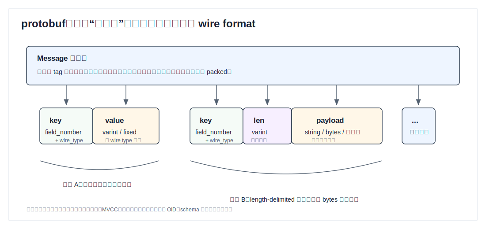
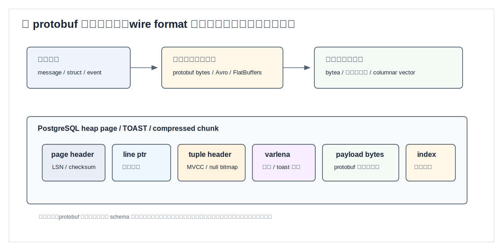
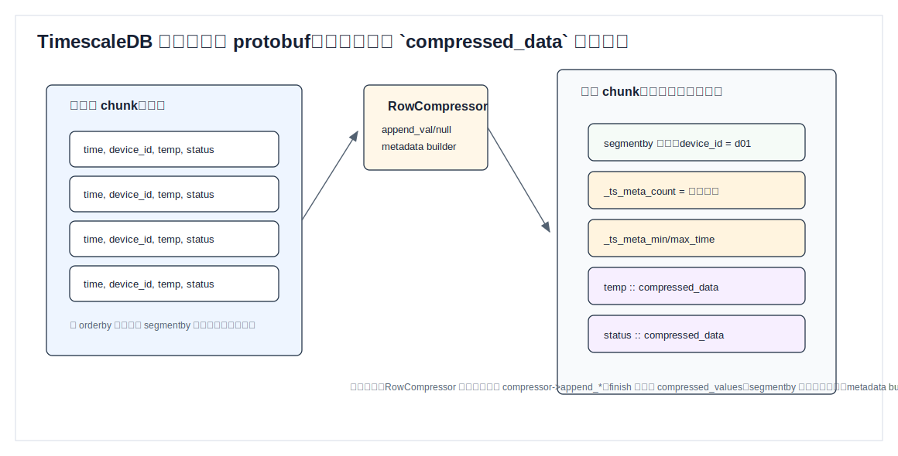
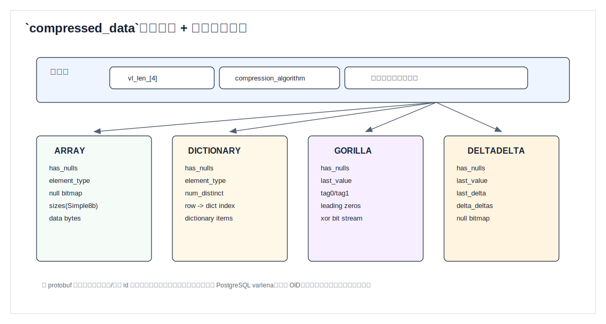
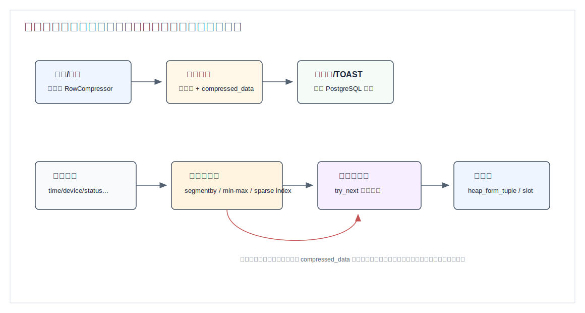

## 数据库筑基课 - protobuf 存储结构
                                                                                            
### 作者                                                                
digoal                                                                
                                                                       
### 日期                                                                     
2026-05-27                                                      
                                                                    
### 标签                                                                  
PostgreSQL , TimescaleDB , 应用开发者 , DBA , 数据库筑基课 , 表存储 , 二进制序列化 , protobuf  
                                                                                           
----                                                                    

## 背景


本节属于“表存储 / 二进制序列化 / 列式压缩”基础能力。当前工作区没有发现“数据库筑基课”总纲文件，因此本文先独立成篇。

先把边界讲清楚：在本地 `timescaledb` 源码中没有找到 `.proto` 文件，也没有发现直接使用 Google Protocol Buffers 作为 TimescaleDB 压缩数据落盘格式的证据。TimescaleDB 压缩 chunk 的真实实现是 PostgreSQL 自定义变长类型 `_timescaledb_internal.compressed_data`，里面有 TimescaleDB 自己定义的公共头、算法编号、类型 OID、对齐约束和算法专属载荷。

所以本文不写成“TimescaleDB 用 protobuf 存储数据”。更准确的主线是：

> 先理解 protobuf 这类二进制序列化格式能解决什么问题，再看它如果进入数据库存储引擎，会遇到页、元组、MVCC、TOAST、索引、压缩批次和 schema 演进这些额外问题；最后用 TimescaleDB 的 `compressed_data` 源码作为数据库内核级二进制载荷设计样本。

这样写更有工程价值：开发者常把 protobuf 当成“高效存储格式”，但数据库内核关心的不只是把对象压成 bytes，还关心 bytes 怎么被过滤、跳过、升级、校验、解压和恢复。

## 一、它解决什么问题？

protobuf 解决的是跨语言、跨进程、跨版本的数据交换问题：

- 用字段号而不是字段名编码，减少重复文本开销。
- 用 varint、fixed32、fixed64、length-delimited 等 wire type 表示不同值。
- 未出现字段不占空间，未知字段可跳过，便于 schema 演进。
- 生成代码后，应用层对象和二进制 bytes 可以稳定互转。

但数据库存储引擎面对的是另一组问题：

- **页内定位**：一页里有多少条记录，每条记录偏移在哪里？
- **事务可见性**：这段 bytes 对哪个事务可见，什么时候可以回收？
- **谓词过滤**：`WHERE device_id = 1 AND time > now() - interval '1 hour'` 能否不解码整段 bytes？
- **局部读取**：只查一列时，能否跳过其他列？
- **压缩块边界**：一批多少行，太大影响点查，太小影响压缩率。
- **schema 演进**：字段增加、删除、改类型后，旧页还能不能读？
- **恢复与校验**：WAL、checksum、崩溃恢复、复制协议如何处理这段 bytes？

因此 protobuf 进入数据库后，通常有三种用法：

| 用法 | 典型存法 | 优点 | 代价 |
|---|---|---|---|
| 应用把 protobuf 当 opaque bytes | `bytea` / blob | 简单，应用完全控制 schema | 数据库难以下推过滤、统计、索引和局部解码 |
| 数据库理解 protobuf schema | 自定义类型 / FDW / 表函数 | 可投影字段、可建表达式索引 | 需要 schema registry、解码器、版本治理 |
| 数据库自定义二进制载荷 | TimescaleDB `compressed_data` 这类格式 | 能绑定页、类型、压缩、执行器 | 跨系统通用性弱，格式升级要谨慎 |

这就是本文要回答的问题：**protobuf 的“字段级 wire format”与数据库的“页级存储结构”不是一层东西。真正落盘时，必须把 bytes 放回页、元组、索引、压缩和执行器的系统里看。**

## 二、它是什么？

protobuf 的二进制格式可以理解为一串字段记录。每个字段先写 key，key 里包含 field number 和 wire type；然后根据 wire type 写 value。对 string、bytes、嵌套 message 这类 length-delimited 字段，还会先写长度，再写载荷。



图 1 说明：protobuf 很擅长表达“稀疏、可演进的消息”。未出现字段不占空间；接收方遇到未知 field number 可以按 wire type 跳过。这对服务间消息非常合适。但它没有天然提供数据库页号、tuple offset、MVCC 可见性、索引统计、列级 min/max 或压缩批次边界。

放到数据库里，它通常只是某个字段的 payload：



图 2 说明：即使 payload 是 protobuf，数据库页仍要包一层页头、line pointer、tuple header、null bitmap、varlena 长度或 TOAST 指针。也就是说，protobuf 只定义 payload 内部怎么解释；数据库定义 payload 在页、事务、索引和恢复体系里怎么生存。

TimescaleDB 的 `compressed_data` 也符合这个思路，但它不是 protobuf。它是 PostgreSQL 自定义类型，SQL 层声明为 variable-length、external storage、double alignment，并绑定 C 语言的 input/output/send/recv 函数。源码位置：

- `timescaledb/sql/pre_install/types.post.sql` 定义 `_timescaledb_internal.compressed_data`。
- `timescaledb/sql/pre_install/types.functions.sql` 定义 `compressed_data_in/out/send/recv/info`。
- `timescaledb/tsl/src/compression/compression.h` 定义公共头、算法枚举和压缩/解压接口。
- `timescaledb/tsl/src/compression/algorithms/*.c` 定义不同算法的二进制载荷。

一句话定义：

> protobuf 是面向数据交换的字段级 wire format；TimescaleDB `compressed_data` 是面向 PostgreSQL 压缩 chunk 的数据库内核级二进制列批次载荷。

## 三、核心原理

### 3.1 protobuf wire format：字段号、wire type、长度和值

protobuf key 的逻辑是：

```text
key = (field_number << 3) | wire_type
```

常见 wire type 包括 varint、64-bit、length-delimited、32-bit。varint 适合小整数，length-delimited 适合 string、bytes、packed repeated field 和嵌套 message。这个设计的关键收益是：

- 小整数和稀疏字段很省空间。
- 字段顺序不是 schema 的核心，field number 才是兼容性锚点。
- 新字段可以追加，旧程序不理解也能跳过。
- message 可以嵌套，适合复杂业务对象。

但它的数据库弱点也直接来自这里：

- 只看 bytes 很难知道某个字段的统计分布。
- 要按字段过滤，通常要解码到目标字段，除非额外维护索引或物化列。
- repeated / nested 结构对关系型优化器不透明。
- 字段号复用、类型变更、语义变更会污染长期存储。

所以如果把 protobuf 放到 `bytea`，数据库通常只能做“整段 bytes 的等值、哈希、长度、表达式函数”这类操作。要让优化器真正理解 protobuf 字段，必须额外提供解码函数、生成列、表达式索引、统计信息或独立列投影。

### 3.2 数据库存储结构：payload 之外的那些东西

数据库页是为事务、随机访问和恢复服务的，不只是 bytes 容器。以 PostgreSQL 为例，一条变长数据进入表页时，至少会经历这些层次：

1. Heap page 负责页头、line pointer、空闲空间管理。
2. Heap tuple header 负责 xmin/xmax、命令号、null bitmap、变长字段标记。
3. varlena 负责变长数据长度，以及必要时转成 TOAST 指针。
4. TOAST 负责大值外置和可选压缩。
5. 索引或表达式索引负责把可过滤信息拿出来。

这就解释了为什么“protobuf 很紧凑”不等于“数据库查询一定快”。如果过滤条件在 protobuf 内部，而数据库没有能利用的外部摘要，那么查询必须先找到候选行，再解码 payload。IO 可能少不了，CPU 解码也少不了。

### 3.3 TimescaleDB 压缩 chunk：行存转列批次

TimescaleDB 的压缩设计更像“在 PostgreSQL 里做按 chunk 的列式批次”。官方文档描述过：压缩 chunk 时，多条记录会被组合成单行；这行的列持有 array-like 结构。源码里，这个 array-like 结构不是普通 SQL array，而是 `_timescaledb_internal.compressed_data`。



图 3 说明：未压缩 chunk 是普通行存。压缩时，`segmentby` 列作为批次分组键保留原值；普通度量列进入列压缩器；`orderby` 列会影响排序和 min/max 元数据。最后压缩 chunk 里的一行代表一批原始行，`_ts_meta_count` 保存批次行数，其他元数据帮助执行器在解压前过滤。

源码上，`RowCompressor` 做几件关键事：

- 对普通列调用 `compressor->append_null()` 或 `compressor->append_val()`。
- 每行更新 metadata builder，例如 min/max。
- 批次完成时调用 `compressor->finish()` 生成二进制载荷。
- 对 `segmentby` 列不压缩，直接写入压缩 tuple。
- 写入 `_ts_meta_count` 作为这批原始行数量。

这和 protobuf 的设计目标不同。protobuf 关心一个 message 内字段如何编码；TimescaleDB 关心一批行如何按列压缩、如何在不解压时先过滤、如何重新吐出 PostgreSQL tuple。

### 3.4 `compressed_data` 公共头：varlena + 算法编号

`timescaledb/tsl/src/compression/compression.h` 里定义了公共头：

```c
#define CompressedDataHeaderFields \
    char vl_len_[4];               \
    uint8 compression_algorithm
```

注释说明：`compressed_data` 以 PostgreSQL 常规 varlena header 开始，随后是压缩算法版本。这个 1 字节算法号让同一个 SQL 类型可以承载不同算法的数据。

当前源码里的算法枚举包括：

| 算法 | 典型用途 | 载荷要点 |
|---|---|---|
| `ARRAY` | 通用数组式列批次 | null bitmap、元素类型、每个元素大小、连续 data bytes |
| `DICTIONARY` | 低基数文本/枚举类数据 | row -> dictionary index，字典项单独存 |
| `GORILLA` | 浮点/时间序列相邻值变化小的数据 | xor、leading zero、tag bit stream |
| `DELTADELTA` | 单调或近似线性的整数/时间数据 | last value、last delta、delta-delta |
| `BOOL` | 布尔值 | bit/RLE 结构 |
| `NULL` | 整批为空 | dummy block |
| `UUID` | UUID | UUID 专用压缩 |



图 4 说明：`compressed_data` 的公共头相当于“数据库内核自己的 wire header”。算法号决定后续 bytes 由哪个 `compressed_data_recv`、`iterator_init_forward/reverse` 和 `decompress_all` 解释。它和 protobuf 都是“带类型/编号的二进制载荷”，但 TimescaleDB 还强绑定 PostgreSQL varlena、类型 OID、MAXALIGN、TOAST 和批次行数。

### 3.5 算法载荷：为什么不能只有 bytes？

看 `ARRAY` 算法。源码注释写得很清楚，它的载荷包含：

```text
uint8 has_nulls
Oid element_type
simple8b_rle nulls   -- 可选
simple8b_rle sizes
char data[]
```

这里的 `element_type` 很关键。数据库不是只要恢复 bytes，还要恢复 PostgreSQL Datum，并处理 by-value/by-reference、长度、对齐和 varlena。`sizes` 也很关键，因为变长元素拼在一起后，必须知道每个元素的边界。

再看 `Simple8bRleSerialized`：

```c
typedef struct Simple8bRleSerialized
{
    uint32 num_elements;
    uint32 num_blocks;
    uint64 slots[FLEXIBLE_ARRAY_MEMBER];
} Simple8bRleSerialized;
```

它不是用户可见 SQL 类型，而是多种压缩算法共用的整数编码基础设施。源码注释引用了 Simple-8b RLE 思路：每个 block 由 selector 和 64-bit data 组成，selector 决定一个 64-bit word 里打包多少个整数，selector 15 表示 RLE run。

这就是数据库存储结构的典型特征：一个高层 SQL 类型背后，会有多个内部小格式。它们服务于解压速度、对齐、错误检查和批次过滤，而不是服务于跨语言通用互操作。

### 3.6 send/recv：二进制协议和落盘格式要分清

`tsl_compressed_data_send()` 会先发送 `compression_algorithm`，再调用对应算法的 `compressed_data_send()`。`recv()` 反向读取算法号，然后 dispatch 到算法专属接收函数。

这和 PostgreSQL 类型的 binary send/recv 协议有关，不等同于“堆表页里字节逐个如此排列”。堆表里保存的是 varlena datum；binary send/recv 是类型在网络、COPY binary 或内部函数边界上的序列化接口。很多文章容易把这两层混在一起。

正确理解是：

- **内存/页内 datum**：以 varlena header 开头，后跟 TimescaleDB 自定义结构。
- **类型 binary send/recv**：先写算法号，再让算法自己把载荷写入 `StringInfo`。
- **SQL textual in/out**：源码注释说明 textual input/output 是 binary representation 的 base64 编码。

protobuf 的“wire format”更接近 send/recv 层的概念；数据库页内 datum 还需要遵守 PostgreSQL 的内存布局、对齐和 TOAST 规则。

### 3.7 读路径：先批次过滤，再必要解压

压缩数据查询快不快，关键不是“是否用了二进制格式”，而是“能否在解压前排除批次”。



图 5 说明：写入路径把多行转成带元数据的压缩批次；读路径先用 `segmentby`、`orderby` 对应的 min/max 或 sparse index 做批次级过滤。能排除就不解压；不能排除，就要按算法迭代恢复列值，必要时用 `heap_form_tuple` 重构输出行。

源码里，解压批次会读取 `_ts_meta_count`，检查批次行数大于 0 且不超过 `GLOBAL_MAX_ROWS_PER_COMPRESSION`，然后对每个压缩列调用 iterator 的 `try_next()` 恢复每行值。这个过程解释了一个常见现象：

- 查询条件命中 `segmentby` / `orderby` 元数据，少解压，速度好。
- 查询条件藏在非元数据列里，批次排除能力弱，可能需要大量解压。
- `UPDATE`/`DELETE` 如果没有可用于过滤的条件，可能触发较多 rowstore/columnstore 转换。

TimescaleDB 文档也强调：修改压缩数据时，应尽量过滤 `segmentby` 和 `orderby` 列，让系统在转换前过滤尽可能多的数据。

## 四、横向对比

| 维度 | protobuf bytes 存入 `bytea` | protobuf 字段投影到关系列 | TimescaleDB `compressed_data` |
|---|---|---|---|
| 主要目标 | 简单保存应用消息 | 兼顾应用 schema 与 SQL 查询 | 压缩 time-series chunk 并提升分析读取 |
| 格式所有者 | 应用 / protobuf schema | 应用 + 数据库 schema | TimescaleDB 内核代码 |
| 页内形态 | 普通 varlena payload | 普通列 + 可选 payload | 自定义 varlena 类型 + 算法载荷 |
| 过滤能力 | 弱，除非建表达式索引 | 强，字段成为列或生成列 | 强弱取决于 segmentby/orderby 和批次元数据 |
| schema 演进 | protobuf field number 兼容 | 需要迁移列/生成列/索引 | 扩展升级必须保持算法编号和旧载荷可读 |
| 压缩收益 | 取决于消息本身和 TOAST | 取决于列类型和 PG 存储 | 按列批次 + 专用算法，时序数据收益更大 |
| CPU 成本 | 查询字段要解码 payload | 普通 SQL 列访问 | 批次过滤后按需解压，未过滤时 CPU 成本明显 |
| 适合场景 | 审计原文、事件归档、消息队列落库 | 既要保留消息又要查询字段 | 大量时序历史数据、分析查询、冷热分层 |
| 不适合场景 | 频繁按内部字段过滤和聚合 | schema 极不稳定 | 高频随机点查、经常修改旧数据、批次选择性差 |

原因很直接：protobuf 强在字段兼容和跨语言互操作；数据库列强在统计、索引和优化器；TimescaleDB `compressed_data` 强在批次压缩和时间序列读取。不要用一个层次的优势覆盖另一个层次的需求。

## 五、效果如何？

可以从四个维度判断收益和代价。

**1. 空间**

protobuf 相比 JSON 通常更紧凑，因为它不重复字段名，并使用 varint 等编码。但如果每条消息都很小，PostgreSQL tuple header、page line pointer、varlena header、索引项等固定开销仍然存在。把小 protobuf 一条条塞进表，不等于有列式压缩收益。

TimescaleDB 压缩 chunk 的收益来自另一套机制：多行合并为一个批次，列按类型使用 ARRAY、DICTIONARY、GORILLA、DELTADELTA 等算法，重复值和相邻差异能被吃掉。官方文档给出过“chunk size 可减少超过 90%”的描述，但真实比例取决于数据分布、排序、segmentby、orderby、null 比例和批次大小，不能照搬到所有 workload。

**2. IO**

opaque protobuf bytes 的 IO 粒度通常是行或 TOAST chunk。即使只需要一个字段，也可能要读整段 payload。除非你把常查字段投影出来，或者建表达式索引。

TimescaleDB 压缩数据的 IO 粒度是批次。命中批次级元数据时，可以跳过整批；未命中时，读取和解压的代价会放大到一批行。

**3. CPU**

protobuf 解码速度通常不错，但它仍然是 CPU 工作。对数据库来说，最好的 CPU 是不用做的 CPU：能通过索引、min/max、segmentby、sparse index 跳过，就不要解码。

TimescaleDB 的解压成本也类似。`decompress_batch()` 需要按列 iterator 恢复值，再形成输出 tuple。批量分析时这很划算；随机点查时，如果过滤条件无法排除批次，解压会显得重。

**4. 写入和维护**

protobuf bytes 写入简单，应用负责兼容性。数据库侧维护少，但可查询性也少。

TimescaleDB 压缩写入复杂得多：要排序、分组、压缩、写元数据、维护 compressed chunk 与原 chunk 的映射。换来的收益是长期历史数据的空间和分析性能。

## 六、实操 DEMO

下面给两个最小实验思路。当前环境没有启动 PostgreSQL/TimescaleDB 实例，因此示例没有执行；SQL 以 TimescaleDB 老 compression API 为例，因为本文分析的源码目录正是这套压缩实现。TimescaleDB 新版本文档已说明老 compression API 自 v2.18.0 起被 hypercore 取代，但仍受支持。

### 6.1 protobuf bytes 的关系型投影

思路：原文保存在 `payload bytea`，常查字段投影到普通列或生成列。

```sql
CREATE TABLE event_log (
    id          bigserial PRIMARY KEY,
    tenant_id   bigint NOT NULL,
    event_time  timestamptz NOT NULL,
    event_type  text NOT NULL,
    payload     bytea NOT NULL
);

CREATE INDEX ON event_log (tenant_id, event_time DESC);
CREATE INDEX ON event_log (event_type, event_time DESC);
```

这里的原则是：protobuf 保留完整消息，关系列承担读取路径。不要让所有查询都从 `payload` 里解码字段。

如果必须直接从 protobuf 解字段，需要自己提供稳定的解码函数，再建表达式索引：

```sql
-- 伪代码：extract_proto_field 不是 PostgreSQL 内置函数。
-- 只有在你提供 C/Rust/PL 扩展并保证 immutable/stable 语义后才适合建索引。
CREATE INDEX event_log_user_id_expr_idx
ON event_log ((extract_proto_field(payload, 'user_id')));
```

风险在于：schema 版本、字段号、默认值语义和解码失败策略都要稳定，否则索引会和真实语义漂移。

### 6.2 TimescaleDB 压缩批次观察

```sql
CREATE TABLE metrics (
    time       timestamptz NOT NULL,
    device_id  integer NOT NULL,
    cpu        double precision,
    status     text
);

SELECT create_hypertable('metrics', 'time');

ALTER TABLE metrics SET (
    timescaledb.compress,
    timescaledb.compress_segmentby = 'device_id',
    timescaledb.compress_orderby = 'time DESC'
);

-- 写入足够多数据后压缩 chunk
SELECT compress_chunk(c) FROM show_chunks('metrics') AS c;

-- 查看压缩设置
SELECT *
FROM timescaledb_information.compression_settings
WHERE hypertable = 'metrics'::regclass;
```

如果要验证批次过滤效果，重点看：

```sql
EXPLAIN (ANALYZE, BUFFERS)
SELECT avg(cpu)
FROM metrics
WHERE device_id = 42
  AND time >= now() - interval '7 days';
```

再对比一个没有命中 `segmentby` / `orderby` 的条件：

```sql
EXPLAIN (ANALYZE, BUFFERS)
SELECT avg(cpu)
FROM metrics
WHERE status = 'WARN';
```

预期不是某个固定性能数字，而是观察执行计划、buffer、解压量是否明显不同。不要在没有本机数据、版本、配置和计划输出时编造性能结果。

## 七、最佳实践

**面向数据库架构师**

1. 把 protobuf 当成“消息兼容层”，不要直接当成“数据库查询模型”。常查字段应进入关系列、生成列、物化视图或专门索引。
2. 长期保存 protobuf 时，禁止复用 field number；删除字段要保留 reserved 编号；类型变更要通过新字段迁移。
3. 如果业务需要按内部字段过滤、join、group by，优先设计投影列。只有低频审计、回放、归档才适合纯 `bytea`。
4. 对时序历史数据，优先让数据库使用自己的列式/压缩机制。不要把一批时序点塞进一个 protobuf 后再让数据库盲查。

**面向 DBA**

1. 监控 `bytea`/TOAST 膨胀、表膨胀和索引膨胀。protobuf 小不代表 PostgreSQL 行整体小。
2. 如果使用 TimescaleDB 压缩，`segmentby` 选择应来自查询谓词，不来自“哪个字段看起来像维度”的直觉。
3. `orderby` 通常应覆盖时间维度或最常见范围过滤列，让 min/max 元数据能排除批次。
4. 对压缩 chunk 的 DML 要谨慎。过滤条件不能命中批次元数据时，可能触发大量解压和重压缩。
5. 升级扩展前检查压缩格式兼容性和回归测试，尤其是自定义类型 send/recv、算法编号、TOAST 存储策略。

**面向业务开发者**

1. 事件原文可以用 protobuf 保存，但页面查询、报表、告警条件要有独立字段。
2. 不要把 protobuf schema 的“可选字段”滥用成数据库 schema 逃避。读路径最终会付出索引和解码成本。
3. 给每个 payload 保存 schema version、producer version 或 descriptor hash，方便排查旧数据。
4. 对高频字段建立显式列，比每次从 payload 解码更稳。

## 八、适合与不适合场景

适合 protobuf bytes 直接保存的场景：

- 审计日志、事件原文、消息回放、不可变归档。
- 查询主要按外部元数据过滤，例如 tenant、time、event_type。
- payload schema 演进快，但真正查询的字段少且稳定。
- 应用层负责解码，数据库只负责持久化和粗粒度检索。

不适合 protobuf bytes 直接保存的场景：

- 大量 SQL 需要按 payload 内字段过滤、聚合、排序、join。
- 需要跨字段统计、选择率估算和优化器稳定计划。
- 需要只读取部分字段来降低 IO。
- 需要数据库端约束内部字段唯一性或外键关系。

适合 TimescaleDB `compressed_data` 这类批次压缩的场景：

- 追加为主、历史数据读多写少的时序数据。
- 查询经常按时间范围和设备/租户/标签维度过滤。
- 度量列相邻值变化有规律，低基数字段多，压缩算法能吃到规律。
- 能容忍历史 chunk 压缩后修改成本变高。

不适合的场景：

- 频繁更新旧数据，尤其是没有命中 `segmentby` / `orderby` 的更新。
- 随机点查远多于范围分析。
- 每个批次只有很少行，批次压缩摊不平固定开销。
- 维度基数、排序和查询谓词错配，导致批次过滤效果差。

## 九、常见坑

**坑 1：把 protobuf 当成数据库 schema 的替代品**

protobuf 可以让应用消息演进，但数据库优化器看不懂 opaque bytes。解决办法是把查询模型单独设计出来：普通列、生成列、表达式索引或 ETL 后的明细表。

**坑 2：字段号复用**

长期存储最怕 field number 被复用。旧 bytes 会被新代码解释成新语义，问题很隐蔽。删除字段后应使用 `reserved`。

**坑 3：把压缩率等同于查询性能**

压缩率高只说明存得小。查询是否快取决于能不能少读、少解压、少重构行。TimescaleDB 的 `segmentby` / `orderby` 就是把读取路径前置到物理布局。

**坑 4：忽视 TOAST**

大的 protobuf payload 或大的 `compressed_data` 都可能进入 TOAST。TOAST 能解决大值存储问题，但会影响随机读取、VACUUM、备份和缓存行为。

**坑 5：把 send/recv 当成页内格式**

PostgreSQL 类型的 binary send/recv 是协议接口，不必等同于 heap page 内 datum 的字节布局。分析源码时要分清 datum layout、wire protocol、text I/O 三层。

**坑 6：TimescaleDB 压缩列修改成本**

压缩 chunk 上的 `UPDATE`/`DELETE` 可能需要解压相关批次。没有好的过滤条件时，代价会被放大。应尽量用 `segmentby` 和 `orderby` 条件定位批次。

## 十、扩展问题

1. 如果一个业务事件用 protobuf 保存，同时要求按 `user_id`、`sku_id`、`campaign_id` 查询，你会投影哪些字段？哪些字段仍留在 payload？
2. protobuf 的 field number 为什么比字段名更像“长期 ABI”？如果复用 field number，会发生什么？
3. 如果把 1000 条传感器点打包进一个 protobuf message 再存 `bytea`，和 TimescaleDB 压缩 chunk 的批次有什么根本差异？
4. 为什么列式压缩通常要求排序？`orderby=time` 对 Gorilla/DeltaDelta 这类算法有什么帮助？
5. 如果查询主要按 `status` 过滤，而压缩设置只按 `device_id segmentby`、`time orderby`，你预期执行器会多做哪些工作？
6. 设计数据库内核二进制格式时，为什么要把算法编号固定下来，并用静态断言防止编号变化？

## 十一、扩展阅读

主要来源：

- Protocol Buffers 官方文档：[Encoding](https://protobuf.dev/programming-guides/encoding/)。
- TigerData / Timescale 官方文档：[About compression](https://www.tigerdata.com/docs/use-timescale/latest/compression/about-compression)。
- TigerData / Timescale 官方文档：[Insert and modify data in the columnstore](https://www.tigerdata.com/docs/use-timescale/latest/compression/modify-compressed-data/)。
- TimescaleDB 本地源码：`timescaledb/sql/pre_install/types.post.sql`，`timescaledb/sql/pre_install/types.functions.sql`。
- TimescaleDB 本地源码：`timescaledb/tsl/src/compression/compression.h`，尤其是 `CompressedDataHeaderFields`、`CompressionAlgorithmDefinition`、算法枚举和 `RowCompressor`。
- TimescaleDB 本地源码：`timescaledb/tsl/src/compression/compression.c`，尤其是算法表、`row_compressor_append_row()`、`row_compressor_build_tuple()`、`decompress_batch()`、`tsl_compressed_data_send()`、`tsl_compressed_data_recv()`。
- TimescaleDB 本地源码：`timescaledb/tsl/src/compression/algorithms/array.c`、`dictionary.c`、`gorilla.c`、`deltadelta.c`、`simple8b_rle.h`。

相关论文或资料：

- Protocol Buffers: Google’s Data Interchange Format。本文只使用 protobuf 官方 encoding 文档核对 wire format，没有引用无法核验的论文细节。
- Integrating Efficient Binary Serialization into Database Storage Engines。当前工作区和公开搜索没有拿到可核验全文，本文没有把该题名下的具体结论作为事实依据。
- Simple-8b RLE：TimescaleDB `simple8b_rle.h` 源码注释引用 Vo Ngoc Anh、Alistair Moffat 的 “Index compression using 64-bit words”，用于说明 Simple-8b 编码思想。

DeepWiki：

- 用户给出的仓库名为 `timescale/timescaledb`。本次尝试通过 `@seflless/deepwiki ask` 查询时报 `Unknown error`，因此 DeepWiki 没有作为事实来源；关键实现结论均回到本地源码和官方文档核验。
  
## 附录  
  
1、克隆代码  
```  
git clone --depth 1 https://github.com/timescale/timescaledb
```  
  
2、启用 codex, 使用 [数据库筑基课 skill](../skills/README.md).  
````
文章标题: 
  数据库筑基课 - protobuf 存储结构 
项目源码(已克隆到当前项目如下目录中):  
  timescaledb
相关论文或分享:
  Protocol Buffers: Google’s Data Interchange Format
  Integrating Efficient Binary Serialization into Database Storage Engines
项目 deepwiki reponame:  
  timescale/timescaledb
项目参考信息: 
  timescaledb/CLAUDE.md
````
  
  
#### [PostgreSQL 解决方案集合](../201706/20170601_02.md "40cff096e9ed7122c512b35d8561d9c8")
  
  
#### [德哥 / digoal's Github - 公益是一辈子的事.](https://github.com/digoal/blog/blob/master/README.md "22709685feb7cab07d30f30387f0a9ae")
  
  
#### [About 德哥](https://github.com/digoal/blog/blob/master/me/readme.md "a37735981e7704886ffd590565582dd0")
  
  

  
