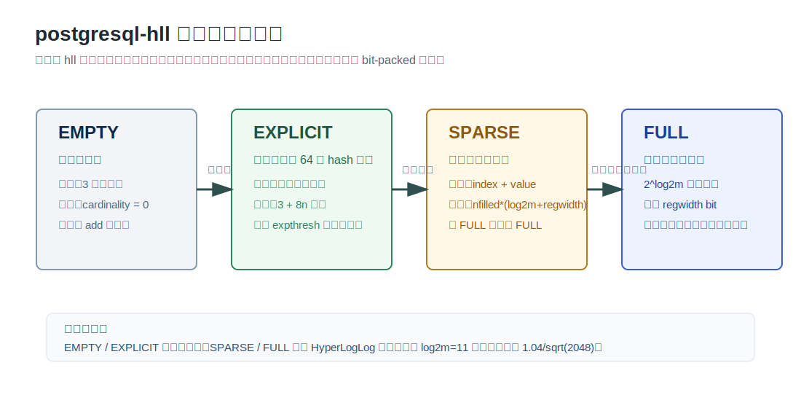
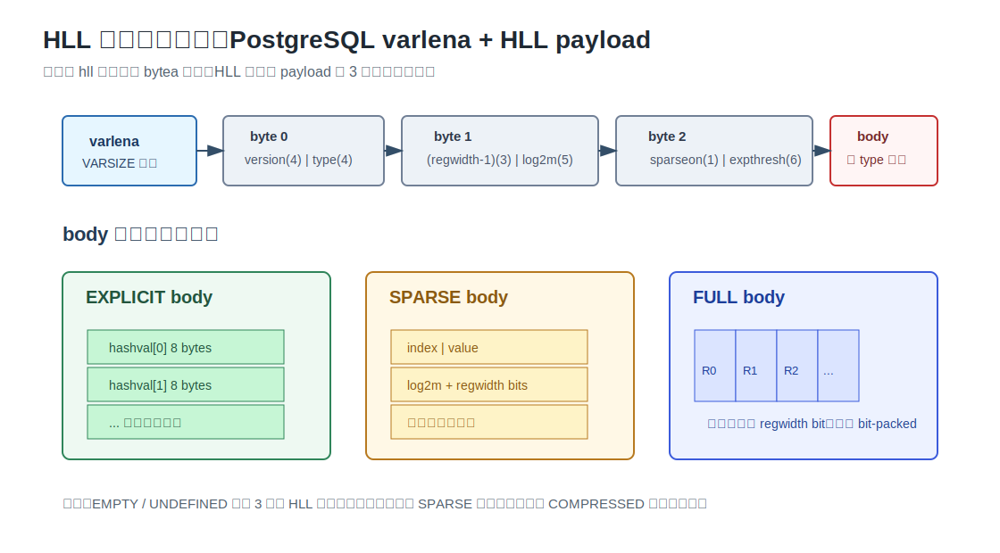
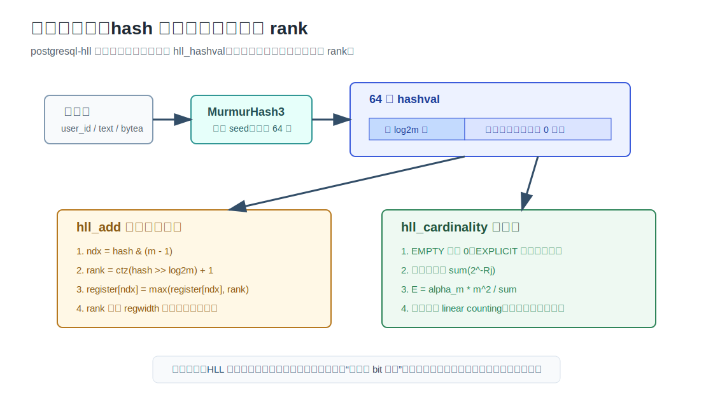
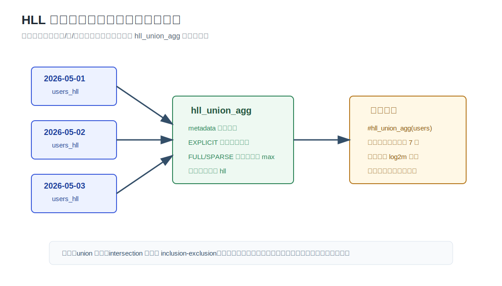

## 数据库筑基课 - hll 存储结构
                                                                                            
### 作者                                                                
digoal                                                                
                                                                       
### 日期                                                                     
2026-05-27                                                      
                                                                    
### 标签                                                                  
PostgreSQL , 应用开发者 , 数据库筑基课 , 数据类型 , 概率数据结构 , HyperLogLog , 近似去重  
                                                                                           
----                                                                    

## 背景
   
  

本节属于“数据类型与操作符”基础能力。当前工作区没有发现“数据库筑基课”总纲文件，因此本文先独立成篇。

很多业务都会被一个问题卡住：`COUNT(DISTINCT user_id)` 很准，但代价太高。

- 运营要每天、每周、每月、滚动 7 日活跃用户数。
- 广告系统要按 campaign、渠道、地域、时间窗口估算独立触达人群。
- 风控要按事件流、设备、账号、IP 聚合唯一实体。
- 数仓要把明细按小时或天预聚合，后面还能继续向上 rollup。

如果每次从明细表精确去重，数据库要保留一个越来越大的 hash set 或 sort set；如果提前物化很多维度组合，表会爆炸；如果只保存每天的精确 user_id 集合，空间和合并成本也很高。

`postgresql-hll` 的答案是：把“精确保存所有元素”换成“保存一个可合并的去重摘要”。摘要有固定、可调的空间上界，能在 SQL 里用 `hll_union_agg` 合并，适合从小时到天、从天到周月、从单分区到全局的近似去重。代价也很明确：它不是精确计数；输入必须先 hash；两个 HLL 要能正确合并，参数和 hash seed 必须一致。

本文以本地源码 `postgresql-hll` 为主线，结合三篇相关论文理解机制：

- Flajolet 等人的 HyperLogLog 原始论文，给出 HLL 的估计器和 `1.04/sqrt(m)` 级别的标准误差。
- Heule、Nunkesser、Hall 的 HyperLogLog in Practice，解释工程实现为什么要重视小基数、稀疏表示和偏差修正；`postgresql-hll` 没有完全实现 HLL++，但它的 EXPLICIT/SPARSE 层级与这类工程化问题同源。
- Efficient Estimation of Inclusion Coefficient using HyperLogLog Sketches，用于理解 HLL 在交集、包含系数等集合关系估算上的边界：并集容易，交集和包含关系更容易被误差放大。

## 一、它解决什么问题？

HLL 解决的是“大规模数据流中的 distinct count，如何用小而可合并的状态换取可控误差”的问题。

传统 `COUNT(DISTINCT)` 的核心成本在于：要知道“是否见过某个元素”，就必须保留足够多的历史元素信息。元素越多，内存或磁盘中间状态越大。对于一次性查询，这可能还能接受；对于多维度、长时间窗口、持续 rollup，就会变成工程瓶颈。

HLL 把问题转换成：

> 不保存每个元素，只保存 hash 后落入每个寄存器的“最罕见 bit 模式”。罕见模式越罕见，通常意味着流里见过的不同元素越多。

这个转换带来三个工程收益：

- **固定空间**：`FULL` 形态空间约为 `regwidth * 2^log2m / 8` 字节。默认 `log2m=11, regwidth=5` 时主体约 1280 字节。
- **可合并**：两个同参数 HLL 的 union 是寄存器逐位取最大值，结果仍是一个 HLL。
- **SQL 友好**：每天一个 `hll` 列，周活、月活、滑动窗口都可以在聚合层继续算。

它牺牲的东西也要先说清楚：

- 结果是估计值，不适合账务、法务、库存等必须精确的口径。
- 不能删除单个元素。`postgresql-hll` 暴露的是 add、union、cardinality，没有 subtract/delete API。
- 输入值必须先 hash 成 `hll_hashval`，否则 HLL 的均匀随机假设不成立。
- union 要求元数据一致。源码 `check_metadata()` 会检查寄存器宽度、寄存器数量、`expthresh`、`sparseon` 是否一致。

## 二、它是什么？

`postgresql-hll` 是一个 PostgreSQL 扩展，核心是两个数据类型：

- `hll`：HyperLogLog 摘要本体。文档说它可在 `bytea` 与 `hll` 之间转换，源码也用 `bytea *` 读写 varlena 载荷。
- `hll_hashval`：64 位 hash 值，通常由 `hll_hash_integer()`、`hll_hash_text()`、`hll_hash_bigint()` 等函数产生。

常用函数和操作符：

| 能力 | 函数 | 操作符 |
|---|---|---|
| 创建空 HLL | `hll_empty([log2m[, regwidth[, expthresh[, sparseon]]]])` | 无 |
| 加入元素 | `hll_add(hll, hll_hashval)` | `hll || hll_hashval` |
| 合并两个 HLL | `hll_union(hll, hll)` | `hll || hll` |
| 估算基数 | `hll_cardinality(hll)` | `#hll` |
| 从明细聚合 | `hll_add_agg(hll_hashval, ...)` | 无 |
| 从 HLL 聚合 | `hll_union_agg(hll)` | 无 |

从存储结构看，一个 `hll` 并不总是完整 HLL 寄存器数组。它是一个会随基数变化而晋升的层级：

1. `EMPTY`：空集合哨兵。
2. `EXPLICIT`：排序去重的 64 位 hash 值列表，小基数下精确。
3. `SPARSE`：只保存非零寄存器的 `(index, value)` 列表。
4. `FULL`：完整寄存器数组。源码枚举名叫 `MST_COMPRESSED`，README 称它为 `FULL`，本文用 `FULL` 指代磁盘语义，用 `COMPRESSED` 指代源码枚举。



图 1 说明：`postgresql-hll` 不是从第一个元素开始就分配完整寄存器数组。它先用精确列表覆盖小集合，再用稀疏寄存器节省空间，最后进入固定大小的完整寄存器数组。这个层级是理解 hll 存储结构的入口。

## 三、核心原理

### 3.1 参数：精度、范围、晋升策略

`hll` 有四个核心参数，源码默认值在 `src/hll.c` 中定义：

| 参数 | 默认值 | 作用 | 主要代价 |
|---|---:|---|---|
| `log2m` | 11 | 寄存器数量为 `m = 2^log2m`，控制误差 | 每增加 1，FULL 空间约翻倍 |
| `regwidth` | 5 | 每个寄存器占多少 bit，控制可记录的最大 rank | 越大空间越大 |
| `expthresh` | -1 | EXPLICIT 到 HLL 寄存器的晋升阈值，-1 表示自动 | 阈值越大，小集合越精确但空间可能更高 |
| `sparseon` | 1 | 是否允许 SPARSE 编码 | 开启后低到中基数更省空间，但插入路径更复杂 |

README 给出的误差直觉是：

```text
relative standard error ~= 1.04 / sqrt(2^log2m)
```

默认 `log2m=11` 时，`m=2048`，标准误差约 `1.04 / sqrt(2048) = 2.30%`。这不是每次查询的绝对误差上限，而是 HLL 估计器在随机 hash 假设下的典型标准误差。业务上要把它当“统计口径”，不是当精确约束。

### 3.2 二进制布局：3 字节头部 + 按类型变化的 body

`hll` 在 PostgreSQL 里以 varlena 载荷存在。`hll_cardinality()`、`hll_add()`、`hll_union()` 都从 `bytea *` 取出 `VARDATA()`，然后调用 `multiset_unpack()` 解析。

HLL payload 的前 3 个字节固定：

| 字节 | 位布局 | 含义 |
|---|---|---|
| byte 0 | `version(4) | type(4)` | schema version 与表示类型 |
| byte 1 | `(regwidth - 1)(3) | log2m(5)` | 寄存器宽度与寄存器数量 |
| byte 2 | `sparseon(1) | expthresh(6)` | 是否启用稀疏编码与 EXPLICIT 阈值编码 |

body 按类型变化：

- `EMPTY` / `UNDEFINED`：只有 3 字节头部。
- `EXPLICIT`：头部后面连续保存 64 位 hash 值，每个 8 字节，要求升序且去重。
- `SPARSE`：头部后面保存非零寄存器，每个条目占 `log2m + regwidth` bit，内容是 `index | value`。
- `FULL` / `COMPRESSED`：头部后面保存全部 `2^log2m` 个寄存器，每个寄存器占 `regwidth` bit，连续 bit-packed。



图 2 说明：PostgreSQL varlena 只是外壳，HLL 自己的跨语言存储协议从 3 字节头部开始。SPARSE 和 FULL 都是 bit-packed，所以不要用文本切片或手写偏移去解析，应该按 storage spec 或源码逻辑实现序列化。

### 3.3 写入路径：先 hash，再更新寄存器

`postgresql-hll` 强制 `hll_add()` 接收 `hll_hashval`，这不是 API 设计洁癖，而是算法前提。HLL 需要输入近似均匀随机，否则“罕见 bit 模式代表大基数”的概率推断会失真。

源码里固定长度值、varlena 值和任意类型最终都会进入 MurmurHash3 路径：

- `hll_hash_1byte()`、`hll_hash_2byte()`、`hll_hash_4byte()`、`hll_hash_8byte()` 分别处理固定长度值。
- `hll_hash_varlena()` 处理 `bytea`、`text` 等 varlena。
- `hll_hash_any()` 根据类型长度分派；对未知固定长度类型会先调用 PostgreSQL 类型的 binary output，再按 varlena hash。REFERENCE 明确提醒它比类型专用 hash 慢。

进入 HLL 寄存器的关键逻辑在 `compressed_add()`：

```text
ndx = elem & (nregs - 1)
ss_val = elem >> log2nregs
p_w = ss_val == 0 ? 0 : ctz(ss_val) + 1
register[ndx] = max(register[ndx], min(p_w, max_register_value))
```

论文里常用“leading zero”描述，源码这里因为取低位作为寄存器编号，对剩余高位使用 `__builtin_ctzll()` 计算尾随 0。方向不同不影响概率直觉：观察到越长的连续 0，事件越罕见。



图 3 说明：HLL 写入不会保存原始 `user_id`，也不会保存 hash 值本身，最终只保存每个寄存器见过的最大 rank。`EXPLICIT` 阶段例外，它为小集合保留 hash 列表，因此可给出精确计数。

### 3.4 晋升路径：从精确到近似

`multiset_add()` 决定一个 HLL 如何随元素增加而变形：

- `EMPTY` 遇到第一个元素：
  - 如果 `expthresh == 0`，直接转为 `COMPRESSED`，跳过 EXPLICIT。
  - 否则转为 `EXPLICIT`，保存第一个 hash 值。
- `EXPLICIT` 遇到新元素：
  - 二分查找插入位置，已存在则不变。
  - 未超过阈值则插入并保持排序去重。
  - 达到阈值后调用 `explicit_to_compressed()`，把已有 hash 值逐个 replay 到寄存器。
- `COMPRESSED` 阶段：
  - 直接更新寄存器。
  - 打包输出时再根据 `sparseon`、`g_max_sparse` 和空间大小判断写成 SPARSE 还是 FULL。

这里有一个容易误解的点：源码内存态没有长期保留 `MST_SPARSE`。磁盘上的 `MST_SPARSE` 被 `multiset_unpack()` 解包后，会转换成内存中的 `MST_COMPRESSED` 寄存器数组；写回时 `multiset_pack()` 再决定是输出为 `MST_SPARSE` 还是 `MST_COMPRESSED`。所以 SPARSE 更像一种序列化节省空间的外部形态，而不是所有计算路径都在稀疏 map 上执行。

### 3.5 估算路径：调和平均 + 小/大范围修正

`multiset_card()` 的逻辑很直接：

- `EMPTY` 返回 `0`。
- `EXPLICIT` 返回精确元素个数。
- `COMPRESSED` 遍历所有寄存器，计算 `sum(2^-Rj)`，用 `alpha_m * m^2 / sum` 得到估计值。
- 若存在 0 寄存器且估计值小于 `5m/2`，使用 linear counting：`m * log(m / zero_count)`。
- 若估计值超过大范围阈值，使用大范围修正公式。
- `UNDEFINED` 最终返回 SQL `NULL`。

源码里的 `gamma_register_count_squared()` 对 `m=16/32/64` 使用常量，对更大的 `m` 使用：

```text
(0.7213 / (1.0 + 1.079 / m)) * m * m
```

这与 HLL 论文里的修正常数一致。理解这段代码的关键不是背公式，而是知道 HLL 使用调和平均压制极端寄存器影响；小基数下空寄存器很多，linear counting 更稳定；接近 hash 空间上界时要做大范围修正。

### 3.6 union：逐寄存器 max，所以天然适合 rollup

HLL 最适合数据库工程的能力是 union。对于两个相同参数、相同 hash 规则的 HLL：

- `EMPTY` 和任何 HLL 合并，结果是另一个 HLL。
- `EXPLICIT + EXPLICIT` 可以按精确 hash 列表合并，必要时晋升。
- `EXPLICIT + COMPRESSED` 会把 EXPLICIT 元素 replay 到寄存器。
- `COMPRESSED + COMPRESSED` 对每个寄存器取最大值。

因为每个寄存器保存的是“这个桶里见过的最大 rank”，两个集合并集的最大 rank 就是两边最大值再取最大。这个性质让 HLL 可以先局部聚合再全局聚合，且不需要回到明细数据。



图 4 说明：日活 HLL 可以按周、月、滑动窗口继续 union。只要 hash seed 和 HLL 参数一致，union 后的 HLL 与把所有明细 replay 到一个 HLL 的结果等价；估计误差仍由最终 HLL 的参数控制。

## 四、横向对比

| 维度 | `postgresql-hll` | 精确 `COUNT(DISTINCT)` | 物化精确集合/数组 | Bloom filter |
|---|---|---|---|---|
| 主要目标 | 估算 distinct count | 精确 distinct count | 保存可复用精确成员集合 | 判断成员是否“可能存在” |
| 状态大小 | 近似固定，可调 | 随 distinct 数增长 | 随 distinct 数增长 | 固定或可调 |
| 可合并性 | 强，寄存器 max | 查询级中间状态可合并但代价高 | 可合并但要去重全部元素 | 可 OR 合并，但不能给出准确基数 |
| 是否支持删除 | 本扩展不支持单元素删除 | 查询天然反映当前数据 | 可以但维护成本高 | 普通 Bloom 不支持删除 |
| 小基数准确性 | EXPLICIT 阶段精确 | 精确 | 精确 | 不用于计数 |
| 大基数准确性 | 近似，误差由 `log2m` 控制 | 精确 | 精确但空间大 | 有误判，不回答 distinct count |
| 适合场景 | UV/DAU/WAU、分区 rollup、多维分析 | 财务、库存、强一致口径 | 小集合、需要成员枚举 | membership test、过滤、索引预判 |
| 不适合场景 | 精确审计、需要删除、要枚举成员 | 高频多窗口大明细反复查询 | 超大集合长期保存 | 要估算唯一数或集合大小 |

HLL 和 Bloom filter 都是概率数据结构，但回答的问题不同。Bloom filter 回答“某元素是否可能出现过”，误判是 false positive；HLL 回答“出现过多少不同元素”，误差是估计值偏差。把 Bloom filter 当 distinct counter，或者把 HLL 当 membership index，都是模型用错。

## 五、效果如何？

### 5.1 空间收益

默认参数下，FULL 主体空间：

```text
2^11 registers * 5 bits = 10240 bits = 1280 bytes
```

加上 3 字节 HLL payload 头部和 PostgreSQL varlena 外壳，一个高基数 HLL 仍然是 KB 级。与保存几百万个 `bigint` 用户 ID 相比，空间差异是数量级的。

但是空间不是永远 1280 字节：

- 小集合可能是 `EMPTY` 或 `EXPLICIT`，空间是 3 字节或 `3 + 8n` 字节。
- 中间阶段可能是 `SPARSE`，空间近似 `3 + ceil(nfilled * (log2m + regwidth) / 8)` 字节。
- 高基数最终会是 FULL，空间近似 `3 + ceil(2^log2m * regwidth / 8)` 字节。

README 里提到默认 1280 字节大约等价于 160 个 64 位整数，所以自动 `expthresh=-1` 时，EXPLICIT 阈值会倾向于选择“不比 FULL 更浪费”的点。源码 `expthresh_value()` 也按 FULL 压缩空间能容纳多少个 `uint64_t` 来推导自动阈值。

### 5.2 写入与查询代价

单个元素写入的算法代价是 O(1)：hash、定位寄存器、更新最大值。EXPLICIT 阶段为了保持排序去重，会做二分查找和可能的数组移动，小基数可接受。

`hll_cardinality()` 对 FULL/COMPRESSED 阶段需要遍历所有寄存器，复杂度 O(m)。默认 `m=2048`，这通常比扫描明细表便宜得多。对大量 HLL 行做 `hll_union_agg()` 时，代价主要是每个 HLL 的解包、元数据检查、寄存器 max 和最终打包。

README 给出历史经验：`EMPTY`、`EXPLICIT`、`SPARSE` 插入速率在 200k/s 到 300k/s 范围，`FULL` 在当时硬件上可达百万级插入每秒。这个数字只说明实现取向，不应当直接作为当前机器的容量规划指标；真实系统要用自己的 PostgreSQL 版本、CPU、workload、并发和 TOAST 情况压测。

### 5.3 误差收益和边界

`log2m` 是最主要的精度旋钮：

| `log2m` | 寄存器数 `m` | 标准误差近似 | FULL 主体空间（`regwidth=5`） |
|---:|---:|---:|---:|
| 10 | 1024 | 3.25% | 640 B |
| 11 | 2048 | 2.30% | 1280 B |
| 12 | 4096 | 1.63% | 2560 B |
| 13 | 8192 | 1.15% | 5120 B |
| 14 | 16384 | 0.81% | 10240 B |

如果业务只看趋势，2% 左右误差可能完全够用；如果业务要求日报数字与账单一致，0.8% 也不够，因为它仍然不是精确值。

交集要额外谨慎。常见做法是：

```text
|A ∩ B| = |A| + |B| - |A ∪ B|
```

如果 `|A ∩ B|` 很小，而 `|A|`、`|B|`、`|A ∪ B|` 很大，那么大数相减会把 HLL 的绝对误差放大成很高的交集相对误差。README 也明确提醒：交集结果可能被大集合的 1% 误差淹没。包含系数论文正是围绕这个问题提出更细的估计方法；这不能简单等同于 `postgresql-hll` 内置能力。

## 六、实操 DEMO

以下 SQL 是最小可验证路径。当前环境没有启动 PostgreSQL 实例，也没有安装本扩展，因此本文没有执行这些 SQL，不提供伪造输出。

### 6.1 安装与基本检查

```sql
CREATE EXTENSION hll;

SELECT hll_print(hll_empty());
SELECT hll_log2m(hll_empty()), hll_regwidth(hll_empty()), hll_sparseon(hll_empty());
```

`hll_print()` 适合学习和调试，可以看到当前表示类型、寄存器数量、寄存器宽度、`expthresh`、`sparseon`。

### 6.2 从明细表生成每日 UV 摘要

```sql
CREATE TABLE events (
  event_time timestamptz NOT NULL,
  user_id bigint NOT NULL,
  campaign_id bigint NOT NULL
);

CREATE TABLE daily_uniques (
  day date PRIMARY KEY,
  users hll NOT NULL
);

INSERT INTO daily_uniques(day, users)
SELECT event_time::date AS day,
       hll_add_agg(hll_hash_bigint(user_id)) AS users
FROM events
GROUP BY 1;
```

重点是 `hll_hash_bigint(user_id)`。不要把 `user_id` 直接 cast 成 `hll_hashval`，除非你明确知道自己在跳过 hash，并且输入已经是高质量均匀 hash。

### 6.3 按周、按月、滚动窗口继续合并

```sql
-- 每日 UV
SELECT day, #users AS approx_dau
FROM daily_uniques
ORDER BY day;

-- 月 UV：合并每日 HLL
SELECT date_trunc('month', day)::date AS month,
       #hll_union_agg(users) AS approx_mau
FROM daily_uniques
GROUP BY 1
ORDER BY 1;

-- 滚动 7 日 UV
SELECT day,
       #hll_union_agg(users) OVER (
         ORDER BY day
         ROWS BETWEEN 6 PRECEDING AND CURRENT ROW
       ) AS approx_7d_uv
FROM daily_uniques
ORDER BY day;
```

这个模式的价值是：明细表只参与一次预聚合，后续窗口查询只处理每天一个 HLL。

### 6.4 观察 EXPLICIT 到 FULL 的变化

```sql
SELECT hll_print(hll_add_agg(hll_hash_integer(i), 11, 5, 4, 1))
FROM generate_series(1, 3) AS s(i);

SELECT hll_print(hll_add_agg(hll_hash_integer(i), 11, 5, 4, 1))
FROM generate_series(1, 20) AS s(i);
```

这里显式把 `expthresh` 设成 `4`，便于观察小集合精确阶段和晋升后的寄存器形态。不同版本输出格式可能略有差异，以 `hll_print()` 实际结果为准。

## 七、最佳实践

### 面向数据库架构师

1. 先定义“哪些指标允许近似”。HLL 应该用于 UV、reach、去重趋势、探索式分析，不要混入精确结算口径。
2. 固化参数和 hash seed。跨表、跨分区、跨服务合并的 HLL 必须使用同一组 `log2m/regwidth/expthresh/sparseon` 和同一 hash seed。
3. 把 HLL 当汇总列设计，而不是当索引。常见模型是明细表按小时或天聚合到 `hll` 列，再在查询层 union。
4. 对多租户或多业务线，宁愿建清晰的摘要表，也不要让应用层临时拼不同参数的 HLL。

### 面向 DBA

1. 用 `hll_print()`、`hll_log2m()`、`hll_regwidth()`、`hll_expthresh()` 检查线上摘要是否符合预期。
2. 关注 TOAST 和行宽。大 `log2m` 会让 FULL HLL 变大，很多维度列同时存 HLL 时，摘要表也会膨胀。
3. 对重度 `hll_add_agg` / `hll_union_agg` 查询做 explain 和压测。扩展提供 `hll.force_groupagg` GUC，可在需要时强制 planner 避免 hash aggregate 路径；是否启用要以实际执行计划和内存行为为准。
4. 升级扩展时同时检查 update SQL 和回归测试。当前控制文件默认版本是 2.19，升级脚本位于 `update/`。

### 面向业务开发者

1. 永远使用类型专用 hash 函数，例如 `hll_hash_bigint(user_id)`、`hll_hash_text(device_id)`。`hll_hash_any()` 只在类型未知时使用。
2. hash seed 不要随请求、租户或日期变化。seed 变了，同一用户在不同 HLL 中就不是同一 hash 空间，union 结果会失真。
3. 不要要求 HLL 返回“有哪些用户”。HLL 存储结构丢弃了成员明细，只保留估计所需摘要。
4. 报表上要标注“近似 UV/约”。这不是技术谦虚，而是指标契约。

## 八、适合与不适合场景

适合：

- 大规模事实表上的 UV、DAU、WAU、MAU。
- 分区、分片、分布式系统中的局部去重后全局合并。
- 需要滑动窗口、任意日期范围 rollup 的分析报表。
- 对趋势、相对变化、量级判断敏感，对单个整数精确值不敏感的指标。
- 明细保存周期短，但摘要要保留很久的日志分析系统。

不适合：

- 账单、库存、合规报表、权限判断等必须精确的场景。
- 需要删除单个元素后修正摘要的场景。
- 需要列出成员、抽样成员、做精确 join 的场景。
- 交集很小但并集很大的包含率分析，如果只靠 inclusion-exclusion，误差可能不可接受。
- 输入值分布可被攻击者控制且没有可靠 hash 隔离的安全敏感场景。

## 九、常见坑

1. **忘记 hash 输入。** README 说得很直白：输入必须 hash。直接 cast 业务 ID 只适合输入已经是合格 hash 的特殊情况。
2. **不同 seed 的 HLL 做 union。** 结果没有类型错误，但统计意义错了。把 seed 当指标定义的一部分。
3. **不同参数的 HLL 做 union。** 源码会检查元数据并报错；不要在同一摘要列里混用不同 typmod。
4. **把 HLL 误差当上限。** `1.04/sqrt(m)` 是标准误差近似，不是“误差绝不会超过 x%”。
5. **用 HLL 做小交集判断。** 大数相减会放大误差。交集、包含系数要单独验证方法，不要只看并集估计很准。
6. **过度提高 `log2m`。** 精度每提升一档，FULL 空间约翻倍；大量分组下，这会变成摘要表和聚合内存压力。
7. **滥用 `hll_hash_any()`。** 它需要动态分派，REFERENCE 已说明显著慢于类型专用函数。
8. **忽略版本与序列化兼容性。** README 指向 hll-storage-spec v1.0.0。跨语言生成 HLL 时，必须按同一 storage spec 和字节序细节实现。

## 十、扩展问题

1. 如果一个业务要求“日 UV 精确，月 UV 近似”，摘要表应该同时保存哪些列？
2. 如果 DAU 允许 2% 误差，MAU 允许 1% 误差，是否应该使用同一组 HLL 参数？为什么？
3. 如果两个 HLL 的 `#A`、`#B`、`#(A||B)` 都很准，为什么 `#A + #B - #(A||B)` 仍可能让交集误差很大？
4. Redis、ClickHouse、BigQuery 等系统也有 HLL 或 HLL++。迁移时应先核对哪些二进制格式和 hash 约定？
5. 如果需要支持删除，应该改造 HLL，还是选择其他 sketch 或保留分桶明细？代价分别是什么？

## 十一、扩展阅读

源码与项目文档：

- 本地源码：[`../postgresql-hll/src/hll.c`](../postgresql-hll/src/hll.c)
- 本地 README：[`../postgresql-hll/README.md`](../postgresql-hll/README.md)
- 本地 REFERENCE：[`../postgresql-hll/REFERENCE.md`](../postgresql-hll/REFERENCE.md)
- 项目仓库：[citusdata/postgresql-hll](https://github.com/citusdata/postgresql-hll)
- HLL storage spec：[aggregateknowledge/hll-storage-spec v1.0.0](https://github.com/aggregateknowledge/hll-storage-spec/blob/v1.0.0/STORAGE.md)

论文与算法背景：

- Philippe Flajolet, Eric Fusy, Olivier Gandouet, Frederic Meunier, [HyperLogLog: the analysis of a near-optimal cardinality estimation algorithm](https://monge.univ-eiffel.fr/~fusy/Articles/FlFuGaMe07.pdf)
- Stefan Heule, Marc Nunkesser, Alexander Hall, [HyperLogLog in Practice: Algorithmic Engineering of a State of The Art Cardinality Estimation Algorithm](https://paperzz.com/doc/7145541/hyperloglog-in-practice--algorithmic-engineering-of)
- Azade Nazi, Bolin Ding, Vivek Narasayya, [Efficient Estimation of Inclusion Coefficient using HyperLogLog Sketches](https://bolinding.github.io/papers/vldb18hllforinc.pdf)

DeepWiki：
  
- 用户给出的目标是 `citusdata/postgresql-hll`。本次命令行 DeepWiki 查询返回错误；网页检索能打开的是同源 fork 的 DeepWiki 页面，本文只把它当结构导览，关键结论均已回到本地 `postgresql-hll` 源码、README 和 REFERENCE 复核。

## 附录  
  
1、克隆代码  
```  
git clone --depth 1 https://github.com/citusdata/postgresql-hll
```  
  
2、启用 codex, 使用 [数据库筑基课 skill](../skills/README.md).  
````
文章标题: 
  数据库筑基课 - hll 存储结构 
项目源码(已克隆到当前项目如下目录中):  
  postgresql-hll
相关论文或分享:
  HyperLogLog: the analysis of a near-optimal cardinality estimation algorithm
  HyperLogLog in Practice: Algorithmic Engineering of a State of The Art Cardinality Estimation Algorithm
  Efficient Estimation of Inclusion Coefficient using HyperLogLog Sketches
项目 deepwiki reponame:  
  citusdata/postgresql-hll
项目参考信息: 
  postgresql-hll/CLAUDE.md
````
  
  
#### [PostgreSQL 解决方案集合](../201706/20170601_02.md "40cff096e9ed7122c512b35d8561d9c8")
  
  
#### [德哥 / digoal's Github - 公益是一辈子的事.](https://github.com/digoal/blog/blob/master/README.md "22709685feb7cab07d30f30387f0a9ae")
  
  
#### [About 德哥](https://github.com/digoal/blog/blob/master/me/readme.md "a37735981e7704886ffd590565582dd0")
  
  

  
