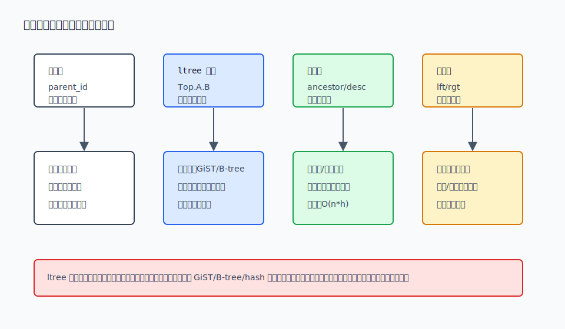
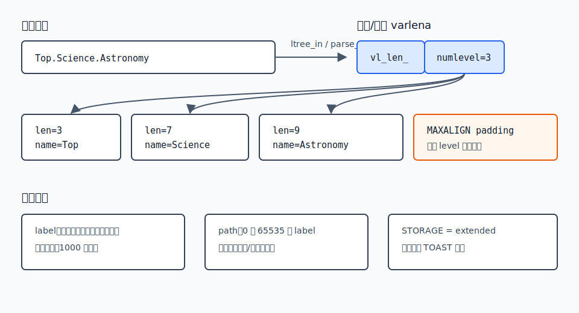
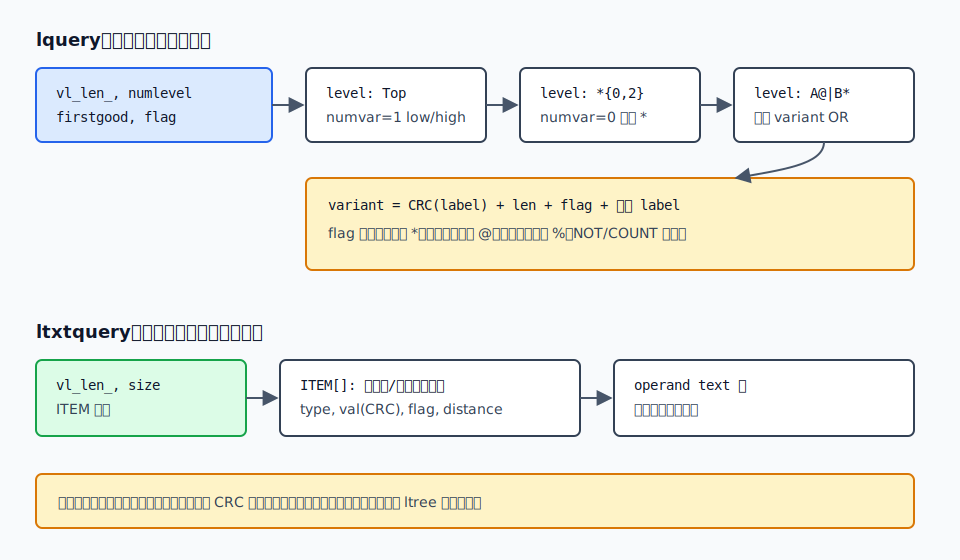
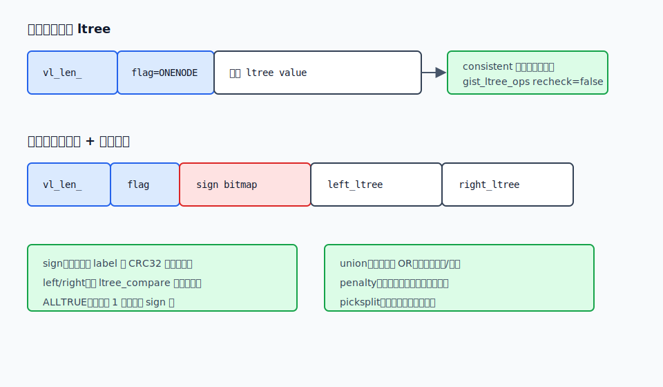
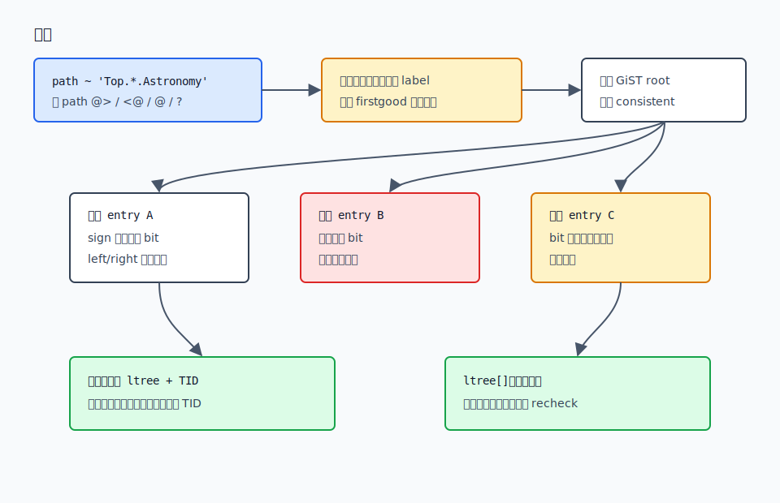

## 数据库筑基课 - ltree 存储结构
                                                                                            
### 作者                                                                
digoal                                                                
                                                                       
### 日期                                                                     
2026-05-27                                                      
                                                                    
### 标签                                                                  
PostgreSQL , 应用开发者 , DBA , 数据库筑基课 , 数据类型与算子 , ltree , 层级数据 , GiST , varlena  
                                                                                           
----                                                                    

## 背景
   

本节属于“数据类型与算子”基础能力，也会触及 GiST 索引结构。当前工作区没有发现“数据库筑基课”总纲文件，因此本文先独立成篇。

组织架构、商品类目、权限菜单、知识库目录、地理行政区、账套科目，都是层级数据。关系数据库最基础的表是扁平的，而层级天然有递归关系。Jan Finis 的博士论文 *On Supporting Hierarchical Data in Relational Main-Memory Database Systems* 把这个问题称为关系表与层级结构之间的阻抗不匹配：企业数据通常仍要放在关系系统里，但层级查询、更新、版本和变更检测会暴露出普通表模型的短板。

PostgreSQL 的 `ltree` 不是要把数据库变成图数据库。它做的是一个更窄、更工程化的事情：把“从根到某个节点的路径”变成一个强类型值，并给它配套路径算子、模式查询类型和索引 operator class。这样应用不用把层级路径当普通字符串乱拼，也不用每次查子树都写递归 CTE。

本文基于本地 PostgreSQL 源码 `postgres`，当前提交为 `01a80f062146af1b17b411c35cb8d992c487fa7c`（2026-05-23）。DeepWiki 用作源码导航，关键结论均回到本地源码、官方文档和论文核对。

## 一、它解决什么问题？

`ltree` 解决的是“路径枚举模型如何在数据库里变成可比较、可匹配、可索引的类型”的问题。

不用 `ltree` 时，常见做法有四类：

- 邻接表：每行存 `parent_id`。写入和移动节点简单，但查整棵子树、查所有祖先通常要递归。
- 普通文本路径：每行存 `Top.Science.Astronomy`。读起来直观，但类型系统不知道这是路径，合法性、比较、祖先/后代关系、模式匹配都容易散落在应用代码里。
- 闭包表：额外存所有 ancestor-descendant 关系。读祖先/后代快，但写入和移动子树会放大到多行维护。
- 嵌套集或区间编码：子树查询能变成范围查询，但频繁插入、移动、重排时代价高。

`ltree` 的折中是：把路径作为行的一列保存，祖先/后代关系变成前缀语义，路径模式变成 `lquery`，位置无关的词匹配变成 `ltxtquery`，再通过 B-tree、hash、GiST 接入优化器。

代价也很明确：

- 移动一个子树时，所有后代的路径值都要更新；`ltree` 不会自动维护树结构。
- `ltree` 表示的是树形路径，不适合多父节点、有环、任意边属性的图模型。
- GiST 签名索引能剪枝，但签名越短越容易误下探；签名越长索引越大。
- 路径标签有字符和长度约束，不是任意文本字段。



图 1 说明：`ltree` 的优势不是“所有层级问题都快”，而是把路径关系固化为类型、算子和索引。它适合读多、路径查询多、业务上天然有稳定路径的树；不适合高频移动大子树或复杂图关系。

## 二、它是什么？

`ltree` 扩展提供三个核心类型：

- `ltree`：保存 label path，例如 `Top.Countries.Europe.Russia`。
- `lquery`：保存位置敏感的路径模式，例如 `Top.*{0,2}.sport*@.!football|tennis{1,}.Russ*|Spain`。
- `ltxtquery`：保存位置无关的词逻辑表达式，例如 `Europe & Russia*@ & !Transportation`。

官方文档给出的约束是：

- label 由字母数字、下划线、连字符组成；字母数字范围受数据库 locale 影响，在 `C` locale 中相当于 `A-Za-z0-9_-`。
- 单个 label 最多 1000 个字符。
- 一个 label path 最多 65535 个 label。
- `ltxtquery` 允许符号之间有空白，`ltree` 和 `lquery` 不允许。

SQL 扩展脚本 `postgres/contrib/ltree/ltree--1.1.sql` 定义了这些类型的 `INTERNALLENGTH = -1`，说明它们都是 varlena 变长类型；`ltree`、`lquery`、`ltxtquery` 的 `STORAGE = extended`，大值可以走 PostgreSQL 的 TOAST 机制。`ltree_gist` 是 GiST opclass 使用的内部 storage type，`STORAGE = plain`。

## 三、核心原理

### 3.1 `ltree` 的物理布局：不是字符串数组，而是 varlena + 对齐 label 段

`postgres/contrib/ltree/ltree.h` 定义了 `ltree`：

```c
typedef struct
{
    int32   vl_len_;
    uint16  numlevel;
    char    data[FLEXIBLE_ARRAY_MEMBER];
} ltree;
```

`data` 后面不是点号分隔的字符串，而是一串按 `MAXALIGN` 对齐的 `ltree_level`：

```c
typedef struct
{
    uint16  len;
    char    name[FLEXIBLE_ARRAY_MEMBER];
} ltree_level;
```

因此 `Top.Science.Astronomy` 的内部形态是：

- varlena 总长度。
- `numlevel = 3`。
- level 1：`len=3, name=Top`。
- level 2：`len=7, name=Science`。
- level 3：`len=9, name=Astronomy`。
- 每个 level 通过 `LEVEL_NEXT()` 按 `MAXALIGN(len + LEVEL_HDRSIZE)` 找到下一个。

点号只存在于输入/输出文本里，不作为 label 内容保存。`ltree_out()` 反向遍历 level，输出时再补点号。



图 2 说明：`ltree` 的查询快感来自结构化表示。`nlevel()` 直接读 `numlevel`，祖先判断可以逐个 level 比较，子路径函数可以按 level 边界切片，而不是每次重新解析字符串。

### 3.2 输入解析：先校验路径，再一次性分配目标结构

`postgres/contrib/ltree/ltree_io.c` 的 `parse_ltree()` 做了两遍关键工作。

第一遍扫描输入，统计点号数量，从而推导最多需要多少个 label，并检查是否超过 `LTREE_MAX_LEVELS`。第二遍用状态机解析：

- `LTPRS_WAITNAME`：等待 label 开始。
- `LTPRS_WAITDELIM`：读取 label 内容，等待点号或结束。

每个 label 先暂存在 `nodeitem` 数组里，`finish_nodeitem()` 检查字符长度等约束。最后根据所有 label 的 aligned size 一次性 `palloc0(LTREE_HDRSIZE + totallen)`，写入 `numlevel` 和各个 `ltree_level`。

这个设计有两个工程收益：

- 输入合法性和内存布局构造分离，不会边写目标结构边发现语法错误。
- 目标 varlena 一次分配，内部通过偏移遍历，不需要每个 label 单独分配小对象。

### 3.3 比较与祖先判断：路径语义落在 level 序列上

`postgres/contrib/ltree/ltree_op.c` 的 `ltree_compare()` 逐 level 比较 label 字节序；如果当前 label 前缀相同但长度不同，则短 label 和长 label 的差异会放大到当前剩余层级权重；如果所有已比较 level 相同，则按 `numlevel` 差异排序。官方文档把这种顺序描述为树遍历顺序，同一父节点下按 label 文本排序。

祖先/后代判断更直接。`inner_isparent(c, p)` 的意思是：`p` 是否为 `c` 的前缀。如果 `p.numlevel > c.numlevel`，直接 false；否则逐 level 检查长度和内容完全相等。

于是：

```sql
SELECT 'Top.Science'::ltree @> 'Top.Science.Astronomy'::ltree;  -- true
SELECT 'Top.Science.Astronomy'::ltree <@ 'Top.Science'::ltree;  -- true
```

这里 `@>` 与 `<@` 不是字符串 `LIKE`，而是基于 `ltree_level` 序列的前缀关系。

### 3.4 `lquery` 与 `ltxtquery`：查询也被编译成结构

`lquery` 保存的是“整条路径必须匹配”的位置敏感模式。源码中的结构包括：

- `lquery.numlevel`：模式层数。
- `lquery.firstgood`：前导简单匹配层数，用于 GiST 边界剪枝。
- `lquery_level`：一层模式，包含 `numvar`、`low/high` 重复次数和 flags。
- `lquery_variant`：一层中的 OR 分支，保存 label 的 CRC、字节长度、flag 和原始 name。

flags 表达：

- `LVAR_ANYEND`：后缀 `*`，表示前缀匹配。
- `LVAR_INCASE`：后缀 `@`，表示大小写不敏感。
- `LVAR_SUBLEXEME`：后缀 `%`，表示按下划线分词匹配。
- `LQL_NOT`：`!`。
- `LQL_COUNT`：显式重复次数。

`ltxtquery` 更像全文检索表达式，但作用在路径 label 上。`postgres/contrib/ltree/ltxtquery_io.c` 把表达式解析为 `ITEM` 数组和 operand 文本区：`ITEM` 保存操作符、词项 CRC、flag、operand 距离等，operand 区保存用户可读的词项文本。



图 3 说明：`ltree` 不只是一个路径值，还把路径模式也编译成结构。这样执行器和索引不必反复解释用户输入文本，可以按 level、variant、flag、CRC 位图做判断。

### 3.5 GiST 存储：叶子保存完整路径，内部页保存签名和边界

`ltree` 的 GiST opclass 是 `gist_ltree_ops`。它的 storage type 是 `ltree_gist`：

```c
typedef struct
{
    int32   vl_len_;
    uint32  flag;
    char    data[FLEXIBLE_ARRAY_MEMBER];
} ltree_gist;
```

`ltree.h` 的注释直接给出了布局：

- 叶子页：`(len)(flag)(ltree)`。
- 非叶子页：`(len)(flag)(sign)(left_ltree)(right_ltree)`。
- 如果签名全为 1，使用 `ALLTRUE`，可省略 `sign`。

这不是普通 B-tree，也不是纯 RD-tree，而是一个组合摘要：

- `sign`：子树中出现过的 label 的位图签名。`hashing()` 对每个 label 计算 `ltree_crc32_sz(label)`，再对 `siglen * 8` 取模置位。
- `left_ltree` / `right_ltree`：子树中按 `ltree_compare()` 排序的左右边界，用于比较、等值、前导简单模式等剪枝。

默认 `gist_ltree_ops` 的 `siglen` 是 8 字节。官方文档说明它必须是正的 int 对齐倍数，最大到 2024 字节；签名越长，扫描的索引和 heap 页可能越少，但索引更大。



图 4 说明：叶子 key 保存完整 `ltree`，所以 `gist_ltree_ops` 的叶子判断可以精确；内部 key 是摘要，允许误下探，但不能漏掉可能命中的子树。

### 3.6 GiST support functions：正确性和效率分别由不同函数承担

`postgres/contrib/ltree/ltree--1.1.sql` 为 `gist_ltree_ops` 注册了 7 个 GiST support functions：

| 函数 | 源码入口 | 作用 |
|---|---|---|
| `ltree_consistent` | `ltree_gist.c` | 判断 index entry 和查询是否可能匹配 |
| `ltree_union` | `ltree_gist.c` | 合并多个 entry，生成子树摘要 |
| `ltree_compress` | `ltree_gist.c` | 叶子 `ltree` 转成 `ltree_gist` |
| `ltree_decompress` | `ltree_gist.c` | detoast GiST key |
| `ltree_penalty` | `ltree_gist.c` | 插入时估算边界扩张代价 |
| `ltree_picksplit` | `ltree_gist.c` | 页分裂时按排序边界分组 |
| `ltree_same` | `ltree_gist.c` | 判断两个 GiST key 是否相同 |

GiST 论文 *Generalized Search Trees for Database Systems* 的核心思想是：数据库系统提供通用搜索树框架，数据类型作者提供 `consistent`、`union`、`compress`、`penalty`、`picksplit` 等语义函数。`ltree` 正是这个思想的一个落地：PostgreSQL GiST 负责树、页、WAL、并发和扫描；`ltree` opclass 负责“路径如何摘要、如何剪枝、如何分裂”。

`ltree_union()` 的逻辑是：

- 如果 entry 是叶子 `ONENODE`，把完整 `ltree` 的每个 label 哈希到 `base` 签名，并更新左右边界。
- 如果 entry 是内部摘要，签名按位 OR，并合并左右边界。
- 如果 OR 后签名全为 1，则标记 `ALLTRUE`。

`ltree_penalty()` 只看左右边界扩张，不计算签名差异。`ltree_picksplit()` 把 entry 按左边界排序后分成左右两半，并分别生成签名和边界。这说明 `gist_ltree_ops` 更像“有 B-tree 顺序边界的签名树”，而不是只靠集合签名组织。

### 3.7 查询路径：内部页可以误下探，叶子页必须精确

`ltree_consistent()` 按 strategy number 分派：

- B-tree 风格比较：`<`、`<=`、`=`、`>=`、`>`。
- 祖先/后代：`@>`、`<@`。
- 路径模式：`~`，参数是 `lquery`。
- 位置无关词匹配：`@`，参数是 `ltxtquery`。
- 多个 `lquery` 任一匹配：`?`。

对于内部页，`lquery` 查询会经过两个过滤：

1. `gist_qe()`：对能安全查签名的简单项，看签名 bit 是否存在。
2. `gist_between()`：如果 `lquery.firstgood > 0`，用前导简单 level 与 `left_ltree/right_ltree` 比较，进一步剪枝。

对于叶子页，`ltree_consistent()` 调用真实算子函数，例如 `ltq_regex()`、`ltxtq_exec()`、`inner_isparent()`。源码中明确把 `*recheck = false`，因为 `gist_ltree_ops` 叶子保存完整 `ltree`，所有返回给执行器的结果已经是精确判断。



图 5 说明：签名位图的作用是“排除不可能”，不是“证明一定命中”。签名 bit 命中可能来自哈希碰撞，也可能因为模式本身复杂而无法充分利用签名；这些情况最多导致多下探，不应导致漏查。

### 3.8 `ltree[]` 的 GiST：更省结构，但必须复查

`gist__ltree_ops` 支持 `ltree[]`。它复用 `ltree_gist` storage type，但叶子压缩方式完全不同。

`postgres/contrib/ltree/_ltree_gist.c` 的 `_ltree_compress()` 对数组里每个 `ltree` 的每个 label 置签名位，叶子 key 不保存完整数组内容。内部 `union` 也是签名 OR。`_ltree_penalty()` 用 Hamming distance，`_ltree_picksplit()` 选择距离最大的两个 seed，再按签名距离分配 entry。

因此 `_ltree_consistent()` 一开始就设置：

```c
*recheck = true;
```

这是 `ltree[]` 与单值 `ltree` GiST 的关键差别：

- `gist_ltree_ops`：叶子有完整 `ltree`，返回精确，`recheck=false`。
- `gist__ltree_ops`：叶子只有数组签名，会误判，`recheck=true`。

官方文档也给出不同默认签名长度：单值 `ltree` 默认 8 字节，数组 `ltree[]` 默认 28 字节。数组的签名默认更长，是因为一个数组可能包含多个路径，bit 更容易被填满。

## 四、横向对比

### 4.1 建模方式对比

| 维度 | `ltree` 路径 | 邻接表 | 闭包表 | 嵌套集/区间 |
|---|---|---|---|---|
| 主要目标 | 路径查询、子树查询、路径模式匹配 | 表达父子边 | 快速祖先/后代关系 | 静态或少变树的范围查询 |
| 读取代价 | `@>`/`<@`/`~` 可走 GiST，排序/等值可走 B-tree/hash | 递归 CTE 或多次 join | 直接查关系表 | 范围查询快 |
| 写入代价 | 插入叶子简单，移动子树要更新后代路径 | 插入/移动单点简单 | 维护 closure 行，写放大 | 插入/移动可能大范围重编号 |
| 空间成本 | 每行一个路径 varlena，可加索引 | 最省 | 额外关系表可能很大 | 每行左右边界 |
| 模式匹配 | `lquery`/`ltxtquery` 原生支持 | 需要递归后过滤 | 通常需附加条件 | 不适合复杂路径模式 |
| 适合场景 | 类目、菜单、目录、权限路径、稳定组织层级 | 高频结构更新、简单父子关系 | 读多写少的关系判定 | 静态树和报表 |
| 不适合场景 | 图、多父节点、频繁移动大子树 | 深层级多条件查询 | 高频移动子树 | 动态树 |

这张表的核心不是“谁更先进”，而是代价放在哪里。`ltree` 把读路径的复杂度转成写路径时维护完整路径；闭包表把读关系的复杂度转成写关系表；邻接表把写入简单性换成查询递归；嵌套集把子树范围读取换成结构更新成本。

### 4.2 `ltree` 的索引方式对比

| 索引 | 支持对象 | 主要可用算子 | 是否有损 | 适合场景 |
|---|---|---|---|---|
| B-tree | `ltree` | `< <= = >= >` | 否 | 排序、等值、树遍历顺序范围 |
| Hash | `ltree` | `=` | 否 | 只做等值查找 |
| GiST `gist_ltree_ops` | `ltree` | 比较、`@>`、`<@`、`~`、`@`、`?` | 内部页摘要有误下探，叶子结果精确 | 子树、祖先、路径模式、词匹配 |
| GiST `gist__ltree_ops` | `ltree[]` | 数组与路径/模式匹配 | 是，需 recheck | 一行多个路径标签集合 |

如果业务只查 `path = ?`，hash 或 B-tree 可能更直接。如果核心查询是“查某节点下所有后代”“查路径包含某种模式”“排除某些 label”，GiST 才是 `ltree` 的主力索引。

## 五、效果如何？

`ltree` 的收益主要来自三件事。

第一，路径合法性进入类型系统。非法字符、空 level、超长 label、超多 level 在输入阶段就失败，应用不用重复校验。

第二，常用层级关系变成 C 函数和索引算子。`@>`、`<@`、`~`、`@`、`?` 都有明确语义，也能被 opclass 注册给优化器。

第三，GiST 摘要能减少不必要的子树扫描。`siglen` 越长，哈希碰撞概率越低，内部页误下探越少；但每个内部 key 也更大，索引页 fanout 下降，缓存命中和写入成本会受影响。

不要误读它的效果：

- `ltree` 不会减少 heap 行版本的 MVCC 成本。更新路径仍然是更新行，仍会产生新版本和索引维护。
- `ltree` 不会保证树结构无环，因为它只存路径值，不存边集合。
- GiST 签名不是精确集合。特别是 `ltree[]`，叶子都只有签名，必须回表复查。
- 官方文档没有给出通用性能倍数；实际效果取决于路径深度、label 基数、查询模式、签名长度和数据分布。

空间上，可以粗略按下面方式理解单个 `ltree` 值：

```text
ltree 大小 ~= LTREE_HDRSIZE + sum(MAXALIGN(LEVEL_HDRSIZE + label_bytes))
```

再加上 varlena/heap tuple、页头、行头、索引项等 PostgreSQL 通用开销。这个估算用于理解趋势，不应替代 `pg_column_size()` 和真实表上的索引大小测量。

## 六、实操 DEMO

下面示例可以在安装了 `ltree` 扩展的 PostgreSQL 中执行。本文没有启动本地 PostgreSQL 实例，因此不提供伪造执行结果；SQL 语法来自官方文档、本地 `contrib/ltree/sql/ltree.sql` 和扩展脚本核对。

```sql
CREATE EXTENSION IF NOT EXISTS ltree;

DROP TABLE IF EXISTS catalog_node;

CREATE TABLE catalog_node (
    id bigint GENERATED ALWAYS AS IDENTITY PRIMARY KEY,
    name text NOT NULL,
    path ltree NOT NULL
);

INSERT INTO catalog_node (name, path) VALUES
('Top', 'Top'),
('Science', 'Top.Science'),
('Astronomy', 'Top.Science.Astronomy'),
('Astrophysics', 'Top.Science.Astronomy.Astrophysics'),
('Cosmology', 'Top.Science.Astronomy.Cosmology'),
('Collections', 'Top.Collections'),
('Pictures', 'Top.Collections.Pictures'),
('Picture Astronomy', 'Top.Collections.Pictures.Astronomy'),
('Stars', 'Top.Collections.Pictures.Astronomy.Stars');

CREATE INDEX catalog_node_path_gist
    ON catalog_node USING gist (path);

CREATE INDEX catalog_node_path_btree
    ON catalog_node USING btree (path);

-- 查 Top.Science 下所有后代，包括自身
SELECT id, name, path
FROM catalog_node
WHERE path <@ 'Top.Science'::ltree
ORDER BY path;

-- 查所有路径中包含 Astronomy 且后面还有至少一层的节点
SELECT id, name, path
FROM catalog_node
WHERE path ~ '*.Astronomy.*'::lquery
ORDER BY path;

-- 位置无关词匹配：包含 Astro 前缀，但不包含 pictures，大小写不敏感
SELECT id, name, path
FROM catalog_node
WHERE path @ 'Astro*% & !pictures@'::ltxtquery
ORDER BY path;

-- 查看计划时关注是否选择 GiST，以及是否出现 Bitmap Heap Scan / Index Scan
EXPLAIN (COSTS, VERBOSE)
SELECT id, name, path
FROM catalog_node
WHERE path <@ 'Top.Science'::ltree;
```

如果要验证签名长度的影响，可以建两个测试索引，在同一份数据和同一批查询上比较计划与缓冲区访问：

```sql
CREATE INDEX catalog_node_path_gist_8
    ON catalog_node USING gist (path gist_ltree_ops(siglen=8));

CREATE INDEX catalog_node_path_gist_100
    ON catalog_node USING gist (path gist_ltree_ops(siglen=100));

EXPLAIN (ANALYZE, BUFFERS)
SELECT *
FROM catalog_node
WHERE path ~ '*.Astronomy.*'::lquery;
```

不要直接假设 `siglen=100` 一定更快。它通常更精确，但索引更大；小表、热缓存、低并发、简单查询下，额外空间可能不值得。

移动子树的典型写法如下：

```sql
-- 把 Top.Science.Astronomy 子树移动到 Top.Space.Astronomy
UPDATE catalog_node
SET path = 'Top.Space.Astronomy'::ltree
           || subpath(path, nlevel('Top.Science.Astronomy'::ltree))
WHERE path <@ 'Top.Science.Astronomy'::ltree;
```

这条语句会更新整棵子树的所有后代行。生产环境需要把它当普通大 UPDATE 对待：评估行数、索引维护、锁等待、WAL、复制延迟、autovacuum 压力，而不是把它当元数据改名。

## 七、最佳实践

面向数据库架构师：

- 先确认业务是不是树，而不是图。多父节点、边上有复杂属性、任意深度路径搜索，通常不该只靠 `ltree`。
- 路径 label 尽量使用稳定、短、无业务展示含义的 code，而不是会频繁改名的中文名称。展示名放普通列。
- 如果移动子树是核心高频操作，要评估邻接表、闭包表、专用层级索引或业务异步重写，而不是只看查询写起来是否简洁。

面向 DBA：

- 对 `@>`、`<@`、`~`、`@`、`?` 这类查询优先评估 GiST；对排序和等值评估 B-tree/hash。
- 用真实数据测试 `siglen`。观察 `EXPLAIN (ANALYZE, BUFFERS)`、索引大小、回表页数、写入延迟，而不是只看单次执行时间。
- 大规模子树移动要纳入变更窗口或分批执行，关注 WAL、复制槽积压、autovacuum 和索引膨胀。

面向业务开发者：

- 用 `text2ltree()` 或显式 cast 让非法路径尽早失败，不要把用户输入直接拼进 SQL。
- 查询“包含某 label”优先用 `lquery` 或 `ltxtquery`，不要退化为 `path::text LIKE '%xxx%'`。
- 对大小写、下划线分词、前缀匹配要写清楚语义：`@`、`%`、`*` 在 `lquery`/`ltxtquery` 里含义不同于 SQL 通配符。

## 八、适合与不适合场景

适合：

- 商品类目、权限菜单、功能目录、知识库目录等天然树结构。
- 读多写少，常查某节点下整棵子树或路径模式。
- 路径 code 稳定，改名不需要改路径。
- 需要把层级路径和普通关系列一起过滤、排序、分页。

不适合：

- 组织架构频繁大规模调整，且每次移动都必须同步更新大量后代。
- 一个节点可以有多个父节点，或者存在跨层级引用、环、边属性。
- 需要最短路径、连通性、复杂图遍历。
- label 是长自然语言文本，且需要分词搜索；这类需求应考虑全文检索或专门搜索引擎。

## 九、常见坑

1. 把 `ltree` 当普通字符串。

   `Top.A` 和 `Top.AA` 的关系不是字符串前缀，而是 label 序列关系。查子树应使用 `<@` / `@>`，不是 `LIKE 'Top.A%'`。

2. 把展示名放进 path。

   展示名会变，路径 code 应尽量稳定。否则“改名”会变成全子树 UPDATE。

3. 忽略 locale 对合法字符的影响。

   文档说明 label 的字母数字范围依赖数据库 locale。跨环境迁移时，不要只在一个 locale 下测试边界字符。

4. 误以为 GiST 签名命中就是精确命中。

   单值 `ltree` 的 GiST 叶子判断精确，所以返回结果不需要 recheck；但内部签名仍可能误下探。数组 `ltree[]` 的 GiST 叶子就是签名，必须 recheck。

5. 盲目增大 `siglen`。

   更长签名减少碰撞，但索引项更大、fanout 下降、写入和缓存成本增加。只有在真实 workload 下测过，才知道收益是否覆盖成本。

6. 忘记更新路径相关索引成本。

   子树移动是批量更新，每行的 GiST/B-tree/hash 索引都要维护。路径模型的读优势是用写放大换来的。

## 十、扩展问题

1. 如果把 `ltree` 的 label 签名从单 hash bit 改成 Bloom filter 多 hash，会减少误下探，但会带来哪些 CPU 和兼容性成本？
2. `gist_ltree_ops` 的 `ltree_penalty()` 主要看左右边界扩张。如果你的数据 label 集合高度重叠，这个 penalty 是否仍然能产生好树？
3. 为什么 `ltree[]` 的 GiST 叶子不保存完整数组？如果保存完整数组，空间、recheck、索引构建会如何变化？
4. 对一个读多写少的类目系统，`ltree` 与闭包表是否可以同时使用？哪些查询走哪一套结构？
5. 如果业务要求记录层级历史版本，单列 `ltree` 还够不够？需要额外引入哪些时间维度或版本索引？

## 十一、扩展阅读

- PostgreSQL 官方文档：[ltree — hierarchical tree-like data type](https://www.postgresql.org/docs/current/ltree.html)
- PostgreSQL 官方文档：[GiST Indexes](https://www.postgresql.org/docs/current/gist.html)
- PostgreSQL 本地源码：`postgres/contrib/ltree/ltree.h`
- PostgreSQL 本地源码：`postgres/contrib/ltree/ltree_io.c`
- PostgreSQL 本地源码：`postgres/contrib/ltree/ltree_op.c`
- PostgreSQL 本地源码：`postgres/contrib/ltree/lquery_op.c`
- PostgreSQL 本地源码：`postgres/contrib/ltree/ltxtquery_io.c`
- PostgreSQL 本地源码：`postgres/contrib/ltree/ltree_gist.c`
- PostgreSQL 本地源码：`postgres/contrib/ltree/_ltree_gist.c`
- PostgreSQL 本地扩展脚本：`postgres/contrib/ltree/ltree--1.1.sql`、`postgres/contrib/ltree/ltree--1.2--1.3.sql`
- PostgreSQL 本地测试：`postgres/contrib/ltree/sql/ltree.sql`、`postgres/contrib/ltree/expected/ltree.out`
- Joseph M. Hellerstein, Jeffrey F. Naughton, Avi Pfeffer: [Generalized Search Trees for Database Systems](https://dsf.berkeley.edu/papers/vldb95-gist.pdf), VLDB 1995.
- Jan Peter Finis: [On Supporting Hierarchical Data in Relational Main-Memory Database Systems](https://mediatum.ub.tum.de/doc/1295435/972519.pdf), Technische Universität München, 2016.
- DeepWiki：`postgres/postgres` 仓库问答，用于定位 `ltree` 类型、GiST opclass 和相关源码文件；关键事实已用本地源码核验。

## 校验说明

- 标题、分类、结构已按“数据库筑基课 - ltree 存储结构”整理。
- 主要机制来自本地 PostgreSQL 源码与官方文档；论文只用于解释 GiST 和层级数据建模背景。
- SQL 示例未在本地数据库实例执行；语法参考官方文档和 `contrib/ltree/sql/ltree.sql`。
- 本文没有编造性能数字；所有性能判断均表述为需要在真实 workload 下验证。
- SVG 图均为 standalone 文件，使用相对路径引用，不含 JavaScript、`foreignObject`、外部 CSS、远程字体或远程图片。
  
## 附录  
  
1、克隆代码  
```  
git clone --depth 1 https://github.com/postgres/postgres
```  
  
2、启用 codex, 使用 [数据库筑基课 skill](../skills/README.md).  
````
文章标题: 
  数据库筑基课 - ltree 存储结构 
项目源码(已克隆到当前项目如下目录中):  
  postgres
相关论文或分享:
  Generalized Search Trees for Database Systems
  On Supporting Hierarchical Data in Relational Main-Memory Database Systems
项目 deepwiki reponame:  
  postgres/postgres
项目参考信息: 
  postgres/CLAUDE.md
````
   
  
#### [PostgreSQL 解决方案集合](../201706/20170601_02.md "40cff096e9ed7122c512b35d8561d9c8")
  
  
#### [德哥 / digoal's Github - 公益是一辈子的事.](https://github.com/digoal/blog/blob/master/README.md "22709685feb7cab07d30f30387f0a9ae")
  
  
#### [About 德哥](https://github.com/digoal/blog/blob/master/me/readme.md "a37735981e7704886ffd590565582dd0")
  
  

  
