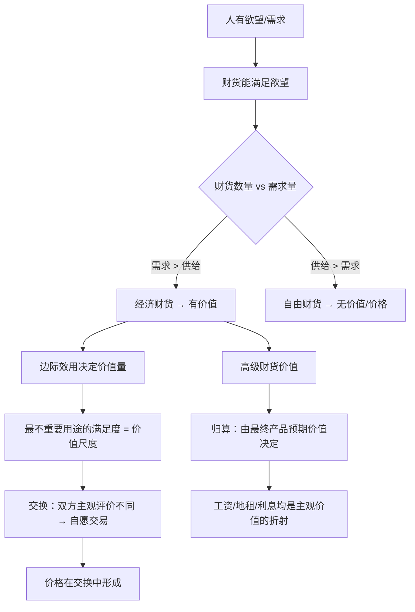

## 《国民经济学原理》读书笔记
  
### 作者  
digoal  
  
### 日期  
2026-05-27  
  
### 标签  
读书笔记 , 国民经济学原理   
  
----  
  
## 背景  
   
---
书名: 《国民经济学原理》   
作者: [奥] 卡尔·门格尔（Carl Menger）   
译者: 刘絜敖   
出版年份: 1871（原著）/ 2013（格致出版社中文版）   
笔记日期: 2026-05-27   
豆瓣评分: 9.5   
标签: [奥地利学派, 经济学原典, 边际效用, 主观价值论, 经济思想史]   
---

   

> **一句话**：一本只有两百页的小册子，却撬动了整个经济学的价值论基础，让「欲望的满足」取代「劳动的凝结」成为价值的根源。   
> **适合谁读**：对经济学原理有兴趣的读者；想理解奥地利学派根基的人；对「价值从何而来」抱有哲学疑问者。   
> **阅读难度**：⭐⭐⭐☆☆（行文清晰，但概念环环相扣，需要耐心）   
> **推荐指数**：⭐⭐⭐⭐⭐   

---

## 一、时代坐标：这本书从哪里来？

1871年，欧洲经济学正站在一个十字路口。

古典政治经济学（亚当·斯密、大卫·李嘉图）统治学界已近百年，其核心信条是：**商品的价值来自生产它所耗费的劳动量**。这个命题看上去坚不可摧——毕竟，劳动是客观的，可测量的，符合自然科学的实证精神。马克思更是将这一理论发挥到极致，在1867年出版《资本论》第一卷，以劳动价值论为基石，构建起整套社会批判理论。

就在这一年前后，奥地利有个31岁的年轻人，名叫卡尔·门格尔，正在一边做新闻从业者，一边研究政治经济学。他越看越觉得，整个古典学派的价值论方向搞错了：**价值不是藏在商品里的，而是藏在人的欲望里的。**

1871年，他将这一洞见整理成书——《国民经济学原理》（*Grundsätze der Volkswirtschaftslehre*）。同年，英国经济学家杰文斯（Jevons）和瑞士经济学家瓦尔拉斯（Walras）也各自独立得出了类似结论。经济学史称这一年为 **「边际革命元年」** 。

但门格尔的路径与另外两人截然不同：杰文斯和瓦尔拉斯大量使用数学工具，门格尔则坚持用语言和逻辑推理——他更像一个哲学家，要追问的是「经济现象的本质与起源」，而不是建立数学均衡模型。正是这一差异，使他开创了独树一帜的奥地利学派，影响了此后的米塞斯（Mises）、哈耶克（Hayek）等一代巨擘。

值得一提的是：这本书原本只是门格尔宏大四卷本写作计划的第一卷，但他因对自己写作始终不满意，此后数十年未能完成其余各卷，临终前留下大量未竟手稿。**就这「半成品」，奠定了一个学派一百五十年的基石。**

```
时间轴：边际革命三人独立同时发现
─────────────────────────────────────────
1871年
  ├── 门格尔（奥地利）→ 语言推演，哲学气质，→ 奥地利学派
  ├── 杰文斯（英国）  → 数学工具，功利主义，→ 新古典英国分支
  └── 瓦尔拉斯（瑞士）→ 数理均衡，→ 一般均衡理论（洛桑学派）

1883年 门格尔《经济学方法论探究》→ 「方法论之争」
1920s  米塞斯 → 社会主义大辩论，奥派独立性凸显
1974年 哈耶克获诺贝尔经济学奖
─────────────────────────────────────────
```

---

## 二、核心命题：作者在说什么？

### 命题一：价值是主观的——不在物，在人

门格尔最根本的颠覆，是把价值的来源从「物的客观属性」搬到了「人的主观评价」。

他问了一个看似简单的问题：**为什么钻石比水贵，虽然水对生命更重要？**古典学派用劳动量来解释，却解释不了为什么同样劳动量生产出来的商品，在不同情境下价格天差地别。

门格尔的答案是：**财货之所以有价值，是因为它能满足人的某种具体需求，而这种需求的满足，对特定的人在特定时刻是重要的。** 水在沙漠里价值极高，在河边几乎无价——不是水变了，是人的处境和需求变了。价值从来不是物品的内在属性，而是人与物之间关系的映射。

这一命题有个重要推论：**并不存在客观的、绝对的价值，只存在具体个人对具体财货在具体情境下的评价。**

### 命题二：边际效用——用「最后那一单位」来度量价值

光说价值是主观的还不够，门格尔还需要回答：**人到底用什么标准来评价价值的大小？**

他的答案是：**边际效用**——即某种财货中，「最不重要的那个用途」所提供的满足程度。

举个例子：你有5袋粮食。第1袋用来维持生命（极其重要）；第2袋用来保持体力（很重要）；第3袋用来养鸡（一般重要）；第4袋用来酿酒（次要）；第5袋用来喂鹦鹉（可有可无）。现在你丢失了1袋粮食——你会放弃哪个用途？当然是最次要的那个：喂鹦鹉。所以，**这1袋粮食的「价值」，等于你放弃喂鹦鹉这件事所带来的损失，而不是等于「维持生命」的重要性。**

这就解决了古典学派的「价值悖论」：水虽然对生命极重要，但供给充裕时，每增加一单位水所满足的需求极其次要（洗地板？浇花？），所以价格很低。钻石稀少，每增加一单位所满足的需求相对重要（彰显身份、礼物赠送），所以价格高。

### 命题三：高级财货的价值由低级财货决定——「归算理论」

门格尔把财货区分为两类：**低级财货**（直接满足需求的消费品，如面包）和**高级财货**（用于生产消费品的生产要素，如面粉、劳动力、磨坊）。

他的核心洞见是：**生产资料（高级财货）的价值，不是由投入的劳动量决定的，而是由它将来生产出的消费品（低级财货）的预期价值决定的。**

这与劳动价值论完全相反：古典学派认为「是成本（劳动）决定价值」，门格尔认为「是最终产品的效用决定成本」。工程师比农民收入高，不是因为工程师的劳动更辛苦，而是因为工程师所创造的产品，对人们欲望满足的贡献更大。

这一「归算理论」（Imputation Theory）后来被米塞斯和哈耶克用来猛烈批判社会主义计划经济——没有市场价格信号，计划当局根本无法合理评估生产资料的价值，因而理性的经济计算是不可能的。

---

## 三、论证地图：门格尔怎么说服你的？



门格尔的论证方式颇具特色：他**不用数学，不用统计数据**，而是通过精心设计的「思想实验」和「极端情境」来推导逻辑。例如著名的「孤岛农夫」场景——一个人独自生活在荒岛上，拥有5袋粮食、有不同重要程度的需求，通过这个高度抽象的模型来推导价值的本质。

这种方法的优点是：结论清晰，逻辑严密，不依赖特定历史时期的数据。缺点也明显：过度抽象，难以直接验证，且容易忽略真实世界中的制度因素、权力关系和历史路径依赖。

---

## 四、前提假设与边界：什么情况下这不成立？

**假设一：人是理性的欲望评估者**
门格尔的整个体系假定，人能够清晰感知自己的欲望，并对财货的效用做出合理判断。但行为经济学的大量研究表明，人的偏好是可塑的、情境依赖的，甚至是自相矛盾的（损失厌恶、框架效应、禀赋效应等）。一旦「理性评估者」的假设动摇，主观价值论的基础也会松动。

**假设二：个人欲望独立于社会结构**
门格尔将价值的根源归结为个人内心的欲望，但欲望本身是社会建构的产物。我想要一块劳力士，是因为「我」真的需要它，还是因为消费文化和阶层象征在驱动我？凡勃伦（Veblen）的「炫耀性消费」理论便是对这一盲点的有力回击。

**假设三：生产资料价值可以向消费品完全归算**
归算理论在逻辑上优美，但在现实中，生产过程涉及大量不确定性、时间跨度和互补性投入，将最终价值精确反向归算到每个生产要素，几乎是不可能完成的任务——这正是哈耶克所说的「知识分散」问题的体现。

**这本书最适用的边界**：解释**消费品市场中的微观定价逻辑**，理解**为何价值不是劳动的简单累加**。但对于垄断、外部性、公共品、信息不对称等现象，门格尔的框架明显力不从心。

---

## 五、思想谱系：这本书在哪个传统里？

门格尔明确批判了英国古典学派（斯密、李嘉图）的客观价值论，但并非凭空创造。他承接了法国学派（孔狄亚克、杜尔阁）对效用和主观评价的重视，也吸收了德国历史学派对「人的经济行为」的关注——尽管他后来与德国历史学派产生了著名的方法论冲突（「方法论之争」）。

他的三位核心「传人」，将这本书的种子发展成了三棵不同的树：

```
门格尔（1871）
    │
    ├── 维塞尔（Wieser）→ 机会成本概念、价值归属理论
    │
    ├── 庞巴维克（Böhm-Bawerk）→ 资本与利息理论、时间偏好
    │       │
    │       └── 米塞斯（Mises）→ 人的行为学、货币理论、社会主义不可能定理
    │                   │
    │                   └── 哈耶克（Hayek）→ 知识问题、自发秩序、商业周期理论
    │
    └── 间接影响 → 现代信息经济学（知识分散）、制度经济学
```

值得注意的是：门格尔在世时，他「知识、时间、不确定性」这些最有原创性的思想，反而被后来者在与新古典的融合中淡化了。直到20世纪20年代的「社会主义大辩论」，奥地利学派才重新彰显出与新古典主流的根本性差异。

---

## 六、我学到了什么？

读完这本书，有三个认知真的被刷新了。

**第一，「价值」不是物的属性，而是关系的属性。** 我们日常说某件东西「有价值」，仿佛价值像重量一样内嵌于物品中。但门格尔让我意识到，价值是人与物、欲望与供给之间的张力所产生的东西。同一杯水，在不同的人、不同的时刻，价值天差地别。这个洞见其实超越了经济学，它在提醒我们：很多我们以为「客观存在」的判断，其实都是关系性的、语境依赖的。

**第二，「成本决定价格」是倒置的直觉。** 我们都习惯于认为：生产成本高，所以价格贵。但门格尔的归算理论告诉我们，**是最终产品的市场价值，决定了为生产它而投入资源的价值**。如果消费者不再购买某种产品，那不管生产它花了多少劳动，其价值趋于零。这对理解产业升级、技术迭代有深刻启示：企业不是因为降低了成本才能卖更贵，而是因为创造了更高终端价值，其投入的资源才「值钱」。

**第三，理性与主观并不矛盾。** 门格尔的「主观价值」容易被误读为「任性」或「随机」。但他的体系其实是严格理性的——人依据自己的欲望强度和财货的满足能力，做出有序的排列与权衡。主观≠随意，主观≠不可分析，它只是意味着「以人为起点」，而非「以物为起点」。

---

## 七、举一反三：这个框架还能用在哪？

**场景一：互联网产品定价**
为什么微信几乎免费，却比许多收费软件更有价值？门格尔的框架给出了清晰解释：价值在于用户欲望的满足程度，而非开发成本。网络效应放大了边际效用，免费模式则是通过消除价格门槛来最大化用户数量，从而放大总体效用。

**场景二：艺术品与收藏品的定价逻辑**
一幅画为什么值上亿？从劳动价值论看毫无道理，从边际效用看则清晰：极度稀缺（供给趋于1）+特定群体的强烈欲望（超级富豪的社会地位需求）= 极高的边际效用 = 极高的价格。

**场景三：个人职业价值的判断**
你的薪资不是由你付出了多少努力决定的，而是由你所创造的终端价值（对雇主欲望满足的贡献）决定的。门格尔的归算理论提示我们：想提高收入，不是苦干更多小时，而是让自己所参与的那条「价值链」的终端产品，对人们更重要。

---

## 八、批判与反思

**门格尔最大的盲点：分配问题被刻意回避。**

主观价值论能优雅地解释价格如何形成，却对「谁能得到什么」这个分配问题几乎保持沉默。当所有收入（工资、地租、利息）都被解释为「要素贡献的主观价值折射」，便隐含地为现有分配秩序提供了合法性——好像每个人得到的，恰好是他「贡献」出来的。但贡献的大小，又是在谁制定的规则下、谁拥有的初始资源条件下被评估的？这个循环被门格尔视而不见。

**方法论上的局限：极度抽象的代价。**

门格尔对「孤岛农夫」式的思想实验情有独钟，这使得他的结论具有跨时代的普适性，但也使得他的分析与具体历史制度严重脱节。真实的市场不是在真空中运行的，它嵌入在法律、文化、权力关系之中。门格尔的框架解释「一般化的市场逻辑」绰绰有余，解释「为什么德国工人的工资高于孟加拉工人」则捉襟见肘。

**时代的局限：不确定性与信息问题留给了后人。**

门格尔已经隐约感受到「知识」和「时间」的重要性（他在书中特别提到「高级财货价值取决于预期价值」），但受制于时代，他没有发展出系统的不确定性理论。这个接力棒被哈耶克拿起，最终演变为20世纪最重要的经济学命题之一：**分散知识无法被中央汇集，价格体系是人类目前发现的最有效的知识传递机制。**

---

## 九、金句与记忆点

1. **「财货的价值，不是存在于财货本身之中，而是存在于人与财货的关系之中。」**
   → 价值是关系性的，不是物的本质属性。理解这一点，就理解了主观价值论的核心。

2. **「只有人的需求大于能支配的财货数量时，财货才有价值。」**
   → 稀缺性是价值的必要条件，但不是充分条件。效用+稀缺，才构成价值。

3. **「价值的尺度，是那个最不重要用途的满足程度。」**（边际效用定义）
   → 人们放弃的最末位用途，决定了财货的边际价值——这是解决价格悖论的钥匙。

4. **「生产资料的价值，由其所参与生产的最终产品的预期价值决定。」**（归算理论）
   → 成本不决定价值，价值决定成本。这是与古典学派最根本的分野。

5. **「门格尔认为，经济学应该研究人类经济现象的本质与起源，而非仅仅测量现象的数量关系。」**
   → 方法论的气质：哲学式追问，而非数学式建模。这一选择造就了奥地利学派的独特品格。

6. **「货币是商品的一种特殊形式，它的出现不是任何人设计的结果，而是个人追求利益过程中自发涌现的秩序。」**
   → 货币的自发演化论——后来哈耶克「自发秩序」思想的直接源头。

---

## 十、延伸阅读

1. **《人的行为》（米塞斯）**——门格尔的正宗传承，将主观价值论扩展为系统的「人的行为学」，是奥地利学派最完整的理论表达，但篇幅巨大，需要耐心。

2. **《资本与利息》（庞巴维克）**——从门格尔「时间偏好」思想出发，构建资本与利息的完整理论，同时也是对马克思剥削论的有力批判。

3. **《个人知识与社会秩序》系列文章（哈耶克）**——特别推荐《知识在社会中的运用》这篇短文，是理解「价格机制为何比计划优越」的最佳入口，与门格尔的原典一脉相承。

4. **《价格论》（斯蒂格勒）**——从新古典角度对边际效用理论的系统化，与门格尔对照阅读，可以清晰看到奥地利学派与新古典的异同。

5. **《经济学的结构》（熊彼特，《经济分析史》相关章节）**——通过经济思想史的眼光来理解门格尔的历史地位，避免将其孤立看待。

---

*笔记写于 2026-05-27 | 基于门格尔原著结构、学术评论与深度思考整理*
*豆瓣评分：9.5分（格致出版社2013年版） | 原著首版：1871年，维也纳*
  
  
#### [PostgreSQL 解决方案集合](../201706/20170601_02.md "40cff096e9ed7122c512b35d8561d9c8")
  
  
#### [德哥 / digoal's Github - 公益是一辈子的事.](https://github.com/digoal/blog/blob/master/README.md "22709685feb7cab07d30f30387f0a9ae")
  
  
#### [About 德哥](https://github.com/digoal/blog/blob/master/me/readme.md "a37735981e7704886ffd590565582dd0")
  
  

  
