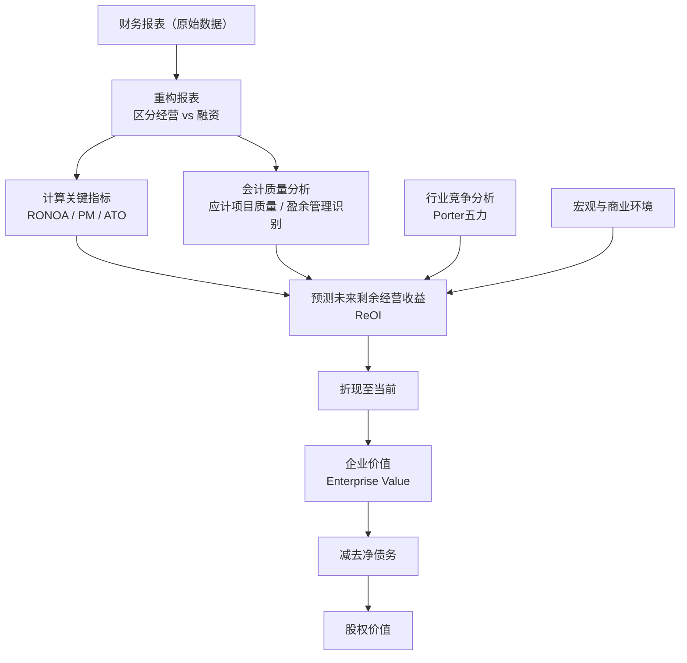

## 《财务报表分析与证券估值》读书笔记
  
### 作者  
digoal  
  
### 日期  
2026-05-27  
  
### 标签  
读书笔记 , 财务报表分析与证券估值   
  
----  
  
## 背景  
   
---
书名: 《财务报表分析与证券估值》（原书第5版）   
作者: [美] 斯蒂芬·H.佩因曼（Stephen H. Penman）   
译者: 朱丹 / 屈腾龙   
出版社: 机械工业出版社   
出版年份: 2017（中译版）/ 2013（英文原版第5版）   
笔记日期: 2026-05-27   
豆瓣链接: https://book.douban.com/subject/26988277/   
ISBN: 9787111552888   
标签: [财务分析, 证券估值, 价值投资, 会计, 剩余收益模型]   
---

   

> **一句话**：这本书用一个颠覆性的主张重建了估值学：与其费力预测遥远的现金流，不如让财务报表本身成为你的估值地基。   
>   
> **适合谁读**：财务分析师、基本面投资者、CFA学员、会计与金融专业研究生，以及所有曾经被 DCF 的"终值假设"折磨过的人。   
>   
> **阅读难度**：⭐⭐⭐⭐☆（需要会计基础，逻辑严密，值得细读）   
>   
> **推荐指数**：⭐⭐⭐⭐⭐   

---

## 一、时代坐标：这本书从哪里来？

2001年，安然（Enron）轰然倒塌。2008年，次贷危机将华尔街的精密模型砸得粉碎。正是在这两次危机之间，哥伦比亚大学教授斯蒂芬·H.佩因曼逐版打磨出这本书——不是偶然，而是对整个估值行业一次系统性的反思。

佩因曼的学术生涯跨越伯克利和哥伦比亚，恰好坐落在会计学与金融学两大学科的交汇点。这让他看到了一个长期存在的裂缝：**会计学家负责记录历史，金融学家负责预测未来，但两者之间几乎没有桥梁**。学金融的人轻视会计细节，认为只要现金流模型建对了，会计只是噪音；学会计的人沉迷分录与准则，却不知道数字背后的价值逻辑。

这本书要弥合这条裂缝。

佩因曼的核心问题意识来自一个朴素的观察：**投资者每天都在阅读财务报表，但他们真的知道如何把这些数字转化为价格吗？** 市场里充斥着比率分析（PE、PB、EV/EBITDA），这些乘数被广泛使用，却很少有人说得清它们背后究竟代表什么。而另一端，DCF（贴现现金流）模型的终值假设动辄占整体估值的60%以上，等于把最重要的数字留给了一个几乎无法验证的猜测。

这本书初版于2001年，第5版（2013年）是目前最完整的版本，711页。中文版由机械工业出版社2017年出版。

```
时间轴：佩因曼估值思想的演进

1989 ── Ou & Penman：财务数据预测股票收益的实证研究
   ↓
1992 ── 基本面分析的早期框架
   ↓
2001 ── 本书第1版：会计-估值大综合
   ↓
2008 ── 金融危机：检验其"以账面价值为锚"思路的历史节点
   ↓
2013 ── 第5版：纳入新会计准则，扩展剩余经营收益框架
   ↓
2025 ── 与Peter Pope合著《财务报表分析与价值投资》，思想进一步延伸
```

---

## 二、核心命题：作者在说什么？

### 命题一：估值是一场会计分析练习，而非现金流预测竞赛

佩因曼最大胆的主张是：**贴现现金流（DCF）模型在实践中不如基于应计制会计的剩余收益模型（Residual Earnings Model）**。

原因不是数学上的差异——从理论上讲，股利折现模型、DCF和剩余收益模型三者是等价的。但在实践中，差别巨大：

- DCF需要预测长期自由现金流，而早期成长企业的自由现金流往往是负数，完全依赖终值的猜测
- 剩余收益模型以**账面价值（Book Value）**为起点，问的是"公司能否持续创造超过资本成本的利润"
- 这个问题更接地气，因为财务报表就在眼前，而不是十年后的臆想

公式的直觉：

```
股权价值 = 当前账面价值 + 未来剩余收益（超额利润）的现值
         = 你现在能确认的 + 你对超额盈利能力的预期
```

前一项是"已知的"，后一项才是分析的核心。这个框架让分析师知道，**自己在为什么付钱**——到底是为存量资产付钱，还是为成长溢价付钱。

### 命题二：财务报表要"重构"，而非直接使用

书中有大量篇幅讲解如何将原始财务报表改造成适合估值的格式。最核心的操作是区分：

- **经营性资产/负债（Operating）**与**金融性资产/负债（Financial）**
- **经营收益（OI, Operating Income）**与**利息及融资收益**

为什么要分拆？因为经营部分是价值创造的来源，融资结构只影响价值分配，不应混为一谈。许多分析师之所以被财务杠杆搞混，就是因为没有做这个分离。

重构后，核心分析框架是：

```
ROE（净资产收益率）
  = RNOA（净经营资产收益率）+ 财务杠杆贡献
  = 经营价值创造 + 融资结构影响
```

进一步：RNOA = 经营利润率（PM）× 净经营资产周转率（ATO）

这就是佩因曼版的"杜邦分析"——比传统三因素更干净，也更有经济含义。

### 命题三：会计质量是估值的前提，而非附注

在很多估值书里，会计处理是放在最后"注意事项"里的边角料。在佩因曼这里，**读懂会计才能读懂价值**。

书中专门分析了：
- **权责发生制（Accrual Accounting）**如何影响利润与现金流的差异
- 研发费用化 vs 资本化对估值的影响
- 公允价值（Fair Value）会计的陷阱——它把未来不确定的收益提前放入报表，制造了一种"精确的幻觉"

佩因曼是**公允价值会计的批评者**。他认为，以历史成本为基础的保守会计（Conservative Accounting），反而给剩余收益模型创造了更坚实的预测基础——因为被低估的资产会在未来"释放"超额收益。

---

## 三、论证地图：这套体系如何自洽？



佩因曼的论证是**由内到外、由已知到未知**的：

先立足于可以确认的账面价值，再用历史财务报表训练对经营指标的感知，然后向前预测剩余收益，最后折现。他不鼓励对10年以上的超长期做精细预测——而是建立一个"近期预测+持续价值"的两段式框架，让终值计算有更扎实的会计支撑。

**关键数据支撑**：佩因曼和Sougiannis（1998）的实证研究比较了不同估值方法在实际市场价格预测中的误差，发现剩余收益/应计收益方法的平均预测误差显著低于纯DCF方法，尤其是在需要有限预测期的实践场景中。

---

## 四、前提假设与边界：什么情况下这不成立？

**假设一：会计准则能大致反映经营现实**

如果公司存在大规模的盈余管理、表外负债或激进的收入确认，那么账面价值这个"锚"就失去了可信度。这在新兴市场、科技独角兽或大量采用公允价值会计的金融机构中风险尤其高。

**假设二：资本成本可以合理估计**

剩余收益模型的折现率决定了超额收益"值多少"。但资本成本本身就极难准确估计——CAPM的β值争议不断，而佩因曼对这一问题的处理（常用简化方式）在学界也有批评。

**假设三：增长与风险是分离的**

传统上，分析师把成长率设高一点，估值就上来了。佩因曼在晚期研究中明确指出，**增长本身带来风险，不能直接作为估值的正项**——但这个思路在书中的实操层面并未完全贯彻，更多是学术警示。

**适用边界**：

这套框架最适合**有稳定会计记录的成熟企业**，特别是制造业、零售业、金融业等传统行业。对于重资产轻利润（早期科技、生物医药、SaaS）的企业，账面价值的锚定作用大打折扣，框架需要大幅调整。

---

## 五、思想谱系：这本书在哪个传统里？

```
价值投资鼻祖
Graham & Dodd（1934）《证券分析》
        │
        ↓ 会计×估值的学术化
James Ohlson（1995）——剩余收益定价模型的数学奠基
Feltham & Ohlson（1995）——保守会计与估值的连接
        │
        ↓ 将学术框架实用化、教材化
Stephen Penman（2001~2013）——本书
        │
        ↓ 分支与延伸
Nissim & Penman（2001）——财务报表分析的系统化分解框架
Penman & Pope（2025）——《财务报表分析与价值投资》（最新延伸）
        │
        ↓ 实践应用
CFA协会价值投资课程 / 哥伦比亚商学院基本面分析课
```

佩因曼的思想根植于**Ohlson模型**——这是1990年代初哥伦比亚大学与UCLA几位学者共同奠基的"会计估值革命"。佩因曼的贡献在于将这套数学模型翻译成可操作的分析流程，写进教科书，给了实务界真正可以上手的工具。

他与达摩达兰（Damodaran）代表了估值学的两个门派：达摩达兰更信赖DCF，强调行业差异与宏观叙事；佩因曼更信赖会计数字，强调从财务报表本身提取信号。两者不是对立，而是互补——但在课堂上往往被对立地呈现。

---

## 六、我学到了什么？

**收获一：让模型说"我为什么值这个价"**

以前用DCF估值，常常是调整假设凑出一个"合理"区间。读完这本书后，我意识到剩余收益框架有一个DCF难以匹敌的优点——**它逼着你回答：这家公司凭什么值比账面价值更高的价格？** 如果你说不清超额收益从何而来，也许估值溢价本身就站不住脚。

**收获二：分清"经营"与"融资"，是分析的第一刀**

以前看报表，ROE高就直接点赞。现在我会先想：这个ROE里，有多少是真正的经营能力（RNOA），有多少是靠杠杆撑起来的？一家ROE=15%但RNOA只有8%的公司，和一家ROE=15%且RNOA=14%的公司，风险画像完全不同。

**收获三：会计保守主义不是坏事**

这颠覆了我的直觉。研发费用化会压低当期利润，看起来"吃亏"，但佩因曼说：被低估的账面价值，意味着未来剩余收益会更高——只要你知道怎么调整，它反而是一种信号，而不是噪声。

---

## 七、举一反三：这个框架还能用在哪？

**场景一：拆解"高PE股票"的合理性**

一家PE=40的公司，是不是贵？用佩因曼框架反向推算：当前PE意味着市场在预期多少年的超额收益？如果市场假设的RNOA维持10年在20%以上，而历史上这个行业的RNOA均值是12%，那这个定价就藏着脆弱的假设。

**场景二：评估企业战略的价值创造能力**

扩张产能、收购资产——这些决策会增加NOA（净经营资产），但如果RNOA下滑，剩余收益可能不增反降。这个框架让CEO和CFO可以用统一的语言讨论"投资值不值"。

**场景三：识别财报"美化"**

应计项目（Accruals）是盈余管理的温床。佩因曼的框架会让你定期计算"应计利润占总资产比"——这个比率异常高时，往往是警报信号。斯隆（Sloan 1996）的研究已经证明，高应计公司的未来股票回报系统性偏低。

---

## 八、批判与反思

**批评一：资本成本的处理太轻描淡写**

这是这本书最大的软肋。剩余收益模型对折现率极度敏感，但佩因曼对WACC和要求回报率的讨论相对浅薄——甚至某些版本里只是附录级别的处理。达摩达兰在这方面的功力要扎实得多。

**批评二：时代局限：无形资产的世界**

这本书写于互联网商业模式大爆发之前（初版）。到了第5版，SaaS、平台经济、数字资产等已是现实，但书中主要框架仍以有形资产为核心。大量的价值存在于品牌、算法、用户网络等财务报表根本无法反映的资产里。佩因曼对此有所意识，但未能提供充分的解决方案。

**批评三：A股适用性有折扣**

中国上市公司的会计合规性、信息披露质量参差不齐，"账面价值"在部分国企或概念股中几乎是虚构的。照搬这套框架，不先做会计质量筛查，容易走进假数据的陷阱。

**时代已经变了的地方**：

利率长期低位（近零乃至负利率）使得资本成本失真，剩余收益的折现意义被扭曲；而2020年代高通胀+加息环境下，这套框架又重新找到了用武之地。估值终究是个时代命题。

---

## 九、金句与记忆点

1. **"估值是会计分析的练习。"**（Valuation is an exercise in financial statement analysis.）
   → 不是建模大赛，是对商业本质的翻译。

2. **"贴现现金流模型把价值藏进了终值，而终值恰恰是最难估计的部分。"**
   → 模型越精密，误差越集中在你看不见的地方。

3. **"账面价值是锚，超额收益是帆。"**（个人总结）
   → 没有锚的估值只是在飘。

4. **ROE = RNOA + 财务杠杆贡献**
   → 拆开这个公式，你才能知道企业真正在靠什么赚钱。

5. **"公允价值会计制造了精确的幻觉。"**
   → 把不确定的未来放入报表，反而破坏了会计应有的保守功能。

6. **"会计保守主义是剩余收益模型的朋友。"**
   → 被压低的账面价值，意味着未来会释放更多超额收益——如果你看得懂的话。

7. **"增长不是免费的——增长带来风险，必须被折现。"**
   → 这是对"高增长=高估值"逻辑最干净的反驳。

---

## 十、延伸阅读

1. **《证券分析》（格雷厄姆 & 多德，1934）** ——这本书的精神祖先，价值投资圣经，理解"安全边际"概念的必读。

2. **《估值：难点、解决方案及相关案例》（达摩达兰）** ——佩因曼的"对立门派"，DCF方法的集大成者，两本对照阅读，估值世界观立刻完整。

3. **《财务报表欺诈鉴别》（Howard Schilit，财务报表"红旗"系列）** ——佩因曼告诉你怎么用报表估值，Schilit告诉你报表是怎么被操纵的，两者互补。

4. **《股票投资者的财务自由之路》（Kenneth Fisher）** ——更通俗的基本面投资视角，适合在读完佩因曼后"落地"。

5. **《Financial Statement Analysis for Value Investing》（Penman & Pope，2025）** ——佩因曼最新著作，进一步提炼了剩余收益在价值投资中的应用，可视为本书的升级版。

---

*笔记写于 2026-05-27 | 基于公开资料、学术文献与深度思考整理*
*参考来源：哥伦比亚大学佩因曼教授页、Goodreads书评、CFA Institute书评、ResearchGate相关论文*
  
  
#### [PostgreSQL 解决方案集合](../201706/20170601_02.md "40cff096e9ed7122c512b35d8561d9c8")
  
  
#### [德哥 / digoal's Github - 公益是一辈子的事.](https://github.com/digoal/blog/blob/master/README.md "22709685feb7cab07d30f30387f0a9ae")
  
  
#### [About 德哥](https://github.com/digoal/blog/blob/master/me/readme.md "a37735981e7704886ffd590565582dd0")
  
  

  
