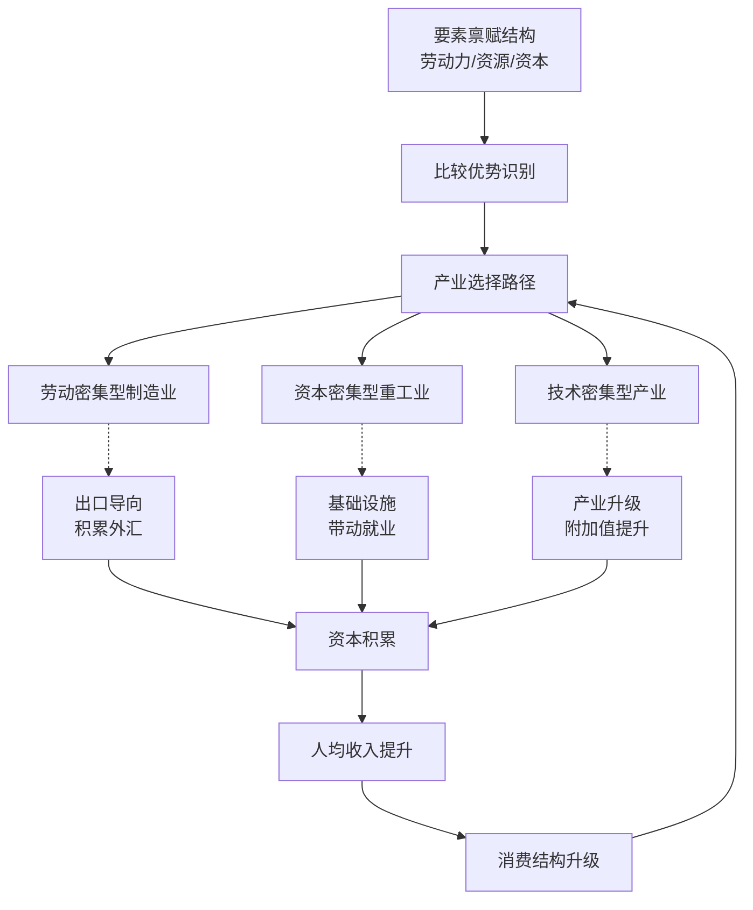
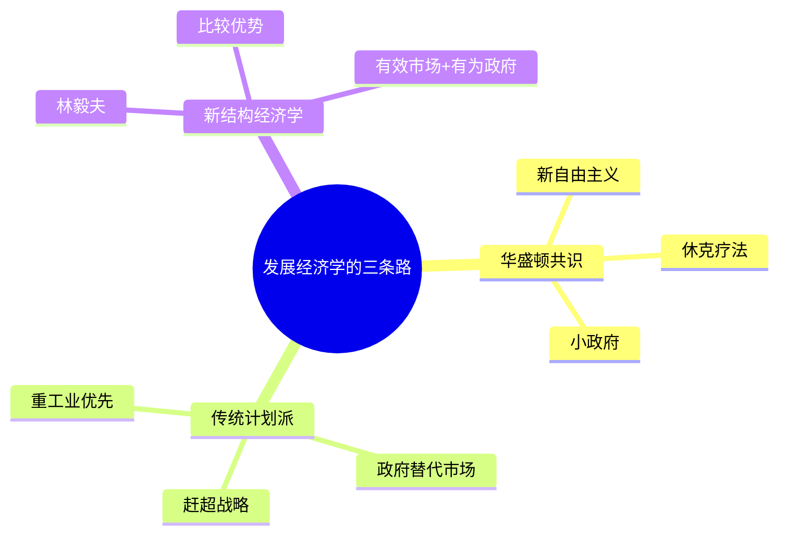

## 《解读中国经济》读书笔记
  
### 作者  
digoal  
  
### 日期  
2026-05-27  
  
### 标签  
读书笔记 , 解读中国经济   
  
----  
  
## 背景  
   
---
书名: 《解读中国经济》   
作者: 林毅夫   
出版年份: 2018   
笔记日期: 2026-05-27   
豆瓣评分: 暂无评分   
标签: [经济学, 发展经济学, 新结构经济学, 林毅夫, 中国经济]   
来源: 网络搜索   
---
   
> **核心一句话**：中国经济增长的奇迹不是偶然，而是政府识别并利用比较优势、主动推动产业升级的必然结果。   
> **适合谁读**：对中国经济发展感兴趣的上班族、投资人、政策制定者，以及想理解"政府与市场关系"的学习者。   
> **阅读难度**：⭐⭐⭐☆☆（2-3星，有经济学基础更佳）   
> **推荐指数**：⭐⭐⭐⭐☆（4星，框架清晰，但部分数据偏旧）   
   
---

## 一、时代坐标：这本书从哪里来？

2018年，中美贸易摩擦骤然升温，中国经济站在了舆论的风口浪尖。"中国奇迹是否终结？""经济增速放缓还能维持多久？"——质疑声从华尔街蔓延到学术圈。

正是在这个节点，林毅夫出版了《解读中国经济》。他要做的事很明确：用系统的经济学框架，回答一个看似简单、实则复杂的问题——**中国凭什么增长？未来还能不能继续？**

林毅夫的底气来自他的学术经历。师从诺贝尔经济学奖得主西奥多·舒尔茨，2008-2012年任世界银行首席经济学家兼高级副总裁，亲历过几十个发展中国家的经济咨询工作。这些经历让他比大多数经济学家更有资格说："我见过很多失败，也见过一些成功。"

写这本书，他有一个更隐秘的动机：为"中国模式"提供学理支撑。不是为了宣传，而是为了争辩——在他看来，西方主流发展经济学对中国经验的忽视甚至误解，本身就是理论建构的缺陷。

---

## 二、核心命题：作者在说什么？

林毅夫在书中构建了"新结构经济学"的理论框架，核心命题可以概括为三个：

### 命题一：比较优势是中国增长的真正秘密

林毅夫认为，中国改革开放的成功，不是对西方模式的复制，而是对**自身要素禀赋**的精准识别和利用。

1978年，中国最大的禀赋是**廉价、充足的劳动力**。基于这个比较优势，政府引导资源流向劳动密集型制造业——纺织、玩具、电子组装——出口导向，快速积累外汇和资本。80年代看广东，90年代看长三角，都是这条逻辑的展开。

这不是市场自发选择的偶然，而是政府在识别比较优势后主动推动的结果。

### 命题二："有效市场+有为政府"是发展的双引擎

林毅夫是少数公开反对"小政府=好政府"教条的经济学家。他通过大量的跨国研究（包括世界银行的工作经历）发现：

- 完全依靠市场的国家（如拉美）经常陷入"资源诅咒"或产业固化；
- 完全依靠政府的国家（计划经济时代）效率低下；
- 真正成功的发展中国家，都有一个共同特征：**政府主动识别产业方向，提供基础设施弥补市场失灵**。

他的比喻是："新结构经济学不是要政府替代市场，而是要在市场看不清方向的时候，帮市场扫清障碍。"

### 命题三：结构转型还有空间，中国不会停滞

林毅夫对中国经济的判断与当时许多悲观论调相反。他认为：

- 中国制造业的升级（从低端向中端、再向高端）才刚开始；
- 服务业占比仍然偏低，扩张空间巨大；
- 城镇化率约60%（当时），离发达国家80-90%还有差距；
- 凭借后发优势，中国仍可维持20年6%以上的中速增长。

这些判断，如今看来有对有错，但逻辑框架值得认真对待。

---

## 三、论证地图：作者怎么说服你的？

林毅夫的论证有几个核心武器：

**数据说话**：他大量引用世界银行数据、东亚四小龙（台湾、韩国、新加坡、香港）的对比研究，以及中国省级面板数据。他的证据链是"跨国+跨期"的，不是一个孤立案例。

**案例解剖**：不只是宏观数据，他还拆解具体产业。比如苏州的电子产业园区、义乌的小商品市场、广东顺德的家电产业集群——每个案例都对应一个理论点。

**逻辑链条**：从"要素禀赋→比较优势→产业选择→政府行为→经济增长"，每个环节都有因果解释，而不是简单的相关陈述。

**但有一个显著弱点**：他的案例以成功为主。对失败案例——东北的振兴困境、鄂尔多斯的鬼城——着墨不多。这让论证显得有些"报喜不报忧"。

---

## 四、前提假设与边界：什么情况下这不成立？

林毅夫的框架依赖几个关键假设，**这些假设在2018年后正在经受考验**：

### 假设一：后发优势依然存在
**假设内容**：中国可以继续通过引进、消化、吸收发达国家技术，实现快速追赶。
**今天还成立吗？**：**越来越不成立。** 2018年后，美国对华实施芯片禁令，技术封锁加剧。"卡脖子"问题让后发优势的逻辑断裂——不是所有技术都能引进，也不是引进后就能消化。

### 假设二：政府识别比较优势的能力是可靠的
**假设内容**：政府能够准确判断哪些产业符合比较优势，不会被利益集团绑架。
**今天还成立吗？**：**存在疑问。** 电动车、光伏等产业的补贴中，出现了明显的产能过剩和资源浪费。政府识别能力并非无穷大。

### 假设三：市场是资源配置的基础
**假设内容**：资源配置最终依赖市场机制，政府只是补充。
**今天还成立吗？**：**在中国语境下更复杂。** 国企在银行信贷、要素市场中的主导地位，让"有效市场"的前提打了折扣。

**适用边界**：新结构经济学最适用于**工业化中期的发展中国家**——要素禀赋清晰、产业方向相对明确、政府能力较强。对于已经高度发达或制度严重扭曲的经济体，框架的解释力下降。

---

## 五、思想谱系：这本书在哪个传统里？

林毅夫的新结构经济学，是发展经济学家族里的**第三势力**：

**与第一代发展经济学的区别**：早期发展经济学（如张培刚的工业化理论）强调"重工业优先"，新结构经济学则认为应该"遵循比较优势"。
**与华盛顿共识的区别**：华盛顿共识相信市场万能，政府越小越好；林毅夫认为发展中国家市场失灵更严重，需要政府补位。
**与林毅夫老师舒尔茨的关系**：一脉相承于舒尔茨的人力资本和农业经济思想，但将视野从微观扩展到了产业结构和政府角色。

**同代对话**：他与提出"北京共识"的乔舒亚·库珀·拉姆有共鸣，但林毅夫更强调经济学学理而非政治模式。

**对后来的影响**：非洲多国（埃塞俄比亚、卢旺达）借鉴新结构经济学框架制定产业政策，成为实践案例。

---

## 六、我学到了什么？

读这本书，我最大的三个收获：

**① 比较优势不只是静态概念，它是动态演进的**

以前我理解的比较优势是："你有资源优势，你就做资源型产业。"林毅夫让我看到，**比较优势是可以主动创造的**——通过教育提升人力资本，通过基础设施降低物流成本，通过制度优化改善营商环境——每一步都在改变禀赋结构，打开新的产业空间。

这个认知改变了我对"产业升级"的理解：不是政府拍脑袋选几个"新兴产业"，而是系统性地改变比较优势的约束条件。

**② "有为政府"不是口号，而是需要制度的约束**

这本书让我重新思考政府与市场的边界。我以前倾向于"市场万能、政府少管"。但林毅夫指出，市场在**识别方向**上存在系统性失灵——企业看不清长期方向，政府可以提供基础设施和信息。

但问题来了：谁来约束政府，让他做正确的事而不是被利益集团绑架？书里对这点讨论不足，但值得每个读者追问。

**③ 框架比结论更重要——经济分析需要"结构思维"**

最有价值的是林毅夫提供的分析框架：**从要素禀赋出发，识别比较优势，推导产业选择，判断政府角色**。这个框架不只适用于国家，也适用于地区、企业、甚至个人职业规划。

---

## 七、举一反三：这个框架还能用在哪？

**比较优势 + 城市竞争 = 地方政府的产业定位**

每个城市都有自己的要素禀赋：劳动力成本、土地价格、交通枢纽、科研资源。政府应该识别本地的比较优势，而不是盲目复制其他城市的产业政策。合肥押注科技创新、重庆发展制造业集群——都是比较优势思维在区域经济中的应用。

**比较优势 + 职业规划 = 个人发展的路径选择**

对于个人来说，职业发展的比较优势思维是：**找到你相对于同龄人的独特禀赋**（专业背景、人脉资源、地理位置），然后在这个方向上持续积累。不是追热点，而是把自己的长板发挥到极致。

**比较优势 + 投资决策 = 识别经济体的真实增长极**

投资股票或房产，本质上是押注某个地区或行业的未来增长。比较优势框架可以帮助你问对问题：这个地区的要素禀赋是什么？政府在做正确的产业选择吗？基础设施是否到位？这比单纯看GDP增速更有信息量。

---

## 八、批判与反思

**我不认同"政府主导产业选择总是有效的"**

林毅夫预设政府有识别比较优势的能力，并且能够超越部门利益。但在现实中，这个假设常常落空。光伏产业补贴的产能过剩、芯片大基金的投资腐败、部分地方政府的"形象工程"——都说明政府并不是一个统一的、理性的行动者，而是多元利益的博弈场。新结构经济学的"有为政府"需要更细致的制度设计来保驾护航，而不能只是理论上的假设。

**2018年后的外部环境变化让部分结论失效**

林毅夫对中国维持中高速增长的乐观预测，建立在一个关键假设上：技术引进顺畅，后发优势持续。2018年以来的中美摩擦表明，这个条件已经不再是理所当然。中国的技术追赶路径正在被迫改变，新结构经济学框架需要加入"开放条件下的技术安全"维度。

**这本书的读者定位有些模糊**

是为普通读者写的通俗书，还是为政策制定者写的学术著作？从语言风格和内容深度看，更接近前者，但涉及经济学专业术语时又没有充分解释。比如"要素禀赋"在第一章就出现了，但直到第三章才真正展开。这让没有经济学基础的读者读起来会有跳跃感。

---

## 九、金句与记忆点

1. **"中国经济增长的奇迹不是偶然，而是比较优势与政府主动作为的必然结果。"**
   林毅夫用这句话反驳了两种极端：一种是认为中国增长全靠运气，另一种是认为中国模式可以复制到所有发展中国家。

2. **"有效市场+有为政府，不是非此即彼，而是相互补位。"**
   他用这个框架挑战了西方主流经济学中"小政府=好政府"的教条，强调发展中国家市场失灵更严重，需要政府更多作为。

3. **"后发优势的关键不是引进技术，而是消化、吸收、再创新的能力。"**
   这句话在今天芯片禁令的背景下尤为重要——引进的渠道受阻，后发优势的前提正在改变。

4. **"产业政策不是补贴竞争，而是基础设施和信息的竞争。"**
   他把产业政策的本质重新定义为"降低企业交易成本"，而不是直接给钱——这个重新定义更有说服力。

5. **"比较优势是可以创造的。"**
   教育、基础设施、制度环境——这些都可以改变禀赋结构，打开新的产业空间。这是对传统比较优势理论的重要拓展。

6. **"经济增长的本质是结构转型，不是单纯的GDP数字。"**
   从农业社会到工业社会到服务业社会，每一次结构转型都带来生产率的跃升——这个观点帮助我理解为什么经济增长不只是增速问题，而是转型问题。

---

## 十、延伸阅读

1. **《从西潮到东风》——林毅夫（世行时期思想总结）**
   这本书是林毅夫在世行工作期间的论文合集，更学术化，适合想深入了解新结构经济学学理基础的读者。

2. **《中国经济专题讲座》——温铁军（争议性视角）**
   温铁军从农村改革和危机应对角度解读中国经济增长，与林毅夫形成有趣的对比——一个强调比较优势，一个强调危机倒逼。两者结合看更完整。

3. **《房间里的大象》——伊维·科斯（How to Be an Economist）**
   这本书用通俗语言拆解经济学的思维方式，适合没有经济学背景但想理解经济分析逻辑的读者。

---

*笔记写于 2026-05-27 | 基于公开资料与深度思考整理*  
  
  
#### [PostgreSQL 解决方案集合](../201706/20170601_02.md "40cff096e9ed7122c512b35d8561d9c8")
  
  
#### [德哥 / digoal's Github - 公益是一辈子的事.](https://github.com/digoal/blog/blob/master/README.md "22709685feb7cab07d30f30387f0a9ae")
  
  
#### [About 德哥](https://github.com/digoal/blog/blob/master/me/readme.md "a37735981e7704886ffd590565582dd0")
  
  

  
