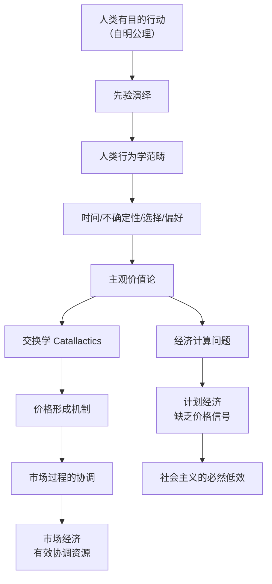
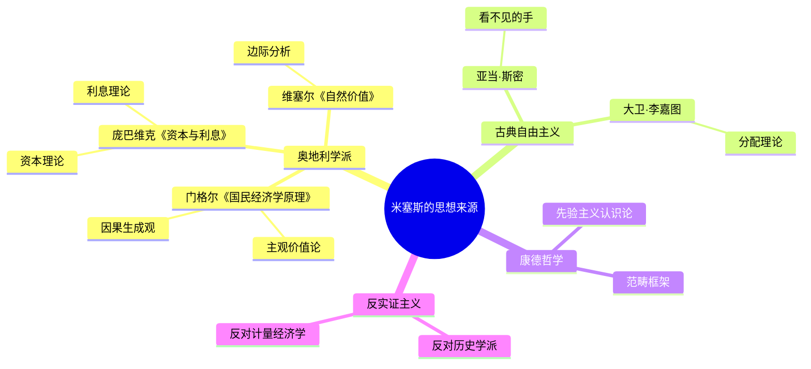

## 《人的行动》读书笔记
  
### 作者  
digoal  
  
### 日期  
2026-05-27  
  
### 标签  
读书笔记 , 人的行动   
  
----  
  
## 背景  
   
---
书名: 《人的行动》   
作者: 路德维希·冯·米塞斯   
出版年份: 1949（中文译本2013）   
笔记日期: 2026-05-27   
豆瓣评分: 9.3（1000+人评价）   
标签: [经济学, 奥地利学派, 人类行为学, 市场经济, 自由主义, 米塞斯]   
来源: 网络搜索   
---
   
> **核心一句话**：经济学不是来自统计数据，而是来自对人类有目的行动这一自明事实的逻辑演绎——市场经济是最理性的经济体制，因为它让价格传递信息，让无数分散的个体决策得以协调。   
> **适合谁读**：经济学爱好者、哲学背景读者、对自由市场理论有兴趣的学习者，以及想理解奥派经济学方法论的人。   
> **阅读难度**：⭐⭐⭐⭐☆（4星，米塞斯行文晦涩，需要反复咀嚼）   
> **推荐指数**：⭐⭐⭐⭐⭐（5星，20世纪最重要的经济学著作之一）   
   
---

## 一、时代坐标：这本书从哪里来？

1949年，冷战刚刚开始，世界的意识形态阵营正在剧烈重组。西方自由世界与苏联计划经济在制度竞争的高峰期对撞——一边是马歇尔计划带来的欧洲重建，一边是苏联计划经济的快速工业化。

正是在这个节点，路德维希·冯·米塞斯完成了《人的行动》。此时他已68岁，流亡美国多年，在纽约大学任教。这本书是他一生学术思想的集大成，也是对奥地利学派半个世纪发展的系统化总结。

写作背景有两个不可忽视的语境：

**第一，与数学经济学的对抗。** 20世纪初，实证主义和方法论之争在经济学界愈演愈烈。计量经济学正在兴起，用数学模型描述经济现象成为主流。米塞斯认为这是对经济学本质的根本性误解——经济学研究的是人类有目的的行动，不能被化约为数字。

**第二，对社会主义的计划经济的系统批判。** 1920年代，米塞斯发表《社会主义国家的经济计算》，论证没有私有财产和价格信号，社会主义无法进行合理经济计算。这篇论文引发了一场持续数十年的论战。《人的行动》是对这场论战的最终回答。

米塞斯写作这本书，不是为了辩论，而是为了建立一个全新的社会科学方法论——他称之为"人类行为学"(Praxeology)。

---

## 二、核心命题：作者在说什么？

米塞斯的《人的行动》围绕三个核心命题展开：

### 命题一：人类行为学是经济学的真正根基

米塞斯的起点不是假设，不是数据，而是一个**不可反驳的自明事实**：人类总是通过选择手段去追求目标。

这就是"人类行动公理"——"人行动"（Man Acts）。从这一公理出发，米塞斯进行纯逻辑演绎：既然人行动，就必须花费时间；既然要选择，就必须放弃其他选项（机会成本）；既然有目的，就涉及不确定性……

一套严密的范畴体系由此展开：时间、不确定性、因果关系、目的-手段推理、偏好、选择——这些不是从观察中归纳出来的，而是从行动公理本身先天推导出来的。

米塞斯称这种方法为**先验主义**。他说："经济学真理不是从经验中得出的，它们是先验的，像逻辑和数学一样不可证伪。"

这与当时正在流行的实证主义经济学（用数据验证假设）形成了根本性的方法论对立。

### 命题二：市场经济是唯一理性的经济体制

米塞斯用完整的论证链条支持这个命题：

1. **问题**：无数分散的个体，每个都有自己的知识和偏好，社会如何协调？
2. **答案**：价格体系。价格不只是货币数字，而是**信息的载体**——它汇总了千万个参与者的供求信息，以一个简单的数字传递给每个人。
3. **结论**：只有以私有财产为基础的市场经济，才能形成真实的价格信号，才能实现资源的有效配置。

这就是著名的**经济计算论证**（Economic Calculation Argument）。米塞斯用它来回答：为什么计划经济从根本上就是低效的？

不是因为管理者不够聪明，不是因为技术不够先进，而是因为**他们没有价格信号**，无法进行真正的成本-收益计算。

### 命题三：社会主义必然失败（最具争议的命题）

这是《人的行动》中最锋利的剑，也是引发最多批评的论点。

米塞斯的论证是：社会主义没有私有财产，就没有市场价格信号；没有价格信号，就无法进行经济计算；无法计算，就只能靠" trial and error"（试错），最后必然走向混乱和崩溃。

他承认社会主义可以在一定时期内实现快速的工业化（如苏联1930年代），但这只是因为它可以集中资源做"简单的事情"（比如修铁路、建钢厂）。一旦经济复杂度上升，决策的信息需求超过中央机构的处理能力，效率损失就会显现。

这个命题后来被哈耶克在"知识分工"理论中进一步发展，成为奥派反对计划经济的理论标志。

---

## 三、论证地图：作者怎么说服你的？

米塞斯的论证有几个核心武器：

**先验演绎**：从自明公理出发，用纯逻辑推导，不需要任何实证数据。他的论证方式是几何学式的——设定公理，推演定理，结论必然为真。

**范畴分析**：他把经济学的基本概念拆解得非常细——"行动"与"行为"的区别、"不确定性"与"风险"的区别、 "选择"与"偏好"的关系——每一个概念都经过严密的哲学审查。

**经济计算论证**：这是全书最有力的论证。价格不仅是货币表达，它是信息的编码器。计划经济的问题不是"政府不够聪明"，而是"信息根本无法被集中收集和处理"。

**但有一个方法论弱点**：米塞斯对数学经济学的完全排斥显得有些教条。他把数学方法等同于实证主义，但实际上数学作为工具本身不一定导致方法论错误。后来的奥派经济学家（如罗斯巴德）也承认数学可以作为表达工具。

---

## 四、前提假设与边界：什么情况下这不成立？

米塞斯的整个理论体系依赖于几个关键假设，**这些假设在今天正在经受挑战**：

### 假设一：价格体系是信息传递的唯一有效机制
**假设内容**：只有市场价格才能有效汇总和传递分散的知识与偏好。
**今天还成立吗？**：**部分成立，但正在被稀释。** 互联网和算法推荐已经在特定领域（如信息搜索、商品推荐）实现了高效的信息聚合。区块链和去中心化技术也在探索"去价格信号的知识协调"。米塞斯时代的"唯一"可能需要更新为"主要"。

### 假设二：人类行为学的方法论个人主义是完整的分析框架
**假设内容**：宏观经济现象可以从个体行动完全推导出来，不需要独立的宏观经济学。
**今天还成立吗？**：**存在争议。** 现代宏观经济学（从凯恩斯到货币主义到真实商业周期理论）表明，有些宏观经济现象（如流动性陷阱、系统性金融危机）有其自身的动力学，不能简单还原为个体行为的总和。

### 假设三：社会主义计划经济必然失败
**假设内容**：没有价格信号的中央计划，无法进行有效的经济计算。
**今天还成立吗？**：**需要细化。** 苏联东欧的失败基本验证了米塞斯的预言。但中国的"社会主义市场经济"提供了一种混合形态——保留市场机制的同时保持大量国企。效果如何，学界仍有争议。

**适用边界**：人类行为学的方法论框架有更广泛的适用性，但具体的价格理论和市场经济论证，需要根据数字时代的新情况进行修正。

---

## 五、思想谱系：这本书在哪个传统里？

**与经济学主流的关系**：
- 反对凯恩斯的宏观总量分析（认为宏观经济现象应从个体行动推导）
- 反对芝加哥学派的实证主义方法论（坚持先验演绎）
- 与哈耶克关系密切，但哈耶克更强调"知识分工"和"自发秩序"，方法论上也有细微差别

**对后世的影响**：
- 罗斯巴德：继承并发展了米塞斯的自由主义理论，写作《自由的伦理》
- 罗伯特·墨菲：普及奥派经济学的畅销书作家
- 乔治·梅森大学（GMU）：成为当代奥派经济学的研究中心
- 比特币社区：许多比特币信仰者援引米塞斯的价格理论作为去中心化货币的理论依据

---

## 六、我学到了什么？

读这本书，我最大的三个收获：

**① 方法论个人主义不只是学术立场，它是理解世界的方式**

米塞斯让我重新理解什么是"解释"。要理解房价上涨，不是去找"什么宏观因素推动"，而是问：谁在买？谁在卖？他们的激励是什么？信息如何传递？这种视角让我在做任何分析时都下意识地追问："参与者的行动逻辑是什么？"而不只是接受表面的相关性。

**② 先验主义不是教条，而是思考工具**

米塞斯说经济学真理是"先验的"，我一开始觉得这是过度自信。但读进去后，我理解了他的核心洞见：某些逻辑关系是必然的，不依赖经验观察——比如"如果我选择A而不选B，那一定是因为我主观上更偏好A"。这个分析框架帮助我识别经济报道中的逻辑错误：很多人把相关性当成因果，把短期趋势外推为长期规律。

**③ 价格不只是数字，它传递的是关于这个世界的信息**

最有冲击力的一个洞见：价格不是中性的财富分配工具，而是**信息的载体**。一片降雪导致蔬菜价格上涨，不是因为"奸商"在哄抬，而是价格系统在说："有人需要这个，有人供应不足，快去调整！"计划经济的问题不是道德问题，而是信息问题——没有价格信号，系统无法自我调整。

---

## 七、举一反三：这个框架还能用在哪？

**价格信号 + 职场竞争 = 工资是对你创造价值的客观评价**

如果你在某个公司工资长期低于市场水平，可能不是因为老板"坏"，而是因为价格信号（你的工资）告诉你：你创造的价值没有被充分认可。解决方案不是抱怨，而是提升不可替代性，或者换到更能兑现你价值的市场。

**先验主义 + 分析复杂问题 = 先厘清概念，再找数据**

遇到复杂问题时，先问：我的概念定义清楚了吗？"增长"和"发展"是同一件事吗？"公平"和"效率"真的是对立的吗？先把逻辑框架搭对，数据才能发挥作用。很多政策讨论的问题，不是数据不够，而是基本概念混乱。

**方法论个人主义 + 理解社会现象 = 从参与者激励出发**

要理解一个社会现象（比如内卷、考公热、炒鞋），不问"大家都怎么了"，而问"每个人的激励是什么？信息如何传递？谁获益谁受损？"这个方法论让我对任何"集体现象"都保持一份警觉——没有无缘无故的行为，只有还没被理解的结构。

---

## 八、批判与反思

**先验主义过度自信，排斥了有价值的经验研究**

米塞斯认为经济学真理可以从纯粹推理中获得，经验数据对验证理论毫无意义。这个立场在逻辑上很有力量，但在实践中显得过于教条。没有数据支撑的理论，即使逻辑严密，也可能遗漏重要的现实因素。比如"信息不对称"理论（阿克洛夫等）完全是经验发现的，它不能用先验推理推导出来，但对经济学贡献巨大。

**对社会主义的批判有时过于绝对**

"社会主义必然失败"的论断，在面对中国改革开放的混合经济实验时，显得需要修正。中国的经验表明，计划经济与市场经济不是非此即彼，而是一个连续谱上的不同配比。苏联东欧的失败是真实的，但这并不等于所有形式的政府干预都无法运作。米塞斯的批判对"全面计划经济"是准确的，但他的语气有时让人觉得任何政府角色都是危险的。

**这本书的翻译质量影响可读性**

2013年的中文译本（余晖译）有些地方翻译腔较重，读起来需要反复对照原文理解。如果读英文原版会更流畅，但原版是1949年的学术英语，对现代读者也有挑战。这本书适合反复读，每一遍都有新收获。

---

## 九、金句与记忆点

1. **"人行动。"（Man Acts）**
   这是人类行为学的起点公理，不可证伪。米塞斯从这一句话推导出整个经济学范畴体系——时间、不确定性、选择、偏好……所有的经济学真理都蕴含在这个公理之中。

2. **"价格是信息的载体，不是财富的转移。"**
   这个洞见让我重新理解通货膨胀：当货币供给增加，价格上涨，这不是简单的"物价变贵"，而是价格系统在传递"货币相对商品贬值了"这个信息。通货膨胀本质上是信息失真。

3. **"社会主义的问题不是缺乏足够的智慧，而是缺乏价格信号。"**
   中央计划者再聪明，也无法处理千百万个分散个体的供求信息。米塞斯说，这不是道德问题，也不是能力问题，而是信息问题——信息的聚合和传递，需要价格机制。

4. **"经济学不是研究'应该做什么'，而是研究'是什么'。"**
   他坚持经济学的规范性（prescriptive）和描述性（descriptive）之分：经济学描述人类行动的真实规律，不是告诉人们应该怎么行动。这个立场贯穿全书。

5. **"市场过程不是结果的总和，而是无数个体决策的互动。"**
   市场不只是个静态的"配置资源的场所"，而是一个动态的过程——价格信号激发行动，行动改变价格，新的信号再次激发行动。这个过程永不停歇，永远在趋向均衡但永远不完全达到均衡。

6. **"人类行为学的真理像逻辑和数学一样是先验的。"**
   米塞斯不认为经济学需要实验或数据验证。经济学的公理来自对行动本质的反思，它们的真理性如同"整体大于部分"一样自明。

7. **"自由市场不是基于道德或公正，而是基于效率——它是唯一能够协调分散知识的制度。"**
   米塞斯为自由市场辩护，但他不是从道德角度，而是从信息处理能力角度。这让他的论证比一般自由主义更有学理力量。

---

## 十、延伸阅读

1. **《通往奴役之路》——弗里德里希·哈耶克**
   哈耶克是米塞斯最亲近的奥派同人，但这本书更通俗，适合作为《人的行动》的入门读物。哈耶克在"知识分工"和"自发秩序"上的发展，补充了米塞斯的论证。

2. **《自由的伦理》——穆瑞·罗斯巴德**
   罗斯巴德是米塞斯最忠实的弟子，他把米塞斯的经济学框架发展到政治哲学层面，建立了完整的自由至上主义伦理体系。适合想深入奥派自由主义哲学的读者。

3. **《认识论》——大卫·休谟**
   米塞斯的先验主义方法论来自康德，而康德对先验知识的论证又来自休谟对归纳法的批判。理解休谟，是理解米塞斯方法论哲学背景的最佳路径。

---

*笔记写于 2026-05-27 | 基于公开资料与深度思考整理*  
  
  
#### [PostgreSQL 解决方案集合](../201706/20170601_02.md "40cff096e9ed7122c512b35d8561d9c8")
  
  
#### [德哥 / digoal's Github - 公益是一辈子的事.](https://github.com/digoal/blog/blob/master/README.md "22709685feb7cab07d30f30387f0a9ae")
  
  
#### [About 德哥](https://github.com/digoal/blog/blob/master/me/readme.md "a37735981e7704886ffd590565582dd0")
  
  

  
