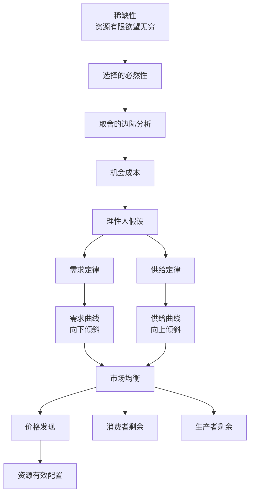
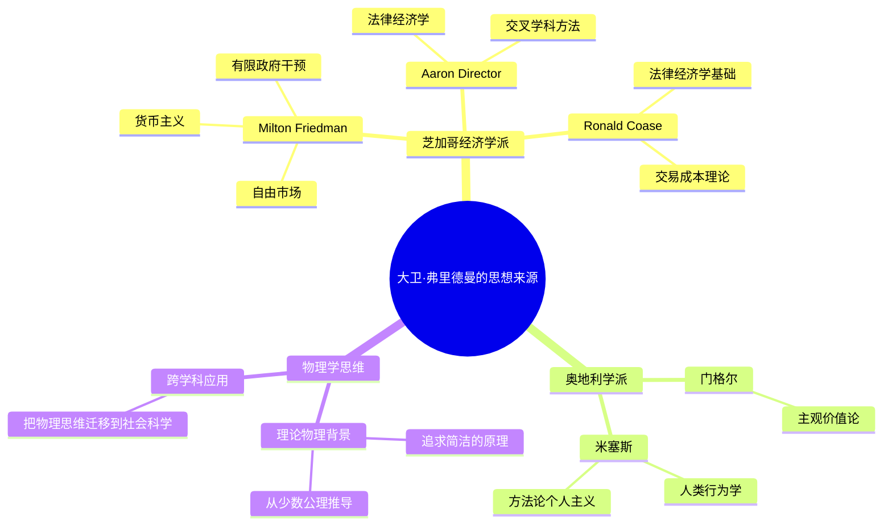

## 《价格理论》读书笔记
  
### 作者  
digoal  
  
### 日期  
2026-05-27  
  
### 标签  
读书笔记 , 价格理论   
  
----  
  
## 背景  
   
---
书名: 《价格理论》   
作者: 大卫·D. 弗里德曼   
出版年份: 1986（第三版中译2024）   
笔记日期: 2026-05-27   
豆瓣评分: 暂无评分（新书）   
标签: [经济学, 价格理论, 微观经济学, 芝加哥学派, 大卫·弗里德曼, 边际分析]   
来源: 网络搜索   
---
   
> **核心一句话**：价格理论不只是一门学科的语言，它是理解任何有交换行为的人类活动的透镜——从市场定价到法律判决，从道德选择到日常决策，边际分析无处不在。   
> **适合谁读**：经济学入门者、想建立"经济学思维"的非经济学专业读者、已学过标准经济学但想加深理解的人。   
> **阅读难度**：⭐⭐⭐☆☆（2-3星，文字通俗但概念密集，需要反复咀嚼）   
> **推荐指数**：⭐⭐⭐⭐⭐（5星，MIT等名校推荐读物，最不像教材的教材）   
   
---

## 一、时代坐标：这本书从哪里来？

1986年，大卫·D. 弗里德曼出了一本奇怪的书。

他不是经济学家——他从哈佛物理化学本科、芝加哥理论物理博士，从未正式修过任何经济学课程。但他写了一本价格理论教材，被MIT、斯坦福等名校采用，成为全球最受欢迎的中级微观经济学读物之一。

为什么一个物理学家能写出最好的经济学教材？因为他觉得现有教材"教的是结论，不是思维方式"。

1980年代的芝加哥学派正在高峰，数学化浪潮席卷经济学教育。弗里德曼观察到：学生们记住了供求曲线的形状，却不知道怎么用供求曲线分析一个真实案例——比如，为什么旧金山房租高企？为什么最低工资法可能伤害低技能工人？为什么垄断厂商不总是涨价？

他决定写一本不同的书：不只是教"经济学是什么"，而是教"怎样像经济学家一样思考"。

2024年第三版中译本出版，新增了数字市场、行为经济学等当代议题，但核心框架未变——这是跨越近40年仍然有效的经济学入门读物。

---

## 二、核心命题：作者在说什么？

### 命题一：价格理论是理解任何交换行为的透镜

弗里德曼在书中反复强调一个观点：价格理论不是"经济学家的专业工具"，而是**一套分析人类行为的通用语言**。

任何时候，只要有两个人交换东西（商品、服务、承诺、甚至是情感），就涉及稀缺性、选择和边际决策。价格理论就是用来分析这种交换的结构和逻辑的。

他用这个框架分析了远超经济学范围的议题：
- 合同法为什么这样设计？（违约成本 vs 执行成本）
- 专利制度保护的是发明者还是公众利益？
- 城市为什么会有贫民窟？

弗里德曼的核心洞见：**不是因为经济学家懂法律，而是因为法律本质上是一套激励机制，价格理论正好是分析激励的工具。**

### 命题二：边际分析是理解人类行为的钥匙

弗里德曼用大量的篇幅讲"边际"这个概念——不是因为它难，而是因为它太重要。

Standard 经济学教材把"边际"当作一个技术术语引入，然后让学生死记硬背。弗里德曼的讲法完全不同：他说，边际就是"下一单位"——你消费的下一口冰淇淋、你雇用的下一个工人、你投入的下一小时时间。

最有力量的洞见是：**人类行为不是由"平均"决定的，而是由"边际"决定的。**

举例：一个人说"我买不起劳斯莱斯"——这不是因为他的平均收入低，而是因为他消费的边际决策已经把钱花在了其他地方。价格通过影响边际决策，影响了整体行为模式。

### 命题三：经济学思维比经济学结论更重要

这本书最独特的地方是：弗里德曼很少直接告诉你"结论是什么"。他更常说的是"**如果你这样假设，会得到什么结果；如果你改变假设，结论会怎么变化。**"

他希望读者读完书后，不是记住了"完全竞争市场的效率"，而是能够自己问出：完全竞争市场的假设是什么？这些假设在现实中成立吗？如果不成立，会发生什么？

这是弗里德曼教给读者最重要的能力：**主动质疑假设，而不是被动接受结论。**

---

## 三、论证地图：作者怎么说服你的？

弗里德曼的论证有几个鲜明特点：

**案例驱动，不是模型驱动**：他几乎不用数学推导，每一个概念都从现实案例出发。比如讲"机会成本"，他不说"机会成本是指……"，而是讲一个故事：你在自己的土地上建房子，你没有付地租，所以你误以为这个选择是"免费的"——但其实这块土地如果租出去可以每年得到10万，这10万就是你的机会成本。

**反直觉思考**：他经常从反直觉的角度切入，逼迫读者重新思考"常识"。比如"为什么同一条街上紧邻的两家加油站，价格几乎一样？"——不是"因为它们串谋"，而是因为如果一家涨价，消费者会流向邻居，所以价格会趋向一致。这个解释比"阴谋论"更复杂，但也更接近真实。

**博弈论早于主流教材引入**：1986年的书里已经有相当完整的博弈论基础（纳什均衡、囚徒困境），并用来分析寡头竞争。这是弗里德曼超前的又一个例证。

**弱点**：作为中级教材，有些论证的深度有限。比如外部性一章，信息不对称章节的处理都偏浅，不适合研究生级别的需求。

---

## 四、前提假设与边界：什么情况下这不成立？

### 假设一：人是理性的，会在边际上做最优选择
**假设内容**：面对给定价格，人们总是选择使自身效用最大化的数量。
**今天还成立吗？**：**部分成立，行为经济学已经证明很多情况下不是。** 现状偏误（status quo bias）、损失规避（loss aversion）、双曲贴现（hyperbolic discounting）——这些现象在"理性人假设"下无法解释。弗里德曼在第三版中应该已经加入行为经济学的讨论，但他的辩护是：即使行为不是完全理性的，价格理论仍然提供了最有用的分析框架——"近似正确"好过"精确错误"。

### 假设二：市场能有效传递信息
**假设内容**：价格能够准确反映供求信息，参与者能够正确解读价格信号。
**今天还成立吗？**：**存在信息不对称的市场中不成立。** 二手车市场（Akerlof的"柠檬问题"）是最典型的例子——买家无法判断质量，价格只能反映平均质量，导致高质量车退出市场。弗里德曼在书中有专章讨论，但他的结论（"信息不对称会导致市场缩小但不会消失"）在某些极端情况下可能过于乐观。

### 假设三：偏好的稳定性
**假设内容**：一个人的偏好是相对稳定的，不会在短期内被大幅改变。
**今天还成立吗？**：**越来越不成立。** 社交媒体和算法推荐正在系统性地塑造偏好——你的"口味"不完全是你自己的选择，而是平台优化的结果。这让"理性消费者"假设面临新的挑战。

**适用边界**：价格理论框架在分析**竞争性市场**时最有力量；在**市场失灵**的场景（垄断、信息不对称、外部性、公共品）中需要修正；在**跨文化比较**和**制度分析**中需要谨慎移植。

---

## 五、思想谱系：这本书在哪个传统里？

**与父亲米尔顿·弗里德曼的关系**：
- 继承了自由市场经济学的基本立场
- 但写法完全不同：米尔顿写《自由选择》，用通俗语言讲政策结论；大卫写《价格理论》，用案例和思考框架教经济学思维
- 大卫比父亲更"学术化"（他写的是教材而非政论），但也更跨界（法律、科幻、物理）

**与标准经济学教材的区别**：
- 斯坦范斯坦的《经济学原理》是"结论型"教材——教你供求曲线是什么、怎么画
- 弗里德曼的《价格理论》是"思维型"教材——教你供求曲线为什么是这样的，以及在什么情况下它不成立

---

## 六、我学到了什么？

**① "边际"不只是一个经济术语，它是理解任何决策的钥匙**

我以前以为"边际"是经济学家的技术术语。弗里德曼让我看到，"边际"其实是我们每天都在做的事：再加一件衣服会不会太热？再回复一封邮件会不会太晚？我们的每一个决定本质上都是边际决策。

理解边际，让我重新审视了很多日常问题：为什么加班到深夜的人不愿意停下来？不是因为工作不重要，而是因为在边际上，再工作一小时的收益（完成任务）仍然大于成本（时间和精力）——直到某个点，边际收益开始递减，再继续工作就亏了。

**② 机会成本是我用得最多的一个概念**

读完这本书，我最大的改变是：每次做选择时，我会下意识地追问："我放弃的是什么？这个放弃的东西值多少？"

不是因为这个习惯本身能让我做出"正确"的选择，而是因为它让我更诚实地面对取舍。很多时候我们说"这个选择没有成本"，实际上是因为我们没有把隐性成本算进去。

**③ 分析框架比结论更有价值**

弗里德曼整本书都在示范一件事：比记住结论更重要的是**知道结论是怎么来的，以及在什么前提下它才成立**。

这个习惯重塑了我读新闻的方式：每当看到一个政策建议（"最低工资法能保护工人"）、一个商业现象（"某平台降价抢占市场"），我都会先问：假设是什么？谁受益谁受损？这个政策/现象背后的激励机制是什么？

---

## 七、举一反三：这个框架还能用在哪？

**边际分析 + 时间管理 = 每天的精力投入决策**

每天醒来，你的"精力资本"是有限的。你面临的选择不是"今天要不要努力工作"，而是"在边际上，这一个小时用来工作/运动/社交，哪个给我最高的长期回报？"这个思维框架不能帮你做"正确"的选择，但它能帮你更诚实地面对取舍。

**机会成本 + 职业选择 = 理解"稳定工作"的真实成本**

"铁饭碗"的工作听起来没有风险，但实际上机会成本是：你把最宝贵的几年用在了可预见性高但学习曲线平缓的地方，而你放弃的是在更高增长机会中积累能力的可能性。工作稳定的真实成本往往被低估。

**博弈论 + 人际关系 = 理解"为什么朋友会背叛"**

囚徒困境告诉我们：即使双方都知道"合作是最好的结果"，但由于信息不对称和短期激励，有时候背叛是理性选择。这个框架帮助我理解：人际关系破裂往往不是因为"谁坏"，而是因为激励机制设计出了问题。

---

## 八、批判与反思

**对行为经济学的"招安"可能不够彻底**

弗里德曼在第三版中吸纳了行为经济学的讨论，但他的基本立场是：行为经济学发现的现象是有趣的，但它们不推翻价格理论的核心框架，因为即使不是完全理性的，人仍然在边际上做选择，只是选择的依据更复杂。

这个辩护有一定道理，但我不完全同意：行为经济学发现的一些系统性偏差（如双曲贴现）意味着人们的时间不一致性——今天的我和明天的我对同一件事有不同的偏好。这让"理性人假设"在跨期决策中面临根本性困难，而不只是"修正系数"的问题。

**法律经济学分析有时过于简化**

弗里德曼的法律经济学分析是全书最有洞见的部分之一，但他对某些法律制度的解读有时过于"经济学帝国主义"——用效率解释一切，而忽视了正义、公平等独立价值。一个例子：他对版权保护的分析，完全从激励创新的角度出发，但没有讨论版权期限对知识传播的阻碍。他会说"这是效率的权衡"，但很多人会认为这里有不能还原为效率的道德问题。

**这本书没有提供"快速查询"的便利**

作为教材，《价格理论》的组织方式不够模块化——你想查"什么是价格歧视"，得从头读起，不像曼昆的教材那样每个概念独立成节。这让这本书更适合从头到尾读一遍建立框架，而不适合当工具书查。

---

## 九、金句与记忆点

1. **"价格理论不是经济学家的专业工具，而是理解任何交换行为的透镜。"**
   弗里德曼用这句话重新定义了价格理论的边界：从商品市场到法律判决，从道德选择到日常互动，只要有交换，就有价格理论的用武之地。

2. **"人类行为不是由'平均'决定的，而是由'边际'决定的。"**
   这个洞见改变了我分析任何决策的方式：看总量没有意义，看边际才有意义——边际上的激励才是行为的真正驱动力。

3. **"机会成本是你放弃的东西的价值，而不是会计本上记录的数字。"**
   弗里德曼用这个机会成本的定义让我重新审视"免费"的含义——世上没有真正免费的选择，只是成本被隐藏了。

4. **"完全竞争市场的假设不是'市场应该是什么样的'，而是'市场在什么条件下会这样运作'。"**
   这个区分让他对"市场失灵"的讨论更精确：市场失灵不是因为市场"不够好"，而是因为假设不成立——我们需要的是在承认这一点的基础上改进，而不是简单地放弃市场。

5. **"博弈论不是经济学的'高级内容'，而是理解任何有多个参与者的情境的基础工具。"**
   弗里德曼早在1986年就把博弈论纳入中级教材，这个决定非常超前。他用囚徒困境解释寡头竞争，让学生看到：价格不只是供求关系，也是策略互动。

6. **"经济学家的工作不是告诉人们'应该做什么'，而是分析'如果做了什么，会发生什么'。"**
   这是弗里德曼对经济学角色的定位，也是他父亲米尔顿的核心遗产——实证经济学和规范经济学分开，分析和价值判断分开。这个立场在今天仍然值得坚守。

---

## 十、延伸阅读

1. **《经济学原理》——N. 格里高利·曼昆**
   标准经济学教材中最接近"通俗易懂"的，与弗里德曼的书形成互补：曼昆的教材更适合当工具书查，弗里德曼的书更适合建立思维框架。

2. **《法律经济学》——爱德华·C. 托夫曼 / 尼古拉斯·L. 乔治斯库**
   法律经济学领域的经典教材，弗里德曼的法律分析章节只是入门，真正的法律经济学需要更系统的学习。

3. **《魔鬼经济学》——史蒂芬·列维特 / 史蒂芬·都伯纳**
   用经济学思维分析真实世界的有趣案例，适合已经理解价格理论框架、想在日常生活中练习"像经济学家一样思考"的读者。

---

*笔记写于 2026-05-27 | 基于公开资料与深度思考整理*  
  
  
#### [PostgreSQL 解决方案集合](../201706/20170601_02.md "40cff096e9ed7122c512b35d8561d9c8")
  
  
#### [德哥 / digoal's Github - 公益是一辈子的事.](https://github.com/digoal/blog/blob/master/README.md "22709685feb7cab07d30f30387f0a9ae")
  
  
#### [About 德哥](https://github.com/digoal/blog/blob/master/me/readme.md "a37735981e7704886ffd590565582dd0")
  
  

  
