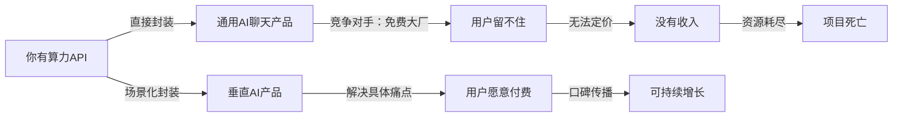
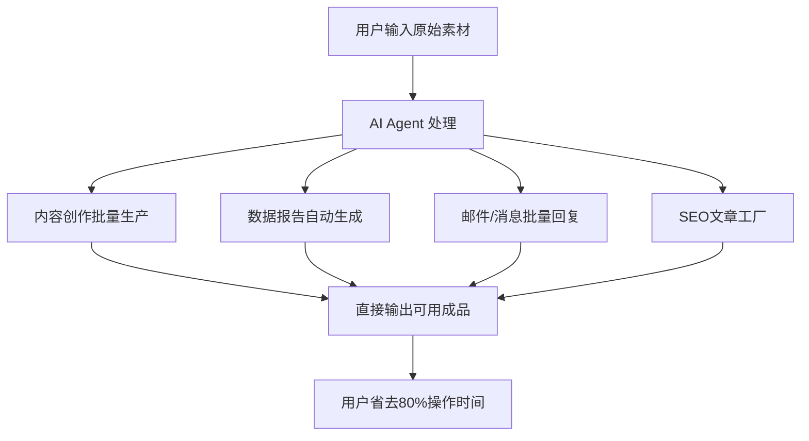

## Bug猎手报告第一次出击: 手握算力，为何还在迷茫？
  
### 作者  
digoal  
  
### 日期  
2026-05-28  
  
### 标签  
BUG 猎手 , 发现不合理现象 , 给出商业机会和模式 , 行动建议 , 手握算力 , 为何迷茫 
  
----  
  
## 背景  
   
大模型API资源产品化路径 · 找Bug & 找机会

---

## 🧨 先说最大的Bug

**你拥有算力资源，却不知道卖什么——这本身就是一个Bug。**

打眼一看哪里不对？

> "我有面粉，但我不想卖面粉，我想卖食物。"
> ——但你不知道做饺子、面包还是蛋糕，也不知道卖给谁。

**根本问题不是技术，而是：你缺少一个"场景"。**

算力/API本身是基础设施，它不能直接解决任何人的具体问题。  
产品的本质是：**把通用能力，封装进一个具体场景，让特定人群省时间/省钱/赚更多钱。**

---

## 🐛 Bug #1：把"我有模型"当成"我有产品"

### 表象：打眼一看哪里不对？

很多人手握大模型API，第一反应是做一个"AI对话工具"或"AI助手"——
结果和市面上几百个同类产品撞车，毫无差异，无法定价，无法留住用户。

### 根因拆解

```
为什么卖通用对话做不起来？（第一层）
→ 因为用户已有 ChatGPT、Claude、豆包等免费入口，凭什么付费用你的？

为什么没人阻止创业者这么做？（第二层）
→ 因为做通用对话是"最低阻力路径"——不用理解行业，技术上容易复制

为什么会一直失败还是有人做？（第三层）
→ 幸存者偏差：少数聚焦特定人群的"通用工具"活下来了，让后来者误以为赛道可行
```

**利益链条分析：**



### 💡 正确打开方式

**你卖的不是"模型调用"，你卖的是"某类人，在某个场景下，省掉的时间和痛苦"。**

---

## 🐛 Bug #2：以为做产品=做APP，忽视服务层价值

### 表象

2026年，技术门槛在降低，但服务门槛在提高。过去，能写代码就能创造很大价值；现在，真正有价值的是理解客户需求、设计正确的解决方案、确保它被正确部署和使用——这些需要深厚的服务能力，而不仅仅是技术能力。

### 根因

```
              ┌─────────────────────────────────┐
              │       Bug #2 根因鱼骨图          │
              └──────────────┬──────────────────┘
                             │ 产品卖不出去
          ┌──────────────────┼──────────────────┐
          │                  │                  │
      纯产品思维          无服务层             无垂直壁垒
          │                  │                  │
    以为上线即变现      用户不会用             容易被复制
          │                  │                  │
    没有入门教育        流失严重              定价竞争
```

### 解法矩阵

| 维度 | 解法 | 可行性 | 潜在商机 |
|------|------|--------|---------|
| 产品 | 聚焦1个垂直场景，做到该场景最好 | ⭐⭐⭐⭐ | 高 |
| 服务 | 提供实施+培训+定制，收服务费 | ⭐⭐⭐⭐ | 高 |
| 内容 | 围绕产品做教育内容，降低使用门槛 | ⭐⭐⭐ | 中 |
| 生态 | 接入现有工作流（钉钉/飞书/企微） | ⭐⭐⭐ | 中 |

---

## 🗺️ 你真正应该做的：5条产品化路径

根据2026年市场现状，手握算力API做产品，有以下5条清晰路径：

---

### 路径1：🎯 垂直行业 AI SaaS

**逻辑：** 2026年AI应用正从小范围测试转向规模化商业变现，软件应用的黄金时代正在开启。

**做法：** 选一个你熟悉的行业，把模型能力嵌入该行业的核心工作流。

**最佳候选赛道（按难度排序）：**

```
🟢 较易切入（个人/小团队可做）
├── 法律文书起草助手（合同审核、诉状生成）
├── 跨境电商 AI 客服 + 多语言商品描述
├── 医美咨询话术 + 客户跟进自动化
├── 教培行业 AI 出题 + 错题分析
└── 招聘JD撰写 + 简历筛选助手

🟡 中等门槛（需要行业资源）
├── 建筑/工程设计文档自动化
├── 财税咨询问答机器人（对接财税从业者）
└── 制造业质检报告生成

🔴 高门槛（有资源才做）
├── 医疗辅助诊断（合规成本高）
└── 金融投研报告生成（监管风险）
```

**变现方式：** 订阅制（月/年付）、按座位数收费

---

### 路径2：🤖 AI Agent 自动化工具

**逻辑：** 真正的挑战在于能否成为AI调用的基础设施层，能否将自身产品转化为智能体时代的标准化能力模块。

**做法：** 围绕高频重复性工作，做自动化流水线。

**典型产品形态：**



**最直接的切入点：**
- **自媒体内容工厂**：给MCN机构批量生产脚本/文案，按篇收费
- **企业内容工厂**：帮企业批量产出社媒内容、产品说明、培训材料

**变现方式：** 按输出量付费、包月不限量

---

### 路径3：🧩 行业专属 AI 助手（私有化/企业版）

**逻辑：** 企业不想用公共产品泄露数据，愿意为"私有部署"买单。

**做法：** 用你的算力，帮企业部署一个专属于他们的AI助手，做微调/RAG知识库接入。

**产品分层：**

```
┌─────────────────────────────────────┐
│  基础版（共享算力 + 自定义知识库）    │ ← 月付，入门客户
├─────────────────────────────────────┤
│  专业版（独占算力 + 私有化部署）      │ ← 年付，中型企业
├─────────────────────────────────────┤
│  企业版（本地化 + 数据隔离 + 定制）   │ ← 项目制，大客户
└─────────────────────────────────────┘
```

**变现方式：** 部署费 + 年维护费（复购率高，客单价大）

---

### 路径4：📦 AI 赋能的数字产品

**逻辑：** 不做工具，做"结果"。用户买的不是AI，是AI产出的内容本身。

**典型案例：**

| 产品 | 用户买什么 | 定价逻辑 |
|------|-----------|---------|
| AI个人传记 | 一本关于自己的电子书 | 单次付费 ￥299-999 |
| AI行业分析报告 | 一份特定赛道的研究报告 | 订阅制或单份售卖 |
| AI儿童故事定制 | 孩子专属故事集 | 单本付费/月订阅 |
| AI爆款文案生成器 | 经过打磨的小红书/抖音文案 | 按条数/按月付费 |

**变现方式：** 单次付费、订阅制、礼品卡（送人场景）

---

### 路径5：🔧 开发者工具 / API中间层

**逻辑：** 做开发者的"增强层"——提供比原始API更好用的能力组合。

**具体方向：**
- **Prompt 工程服务**：帮企业调优提示词，提高输出质量，收咨询费
- **模型路由层**：根据任务类型自动选最优模型，降低客户成本
- **AI测试评估工具**：帮企业评估AI输出质量，做QA工具
- **行业专属Fine-tune**：用客户数据微调，交付更准确的专属模型

**变现方式：** API调用分成、项目制、SaaS订阅

---

## 🎯 优先级矩阵（选哪条路？）

```
影响力高
    │
    │    路径3(企业私有化)      路径1(垂直SaaS)
    │         ●                    ●
    │
    │    路径5(开发者工具)      路径2(Agent自动化)
    │         ●                    ●
    │
    │              路径4(数字产品)
    │                   ●
    │
    └────────────────────────────────── 可行性高
    低                                  高
```

**推荐起步顺序：**

1. **第一步（0-3个月）**：路径4或路径2 → 快速验证，低成本，快速有收入
2. **第二步（3-12个月）**：路径1 → 找到1个垂直赛道深耕，建立壁垒
3. **第三步（1年后）**：路径3 → 有了案例和口碑，开始做企业大客户

---

## ⚠️ 二阶Bug：当心"伪产品化"陷阱

**最常见的解法本身就是Bug：**

| 常见"解法" | 实际上是Bug | 正确替代 |
|-----------|------------|---------|
| 做一个"全能AI助手" | 和所有人竞争，无法定价 | 聚焦1类用户，1个场景 |
| 先做产品，再找用户 | 99%概率做错方向 | 先找10个真实用户，再做产品 |
| 用低价抢市场 | 进入价格战，无利润 | 用"结果"定价，而非"功能"定价 |
| 自己用觉得好就上线 | 你不是你的目标用户 | 访谈20个目标用户再动手 |

---

## 🚀 行动建议

### 对你（有算力资源的创业者）

**这周就能做的3件事：**

1. **写下你最熟悉的3个行业**，以及该行业最耗时的3个重复性工作
2. **找10个潜在用户聊30分钟**，问他们："你现在最烦的是什么？你每天花最多时间在哪？"
3. **用你的算力搭一个最简陋的Demo**，不求完美，只求能展示给潜在客户看

**选择标准（满足3项再启动）：**
```
□ 目标用户明确（我知道卖给谁）
□ 痛点真实（用户现在真的在为此花时间/钱）
□ 愿意付费（有人说"这个我愿意花XXX元"）
□ 你比别人更懂这个场景（有壁垒）
```

### 给自己的最重要提醒

> **算力是你的成本优势，不是你的产品。**  
> 你的产品是：某类人在某个场景下节省的时间和精力。  
> 先找场景，再用算力解决它。

---

*本报告由Bug猎手Skill生成 · 2026.05.28 · 发现更多Bug，才能创造更多价值*

  
  
#### [PostgreSQL 解决方案集合](../201706/20170601_02.md "40cff096e9ed7122c512b35d8561d9c8")
  
  
#### [德哥 / digoal's Github - 公益是一辈子的事.](https://github.com/digoal/blog/blob/master/README.md "22709685feb7cab07d30f30387f0a9ae")
  
  
#### [About 德哥](https://github.com/digoal/blog/blob/master/me/readme.md "a37735981e7704886ffd590565582dd0")
  
  

  
