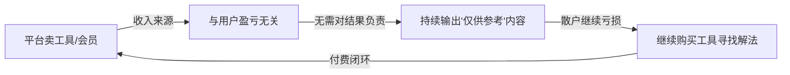
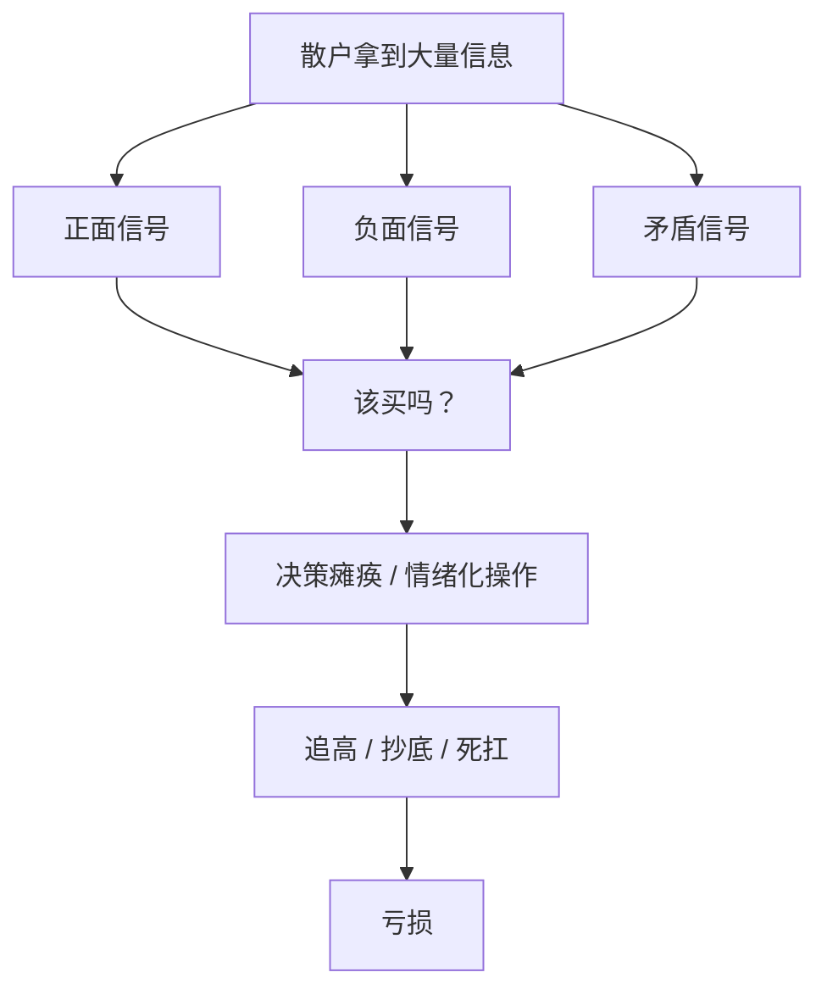
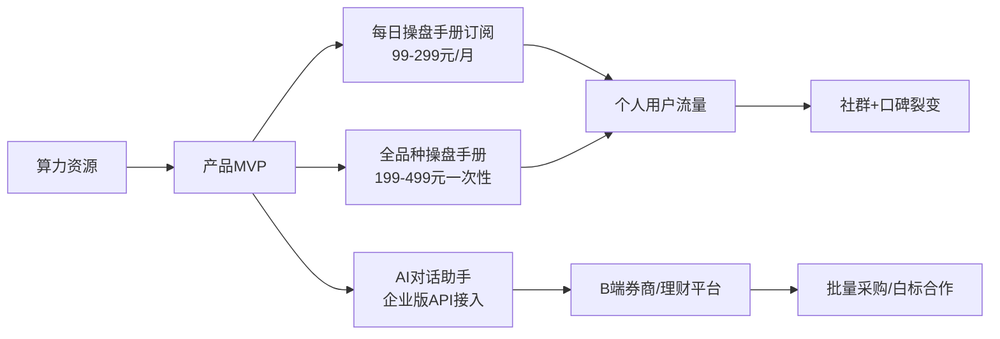

## 2025 80% 股民亏损, 谁应该负责, 如何破局? Bug猎手第二弹直击问题本质  
  
### 作者  
digoal  
  
### 日期  
2026-05-28  
  
### 标签  
BUG 猎手 , 发现不合理现象 , 给出商业机会和模式 , 行动建议 , 手握算力 , AI 投资赛道
  
----  
  
## 背景  
Bug猎手报告：散户炒股赛道的深层Bug与你的产品机会

> 日期：2026年5月28日  
> 主题：散户投资工具 × AI算力变现 × 操盘手册产品设计

---

## 📰 热点速览

- **2025年A股81%散户亏损**，10万以下小散亏损率高达98.7%，人均损失2.1万元（中证协数据）
- **2026年AI炒股工具大爆发**：同花顺、AI涨乐、EasyClaw等产品月活突破1.9亿，AI辅助决策成新刚需
- **行业洞察**：AI炒股赛道已进入"功能军备竞赛"阶段——大厂堆功能、拼数据、争牌照，但**散户真实盈利率并未提升**

---

## 🐛 Bug #1：满市场都在教你"怎么炒"，没人真正对你的"盈亏"负责

### 表象：打眼一看哪里不对？

同花顺、AI涨乐、雪球……工具越来越多，功能越来越强，但散户亏损率依然在80%以上。

"工具越强 → 散户越赚"这个逻辑链条**彻底断掉了**。

行业卖的是「过程服务」：资讯、分析、选股、盯盘。
散户需要的是「结果服务」： **我这笔钱，到底会不会赚？**

这就是最大的Bug： **供给侧和需求侧目标从未对齐过。**

### 根因拆解

**第一层：为什么大家都做工具，不做结果？**
因为对结果负责要承担法律责任（需要证券投资咨询牌照），做工具只需要打上"不构成投资建议"就能免责。

**第二层：为什么监管这么设计？**
证券法逻辑：保护散户不被骗，所以限制"具体买卖建议"。但这个逻辑的代价是：所有人都在灰色地带打擦边球（"分析仅供参考"），散户没有任何人对其亏损承担责任。

**第三层：为什么这个Bug一直存在？**
因为平台的商业模式是**卖工具/会员/广告**，用户亏还是赚，跟平台营收无关。激励结构从根上就错了。



**利益链条总结：**
- **得利方**：平台（会员费）、券商（佣金）、培训机构（课程费）
- **受损方**：散户（本金亏损 + 工具订阅费 + 培训费）
- **维持现状者**：监管（牌照壁垒保护既有玩家）

### 系统性分析

```
               散户持续亏损
                    |
    ┌───────────────┼───────────────┐
    │               │               │
  激励错位        信息不对称      监管错位
    │               │               │
工具收入与用户   机构vs散户     牌照保护大厂
盈亏彻底脱钩    信息永远不对等  小创新者无路走
```

**信息不对称**：机构有实地调研、量化模型、内部研报；散户靠公开新闻和社区情绪。

**激励错位**：平台月活越高越好，和用户赚没赚钱无关。

**监管盲区**：AI生成的"分析报告"到底算不算投资建议？目前法律边界模糊，大厂在用，监管在观望。

### 💡 解决思路

| 维度 | 解法 | 可行性 | 潜在商机 |
|------|------|--------|---------|
| 技术 | AI做「结果预期量化」而非「分析输出」，用概率区间代替买卖建议 | ⭐⭐⭐ | **有，这就是你的切入点** |
| 商业 | 订阅制改为「按盈利分成」——用户赚了才付费 | ⭐⭐ | 有，但资金结算复杂 |
| 制度 | 推动AI投顾监管沙盒（已有政策苗头） | ⭐ | 长期 |
| 社会 | 散户教育——从"找好股"转向"控制亏损" | ⭐⭐⭐ | 有，知识付费切口 |

### ⚠️ 二阶Bug：解法里的bug

最常见的"解法"是： **再买一个更好的AI工具** 。
但这个解法本身就是bug——只是给平台继续收钱提供了理由，没有解决"激励错配"的根问题。

---

## 🐛 Bug #2：AI炒股工具在做"信息整合"，但散户真正的痛点是"决策瘫痪"

### 表象：打眼一看哪里不对？

现在的AI炒股工具信息量越来越大：实时行情、研报解读、北向资金、主力筹码、情绪指数……

结果散户反而**更不知道该怎么办**了。

信息越多 → 决策越难。这是认知科学的基本规律（**选择悖论**），但所有工具都在往"信息更全"方向卷。

### 根因拆解

**第一层**：工具的KPI是"功能丰富度"，不是"用户决策清晰度"。

**第二层**：用户看到功能多会觉得"物有所值"，但买完之后用不上，反而焦虑更甚。

**第三层**：散户真正需要的不是"更多分析"，而是一个可以信任的**终局答案**：这只股，我现在该不该买，仓位多少，止损在哪，什么时候出。



**核心洞察**：散户不缺信息，缺的是**一个可以执行的操作指令**。

### 系统性分析

现有工具的逻辑链：
`输入数据 → AI分析 → 生成报告 → 散户自己决策`

散户真正需要的逻辑链：
`输入我的持仓/资金/风险偏好 → AI给出操作手册 → 我只需要执行`

这两条链之间，差了一个 **"最后一公里"的决策翻译层** 。

### 💡 解决思路

| 维度 | 解法 | 可行性 | 潜在商机 |
|------|------|--------|---------|
| 技术 | 构建「操盘手册生成器」——输出具体的买卖点、仓位、止损，而非分析 | ⭐⭐⭐⭐ | **核心产品形态** |
| 商业 | 用「每日操盘计划」作为订阅钩子，形成使用习惯 | ⭐⭐⭐⭐ | 高复购率 |
| 制度 | 在"分析"和"建议"之间找合规表达方式 | ⭐⭐⭐ | 关键护城河 |
| 社会 | 建立散户「执行纪律」社区，互相监督操作 | ⭐⭐⭐ | 社群变现 |

### ⚠️ 二阶Bug：解法里的bug

如果你真的做出了"能给出买卖点"的产品，散户会把它当成"神器"，不加思考地执行。**一旦出现亏损，你将承担极大的用户信任危机和潜在法律风险。**

---

## 🐛 Bug #3：市场上的散户工具只针对A股股票，但散户可参与的金融工具远不止于此

### 表象：打眼一看哪里不对？

99%的散户工具=炒A股。但资本市场中散户可以参与的品种其实非常丰富：ETF、可转债、港股、美股、黄金、期货、期权、REITs、债券、场内基金……

这些品种有的风险更低，有的收益弹性更大，有的更适合特定市场环境。但**几乎没有产品帮散户做跨品种的资产配置决策**。

### 散户可参与的金融工具全景

```
┌──────────────────────────────────────────────────────┐
│              散户可参与资本市场工具全景               │
├────────────┬────────────────────────────────────────┤
│ 权益类     │ A股个股、港股、美股ADR、ETF（宽基/行业/主题）│
├────────────┼────────────────────────────────────────┤
│ 固收类     │ 国债、企业债、可转债、货币基金、债券ETF   │
├────────────┼────────────────────────────────────────┤
│ 衍生品     │ 股指期货、商品期货、ETF期权、个股期权     │
├────────────┼────────────────────────────────────────┤
│ 另类资产   │ 黄金（现货/ETF/T+D）、原油、REITs、      │
│            │ 大宗商品ETF                               │
├────────────┼────────────────────────────────────────┤
│ 跨境       │ 港股通、QDII基金、美股券商直投            │
└────────────┴────────────────────────────────────────┘
```

没有产品帮散户回答： **"现在这个市场环境，我的100万应该怎么在这些品种里分配？"**

### 💡 解决思路

| 维度 | 解法 | 可行性 | 潜在商机 |
|------|------|--------|---------|
| 技术 | 用AI做「多品种轮动策略」，告诉散户什么行情用什么工具 | ⭐⭐⭐ | **差异化竞争点** |
| 商业 | 操盘手册覆盖全品种，成为"散户唯一需要的工具" | ⭐⭐⭐⭐ | 高客单价 |
| 制度 | 期货、期权涉及更严监管，需注意合规边界 | ⭐⭐ | 法务护城河 |
| 社会 | 帮助散户建立"不只买股票"的投资认知 | ⭐⭐⭐ | 教育产品 |

---

## 🗺️ 综合视角：你的产品机会矩阵

```
              影响力（散户需求匹配度）
              低 ◄─────────────────► 高
              │                        │
高  ┌─────────┼────────────────────────┤
    │         │   ✅ 操盘手册生成器    │
可  │         │   ✅ 多品种资产配置    │
行  │─────────┼──────────────────────  │
性  │         │         ────           │
    │ 按盈利  │   社群+                │
低  │ 分成    │   教育产品             │
    └─────────┴────────────────────────┘
```

**三个核心Bug的共性根因**：
1. 激励结构错配——平台不对用户结果负责
2. 信息过载——没人帮散户做"最后一公里"决策翻译
3. 品种视野窄——只盯A股个股，错过更优的工具组合

---

## 🚀 给你的产品建议：怎么用算力做出差异化产品

### 核心产品定位

> **"散户的私人操盘手"——不卖分析，卖决策；不给信息，给行动。**

这是目前市场上唯一没人做好的定位。

---

### 产品形态建议

#### 📋 产品一：每日操盘手册（核心付费产品）

**用户输入**：
- 我持有什么股/品种
- 我的成本价
- 我的总仓位和可用资金
- 我的风险偏好（保守/中等/激进）
- 我的投资周期（短线/中线/长线）

**AI输出**：
```
今日操盘手册（2026.05.28）

【持仓诊断】
- XX股（持仓30%）：当前位置偏高，建议今日减仓10%，止盈价XXX
- XX可转债（持仓20%）：溢价率合理，继续持有
- 现金（50%）：市场情绪偏弱，今日不建议加仓

【今日关注】
- 板块轮动信号：消费电子有资金流入迹象，可关注XXX
- 风险提示：美联储今晚有讲话，注意外盘波动

【今日行动清单】
☐ 9:30 检查昨日止损单是否触发
☐ 10:00 观察XX股开盘量，若缩量下跌则执行减仓
☐ 14:30 复盘北向资金流向，若持续净流出则降低仓位
```

---

#### 📚 产品二：全品种操盘手册（知识付费/订阅）

针对散户可参与的全部金融工具，按"市场环境"分章节：

```
第一章：什么市场环境买什么
  - 牛市初期 → 买A股成长股 + 杠杆ETF
  - 震荡市 → 买可转债 + 红利ETF
  - 熊市 → 持有黄金 + 货币基金
  - 通胀上行 → 商品期货 + REITs
  - 利率下行 → 债券ETF + 高股息

第二章：A股个股操盘
  - 选股框架（基本面 + 技术面 + 资金面）
  - 买入时机（底部特征 + 量价信号）
  - 卖出时机（止盈逻辑 + 止损纪律）
  - 仓位管理（金字塔加仓 + 分散配置）

第三章：ETF操盘（最适合散户的品种）
  - 宽基ETF定投策略
  - 行业ETF轮动策略
  - ETF套利机会识别

第四章：可转债操盘
  - 双低策略
  - 转股溢价率监控
  - 退市风险规避

第五章：黄金操盘
  - 黄金与美元/利率的关系
  - 实物vs黄金ETFvs黄金T+D
  - 买入/卖出时机

第六章：港股/美股（散户可参与部分）
  - 港股通使用指南
  - QDII基金配置
  - AH溢价套利机会

第七章：期权入门（保险策略为主）
  - 用期权保护持仓（备兑开仓）
  - 期权买方基本策略
  - 不适合散户的策略（明确排雷）

第八章：心理与纪律
  - 止损为什么执行不了（行为金融学）
  - 如何建立可执行的操盘系统
  - 复盘方法论
```

---

#### 🤖 产品三：AI对话式实时操盘助手

用你的算力资源，做一个**针对个人持仓的实时对话AI**：

用户提问：
- "我持有茅台，今天跌了3%，我该怎么办？"
- "现在能加仓吗？"
- "可转债和ETF我应该怎么选？"

AI回答要**直接给出行动建议**，而非分析报告。这是和竞品最大的差异。

---

### 合规处理建议（重要！）

这是最大的坑，需要认真处理：

```
风险边界划定：
┌─────────────────────────────────────────┐
│  ✅ 可以做（无需牌照）                   │
│  - "根据您的条件，历史上类似情况下有    │
│    X%概率出现上涨"（概率陈述）           │
│  - "以下是常见的操作框架，仅供参考"     │
│  - "历史回测显示该策略的胜率为X%"       │
│                                          │
│  ⚠️ 灰色地带（需要法务确认）            │
│  - "建议今日买入"（具体建议）           │
│  - "目标价为XXX"（价格预测）            │
│                                          │
│  ❌ 不能做（需要证券投资咨询牌照）       │
│  - 对特定证券给出明确买卖建议           │
│  - 收费荐股                             │
└─────────────────────────────────────────┘
```

**合规包装建议**：
1. 产品定位为"投资教育工具"而非"投资顾问"
2. 所有输出加上"历史数据分析，不构成投资建议"
3. 用"框架"和"策略"代替"建议"
4. 考虑和有证券投顾牌照的机构合作，做B2B2C

---

### 商业化路径



**定价逻辑**：
- 散户用户：月订阅制，99-299元/月，锁定使用习惯
- 知识付费：手册一次性购买，199-499元，低决策成本
- B端合作：把你的AI能力白标给理财平台/券商，按API调用收费

---

## ⚠️ 最大的二阶Bug（必读）

你的产品方向本身也有一个内在Bug需要提前想清楚：

**如果AI真的能帮散户稳定盈利，为什么还要卖给散户，而不是自己用来炒股？**

这是每个人都会问你的问题。你需要有清晰的答案：

> "我们提供的是**框架和工具**，而非alpha。就像健身教练教你正确的训练方法，但能不能练出肌肉，还取决于你的执行和坚持。我们的工具帮你避开常见错误，但市场的不确定性我们无法消除，我们也不会做这种承诺。"

这个答案，既是合规的，也是诚实的，也是可以做成真正有价值产品的切入点。

---

## 总结：你的产品机会在哪里

**找到的3个核心Bug：**

1. **激励错配Bug** → 没人对散户盈亏负责，你可以做"结果导向"的产品
2. **决策瘫痪Bug** → 信息过载，你可以做"最后一公里"操作手册
3. **品种视野Bug** → 全市场无全品种操盘手册，你可以做第一个

**你的核心优势：**
- 有算力资源（AI推理成本低）
- 没有大厂的合规包袱（可以做更"直接"的表达）
- 小团队迭代快（可以快速响应用户反馈）

**最推荐的切入顺序：**
1. 先做**全品种操盘手册**（知识产品，0合规风险，验证用户付费意愿）
2. 再做**AI对话式操盘助手**（用算力做差异化，月订阅制）
3. 最后拓展**B端合作**（放大规模）

---

*本报告由Bug猎手Skill生成 | 仅供商业决策参考 | 不构成证券投资建议*
  
  
#### [PostgreSQL 解决方案集合](../201706/20170601_02.md "40cff096e9ed7122c512b35d8561d9c8")
  
  
#### [德哥 / digoal's Github - 公益是一辈子的事.](https://github.com/digoal/blog/blob/master/README.md "22709685feb7cab07d30f30387f0a9ae")
  
  
#### [About 德哥](https://github.com/digoal/blog/blob/master/me/readme.md "a37735981e7704886ffd590565582dd0")
  
  

  
