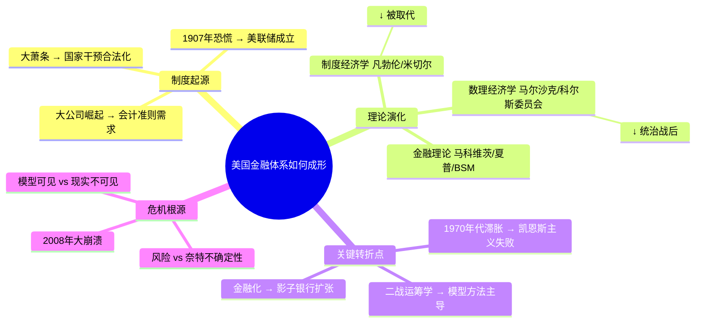

## 《美国金融体系：起源、转型与创新》读书笔记
  
### 作者  
digoal  
  
### 日期  
2026-05-29  
  
### 标签  
读书笔记 , 美国金融体系：起源、转型与创新   
  
----  
  
## 背景  
   
---
书名: 《美国金融体系：起源、转型与创新》   
原作名: Finance in America: An Unfinished Story   
作者: [美] 凯文·R·布莱恩 / [美] 玛丽·普维   
译者: 李酣   
出版社: 中信出版集团   
出版年份: 2022-7（英文原版：2017）   
页数: 584   
笔记日期: 2026-05-29   
豆瓣链接: https://book.douban.com/subject/34994969/   
标签: [金融史, 美国经济, 货币理论, 金融危机, 政治经济学]   
---

   
   
> **一句话**：这是一部用历史眼光追问"金融是怎么变成今天这个样子"的知识考古之作，它的答案令人意外——不是市场自发演化，而是一代代学者的建模选择，决定了我们看见什么、看不见什么。   
>   
> **适合谁读**：对金融史感兴趣的读者、想理解2008年危机深层根源的人、经济学/金融学学生，以及任何想超越"金融是黑箱"认知的普通人。   
>   
> **阅读难度**：⭐⭐⭐⭐☆（内容密度高，理论脉络需要耐心追踪）   
>   
> **推荐指数**：⭐⭐⭐⭐☆   

---

## 一、时代坐标：这本书从哪里来？

2008年秋天，雷曼兄弟轰然倒塌。那场危机的震中不在某家银行，而在一片所有人都以为"风险可计算、可分散"的信念体系之中。危机结束后，布莱恩和普维用了将近十年，系统性地阅读了整个20世纪美国经济学与金融学的学术文献，试图回答一个核心问题：**我们究竟是怎么走到2008年的？**

这本书写于后危机时代的反思语境之中。布莱恩是华尔街老兵，在安联旗下的贝恩斯坦投资公司做了二十多年高管，亲历了金融化浪潮的全过程；普维是纽约大学的人文学者，专攻18-19世纪英国经济文化史，是研究"知识如何生产"的专家。两位跨界作者的组合本身就是一个宣言：要理解金融，光靠经济学家还不够，还需要历史学家的眼睛。

他们想解决的问题，套用书中的核心概念，就是：**让金融"可见"（make finance visible）**。危机的根源之一，是经济学的主流模型有意无意地把金融部门排除在外——模型里有实体经济，没有影子银行；有风险概率，没有奈特式的根本不确定性；有均衡，没有系统性崩溃的位置。这种"不可见"不是疏忽，而是百年学术选择累积的结果。

```
时间轴：美国金融史的几个关键节点

19世纪末        1913年         1929年         1944年         1970年代       2008年
大公司崛起  →  美联储成立  →  大萧条爆发  →  布雷顿森林  →  金融化浪潮  →  全球危机
    ↓              ↓              ↓              ↓              ↓              ↓
会计准则诞生  货币理论争论   凯恩斯主义兴起  数学建模主导   新古典主导    系统性崩溃
```

---

## 二、核心命题：作者在说什么？

### 观点一：现代金融不是"自然生长"的，是被一代代学者"建模"出来的

书的英文副标题是"An Unfinished Story"——未竟之事。这里有一个深刻的预设：金融体系是一个**叙事建构**，而非客观规律的反映。

两位作者采用的是"谱系学（genealogical）"方法，也就是福柯式的那种追问：今天我们习以为常的金融概念——现值计算、风险定价、资本资产定价模型——它们最初是在哪里、为什么、被谁发明出来的？答案往往出人意料：会计准则来自文艺复兴时期商人的账簿；美联储的货币管理理论来自实务银行家的操作经验；衍生品定价的数学框架来自二战中的运筹学。

这些原本分散在不同场域的"碎片"，被战后的经济学家和金融学者逐一捡起、装进数学模型，然后以"科学"的面貌呈现给世界。**建模，是20世纪经济学最重要的方法论革命，也是最大的认识论陷阱。**

### 观点二：让某些东西"可见"，必然让另一些东西"不可见"

这是本书最有力量的洞见之一。以凯恩斯主义为例：战后占主导地位的宏观经济学模型能够有效追踪GDP、就业、通胀，但这些模型默认金融部门是透明的"管道"——货币政策的信号可以无损地传导到实体经济。海曼·明斯基早就警告金融系统有内在的不稳定性，却长期被主流边缘化，因为他的洞见无法被装进那个时代的模型语言。

同样，布莱克-斯科尔斯期权定价模型让衍生品风险"可见"了（可量化，可对冲），却让系统性风险和奈特不确定性"不可见"了——因为模型假设风险是可估计的、可分散的，而不是根本上未知的。

> 金融工程师的模型在追求私人利润方面大获成功，却对新产品的系统稳定性后果视而不见。这场成功与失败的叠加，就是2008年危机的技术根源。

### 观点三：金融与实体经济的分离，是历史建构的，不是必然的

凡勃伦说过，"实体"和"金融"本来是交织在一起的，把它们人为分开再去研究"实体侧"，就像解剖一匹马只研究骨骼却忽视血液循环。这个批评在19世纪末就有了，却用了一个世纪才被2008年的现实重新验证。

从早期的公司会计准则，到美联储成立时的货币数量论与信用论之争，再到战后数理经济学统治时代，书中一条隐线始终是：**谁在定义"什么是金融的核心问题"，谁就在塑造我们对金融的集体认知。**

---

## 三、论证地图：作者怎么说服你的？



书中的论证方式是**知识史考古**：从原始文献出发，追溯每一个重要概念的出生地。比如欧文·费雪的"现值"理论，看似纯粹的数学，实际上是他把公司会计师和精算师的实务操作提炼抽象的结果。比如早期美联储的官员阿林·扬（Allyn Young），他的货币管理思路来自实务银行家的经验，而非任何学院派理论。

这种"从实践到理论再到模型"的溯源方式，对读者来说既丰富又烧脑——好处是你会发现很多习以为常的金融概念其实有具体的"出生地"，坏处是前六章的叙事确实比较碎片化，需要读到后三章才能看清整体拼图。

---

## 四、前提假设与边界：什么情况下这不成立？

**假设一：模型是意识形态的载体。** 作者隐含的立场是，经济学模型并非中立的分析工具，而是携带着特定世界观。这个立场在科学哲学上有扎实的依据（从库恩到麦肯齐），但批评者会说：好的实证模型最终会被数据校验，意识形态只能在短期存活。这个争论仍然开放。

**假设二：可见/不可见是危机的核心解释。** 这个框架强有力，但可能过度诉诸"认识论失败"而低估了利益集团的作用。监管机构不是因为"看不见"影子银行，而往往是因为被游说而选择"不去看"。结构性权力问题在书中着墨不多。

**假设三：美国经验有普遍意义。** 书名是"Finance in America"，但结论经常写得像是普遍规律。美国金融体系的演化路径高度依赖特定的政治体制、法律传统和文化背景，迁移到其他语境需要谨慎。

---

## 五、思想谱系：这本书在哪个传统里？

这本书处于几个学术传统的交叉点：

**经济史/历史政治经济学传统**：与卡尔·波兰尼（《大转型》）同一脉络，关心市场不是"自然"的，而是被政治和制度建构出来的。

**科学技术研究（STS）传统**：与唐纳德·麦肯齐（《不是摄像机的引擎》）呼应，后者同样研究金融模型的"表演性"——模型不只是描述市场，还在塑造市场。

**批判金融研究传统**：与明斯基、凡勃伦同一阵营，对主流新古典金融学的反思。

在学术评价上，波士顿大学教授、货币经济学家 Perry Mehrling 给出了相当正面的评价，认为书的整体架构有独特价值，尤其是"模型让某些东西可见、让另一些东西不可见"这一洞见，是对经济学认识论的重要贡献。他同时指出，前六章因采用碎片化的谱系学策略，叙事略显松散，整体叙事在后三章才真正聚拢。

---

## 六、我学到了什么？

**收获一：所有"科学"工具都是价值选择的产物。**
我们用来理解金融的那些工具——夏普比率、VaR、贝塔系数——都不是从天上掉下来的中立计算尺。它们是在特定历史时刻、由特定学者、为解决特定问题而发明的。当问题变了，工具却不随之更新，盲点就来了。这不是在说"别用模型"，而是要始终追问：**这个模型让什么不可见了？**

**收获二：危机往往不是"黑天鹅"，而是"灰犀牛"。**
明斯基在1970年代就警告了金融内在的不稳定性。他的洞见不是被"发现"的，而是被系统性地边缘化了，因为它无法被装进当时主流的数学框架。2008年不是突如其来的意外，而是一场"被我们选择看不见"的危机。

**收获三：跨界合作的认知优势。**
一个华尔街老兵和一个人文历史学者共同写出这本书，本身就是对"金融只有金融学家才能理解"这种封闭思维的挑战。历史学家的眼睛看见了经济学家习以为常的盲点；从业者的直觉修正了学术史的过度理论化。这种跨界让我想到：在任何专业化程度极高的领域，"门外汉的问题"往往是最尖锐的问题。

---

## 七、举一反三：这个框架还能用在哪？

**场景一：理解AI治理的"不可见性"。** 大语言模型让某些能力"可见"（对话、推理），却让训练数据、能耗、劳工成本"不可见"。我们正在经历一场类似的建模革命，同样的认识论问题值得追问。

**场景二：医疗统计与循证医学。** 随机对照试验（RCT）让某些效果可见（平均疗效），却让个体差异和长尾风险不可见。这和金融模型的悖论高度同构。

**场景三：中国金融改革的参照。** 美国金融体系的演化路径——从制度监管到模型主导，再到金融化危机——对正在快速金融化的中国经济有明确的镜鉴价值。尤其是"基础科学（会计、统计）先行，金融创新后随"这一历史经验，值得重视。

---

## 八、批判与反思

豆瓣上有读者批评这本书"文不对题"——书名是《美国金融体系》，实际写的是美国经济学和金融学理论的知识史。这个批评有道理：如果你期待的是一本关于美联储操作、商业银行业务、资本市场结构的"体系"教科书，你会大失所望。

我的批评是：**书中对"为什么特定理论在特定时刻获得主导地位"解释不足。** 科尔斯委员会的数理经济学为什么在二战后迅速统治主流？仅仅是因为"运筹学的成功示范"吗？还是也有冷战政治、基金会资助、学术权力场的因素？权力维度的缺席，使这本书的知识史分析有些失重。

此外，2017年以来，加密货币、去中心化金融（DeFi）、央行数字货币等新形态已经从边缘走向主流。书中描绘的"市场化信贷体系"格局正在被新一轮技术颠覆所扰动——"未竟之事"的意思，或许比作者预想的更字面。

---

## 九、金句与记忆点

1. **"让金融可见，是一代人的未竟之事。"**
   — 书名"Unfinished Story"的本义：不是说故事没有结局，而是说理解金融的工作永远需要再出发。

2. **"模型让某些东西可见，也让另一些东西不可见。"**
   — 这是全书最值得反复咀嚼的一句话。任何分析框架都是一种选择性的注意力。

3. **"我们在2008年的梦中惊醒——而这场梦，是我们自己建造的。"**
   — 危机不是外部冲击，而是内部认知失败的结果。

4. **奈特不确定性 vs 风险**
   — 弗兰克·奈特的区分：风险（Risk）是可以用概率衡量的未知；不确定性（Uncertainty）是根本无法量化的未知。金融工程师只处理了前者，2008年的危机来自后者。

5. **"凡勃伦早就说了，实体和金融是交织在一起的。但没人听他的。"**
   — 制度经济学的历史遭遇：先知式的洞见，被数学化浪潮边缘化，然后在危机后被重新发现。

6. **"可见性不是一种恩赐，而是一种权力。"**
   — 谁有权定义"什么是重要的经济现象"，谁就在塑造整个时代的认知地图。

7. **"这不是一部成功的历史，而是一部选择的历史。"**
   — 作者的元叙事立场：美国金融体系是无数选择的累积，而非不可避免的进化。

---

## 十、延伸阅读

**1.《金融之王》（Lords of Finance）— 利亚特·阿霍姆德**
同样是金融史，但聚焦于四位央行行长如何（错误地）应对大萧条。与本书的制度视角互补，读完更容易理解美联储为什么是那个样子。

**2.《不是摄像机的引擎》（An Engine Not a Camera）— 唐纳德·麦肯齐**
学术性更强，专门研究金融模型的"表演性"。是本书"模型塑造现实"论点的深度学术版本，建议有社会学背景的读者阅读。

**3.《稳定不稳定的经济》— 海曼·明斯基**
本书多次提到的"被边缘化的先知"，直接读原著，会理解为什么2008年之后"明斯基时刻"成为流行词。

**4.《大转型》（The Great Transformation）— 卡尔·波兰尼**
市场不是自然生长的，而是被政治建构的——这是本书的历史哲学底色，而波兰尼是这一立场的奠基人。

**5.《千年金融史》（The Ascent of Money）— 尼尔·弗格森**
中文版的编辑曾将两书放在同一宣传语境下，但定位完全不同。弗格森是宏大叙事，本书是知识考古。两相对照，更能看清各自的优长与盲点。

---

## 一张图看懂全书

```
              【美国金融体系演化的双螺旋】

    实践层                          理论层
    ─────                          ─────
    商人账簿                →      复式记账法
    大公司扩张              →      公司会计准则
    1907年银行恐慌          →      美联储成立
    大萧条                  →      凯恩斯主义
    二战运筹学              →      数理经济学主导
    债券市场扩张            →      投资组合理论
    期权市场兴起            →      BSM模型
    影子银行扩张            →      （模型空白区）
                                      ↓
                              2008年危机爆发
                              "不可见"的代价

    ──────────────────────────────────────────
    核心洞见：每一次"理论化"都让某些现实可见，
              也让另一些现实不可见。
    未竟之事：重新让金融的全貌回到公共视野。
```

---

*笔记写于 2026-05-29 | 基于英文原版学术书评（Perry Mehrling, Boston University）、豆瓣读者书评及深度思考整理*
*原版由芝加哥大学出版社2017年出版，中文版由中信出版集团2022年出版*
  
  
#### [PostgreSQL 解决方案集合](../201706/20170601_02.md "40cff096e9ed7122c512b35d8561d9c8")
  
  
#### [德哥 / digoal's Github - 公益是一辈子的事.](https://github.com/digoal/blog/blob/master/README.md "22709685feb7cab07d30f30387f0a9ae")
  
  
#### [About 德哥](https://github.com/digoal/blog/blob/master/me/readme.md "a37735981e7704886ffd590565582dd0")
  
  

  
