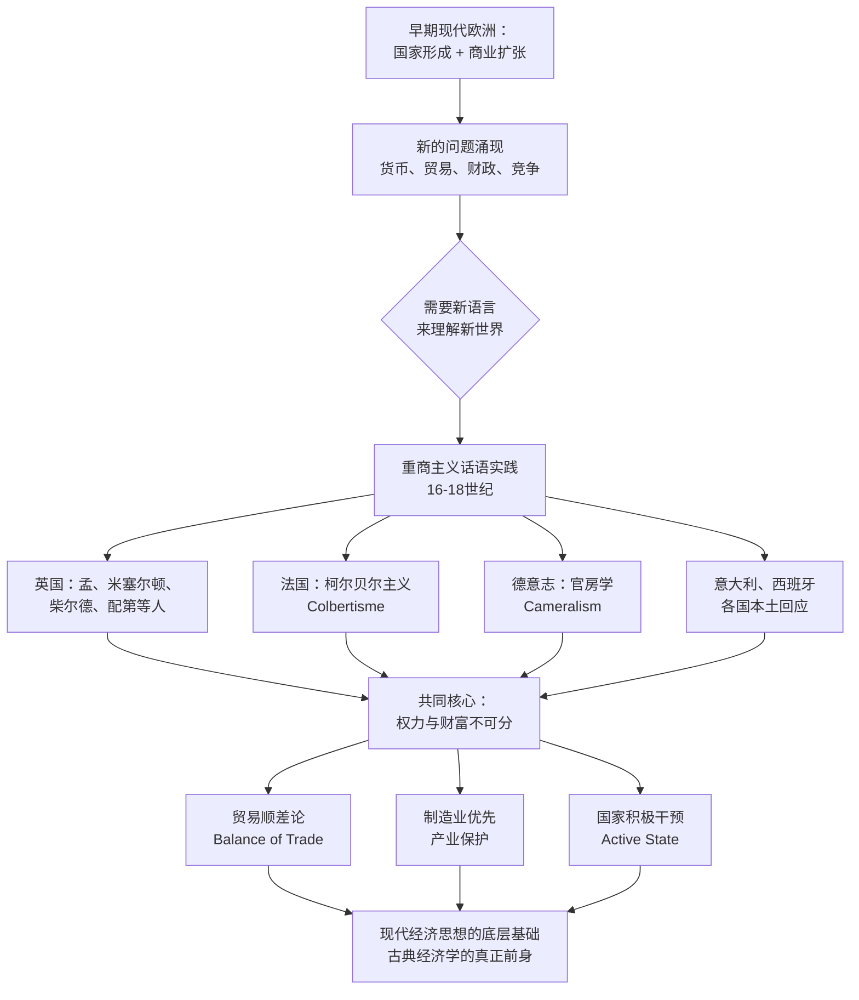

## 《重商主义政治经济学》读书笔记
  
### 作者  
digoal  
  
### 日期  
2026-05-29  
  
### 标签  
读书笔记 , 重商主义政治经济学   
  
----  
  
## 背景  
   
---
书名: 《重商主义政治经济学》   
作者: [瑞典] 拉斯·马格努松   
译者: 梅俊杰   
出版年份: 2021（中译本）/ 2015（原著）   
出版社: 商务印书馆   
笔记日期: 2026-05-29   
豆瓣链接: https://book.douban.com/subject/35687162/   
ISBN: 9787100196147   
标签: [经济思想史, 重商主义, 政治经济学, 国家理论, 贸易史]   
---

      

> **一句话**：重商主义不是一堆被历史淘汰的错误理论，而是现代国家在剧烈竞争中诞生时所说的那套语言——权力与财富从来就是一回事。   
> **适合谁读**：对经济思想史、国际政治经济学感兴趣的读者；想理解"贸易战"和"产业政策"历史根源的人；对"自由贸易是普世真理"这一说法有疑问的人。   
> **阅读难度**：⭐⭐⭐☆☆   
> **推荐指数**：⭐⭐⭐⭐☆   
   
---

## 一、时代坐标：这本书从哪里来？

这本书有两个"诞生时刻"。

原著出版于2015年，距离作者马格努松的第一本重商主义专著《重商主义：一套经济话语的形成》已过去整整二十年。彼时西方世界刚刚走出2008年金融危机的泥淖，新自由主义的光环第一次大规模褪色——政府干预、产业保护、贸易顺差这些曾被主流经济学嗤之以鼻的词汇，悄然回到了政策讨论的中心。马格努松意识到，学术界对重商主义的兴趣正在复苏，是时候做一次系统性的综合梳理了。

中译本出版于2021年，译者梅俊杰是国内研究重商主义、国家赶超战略的重要学者，他本人著有《自由贸易的神话》《贸易与富强》，对英美崛起背后的保护主义底色有长期研究。换句话说，这本书进入中文学界，带着一重不言而喻的时代关切：当中美贸易摩擦正酣、全球产业政策大辩论方兴未艾，重新审视那段"权力与财富相互缠绕"的早期现代史，不只是学术的兴趣，更是现实的需要。

马格努松本人是瑞典乌普萨拉大学经济史教授，长期深耕西欧经济史与经济思想史，是欧洲经济史学界公认的重商主义研究权威。这本书的定位，是他多年研究的"综合版"：不只讲重商主义者说了什么，更追问他们为什么这样说，那套话语体系是怎样在国家竞争的压力下成形的。

---

## 二、核心命题：作者在说什么？

### 命题一：重商主义是一套"话语体系"，不是一个系统理论

马格努松面对的第一个难题，是"重商主义"这个词本身的麻烦。自亚当·斯密在《国富论》（1776年）中用"mercantilist system"来批判那些鼓吹贸易顺差和金银积累的人，这个词就天生带着贬义。后来的经济思想史家——从赫克歇尔到熊彼特再到科尔曼——也反复指出，所谓"重商主义者"其实是一群背景各异、观点相当分散的人：有商人、有官员、有神学家、有医生，他们写作的动机各不相同，许多观点彼此矛盾。

马格努松的回应是：不要试图给这群人找到一个统一的"学说"，而要把他们的写作理解为一套**话语实践**（discursive practice）——一种在16至18世纪早期现代欧洲涌现的、试图用语言来"理解和应对迅速变化的商业世界"的集体努力。

这个定义既承认了分散性，又保留了内在联系。就像你不能说中世纪神学家的每一篇论文都在讲同一个问题，但你仍然可以说他们共享一套处理世界的语言框架——重商主义者也是如此。

### 命题二：重商主义的核心是"权力与财富不可分"

如果非要找一个贯穿这套话语的核心关切，马格努松认为，那就是**"权力与财富（power and plenty）"的双重追求**，以及两者之间深刻的相互依存。

早期现代的欧洲统治者和思想家，面对的是一个残酷的国际环境：国家还在形成中，战争是常态，海外贸易路线的控制权决定了帝国的命运。在这种背景下，财富不只是让人生活更好的手段，更是维持军力、赢得外交优势、确立国家权威的基础；而强大的国家权力，反过来又是保护本国贸易、排斥竞争对手的前提。

这不是什么幼稚的"金银崇拜"，而是当时欧洲政治现实的精确映射。重商主义者中几乎没有人认为财富和权力可以分开讨论——这正是他们与后来的古典经济学家最根本的分歧所在。

### 命题三：17世纪是现代经济学的诞生地，重商主义者是助产士

书中一个让人震动的论断来自马格努松的综合判断：所谓"现代经济学"——商业、货币、利率、国际贸易、国家财政——这套分析框架，其实在17世纪的重商主义讨论中已经初步成形。那些被亚当·斯密嘲笑为"错误"的人，恰恰是第一批认真思考这些问题的人。

熊彼特在《经济分析史》中说得更直接：《国富论》中没有一个分析原则在1776年是全新的，斯密从那些他所批评的重商主义者那里学到了大量东西。马格努松的研究是对这个判断最系统的历史支撑。

---

## 三、论证地图：作者怎么说服你的？



马格努松的论证方式是历史学家的方式，而不是经济学家的方式：他大量引用一手文本，从托马斯·孟（Thomas Mun）的《英国得自对外贸易的财富》到约翰·哈利斯关于货币的讨论，从法国科尔贝尔的产业政策备忘录到德意志官房学派的治国论著，逐步还原"重商主义者们在具体问题上是怎么思考的"。

他特别花了大量篇幅重建1620年代英国的贸易大辩论——一场围绕"货币荒"引发的大争论，促使英国思想界第一次系统讨论国际收支、货币与商业的关系。这场辩论可以被视为现代宏观经济分析的真正起点。

在论证方式上，马格努松刻意回避"辉格史"（Whig history）——即用"谁最接近我们今天的正确答案"来评判历史人物的框架。他的目标不是找"重商主义中谁最先发现了比较优势"，而是理解这些人在自己的历史情境中究竟在解决什么问题。这种方法论的自律，是这本书学术价值的重要来源。

---

## 四、前提假设与边界：什么情况下这不成立？

### 假设一：话语分析足以捕捉历史实践

马格努松的核心方法是"话语分析"（discourse analysis），聚焦于文本和语言。但批评者有理由追问：重商主义者们真正影响政策的程度究竟有多深？那些贸易条例、关税法案、殖民地规章，有多少是因为这些思想家的影响，又有多少只是商人利益集团的直接游说？话语与实践之间的鸿沟，可能比这本书呈现的更宽。

### 假设二：早期现代欧洲的讨论可以作为一个相对统一的整体

马格努松试图构建一个"全欧洲的重商主义话语"，但全书最扎实的部分仍然是英国，法、德、意、西的讨论相对简略。这个"全欧视角"的雄心与实际执行之间存在一定落差——英格兰经验被过度代表，苏格兰几乎被完全忽略，而苏格兰的约翰·劳（John Law）对欧洲金融史影响深远。

### 假设三：时间边界（16-18世纪）是"重商主义"的自然边界

马格努松将重商主义基本锁定在这三个世纪。但他自己也承认，汉密顿的"美国体系"、弗里德里希·李斯特的国家经济学、20世纪的发展经济学、今天的战略性贸易政策，都可以被视为重商主义逻辑的延续。如果"权力与财富不可分"是一个跨越时代的现实，那"重商主义"究竟是一个历史阶段，还是一种永恒的政治经济逻辑？书中对这个问题的处理颇为暧昧。

---

## 五、思想谱系：这本书在哪个传统里？

```mermaid
graph LR
    A[赫克歇尔<br>《重商主义》1931] --> B[把重商主义定义为<br>民族国家经济统一进程]
    B --> C[马格努松1994<br>《一套经济话语的形成》]
    C --> D[马格努松2015<br>《重商主义政治经济学》]
    
    E[剑桥语言历史学派<br>波考克 斯金纳] --> C
    
    F[科尔曼 1969<br>"重商主义是<br>史学的红鲱鱼"] --> G[修正主义反驳]
    G --> D
    
    H[平卡斯 斯特恩<br>温纳林德<br>《重新想象的重商主义》2014] --> D
    
    D --> I[当代战略贸易理论<br>克鲁格曼 布兰德等]
    D --> J[发展经济学<br>赶超战略研究]
```

马格努松的学术底色来自两个传统的交汇：一是瑞典-德意志的经济史传统（以赫克歇尔为代表，把重商主义理解为国家建构过程），二是英国剑桥语言-历史学派（以波考克、斯金纳为代表，把思想史理解为话语实践而非孤立的理论体系）。

他的工作处于近几十年"重商主义复兴"的学术浪潮中心。这股浪潮的背景，是2008年金融危机后对自由市场正统的全面质疑，以及发展经济学界对"国家能力"和"产业政策"的重新重视。

在中文语境下，梅俊杰将这本书引入，与他本人的学术立场高度契合：批判"自由贸易神话"，重新发掘重商主义在后发国家赶超发展中的历史价值。

---

## 六、我学到了什么？

读完这本书，最大的收获不是某个具体的历史细节，而是**一种看问题的视角转换**。

**第一个收获：名字本身就是武器。** "重商主义"这个名字是亚当·斯密发明的，发明它的目的是为了批判它。当你给对手的整套思想贴上一个标签，再宣布这套思想已经被历史证伪，你就完成了一次思想史上的谋杀——受害者甚至来不及替自己辩护。历史上，自由贸易旗手们就是这样处理重商主义的。今天我们在讨论"产业政策""战略自治""供应链安全"的时候，也应该提防类似的话语操作。

**第二个收获：斯密的伟大建立在前人的肩膀上。** 重商主义者们第一次认真讨论了国际收支、货币数量论、利率与贸易的关系、国家干预的边界……这些问题后来成了古典经济学的核心议题。《国富论》之所以能那么系统，正是因为有一个多世纪的争论帮他把概念工具磨锋利了。"革命性的突破"往往是对此前积累的整理与综合，斯密不例外，马克思不例外，凯恩斯也不例外。

**第三个收获：经济学和政治学的分离是一种人为切割。** 重商主义者从来不认为经济是一个可以与权力分开讨论的自足领域。国家之间的贸易竞争，从来就不只是交换比较优势的游戏，而是国力消长、霸权更迭的战场。今天我们把"经济学"和"政治学"分成两个系，分成两套话语，这固然带来了分析精度的提升，但也可能让我们对现实中权力与财富共舞的本质视而不见。

---

## 七、举一反三：这个框架还能用在哪？

**理解当代"新重商主义"浪潮。** 2018年后的中美贸易争端、《通胀削减法》（IRA）的产业补贴、欧盟的战略自主话语——这些政策在古典经济学框架下都是"低效的"，但用马格努松重建的权力-财富分析框架来看，它们恰恰是16-17世纪欧洲国家竞争逻辑的当代复刻。历史没有重演，但逻辑在循环。

**理解发展中国家的追赶策略。** 日本、韩国、中国台湾的产业政策，以及中国的制造业崛起，都遵循着某种重商主义逻辑：用国家力量扶持产业，先做大规模，再谈效率。这本书提供了理解这套逻辑的思想史背景——它不是新鲜事物，而是早期现代欧洲实践的长程回响。

**在组织竞争中思考"权力与资源的互强"。** 即便在企业或职场层面，这个框架也有迁移价值：资源（财富）和影响力（权力）并不是先后关系，而是螺旋上升的互强关系。先等有了资源再谈影响力，往往错失时机；同样，先拿到影响力，资源才会向你靠拢。

---

## 八、批判与反思

这本书有三处让我感到不满足。

**其一，英国中心主义的阴影挥之不去。** 尽管马格努松立志写一部"全欧洲的重商主义史"，但最有血肉的部分仍然是英国17世纪的贸易辩论。法国科尔贝尔主义的政策实践、西班牙的衰落与反思、德意志官房学的体系性建构，都只是寥寥数笔，远不够深入。这也许是单一作者完成如此宏大综合工程的必然局限。

**其二，"话语"与"利益"之间的张力没有解决。** 马格努松反复强调话语实践的重要性，但他对"哪些人在讲这套话语，他们的物质利益是什么"这个问题着墨不多。托马斯·孟本人就是英国东印度公司的董事——他的贸易顺差论，究竟是思想真诚还是游说工具？这个问题没有简单答案，但理应在书中得到更多讨论。

**其三，与当代的对话太谨慎。** 马格努松在结尾点了一下战略贸易理论（克鲁格曼等人）和汉密顿式的产业政策传统，但他明显不愿意把历史叙述拉得太近，以至于现实意涵部分几乎是蜻蜓点水。相比之下，译者梅俊杰自己的著作在这方面更为大胆直接。这可能是学术克制，也可能是某种遗憾。

---

## 九、金句与记忆点

> **"17世纪是现代经济学的诞生地，产下这个新生儿的人是重商主义者。"**
——马格努松。这句话颠覆了大多数人脑海中"斯密创立了经济学"的印象。

> **"与其把重商主义描述为一套连贯的学说，不如把它理解为一系列话语实践——这些实践试图回应早期现代欧洲商业世界的急剧变化。"**
——这是全书的方法论核心，用"话语"代替"理论"，为重商主义松绑。

> **"权力与财富，在重商主义的视野里，从来就是一枚硬币的两面。"**
——这是马格努松重建的重商主义核心逻辑，也是理解近代帝国竞争最有力的钥匙。

> **"重商主义更接近于国策，而非理论。"**
——这个判断提醒我们，用"理论正确与否"去评判重商主义，本来就是错误的框架。

> **"语言是通过交流行为改变的。在实践中使用语言，它就会逐渐转化。"**
——这是马格努松受剑桥语言史学派影响的理论底色，话语不是被动反映现实，而是主动塑造现实。

> **"亚当·斯密从那些他所批判的重商主义者那里学到了许多东西。"**
——熊彼特这句话，是拆解"斯密神话"最简洁的武器。

> **贸易顺差论（Balance of Trade Theory）**：重商主义的核心政策主张，认为出口应大于进口以积累财富。今天仍在被各国政府追求，足见它的生命力远超斯密所认为的那样短暂。

---

## 十、延伸阅读

**1.《重商主义：一套经济话语的形成》，拉斯·马格努松（1994年）**
本书的前身，专注于话语形成的语言分析。读完本书后，可以倒过来读这本，理解马格努松思想的演变轨迹。

**2.《国富论》，亚当·斯密（1776年）**
不是因为它批判了重商主义，而是因为读完马格努松之后再读斯密，你会看到他在哪里建构了靶子，在哪里悄悄借鉴了对手。

**3.《自由贸易的神话：英美富强之道考辨》，梅俊杰（2008年）**
本书的中文语境补充。译者梅俊杰用中国学者的视角，从历史实证角度揭示英美崛起背后的保护主义底色。

**4.《欧洲发展的历史经验》，迪特·森哈斯（商务印书馆2015年，梅俊杰译）**
比较视角下欧洲各国发展路径的历史考察，是重商主义-赶超理论讨论的重要拼图。

**5.《经济分析史》第一卷，熊彼特（商务印书馆）**
经济思想史的经典巨著。熊彼特对重商主义者的重新评价，是马格努松乃至整个重商主义复兴研究的重要学术先驱。

---

*笔记写于 2026-05-29 | 基于公开学术资料与深度分析整理*
*参考来源：Reviews in History（伦敦大学历史学院），ResearchGate学术数据库，梅俊杰学术主页及著作，豆瓣书目信息，光明日报《重商主义的历史逻辑》，维基百科等*
  
  
#### [PostgreSQL 解决方案集合](../201706/20170601_02.md "40cff096e9ed7122c512b35d8561d9c8")
  
  
#### [德哥 / digoal's Github - 公益是一辈子的事.](https://github.com/digoal/blog/blob/master/README.md "22709685feb7cab07d30f30387f0a9ae")
  
  
#### [About 德哥](https://github.com/digoal/blog/blob/master/me/readme.md "a37735981e7704886ffd590565582dd0")
  
  

  
