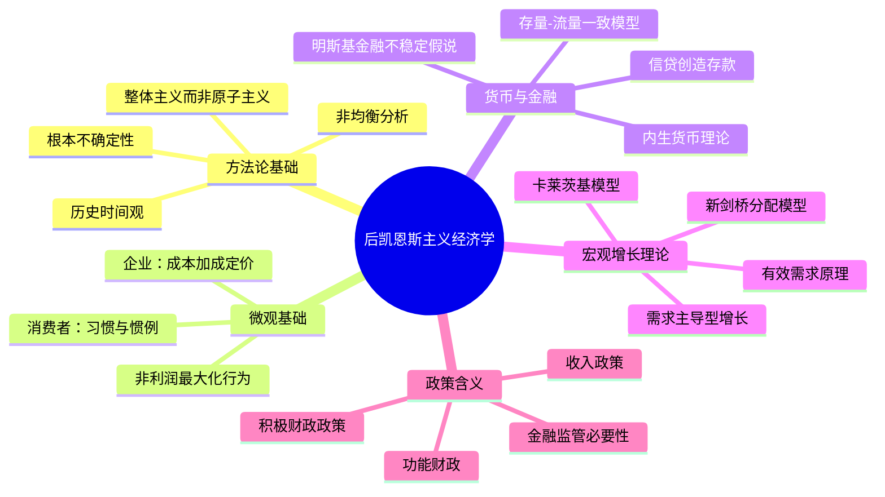

## 《后凯恩斯主义经济学：新基础》读书笔记
  
### 作者  
digoal  
  
### 日期  
2026-05-29  
  
### 标签  
读书笔记 , 后凯恩斯主义经济学：新基础   
  
----  
  
## 背景  
   
---
书名: 《后凯恩斯主义经济学：新基础》   
作者: [加]马克·拉沃   
译者: 孟捷 等   
出版社: 中国人民大学出版社   
出版年份: 2021（中译本）/ 2014（英文第一版）   
笔记日期: 2025-05-29   
ISBN: 9787300292144   
标签: [异端经济学, 宏观经济学, 货币理论, 政治经济学, 凯恩斯主义]   
---

   
   
> **一句话**：这是一本用大约1000页的篇幅，系统性地拆解主流经济学地基、为另一套世界观奠基的"异端圣经"。   
> **适合谁读**：对主流新古典经济学感到不满足、想了解替代性理论框架的经济学学生与研究者；关注货币政策、分配问题、金融不稳定性的政策分析人士；试图理解2008年金融危机为何让主流理论哑口无言的知识分子。   
> **阅读难度**：⭐⭐⭐⭐☆（需要一定经济学基础，数学要求不高，但概念密度极大）   
> **推荐指数**：⭐⭐⭐⭐⭐   
   
---

## 一、时代坐标：一本书从哪里来？

1983年，琼·罗宾逊去世了。那一年，新自由主义刚刚崛起，撒切尔和里根的经济革命正如日中天。后凯恩斯主义经济学——这个在主流学界被嘲讽为"不合时宜"的学派——仿佛随着这位斗士一起，被时代的浪潮拍上沙滩。

然后，2008年来了。

雷曼兄弟的倒塌让主流宏观经济学陷入了一场集体失语。英国女王在访问伦敦政治经济学院时当众质问：为什么没有经济学家预测到这场危机？那些精心构建的动态随机一般均衡模型（DSGE）、那些依赖理性预期与市场出清的数学大厦，在真实危机面前毫无招架之力。伊丽莎白女王的一问，羞辱了整整一代主流经济学家。

就在这样的历史背景下，加拿大渥太华大学教授马克·拉沃于2014年出版了这本书的英文第一版（2022年又出了大幅扩充的第二版，中译本根据英文2014版译出）。书名意蕴深远——**新基础（New Foundations）**。这不是修修补补，而是要另起炉灶，为整个经济学重建地基。

```
时间轴：后凯恩斯主义的兴衰与复兴

1930s ─────── 凯恩斯《通论》横空出世
    │
1950s-60s ──── 罗宾逊、卡尔多等建立"新剑桥学派"
    │           剑桥资本论争（Robinson vs Samuelson）
    │
1970s ──────── 新自由主义崛起，后凯恩斯被边缘化
    │           但明斯基、摩尔、帕西内第等第二代学者持续耕耘
    │
1983 ──────── 罗宾逊去世，后凯恩斯主义进入"冰河期"
    │
1992 ──────── 拉沃《后凯恩斯主义经济学分析基础》第一版
    │
2008 ──────── 全球金融危机，"明斯基时刻"成为流行词
    │           主流DSGE模型集体失效，异端迎来春天
    │
2014 ──────── 《新基础》英文第一版，被引用超过1600次
    │
2021 ──────── 中译本出版，登陆中国学界
    │
2022 ──────── 英文第二版，继续扩充
```

拉沃的写作动机非常明确：**主流经济学的失败不是偶然失误，而是系统性错误**。错误根源在于它的基础假设——理性行为人、市场出清、均衡状态、货币中性——与现实世界严重脱节。他要做的，是展示另一个体系的内在一致性与解释力。

---

## 二、核心命题：作者在说什么？

拉沃的体系庞大，但几个核心支柱可以清晰梳理：

### 命题一：根本不确定性才是经济世界的本质

主流经济学的基石是"理性经济人"——行为者拥有完整信息，在约束条件下最优化。后凯恩斯主义的出发点截然不同：**未来是根本不确定的，无法用概率分布来描述**。

这不是说人们会犯错，而是说关于未来的知识本身就是不完整的。在这种世界里，传统的最优化计算毫无意义。人们依靠**惯例、规则和约定俗成的行为**来做决策。凯恩斯在《通论》中讲到的"动物精神"（animal spirits），不是非理性的缺陷，而是在不确定性下必然采取的生存策略。

这一洞见的政策含义极为深远：如果不确定性是内生的、不可消除的，那么市场就不会自动趋向稳定均衡——它需要制度性力量（包括国家干预）来维系。

### 命题二：货币是内生的，不是中央银行注射的

主流货币经济学的基本叙事是：中央银行控制货币供给，通过利率调节经济。后凯恩斯的内生货币理论颠覆了这一叙事：

**货币不是由央行"印出来"再"注入"经济的，而是由商业银行发放贷款时在资产负债表上创造出来的。** 贷款创造存款，而非存款支持贷款。货币供给是内生的，由信贷需求驱动。央行的角色不是控制货币量，而是设定利率——作为价格的守门者，而非数量的控制者。

这个命题在2008年后获得了广泛认可。英格兰银行在2014年的一份季度公告中正式承认，主流教科书中的货币乘数模型是错误的，货币确实主要由商业银行通过放贷创造。这是主流机构对后凯恩斯传统的一次历史性背书。

### 命题三：需求决定增长，分配决定命运

新古典经济学的增长理论以索洛模型为核心：长期增长由技术进步和要素供给决定，需求只是短期波动的来源。后凯恩斯主义则主张**需求具有长期决定性**——这就是所谓的"需求主导型增长"。

卡莱茨基模型进一步将分配问题纳入分析核心。工资份额的上升或下降，不只是分配公平问题，更直接影响有效需求、投资意愿乃至整个经济的增长路径。这意味着：收入不平等不只是道德问题，更是宏观经济不稳定的根源。

---

## 三、论证地图：思想体系的骨架



拉沃的论证方式有一个显著特点：**他不只是批判，他建构**。全书八个正文章节基本上与新古典教科书的章节体系一一对应——消费者理论、企业理论、货币与信贷、有效需求、增长与积累、通货膨胀、开放经济——每一章都先呈现主流观点，再系统提供后凯恩斯替代版本。

这是一种双重革命策略：既解构敌方的大厦，又展示自己体系的完整性。

---

## 四、前提假设与边界：什么情况下这不成立？

### 假设一：资本主义的阶级结构是持久的

后凯恩斯的许多分析预设了一个清晰的工人—资本家二元结构，工资份额与利润份额是分析的基本单位。但在21世纪，随着"知识工人"、"平台经济"、"零工经济"的兴起，这一边界越来越模糊。一个拿期权的科技工程师，算工人还是资本家？

### 假设二：国家能力与政策意愿可以协调

后凯恩斯的政策建议（积极财政、收入政策、金融监管）都预设了一个有能力、有意愿干预经济的国家。但在实际政治经济中，国家往往被利益集团捕获，政策传导也远比模型复杂。

### 假设三：封闭或半封闭的经济体

许多核心模型在封闭经济假设下最为清晰。拉沃虽然有专章讨论开放经济，但在极度金融全球化的今天，资本外流、汇率压力、国际套利等因素会对国内政策产生严重制约，这是后凯恩斯框架尚待完善的领域。

---

## 五、思想谱系：这本书在哪个传统里？

```
思想谱系图

凯恩斯（《通论》）─────┐
卡莱茨基（波兰左翼）────┤
斯拉法（成本理论）──────┼──→ 后凯恩斯主义
罗宾逊/卡尔多（剑桥）──┤        核心传统
明斯基（金融不稳定）────┘
     │
     ├─→ 拉沃综合体系（本书）
     │
     ├─→ 现代货币理论（MMT：兰德尔·雷、沃伦·莫斯勒）
     │
     ├─→ 存量-流量一致模型（戈德利-拉沃）
     │
     └─→ 马克思主义经济学（部分汇流）
```

拉沃最重要的学术贡献之一，是坚持**"宽帐篷"（broad tent）策略**——他不划清门户，而是将各路异端纳入一个大家庭：斯拉法学派、制度主义、马克思主义、凯恩斯/卡莱茨基传统，都在书中找到了位置。这与某些异端经济学家试图纯化门派的做法截然相反。

---

## 六、我学到了什么？

读完这本书，我有三个深层改变。

**第一，经济学不是中立的物理学，而是有前提假设的政治选择。** 新古典经济学不断强调自己的"科学性"，但其核心假设——理性人、市场出清、均衡稳定——是形而上学前提，不是经验事实。拉沃让我看清，选择一种经济学，本质上是在选择一套关于社会运转方式的世界观。

**第二，货币比我以为的更重要、更奇怪。** 在读这本书之前，我头脑中的货币大概是"价值媒介"——一个让交换更方便的工具。后凯恩斯主义告诉我，货币是债务关系的记录，是权力结构的体现，是金融不稳定性的根源。货币的内生性意味着，经济的扩张和收缩，首先是信贷关系的扩张和收缩。

**第三，2008年之后没有任何一场真正的思想革命。** 读这本书最心寒的一刻，是意识到：金融危机之后，主流经济学家修修补补、加入一些摩擦项和金融中介，然后宣称"我们已经更新了"。真正的范式转变从未发生。拉沃们的声音，在学术市场上依然处于边缘位置。这不是因为他们的理论不好，而是因为思想市场同样存在垄断和路径依赖。

---

## 七、举一反三：这个框架还能用在哪？

**理解中国经济的信贷扩张逻辑。** 内生货币理论对理解2008年后中国"四万亿"刺激计划的运作机制极有帮助。中国银行业通过信贷创造，而非央行先行注入基础货币，支撑了基础设施投资的大规模扩张。这正是内生货币理论描述的图景。

**分析平台经济下的分配问题。** 卡莱茨基模型的核心洞见——工资份额与利润份额的对立影响需求——可以直接应用于理解当前数字平台经济中的分配问题。当超级平台通过算法压低骑手工资时，这不只是劳动问题，更是宏观需求的侵蚀。

**反思量化宽松（QE）的局限。** 后凯恩斯对外生货币论的批判，正是理解"QE为什么没有引发通货膨胀"的关键。央行扩张资产负债表，但如果实体经济信贷需求不足，货币量就不会扩张，物价就不会上涨。2010年代全球央行的实践，是对后凯恩斯货币理论的一次现实验证。

---

## 八、批判与反思

批评这本书，需要一点勇气——因为拉沃自己在书中提前预演了大多数可能的批评，并做了反驳。但我仍有几点保留：

**一、体系的宽阔性有时损害了锋芒。** 拉沃的"宽帐篷"策略虽然展示了异端经济学的广度，但也导致内部存在相当大的张力。斯拉法传统与卡莱茨基传统在价格理论上存在深层分歧，书中有时用外交辞令加以回避，而非正面处理。一个真正"新"的基础，可能需要更大的理论整合勇气。

**二、关于政治可行性，书中过于乐观。** 后凯恩斯主义的政策菜单（功能财政、收入政策、资本管制）在理论上令人振奋，但在当代政治经济现实中，每一项都面临极其强大的政治阻力。经济学家提出了处方，但对于"谁来执行、怎么推动"这个问题，拉沃基本保持沉默。

**三、行为金融学与复杂系统经济学的挑战。** 后凯恩斯主义虽然批判理性人假设，但其替代方案（惯例、规则）仍然是相对简化的行为模型。行为经济学和复杂系统研究近年来提供了更精细的微观基础，后凯恩斯传统与这两个领域的对话仍显不足。

---

## 九、金句与记忆点

**1. "市场出清是特例，非均衡才是常态。"**
> 解析：这句话的颠覆性在于，它把主流经济学的核心假设从"默认真理"变成了"需要证明的特殊情形"。

**2. "贷款创造存款，而非存款支持贷款。"**
> 解析：内生货币论的核心命题。彻底改变了我们对银行角色和货币本质的理解。

**3. "历史时间不可逆，均衡分析所需的逻辑时间是虚构的。"**
> 解析：罗宾逊的经典批判。经济决策发生在真实时间中，不能用"长期均衡"来为短期痛苦辩护。

**4. "节俭悖论：个人省钱是美德，全体省钱是灾难。"**
> 解析：凯恩斯最重要的合成谬误。后凯恩斯主义将此进一步发展为"整体主义"方法论的核心。

**5. "明斯基时刻：稳定本身孕育了不稳定。"**
> 解析：这是对周期繁荣的最冷峻诊断。越是风平浪静，金融机构越敢冒险，系统性风险越是悄然积累。

**6. "新古典综合派是对凯恩斯的背叛，而非继承。"**
> 解析：拉沃与主流"凯恩斯主义"划清界限的核心立场。IS-LM模型不是凯恩斯，充其量是凯恩斯的骨架套上新古典的皮。

**7. "需求不只决定短期，也决定长期——供给端会适应需求。"**
> 解析：后凯恩斯"需求拉动"增长理论的精髓，直接挑战索洛模型关于供给侧决定长期增长的结论。

---

## 十、延伸阅读

**1. 《就业、利息和货币通论》——凯恩斯**
> 一切的起点。读懂了凯恩斯原典，才能理解后凯恩斯主义究竟在捍卫什么，又在发展什么。

**2. 《货币经济学》——温特劳布/戴维森**
> 后凯恩斯货币理论的经典文本，与拉沃的货币章节形成互补，侧重货币的不确定性维度。

**3. 《稳定不稳定的经济》——海曼·明斯基**
> 后凯恩斯金融不稳定理论的集大成之作。2008年之后每个人都引用"明斯基时刻"，但很少有人真正读过他。

**4. 《货币经济学：整合方法》——温·戈德利、马克·拉沃**
> 拉沃与导师戈德利合著，专门讲存量-流量一致模型（SFC），是本书第四章的完整技术展开。

**5. 《资本》——马克思**
> 不一定要通读，但需要感受这套分析框架——价值、剩余价值、积累——如何与后凯恩斯的卡莱茨基传统形成互文。后凯恩斯主义的阶级分析，根植于这片土壤。

---

*笔记写于 2025-05-29 | 基于孟捷译者前言、学术书评及多方文献综合整理*
*参考来源：《观察者网》孟捷译者前言、Review of Political Economy (Vol.35, 2023)、爱德华·埃尔加出版社介绍页*
  
  
#### [PostgreSQL 解决方案集合](../201706/20170601_02.md "40cff096e9ed7122c512b35d8561d9c8")
  
  
#### [德哥 / digoal's Github - 公益是一辈子的事.](https://github.com/digoal/blog/blob/master/README.md "22709685feb7cab07d30f30387f0a9ae")
  
  
#### [About 德哥](https://github.com/digoal/blog/blob/master/me/readme.md "a37735981e7704886ffd590565582dd0")
  
  

  
