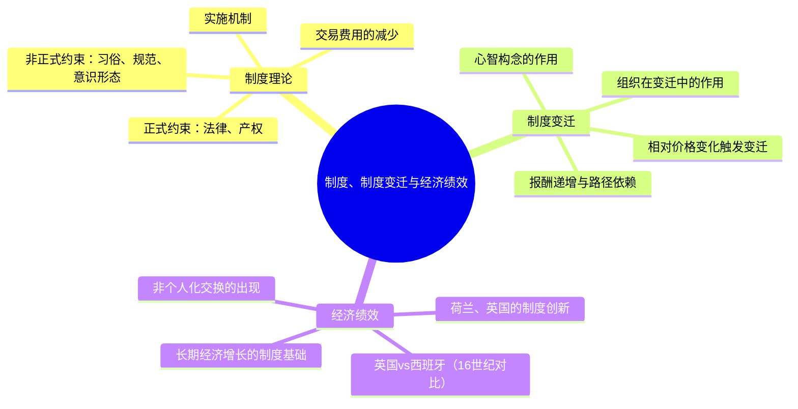

## 《制度、制度变迁与经济绩效》读书笔记
  
### 作者  
digoal  
  
### 日期  
2026-05-29  
  
### 标签  
读书笔记 , 制度、制度变迁与经济绩效   
  
----  
  
## 背景  
   
---
书名: 《制度、制度变迁与经济绩效》   
作者: 道格拉斯·C·诺思（Douglass C. North）   
出版年份: 1990（原版）/ 2014（格致版）   
笔记日期: 2026-05-29   
豆瓣链接: https://book.douban.com/subject/3300402/   
豆瓣评分: 8.8   
标签: [新制度经济学, 经济史, 路径依赖, 制度变迁, 交易费用]   
---
   
   

> **一句话**：制度是人类互动的游戏规则，历史不能被忘记——因为你以为在自由选择，其实早已身陷路径之中。   
> **适合谁读**：经济学、历史学、政治学学生；关心"为什么有些国家穷、有些国家富"的人；对制度改革感兴趣的政策研究者   
> **阅读难度**：⭐⭐⭐☆☆（逻辑清晰但概念密集，需慢读）   
> **推荐指数**：⭐⭐⭐⭐⭐   
   
---

## 一、时代坐标：这本书从哪里来？

1990年，柏林墙刚刚倒塌，苏联体制摇摇欲坠。整个世界都在追问：**为什么东西方走向了如此不同的命运？** 主流经济学给出的答案是"市场化"——只要引入价格机制、开放竞争，效率自然涌现。

诺思对这个答案深感不满。他花了三十年研究经济史，发现一个令人困扰的现象：**一些明显低效的制度，可以在历史上存活几百年而没有被更好的制度取代。** 这用主流经济学无法解释。

他更早的两本书——《西方世界的兴起》（1973）和《经济史中的结构与变迁》（1981）——已经指向了制度的核心作用。但诺思自己不满足，他要给出一个更完整的理论框架：**制度是什么？制度如何变化？制度变化又如何影响经济绩效？**

1990年，《制度、制度变迁与经济绩效》出版。三年后，诺思凭借"制度变迁理论"获得1993年诺贝尔经济学奖。

这本书诞生于冷战终结的历史节点，却指向一个更长远的问题：**人类社会为什么不能总是走向更有效率的制度？**

```
时间轴：诺思的思想演进

1973 《西方世界的兴起》 ──── 产权与经济增长的历史联结
       ↓
1981 《经济史中的结构与变迁》 ── 制度变迁的三块基石初现
       ↓
1990 《制度、制度变迁与经济绩效》 ── 完整的制度变迁理论框架
       ↓
1993 诺贝尔经济学奖
       ↓
2005 《理解经济变迁过程》 ── 引入认知科学，深化心智构念
```

---

## 二、核心命题：作者在说什么？

### 命题一：制度是规则，组织是玩家——两者不是一回事

诺思最重要的概念区分之一，是将**制度（institutions）**与**组织（organizations）**严格区分开来。

**制度是游戏规则，组织是游戏玩家。**

制度是"人类设计出来约束人类相互关系的一系列约束"——包括正式约束（法律、产权规则、合同）和非正式约束（习俗、规范、伦理、意识形态），以及对这些规则的实施机制。

组织是在制度框架内活动的行为主体，包括企业、政党、教会、学校、家庭。组织的行为受制度约束，但组织也会试图改变对自己不利的制度。

**这个区分极为深刻**。它意味着我们不能把一个国家的经济失败简单归咎于"某些公司或政府机构管理不善"——根本原因往往在于制度框架本身就在奖励错误的行为。

### 命题二：交易费用是制度存在的根本理由

在一个没有摩擦的完美世界里（科斯零交易成本世界），制度是不必要的——人们可以随时谈判达成最优安排。但现实世界充满摩擦：信息不完全、谈判有成本、合同难以执行。

**正是这些不确定性和交易费用，造就了制度存在的必要性。**

制度通过减少人类互动中的不确定性，降低了交易费用。但这里有一个微妙之处：制度减少不确定性，并不等于制度带来了效率。一个稳定的腐败体制也可以降低不确定性——所有人都知道要行贿，反而形成了稳定预期。

> 诺思的洞见：制度提供稳定性，但稳定≠效率。这个区分在政策讨论中常被忽略。

### 命题三：路径依赖——历史为什么如此顽固

这是全书最有力量、也最令人不安的命题。

诺思借用技术演化中的"路径依赖"概念，将其引入制度分析。核心逻辑是：

**制度存在报酬递增（increasing returns）。** 一种制度一旦建立，围绕它的组织、规范、文化会相互加强，使得转向另一种制度的成本越来越高。哪怕另一种制度在静态上更有效率，切换成本也可能使转换不可行。

四种自我加强机制（来自Arthur的技术演化研究，诺思引入制度领域）：
1. **大规模固定成本**：建立制度本身需要巨大投入
2. **学习效应**：人们越来越擅长在现有制度下操作
3. **协调效应**：更多人使用同一制度，越难偏离
4. **适应性预期**：人们预期制度会延续，从而强化了延续

结果是：**历史上的偶然事件，可以把一个社会锁定在某条路径上，即使这条路径是次优的，甚至是越走越差的。** 这就是"锁定"（lock-in）。

```
路径依赖机制

初始制度选择（甚至偶然发生）
        ↓
围绕该制度形成组织和利益集团
        ↓
这些组织投资于制度相关的技能和知识
        ↓
变更制度的边际成本上升
        ↓
即使出现更优制度，转换也面临巨大障碍
        ↓
制度"锁定"，路径延续
```

---

## 三、论证地图：作者怎么说服你的？



**核心论证方式：历史比较案例**

诺思选取了16世纪的英国和西班牙进行对比，说明制度框架的差异如何导致截然不同的经济命运。

- 西班牙：王室权力集中，产权界定不清，掠夺性制度盛行，海外金银最终未能转化为持续的经济增长
- 英国：《大宪章》以来的宪政传统逐步形成，产权保护相对稳定，创新激励更强，最终走上工业化道路

诺思还以**荷兰和英国的长距离贸易史**为例，说明制度创新如何通过三个边际降低交易成本：让资本流动性增加、降低信息成本、分散风险。这是西方世界兴起的制度基础，而非简单的技术进步。

**有力之处**：以具体历史案例验证抽象理论，令人信服。

**薄弱之处**：案例选择有一定的"马后炮"嫌疑，且主要聚焦西方经验，对非西方世界的制度演化解释力偏弱。

---

## 四、前提假设与边界：什么情况下这不成立？

### 假设一：行为人是有限理性的

诺思明确批评了新古典经济学的"完全理性"假设，引入有限理性（bounded rationality）。他认为，人们的决策依赖"心智构念"（mental constructs）——由历史文化、意识形态塑造的主观认知框架。

**这个假设今天仍然成立，且有行为经济学的大量研究支持。** 但问题是：心智构念如何在人群中形成和传播？诺思在此书中给出的答案仍不够完整，后来他在《理解经济变迁过程》（2005）中试图深化，但争议依然存在。

### 假设二：路径依赖是普遍的

诺思的论证有时过于依赖"路径依赖"作为解释工具，批评者（如埃格特森、阿西莫格鲁等）指出：**这个解释框架有循环论证的风险**——凡是制度没有变化，就说是路径依赖；凡是制度变化了，就说是相对价格改变触发了变迁。难以被证伪。

### 假设三：非正式约束可以独立分析

诺思强调非正式约束（习俗、文化、意识形态）的重要性，但在方法论上，如何将非正式约束与正式约束的相互作用进行可操作的分析，书中并未给出足够清晰的路径。这是新制度经济学整体面临的难题。

**这本书的适用边界**：对于解释**长期历史变迁**中的制度差异极具说服力；对于指导**具体短期政策设计**则相对薄弱——它告诉你历史很重要，但不能告诉你今天应该怎么改。

---

## 五、思想谱系：这本书在哪个传统里？

诺思的工作站在几个思想传统的交汇处：

**继承与对话的思想谱系**：

```
科斯（交易费用）──────┐
                      ├──→ 诺思的制度经济学
威廉姆森（契约理论）──┘      （用新古典工具分析制度）
                              ↑
旧制度学派（凡勃伦）─────── 批判继承（重视习惯与历史，
                              但诺思用形式化分析代替描述性分析）
                              ↑
阿瑟（路径依赖）──────────── 借用（从技术演化引入制度领域）
```

诺思与同代人的分歧：
- **相比科斯**：科斯的零交易成本世界是假设起点，诺思把交易成本的存在本身当作分析对象
- **相比新古典主义**：诺思从不接受"制度无关紧要"的假设，坚持历史和制度是经济绩效的决定性因素
- **相比马克思主义**：同样重视制度和历史，但诺思拒绝历史决定论，强调偶然性和路径依赖的随机性

诺思的影响延伸到：阿西莫格鲁与罗宾逊（《国家为什么会失败》）、塔利班贝克（发展经济学）、制度政治学等领域。可以说，当代"制度重要"这一经济学常识，有一半是诺思奠定的。

---

## 六、我学到了什么？

**收获一：区分"规则"和"玩家"，让我对改革有了新的理解**

以前看到某个政府机构运作低效，我的直觉是"换一批人"或"加强管理"。读完诺思，我意识到：如果激励结构本身是扭曲的，换再多人都没用。改革必须从改变制度框架入手——改变游戏规则，而不仅仅是调换玩家。

**收获二：路径依赖让我对"历史负担"有了更深的敬畏**

我们常常说"向前看"、"不要被历史拖累"。但诺思的分析提醒我：许多我们以为是"文化问题"或"素质问题"的现象，背后其实是制度的路径锁定。人们的行为是对现有激励结构的理性响应——如果非正式规范告诉你"走后门是常态"，那么遵守官方规则的人才是行为上的离群值。

**收获三：非正式约束比法律更难改变**

这个洞见让我在思考发展中国家的改革时多了一份谨慎。移植一套好的正式制度（比如西方法律体系），如果与本土深层的非正式规范相冲突，往往产生奇特的"制度嫁接"现象——表面上有了好规则，实际上走的还是老路。这解释了为什么许多"休克疗法"在前苏联国家失败了。

---

## 七、举一反三：这个框架还能用在哪？

**场景一：企业文化为什么这么难改变**

一家公司的文化（非正式约束）一旦形成，围绕它的人才选拔、晋升逻辑、沟通模式（正式约束）会相互加强，形成路径依赖。这就是为什么"空降一个好CEO"往往失败——他面对的是一整套自我加强的制度矩阵，而不只是几个需要改换的关键人员。

**场景二：理解中国改革路径的独特性**

诺思的框架提供了理解中国渐进式改革的视角：不是一步到位地替换旧制度（休克疗法），而是在旧制度边缘上允许新制度增量生长（双轨制、特区实验），绕开路径锁定的阻力。这是一种利用路径依赖而非对抗它的变迁策略。

**场景三：解释数字平台的制度锁定**

为什么用户即便不满意某个平台，也难以离开？网络效应和数据积累创造了路径依赖——越多人用，平台越有价值，迁移成本越高。这是诺思制度锁定机制在数字经济中的现代版本。

---

## 八、批判与反思

**批评一：解释力强，预测力弱**

诺思的框架擅长事后解释：给定一个历史结果，他可以讲出一个关于制度选择如何锁定该路径的精彩故事。但它很难预测：在路径依赖框架下，哪些制度会被锁定、哪些又会被打破？学术界对这一点的批评是有道理的。

**批评二：忽略了权力与暴力**

制度变迁不只是经济激励的产物，还涉及赤裸裸的权力争夺、暴力强制和战争。诺思后期著作（如与沃利斯、温格斯特合著的《暴力与社会秩序》，2009）试图弥补这一缺陷，但本书中对权力维度的处理相对薄弱。

**批评三：对中国等非西方经验解释力有限**

全书的历史案例几乎清一色来自西欧和英美，以荷兰、英国为"正面典型"。中国、印度、伊斯兰世界等非西方文明的制度演化逻辑，是否能套用同一框架？这一点有待检验。中国在产权不完整、法律不健全的条件下仍然实现了高速增长，用诺思的框架解释起来颇为费力。

**时代的变迁**：这本书写于1990年，互联网经济、数字平台、算法治理都是诺思未曾预见的制度形态。在这些新领域，"非正式约束"（平台算法、社区规范）和"正式约束"（法律监管）的互动方式已发生根本性变化。

---

## 九、金句与记忆点

> **"制度是一个社会的博弈规则，或者更正式地说，是人类设计的约束人类相互关系的规范。"**
> ——这是全书最核心的定义。注意"人类设计"这四个字：制度不是天然长出来的，也不是必然有效的，它是人造的——因此可以是糟糕的。

> **"历史是重要的……现在和未来的选择是由过去所型塑的。"**
> ——诺思拒绝了那种认为历史包袱可以轻松甩掉的天真乐观主义。

> **"制度与组织的区别：制度是游戏规则，组织是游戏玩家。"**
> ——这个区分一旦理解，看待很多"改革"的眼光就会不同。

> **"政治市场效率低下，是无效率制度长期存在的根本原因。"**
> ——为什么好制度不自动取代坏制度？因为决定制度的政治过程本身就充满交易费用和信息不对称。

> **"报酬递增和经济史上的不完全市场，共同塑造了制度演化的方向——这个方向不总是指向效率。"**
> ——对"市场自动优化"论的深刻挑战。

> **"非正式约束的改变是十分缓慢的。"**
> ——这句话在政策圈常被遗忘。法律可以一夜之间修改，文化的改变需要数代人。

---

## 十、延伸阅读

1. **《国家为什么会失败》（阿西莫格鲁、罗宾逊，2012）**
   诺思框架的21世纪续篇，将制度区分为"包容性"与"榨取性"，以更宏大的比较历史研究验证制度决定命运。可与本书对照阅读。

2. **《经济史中的结构与变迁》（诺思，1981）**
   本书的前传，诺思在此提出制度变迁三块基石（产权、国家、意识形态），是理解本书的背景材料。

3. **《理解经济变迁过程》（诺思，2005）**
   本书的延伸，诺思晚年将认知科学引入制度分析，重点讨论"心智构念"如何塑造制度选择。思维更成熟，但也更难读。

4. **《资本主义、社会主义与民主》（熊彼特，1942）**
   从另一个维度思考制度与经济绩效，与诺思的对话会产生奇妙的火花——熊彼特的"创造性破坏"和诺思的"路径依赖"之间的张力，是理解制度变迁的核心智识难题。

5. **《暴力与社会秩序》（诺思、沃利斯、温格斯特，2009）**
   诺思晚期与合作者共同完成，补充了权力与暴力维度，将制度分析扩展至政治秩序的形成。是本书批评者所期待的那个更完整的版本。

---

*笔记写于 2026-05-29 | 基于公开学术资料与深度思考整理*
*参考来源：诺思原著、韦森代译序、聂辉华财新博客解读、EH.net学术传记、CEPR评论等*
  
  
#### [PostgreSQL 解决方案集合](../201706/20170601_02.md "40cff096e9ed7122c512b35d8561d9c8")
  
  
#### [德哥 / digoal's Github - 公益是一辈子的事.](https://github.com/digoal/blog/blob/master/README.md "22709685feb7cab07d30f30387f0a9ae")
  
  
#### [About 德哥](https://github.com/digoal/blog/blob/master/me/readme.md "a37735981e7704886ffd590565582dd0")
  
  

  
