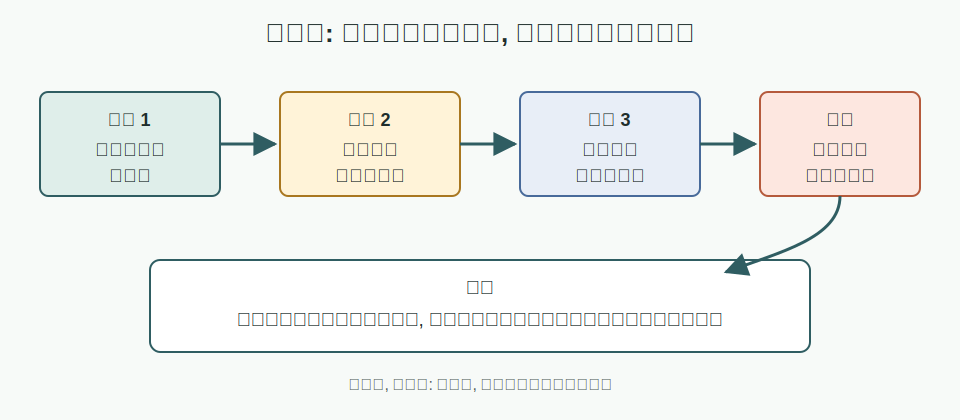
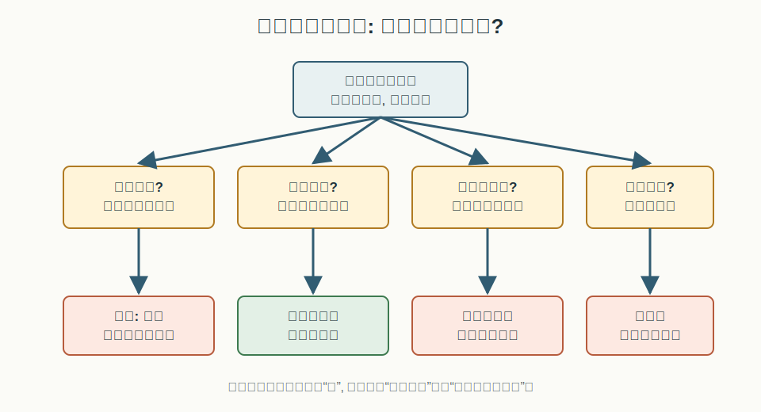
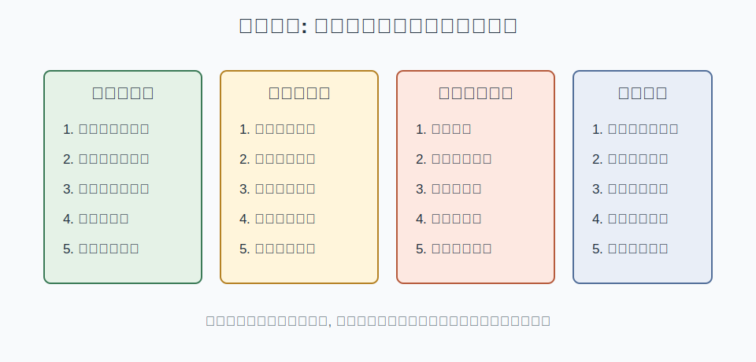

## 散户投资小白金融全品种操盘手册 - 1.1 为什么小白第一课不是赚钱, 而是识别风险  
  
### 作者  
digoal  
  
### 日期  
2026-05-29  
  
### 标签  
金融产品 , 金融工具 , 散户 , 投资小白 , 全品操盘手册  
  
----  
  
## 背景 
> 适用读者: 大陆新手散户, 对股票、基金、ETF、债券、黄金、期货等工具了解有限。
> 本文定位: 投资教育框架, 不构成个性化投资建议。

## 一句话先懂

小白第一课不是学“哪里能赚钱”, 而是学“我到底在承担什么风险, 最坏会怎样, 我能不能活到下一次机会”。

## 本节核心观点

投资不是买一个代码, 而是买一组风险暴露。你买股票, 主要承担企业经营、估值和市场情绪风险; 你买债券基金, 主要承担利率、信用和流动性风险; 你买黄金, 主要承担实际利率、美元和避险情绪变化的风险; 你碰期货、期权、融资融券, 还会叠加杠杆风险。

所以小白的第一目标不是马上赚钱, 而是建立风险语言: 看懂产品、控制仓位、知道什么情况下该停止。因为本金还小、经验还少、信息处理能力还弱, 一次大亏就可能让你失去继续学习的资金和心态。

## 从前提推到结论: 这个观点为什么成立

| 依赖的前提 | 类型 | 为什么依赖它 | 什么情况下可能被推翻 | 推翻后的新结论 |
|---|---|---|---|---|
| 所有投资都有不确定性和潜在损失 | 常量 | 没有这个前提, 就会把投资误解成存款 | 只有无风险兑付且收益确定的产品才接近推翻, 但这类收益通常也低 | 对风险资产仍要先识别亏损来源 |
| 小白的信息、经验和纪律弱于专业参与者 | 慢变量 | 弱势参与者更容易在高波动、复杂规则、情绪行情中犯错 | 经过长期学习、复盘和小仓位训练后会改善 | 能逐步扩大工具范围, 但仍要保留风险边界 |
| 本金和心理承受力是有限资源 | 关键变量 | 亏损过大不仅损失钱, 还会破坏后续执行能力 | 如果资金长期不用、亏损承受力强、规则清楚 | 可以提高风险资产比例, 但不能取消仓位上限 |
| 复利需要长期存活 | 常量 | 亏 50% 需要涨 100% 才回本, 大亏会拖慢学习和复利 | 如果只是极小仓位试错, 影响可控 | 小仓位试错可以存在, 重仓赌错不可接受 |
| 产品越复杂, 风险越可能藏在规则里 | 关键变量 | 杠杆、折溢价、流动性、强赎、保证金都可能让小白误判 | 已能复述规则、测算最坏情况、接受损失 | 才能从“回避”进入“极小仓位学习” |

### 给小白看的推导过程

1. 因为投资的结果不确定, 所以任何“收益想象”都必须先接受一个事实: 可能赚, 也可能亏, 还可能亏得比你想象得快。
2. 因为小白对规则、估值、财报、资金面、杠杆条款都不熟, 所以同样一个产品, 专业投资者看到的是风险结构, 小白容易只看到过去涨幅。
3. 因为本金有限, 所以你不能用一次重仓赌错来换经验。经验可以慢慢积累, 但本金一旦大幅缩水, 后面的学习机会会被压缩。
4. 因为复利的前提是长期存活, 所以第一课必须是识别风险: 先知道自己会怎么输, 再决定有没有资格去赢。
5. 最后得到: 小白每次投资前都要先问三句话: 我买的是什么风险? 最坏亏损我能不能承受? 如果前提错了我怎么退出?

这里的“风险”不是一句空话。它至少包括三层意思: 第一, 价格会波动; 第二, 你可能在错误时间需要用钱, 被迫卖出; 第三, 有些产品的规则会把小错放大成大错, 比如杠杆、保证金、强制平仓、流动性不足。

### 如果前提变了, 结论将发生什么变化

| 变化的前提 | 原结论为什么不再可靠 | 重新推导后的结论 | 小白应如何应对变化 |
|---|---|---|---|
| 你已经能清楚解释产品规则和亏损来源 | “不懂就不碰”可以放宽 | 可以用小仓位做学习型交易 | 先写下买入理由、仓位上限、退出条件 |
| 这笔钱未来 6-12 个月要用 | 风险资产短期波动可能影响刚性支出 | 现金管理优先, 追求流动性和稳定性 | 货币基金、存款、短债等再单独学习 |
| 市场大涨, 身边人都赚钱 | 情绪会放大收益想象, 压低风险感知 | 更要降低首次投入比例 | 先看估值、成交热度、回撤可能性 |
| 产品带杠杆或保证金 | 普通波动会被放大, 甚至出现强平 | 小白默认不作为核心工具 | 先学习规则, 不用生活钱和借来的钱 |
| 你无法接受 10%-20% 的账面波动 | 股票、权益基金、行业 ETF 可能超出承受力 | 先降低权益仓位或暂不参与 | 用模拟记录或小额定投观察心理反应 |

### 权威数据与案例如何验证这条推导链

证监会《证券期货投资者适当性管理办法》把投资者分类、产品或服务分级、经营机构适当性义务作为制度安排, 并要求经营机构了解投资者的财务状况、投资经验、投资目标、风险偏好和可承受损失。这说明“先看风险承受能力, 再看产品匹配”不是鸡汤, 而是资本市场的基础规则。

SEC 的 Investor.gov 把风险解释为投资决策中固有的不确定性和潜在财务损失, 并提醒不同储蓄和投资产品在流动性、增长速度和安全性上不同。FINRA 的投资者教育也强调, 股票、债券、基金和 ETF 都可能亏损, 资产配置、分散和再平衡是管理风险的工具。这些材料共同验证了本节推导: 收益不是单独存在的, 它总是和风险、期限、流动性、承受能力绑在一起。

## 小白必须先分清

第一, 分清“波动”和“永久损失”。价格短期下跌叫波动; 公司退市、债券违约、杠杆爆仓、买到不适合自己的复杂产品, 可能变成永久损失。小白最怕的不是每天涨跌, 而是把可恢复的波动处理成不可恢复的损失。

第二, 分清“看起来安全”和“真的适合”。低波动不等于无风险, 高分红不等于稳赚, 大平台产品不等于适合你。适合的意思是: 你知道它怎么赚钱, 也知道它怎么亏钱; 你承受得起最坏情形; 你不会因为短期波动破坏生活安排。

第三, 分清“学习仓位”和“赚钱仓位”。刚开始接触一个品种, 你不是去证明自己聪明, 而是去收集经验。学习仓位要小到即使做错, 也只留下教训, 不留下伤口。

## 适合什么市场/什么人

这一节适合所有市场环境, 尤其适合三类人: 刚开户的新手, 只买过单一品种的人, 以及在上涨行情里被收益故事吸引的人。

如果市场很热, 本节更重要, 因为热闹会让人忘记风险。如果市场很冷, 本节也重要, 因为恐慌会让人失去耐心, 在不该割肉的时候割肉。识别风险不是预测涨跌, 而是让你知道自己在什么条件下可以参与, 在什么条件下必须退出。

## 怎么操作才不乱

你可以把每次投资前的动作固定成五步。

第一步, 写出产品名称和风险来源。比如“沪深300ETF: 权益风险、市场估值风险、流动性风险、跟踪误差”; “黄金ETF: 黄金价格波动、实际利率变化、汇率或交易成本”; “可转债: 正股波动、转股溢价、信用风险、强赎条款”。

第二步, 写出最大可承受亏损。不是写“我希望不亏”, 而是写“如果亏 10%、20% 或更多, 我是否还能按计划执行”。如果答案是否, 仓位就太大。

第三步, 写出资金期限。三个月后要交学费、还房贷、付装修款的钱, 不应该拿去承担权益类波动。短钱配长波动, 是小白常见大错。

第四步, 写出买入前提。比如“估值不极端、仓位不超过计划、分批买入、不是因为别人说会涨”。前提越模糊, 越容易变成情绪交易。

第五步, 写出退出条件。退出不一定是亏了就卖, 而是当前提消失、仓位失控、产品规则改变、资金用途改变时, 必须重新评估。

## 实操例子: 从输入到动作框架

假设你看到一个行业 ETF 最近一个月涨了 20%, 社区里很多人说“还能翻倍”。小白的错误反应是直接问: 现在还能不能买? 本书要求你换成风险问题。

先问: 它买的是什么? 如果它只集中在一个高波动行业, 那你承担的是行业景气、估值回落、政策变化、资金情绪退潮的风险。

再问: 如果买入后回撤 25%, 我会怎么办? 如果你会恐慌卖出, 说明仓位不该大; 如果这笔钱三个月后要用, 说明不该用这笔钱参与。

再问: 我有没有退出条件? 可以写成教育框架: 只用总资金的很小一部分观察; 分批而不是一次性买; 如果买入理由只剩“别人还在喊涨”, 就不加仓; 如果行业逻辑或市场环境变化, 重新评估。

这个例子不是推荐任何行业 ETF, 而是示范: 从“能不能赚”切换到“风险是否匹配”。只要这个切换完成, 你就已经比追涨杀跌前进了一步。

## 举一反三: 换一个品种/环境时怎么迁移

换成债券基金, 你照样先问风险: 它怕利率上行吗? 久期多长? 有没有信用风险? 会不会因为市场赎回导致净值波动?

换成黄金, 你先问: 它不产生利息和利润, 价格主要来自风险重估、实际利率、美元和避险需求变化。如果只是因为短期大涨才买, 你买到的可能是情绪高点。

换成期货或期权, 你先问: 是否有杠杆? 是否可能亏得比想象更快? 是否会被强制平仓? 如果这些问题说不清, 小白的默认答案就是不碰, 至少不能用真实大资金碰。

同一套方法可以迁移到全书所有品种: 先识别风险暴露, 再判断市场环境, 再确定仓位上限, 最后才谈买卖动作。

## 风险在哪里

最大的风险不是你少赚了一段行情, 而是你在不懂的时候重仓、借钱、满仓、碰杠杆, 最后把可学习的错误变成不可恢复的错误。

第二个风险是把“风险测评”当成形式。券商或平台给出的适当性匹配, 不等于产品不会亏, 也不等于适合你重仓。适当性只是门槛, 不是盈利保证。

第三个风险是只看历史收益。过去一年涨得多, 只能说明过去涨得多, 不能自动推出未来还会涨。你必须问: 推动上涨的前提还在不在? 如果不在, 结论就要改。

## 常见错误

1. 听到别人赚钱, 就把别人的结果当成自己的能力。
2. 只问收益率, 不问最大回撤、流动性和退出条件。
3. 用短期要用的钱买长期波动资产。
4. 把低价当安全, 把高分红当保本, 把大涨当确定性。
5. 觉得小仓位没意思, 一上来就重仓验证判断。
6. 做错后不复盘, 只换一个新的热点继续追。

## 执行清单

每次买入前, 你至少完成这张清单:

| 问题 | 能写清才继续 |
|---|---|
| 我买的到底是什么资产? | 股票、债券、商品、现金流资产、衍生品还是组合工具 |
| 它主要靠什么赚钱? | 企业增长、利息、信用利差、商品涨价、汇率、估值变化等 |
| 它主要会因为什么亏钱? | 市场下跌、利率变化、违约、流动性差、杠杆、情绪退潮等 |
| 最坏情况下我亏多少还能睡得着? | 用金额和比例写出来 |
| 这笔钱多久不用? | 短钱不配长波动 |
| 我的仓位上限是多少? | 新品种先用学习仓位 |
| 什么情况下我承认前提错了? | 写出退出或复盘条件 |

## 本节小结

小白第一课不是赚钱, 是识别风险。赚钱是市场给的结果, 风险识别是你能训练的能力。你先学会看懂自己买的风险, 才能在后面的章节里学习现金、ETF、股票、转债、黄金、REITs、QDII、港股、美股、期权和期货。

本书后面每讲一个品种, 都会回到同一个底层问题: 这个工具暴露了什么风险? 适合什么市场? 仓位上限是多少? 前提变化后怎么重新推导? 只要这套问题变成习惯, 你就不再是被行情牵着走的新手。

## 参考资料

- 中国证监会, 《证券期货投资者适当性管理办法》, 2016-12-12 发布, 2017-07-01 施行: https://www.csrc.gov.cn/csrc/c101939/c1045348/content.shtml
- 中国证监会, 《证监会发布<证券期货投资者适当性管理办法>》, 2016-12-16: https://www.csrc.gov.cn/csrc/c100028/c1001611/content.shtml
- SEC Investor.gov, What is Risk?: https://www.investor.gov/introduction-investing/investing-basics/what-risk
- FINRA, Risk: https://www.finra.org/investors/investing/investing-basics/risk
- FINRA, Asset Allocation and Diversification: https://www.finra.org/investors/investing/investing-basics/asset-allocation-diversification
  
  
#### [PostgreSQL 解决方案集合](../201706/20170601_02.md "40cff096e9ed7122c512b35d8561d9c8")
  
  
#### [德哥 / digoal's Github - 公益是一辈子的事.](https://github.com/digoal/blog/blob/master/README.md "22709685feb7cab07d30f30387f0a9ae")
  
  
#### [About 德哥](https://github.com/digoal/blog/blob/master/me/readme.md "a37735981e7704886ffd590565582dd0")
  
  

  
