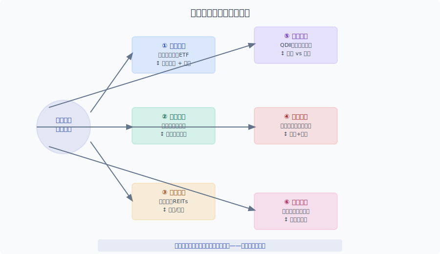
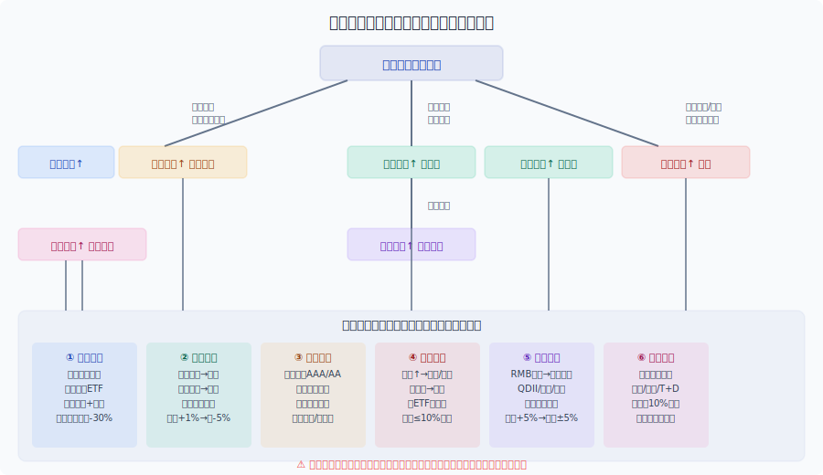
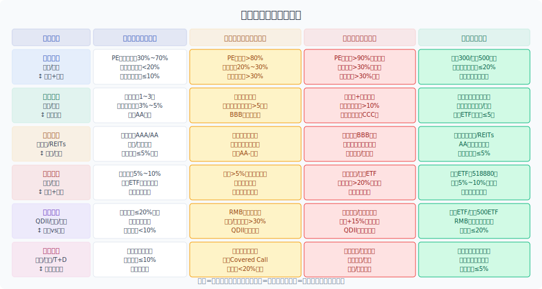

## 散户投资小白金融全品种操盘手册 - 1.2 金融产品的六大底层风险：权益、利率、信用、商品、汇率、杠杆
  
### 作者  
digoal  
  
### 日期  
2026-05-29  
  
### 标签  
金融产品 , 金融工具 , 散户 , 投资小白 , 全品操盘手册  
  
----  
  
## 背景 

> 适用读者: 投资零基础小白，刚开证券账户，想搞清楚"我买的到底是什么风险"
> 本文定位: 投资教育框架，不构成个性化投资建议。

## 一句话先懂

所有金融产品，无论包装成股票、基金、债券还是理财，本质上都是在对赌六种不同的不确定性——**这六种不确定性叫做底层风险**。记住它们，比记住十个产品名字更重要。

## 本节核心观点

**任何金融产品都可以拆解成这六大底层风险的排列组合：权益风险、利率风险、信用风险、商品风险、汇率风险、杠杆风险。识别你买的产品在赌什么风险，是不亏钱的第一步。**

## 从前提推到结论：这个观点为什么成立

| 依赖的前提 | 类型 | 为什么依赖它 | 什么情况下可能被推翻 | 推翻后的新结论 |
|---|---|---|---|---|
| 金融资产的价格由风险驱动 | 常量 | 金融资产的定价基础是风险溢价，不知道赌什么就不知道值多少价 | 无（这条是金融市场的基本公理） | — |
| 风险可以分类 | 常量 | 复杂产品可以拆解为简单风险单元，方便理解和管控 | 无 | — |
| 小白能区分这六种风险 | 关键变量 | 如果分不清，就无法做品种选择和仓位控制 | 术语太抽象，小白无法建立直觉 | 先从ETF和货币基金开始，再扩展 |
| 宏观环境会变化 | 慢变量 | 同一种产品在不同宏观环境下主要矛盾不同 | 经济进入通缩/通胀/汇率战 | 风险排序随之改变 |



### 给小白看的推导过程

1. **因为"任何金融产品都有风险溢价"**——这是金融市场的基本公理。买一个产品就要承担它对应的风险，风险越高，潜在回报也越高。

2. **所以每种产品背后一定对应着某种底层风险驱动**——股票涨，因为企业盈利和估值；债券跌，因为利率上升；黄金波动，因为美元强弱。这不是偶然，是因果。

3. **进一步，市场经过几十年总结，发现全市场的风险来源只有六种**——权益（股票）、利率（债券）、信用（借钱还不起）、商品（黄金石油）、汇率（外币）、杠杆（借钱炒股）。所有复杂产品都是这六种的排列组合。

4. **最后得到：小白第一课不是记产品，而是记这六种风险长什么样**——记住之后，任何产品拿到手，你都可以问："它在赌哪种风险？"这个问题答对了，你就不会买到一个完全看不懂的东西。

### 如果前提变了，结论将发生什么变化

| 变化的前提 | 原结论为什么不再可靠 | 重新推导后的结论 | 小白应如何应对变化 |
|---|---|---|---|
| 市场出现第七种全新风险 | 六类风险框架是基于历史经验的总结，新风险可能出现 | 关注新型风险（如ESG风险、碳风险），将它映射到已有框架或单独管理 | 暂不参与自己不理解的创新产品 |
| 你的认知不够区分这六类 | 识别框架正确，但执行不了 | 先从最简单的产品（货币基金、宽基ETF）开始，用实操代替理论 | 降低预期，先学会区分两类资产：保本 vs 波动 |
| 宏观环境重大变化（例如通胀失控） | 某些风险会从次要矛盾变成主要矛盾 | 商品风险和汇率风险权重上升，权益风险下降 | 减少股票仓位，增加黄金和短债配置 |

### 权威数据与案例如何验证这条推导链

**历史数据支撑：** A股大盘指数（沪深300）在2008年、2015年、2018年三次大幅回撤（-72%、-43%、-33%），核心驱动都是权益风险——企业盈利下滑 + 估值收缩同时发生。这说明"股票下跌"不是单一现象，背后是明确的权益风险在主导。

**债券数据：** 2022年11月，债市出现大幅调整（中证全债指数单月下跌-1.58%），原因不是信用违约，而是利率风险——当时市场预期防疫政策调整后经济复苏，利率上行压力导致债券价格下跌。这验证了债券主要赌的是利率风险而非信用风险。

**信用风险案例：** 2022年房地产美元债违约潮（恒大、融创等），相关债券价格从面值100元跌至10~20元，核心是信用风险而非市场风险。这类资产在正常时期看起来像"高收益"，但危机来临时才知道赌的是信用下沉。

## 小白必须先分清

### 六个风险的通俗定义（记住这六句话）

1. **权益风险**：买股票/基金，就是赌企业盈利和估值一起涨。经济不好、企业赚钱变难，股价就跌。

2. **利率风险**：买债券或债券基金，赌的是利率向下走。利率上升，债券价格下跌，你手里的债就不值钱了。

3. **信用风险**：买企业债/城投债/部分理财，赌的是借钱的人还得起。还不起了，就是"违约"，血本可能归零。

4. **商品风险**：买黄金、石油、农产品，赌的是这些东西的供需失衡或美元走弱。跟企业赚不赚钱无关，跟国际局势、天气、美元强弱相关。

5. **汇率风险**：买港股、美股、QDII基金，赌的是人民币相对美元贬值。人民币升值，美股资产换回人民币就缩水。

6. **杠杆风险**：借钱买资产（融资）、买期权期货，收益和亏损不再是线性关系——可能赚一块钱也可能亏三块钱，血本无归在极端情况下是真实的。

## 适合什么市场/什么人

**适合场景：**
- 刚开户，想搞清楚自己买的ETF/基金在赌什么风险
- 别人推荐产品时，能问出"这个主要风险是啥"
- 构建组合时，能识别自己在哪些风险上暴露过多

**不适合场景：**
- 已经深陷某单一风险仓位过重（比如全仓煤炭股，却不知道自己在赌商品风险）
- 追求高收益但不懂杠杆的情况下借钱炒股（杠杆风险）
- 完全不关注汇率的情况下大量买入QDII美股基金（汇率风险）

**六种风险与常见产品的对应关系（小白优先从左边开始）：**

| 产品 | 主要风险 | 次要风险 | 小白适合度 |
|---|---|---|---|
| 货币基金 | 利率风险（极低） | 几乎无 | ★★★★★ |
| 短债基金 | 利率风险 | 信用风险 | ★★★★☆ |
| 宽基ETF（沪深300） | 权益风险 | 利率风险 | ★★★★☆ |
| 黄金ETF | 商品风险 | 汇率风险 | ★★★★☆ |
| 高股息股票 | 权益风险 + 利率风险 | 信用风险 | ★★★☆☆ |
| 可转债 | 权益风险 + 信用风险 | 利率风险 | ★★★☆☆ |
| 港股/美股ETF | 权益风险 + 汇率风险 | 利率风险 | ★★★☆☆ |
| 行业ETF（煤炭/钢铁） | 商品风险 + 权益风险 | 信用风险 | ★★☆☆☆ |
| 企业债/城投债 | 信用风险 | 利率风险 | ★★☆☆☆ |
| 杠杆ETF/期权/期货 | **杠杆风险** | 其他所有 | ★☆☆☆☆ |



## 怎么操作才不乱

### 第一步：产品-风险对照（拿到任何产品先问这个问题）

```
我买的这个产品，它主要赌的是哪一种底层风险？
　　↓
如果这个问题答不上来，这个产品就先不要重仓
```

### 第二步：风险数量扫描（一个产品可能同时叠加多个风险）

每叠加一种风险，这个产品的复杂度就上升一层。小白应该优先选择**单一风险主导**的产品。

- 货币基金 = 利率风险（简单）
- 短债基金 = 利率风险 + 少量信用风险（较简单）
- 可转债 = 权益风险 + 利率风险 + 信用风险（三重，小白阶段少碰）
- 黄金ETF = 商品风险 + 汇率风险（双重，可以少量配置）

### 第三步：检查自己的风险暴露是否过于集中

投资组合健康的前提是：**没有哪种风险占据你总资产的50%以上**（除非你完全理解并接受了那个风险）。

## 实操例子：从输入到动作框架

**场景：** 你的朋友推荐你买一只主要投资于能源煤炭行业的ETF，说"最近资源股很火"。

**你的操作框架：**

```
输入：
- 产品：能源煤炭行业ETF
- 朋友说：最近很火

你的风险分析步骤：
① 问：这个ETF主要赌什么风险？
   → 答：商品风险（能源价格）+ 权益风险（能源企业盈利）
② 问：这个风险的驱动因素是什么？
   → 答：全球能源供需、美元强弱、地缘政治、中国经济周期
③ 问：这些驱动因素当前是什么状态？
   → 答：需要你自己查——能源价格趋势、美元走势、经济数据
④ 问：你了解这些因素吗？如果不了解怎么办？
   → 答：降仓位到总资产的5%以下，或换成宽基ETF
⑤ 问：这个产品叠加了几重风险？
   → 答：商品+权益 = 双重风险，复杂度上升
⑥ 结论：可以少量配置（≤10%），但不能重仓，更不能作为唯一的进攻仓位

动作：不下重手，先观察
```

## 举一反三：换一个品种/环境时怎么迁移

**案例A：从A股ETF换成港股ETF**
- A股ETF主要风险：权益风险（国内经济 + 企业盈利）
- 港股ETF多了什么风险：汇率风险（港币盯住美元，人民币vs港币有波动）
- 迁移方法：先问"港股ETF对我整体组合的汇率风险贡献是正还是负"，再决定是否配置

**案例B：从债券基金换成黄金ETF**
- 债券基金主要风险：利率风险
- 黄金ETF主要风险：商品风险（美元 + 实际利率）
- 迁移方法：这是完全不同的两种风险来源，债券下跌时黄金可能上涨——黄金可以作为债券的"对冲"配置，但两类资产的决策逻辑不同，需要分别判断

**案例C：从宽基ETF换成行业ETF**
- 宽基ETF（沪深300）：覆盖多行业，权益风险的"平均数"
- 行业ETF（半导体、医疗）：同样的权益风险，但集中度更高，波动更大
- 迁移方法：行业ETF需要更强的行业判断能力，小白阶段建议用宽基ETF替代行业ETF，等积累足够经验再扩展

## 风险在哪里

**最大的风险不是市场，而是不知道自己买的是什么。**

小白在六大风险上最容易犯的错误：

| 风险 | 错误描述 | 后果 |
|---|---|---|
| 权益风险 | 牛市顶点全仓股票，不知道估值已经很高 | 大幅回撤，心态崩溃，割肉离场 |
| 利率风险 | 经济复苏时持有长久期债券，不知道利率要上行 | 债券亏损，账面缩水 |
| 信用风险 | 被高收益企业债吸引，不知道自己在赌民企信用 | 违约发生，本金大幅损失 |
| 商品风险 | 追涨黄金，不知道自己实际在赌美元走弱 | 美元强势时黄金反而下跌 |
| 汇率风险 | 全仓港股ETF，人民币大幅升值时亏损 | 汇率侵蚀股票收益 |
| 杠杆风险 | 融资买股票，不知道强平线在哪里 | 血本无归，倒欠券商钱 |



## 常见错误

**错误1："我知道这个基金的风险很低"**
- 很多小白看"债券基金"就觉得安全，但债券基金在利率大幅上行时可能单月跌2%~3%，如果不知道这是利率风险驱动的，就会恐慌性赎回，割肉在最低点。

**错误2："黄金是保值的，所以买了就不用管"**
- 黄金不是无风险的，它赌的是美元强弱、实际利率、避险情绪。2022年美联储激进加息，美元强势，黄金反而从2070美元跌到1618美元（-22%）。不知道底层风险，"保值"就变成了"高买低卖"。

**错误3："港股便宜，多买一点没关系"**
- 港股ETF除了权益风险，还叠加了汇率风险（港币/美元）。2019年后港股经历多轮下跌，许多小白以为是"估值底部"，结果不知道港股同时承受着中国经济下行 + 港币联系汇率制度压力的双重冲击。

**错误4："我买的货币基金，应该不会亏"**
- 货币基金历史上极少亏损，但2022年有个别货币基金因配置了信用等级较低的债券，出现了短暂跌破净值的情况（"货币基金亏损"）。根源是它比看起来多承担了一点信用风险。

**错误5："这个ETF带杠杆，日内交易能翻倍"**
- 带杠杆的ETF是给专业投资者日内短线操作使用的，对小白而言，杠杆ETF有衰减效应（时间价值损耗），长期持有基本必然亏损。不理解杠杆风险，就不要碰这类产品。

## 执行清单

**拿到任何一个产品，请逐项检查：**

- [ ] 我能说出来这个产品主要赌的是六种风险里的哪一种或哪几种
- [ ] 我知道这个风险的驱动因素是什么（例如：利率风险看央行政策）
- [ ] 我没有把超过50%的资产压在同一个风险上
- [ ] 我知道自己在这个风险上的潜在最大亏损是多少
- [ ] 我没有借钱（杠杆）买这个产品
- [ ] 如果这个产品突然下跌30%，我知道是因为什么风险在发作
- [ ] 我配置的每一个产品，我都能在5分钟内解释它为什么在我的组合里

**六种风险速查卡（打印或保存）：**

| 风险 | 关键词 | 典型受伤场景 |
|---|---|---|
| 权益风险 | 股票、基金、ETF | 经济下行、估值泡沫破裂 |
| 利率风险 | 债券、债券基金、银行理财 | 利率上升周期 |
| 信用风险 | 企业债、城投债、高收益债 | 违约潮、降级潮 |
| 商品风险 | 黄金、石油、农产品、商品基金 | 美元强势、通缩 |
| 汇率风险 | 港股、美股、QDII、美元理财 | 本币大幅升值 |
| 杠杆风险 | 融资、期权、期货、杠杆ETF | 行情反向、强制平仓 |

## 本节小结

1. **六种底层风险是所有金融产品的DNA**——任何产品，不管名字多花哨，都可以拆解成这六种风险的排列组合。

2. **知道自己在赌什么风险，比知道买什么产品更重要**——产品会变，风险不会变。掌握风险框架，任何新产品到手都能快速判断。

3. **不同风险在不同宏观环境下主导地位不同**——经济下行时权益风险主导，利率上行时利率风险主导，通胀时商品风险主导。小白要学会判断当前主要矛盾。

4. **杠杆风险是六大风险中最危险的一种**——它的非线性收益特征意味着"赚小赔大"是常态，小白阶段的原则是"不碰"。

5. **识别风险是投资纪律的起点，不是投资的全部**——识别之后，还需要仓位控制、止损纪律、心态管理，这些将在后续章节展开。

## 参考资料

- 中国证券投资基金业协会（AMAC）：《公募基金投资者教育指引》，2023年
- 深圳证券交易所：《ETF投资手册》，2024年更新版
- 中国人民银行：《中国金融稳定报告》，2023年
- 全球风险管理协会（GARP）：《投资者风险教育框架》
- 美国CFA Institute：《全球投资业绩标准（GIPS）》相关风险披露章节
- 中国期货市场监控中心：《期货投资者适当性教育材料》 
  
#### [PostgreSQL 解决方案集合](../201706/20170601_02.md "40cff096e9ed7122c512b35d8561d9c8")
  
  
#### [德哥 / digoal's Github - 公益是一辈子的事.](https://github.com/digoal/blog/blob/master/README.md "22709685feb7cab07d30f30387f0a9ae")
  
  
#### [About 德哥](https://github.com/digoal/blog/blob/master/me/readme.md "a37735981e7704886ffd590565582dd0")
  
  

  
