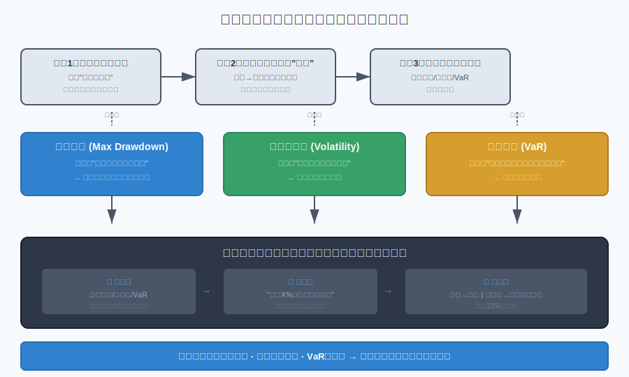
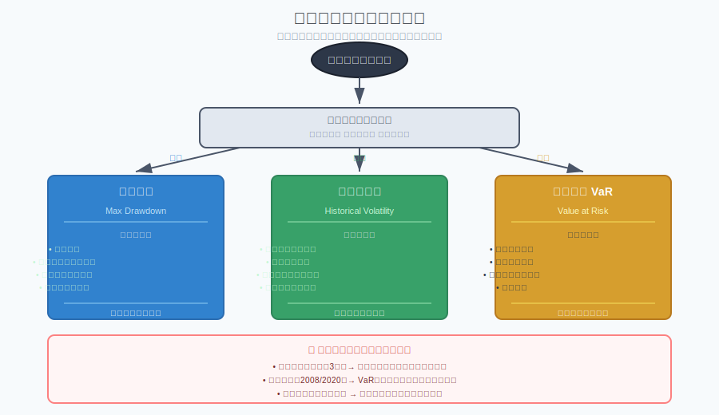
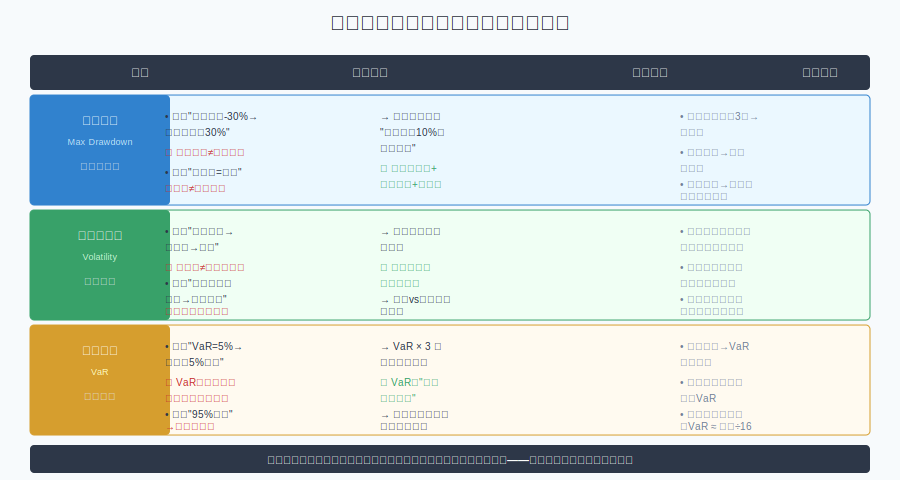

## 散户投资小白金融全品种操盘手册 - 1.3 如何量化风险 —— 从小白的角度理解风险度量
  
### 作者  
digoal  
  
### 日期  
2026-05-29  
  
### 标签  
金融产品 , 金融工具 , 散户 , 投资小白 , 全品操盘手册  
  
----  
  
## 背景 


> 适用读者: 投资零基础小白，已认识六大底层风险，想知道"这个产品到底有多危险"
> 本文定位: 投资教育框架，不构成个性化投资建议。

## 一句话先懂

识别风险是知道"有什么风险"，量化风险是知道"有多大"——两者的区别就像"知道火灾隐患"和"知道烧到哪个程度会死人"。

## 本节核心观点

**量化风险的三个工具——最大回撤、历史波动率、风险价值（VaR）——是小白可以用简单数字判断"这个产品我能不能承受"的入门级标尺。**

## 从前提推到结论：这个观点为什么成立

| 依赖的前提 | 类型 | 为什么依赖它 | 什么情况下可能被推翻 | 推翻后的新结论 |
|---|---|---|---|---|
| 历史可以预示未来 | 常量 | 风险度量基于历史数据，假设未来风险特征与历史相似 | 市场结构发生根本性变化（如量化主导） | 用更保守的参数或定性判断补充 |
| 小白能理解三个指标的含义 | 关键变量 | 量化工具只有被理解才能发挥作用 | 指标太抽象，小白只会背数字 | 先用"最大亏损忍受度"这个主观指标替代 |
| 产品历史足够长（3年+） | 慢变量 | 数据越充分，指标越可靠 | 新产品或short history | 用近似品或行业平均作为参考 |
| 风险可以比较 | 常量 | 不同产品用同一把尺子量，才能做跨品种比较 | 极端市场事件使比较失效 | 回到"保命不亏钱优先"的原则 |



### 给小白看的推导过程

1. **因为"识别风险只是定性，知道多大才是定量"**——上一节我们学会了问"产品在赌什么风险"，但只知道方向不知道幅度，就像知道"有火灾隐患"却不知道"烧到客厅还是整栋楼"。

2. **所以需要一把尺子来量"有多大"**——金融行业花了几十年设计风险度量工具，对小白最实用的只有三把尺子：**最大回撤**（跌多惨）、**历史波动率**（晃多厉害）、**风险价值VaR**（最坏情况发生的概率）。

3. **进一步，这三个指标分别回答三个不同的问题**——
   - 最大回撤："如果我买进之后运气最差，这个产品最多会跌多少？"
   - 历史波动率："这个产品日常波动是±2%还是±10%？"
   - VaR："在正常市场条件下，我有95%的把握，一天内亏损不会超过多少？"

4. **最后得到：小白只需要记住"最大回撤看底部，波动率看日常，VaR看边界"**——拿到任何产品，先问这三个数字够不够大，再决定自己能不能承受。

### 如果前提变了，结论将发生什么变化

| 变化的前提 | 原结论为什么不再可靠 | 重新推导后的结论 | 小白应如何应对变化 |
|---|---|---|---|
| 产品太新，历史数据不足 | 三个指标都依赖历史，新产品没有"历史" | 用同类型产品近似替代，或定性判断为主 | 暂不投新品，等至少1年数据后再评估 |
| 市场进入极端状态（危机） | 正常市场假设失效，VaR低估风险，波动率飙升 | 三个指标都需要重新评估，用最大回撤做最保守估计 | 减仓或撤出，减少在险资产比例 |
| 小白认知不够，无法解读指标 | 指标存在但无法转化为决策 | 用"如果这个产品明天跌10%我会不会睡不着"这个主观测试替代 | 不碰复杂的量化产品，只用主观风险容忍度判断 |

### 权威数据与案例如何验证这条推导链

**最大回撤数据验证：** 沪深300指数历史上三次主要股灾的最大回撤分别为：2008年（-72.3%）、2015年（-43.4%）、2018年（-31.2%）。这三个数字告诉小白——如果你在2007年高点买了沪深300指数基金，最多会亏损72%。这个数字帮助小白建立"我能承受多大亏损"的心理预期。

**波动率验证：** 根据Wind数据，沪深300指数历史年化波动率约20%~25%，意味着日常波动区间大约在±20%以内（每天约±1%）。相比之下，创业板指数波动率高达30%~35%，货币基金波动率仅0.5%~1%。波动率让小白理解"买这个产品每天看盘的心情"。

**VaR案例：** 假设某银行理财产品的1年期VaR为5%（95%，1天），意味着在正常市场条件下，有95%的把握，明天这个产品不会亏损超过5%。换句话说，平均20天（1个月）左右可能会遇到一次超过5%的下跌。知道这个，小白不会在第一次看到单日亏损5%时就恐慌性赎回。

## 小白必须先分清

### 三个指标的通俗定义

**最大回撤（Max Drawdown）**
- 通俗理解：从历史最高点到最低点，这个产品最多跌过多少
- 小白记住：最大回撤就是"历史上最惨的时候你能不能扛住"
- 数字例子：某基金最大回撤-40%，意味着如果你在最高点买入，最坏情况下账户会缩水40%

**历史波动率（Historical Volatility）**
- 通俗理解：这个产品价格每天晃来晃去的幅度
- 小白记住：波动率高就是"心跳快"，每天看盘会很刺激
- 数字例子：波动率20%意味着一年中大约有2/3的时间，价格在±20%范围内波动

**风险价值（Value at Risk / VaR）**
- 通俗理解：在正常市场条件下，今天最多可能亏多少
- 小白记住：VaR就是"正常情况下的一天最大亏损"
- 数字例子：VaR（95%，1天）=2%，意味着正常市场下100天中有95天，单日亏损不会超过2%

### 三个指标的速查对比

| 指标 | 回答的问题 | 对小白最有用的场景 | 简单判断标准 |
|---|---|---|---|
| 最大回撤 | "最坏情况会跌多少？" | 设止损线、评估组合扛跌能力 | 最大回撤>30%的产品，小白阶段少碰 |
| 历史波动率 | "平时波动有多剧烈？" | 评估自己每天看盘会不会心态崩溃 | 波动率>25%的产品，属于高波动，需要心理准备 |
| VaR | "正常情况下一天最多亏多少？" | 评估持仓压力、设置日内止损线 | VaR>3%的产品，单日亏损可能性不可忽视 |

## 适合什么市场/什么人

**适合场景：**
- 持有基金或理财产品，想知道自己买的产品的真实风险等级
- 比较多个同类产品，不知道哪个更"稳"
- 设置止损线或仓位上限，不知道怎么定参考数字

**不适合场景：**
- 已经持仓，想用量化指标来解释短期盈亏（短期盈亏更多由市场情绪驱动）
- 在极端市场条件下（2008年、2020年3月），仍相信历史指标能准确预测未来
- 将VaR误认为是"最大可能亏损"（VaR是正常市场条件下的最大亏损，极端市场下可能远超这个数字）



## 怎么操作才不乱

### 第一步：查这三个数字（在产品详情页或基金招募说明书里找）

- 找到"最大回撤"——通常在产品风险等级说明里
- 找到"年化波动率"——基金销售平台的产品详情页有
- 找到"VaR"——银行理财或结构化产品会披露，公募基金一般不直接披露VaR，可用波动率推算

### 第二步：用自己的"亏损忍耐度"对照这三个数字

问自己一个问题：**"如果这个产品明天跌了X%，我会不会睡不着？"**

- X% = 最大回撤 → 你能承受的最坏情况
- X% = VaR × 3 → 正常市场下单日最大亏损（VaR的3倍是经验安全边界）
- X% = 年化波动率 ÷ √252（√252≈16）→ 日均波动，你每天实际感受到的波动

### 第三步：如果三个数字都超过你的忍耐度，降仓位或换产品

**小白通用原则：**
- 能睡着的波动率：年化波动率 ≤ 15%（日波动约1%）
- 能接受的最大回撤：总资产的10%~20%以内
- 单日最大亏损容忍：≤ 3%（对小白而言，3%的单日亏损已经是较大冲击）

## 实操例子：从输入到动作框架

**场景：** 你在选两只债券基金，A基金最大回撤-8%，年化波动率6%；B基金最大回撤-15%，年化波动率12%。你的风险容忍度是"最大亏损不超过20%"，单日最大亏损容忍是"5%"。

**操作框架：**

```
输入：
- A基金：最大回撤-8%，波动率6%
- B基金：最大回撤-15%，波动率12%
- 你的容忍度：最大亏损20%，单日最大5%

分析步骤：
① A基金最大回撤8% < 20% ✓（通过）
   B基金最大回撤15% < 20% ✓（通过）

② A基金日波动率 ≈ 6%÷16 ≈ 0.375%/天（日常几乎无感）
   B基金日波动率 ≈ 12%÷16 ≈ 0.75%/天（日常小额波动）

③ 推算VaR（简化）：A基金≈1.5%/天，B基金≈3%/天
   → B基金单日最大亏损估算约3%，接近你的容忍上限

④ 结论：A基金更适合小白稳健需求；B基金可以配置但不超过总资产30%

动作：先用A基金建立底仓，如果想增加收益弹性再配B基金
```

## 举一反三：换一个品种/环境时怎么迁移

**案例A：从债券基金迁移到股票基金**
- 债券基金：最大回撤约5%~10%，波动率约3%~8%
- 股票基金：最大回撤约30%~50%，波动率约20%~30%
- 迁移方法：先把股票基金仓位控制在总资产的20%以下，用"最大回撤承受测试"确认自己在最坏情况下会不会心态崩溃

**案例B：从国内ETF迁移到港股/美股ETF**
- 相同点：权益风险框架不变，最大回撤和波动率仍然适用
- 新增考虑：汇率风险会叠加到VaR和最大回撤里——港股ETF的实际最大回撤可能比历史数据更大，因为港币/人民币汇率波动在极端情况下会叠加
- 迁移方法：用"汇率调整后的最大回撤"做估算：将国内ETF的回撤数字加5%~10%作为港股ETF的风险参考

**案例C：从单只基金迁移到基金组合**
- 单只基金看单个指标，组合要看"组合整体最大回撤"
- 迁移方法：用简单平均法估算组合整体波动率：假设两只等权重基金波动率分别为10%和20%，组合波动率约15%
- 注意：组合内部相关性很重要——两只走势高度相关的基金组合，风险不会分散，反而叠加

## 风险在哪里

**最大的误区是把"历史最大回撤"当成"未来最大回撤"。**

| 误区 | 为什么会错 | 正确做法 |
|---|---|---|
| "这个基金最大回撤只有-10%，很安全" | 最大回撤是历史数据，不代表未来不会跌更多 | 用"如果再跌10%我怎么办"做压力测试 |
| "波动率低就是低风险" | 低波动可能是因为产品本身在"横盘"，也可能是流动性差导致的价格操纵，不代表真的无风险 | 看最大回撤 + 看产品规模 |
| "VaR就是我的最大亏损" | VaR是正常市场条件下的最大亏损，5%的一天最大亏损对应的是"平均20天一次的极端日"，不是"最多亏5%" | 用"VaR × 3"做安全边界，就是最坏情况的近似估算 |
| "我比较了波动率，这个产品很稳" | 波动率只看价格波动，不看实际亏损——货币基金波动率接近零，但实际购买力会因为通胀缩水 | 区分"价格波动风险"和"购买力贬值风险" |



## 常见错误

**错误1："我看了最大回撤-30%，所以我准备亏30%就好了"**
- 最大回撤是历史最坏点，不是你买入后必然发生的最坏点。你的买入时机可能恰恰是新一轮下跌的起点。正确理解：最大回撤告诉你"历史上这个产品最惨过"，不是"这次最惨会是"。

**错误2："波动率低，所以我全仓进了"**
- 波动率低只代表日常波动小，不代表不会发生一次性大幅下跌。债券基金在利率突变时可能单日跌2%~3%（相当于债券基金几个月的日常波动）。波动率是"日常心跳"，不是"极端压力测试"。

**错误3："我的VaR是5%，所以最多亏5%我就撤""**
- VaR（95%，1天）=5%意味着"正常市场下100天中95天单日亏损不超过5%"，另外5天可能超过5%。如果把VaR当成止损线，你会频繁止损在市场噪音里。VaR是"正常情况参考"，不是"必须止损的门槛"。

**错误4："我这个产品历史最大回撤只有-10%，A产品有-30%，所以我选这个"**
- 如果两个产品风险类型不同（债券基金 vs 股票基金），最大回撤的比较没有意义——它们赌的根本不是同一种风险。比较必须在同一风险类型内进行。

**错误5："我算了一下，我的组合波动率是12%，很稳健"**
- 组合波动率是各资产波动率的加权平均，但忽略了资产间的相关性。如果组合里各资产走势高度相关（同时涨同时跌），实际风险会比数字显示的更高。组合分散化效果只有在资产间相关性低的时候才显著。

## 执行清单

**拿到任何一个产品，请逐项完成：**

- [ ] 我找到了这个产品的最大回撤数字，并问自己"如果跌到这个幅度，我会怎么办"
- [ ] 我找到了年化波动率，并对照自己的看盘心态承受能力（波动率>25%意味着每天看盘会有明显刺激感）
- [ ] 我用VaR做了单日最大亏损的安全边界估算（VaR × 3 ≈ 最坏情况参考）
- [ ] 三个数字都确认后，我问了自己一个问题："这些数字代表的风险，是我愿意且能够承受的吗？"
- [ ] 确认完数字后，我没有立刻全仓，而是先下了10%试探仓位
- [ ] 我知道这三个指标是历史数据，在极端市场条件下会失效，所以我留了"保命钱"

**三个指标速查记忆卡：**

| 指标 | 一句话记住 | 对应动作 |
|---|---|---|
| 最大回撤 | "历史上最惨的时候跌了多少" | 设止损线，评估最坏情况承受力 |
| 历史波动率 | "平时晃得厉不厉害" | 评估每天看盘会不会心态崩溃 |
| VaR | "正常情况下今天最多亏多少" | 做日间止损的参考边界 |

## 本节小结

1. **识别风险是定性，量化风险是定量**——知道"有什么风险"只是第一步，知道"有多大"才能做仓位决策和止损纪律。

2. **三个指标各有分工**——最大回撤看底部（最坏情况），波动率看日常（每天感受），VaR看边界（正常市场下单日最大亏损）。

3. **小白只需要记住"最大回撤看底部，波动率看日常，VaR看边界"**——三个指标配合使用，才能建立完整的风险量化认知。

4. **三个指标都是历史数据，都有局限性**——最大回撤不代表未来，波动率不看极端事件，VaR只在正常市场下有效。理解局限性比记住数字更重要。

5. **风险量化的目的是匹配自己的风险承受能力**——不是找到"最安全的产品"，而是找到"与自己的忍耐度匹配的产品"。一个产品即使各项指标看起来"很危险"，只要你完全理解并能承受，它就可以是合适的。

## 参考资料

- 中国证券投资基金业协会（AMAC）：《公募基金投资者教育指引》，2023年
- Wind资讯：沪深300历史波动率与最大回撤数据，2005-2024年
- GARP（全球风险管理协会）：《金融风险管理基础》投资者教育材料
- 中国人民银行：《中国金融稳定报告》，2022年、2023年
- Jorion, P.：《金融风险管理手册》（中文译本），关于VaR模型的经典教材
- 万得（Wind）基金评价体系：基金风险指标计算说明文档
  
#### [PostgreSQL 解决方案集合](../201706/20170601_02.md "40cff096e9ed7122c512b35d8561d9c8")
  
  
#### [德哥 / digoal's Github - 公益是一辈子的事.](https://github.com/digoal/blog/blob/master/README.md "22709685feb7cab07d30f30387f0a9ae")
  
  
#### [About 德哥](https://github.com/digoal/blog/blob/master/me/readme.md "a37735981e7704886ffd590565582dd0")
  
  

  
