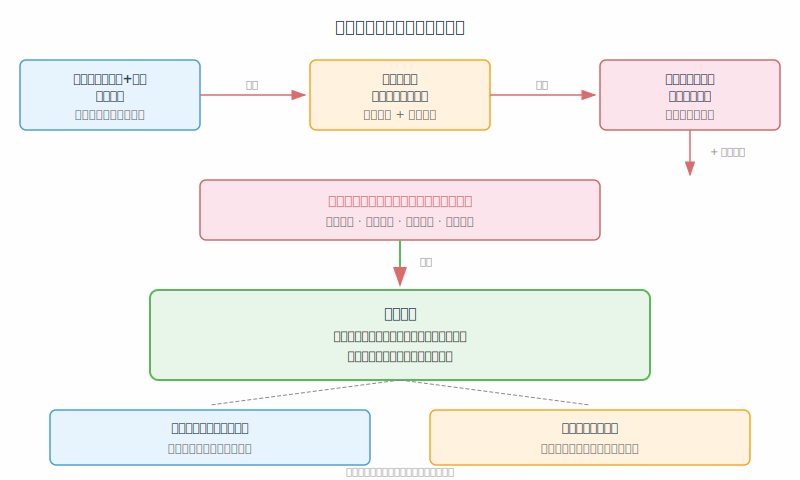
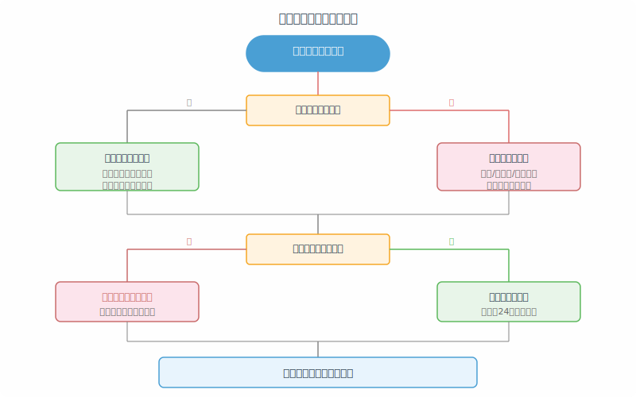
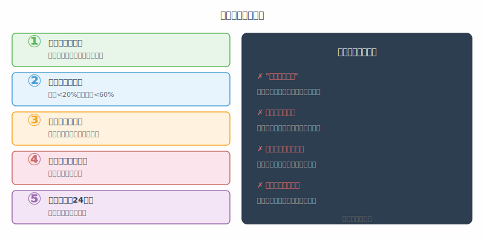

## 散户投资小白金融全品种操盘手册 - 1.4 如何管理风险与心理建设
  
### 作者  
digoal  
  
### 日期  
2026-05-29  
  
### 标签  
金融产品 , 金融工具 , 散户 , 投资小白 , 全品操盘手册  
  
----  
  
## 背景 

> 适用读者: 大陆新手散户, 已读完第一章前三节, 对风险有基本认知。
> 本文定位: 投资教育框架, 不构成个性化投资建议。

## 一句话先懂

知道风险在哪里还不够，你还得在市场波动时能正常思考。风险管理需要一套外在规则来约束内在情绪，否则再好的分析也会在恐慌或贪婪中被抛掉。

## 核心观点

小白亏损的原因里，分析错误只占一小部分，更大的原因是明知有风险却不按规则执行。心理建设不是让自己变得"不怕"，而是设计一套机制让情绪无法干预决策——就像防盗门的作用不是让你不怕小偷，而是让小偷进不来。

## 逻辑推导链

1. 因为市场价格由所有参与者的情绪和预期共同决定，所以短期内价格波动往往脱离基本面。一个品种的客观价值可能在一年内涨50%，但中间可能先跌30%再涨80%。这种振幅不是对错误的惩罚，而是市场的正常呼吸。

2. 因为小白在行情波动时面临双重压力——金钱损失的直接压力和"自己可能判断错了"的自我怀疑——所以人在这种状态下做出的决策质量会系统性下降。研究表明，人在处于焦虑或恐惧状态时，对风险的感知会被放大，对收益的预期会被扭曲。

3. 因为投资计划是在平静状态下制定的，而执行是在充满情绪波动的市场里进行的，所以两者之间存在一个天然的裂缝。平静时你觉得"跌20%就止损"很合理，但当账户真的亏了20%，看着浮亏的数字和周围恐慌的舆论，"再等等看"几乎是人性的本能反应。

4. 因为人性的弱点（损失厌恶、确认偏误、后见之明）在高压下会被放大，而分析能力在高压下会下降，所以单纯依靠"提高认知"来管理风险是不够的。你需要的是一套在情绪失控时仍然能强制执行的规则——不依赖你的判断力，而是依赖规则的刚性。

5. 最后得到：风险管理有两个层面。第一层是仓位和标的选择，决定了单次错误能伤害你多少。第二层是心理规则，决定了在市场极端波动时你能不能按计划行动。第二层比第一层更难，因为它是反人性的，需要提前设计，而不是临时靠意志力。

这条结论在什么边界条件下成立：它对所有小白都成立，因为人性古今中外不变。但如果你是全职交易者、已有成熟的风控体系、或资产量级已大到影响日常生活，适用的规则会有调整——本节主要针对还在建立习惯阶段的散户。

## 适用边界

- 适合所有刚开始入场、对亏损有真实心理压力的小白
- 当资金量还小（占总资产比例低）、经验还少时，这套规则建立习惯的优先级高于追求收益
- 如果你已经能在市场大跌时稳定执行原有计划，这节的某些步骤可以简化

## 操作框架

**第一步：给每笔投资设定"物理退出线"**

在买入前就写下止损条件，不是"跌多了就卖"这种模糊表述，而是具体价格或比例。比如："沪深300ETF跌破20日均线我就减半仓，跌破60日均线我就清仓。"写下来，放在你能随时看到的地方。

为什么强调物理：大脑在亏损时会给"再等等"找无数理由，但物理记录不会。

**第二步：设定单笔和总仓位上限**

单品种仓位不超过总资金的20%，单一方向（所有权益类合计）不超过60%。这两个数字是起点，不是终点——如果执行起来睡不着觉，就继续往下调。

这两个上限不需要择时，是铁律。涨再好也不破上限，因为上限的作用不是"错过机会"，而是"活着等到下一次机会"。

**第三步：区分"波动"和"需要行动"**

建立一个简单的判断框架：价格跌了，但前提条件变了吗？

- 如果没变——跌只是波动，不行动，但要确认退出线还在
- 如果变了——行业逻辑、公司基本面、市场估值等出发因素确实反转了，那就按计划执行

这个框架可以避免两种常见错误：因恐慌卖在波动里，或因固执死扛在趋势反转后。

**第四步：定期复盘，不定期纠结**

每周或每月固定时间做一次规则复盘：止损线有没有被击穿过？击穿了是如何处理的？有没有在计划外加仓？

但遇到市场大涨大跌时，不临时改变规则——那叫情绪反应，不叫复盘。把"要不要改变规则"这件事，留到复盘日再做决定。

**第五步：给自己设计一个"冷静期"**

当账户出现较大浮亏（超过你设定的止损线但还没执行）时，强制等待24小时再做决定。人在焦虑状态下的判断力会在24小时内自动修复一部分。24小时后，你更容易分清"害怕亏损"和"真的看空"。

## 实操例子

假设你以3.5元买了一只指数ETF，止损线设在亏损15%，也就是2.975元。现在价格跌到3.0元，浮亏约14%，还没到止损线，但离得很近了。

情绪反应会是："都快到了，再等等，说不定反弹。"但用框架判断：

- 前提条件变了吗？估值依然合理，没有出现行业或基本面恶化。
- 退出线还在吗？2.975元的线没有被击穿，但它已经在视野内了。
- 我需要24小时吗？如果现在感觉很焦虑，就应该打开日历，强制自己24小时后再决定是否减仓，而不是立刻操作。

这24小时里，你不应该去刷社区、去看别人怎么看盘、去问朋友要不要卖——这些行为本身就是在用别人的情绪覆盖自己的框架。

24小时后，如果估值依然合理，退出线依然完整，但你的焦虑感下降了，这时候再做判断——继续持有或者按计划减仓，都是合理的，但决定应该是基于框架而非恐慌。

## 常见错误

1. 把"跌了"当成"错了"，在波动中割肉，错过了后来反弹的收益。
2. 把"没跌"当成"对了"，在明显高估时因为还在涨而继续持有甚至加仓。
3. 在大跌当天修改止损线，觉得"等回本我就卖"——这是最常见的散户陷阱。
4. 把模拟盘练出来的纪律带到真钱上，发现真亏时完全执行不下去，因为情绪权重完全不同。
5. 亏损后不认错，用"长期持有"当借口逃避止损，实际上是在赌下一次反弹。

## 执行清单

| 问题 | 能回答才继续 |
|---|---|
| 我这笔投资的止损线设在哪里？ | 具体价格或比例，写在能看见的地方 |
| 单笔仓位有没有超过20%？总仓位有没有超过60%？ | 如果超了，先降到上限以内 |
| 如果明天大盘跌5%，我的规则是什么？ | 写下来，而不是到时候再想 |
| 我的复盘周期是每周还是每月？ | 固定时间，不临时加塞 |
| 情绪焦虑时，我有没有24小时冷静期？ | 承认焦虑存在，但延迟操作 |

## 本节小结

风险管理不只是技术问题，更是心理问题。一套不被情绪击穿的风险规则，比一套"更准确"的分析更重要，因为再好的分析在恐慌中也无法被执行。从下一章起，我们将从现金管理开始，逐一介绍各类投资工具——在那之前，先把自己的心理防线建好。

## 参考资料

- 中国证监会, 《证券期货投资者适当性管理办法》, 2016-12-12: https://www.csrc.gov.cn/csrc/c101939/c1045348/content.shtml
- SEC Investor.gov, Investing Basics - Risk: https://www.investor.gov/introduction-investing/investing-basics/what-risk
- Kahneman & Tversky, "Prospect Theory: An Analysis of Decision under Risk", Econometrica, 1979
- FINRA, "Emotional Biases Can Affect Your Investment Decisions": https://www.finra.org/investors/investing/investing-basics/risk 
  
#### [PostgreSQL 解决方案集合](../201706/20170601_02.md "40cff096e9ed7122c512b35d8561d9c8")
  
  
#### [德哥 / digoal's Github - 公益是一辈子的事.](https://github.com/digoal/blog/blob/master/README.md "22709685feb7cab07d30f30387f0a9ae")
  
  
#### [About 德哥](https://github.com/digoal/blog/blob/master/me/readme.md "a37735981e7704886ffd590565582dd0")
  
  

  
