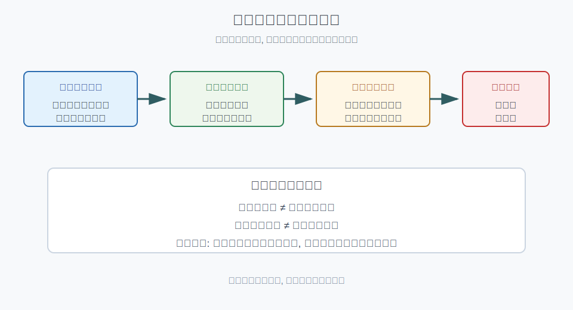
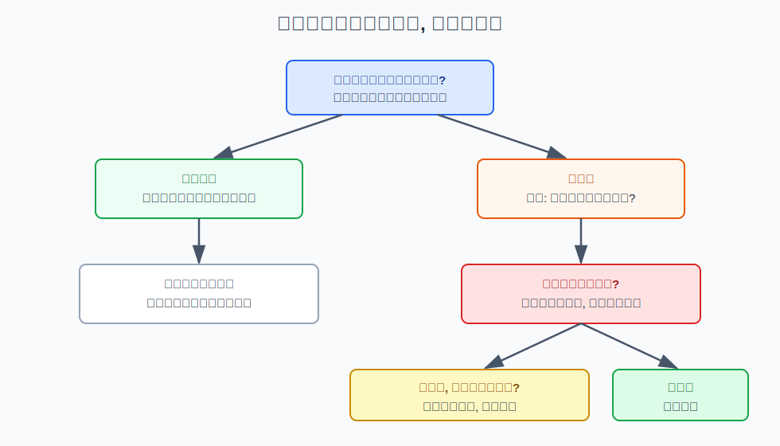
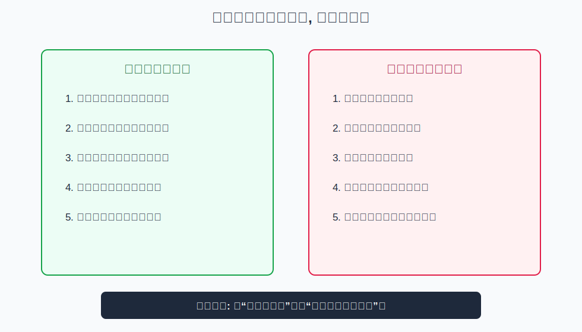

## 散户投资小白金融全品种操盘手册 - 1.5 什么叫投资者适当性: 为什么有些工具有门槛
  
### 作者  
digoal  
  
### 日期  
2026-05-29  
  
### 标签  
金融产品 , 金融工具 , 散户 , 投资小白 , 全品操盘手册  
  
----  
  
## 背景 

> 适用读者: 大陆投资小白、刚开证券账户、看到“开通权限”却不知道门槛含义的人  
> 本文定位: 投资教育框架, 不构成个性化投资建议。

## 一句话先懂

投资者适当性不是在说“你够不够资格赚钱”，而是在问“这个产品的亏损方式、复杂度和你的经验、资金、承受力是否匹配”。

## 核心观点

本节对应第一章第五节。核心判断很简单：**有门槛的工具，通常不是因为它更赚钱，而是因为它更容易让不匹配的人受伤**。门槛是风险隔离器，不是收益通行证。

小白最容易犯的错，是把“开通权限”理解成“市场认可我能玩”。实际上，适当性只完成第一层筛选：经营机构按规则了解你、分类你、匹配产品、提示风险。真正要不要参与，还要回到上一节的风险规则：看不懂、不需要、承受不了，就算能开，也先不碰。

## 逻辑推导链

| 前提 | 类型 | 为什么重要 | 被推翻时怎么办 |
|---|---|---|---|
| 金融产品的亏损路径不同 | 常量 | 货币基金、股票、期权、期货的损失速度完全不同 | 无法推翻，只能识别 |
| 投资者的资金、经验和心理承受力不同 | 常量 | 同样亏10%，对不同人后果不同 | 不再用统一门槛判断所有人 |
| 机构有义务做风险匹配 | 慢变量 | 监管要求经营机构把合适产品卖给合适投资者 | 规则变化时重新查交易所和监管口径 |
| 门槛能降低错配，但不能消灭亏损 | 关键变量 | 如果误以为门槛等于保护，就会重仓复杂工具 | 把权限视为学习边界，而非交易指令 |

1. **因为不同产品的亏损路径不同**，所以不能只看“名字像不像投资”。股票主要是价格波动，期权还有到期日和权利金归零，期货还有保证金和追加保证金。亏损路径越快、越非线性，越需要事前筛选。

2. **因为每个人的承受力不同**，所以同一个产品不可能适合所有人。10万元闲钱亏20%，和3个月生活费亏20%，对人的心理和生活影响完全不同。适当性里的资产、经验、知识测试、风险测评，本质是在粗略估计你能不能理解并承受这种亏损。

3. **因为金融机构比小白更懂产品结构**，所以监管要求机构承担匹配义务。证监会《证券期货投资者适当性管理办法》的核心精神，就是让经营机构了解投资者、了解产品，把适当产品销售给适当投资者，并揭示风险。这里的关键词不是“保证赚钱”，而是“匹配”和“揭示”。

4. **因此得到结论：门槛是保护栏，不是赛道入场券。** 科创板、创业板、股票期权、金融期货等工具设置资产、经验、知识或测评要求，是因为它们的交易机制、波动幅度、杠杆或期限结构更复杂。小白看到门槛时，第一反应不该是“怎样绕过去”，而该问“这个门槛到底在挡哪种风险”。

如果关键前提被推翻，结论要重新推导。比如某个工具通过公募基金、ETF降低了直接交易门槛，你仍不能认为风险消失了，只能改看基金净值波动、持仓、费用和流动性。反过来，如果你已满足门槛，但说不清“最坏情况下怎么亏、亏多快、是否要补钱”，结论就从“可以参与”改成“只能学习或模拟”。

权威规则也支持这个边界。上交所科创板、深交所创业板投教材料都列出资产和交易经验要求；上交所股票期权规则还叠加知识测试、模拟交易经历和风险承受能力要求。这些规则共同说明：监管关心的是风险匹配，而不是给投资者贴“高级”标签。

## 适用边界

- 适合开通科创板、创业板、北交所、融资融券、期权、期货、黄金延期等权限前使用。
- 适合判断别人推荐的“高门槛机会”是不是在制造错觉。
- 不适合判断具体品种涨跌；适当性解决的是“能不能碰、该不该碰”，不是“买点在哪里”。
- 若监管、交易所或券商规则变化，数字例子以最新官方页面为准。

## 操作框架

**第一步：看到门槛，先翻译成风险。** 资产门槛通常对应“亏了也别影响基本生活”；经验门槛对应“你至少见过市场波动”；知识测试对应“你知道规则不是普通股票规则”；模拟交易对应“先演练再上真钱”。

**第二步：问三个问题。** 最坏会亏多少？亏损速度有多快？会不会追加资金或被强制平仓？只要有一个问题答不上来，就不要把它当成实盘工具。

**第三步：把权限和仓位分开。** 开通权限只代表你通过了最低筛选，不代表应该重仓。小白即使满足门槛，也应先用观察、模拟、小额试错替代大额下注。

**第四步：寻找低风险替代路径。** 想理解科创板，可以先看相关公募基金或ETF的波动；想理解期权，可以先学保护性认沽、备兑等风险管理逻辑；想理解期货，可以先学保证金和合约价值，不急着交易。

## 实操例子

假设你看到朋友说“科创板机会大，但要50万元和两年交易经验”。你不应该只想“我差多少钱能开通”，而要按框架拆解：

第一，科创板企业成长性更强，盈利不确定性也更高，价格波动可能更大。第二，交易规则和主板不完全一样，需要单独学习。第三，如果你只是想理解科技成长机会，先研究科创相关ETF或基金，通常比直接买个股更适合小白阶段。

同样，看到股票期权门槛更高时，也不要把它理解为“高手工具所以更赚钱”。期权的时间价值会衰减，到期可能归零，卖方还可能面临保证金压力。你能开通，不代表你应该做卖方；你能看懂买方亏损有限，也不代表可以频繁买入末日期权。

## 常见错误

1. 把门槛当身份标签：觉得越难开通的产品越高级，忽略了它只是更复杂。
2. 把适当性当免责书：以为机构做了测评，自己亏损就不是自己的决策责任。
3. 为了开通权限临时凑资产：资产门槛筛的是承受力，不是账户截图。
4. 通过测试就觉得懂了：测试能覆盖规则，不能覆盖你在真实亏损中的情绪反应。
5. 满足门槛后立刻重仓：最危险的不是没资格，而是刚有资格就自信过度。

## 执行清单

| 买入或开通前的问题 | 判断标准 |
|---|---|
| 这个门槛在挡什么风险？ | 能说清是波动、杠杆、到期日、流动性还是退市风险 |
| 最坏情况下会怎么亏？ | 能写出亏损上限、追加资金可能性、强平或归零路径 |
| 我是否真的需要这个工具？ | 能说明它解决什么组合问题，而不是因为别人推荐 |
| 有没有更简单的替代品？ | 优先比较公募基金、ETF、现金和债券等低复杂度工具 |
| 权限开通后仓位怎么设？ | 先观察或小额试错，不因开通权限而提高仓位上限 |

## 本节小结

投资者适当性的底层原则是“合适的人，用合适的钱，参与合适复杂度的工具”。它不是阻止你学习，而是提醒你：先保命，再赚钱；先理解亏损路径，再谈收益想象。下一节会进入本书统一操作模板，把“环境判断、品种选择、仓位上限、买卖条件和复盘”合成一套可重复执行的流程。

## 参考资料

- 中国证监会, 《证券期货投资者适当性管理办法》, 2016-12-12, https://www.csrc.gov.cn/csrc/c101939/c1045348/content.shtml
- 上海证券交易所投资者教育, 科创板投资者适当性问答, https://edu.sse.com.cn/tib/qa/
- 深圳证券交易所投资者教育, 创业板投资者适当性条件问答, 2020-05-13, https://investor.szse.cn/investor/knowledge/t20200513_577026.html
- 上海证券交易所, 《股票期权试点投资者适当性管理指引》, 2017年修订, https://www.sse.com.cn/lawandrules/sselawsrules2025/option/c/c_20250610_10781453.shtml
- 中国金融期货交易所, 《金融期货投资者适当性制度操作指引》, https://www.cffex.com.cn/u/cms/www/oldsys/W020170628563987856327.pdf
  
  
#### [PostgreSQL 解决方案集合](../201706/20170601_02.md "40cff096e9ed7122c512b35d8561d9c8")
  
  
#### [德哥 / digoal's Github - 公益是一辈子的事.](https://github.com/digoal/blog/blob/master/README.md "22709685feb7cab07d30f30387f0a9ae")
  
  
#### [About 德哥](https://github.com/digoal/blog/blob/master/me/readme.md "a37735981e7704886ffd590565582dd0")
  
  

  
