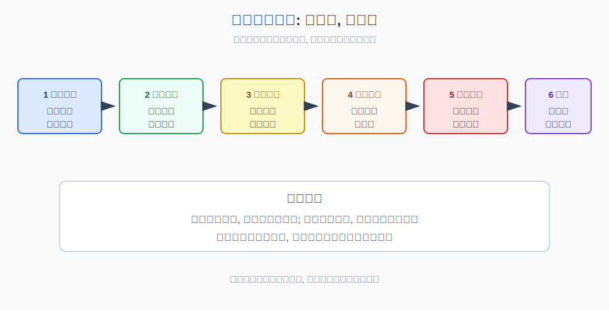
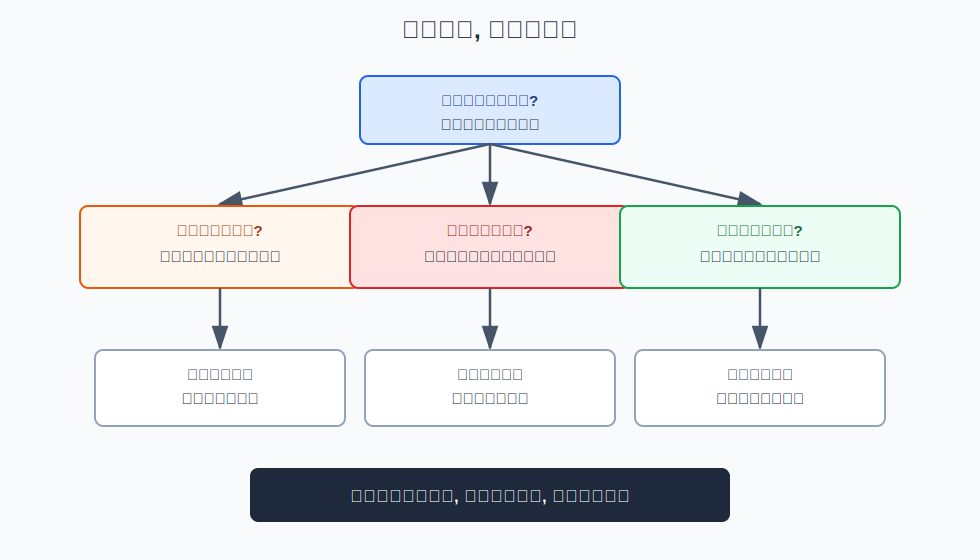
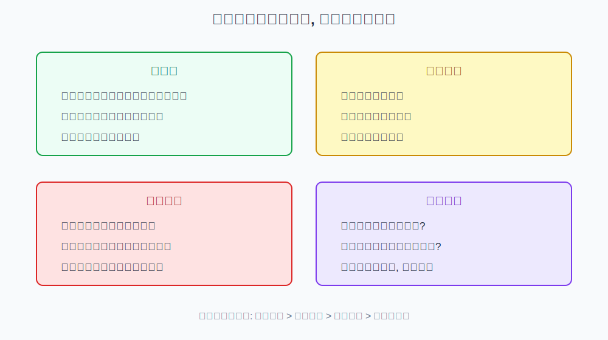

## 散户投资小白金融全品种操盘手册 - 1.6 本书统一操作模板: 环境判断 -> 品种选择 -> 仓位上限 -> 买入条件 -> 卖出条件 -> 复盘
  
### 作者  
digoal  
  
### 日期  
2026-05-29  
  
### 标签  
金融产品 , 金融工具 , 散户 , 投资小白 , 全品操盘手册  
  
----  
  
## 背景 
  

> 适用读者: 投资小白、散户、想把不同金融工具放进同一套操作流程的人  
> 本文定位: 投资教育框架, 不构成个性化投资建议。

## 一句话先懂

买任何产品前，都先走同一条链：看环境、选工具、定仓位、写买入、写卖出、做复盘；少一步，都是在把钱交给情绪。

## 核心观点

本节对应第一章第六节。核心判断是：**小白最需要的不是更多观点，而是一套能重复执行的操作模板**。因为市场会变、品种会变、消息会变，但流程不应该每天变。

这套模板不是预测系统，而是防错系统。它让你先回答“现在适合承担什么风险”，再决定“用什么工具承担”，最后才谈“什么时候买、错了怎么走、做完怎么复盘”。先保命，再赚钱，靠的就是这个顺序。

## 逻辑推导链

| 前提 | 类型 | 为什么重要 | 被推翻时怎么办 |
|---|---|---|---|
| 市场环境会改变胜率 | 慢变量 | 同一工具在牛市、熊市、震荡市的结果不同 | 先重做环境判断 |
| 工具只是风险载体 | 常量 | ETF、债券、黄金、转债只是承接不同风险的容器 | 回到六大风险重新拆解 |
| 仓位决定能否活下来 | 关键变量 | 看对方向但仓位过大，也会被波动打出局 | 先降仓位，再谈观点 |
| 买卖条件要在情绪前写好 | 关键变量 | 临场决策最容易被贪婪和恐惧污染 | 未写条件时暂停交易 |
| 复盘只能改规则，不能改借口 | 常量 | 不复盘就无法把亏损变成经验 | 固定周期复盘 |

1. **因为市场环境决定胜率**，所以第一步不是问“买什么”，而是问“现在什么风险更容易得到补偿”。比如流动性宽松、风险偏好回升时，权益资产的胜率可能提高；利率下行时，债券和高股息资产可能更受益；震荡市里，现金、红利、网格和低波动工具更重要。

2. **因为工具只是风险载体**，所以第二步才是品种选择。你不是在买一个名字，而是在选择承担权益、利率、信用、商品、汇率或杠杆风险。环境判断如果指向“风险偏好下降”，却去重仓高波动成长股，流程就断了。

3. **因为仓位决定生存能力**，所以第三步必须先定仓位上限。仓位上限不是“我想赚多少”，而是“我错了最多能亏多少”。举例：如果你最多接受这笔亏损总资产的2%，而这个工具可能回撤20%，单笔仓位上限就不应超过10%。这是教育示例，不是个性化建议。

4. **因为买入和卖出最容易被情绪篡改**，所以第四、第五步必须提前写。买入条件可以是估值进入区间、趋势确认、现金流改善、利率方向变化等；卖出条件可以是前提被推翻、仓位过高、达到止盈规则、跌破止损线。没有卖出条件的买入，本质是把退出权交给未来的恐慌。

5. **因为一次盈亏不能证明框架对错**，所以第六步是复盘。复盘不是每天盯盘后找理由，而是在固定时间检查：当初前提是否成立？仓位是否按规则？亏损来自市场噪音还是规则错误？盈利来自框架还是运气？

如果关键前提变化，结论必须重跑。比如原来按“利率下行”买入债券基金，但后来利率快速上行，环境前提变了，就不能用“长期会好”硬扛；要重新评估久期、仓位和退出条件。如果个人现金需求变了，也要先降风险资产仓位，因为生活现金的优先级高于任何投资观点。

权威资料也支持这套顺序。SEC 投资者教育材料强调，投资前应确认目标、风险承受能力和时间期限；FINRA 也提示分散和避免情绪决策。这些不是预测方法，而是行为边界。

## 适用边界

- 适合本书后续所有品种：现金、债券、基金、ETF、转债、黄金、REITs、QDII、港股、美股、期权、期货。
- 适合用来做买前检查、持有中复盘、卖出后总结。
- 不适合把它当成保证赚钱公式；它只能减少低级错误，不能消灭市场风险。
- 遇到杠杆、期权、期货、融资融券等工具时，模板必须更严格，不能降低仓位和退出条件要求。

## 操作框架

**第一步：环境判断。** 写下当前更像牛市、熊市、震荡市，还是利率、通胀、汇率主导的特殊环境。不要预测点位，只判断哪类风险更有胜率。

**第二步：品种选择。** 从环境出发选择工具，而不是从热门名单出发。每个候选工具都写一句：“它主要承担什么底层风险？”

**第三步：仓位上限。** 先设最大可承受亏损，再倒推仓位。公式是：单笔仓位上限 = 可承受亏损金额 / 该工具可能回撤比例。

**第四步：买入与卖出条件。** 买入条件必须可观察，卖出条件必须提前写。不能用“感觉差不多”“别人说不错”当条件。

**第五步：复盘。** 每周或每月固定一次。只复盘规则，不在大涨大跌当天临时修改规则。

## 实操例子

假设你判断当前是震荡市，方向不清，追涨情绪不强。你想用一个宽基ETF做长期观察仓。

按模板走：环境判断是“震荡，不追高”；品种选择是“宽基ETF，主要承担权益风险”；仓位上限假设为总资产10%，因为你估计它可能回撤20%，而你只愿意让这笔试错最多影响总资产2%；买入条件是“分批买，不在单日大涨后追”；卖出条件是“环境明显转弱、估值不再便宜，或单笔亏损触发预设线，就停止加仓并复盘”。

这个例子没有推荐任何具体ETF。它示范的是流程：先判断环境，再选择风险载体，再用亏损上限倒推出仓位。只要换成债券基金、黄金ETF、REITs或QDII，模板仍然一样，只是风险变量不同。

## 常见错误

1. 先看到产品再编环境理由，把流程倒过来。
2. 只写买入理由，不写卖出条件，最后靠情绪退出。
3. 用收益目标定仓位，而不是用最大亏损定仓位。
4. 把复盘变成后悔，把“下次一定”当成规则。
5. 环境变了还坚持原计划，其实是在维护面子，不是在执行纪律。

## 执行清单

| 买入前必须确认的问题 | 判断标准 |
|---|---|
| 当前市场环境是什么？ | 能用一句话说明主要风险和胜率来源 |
| 这个品种承担什么底层风险？ | 至少能归入六大风险之一 |
| 单笔仓位上限怎么算？ | 用可承受亏损除以可能回撤比例 |
| 买入条件和卖出条件是否写好？ | 条件可观察、可执行、不是情绪词 |
| 什么时候复盘？ | 固定日期，不在极端情绪当天改规则 |

## 本节小结

统一模板的价值，是把所有工具放进同一套纪律：环境判断决定方向，品种选择承接风险，仓位上限保护生存，买卖条件控制行动，复盘负责迭代。下一节会进入第一章最后一道硬红线：不借钱、不满仓、不碰不懂的杠杆、不听消息重仓。

## 参考资料

- SEC Investor.gov, “Create a Financial Plan”, https://www.investor.gov/introduction-investing/getting-started/create-financial-plan
- FINRA, “Diversification”, https://www.finra.org/investors/investing/investing-basics/diversification
  
