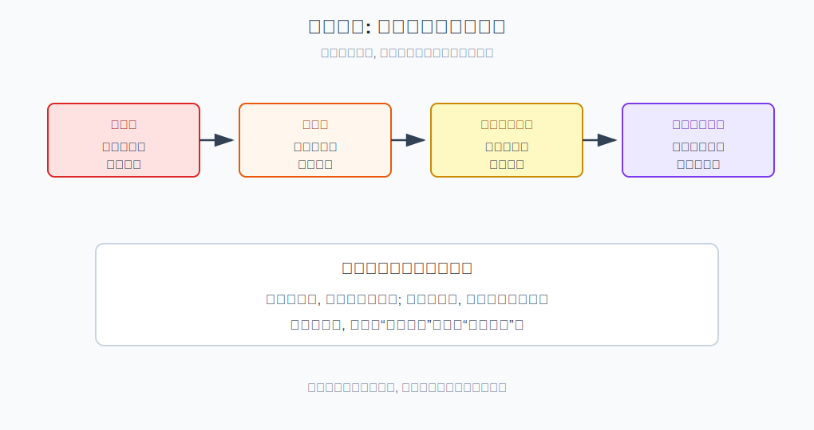
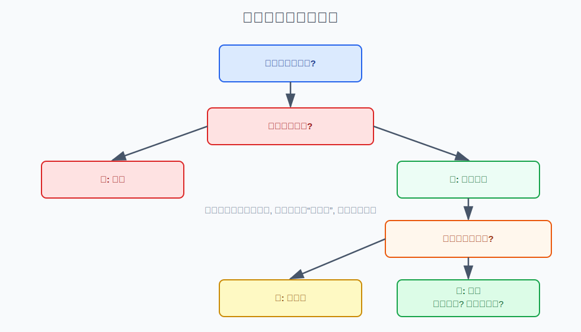
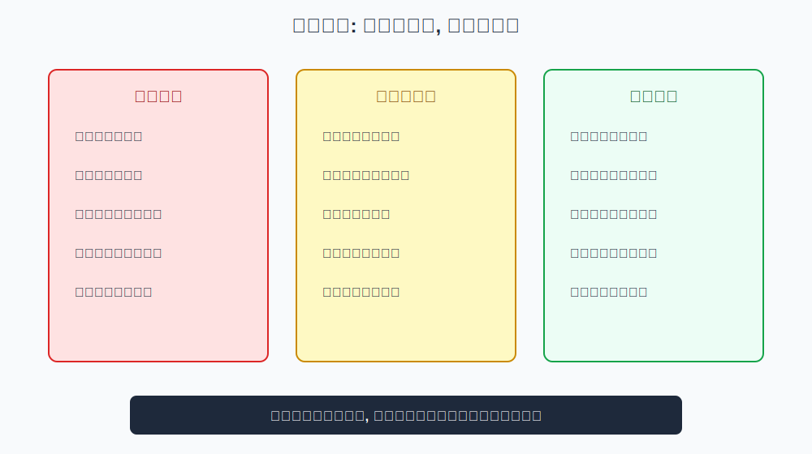

## 散户投资小白金融全品种操盘手册 - 1.7 小白红线: 不借钱、不满仓、不碰不懂的杠杆、不听消息重仓
  
### 作者  
digoal  
  
### 日期  
2026-05-29  
  
### 标签  
金融产品 , 金融工具 , 散户 , 投资小白 , 全品操盘手册  
  
----  
  
## 背景 
  
> 适用读者: 投资小白、散户、容易被行情和消息带动仓位的人  
> 本文定位: 投资教育框架, 不构成个性化投资建议。

## 一句话先懂

小白阶段最重要的不是抓住每次机会，而是永远不要让一次错误毁掉本金、现金流和继续学习的资格。

## 核心观点

本节对应第一章第七节，也是第一章的收束。核心判断是：**小白必须先守住四条红线：不借钱、不满仓、不碰不懂的杠杆、不听消息重仓。** 这四条不是道德劝告，而是从风险传导机制推出来的生存规则。

前面六节讲了风险识别、风险度量、心理纪律、适当性和统一操作模板。本节把它们压成一句话：任何操作只要触碰这四条红线，就先停止，不要再讨论“这次机会是不是特殊”。

## 逻辑推导链

| 前提 | 类型 | 为什么重要 | 被推翻时怎么办 |
|---|---|---|---|
| 市场短期不可预测 | 常量 | 再强的观点也可能先亏一段 | 不能用确定语气定仓位 |
| 借钱会把投资亏损变成债务压力 | 关键变量 | 亏损后还要还本付息，心理和现金流同时受压 | 任何借钱投资都先停止 |
| 满仓会消灭修正空间 | 关键变量 | 看错后没有现金补救，也无法等待 | 先降仓，再谈观点 |
| 杠杆会放大亏损速度 | 关键变量 | 小波动可能变成强平或追加保证金 | 不懂机制只学习不实盘 |
| 消息无法验证，仓位却是真实的 | 慢变量 | 信息优势通常不在散户手里 | 消息只能当线索，不能当重仓理由 |

1. **因为市场短期不可预测**，所以小白不能把任何判断当成必然。你可以买到逻辑正确但时间不对的资产，也可能买到短期上涨但长期错误的资产。既然会错，第一目标就不是“这次赚多少”，而是“错了会不会活下来”。

2. **因为借钱会改变亏损性质**，所以第一条红线是不借钱。自有闲钱亏损，痛苦但可控；借钱亏损，会叠加还款、利息、家庭现金流和心理压力。FINRA 和 SEC 的投资者教育都反复提示，保证金和借贷投资会放大亏损，不适合不理解风险的人。

3. **因为满仓会消灭修正空间**，所以第二条红线是不满仓。满仓后，你没有现金应对突发生活需求，也没有资金在更好价格出现时调整。更糟的是，满仓会让每一次波动都变成情绪事件，最后你不是按规则操作，而是在焦虑中求解脱。

4. **因为杠杆会让亏损速度非线性上升**，所以第三条红线是不碰不懂的杠杆。杠杆不是“放大收益”的工具，而是同时放大收益、亏损、时间压力和被动退出风险的机制。融资融券、期货、期权、黄金延期等工具，小白可以学习机制，但不能把它们当入门默认工具。

5. **因为消息无法验证，而仓位是真金白银**，所以第四条红线是不听消息重仓。别人说“有内幕”“马上启动”“确定反转”，你无法验证来源、动机和时效。即使消息最后碰巧对了，用不可验证信息重仓，也是在训练错误习惯。

如果关键前提变化，结论也要重跑。比如你已经有多年经验、能解释保证金、强平和最坏亏损路径，杠杆仍然不是默认选择，只能进入严格仓位和风控框架；如果一条消息来自公开公告或正式规则，它也只是可验证信息，需要回到估值、风险和仓位模板，而不是直接重仓。

## 适用边界

- 适合所有小白买入、加仓、开通权限、参与新工具前使用。
- 尤其适合行情大涨、朋友推荐、社群热议、短视频反复推送时使用。
- 不适合当成“永远不能学习复杂工具”的借口；复杂工具可以先学规则、模拟和风险边界。
- 如果你的资金是短期要用的钱，本节红线更严格：不应进入高波动资产。

## 操作框架

**第一步：问钱的来源。** 只要是借款、信用卡、消费贷、挪用生活钱，就停止。投资只能用不影响生活和债务偿还的闲钱。

**第二步：问仓位是否可承受。** 先假设这笔资产下跌20%、30%甚至更多，问自己生活和心态是否还能正常。如果不能，就先降仓位。

**第三步：问是否懂杠杆机制。** 你必须能说清保证金、强平、追加资金、到期日、权利金归零等词的含义。说不清，就只学习不交易。

**第四步：问信息是否可验证。** 如果买入理由来自聊天群、朋友一句话、短视频标题，而不是公开资料和自己的模板，就不能重仓。

**第五步：把红线写成买前清单。** 每次买入前勾一遍。任何一项触发，结论不是“少买点”，而是先停止，等条件恢复。

## 实操例子

假设你看到某行业突然大涨，群里有人说“明天还会涨停”，你很想把账户里所有现金买进去，甚至想先借一笔钱。按红线框架拆解：

钱的来源如果包含借款，第一关直接停止；仓位如果接近满仓，第二关要求先降到可承受范围；如果你买的是带杠杆工具，但说不清亏损如何放大，第三关停止；如果唯一理由是群消息，第四关停止。

这并不代表这个行业一定不会涨。它只说明：你没有用可验证信息、可承受仓位和可执行退出条件来参与。就算这次涨了，你学到的也是危险习惯；一旦下次错了，代价可能远大于这次收益。

## 常见错误

1. 把“我很看好”当成借钱理由，忘了看好也可能先跌。
2. 把满仓理解成有魄力，实际上是没有预案。
3. 只看到杠杆收益翻倍，看不到亏损、强平和追加保证金。
4. 把消息来源的自信当成事实可靠性。
5. 亏损后用“长期持有”掩盖一开始就触碰红线的错误。

## 执行清单

| 买入前红线问题 | 判断标准 |
|---|---|
| 钱是不是借来的或短期要用的？ | 是就停止，不进入风险资产 |
| 仓位是否超过事前上限？ | 超过就先降仓，不追加理由 |
| 工具是否包含杠杆或到期结构？ | 说不清亏损路径就不实盘 |
| 买入理由是否来自不可验证消息？ | 只能作为线索，不能作为重仓理由 |
| 错了以后是否还能继续学习？ | 如果一次亏损会出局，就不做 |

## 本节小结

第一章的底层逻辑到这里闭环：你买的不是代码，而是风险；你要的不是刺激，而是可持续参与市场的资格。守住四条红线，才有资格进入第二章，学习不同市场环境下该选择什么工具、如何提高胜率。

## 参考资料

- SEC Investor.gov, “Margin: Borrowing Money to Pay for Stocks”, https://www.investor.gov/introduction-investing/investing-basics/glossary/margin-borrowing-money-pay-stocks
- FINRA, “Investing with Borrowed Funds: No Margin for Error”, https://www.finra.org/investors/insights/investing-borrowed-funds-no-margin-error
- FINRA, “Day Trading: Your Dollars at Risk”, https://www.finra.org/investors/investing/investment-products/stocks/day-trading-your-dollars-risk
- SEC Investor.gov, “Assessing Your Risk Tolerance”, https://www.investor.gov/introduction-investing/getting-started/assessing-your-risk-tolerance
  
