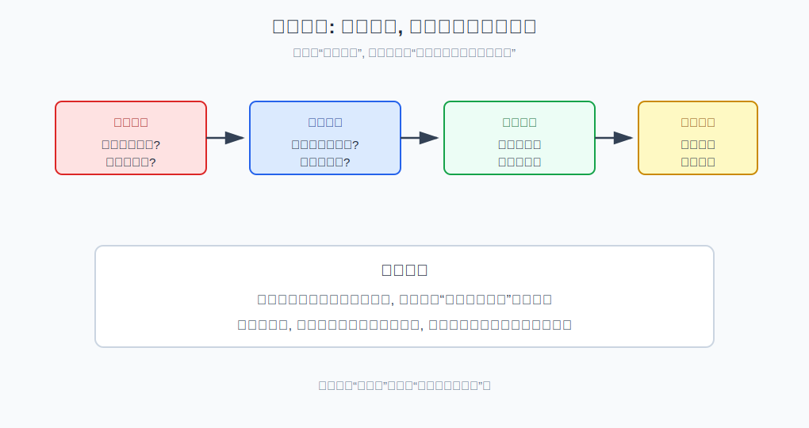
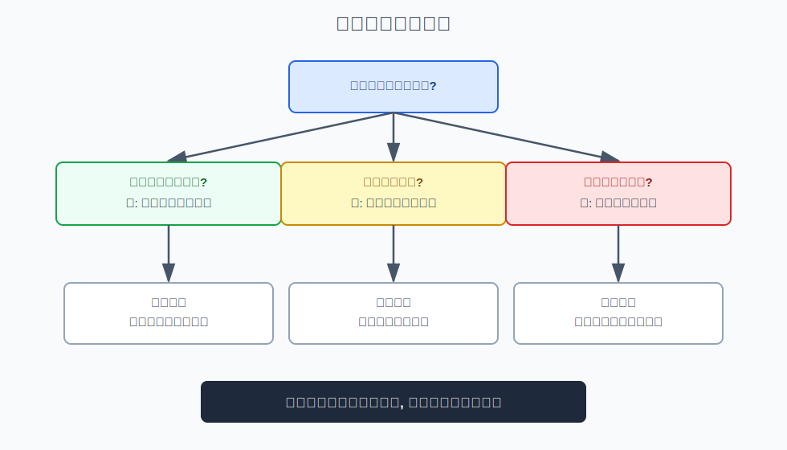
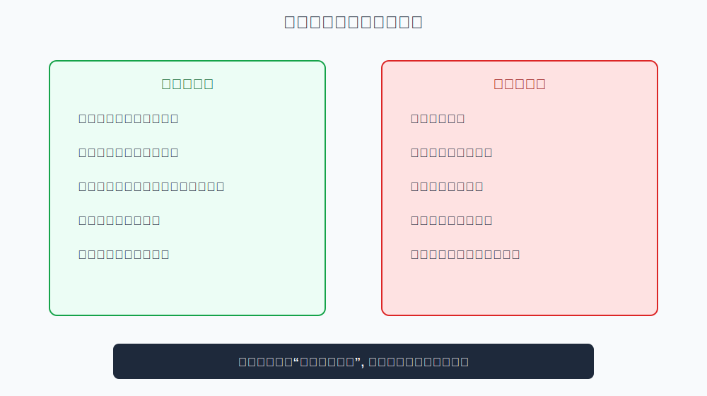

## 散户投资小白金融全品种操盘手册 - 2.1 市场环境不是预测涨跌, 而是判断胜率
  
### 作者  
digoal  
  
### 日期  
2026-05-29  
  
### 标签  
金融产品 , 金融工具 , 散户 , 投资小白 , 全品操盘手册  
  
----  
  
## 背景 

> 适用读者: 已读完第一章、想知道不同市场环境下该选什么工具的投资小白  
> 本文定位: 投资教育框架, 不构成个性化投资建议。

## 一句话先懂

市场环境判断不是算命，不是猜明天涨跌，而是判断现在承担哪类风险更有胜率、仓位该进攻还是防守。

## 核心观点

本节对应第二章第一节。核心判断是：**市场环境判断的任务不是预测点位，而是提高工具选择和仓位管理的胜率。** 你不需要知道明天涨1%还是跌1%，但你需要知道现在更适合持有现金、债券、权益、黄金，还是只做小仓位观察。

第一章解决“你到底在买什么风险”。第二章开始解决“什么环境适合承担什么风险”。小白一旦把环境判断误解成预测涨跌，就会陷入天天猜方向；一旦把它理解成胜率判断，就能把注意力放回工具、仓位和退出条件。

## 逻辑推导链

| 前提 | 类型 | 为什么重要 | 被推翻时怎么办 |
|---|---|---|---|
| 短期价格受大量随机因素影响 | 常量 | 明天涨跌很难稳定预测 | 放弃点位执念 |
| 不同环境下风险补偿不同 | 慢变量 | 同一工具在牛市、熊市、震荡市胜率不同 | 重新判断环境 |
| 工具选择应服从环境 | 关键变量 | 环境错配会让好工具变成坏仓位 | 换工具或降仓位 |
| 仓位应随胜率变化 | 关键变量 | 胜率低时重仓会放大错误 | 先保命，再赚钱 |
| 环境判断会出错 | 常量 | 所以必须有止损、复盘和现金 | 用规则修正，不用面子硬扛 |

1. **因为短期价格受随机因素影响**，所以“明天涨还是跌”不是小白应该依赖的问题。政策一句话、海外市场波动、大资金调仓、情绪突然变化，都可能让短期价格偏离你的判断。你越执着短期预测，越容易频繁交易。

2. **因为市场环境会改变风险补偿**，所以正确问题应改成：“现在承担哪类风险更值得？”风险补偿就是你承担风险后，市场可能给你的回报。经济和盈利改善时，权益风险可能更有补偿；利率下行时，债券久期风险可能更有补偿；风险偏好下降时，现金、短债和黄金的防守价值会上升。

3. **因为工具只是风险载体**，所以环境判断必须落到工具选择。牛市初期可能更适合宽基ETF和成长风格，震荡市可能更重视红利、现金和网格，熊市可能先考虑货币基金、短债、黄金和分批定投。这里不是推荐具体产品，而是说明环境如何改变工具优先级。

4. **因为环境判断也会错**，所以仓位必须随胜率变化。胜率高，不等于满仓；胜率低，也不等于反向梭哈。对小白来说，环境判断的最终输出不是“买或卖”的口号，而是仓位上限、买入条件和复盘频率。

5. **因此得到结论：环境判断是概率工具，不是预言工具。** 它只能告诉你“此时承担某类风险是否更划算”，不能保证你买入后立刻赚钱。只要你开始问“明天一定涨吗”，就已经偏离了本节方法。

如果关键前提变化，结论要重跑。比如你原来判断流动性宽松、权益胜率提高，但后来利率上行、成交缩量、风险偏好下降，结论就要从“提高权益观察仓”改为“降低进攻仓位、保留现金”。这不是认输，而是按新前提重新推导。

历史和研究也支持这种边界。NBER 对经济周期的划分说明，扩张和收缩是阶段性状态，不是单日涨跌；美联储关于货币政策传导的资料也显示，利率和金融条件会影响资产价格与经济活动。它们都提示我们：环境变量影响的是一段时间内的风险补偿，不是第二天的涨跌答案。

## 适用边界

- 适合在每次买入前、加仓前、换品种前使用。
- 适合判断“该进攻、防守还是等待”，不适合预测点位。
- 适合做仓位上限和工具选择的依据，不能替代止损和复盘。
- 如果你无法说清当前环境，就默认降低仓位、保留现金，而不是强行下注。

## 操作框架

**第一步：只问环境，不问点位。** 把问题从“明天涨跌”改成“现在经济、流动性、利率、风险偏好分别在改善还是恶化”。

**第二步：把环境翻译成风险补偿。** 经济改善偏向权益，利率下行偏向债券和高股息，通胀上行偏向黄金和商品，风险偏好下降偏向现金和短债。

**第三步：选择工具而不是追热点。** 先定环境，再从工具箱里选匹配工具。热点如果和环境不匹配，就只观察，不重仓。

**第四步：用胜率决定仓位。** 环境清晰、工具匹配、风险可承受，仓位可逐步提高；环境混乱、变量冲突，就降仓位、分批或等待。

**第五步：设复盘触发条件。** 当利率方向、政策态度、成交量、汇率、信用风险或风险偏好明显变化时，重新跑模板。

## 实操例子

假设你看到指数连续上涨三天，很多人说“牛市来了”。预测式思维会问：“明天还涨吗？现在追不追？”环境式思维会先问：

经济和盈利有没有改善？流动性是否变松？利率是否下行？成交量和风险偏好是否持续回升？如果只有价格涨，但这些变量没有配合，那更像短期反弹，仓位就不能因为兴奋而提高太快。

反过来，如果价格还没大涨，但流动性改善、风险偏好回升、政策和盈利预期转好，环境可能已经在修复。这时也不是立刻重仓，而是用小仓位观察、分批验证，并提前写好前提失效后的退出条件。

## 常见错误

1. 把环境判断当预测工具，天天问明天涨跌。
2. 只看指数涨跌，不看利率、流动性、成交量和风险偏好。
3. 环境不清时重仓，觉得“总要选一边”。
4. 环境变了还死守旧判断，把复盘当成丢脸。
5. 用一个利好消息替代完整环境判断。

## 执行清单

| 买入前必须确认的问题 | 判断标准 |
|---|---|
| 我是在预测涨跌，还是判断环境？ | 能说清环境变量，而不是只说涨跌 |
| 当前主要风险补偿在哪里？ | 权益、利率、商品、汇率或现金防守中选一个主线 |
| 工具是否匹配环境？ | 工具承担的风险与环境方向一致 |
| 仓位是否反映不确定性？ | 环境越不清，仓位越低 |
| 什么变化会推翻判断？ | 至少写出一个复盘触发条件 |

## 本节小结

市场环境判断的价值，是把你从“猜明天”拉回“判断胜率”。从下一节开始，我们会拆解四个核心变量：经济周期、流动性、利率、风险偏好。它们就是判断市场环境的基础仪表盘。

## 参考资料

- NBER, “US Business Cycle Expansions and Contractions”, https://www.nber.org/research/data/us-business-cycle-expansions-and-contractions
- Federal Reserve, “Monetary Policy: What Are Its Goals? How Does It Work?”, https://www.federalreserve.gov/monetarypolicy/monetary-policy-what-are-its-goals-how-does-it-work.htm
- SEC Investor.gov, “Asset Allocation”, https://www.investor.gov/introduction-investing/investing-basics/glossary/asset-allocation
- FINRA, “Diversification”, https://www.finra.org/investors/investing/investing-basics/diversification
  
  
#### [PostgreSQL 解决方案集合](../201706/20170601_02.md "40cff096e9ed7122c512b35d8561d9c8")
  
  
#### [德哥 / digoal's Github - 公益是一辈子的事.](https://github.com/digoal/blog/blob/master/README.md "22709685feb7cab07d30f30387f0a9ae")
  
  
#### [About 德哥](https://github.com/digoal/blog/blob/master/me/readme.md "a37735981e7704886ffd590565582dd0")
  
  

  
