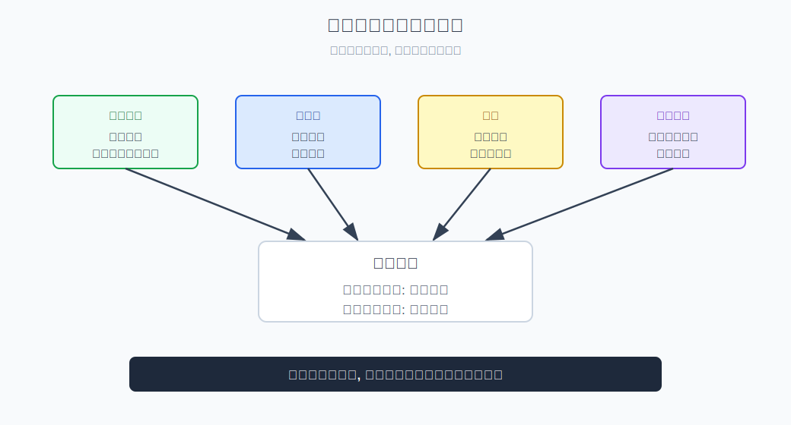
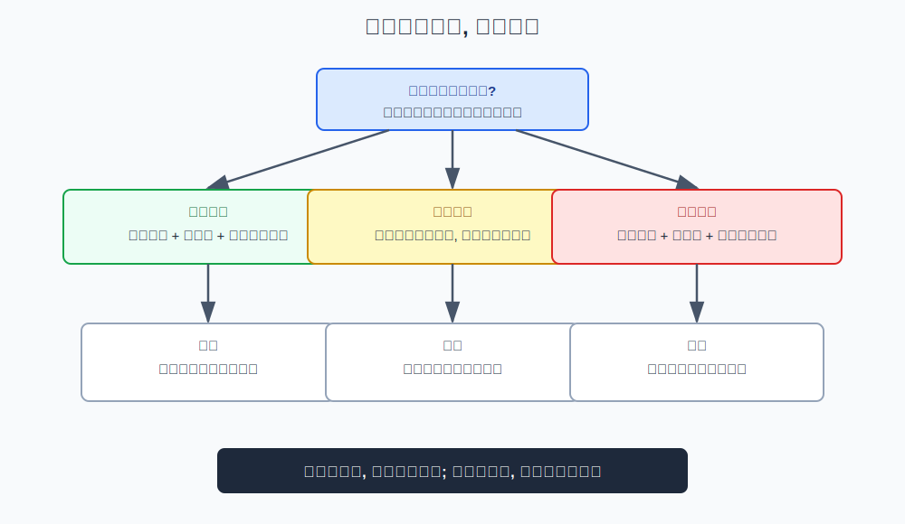
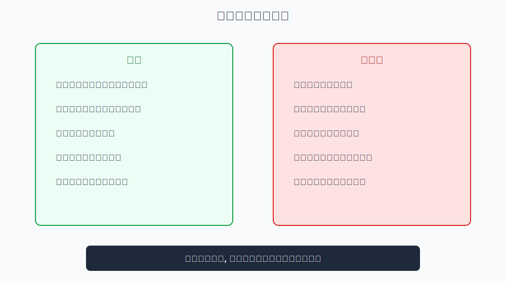

## 散户投资小白金融全品种操盘手册 - 2.2 四个核心变量: 经济周期、流动性、利率、风险偏好
  
### 作者  
digoal  
  
### 日期  
2026-05-29  
  
### 标签  
金融产品 , 金融工具 , 散户 , 投资小白 , 全品操盘手册  
  
----  
  
## 背景 

> 适用读者: 想把“市场环境”拆成可观察指标的投资小白  
> 本文定位: 投资教育框架, 不构成个性化投资建议。

## 一句话先懂

判断市场环境，不是盯一个指数涨跌，而是同时看四个仪表盘：经济周期、流动性、利率、风险偏好。

## 核心观点

本节对应第二章第二节。核心判断是：**市场环境不是一个词，而是四个变量的合成结果。** 经济周期看企业赚钱能力，流动性看市场钱多钱少，利率看钱的价格，风险偏好看资金愿不愿意承担波动。

小白最容易犯的错，是只抓住一个变量就下结论：看到降息就说牛市来了，看到指数跌就说熊市来了，看到成交放大就满仓追。真正可用的环境判断，必须看四个变量是否互相验证；变量越一致，仓位越有依据，变量越冲突，越要保守。

## 逻辑推导链

| 前提 | 类型 | 为什么重要 | 被推翻时怎么办 |
|---|---|---|---|
| 企业盈利决定权益资产的长期基础 | 慢变量 | 盈利改善时，股票胜率通常提高 | 经济数据恶化时降低进攻判断 |
| 流动性影响资产估值 | 关键变量 | 钱多时估值压力小，钱紧时估值压力大 | 流动性收紧时降低仓位 |
| 利率是钱的价格 | 常量 | 利率影响债券价格、股票估值和现金吸引力 | 利率方向变了要重估工具 |
| 风险偏好决定资金愿不愿意冒险 | 关键变量 | 同样的基本面，情绪不同，价格表现不同 | 风险偏好下降时先防守 |
| 四个变量会互相冲突 | 常量 | 单一变量容易误导 | 冲突时小仓验证 |

1. **因为权益资产最终要靠企业赚钱支撑**，所以第一个变量是经济周期。经济周期可以粗略理解为经济从复苏、扩张、放缓到衰退的循环。经济和企业盈利在改善时，股票和权益基金的基本面支撑更强；如果经济下行、盈利承压，单靠情绪上涨就更脆弱。

2. **因为资产价格不仅看盈利，还看市场有没有钱**，所以第二个变量是流动性。流动性就是市场里的资金是否充裕。钱多时，资金更容易进入股票、债券、商品等资产，估值更容易被抬高；钱紧时，资金会更挑剔，估值承压。

3. **因为利率是钱的价格**，所以第三个变量是利率。利率上升，借钱成本上升，债券价格通常承压，股票估值也容易被压低；利率下降，债券价格可能受益，股票估值压力也可能减轻。但利率下行如果来自经济太弱，也未必利好所有权益资产。

4. **因为价格短期由资金情绪推动**，所以第四个变量是风险偏好。风险偏好就是市场愿不愿意买波动大的资产。风险偏好高时，成长股、行业主题、弹性资产容易被追捧；风险偏好低时，资金更愿意去现金、短债、黄金、高股息等防守方向。

5. **因此得到结论：不要单看一个变量，要看四个变量是否互相验证。** 如果经济改善、流动性宽松、利率下行或稳定、风险偏好回升，这是较清晰的进攻环境；如果经济下行、流动性收紧、利率上行、风险偏好下降，这是防守环境；如果变量互相打架，就不该重仓押方向。

如果关键前提变化，结论要重跑。比如利率下降，但原因是经济快速恶化，那么债券可能更有胜率，权益却未必适合重仓；如果经济改善，但流动性收紧、利率上行，股票上涨也可能受估值压制。这就是为什么四变量要合成判断，不能单独使用。

权威资料也支持这种拆解。NBER 用扩张和收缩描述经济周期；美联储解释货币政策通过利率和金融条件影响经济与资产价格；中国人民银行货币政策报告也长期讨论流动性、利率和实体融资成本。这些资料共同说明：市场环境来自多变量传导，不是一个涨跌标签。

## 适用边界

- 适合每周或每月做一次市场环境复盘。
- 适合判断当前更偏进攻、防守、震荡还是等待。
- 不适合预测具体指数点位和日期。
- 当四个变量冲突时，结论不是“强行选边”，而是降低仓位、分批验证、保留现金。

## 操作框架

**第一步：给四个变量打方向标签。** 经济周期：改善/走弱；流动性：宽松/收紧；利率：上行/下行；风险偏好：回升/下降。

**第二步：看变量是否同向。** 三个以上变量支持进攻，才考虑逐步提高权益仓位；三个以上变量支持防守，就优先现金、短债和低波动工具。

**第三步：识别主矛盾。** 如果经济弱但流动性松，主矛盾可能是“政策托底”；如果经济强但利率上行，主矛盾可能是“估值压力”。

**第四步：把判断落到工具。** 进攻环境看权益和弹性资产，防守环境看现金、短债、黄金，变量冲突时用小仓位观察。

**第五步：设置复盘触发。** 只要四变量里有两个方向反转，就重新跑模板，不用原来的故事硬扛。

## 实操例子

假设你看到央行释放宽松信号，市场短期上涨。单变量思维会说：“放水了，赶紧买股票。”四变量框架会继续问：

经济周期是否改善？如果企业盈利仍在下修，权益资产的基本面支撑还弱。流动性是否真的进入资本市场？如果只是银行间资金宽松，未必立刻推高股票。利率是否下行？如果下行，债券可能更直接受益。风险偏好是否回升？如果成交量和主题热度没有恢复，追涨胜率仍有限。

最后的结论可能是：环境在修复，但还没形成强进攻信号。适合做小仓观察、分批验证，而不是因为一个宽松信号满仓。这不是悲观，而是尊重变量之间的验证关系。

## 常见错误

1. 只看一个指标，例如“降息”等于“股市必涨”。
2. 把经济好坏和股市涨跌简单划等号，忽略估值和流动性。
3. 利率下行时只想到股票，忘了债券也会受影响。
4. 风险偏好下降时还追高弹性资产。
5. 四个变量互相冲突时，仍然重仓赌一个方向。

## 执行清单

| 买入前必须确认的问题 | 判断标准 |
|---|---|
| 经济周期在改善还是走弱？ | 看盈利、就业、生产、消费等方向 |
| 流动性是宽松还是收紧？ | 看货币政策、资金价格、成交活跃度 |
| 利率方向是什么？ | 上行偏压估值，下行偏利好债券价格 |
| 风险偏好在回升还是下降？ | 看成交、波动、主题扩散和防守资产表现 |
| 四个变量是否互相验证？ | 同向才提高仓位，冲突就小仓验证 |

## 本节小结

四个变量是第二章后续所有市场环境判断的基础仪表盘。下一节讲牛市初期时，我们会用这套框架解释：为什么宽基ETF、成长风格和弹性行业往往先受益，但仓位仍然必须分批验证。

## 参考资料

- NBER, “US Business Cycle Expansions and Contractions”, https://www.nber.org/research/data/us-business-cycle-expansions-and-contractions
- Federal Reserve, “Monetary Policy: What Are Its Goals? How Does It Work?”, https://www.federalreserve.gov/monetarypolicy/monetary-policy-what-are-its-goals-how-does-it-work.htm
- 中国人民银行, 《中国货币政策执行报告》栏目, https://www.pbc.gov.cn/zhengcehuobisi/125207/125227/125957/index.html
- Cboe, “VIX Index”, https://www.cboe.com/tradable_products/vix/
  
