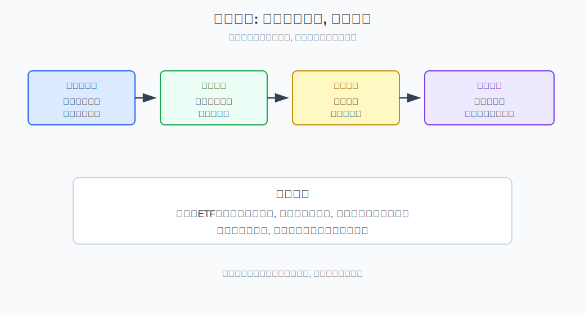
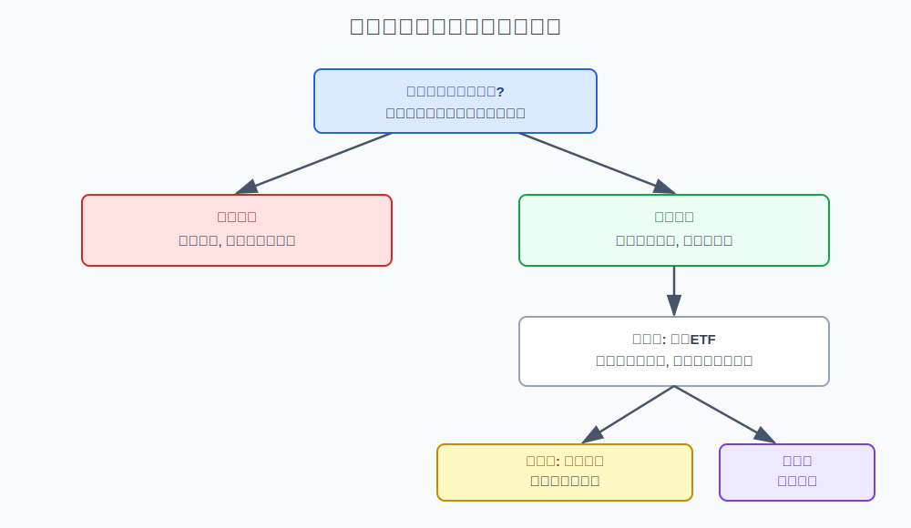
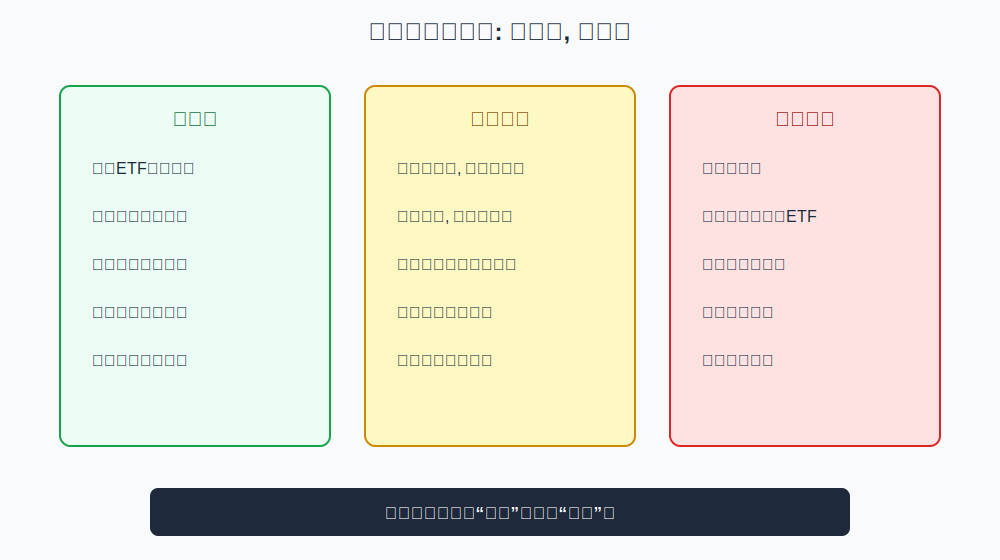

## 散户投资小白金融全品种操盘手册 - 2.3 牛市初期: 宽基ETF、成长风格、弹性行业
  
### 作者  
digoal  
  
### 日期  
2026-05-29  
  
### 标签  
金融产品 , 金融工具 , 散户 , 投资小白 , 全品操盘手册  
  
----  
  
## 背景 

> 适用读者: 想识别牛市初期、但容易一看到反弹就追高的投资小白  
> 本文定位: 投资教育框架, 不构成个性化投资建议。

## 一句话先懂

牛市初期不是“已经安全”，而是市场从极度悲观走向修复；小白应先用宽基ETF验证市场，再逐步观察成长风格和弹性行业。

## 核心观点

本节对应第二章第三节。核心判断是：**牛市初期的正确顺序，不是直接追最猛的行业，而是先确认市场整体修复，再逐步增加弹性。** 宽基ETF买的是市场平均修复，成长风格买的是未来盈利重新定价，弹性行业买的是风险偏好扩散。

小白最容易把“反弹”当“牛市”，把“涨得快”当“最值得买”。但牛市初期的真实特征是四变量开始转好：经济不再恶化，流动性改善，利率压力下降，风险偏好回升。只要这些前提没有互相验证，就不能把短期上涨当成牛市确认。

## 逻辑推导链

| 前提 | 类型 | 为什么重要 | 被推翻时怎么办 |
|---|---|---|---|
| 牛市初期来自风险补偿改善 | 慢变量 | 市场愿意重新给权益资产估值 | 变量未改善就只当反弹 |
| 宽基ETF代表市场平均修复 | 常量 | 降低选错行业和个股的风险 | 宽基不稳时不追行业 |
| 成长风格依赖利率和风险偏好 | 关键变量 | 远期盈利在低利率和高情绪下更值钱 | 利率上行或情绪转弱时降仓 |
| 弹性行业波动更大 | 关键变量 | 涨得快也跌得快 | 必须小仓、分批、设退出 |
| 牛市初期容易反复 | 常量 | 底部修复常有回踩 | 保留现金，等待验证 |

1. **因为牛市初期本质是风险补偿改善**，所以第一步不是找最强题材，而是看四变量是否修复。经济数据不再继续变差，政策和流动性边际改善，利率压力下降，成交和市场情绪回暖，这些信号同时出现，才说明权益风险的胜率在提高。

2. **因为小白最难选对行业和个股**，所以牛市初期优先考虑宽基ETF这类“市场平均工具”。宽基ETF的好处是分散，买的是整体市场修复，不是押注某一个行业一定赢。它不能保证赚钱，但比直接追单一热点更适合作为验证仓。

3. **因为成长风格更依赖远期预期**，所以它通常在流动性改善、利率压力下降、风险偏好回升时更有弹性。成长风格不是“更高级”，而是对预期更敏感：环境修复时涨得快，前提反转时也跌得快。

4. **因为弹性行业最容易吸引情绪资金**，所以它应排在宽基和成长确认之后。弹性行业包括高景气主题、周期反转行业、科技成长方向等。它们的共同点不是必涨，而是波动大，对资金情绪敏感。小白阶段如果一开始就满仓弹性行业，等于把“牛市初期”当成“牛市末期的亢奋”来做。

5. **因此得到结论：牛市初期的顺序是宽基验证、成长观察、弹性小仓。** 越靠前越适合小白建立底仓，越靠后越需要明确条件、仓位上限和止损复盘。

如果关键前提被推翻，结论要重跑。比如宽基指数反弹但成交量没有持续放大，成长风格没有扩散，利率又重新上行，就不能继续按牛市初期处理；应从“逐步进攻”改成“小仓观察或降低仓位”。如果经济和盈利继续下修，短期上涨更可能只是技术反弹，而不是牛市初期。

历史经验也支持这种边界。长期研究显示，股票市场回报来自盈利、估值和风险偏好的共同变化；SEC 关于资产配置和分散的教育材料也提醒普通投资者不要把仓位集中到单一资产或主题。牛市初期正因为不确定性仍高，更需要用分散工具和仓位纪律控制试错成本。

## 适用边界

- 适合市场经历大幅下跌后，出现政策、流动性、成交和风险偏好修复时使用。
- 适合用来区分“牛市初期”和“短期反弹”。
- 不适合用来追逐已经连续暴涨的单一行业或个股。
- 如果宽基没有稳定、四变量没有互相验证，本节结论必须降级为“观察反弹”。

## 操作框架

**第一步：先确认四变量修复。** 至少看到流动性改善、风险偏好回升、经济或盈利预期不再恶化，才进入牛市初期观察。

**第二步：先用宽基ETF验证。** 宽基代表市场平均修复，适合做第一层观察仓。不要一开始就跳到行业或主题。

**第三步：观察成长风格扩散。** 如果成长板块不只是少数股票上涨，而是多个方向轮动扩散，说明风险偏好可能真的回升。

**第四步：弹性行业只做小仓。** 弹性行业必须有仓位上限、买入条件和退出条件。涨得越快，越不能放弃纪律。

**第五步：设置前提失效线。** 利率重新上行、成交萎缩、宽基跌回关键区域、政策预期落空，都要触发复盘。

## 实操例子

假设市场连续下跌一年后，政策开始转向支持经济，市场成交从低位回升，宽基指数不再创新低，成长板块开始从少数龙头扩散到多个方向。

预测式做法会问：“是不是牛市来了？要不要满仓半导体或新能源？”框架式做法先问：四变量是否修复？如果经济仍弱但流动性和风险偏好在改善，可以把它定为“修复观察期”。第一层用宽基ETF小仓验证；第二层观察成长风格是否持续扩散；第三层才考虑少量弹性行业，并提前写好如果宽基再次走弱就停止加仓。

这个流程不保证买完立刻赚钱。它的价值是让你在牛市初期既不错过修复，又不因为过早重仓弹性行业而被回踩打出局。

## 常见错误

1. 把一次大阳线当成牛市确认。
2. 宽基还没稳定，就满仓追行业ETF。
3. 只看涨幅，不看成交、利率和风险偏好是否配合。
4. 把成长风格的高弹性误解成低风险。
5. 不设退出条件，回踩时从“牛市初期”改口成“长期持有”。

## 执行清单

| 买入前必须确认的问题 | 判断标准 |
|---|---|
| 四变量是否开始修复？ | 至少两个以上变量边际改善，且没有明显恶化变量 |
| 宽基是否企稳？ | 不再持续创新低，成交和情绪有修复迹象 |
| 成长风格是否扩散？ | 不只是少数龙头上涨，多个方向轮动变强 |
| 弹性行业仓位是否受控？ | 小仓、分批、有退出条件 |
| 什么情况说明判断错了？ | 利率上行、成交萎缩、宽基转弱或政策落空 |

## 本节小结

牛市初期的重点不是“抢最猛”，而是“确认修复”。对小白来说，宽基ETF是第一层验证工具，成长风格是第二层观察对象，弹性行业是第三层小仓试错。下一节会进入牛市中期：当趋势确认后，如何加仓与止盈。

## 参考资料

- SEC Investor.gov, “Asset Allocation”, https://www.investor.gov/introduction-investing/investing-basics/glossary/asset-allocation
- FINRA, “Diversification”, https://www.finra.org/investors/investing/investing-basics/diversification
- Vanguard, “Principles for Investing Success”, https://investor.vanguard.com/investor-resources-education/how-to-invest/principles-for-investing-success
- Federal Reserve, “Monetary Policy: What Are Its Goals? How Does It Work?”, https://www.federalreserve.gov/monetarypolicy/monetary-policy-what-are-its-goals-how-does-it-work.htm
  
  
#### [PostgreSQL 解决方案集合](../201706/20170601_02.md "40cff096e9ed7122c512b35d8561d9c8")
  
  
#### [德哥 / digoal's Github - 公益是一辈子的事.](https://github.com/digoal/blog/blob/master/README.md "22709685feb7cab07d30f30387f0a9ae")
  
  
#### [About 德哥](https://github.com/digoal/blog/blob/master/me/readme.md "a37735981e7704886ffd590565582dd0")
  
  

  
