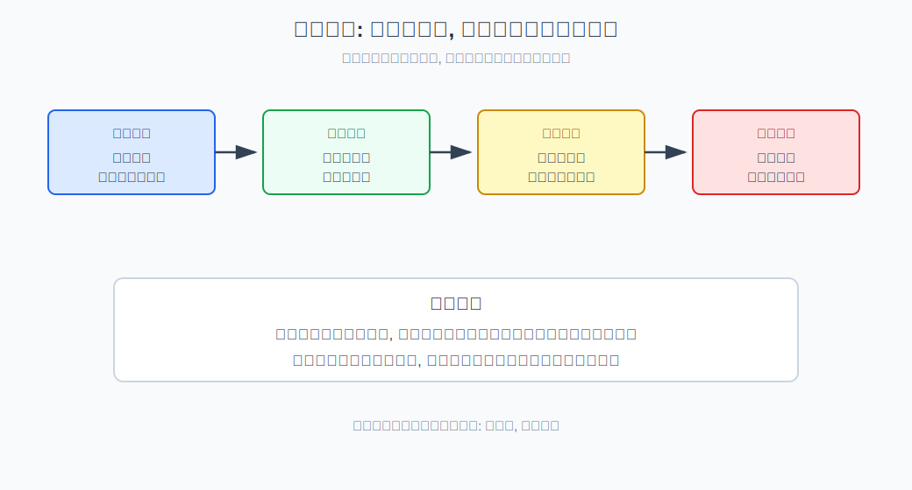
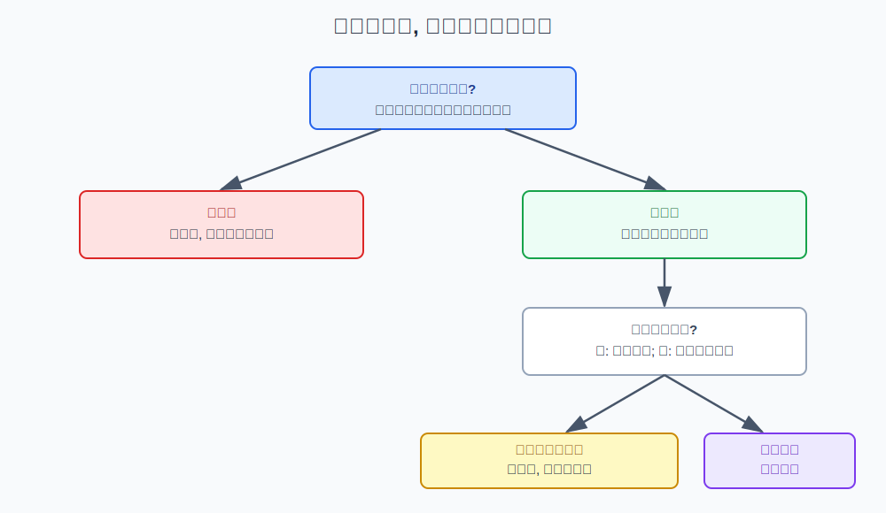
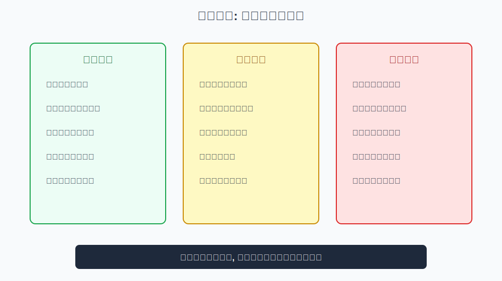

## 散户投资小白金融全品种操盘手册 - 2.4 牛市中期: 趋势确认后的加仓与止盈
  
### 作者  
digoal  
  
### 日期  
2026-05-29  
  
### 标签  
金融产品 , 金融工具 , 散户 , 投资小白 , 全品操盘手册  
  
----  
  
## 背景 
  

> 适用读者: 已能识别牛市初期修复、想学习趋势确认后如何加仓和止盈的投资小白  
> 本文定位: 投资教育框架, 不构成个性化投资建议。

## 一句话先懂

牛市中期可以提高仓位，但每次加仓都要配一个退出或止盈规则；趋势确认不是满仓许可证。

## 核心观点

本节对应第二章第四节。核心判断是：**牛市中期的核心动作不是“追得更猛”，而是“在趋势确认后有规则地加仓，并在上涨过程中分批止盈”。** 趋势确认提高的是胜率，不是确定性。

牛市初期买的是修复，中期买的是趋势延续。问题在于，小白常在趋势最顺的时候放松纪律：本来是分批验证，后来变成满仓追涨；本来有止盈计划，后来变成“再等等”。牛市中期最容易赚钱，也最容易把浮盈还给市场。

## 逻辑推导链

| 前提 | 类型 | 为什么重要 | 被推翻时怎么办 |
|---|---|---|---|
| 趋势确认会提高胜率 | 慢变量 | 宽基、成交、行业扩散同步时，权益风险补偿更好 | 趋势被破坏就停止加仓 |
| 胜率提高不等于确定盈利 | 常量 | 任何趋势都有回撤和假突破 | 仓位不能越过上限 |
| 加仓会提高收益也提高回撤 | 关键变量 | 越加越重时，后续波动影响更大 | 每次加仓都要写退出 |
| 牛市中期估值会逐步升温 | 慢变量 | 越涨越贵，未来收益空间下降 | 分批止盈锁定浮盈 |
| 情绪会在顺境中放大 | 关键变量 | 赚钱后最容易高估自己 | 固定复盘，不临时加码 |

1. **因为牛市中期的趋势已经更清晰**，所以仓位可以比牛市初期更积极。趋势确认不是只看价格上涨，而是看宽基指数能否站稳、成交是否配合、行业上涨是否扩散、四变量是否继续支持风险资产。如果只有价格涨，其他信号不配合，不能称为趋势确认。

2. **因为胜率提高不等于没有风险**，所以加仓必须分层。第一层来自牛市初期的观察仓；第二层可以在宽基突破或回踩确认后增加；第三层只能在趋势继续扩散、仓位仍低于上限时考虑。每一层都要回答：如果这次加错，在哪里停止？

3. **因为仓位越高，回撤越伤人**，所以不能用“行情好”取消仓位上限。假设一个组合原来权益仓位30%，加到60%后，同样10%的市场回撤，对总资产影响会翻倍。牛市中期看起来更安全，但真正的账户风险往往在加仓后上升。

4. **因为牛市中期估值和情绪会逐渐升温**，所以止盈要提前设计。止盈不是看空市场，而是把浮盈从情绪里拿出来，转回规则。常见方式包括：达到仓位上限后不再加仓；单一品种涨幅过大时减一部分；组合偏离原计划时再平衡。

5. **因此得到结论：牛市中期要加仓，也要止盈；要跟随趋势，也要给趋势失效留出口。** 加仓解决“不错过趋势”，止盈解决“不把利润全部交回去”。

如果关键前提变化，结论必须重跑。比如成交放大但指数不再上涨，说明可能有资金分歧；行业轮动从扩散变成少数题材独涨，说明风险偏好可能收缩；利率或流动性重新转紧，估值支撑会变弱。这些都应从“继续加仓”改成“停止加仓、检查止盈或降仓”。

从长期研究看，资产配置和再平衡比追逐单一热门资产更能控制组合风险。SEC 和 FINRA 的投资者教育都强调分散、风险承受力和再平衡的重要性；这正是牛市中期需要分批止盈的底层依据。

## 适用边界

- 适合牛市初期修复后，宽基和行业扩散都已较明确的阶段。
- 适合已有观察仓、想判断是否提高仓位的人。
- 不适合用于刚反弹几天就追高满仓。
- 如果趋势确认信号消失，本节方法必须降级为“持有观察或降仓复盘”。

## 操作框架

**第一步：确认趋势。** 看宽基是否站稳、成交是否健康、行业上涨是否扩散、四变量是否继续支持风险资产。

**第二步：设总仓位上限。** 先规定本轮牛市中期权益仓位最高到哪里，不因短期涨幅临时突破上限。

**第三步：分层加仓。** 突破确认加一层，回踩不破再加一层，行业扩散后才考虑弹性资产。每层都小于总仓位上限。

**第四步：同步止盈。** 加仓时同时写止盈规则：涨幅过大、仓位超标、估值过热、趋势失效，都对应减仓或停止加仓。

**第五步：固定复盘。** 每周或每月检查趋势、仓位、估值和情绪，不在单日大涨时临时扩大计划。

## 实操例子

假设你在牛市初期用宽基ETF建立了20%的观察仓。几周后，宽基站上关键区间，成交温和放大，多个行业轮动上涨，风险偏好明显改善。

框架式做法不是立刻满仓，而是先设本阶段权益仓位上限，例如最多不超过总资产的50%（示例，不是建议）。第一次加仓到30%，条件是宽基突破后能站稳；第二次加仓到40%，条件是回踩不破且行业继续扩散；剩余10%不急着用，留给回撤或更清晰的机会。

止盈也同步写：如果某一层仓位上涨较多导致组合权益占比超过上限，就减回计划内；如果成交放大但价格不涨，停止加仓；如果宽基跌回趋势区间下方，先复盘而不是继续补仓。这样做的目的，是让你参与趋势，但不被趋势牵着走。

## 常见错误

1. 把趋势确认理解成不会回撤。
2. 越涨越加，最后仓位最大时风险也最大。
3. 只设计加仓，不设计止盈。
4. 看到别人赚钱更多，就临时提高自己的仓位上限。
5. 把分批止盈当成卖飞，忽略落袋后仍可继续参与。

## 执行清单

| 加仓前必须确认的问题 | 判断标准 |
|---|---|
| 趋势是否真的确认？ | 宽基、成交、行业扩散至少两项配合 |
| 当前仓位是否低于上限？ | 超过上限不加仓，只考虑再平衡 |
| 这次加仓的退出条件是什么？ | 写出价格、趋势或变量失效条件 |
| 是否已有止盈计划？ | 涨幅、仓位、估值至少有一条止盈规则 |
| 情绪是否影响决策？ | 因害怕错过而加仓，就暂停一天 |

## 本节小结

牛市中期不是无脑乐观期，而是规则执行期。你可以比牛市初期更积极，但必须让加仓、止盈、复盘同时存在。下一节会进入牛市末期：当估值、成交和情绪都过热时，如何从进攻切换到降风险。

## 参考资料

- SEC Investor.gov, “Rebalancing”, https://www.investor.gov/introduction-investing/investing-basics/glossary/rebalancing
- FINRA, “Diversification”, https://www.finra.org/investors/investing/investing-basics/diversification
- Vanguard, “Principles for Investing Success”, https://investor.vanguard.com/investor-resources-education/how-to-invest/principles-for-investing-success
- SEC Investor.gov, “Assessing Your Risk Tolerance”, https://www.investor.gov/introduction-investing/getting-started/assessing-your-risk-tolerance
  
  
#### [PostgreSQL 解决方案集合](../201706/20170601_02.md "40cff096e9ed7122c512b35d8561d9c8")
  
  
#### [德哥 / digoal's Github - 公益是一辈子的事.](https://github.com/digoal/blog/blob/master/README.md "22709685feb7cab07d30f30387f0a9ae")
  
  
#### [About 德哥](https://github.com/digoal/blog/blob/master/me/readme.md "a37735981e7704886ffd590565582dd0")
  
  

  
