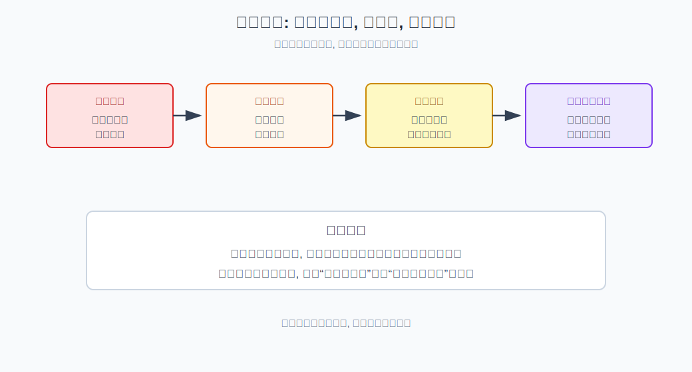
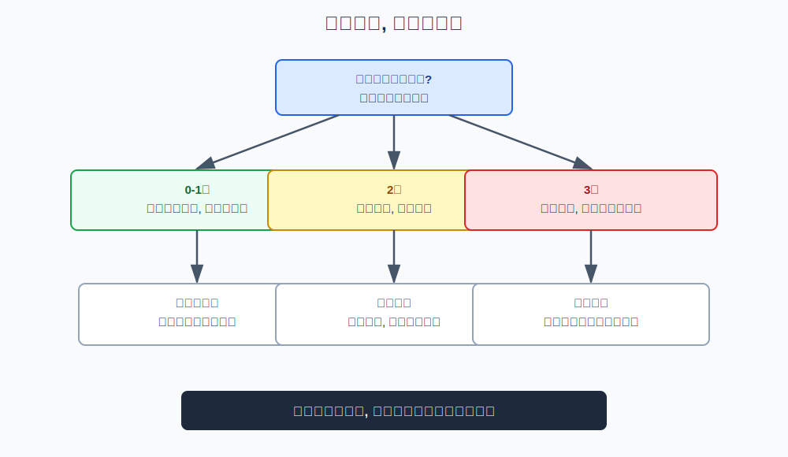
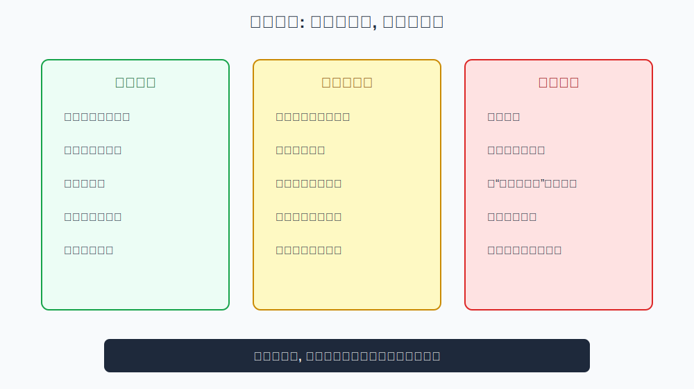

## 散户投资小白金融全品种操盘手册 - 2.5 牛市末期: 估值过热、成交过热、情绪过热时如何降风险
  
### 作者  
digoal  
  
### 日期  
2026-05-29  
  
### 标签  
金融产品 , 金融工具 , 散户 , 投资小白 , 全品操盘手册  
  
----  
  
## 背景 

> 适用读者: 已经历上涨、账户有浮盈、担心卖早又害怕回撤的投资小白  
> 本文定位: 投资教育框架, 不构成个性化投资建议。

## 一句话先懂

牛市末期不是让你猜最高点，而是当估值、成交、情绪同时过热时，先把仓位和弹性风险降下来。

## 核心观点

本节对应第二章第五节。核心判断是：**牛市末期的任务不是卖在顶部，而是在风险补偿变差时主动降风险。** 顶部没人能稳定预测，但估值过热、成交过热、情绪过热这三类信号可以观察。

小白在牛市末期最容易犯的错误，是把前面赚到的钱当成自己能力，把市场的拥挤当成安全感。越多人说“这次不一样”，越应该回到第一章的红线：不借钱、不满仓、不碰不懂的杠杆、不听消息重仓。

## 逻辑推导链

| 前提 | 类型 | 为什么重要 | 被推翻时怎么办 |
|---|---|---|---|
| 顶部无法精确预测 | 常量 | 试图卖最高点会让人迟迟不降仓 | 改成分批降风险 |
| 估值过热会压低未来回报 | 慢变量 | 价格跑得比盈利更快，风险补偿下降 | 减少高估资产暴露 |
| 成交过热意味着拥挤 | 关键变量 | 资金都在同一方向，反转时踩踏更快 | 停止追涨加仓 |
| 情绪过热会放大误判 | 关键变量 | 人人赚钱时最容易放弃纪律 | 固定止盈规则 |
| 弹性越高，回撤越快 | 常量 | 牛市末期高弹性资产最容易剧烈回撤 | 先降弹性，再降总仓位 |

1. **因为顶部无法精确预测**，所以牛市末期不能用“我再赚最后一段”作为策略。你可以不知道哪天见顶，但可以知道风险补偿正在变差。小白要放弃卖最高点的幻想，改成分批止盈、降低弹性、提高现金。

2. **因为估值过热会降低未来收益空间**，所以第一个信号是估值。估值可以粗略理解为“价格相对于盈利贵不贵”。如果价格涨得远快于企业盈利，未来继续上涨就更依赖情绪和资金，而不是基本面。

3. **因为成交过热会制造拥挤**，所以第二个信号是成交。成交放大本身不坏，牛市中期也需要成交配合；但如果成交极度放大、换手频繁、热门行业每天被追逐，就说明越来越多资金挤在同一方向。拥挤交易最怕反转，一旦没人继续接力，回撤会很快。

4. **因为情绪过热会让人低估风险**，所以第三个信号是情绪。朋友、短视频、社群、新闻都在讨论赚钱，新手大量入场，亏损案例没人愿意听，这些都是情绪过热的表现。情绪越热，越要相信规则，而不是相信自己的兴奋。

5. **因此得到结论：三热越多，越要降风险。** 一个过热信号出现，可以不急着卖；两个同时出现，应停止加仓并分批止盈；三个同时出现，就要降低弹性行业和高波动资产占比，把一部分浮盈转回现金、短债或低波动工具。

如果关键前提被推翻，结论要调整。比如估值偏高，但成交和情绪没有过热，趋势仍健康，可以不急于大幅降仓；如果估值不算极端，但成交和情绪已经狂热，也要先降低追涨行为。牛市末期的判断不是单指标，而是三热合成。

历史经验和投资者教育材料都强调，市场狂热阶段往往伴随过度自信、集中交易和风险忽视。FINRA 关于情绪偏差的材料提醒，过度自信和从众会影响投资决策；SEC 对投资骗局和“保证收益”的提醒也说明，越是赚钱叙事泛滥，越要警惕不合理承诺。这里的重点不是证明某轮行情一定见顶，而是说明狂热会降低纪律质量。

## 适用边界

- 适合已经有明显浮盈、市场上涨时间较长、社交环境开始普遍乐观时使用。
- 适合决定是否停止加仓、分批止盈、降低弹性行业占比。
- 不适合用来预测具体顶部日期或指数点位。
- 如果三热没有出现，只是正常上涨，不应因为害怕而过早清仓；仍按趋势和仓位规则处理。

## 操作框架

**第一步：数三热。** 估值是否明显高于常态？成交是否极端放大？情绪是否从谨慎变成全民乐观？

**第二步：停止新增高弹性仓位。** 一旦出现两个以上过热信号，就不再追高行业ETF、主题基金或高波动股票。

**第三步：分批止盈。** 不求卖最高点，而是按仓位、涨幅和估值分层减仓。比如先减弹性行业，再减超出计划的权益仓位。

**第四步：把浮盈转成防守资产。** 可以提高现金、货币基金、短债或低波动工具比例，目的不是看空，而是降低回撤。

**第五步：复盘红线。** 检查是否出现借钱、满仓、听消息重仓、追杠杆等行为。一旦出现，先处理红线，再谈行情。

## 实操例子

假设你在牛市中期持有宽基和部分成长风格仓位，账户浮盈较多。最近指数继续上涨，但估值已经明显抬升，成交量连续放大，身边原本不投资的人也开始讨论“买什么能翻倍”。

预测式做法会问：“是不是马上见顶？要不要一把清仓？”框架式做法先数三热：估值热、成交热、情绪热，三个都出现。结论不是精准逃顶，而是降低风险：停止加仓高弹性行业；把涨幅最大的部分分批止盈；把仓位降回计划上限以内；保留一部分宽基跟随趋势，同时写清楚如果宽基跌破趋势区间就继续降仓。

这样做可能卖早一部分，但它保护了牛市中期已经获得的成果。对小白来说，牛市末期最重要的不是多吃最后一口，而是别把前面吃到的全部吐回去。

## 常见错误

1. 觉得“我知道有泡沫，但还能涨”，于是继续满仓。
2. 把成交火爆当成安全，忽略拥挤后的踩踏风险。
3. 看到别人收益更高，就把止盈计划撕掉。
4. 用“这次不一样”解释任何高估值。
5. 卖出一部分后后悔，立刻追高买回，等于没有执行规则。

## 执行清单

| 降风险前必须确认的问题 | 判断标准 |
|---|---|
| 估值是否过热？ | 价格涨幅明显快于盈利改善 |
| 成交是否过热？ | 成交和换手极度放大，热门方向拥挤 |
| 情绪是否过热？ | 新手大量入场，赚钱叙事压倒风险讨论 |
| 弹性资产是否超标？ | 行业、主题、高波动仓位超过计划 |
| 是否有分批止盈方案？ | 明确减哪一层、减多少、何时复盘 |

## 本节小结

牛市末期最重要的能力，不是预测崩盘，而是识别风险补偿变差并主动降风险。估值、成交、情绪三热越多，越要把仓位从进攻转向防守。下一节会进入震荡市：当方向不清时，如何用红利ETF、可转债、网格和现金管理提高生存质量。

## 参考资料

- FINRA, “Emotional Biases Can Affect Your Investment Decisions”, https://www.finra.org/investors/insights/emotional-biases-can-affect-your-investment-decisions
- SEC Investor.gov, “Avoiding Fraud”, https://www.investor.gov/protect-your-investments/fraud
- FINRA, “Investing Basics: Risk”, https://www.finra.org/investors/investing/investing-basics/risk
- SEC Investor.gov, “Rebalancing”, https://www.investor.gov/introduction-investing/investing-basics/glossary/rebalancing
  
