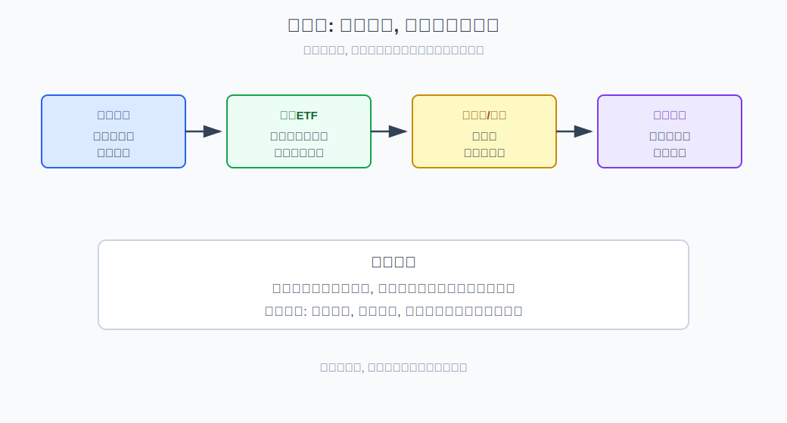
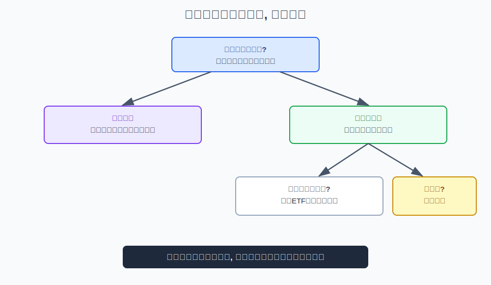
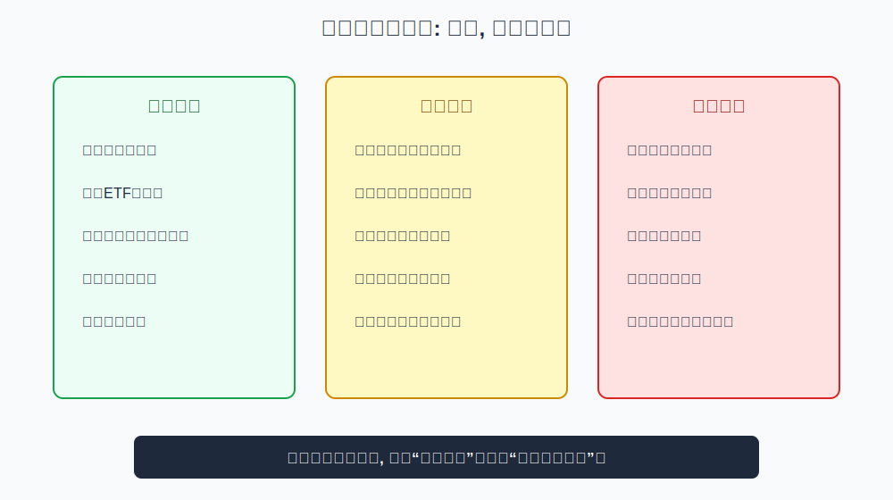

## 散户投资小白金融全品种操盘手册 - 2.6 震荡市: 红利ETF、可转债、网格、现金管理
  
### 作者  
digoal  
  
### 日期  
2026-05-29  
  
### 标签  
金融产品 , 金融工具 , 散户 , 投资小白 , 全品操盘手册  
  
----  
  
## 背景 

> 适用读者: 面对市场上不去、下不深、反复横跳时不知道怎么处理仓位的投资小白  
> 本文定位: 投资教育框架, 不构成个性化投资建议。

## 一句话先懂

震荡市不是让你猜突破方向，而是用现金管理保留选择权，用红利ETF、可转债和网格小仓处理波动。

## 核心观点

本节对应第二章第六节。核心判断是：**震荡市的胜率不来自重仓押方向，而来自现金流、波动纪律和等待权。** 市场方向不清时，最危险的动作是把每一次上涨都当牛市、每一次下跌都当熊市。

红利ETF适合承担相对防守的权益风险，可转债适合学习债性和股性的组合，网格适合在有纪律的区间波动里小仓执行，现金管理负责让你等得起。它们不是稳赚组合，而是震荡市里的工具箱。

## 逻辑推导链

| 前提 | 类型 | 为什么重要 | 被推翻时怎么办 |
|---|---|---|---|
| 震荡市方向不清 | 慢变量 | 单边趋势不明显，追涨杀跌胜率低 | 降低方向赌注 |
| 现金有选择权 | 常量 | 有现金才有等待和再配置能力 | 短期钱优先现金管理 |
| 红利资产偏防守但仍是权益 | 关键变量 | 分红和低估值可缓冲波动，但不保本 | 跌破防守逻辑就降仓 |
| 可转债兼具债性和股性 | 关键变量 | 下有债性、上有弹性，但有条款和信用风险 | 不懂条款只学习不重仓 |
| 网格依赖纪律和区间 | 关键变量 | 有波动才有效，单边下跌会失效 | 设资金上限和停止条件 |

1. **因为震荡市方向不清**，所以第一原则是不重仓赌突破。震荡市的典型状态是：指数涨一段又跌回来，跌一段又被资金托住；四变量互相打架，经济不够强、流动性不够差、风险偏好反复切换。此时追涨杀跌最容易两头挨打。

2. **因为现金有选择权**，所以现金管理是震荡市的底座。现金、货币基金、短债这类工具收益不高，但它们让你不用在每次波动中被迫交易。小白常嫌现金“浪费”，但在方向不清时，现金是等待更清晰信号的门票。

3. **因为红利ETF通常持有分红较高、估值较低的公司**，所以它在震荡市里常被当作防守型权益工具。这里的“防守”不是保本，而是相对成长主题更依赖现金流和分红预期。若市场从震荡转成系统性下跌，红利ETF仍会跌。

4. **因为可转债同时有债性和股性**，所以它适合学习“下有约束、上有弹性”的风险收益结构。债性指它有债券属性，股性指正股上涨时它可能跟涨。但可转债还有强赎、回售、转股价调整、信用风险和流动性风险，不懂条款就重仓，是把复杂工具当简单工具。

5. **因为网格是用规则处理波动**，所以它只适合有区间、有资金上限、有执行纪律的场景。网格不是自动赚钱机器，而是低买高卖的机械规则。它怕单边下跌，也怕你越跌越补没有上限。

因此得到结论：震荡市的工具顺序是现金打底、红利防守、可转债学习、网格小仓。越复杂的工具越要放在小仓和严格规则里，而不是放在主仓位里。

如果关键前提变化，结论要重跑。震荡若向上突破并被四变量验证，就转入牛市中期框架；震荡若向下破位且风险偏好恶化，就转入熊市框架。不要用震荡市工具去硬抗单边趋势。

## 适用边界

- 适合指数反复横盘、四变量互相冲突、方向不清的阶段。
- 适合做防守收益、等待机会和小仓纪律训练。
- 不适合用短期生活钱参与权益波动。
- 不适合在单边下跌或强牛市里机械套用网格。

## 操作框架

**第一步：先分资金期限。** 三到六个月内要用的钱，只做现金、货币基金或短债类管理，不进权益波动。

**第二步：建立现金底座。** 先保留足够现金，再谈红利、可转债和网格。没有现金，震荡市会把你拖进被动交易。

**第三步：红利ETF只做防守权益。** 用它承担一部分权益风险，不把它当保本理财。

**第四步：可转债先学条款。** 没搞懂强赎、转股溢价率、信用风险前，只能小仓学习或暂不参与。

**第五步：网格必须有三条线。** 总资金上限、每格买卖规则、停止条件。缺一条，就不做网格。

## 实操例子

假设市场半年都在一个区间里来回波动，经济数据不强，流动性也没有明显收紧。你手里有一笔一年内不用的闲钱。

框架式做法不是满仓押突破，而是先分层：一部分放现金和短债，确保市场跌下来时你还有选择权；一部分用低仓位红利ETF承担防守型权益风险；如果你愿意学习可转债，就先从条款和低仓位观察开始；如果你想做网格，只能选择自己理解、流动性较好、波动区间相对清楚的工具，并提前写好最多投入多少钱。

如果市场向上突破且成交、风险偏好和四变量配合，就停止把它当震荡市，改用牛市中期框架；如果市场向下破位，就停止网格补仓，转入熊市防守框架。

## 常见错误

1. 把震荡市当低风险市场，结果满仓来回坐电梯。
2. 把红利ETF当保本高息产品，忽略它仍然是权益资产。
3. 不懂可转债条款，只看“债券”两个字就重仓。
4. 网格没有资金上限，越跌越补，最后变成满仓套牢。
5. 市场已经破位，还坚持“震荡总会回来”。

## 执行清单

| 买入前必须确认的问题 | 判断标准 |
|---|---|
| 这笔钱多久不用？ | 短期钱只做现金和低波动管理 |
| 当前真是震荡市吗？ | 指数区间波动，四变量没有同向趋势 |
| 红利ETF是否被当成保本？ | 如果是，就降低预期和仓位 |
| 可转债条款是否理解？ | 不懂强赎、溢价、信用风险就不重仓 |
| 网格是否有上限和停止条件？ | 没有资金上限就不做 |

## 本节小结

震荡市最重要的不是抓住每一次小波动，而是让自己在方向不清时不犯大错。现金给你等待权，红利ETF给你防守型权益暴露，可转债和网格只能在理解规则后小仓使用。下一节进入熊市：当市场转为系统性下跌时，现金、短债、黄金和分批定投如何承担不同任务。

## 参考资料

- SEC Investor.gov, “Asset Allocation”, https://www.investor.gov/introduction-investing/investing-basics/glossary/asset-allocation
- FINRA, “Investing Basics: Risk”, https://www.finra.org/investors/investing/investing-basics/risk
- 上海证券交易所, “可转换公司债券投资者教育专栏”, https://edu.sse.com.cn/cbond/
- 深圳证券交易所投资者教育, “可转换公司债券投资者教育”, https://investor.szse.cn/knowledge/bond/
  
  
#### [PostgreSQL 解决方案集合](../201706/20170601_02.md "40cff096e9ed7122c512b35d8561d9c8")
  
  
#### [德哥 / digoal's Github - 公益是一辈子的事.](https://github.com/digoal/blog/blob/master/README.md "22709685feb7cab07d30f30387f0a9ae")
  
  
#### [About 德哥](https://github.com/digoal/blog/blob/master/me/readme.md "a37735981e7704886ffd590565582dd0")
  
  

  
