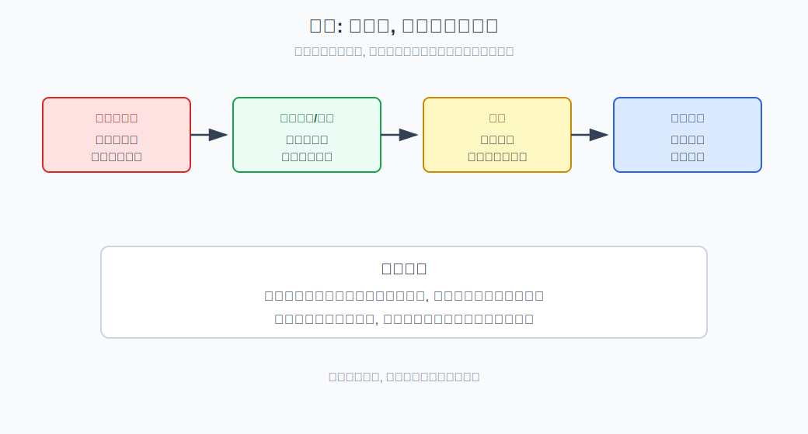
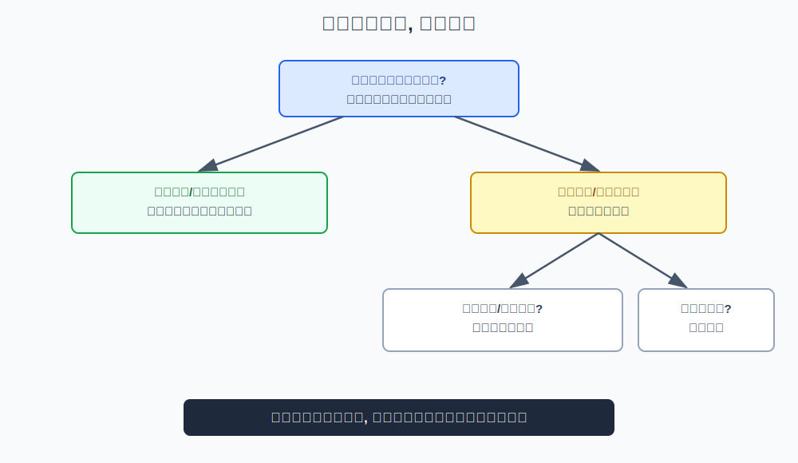
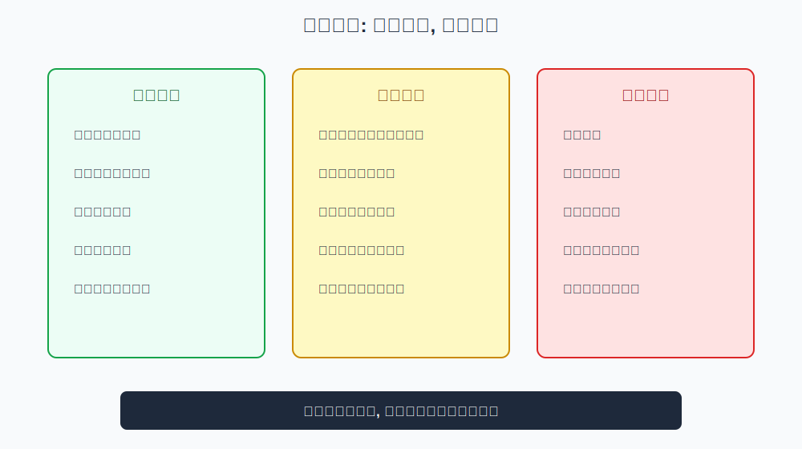

## 散户投资小白金融全品种操盘手册 - 2.7 熊市: 货币基金、短债、黄金、分批定投
  
### 作者  
digoal  
  
### 日期  
2026-05-29  
  
### 标签  
金融产品 , 金融工具 , 散户 , 投资小白 , 全品操盘手册  
  
----  
  
## 背景 

> 适用读者: 面对系统性下跌、不知道该空仓、防守还是定投的投资小白  
> 本文定位: 投资教育框架, 不构成个性化投资建议。

## 一句话先懂

熊市不是抄底比赛，而是现金流、心理承受力和仓位纪律的压力测试；先活下来，再谈修复机会。

## 核心观点

本节对应第二章第七节。核心判断是：**熊市里的工具要分工：货币基金和短债保护流动性，黄金对冲部分极端不确定性，分批定投用小额资金保留未来修复机会。**

小白在熊市最容易犯两个反向错误：一种是恐慌卖光，从此不敢再看市场；另一种是觉得跌多了就便宜，借钱或满仓抄底。正确做法不是预测最低点，而是把资金分层，让短期钱安全、长期钱有计划地试错。

## 逻辑推导链

| 前提 | 类型 | 为什么重要 | 被推翻时怎么办 |
|---|---|---|---|
| 熊市是系统性风险释放 | 慢变量 | 盈利、估值、情绪可能同时下行 | 不重仓赌反转 |
| 现金流决定生存能力 | 常量 | 没现金会被迫低位卖出 | 先保护生活钱和短期钱 |
| 货币基金和短债波动较低 | 关键变量 | 可降低账户波动和心理压力 | 若信用或利率风险升高，缩短久期 |
| 黄金能对冲部分极端风险 | 关键变量 | 但不产生现金流，也会波动 | 只作少量配置，不当保本 |
| 定投需要长期资金和纪律 | 关键变量 | 熊市定投可能长期浮亏 | 用小额、固定、可承受的钱 |

1. **因为熊市是系统性风险释放**，所以不要把一次反弹当反转。熊市里，企业盈利可能下修，估值可能继续压缩，风险偏好也会下降。此时最重要的不是“赚快钱”，而是避免被连续下跌打到无法继续参与。

2. **因为现金流决定你能不能熬过熊市**，所以第一层工具是现金、货币基金和短债。货币基金主要用于日常流动性，短债用于承担较低波动的利率和信用风险。它们收益不高，但能减少被迫卖出的概率。

3. **因为熊市常伴随信用、货币或地缘不确定性**，所以黄金可以作为少量对冲工具。黄金不是保本资产，也不产生利息，它的价值来自市场对货币信用、实际利率和避险需求的重新定价。小白不能把黄金当“稳赚避险”，只能把它当组合里的风险分散工具。

4. **因为长期权益资产会在低估区域积累赔率**，所以分批定投可以保留未来修复机会。定投的本质不是猜底，而是把一次性买入风险拆成多次。它要求资金期限足够长、金额足够小、心理能承受长期浮亏。

5. **因此得到结论：熊市顺序是先防守，再小额进攻。** 先把生活钱、短期钱、应急钱放在低波动工具；再考虑少量黄金对冲；最后才用长期闲钱分批定投宽基或自己理解的资产。

如果关键前提变化，结论要重跑。若熊市转为震荡，定投可以放慢，现金管理和红利工具权重上升；若出现流动性危机或信用风险扩散，短债也要更谨慎，优先选择更低信用风险和更短久期工具；若四变量开始同向修复，才逐步回到牛市初期框架。

权威投资者教育也支持这种边界。SEC 和 FINRA 都强调资产配置、分散和风险承受力；定投可以降低一次性买入时点风险，但不能保证盈利。世界黄金协会长期研究则把黄金视为组合分散工具之一，而不是无波动收益资产。

## 适用边界

- 适合市场系统性下跌、风险偏好下降、账户心理压力显著增加的阶段。
- 适合保护现金流、降低波动、保留长期修复机会。
- 不适合用来借钱抄底、满仓赌政策底。
- 如果资金三到六个月内要用，不应参与权益定投。

## 操作框架

**第一步：先分资金。** 生活钱、应急钱、短期要用的钱，只放现金、货币基金或低波动短债类工具。

**第二步：降低账户波动。** 把会影响睡眠和生活的权益仓位降到可承受范围，避免因恐慌在低位卖出。

**第三步：少量使用黄金。** 只有在理解黄金波动、实际利率和汇率影响后，才把黄金作为组合分散工具。

**第四步：定投只用长期闲钱。** 金额要小到连续下跌时也能继续执行，不能用生活钱或借款。

**第五步：设置复盘条件。** 若经济、流动性、利率和风险偏好开始同向修复，再逐步提高权益观察仓。

## 实操例子

假设市场连续下跌半年，你账户回撤较大，工资收入稳定，但未来一年可能有大额家庭支出。

框架式做法先分资金：一年内要用的钱不参与定投，放在现金、货币基金或低波动短债；长期不用的钱再分成几部分：一小部分用于宽基定投，一小部分可考虑黄金对冲，其余继续保留现金。每月定投金额必须小到即使市场再跌20%，你也不会中断生活安排。

如果后续市场只是反弹几天，但四变量没有修复，不提高定投金额；如果市场继续破位，也不无限加码；如果四变量逐步修复，再按牛市初期框架重新评估。

## 常见错误

1. 把熊市反弹当反转，短期涨几天就满仓。
2. 用生活钱定投，跌到真正便宜时反而没钱。
3. 觉得货币基金和短债收益低，于是放弃现金保护。
4. 把黄金当保本资产，忽视它也会大幅波动。
5. 定投没有金额上限，越跌越加，最后心理崩溃。

## 执行清单

| 熊市操作前必须确认的问题 | 判断标准 |
|---|---|
| 这笔钱是否短期要用？ | 要用就不参与权益定投 |
| 当前权益仓位是否影响生活？ | 影响睡眠和现金流就先降风险 |
| 短债是否有信用和久期风险？ | 不懂就选择更短久期、更低信用风险 |
| 黄金配置是否只是少量对冲？ | 不能把黄金当保本或主仓位 |
| 定投能否持续执行？ | 金额小、期限长、能承受长期浮亏 |

## 本节小结

熊市里最重要的收益，是不被迫在低点卖出。货币基金和短债保护流动性，黄金分散部分极端风险，分批定投保留未来修复机会。下一节会进入利率下行环境：为什么债券ETF、高股息和REITs可能成为更重要的工具。

## 参考资料

- SEC Investor.gov, “Dollar-Cost Averaging”, https://www.investor.gov/introduction-investing/investing-basics/glossary/dollar-cost-averaging
- FINRA, “Investing Basics: Risk”, https://www.finra.org/investors/investing/investing-basics/risk
- SEC Investor.gov, “Asset Allocation”, https://www.investor.gov/introduction-investing/investing-basics/glossary/asset-allocation
- World Gold Council, “The relevance of gold as a strategic asset”, https://www.gold.org/goldhub/research/relevance-of-gold-as-a-strategic-asset
  
