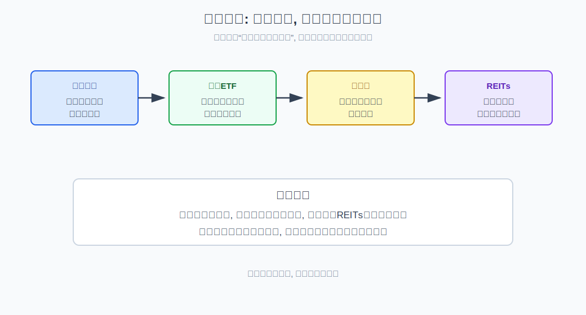
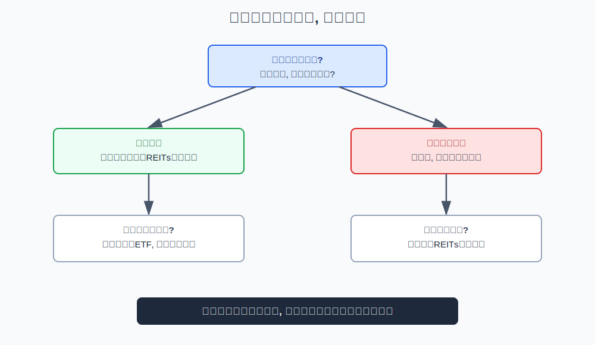
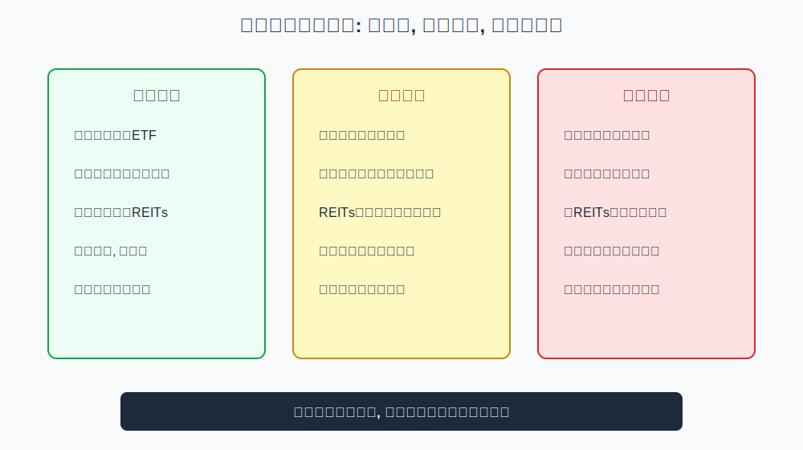

## 散户投资小白金融全品种操盘手册 - 2.8 利率下行: 债券ETF、高股息、REITs
  
### 作者  
digoal  
  
### 日期  
2026-05-29  
  
### 标签  
金融产品 , 金融工具 , 散户 , 投资小白 , 全品操盘手册  
  
----  
  
## 背景 

> 适用读者: 想理解降息、利率下行时为什么债券、高股息和REITs常被讨论的投资小白  
> 本文定位: 投资教育框架, 不构成个性化投资建议。

## 一句话先懂

利率下行会让稳定现金流资产更容易被重新估值，但不同工具受益路径不同：债券看久期，高股息看分红质量，REITs看项目现金流。

## 核心观点

本节对应第二章第八节。核心判断是：**利率下行不是买入指令，而是重新比较现金流资产吸引力的起点。** 债券ETF、高股息和REITs都可能受益于利率下行，但它们承担的风险完全不同。

小白最容易犯的错，是听到“降息利好”就把所有高息资产当成安全资产。事实上，利率下行可能来自温和宽松，也可能来自经济走弱。前者可能利好多类资产，后者可能伤害企业盈利、租金和项目现金流。

## 逻辑推导链

| 前提 | 类型 | 为什么重要 | 被推翻时怎么办 |
|---|---|---|---|
| 利率是钱的价格 | 常量 | 决定债券价格和现金流折现 | 无法推翻，只能理解 |
| 债券价格与利率通常反向 | 常量 | 利率下降时旧债票息更有吸引力 | 利率反弹时减小久期 |
| 久期决定债券波动 | 关键变量 | 久期越长，对利率越敏感 | 小白先从中短久期理解 |
| 高股息依赖分红质量 | 关键变量 | 高股息率可能来自股价下跌 | 看盈利和现金流 |
| REITs依赖项目现金流 | 关键变量 | 利率下行可抬估值，但经营变差会抵消 | 先看资产质量和负债 |

1. **因为利率是钱的价格**，所以利率下行会改变所有现金流资产的吸引力。简单说，未来每年收到100元现金流，当市场利率从4%降到2%时，这100元相对更值钱，资产估值就可能上升。

2. **因为债券有固定票息**，所以债券ETF通常最直接受利率影响。老债券票息固定，新市场利率下降后，老债券相对更有吸引力，价格可能上涨。但债券ETF不是货币基金，它有净值波动，久期越长，对利率变化越敏感。

3. **因为高股息资产提供分红现金流**，所以利率下行时，分红相对吸引力可能提高。比如无风险利率下降后，稳定分红公司的股息收益率看起来更有吸引力。但高股息不是保本，高股息率也可能只是股价下跌造成的“看起来很高”。

4. **因为REITs的价值来自项目租金、收费或运营现金流**，所以利率下行可能通过两条路径影响REITs：一是折现率下降抬高估值，二是融资成本下降改善项目财务压力。但如果底层项目经营下滑，利率利好也可能被现金流恶化抵消。

5. **因此得到结论：利率下行环境下，小白的工具顺序应是先懂债券久期，再看高股息质量，最后评估REITs现金流。** 越靠后越像权益或经营资产，不能只看“收益率”三个字。

如果关键前提变化，结论要重跑。若利率下行来自经济严重走弱，债券可能受益更直接，但高股息和REITs的盈利、租金、收费可能承压；若利率已经大幅下行，债券ETF价格已涨很多，再追长久期就会暴露在利率反弹风险下。

权威投资者教育也支持这些边界。SEC 和 FINRA 都强调债券存在利率风险，利率上升会压低已有债券价格；REITs投资也需要关注底层资产、费用、流动性和分派可持续性。这些规则说明：利率只是变量之一，不能替代现金流质量判断。

## 适用边界

- 适合货币政策转向宽松、市场利率趋势下行、风险偏好尚未明显修复的阶段。
- 适合判断债券ETF、高股息、REITs在组合里的分工。
- 不适合把所有“高息”产品当保本工具。
- 如果利率下行伴随严重经济下行，权益类现金流资产要更谨慎。

## 操作框架

**第一步：判断利率为什么下行。** 是温和宽松，还是经济压力导致资金避险？前者工具更丰富，后者先看债券防守。

**第二步：从久期低到久期高学习债券ETF。** 久期可以理解为债券对利率变化的敏感度。小白不懂久期时，不要重仓长久期债券ETF。

**第三步：高股息先看分红质量。** 分红是否来自稳定盈利和现金流，而不是一次性收益或股价大跌后的被动高股息率。

**第四步：REITs先看底层项目。** 关注资产类型、出租率、收费能力、负债成本和分派可持续性，而不是只看分派率。

**第五步：设置利率反转复盘。** 如果利率重新上行，债券ETF、高股息和REITs都要重新评估仓位。

## 实操例子

假设央行进入宽松周期，市场利率连续下行，股市风险偏好还没有明显恢复。你想知道该看债券ETF、高股息还是REITs。

框架式做法先问原因：如果是温和宽松，债券ETF可能直接受益，高股息和REITs也可能因现金流相对吸引力提高而被关注。然后分工具：先用中短久期债券ETF学习利率风险；再筛高股息时看盈利和分红稳定性；最后看REITs时，不问“分派率高不高”，而问底层项目现金流是否稳定。

如果几个月后利率已经很低，而市场开始担心通胀或经济复苏导致利率反弹，就不能继续用“利率下行”旧逻辑追涨，需要复盘久期和仓位。

## 常见错误

1. 以为债券ETF和货币基金一样不会跌。
2. 不懂久期，却重仓长久期债券。
3. 只看股息率，不看企业盈利和分红可持续性。
4. 把REITs分派率当成保本收益。
5. 利率已经大幅下行后追涨，忽略反转风险。

## 执行清单

| 买入前必须确认的问题 | 判断标准 |
|---|---|
| 利率为什么下行？ | 温和宽松还是经济压力，要分清 |
| 债券ETF久期多长？ | 久期越长，利率反弹回撤越大 |
| 高股息是否有真实现金流支撑？ | 看盈利、现金流和分红历史 |
| REITs底层项目是否稳定？ | 看出租率、收费能力、负债和分派来源 |
| 什么情况推翻判断？ | 利率反弹、信用风险上升、现金流恶化 |

## 本节小结

利率下行会让现金流资产更受关注，但债券ETF、高股息和REITs不是同一种风险。小白要先理解久期，再看分红质量，最后评估底层项目现金流。下一节会进入通胀上行环境：黄金、商品基金、资源股和REITs为什么会被重新定价。

## 参考资料

- SEC Investor.gov, “Bonds”, https://www.investor.gov/introduction-investing/investing-basics/investment-products/bonds-or-fixed-income-products/bonds
- FINRA, “Duration: What an Interest Rate Hike Could Do to Your Bond Portfolio”, https://www.finra.org/investors/insights/duration-what-interest-rate-hike-could-do-your-bond-portfolio
- SEC Investor.gov, “Real Estate Investment Trusts (REITs)”, https://www.investor.gov/introduction-investing/investing-basics/investment-products/real-estate-investment-trusts-reits
- Nareit, “REITs and Interest Rates”, https://www.reit.com/news/blog/market-commentary/reits-and-interest-rates
  
