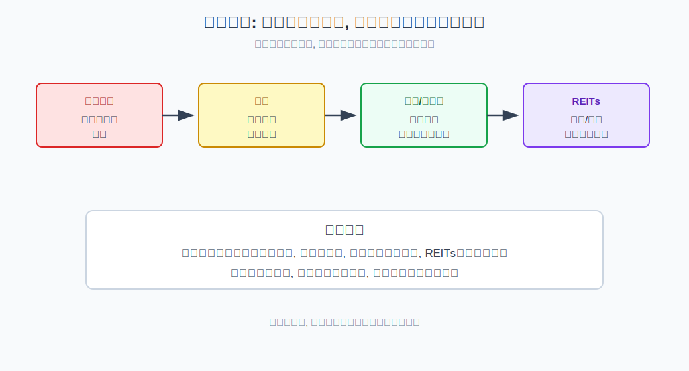
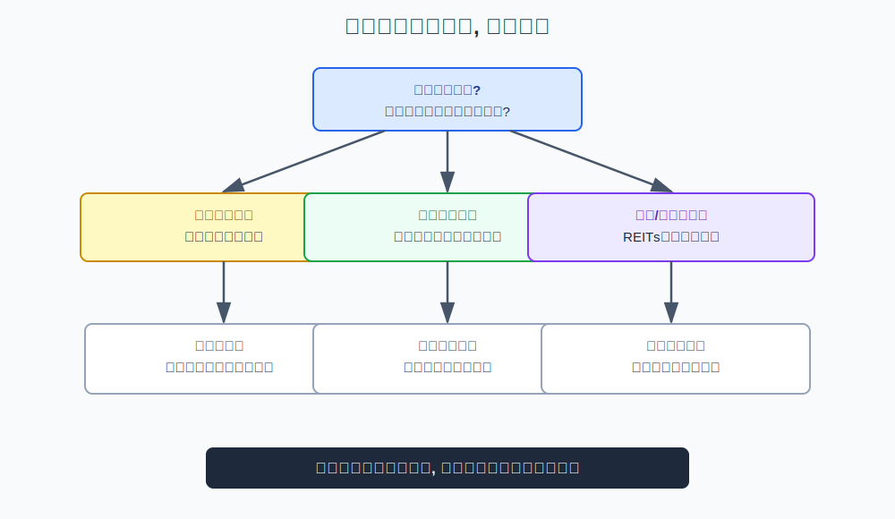
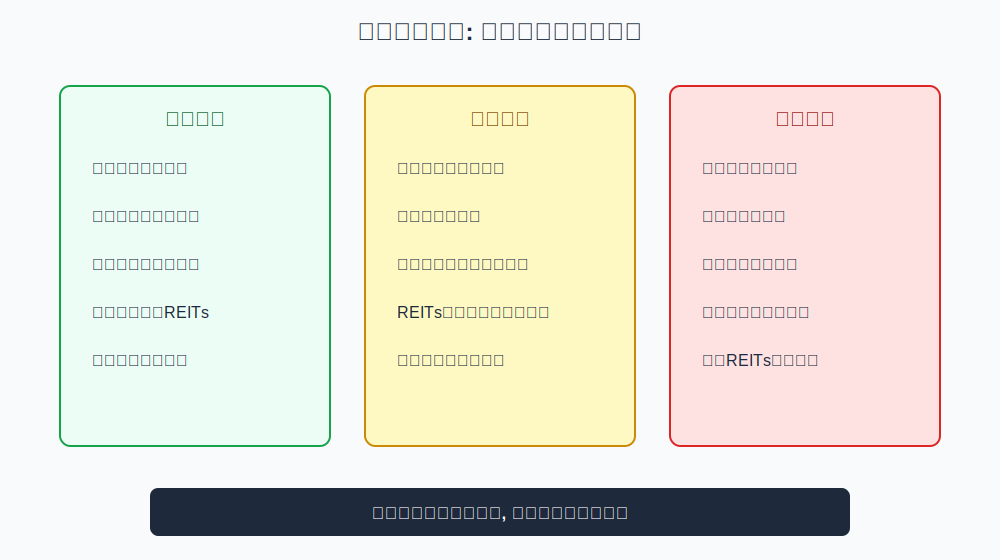

## 散户投资小白金融全品种操盘手册 - 2.9 通胀上行: 黄金、商品基金、资源股、REITs
  
### 作者  
digoal  
  
### 日期  
2026-05-29  
  
### 标签  
金融产品 , 金融工具 , 散户 , 投资小白 , 全品操盘手册  
  
----  
  
## 背景 

> 适用读者: 想理解物价上涨时为什么黄金、商品、资源股和REITs会被关注的投资小白  
> 本文定位: 投资教育框架, 不构成个性化投资建议。

## 一句话先懂

通胀上行会侵蚀现金购买力，但不是所有“抗通胀资产”都安全；你要看它靠什么机制抵抗通胀。

## 核心观点

本节对应第二章第九节。核心判断是：**通胀上行时，黄金、商品基金、资源股、REITs可能被重新定价，但它们不是同一种风险。** 黄金看货币信用和实际利率，商品基金看供需，资源股看利润弹性，REITs看租金或收费能否传导通胀。

小白最容易犯的错，是把“通胀利好实物资产”简化成“买黄金、买商品、买资源股一定赚钱”。真正重要的是：通胀来自哪里？价格是否已经涨过？企业能否把成本转嫁出去？底层现金流是否能跟着物价调整？

## 逻辑推导链

| 前提 | 类型 | 为什么重要 | 被推翻时怎么办 |
|---|---|---|---|
| 通胀会降低现金购买力 | 常量 | 持有现金的真实价值被侵蚀 | 寻找能传导通胀的资产 |
| 黄金不是生息资产 | 常量 | 它主要赚货币信用和实际利率重估的钱 | 实际利率上行时降低预期 |
| 商品价格由供需决定 | 关键变量 | 通胀若来自供给短缺，商品更敏感 | 供需缓解时及时复盘 |
| 资源股不是商品本身 | 关键变量 | 它还有成本、管理、估值和政策风险 | 不把资源股当纯商品替代 |
| REITs依赖租金和收费传导 | 关键变量 | 能提价才可能对抗通胀 | 现金流不能传导时降仓 |

1. **因为通胀会降低现金购买力**，所以市场会寻找能够跟随物价重估的资产。通胀不是简单的“东西都涨”，而是货币购买力下降、原材料成本上升、企业利润结构变化、利率预期调整同时发生。

2. **因为黄金不产生现金流**，所以它不是靠分红或利息赚钱，而是靠货币信用、实际利率和避险需求变化被重估。实际利率可以理解为名义利率扣掉通胀后的真实收益。如果通胀上行而利率没有同步上行，实际利率下降，黄金可能更受关注；如果央行大幅加息压通胀，黄金也可能承压。

3. **因为商品价格直接受供需影响**，所以商品基金可能对通胀更敏感。能源、金属、农产品等商品，如果供给受限或需求过热，价格可能上涨。但商品基金波动很大，且常受期货合约、展期成本、汇率和政策影响，不是普通低风险基金。

4. **因为资源股是经营企业，不是商品本身**，所以资源股只在“商品涨价能变成利润”时更有弹性。若成本也上涨、政策限价、产量受限或估值已经过热，资源股可能不涨反跌。商品涨价和资源股赚钱之间，中间隔着成本、产量、税费和估值。

5. **因为REITs的价值来自底层项目现金流**，所以它抗通胀的前提是租金、通行费、仓储费等收入能跟着通胀调整。如果项目合同锁定价格、需求下降或融资成本上升，通胀并不会自动变成REITs收益。

因此得到结论：通胀上行时，小白应先识别通胀来源，再选择工具。货币信用担忧偏向黄金，商品供需紧张偏向商品基金或资源行业观察，租金收费能传导时才考虑REITs。任何一种都不适合无脑重仓。

如果关键前提变化，结论要重跑。通胀若被加息压下去，黄金和商品可能回落；供给短缺若缓解，商品基金可能大幅波动；资源股若利润没有跟上商品价格，行情可能提前结束；REITs若融资成本上升超过租金改善，也可能承压。

## 适用边界

- 适合物价持续上行、商品供需紧张、实际利率下行或货币信用担忧增强的阶段。
- 适合做组合分散和小仓风险对冲。
- 不适合把黄金、商品或资源股当保本资产。
- 若通胀已经被市场充分预期、价格涨幅很大，应先复盘而不是追涨。

## 操作框架

**第一步：判断通胀来源。** 是货币宽松、供给冲击、需求过热，还是汇率输入型通胀？来源不同，工具不同。

**第二步：黄金看实际利率。** 通胀高但利率也快速上行时，黄金未必强；通胀高且实际利率下降时，黄金更有逻辑。

**第三步：商品看供需和库存。** 只看价格涨不够，还要看供给是否短缺、库存是否下降、需求是否持续。

**第四步：资源股看利润传导。** 商品涨价能否转化为企业利润，而不是被成本、政策或产量限制吞掉。

**第五步：REITs看合同和负债。** 收入能否随通胀调整，融资成本是否上升，项目需求是否稳定。

## 实操例子

假设能源价格上涨带动通胀走高，市场开始讨论黄金、商品基金和资源股。框架式做法不是直接买涨得最多的资产，而是先拆来源：

如果能源供给受限且库存下降，商品本身可能更直接受影响；如果市场担心货币购买力下降、实际利率走低，黄金逻辑更强；如果某些资源企业能把涨价转化为利润，资源股才有弹性；如果某类REITs的租金可以重定价，且负债成本没有明显恶化，才可能分享通胀传导。

如果几个月后供给恢复、商品价格回落、央行加息抬升实际利率，就不能继续用通胀上行旧逻辑持有高波动仓位，应按前提失效规则复盘。

## 常见错误

1. 把黄金当成永远上涨的避险资产。
2. 商品基金涨得快就追，忽略高波动和回撤。
3. 把资源股当商品本身，忽略企业经营风险。
4. 只看REITs分派率，不看租金传导和融资成本。
5. 通胀预期已经很热时才重仓进场。

## 执行清单

| 买入前必须确认的问题 | 判断标准 |
|---|---|
| 通胀来源是什么？ | 货币、供给、需求、汇率至少分清一类 |
| 黄金逻辑是否来自实际利率？ | 实际利率下降比单纯通胀更关键 |
| 商品供需是否真的紧张？ | 看库存、产量、需求，而不是只看涨幅 |
| 资源股利润能否传导？ | 商品涨价能进入利润表才有意义 |
| REITs现金流能否抗通胀？ | 租金/收费可调整，负债风险可控 |

## 本节小结

通胀上行会让实物和现金流资产被重新定价，但每类工具的机制不同。黄金看货币信用和实际利率，商品看供需，资源股看利润传导，REITs看底层项目现金流。下一节会进入海外资产配置：美股、港股、QDII和美元资产如何叠加汇率风险。

## 参考资料

- World Gold Council, “Gold and inflation”, https://www.gold.org/goldhub/research/gold-and-inflation
- SEC Investor.gov, “Commodity Futures”, https://www.investor.gov/introduction-investing/investing-basics/investment-products/commodity-futures
- CME Group, “What Are Commodities?”, https://www.cmegroup.com/education/courses/introduction-to-futures/what-are-commodities.html
- Nareit, “REITs and Inflation”, https://www.reit.com/news/blog/market-commentary/reits-and-inflation
  
