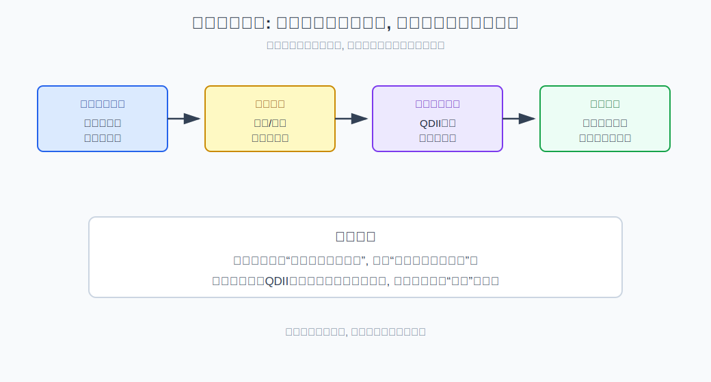
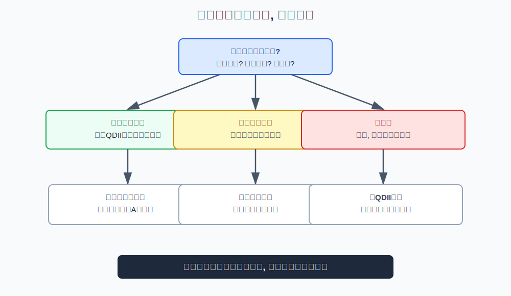
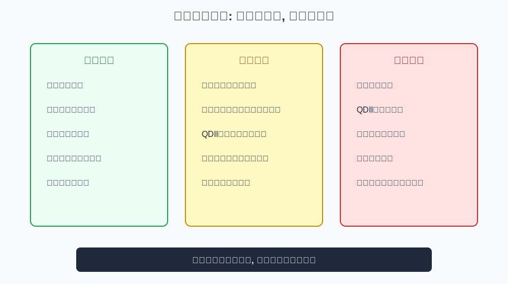

## 散户投资小白金融全品种操盘手册 - 2.10 海外资产配置: 美股、港股、QDII、美元资产
  
### 作者  
digoal  
  
### 日期  
2026-05-29  
  
### 标签  
金融产品 , 金融工具 , 散户 , 投资小白 , 全品操盘手册  
  
----  
  
## 背景 

> 适用读者: 想用海外资产分散A股和人民币单一风险的投资小白  
> 本文定位: 投资教育框架, 不构成个性化投资建议。

## 一句话先懂

海外资产配置不是“买国外就更安全”，而是在市场风险之外，再叠加汇率、通道、监管和产品结构风险。

## 核心观点

本节对应第二章第十节。核心判断是：**海外配置的第一目标是分散，而不是追热点。** 美股、港股、QDII、美元资产看起来都叫“海外”，但底层风险并不一样。

美股主要承担美国经济、利率、估值和行业风险；港股同时受中国基本面和海外流动性影响；QDII是通过基金通道买海外资产，会有额度、溢价、汇率和时差问题；美元资产还叠加人民币兑美元汇率波动。小白不能把它们混成一个“海外资产”标签。

## 逻辑推导链

| 前提 | 类型 | 为什么重要 | 被推翻时怎么办 |
|---|---|---|---|
| 单一市场存在集中风险 | 常量 | 只持有A股会暴露在单一经济和政策周期中 | 用海外资产做分散 |
| 海外资产多一层汇率风险 | 关键变量 | 海外资产涨了，换回人民币也可能缩水 | 先判断资金用途和期限 |
| 不同市场驱动因素不同 | 慢变量 | 美股、港股、美元资产不是同一风险 | 分开评估，不合并判断 |
| QDII有产品结构风险 | 关键变量 | 可能有溢价、额度、申赎和跟踪误差 | 高溢价时暂停追涨 |
| 分散不能替代仓位纪律 | 常量 | 分散后仍会亏损 | 保留仓位上限和复盘 |

1. **因为单一市场有集中风险**，所以海外配置有意义。你如果所有资产都在A股和人民币资产里，就会集中暴露在同一经济周期、政策周期和货币周期中。海外资产的价值，是让组合多一个风险来源，不是让风险消失。

2. **因为海外资产多一层汇率风险**，所以不能只看当地市场涨跌。比如一个美元资产上涨5%，但人民币对美元升值，换回人民币后的收益可能被抵消；反过来，海外资产不涨，汇率变化也可能影响人民币收益。汇率是双向变量，不是只会帮你赚钱。

3. **因为美股、港股、QDII、美元资产驱动不同**，所以要分开看。美股常受美国利率、科技权重、盈利和估值影响；港股虽然用港币交易，却很大程度受中国基本面、海外流动性和风险偏好共同影响；美元资产可能是美元现金、债券、基金或存款，风险差别很大。

4. **因为QDII是通道产品**，所以除了底层资产，还要看产品结构。QDII可能出现额度限制、申赎暂停、场内溢价、汇率折算、时差导致的净值滞后。买QDII不是直接买海外市场，还买了一个基金通道。

5. **因此得到结论：海外配置的顺序是先问目的，再选市场，再选通道，最后设仓位。** 如果目的是分散A股风险，宽基海外指数工具比单一热门主题更适合作为起点；如果目的是分散人民币风险，就要明确自己是否能承受汇率波动。

如果关键前提变化，结论要重跑。若人民币明显升值，海外资产换回人民币可能承压；若美国利率上行，高估值美股和长久期美元债可能同时承压；若QDII场内溢价过高，即使底层资产没涨，买入者也可能先亏溢价回落。

SEC 和 FINRA 的投资者教育都提醒，国际投资存在汇率、政治、流动性、信息披露和市场结构风险；这说明海外配置不是“更高级的投资”，而是多了一组需要管理的变量。

## 适用边界

- 适合长期资金做市场和货币分散。
- 适合已有国内资产基础、想降低单一市场暴露的人。
- 不适合短期要用的钱赌汇率或追海外热点。
- 不适合在QDII高溢价、底层资产已大涨时追入。

## 操作框架

**第一步：确认配置目的。** 是分散A股风险，分散人民币风险，还是只是追美股、港股热点？如果只是追热点，先暂停。

**第二步：区分市场风险。** 美股看美国利率、估值和盈利；港股看中国基本面和海外流动性；美元资产看利率和汇率。

**第三步：检查产品通道。** QDII要看底层资产、费率、跟踪误差、申赎状态、场内溢价和汇率折算。

**第四步：设置仓位上限。** 海外配置是组合的一部分，不是替代全部国内资产。小白应从低比例、宽基、分批开始。

**第五步：固定复盘。** 汇率大幅变化、海外利率转向、QDII溢价异常、底层资产估值过热时，都要复盘。

## 实操例子

假设你已经持有较多A股宽基和现金，想增加海外配置。预测式做法会问：“美股还能不能涨？美元会不会升值？”框架式做法先问目的：你是想分散市场风险，还是分散人民币风险？

如果是分散市场风险，可以先研究覆盖面更广的海外宽基工具，而不是直接追单一热门科技主题；如果是分散货币风险，要理解美元兑人民币可能双向波动，并确认这笔钱不是短期要用。若选择QDII，还要查看是否有高溢价、申赎限制和跟踪误差。

如果后来人民币升值、QDII溢价扩大、海外市场估值升高，你不能只用“长期看好海外”来解释一切，而要分别复盘市场风险、汇率风险和产品结构风险。

## 常见错误

1. 以为海外资产天然更安全，忽略汇率和估值。
2. 把港股当纯海外资产，忘了它同时受中国基本面影响。
3. QDII场内高溢价时追涨，只看涨幅不看价格偏离。
4. 把美元资产等同于美元现金，忽略债券和基金风险。
5. 用海外配置逃避仓位纪律，结果只是换个市场满仓。

## 执行清单

| 买入前必须确认的问题 | 判断标准 |
|---|---|
| 配置目的是什么？ | 分散市场、分散货币，还是追热点 |
| 是否能承受汇率波动？ | 换回人民币后的收益也要测算 |
| 底层市场风险是什么？ | 美股、港股、美元债分开判断 |
| QDII是否有溢价或申赎限制？ | 高溢价、暂停申购时不追涨 |
| 海外仓位是否有上限？ | 作为组合一部分，分批、低比例开始 |

## 本节小结

海外资产配置的价值在于分散，风险在于多了一层汇率和产品结构。小白要把美股、港股、QDII、美元资产拆开看，而不是用“海外”两个字覆盖所有风险。下一节会讲市场切换时，如何从“猜对方向”改成“调整仓位”。

## 参考资料

- SEC Investor.gov, “International Investing”, https://www.investor.gov/introduction-investing/investing-basics/investment-products/international-investing
- FINRA, “International Investing”, https://www.finra.org/investors/investing/investment-products/international-investing
- SEC Investor.gov, “Mutual Funds and ETFs”, https://www.investor.gov/introduction-investing/investing-basics/investment-products/mutual-funds-and-exchange-traded
- 香港投资者及理财教育委员会, “外汇及货币风险”, https://www.ifec.org.hk/web/sc/investment/investment-products/foreign-exchange/index.page
  
  
#### [PostgreSQL 解决方案集合](../201706/20170601_02.md "40cff096e9ed7122c512b35d8561d9c8")
  
  
#### [德哥 / digoal's Github - 公益是一辈子的事.](https://github.com/digoal/blog/blob/master/README.md "22709685feb7cab07d30f30387f0a9ae")
  
  
#### [About 德哥](https://github.com/digoal/blog/blob/master/me/readme.md "a37735981e7704886ffd590565582dd0")
  
  

  
