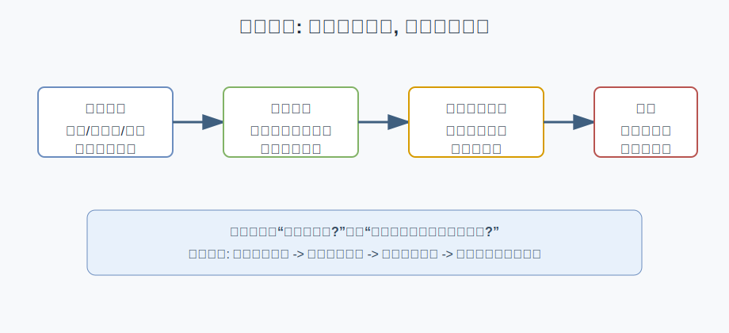
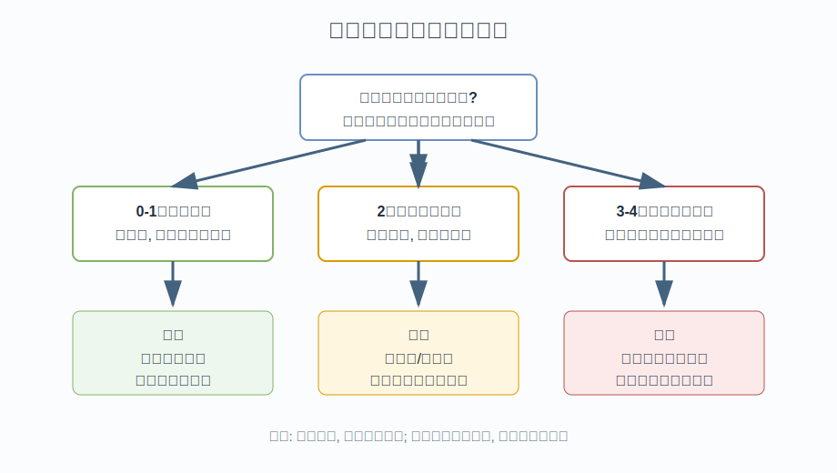
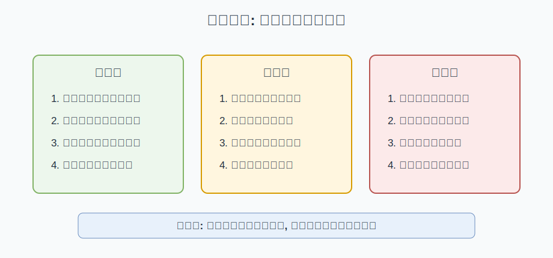

## 散户投资小白金融全品种操盘手册 - 2.11 市场切换时: 如何从"猜对方向"改成"调整仓位"
  
### 作者  
digoal  
  
### 日期  
2026-05-29  
  
### 标签  
金融产品 , 金融工具 , 散户 , 投资小白 , 全品操盘手册  
  
----  
  
## 背景 

> 适用读者: 已经能区分牛市、熊市、震荡市, 但一遇到风格切换就容易满仓反手的投资小白。  
> 本文定位: 投资教育框架, 不构成个性化投资建议。

## 一句话先懂

市场切换时最重要的问题不是“我能不能猜到下一轮涨跌”, 而是“我的仓位还适不适合新的风险环境”。小白要把动作从押方向改成校准仓位: 先停错、再减错、再留缓冲、最后用小仓位验证新假设。

## 核心观点

市场不会在屏幕上写着“牛市结束”或“熊市开始”。真正先变化的, 往往是经济周期、流动性、利率和风险偏好这些变量; 价格只是把这些变化反映出来, 有时提前, 有时滞后, 有时还会假突破。

因此, 小白不要把切换理解成一次“猜顶猜底”的考试。更稳的做法是把投资组合看成一组风险暴露: 股票仓位暴露权益风险, 债券暴露利率和信用风险, 黄金和商品暴露通胀与避险需求。当市场变量改变时, 先问哪类暴露过重, 哪类暴露不足, 再按比例调仓。

## 逻辑推导链

第一, 因为市场环境由四个变量共同决定, 所以单看价格涨跌不够。指数跌 5% 可能只是正常波动, 也可能是流动性收紧、利率上行、风险偏好下降同时发生后的再定价。如果只用价格当证据, 很容易在震荡中被来回打脸。

第二, 因为仓位本质上是风险暴露的大小, 所以切换时先处理仓位比先猜方向更重要。比如一个人持有较高比例成长股或行业基金, 当利率上行、成交缩量、风险偏好下降时, 原来的高弹性仓位就从“进攻工具”变成“波动来源”。这时不需要先证明熊市一定来了, 只要确认原仓位和新环境开始错配, 就应该降低过重暴露。

第三, 因为没人能稳定识别精确拐点, 所以动作必须分层。第一层是停止给旧逻辑继续加仓; 第二层是把明显过热或过重的部分降下来; 第三层是把现金、货币基金、短债或其他低波动工具作为缓冲; 第四层才是用小仓位验证新方向。如果一上来全卖或全买, 判断错一次就会把心态打乱。

第四, 因为市场切换可能失败, 所以每次调仓都要带复核条件。假设“风险偏好下降”被推翻, 例如成交重新放大、领先资产重新走强、宽基指数重新站回关键均线, 那么结论要从“继续降风险”调整为“停止减仓, 观察是否恢复原趋势”。反过来, 如果流动性继续收紧、反弹无量、强势品种开始补跌, 就要继续降低权益或高波动暴露。

这条推导的边界是: 它不能保证每次切换都赚到钱, 只能降低“方向猜错但仓位太重”的损失。SEC 的投资者教育材料强调资产配置与再平衡, FINRA 也把分散化视为降低单一风险暴露的重要方法; 这些原则支持本节的底层逻辑: 不把组合押在一个判断上, 而是让仓位跟风险承受能力和市场环境匹配。

## 适用边界

适合已经有多类资产或多类基金仓位、需要在牛市后期、震荡转弱、熊市修复、利率或通胀环境变化时做组合调整的人。它也适合容易被短期涨跌带着走、经常满仓进出的小白。

不适合把全部资金用于超短线交易的人, 也不适合没有任何仓位记录、无法说清自己持有什么风险的人。如果你连当前组合里权益、债券、商品、现金各占多少都不知道, 第一步不是调仓, 而是先整理资产清单。

## 操作框架

1. 先列变量: 周期、流动性、利率、风险偏好四项里, 哪几项已经同向变化。只有价格变化, 先观察; 两项以上同向变化, 才进入调仓评估。
2. 再看错配: 当前组合里哪类资产最依赖旧环境。牛市后期常见错配是高弹性权益过重; 利率上行时常见错配是长久期债券或高估值成长过重。
3. 动作排序: 先停止加错方向, 再减过重暴露, 再增加现金或低波动缓冲, 最后用小仓位试探新环境受益工具。
4. 设复核点: 写下“什么情况说明我错了”。可以是变量恢复、风险偏好回升、或原先弱势资产重新转强。
5. 做记录: 每次调仓只记录三个数: 调整前仓位、调整后仓位、触发调仓的变量。没有记录, 就会变成凭感觉交易。

## 实操例子

假设一个小白原来有 70% 权益基金, 其中一半是成长风格; 20% 债券基金; 10% 现金。前期市场上涨很久, 但最近出现三个变化: 成交额持续下降, 高估值板块先跌, 利率预期上行。此时不要先问“是不是熊市来了”, 而要问“70% 权益、较高成长暴露还合适吗”。

按框架处理: 第一步停止继续买成长风格; 第二步把权益从 70% 降到比如 55%-60% 的教育示例区间, 优先降低波动最大的部分; 第三步把现金或短债缓冲提高; 第四步观察两到四周。如果成交恢复、强势资产重新扩散, 就停止继续降仓; 如果风险偏好继续下行, 再按计划降低一档。整个过程不是预测点位, 而是让组合从“进攻姿态”逐步切到“防守观察姿态”。

## 常见错误

- 把调仓做成全仓赌博: 一次满仓买入或清仓卖出, 容错率最低。
- 只看价格不看变量: 跌一点就说熊市, 涨一天就说牛市, 最容易被震荡消耗。
- 用盈利证明逻辑: 赚了钱不代表前提正确, 亏了钱也不一定代表前提错误, 要看变量是否被验证。
- 调了仓却不设复核点: 没有“何时承认判断错了”, 最后会变成死扛。
- 把新工具一次买满: 新环境也可能是假切换, 试错仓位要小于核心仓位。

## 执行清单

| 问题 | 判断标准 |
|---|---|
| 是价格波动, 还是变量同向变化? | 至少两项变量同向变化, 才考虑明显调仓 |
| 当前组合最大风险暴露是什么? | 能说清权益、债券、商品、现金的大致比例 |
| 哪个仓位最依赖旧环境? | 优先减少对旧环境依赖最强、波动最高的部分 |
| 调仓后是否有缓冲? | 留出现金或低波动资产, 避免判断错时被动卖出 |
| 什么情况说明本次判断错了? | 提前写下复核条件, 到点按条件复盘 |

## 本节小结

市场切换不是让小白成为预言家, 而是逼你承认: 环境变了, 原来的仓位可能不再合适。把注意力从“猜对方向”移到“调整仓位”, 你就从情绪交易走向了组合管理。下一节会把不同环境下可选工具整理成表, 帮你把仓位调整落到具体工具层面。

## 参考资料

- SEC Investor.gov, “Asset Allocation”, https://www.investor.gov/introduction-investing/investing-basics/glossary/asset-allocation
- SEC Investor.gov, “Rebalancing”, https://www.investor.gov/introduction-investing/investing-basics/glossary/rebalancing
- FINRA, “Diversification”, https://www.finra.org/investors/investing/investing-basics/diversification
- Vanguard, “Principles for Investing Success”, https://investor.vanguard.com/investor-resources-education/how-to-invest/principles-for-investing-success
  
  
#### [PostgreSQL 解决方案集合](../201706/20170601_02.md "40cff096e9ed7122c512b35d8561d9c8")
  
  
#### [德哥 / digoal's Github - 公益是一辈子的事.](https://github.com/digoal/blog/blob/master/README.md "22709685feb7cab07d30f30387f0a9ae")
  
  
#### [About 德哥](https://github.com/digoal/blog/blob/master/me/readme.md "a37735981e7704886ffd590565582dd0")
  
  

  
