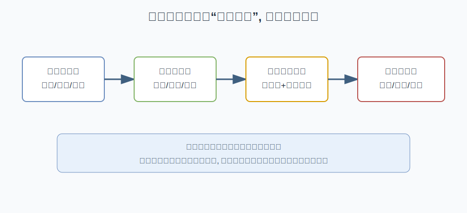
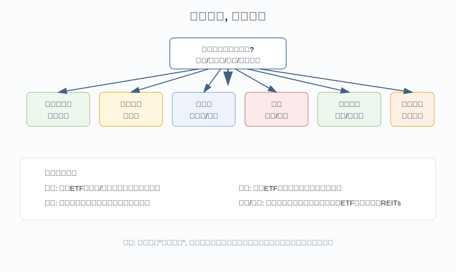
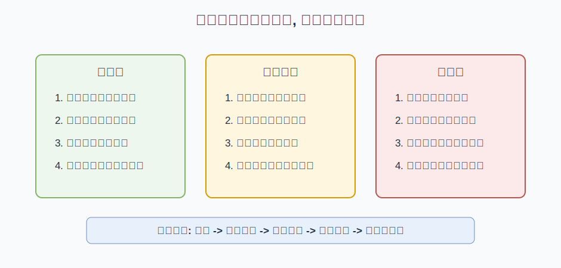

## 散户投资小白金融全品种操盘手册 - 2.12 不同市场环境下的工具选择表
  
### 作者  
digoal  
  
### 日期  
2026-05-29  
  
### 标签  
金融产品 , 金融工具 , 散户 , 投资小白 , 全品操盘手册  
  
----  
  
## 背景 

> 适用读者: 已读完第二章前 11 节, 想把“什么环境买什么”整理成一张可执行清单的投资小白。  
> 本文定位: 投资教育框架, 不构成个性化投资建议。

## 一句话先懂

工具选择表不是“抄答案”, 而是帮你把问题从“今天买什么”改成“当前环境更适合哪类风险暴露”。先判断环境, 再筛候选工具, 最后用仓位上限和风险边界过滤。

## 核心观点

同一个金融工具, 在不同市场环境里的作用会变化。宽基 ETF 在牛市初期可能是进攻工具, 在牛市末期可能变成高波动仓位; 债券 ETF 在利率下行时可能受益, 但在利率上行或信用压力扩散时也可能回撤; 黄金在通胀和避险环境中可能有配置价值, 但在风险偏好快速回升时不一定占优。

所以本节的表格不是让你机械买卖, 而是建立一个“环境 -> 工具 -> 风险 -> 仓位”的过滤器。它只缩小候选范围, 不替代估值、费用、流动性和风险承受能力。

## 逻辑推导链

第一, 因为所有工具的收益都来自某种风险暴露, 所以不能只按名字选工具。权益类工具暴露经济增长和风险偏好, 债券类工具暴露利率和信用, 商品类工具暴露通胀和供需, 现金类工具暴露机会成本。你选的不是“产品名称”, 而是背后的风险。

第二, 因为市场环境由经济周期、流动性、利率、风险偏好共同决定, 所以工具选择必须从环境开始。如果周期修复、流动性改善、风险偏好上升, 权益和成长风格的胜率通常更高; 如果风险偏好下降、价格趋势破坏, 防守工具和现金缓冲就更重要; 如果通胀上行, 黄金、商品和资源类资产才有讨论价值。

第三, 因为环境判断一定会出错, 所以候选工具必须配仓位上限。比如你判断利率下行, 债券 ETF 和高股息资产可能进入候选表, 但这不等于可以满仓债券或只买高股息。只要利率判断被推翻, 或信用风险上升, 原先的候选工具也要重新评估。

第四, 因为小白的真正风险通常不是“没买到最强”, 而是“买了不懂的工具还重仓”, 所以表格必须写明风险。每类工具都要问: 最大亏损来自哪里, 什么变量会让它失效, 错了如何降仓。

这条推导的边界是: 工具表适合做中低频的资产配置和仓位复核, 不适合做日内交易信号。SEC、FINRA 和 Vanguard 的投资者教育都强调资产配置、分散化、再平衡和风险承受能力; 这些原则支持本节方法: 先控制组合风险, 再讨论收益机会。

## 适用边界

适合把资金分成现金、权益、债券、商品、海外资产几类来管理的人, 也适合每周或每月做一次市场环境复盘的人。它尤其适合第二章的收束: 你不需要背很多观点, 只需要把环境变量和工具风险对应起来。

不适合把表格当作实时买卖指令。涉及杠杆、期货、期权、保证金、复杂衍生品的工具, 不应成为小白默认选择。

## 操作框架

1. 判断环境: 用四变量给市场贴一个临时标签, 例如牛市初期、牛市末期、震荡市、熊市、利率下行、通胀上行。
2. 筛候选工具: 只从与环境匹配的工具篮子里选择, 不追今天涨幅最高的品种。
3. 做风险过滤: 看主要风险、波动、费用、流动性、折溢价、估值位置, 不懂的工具直接剔除。
4. 定仓位上限: 主工具可以较高, 试错工具必须较低; 防守环境里现金和低波动资产要有位置。
5. 设复核条件: 环境标签变化时, 重新跑表格, 不让旧仓位自动延续。

## 实操例子

下面这张表是第二章的简化版工具选择表, 用来训练思路, 不是买卖建议。

| 市场环境 | 关键前提 | 候选工具 | 主要风险 | 仓位动作 |
|---|---|---|---|---|
| 牛市初期 | 流动性改善, 风险偏好回升 | 宽基 ETF、成长风格、弹性行业 | 假突破、过早重仓 | 分批加, 保留现金 |
| 牛市中期 | 趋势确认, 赚钱效应扩散 | 宽基 ETF、强势行业、部分海外权益 | 追高、仓位膨胀 | 只加胜率高的部分, 逐步止盈 |
| 牛市末期 | 估值、成交、情绪过热 | 宽基保留底仓、现金、低波动资产 | 贪婪、不愿降风险 | 降弹性, 锁定部分利润 |
| 震荡市 | 趋势不清, 波动反复 | 红利 ETF、可转债、网格、现金管理 | 网格越跌越买、信用风险 | 小仓位、严边界 |
| 熊市 | 风险偏好低, 趋势破坏 | 货币基金、短债、黄金、分批定投 | 过早抄底、久期或信用风险 | 防守为主, 小额定投 |
| 利率下行 | 债券价格受益, 收益率下降 | 债券 ETF、高股息、REITs | 利率反转、估值过热 | 控久期, 分散持有 |
| 通胀上行 | 实物资产和资源受关注 | 黄金、商品基金、资源股、REITs | 商品高波动、周期反转 | 小仓位配置, 不追尖峰 |
| 海外配置 | 分散单一市场和货币风险 | 美股、港股、QDII、美元资产 | 汇率、额度、溢价、时差 | 做卫星仓, 看折溢价 |

假设市场从牛市中期走向末期: 估值高、成交过热、人人谈赚钱。表格不会让你“清仓”, 而是提醒你把候选工具从高弹性行业转向底仓宽基、现金和低波动资产, 仓位动作从加仓改成止盈和降波动。若风险偏好继续扩散, 保留底仓; 若变量转弱, 再降一档。

## 常见错误

- 把工具表当成推荐清单: 表格只是候选池, 不是下单按钮。
- 只看环境不看估值: 方向对但买贵了, 仍然可能亏钱。
- 忽略工具内部风险: 债券有久期和信用风险, 商品有高波动, QDII 有汇率和溢价风险。
- 每个环境都想买一点: 工具太多会让组合失控, 新手更需要少而清楚。
- 环境变了但仓位不变: 表格的价值在复核, 不是写完就放着。

## 执行清单

| 问题 | 判断标准 |
|---|---|
| 当前环境标签是什么? | 至少用两个变量支持, 不能只凭一天涨跌 |
| 候选工具赚的是什么钱? | 能说清权益、利率、信用、通胀、汇率中的哪类暴露 |
| 最大风险来自哪里? | 能写出一个会让工具失效的变量 |
| 仓位上限是多少? | 主仓、卫星仓、试错仓分开, 不满仓押一个判断 |
| 什么时候复核? | 设定时间或变量触发条件, 到点重新跑表格 |

## 本节小结

第二章的核心不是让你预测市场, 而是让你学会在不同环境下选择更匹配的工具。工具表的正确用法是: 先识别环境, 再看风险暴露, 再定仓位上限。下一章会进入现金管理和低风险工具, 解决最基础但最容易被忽视的问题: 钱没投出去时, 应该怎么放。

## 参考资料

- SEC Investor.gov, “Asset Allocation”, https://www.investor.gov/introduction-investing/investing-basics/glossary/asset-allocation
- SEC Investor.gov, “Rebalancing”, https://www.investor.gov/introduction-investing/investing-basics/glossary/rebalancing
- FINRA, “Diversification”, https://www.finra.org/investors/investing/investing-basics/diversification
- Vanguard, “Principles for Investing Success”, https://investor.vanguard.com/investor-resources-education/how-to-invest/principles-for-investing-success
  
  
#### [PostgreSQL 解决方案集合](../201706/20170601_02.md "40cff096e9ed7122c512b35d8561d9c8")
  
  
#### [德哥 / digoal's Github - 公益是一辈子的事.](https://github.com/digoal/blog/blob/master/README.md "22709685feb7cab07d30f30387f0a9ae")
  
  
#### [About 德哥](https://github.com/digoal/blog/blob/master/me/readme.md "a37735981e7704886ffd590565582dd0")
  
  

  
