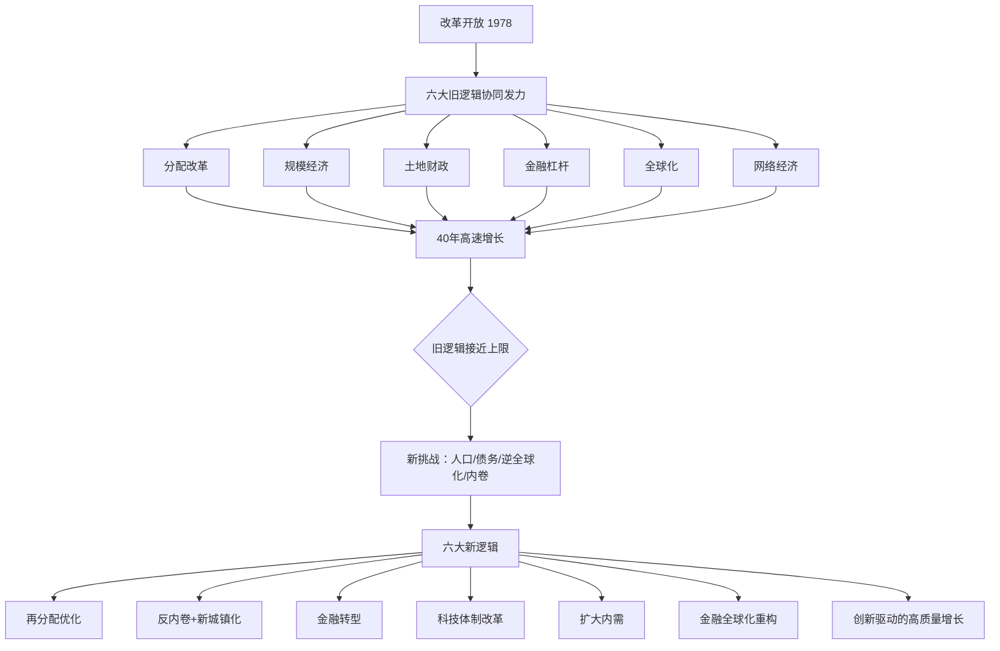

## 《经济动能的转换：从规模经济到创新驱动》读书笔记 
  
### 作者  
digoal  
  
### 日期  
2026-05-29 
  
### 标签  
读书笔记 , 经济动能的转换：从规模经济到创新驱动  
  
----  
  
## 背景 
  
---
书名: 《经济动能的转换：从规模经济到创新驱动》  
作者: 盘和林  
出版社: 中国友谊出版公司  
出版年份: 2026-1  
ISBN: 9787505761926  
页数: 308  
笔记日期: 2026-05-29  
标签: [中国经济, 创新驱动, 规模经济, 经济转型, 制度改革, 数字经济]  
---

  

> **一句话**：这是一本解剖中国经济"引擎"的工具书——它告诉你发动机为什么曾经那么快，为什么现在必须换挡，以及下一台引擎长什么样。  
>  
> **适合谁读**：对中国经济感到困惑的普通人；想理解"内卷""房地产""创新"这些词背后逻辑的读者；政策研究者与商科学生  
>  
> **阅读难度**：⭐⭐⭐☆☆  
>  
> **推荐指数**：⭐⭐⭐⭐☆  

---

## 一、时代坐标：这本书从哪里来？

2025年前后，中国经济的感受是分裂的：一边是新能源车、大模型、无人机令世界瞩目，另一边是房地产深度调整、青年失业率高企、消费信心不足。人们站在两组数据中间，既骄傲又困惑——我们到底怎么了？

盘和林写这本书，正是对这种困惑的系统性回答。他是浙江大学数字经济与金融创新研究中心的研究员，长期深耕数字经济与宏观政策评论，在人民日报、光明日报等主流媒体发表过大量政策评论，同时也是工信部信息通信经济专家委员会委员——这个身份意味着他比普通学者更接近政策现场，也更了解产业界的真实感受。

这本书出版于2026年1月，以改革开放47年为时间轴，做的是一件很难的事：**既不把过去的成功归结为某个简单英雄，也不把当下的困难归结为某一个坏人**，而是用机制和逻辑来讲清楚：我们是如何从那里走到这里的？

```
时间轴：中国经济三个阶段

1978──────────────2001──────────────2015──────────────2026
  │                    │                    │                    │
分配改革              加入WTO              增速换挡             本书出版
规模积累              全球化加速           新旧动能交替         系统性诊断
土地城镇化            网络经济崛起         创新驱动提速         路径选择关键期
```

---

## 二、核心命题：作者在说什么？

### 命题一：中国过去40年的高速增长，是六个"引擎"共同发力的结果

作者将改革开放以来的增长动力归纳为**六大旧逻辑**：

1. **分配制度改革**：从平均主义到按劳分配，激活了数亿人的生产积极性
2. **规模经济**：人口红利叠加工业化，形成巨大的成本优势
3. **土地财政**：地方政府通过土地出让筹集资金，撬动了基础设施和城镇化
4. **金融杠杆**：信贷扩张驱动投资，以债务换增速
5. **全球化**：嵌入全球供应链，以出口带动制造业升级
6. **网络经济**：互联网平台整合资源，催生新的消费和商业模式

这六个逻辑不是单独作用，而是**相互咬合、协同放大**的。土地财政支撑基础设施，基础设施降低了制造业成本，低成本制造业嵌入全球化，全球化带来外汇与财富，金融杠杆进一步放大投资……一个完整的正反馈回路。

### 命题二：旧逻辑并非失效，而是接近上限

这是本书最有价值的判断之一。作者**没有简单批判旧路径**，而是指出：这些逻辑曾经是正确的，只是现在遇到了边界条件：

- 人口红利已经消退，劳动力成本上升
- 土地财政导致地方债务积压，空间收窄
- 金融杠杆率已处于较高水平，继续加杠杆风险显著
- 全球化遭遇逆全球化浪潮与大国博弈
- 互联网红利见顶，平台经济进入存量竞争

旧引擎不是坏了，是满了。**不是否定过去，是到了换挡的时候**。

### 命题三：新逻辑的核心是"制度驱动创新"，而不只是投钱搞研发

这是本书最有思想深度的部分。作者援引阿西莫格鲁（Acemoglu）关于"包容性制度"的框架，提出一个关键洞见：

> 创新不只是科研投入的问题，更是制度环境的问题。产权保护是否到位，竞争是否公平，激励机制是否有效，创新收益能否被更广泛的人群分享——这些才是决定创新能否持续的深层变量。

六大新逻辑包含：再分配制度优化、反内卷与新型城镇化、金融市场转型（从融资导向转向投资导向）、科技创新体制改革、扩大内需、金融全球化重构。

**简单说：花多少钱搞研发是战术，建立什么样的制度环境是战略。**

---

## 三、论证地图：作者怎么说服你的？



**论证方式的特点**：
- 大量使用历史数据对比（如债务率、城镇化率、研发投入占比的变化曲线）
- 采用"现象—本质—方案"的三段式结构，每章逻辑清晰
- 引用阿西莫格鲁的包容性制度理论作为理论锚点，而非纯粹经验性叙述

**需要注意的地方**：书中有些政策建议偏向宏观框架，对于"制度如何具体改"这类操作层面的问题，着墨相对有限，更像是方向地图，而非施工图纸。

---

## 四、前提假设与边界：什么情况下这不成立？

### 假设一：制度是可以被设计和优化的
作者的框架隐含了一个假设：政策制定者有足够的意愿和能力推进制度性创新。但历史上，制度变革往往受到既得利益集团的阻力，这个博弈过程的难度被相对低估。

### 假设二：创新是可以被系统性激励的
书中把创新环境的改善作为可操作的政策目标，但创新本质上有很强的不确定性与偶发性。硅谷的成功既有制度因素，也有无法被复制的历史偶然性。

### 假设三：全球化仍然可以依托，只是形态在变
书中提出"金融全球化重构"，预设中国仍能在一个合理开放的国际环境中持续扩大经贸联系。但在中美博弈持续深化、供应链"友岸外包"的背景下，这个假设面临较大压力。

**总体而言**：这本书的分析框架在中国经济政策讨论的边界内是自洽的，但如果放到更大的地缘政治背景下，部分结论的稳健性值得进一步检验。

---

## 五、思想谱系：这本书在哪个传统里？

```
发展经济学传统
        │
   ┌────┴─────┐
 林毅夫        阿西莫格鲁
（比较优势、   （包容性制度、
 产业政策）    创新生态）
        │
   盘和林这本书
   （中国实践语境下的综合）
        │
   ┌────┴─────┐
政策建言派    学术研究派
（解决当下问题）（理论建构）
```

盘和林站在中国政策研究的传统脉络上，但与纯粹的官方叙事不同——他引入了阿西莫格鲁这类对产权和制度更为重视的西方学者的框架，试图在"中国实践"与"普遍经济规律"之间寻找交集。

这与林毅夫的路径有相似之处（强调中国发展的内在逻辑），但也有所不同：盘和林更强调制度对创新的约束，而林毅夫更强调产业政策与比较优势。

---

## 六、我学到了什么？

读完这本书，有三个认知发生了改变。

**第一，土地财政不是错，是有代价的选择。** 过去我一直觉得土地财政是个坏东西，但盘和林让我看到了它在基础设施时代的历史合理性——在财政能力不足的年代，它是快速建设的必要工具。问题不是它"坏"，而是它的历史阶段任务完成了，继续依赖会积累越来越高的成本。这让我对很多政策的判断标准从"对错"变成了"时机"。

**第二，"创新驱动"不是一个口号，是一套制度安排。** 我之前对这个词有些疲惫，因为它被说了太多年。但盘和林让我意识到：同样说"搞创新"，美国和中国其实在建不同的东西——前者依赖竞争性市场和产权激励，后者试图在国家引导与市场活力之间找平衡。这两套路径对应不同的假设，也会带来不同的结果。

**第三，经济分析需要"时间感"。** 旧逻辑在当时是对的，新逻辑在当下是必要的——这种动态视角让经济学不再是冷冰冰的公式，而是一个关于时机和转型的叙事。好的经济分析要像医生问诊，先问"这是什么阶段"，再问"现在该用什么药"。

---

## 七、举一反三：这个框架还能用在哪？

**框架核心**：旧路径在特定历史条件下是最优解，当条件改变后必须识别边界并切换逻辑。

**应用场景一：企业转型**
一个靠低价和规模竞争成功的企业，面对人工成本上升和市场饱和，遭遇的困境与中国宏观经济高度同构。分析企业战略转型时，同样可以追问：旧的竞争逻辑是否接近上限？新的价值来源在哪里？制度（企业文化、激励机制）是否支持新的竞争方式？

**应用场景二：个人职业规划**
"规模经济逻辑"对应的个人路径是：选热门赛道、卷学历、做标准化的事。当这套路径接近上限（学历贬值、赛道内卷），"创新驱动逻辑"对应的是：建立独特认知、进入差异化市场、让能力产权化（知识产权、个人品牌）。宏观的转型逻辑与个体的路径选择，有着深刻的结构对应。

---

## 八、批判与反思

这本书有几个值得商榷的地方。

**一、对"内卷"的处理偏乐观。** 书中提出通过劳资博弈机制和行业协会来遏制内卷，方向是对的，但中国劳动关系的结构性特征（分散劳动力、弱势工会传统）使这条路比书中描述的更难走。

**二、数字经济与实体经济的融合议题略显单薄。** 这是中国经济转型中最复杂的课题之一，但书中对这个话题的处理相对简化，更多停留在方向层面，缺少对摩擦和阻力的深度分析。

**三、地缘政治变量被纳入但未被充分讨论。** 在中美博弈、供应链重构的背景下，"全球化"这个变量本身已经发生了质变，不再只是一个待优化的政策工具，而是一个国际政治经济博弈的场域。书对这一维度的讨论稍显保守。

不过，瑕不掩瑜——作为一本面向普通读者的经济分析著作，它的深度和系统性已经远超大多数同类书目。

---

## 九、金句与记忆点

**1. "旧逻辑不是错的，是满了。"**
— 最精到的判断。解释了为什么"批判旧路径"经常显得不公平。时代变了，不是过去的人愚蠢。

**2. "创新不只是科研投入本身，更是制度环境对创新的决定性意义。"**
— 把"创新驱动"从资金问题重新定义为制度问题，眼光更深。

**3. "经济动能的转换不是对旧逻辑的全盘否定，而是在继承历史合理成分基础上的迭代升级。"**
— 转型不是革命，是升级。这个视角比非此即彼的对立叙事更理性。

**4. "将A股从'融资导向'向'投资导向'转型，使股票分红成为居民财富的重要来源。"**
— 一个具体的政策方向，也是判断资本市场改革成效的可操作指标。

**5. "政府从'大基建'向'大民生'转型。"**
— 财政逻辑的根本转变：钱不再主要花在路上，而是花在人身上。

**6. "包容性制度决定创新的热情和参与范围。"**
— 援引阿西莫格鲁框架的核心命题：不是没有人才，是缺乏让人才愿意冒险的土壤。

---

## 十、延伸阅读

1. **《国家为什么会失败》（阿西莫格鲁、罗宾逊）**
   本书的思想基础之一。理解"包容性制度"与"榨取性制度"的分野，是理解盘和林创新逻辑的前提。

2. **《繁荣与衰退》（林毅夫）**
   与本书形成有益对话：林毅夫更强调产业政策与比较优势，盘和林更强调制度对创新的约束。两本一起读，可以看到中国发展经济学内部的分歧。

3. **《中国经济的长期增长》（白重恩等编）**
   学术视角的补充。对书中援引的数据背后的研究脉络有更深入的呈现。

4. **《第二次机器革命》（布莱尼约弗森、麦卡菲）**
   数字经济与创新驱动的全球背景。理解技术革命如何重塑"创新"本身的含义。

5. **《置身事内》（兰小欢）**
   中国地方政府与经济发展关系的微观解剖。土地财政这一章，与本书可以形成互补阅读。

---

*笔记写于 2026-05-29 | 基于公开资料、书评与深度分析整理*
  
  
#### [PostgreSQL 解决方案集合](../201706/20170601_02.md "40cff096e9ed7122c512b35d8561d9c8")
  
  
#### [德哥 / digoal's Github - 公益是一辈子的事.](https://github.com/digoal/blog/blob/master/README.md "22709685feb7cab07d30f30387f0a9ae")
  
  
#### [About 德哥](https://github.com/digoal/blog/blob/master/me/readme.md "a37735981e7704886ffd590565582dd0")
  
  

  
