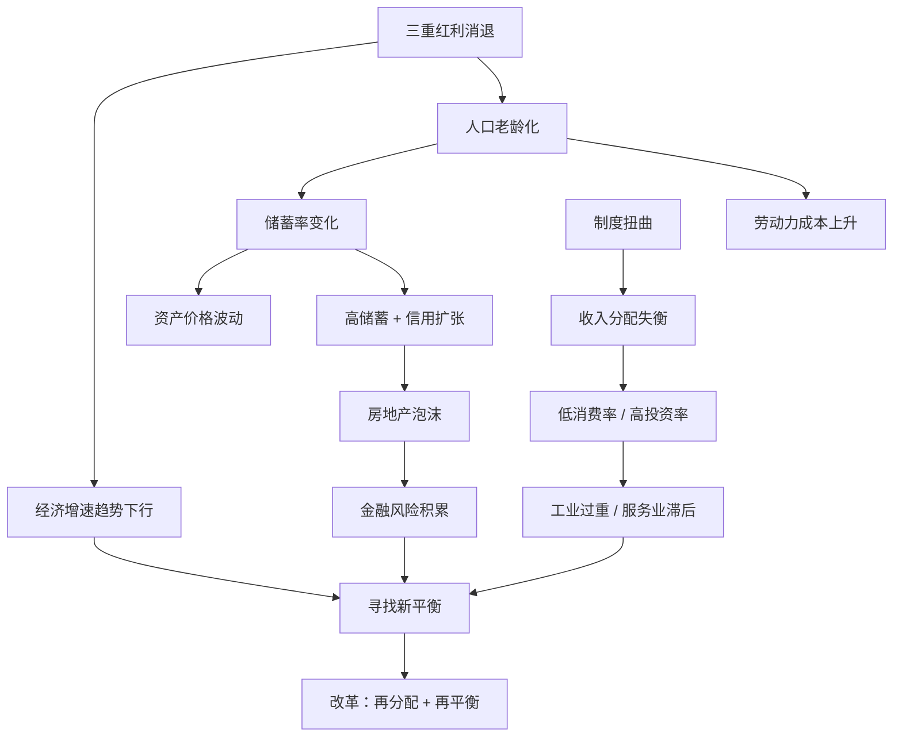

## 《渐行渐远的红利：寻找中国新平衡》读书笔记 
  
### 作者  
digoal  
  
### 日期  
2026-05-29 
  
### 标签  
读书笔记 , 渐行渐远的红利：寻找中国新平衡  
  
----  
  
## 背景 
  

---
书名: 《渐行渐远的红利：寻找中国新平衡》  
作者: 彭文生  
出版年份: 2013  
出版社: 社会科学文献出版社  
笔记日期: 2025-05-29  
豆瓣链接: https://book.douban.com/subject/23789345/  
奖项: 首届孙冶方金融创新奖·著作奖（2015年）  
标签: [中国经济, 宏观经济, 人口红利, 转型, 金融周期]  
---

  

> **一句话**：中国过去三十年的高增长，本质上是人口、制度、全球化三重红利的套现——而这张支票正在到期。  
> **适合谁读**：对中国宏观经济感兴趣的非专业读者；想理解房价、通胀、汇率背后逻辑的普通人；政策研究者与投资者。  
> **阅读难度**：⭐⭐⭐☆☆  
> **推荐指数**：⭐⭐⭐⭐⭐  

---

## 一、时代坐标：这本书从哪里来？

2013年，中国经济正站在一个颇为微妙的岔路口。

改革开放三十余年，GDP以年均接近10%的速度增长，这个奇迹令全球叹服。但与此同时，另一些数字开始让人不安：人口出生率持续下滑、劳动年龄人口触顶、贫富差距持续扩大、房价脱离工资收入、影子银行规模膨胀、地方债务隐患初现……

就在这一年，时任中金公司首席经济学家、曾深耕IMF与香港金管局的彭文生出版了这本书。他想回答一个当时没有人敢正面回答的问题：**那些驱动中国高增长的根本因素，正在消退，然后呢？**

这不是一本预言末日的书，也不是一本莺歌燕舞的颂词。它更像是一位有深厚国际经验的医生，拿着化验单认真告诉你：你的底子正在变，需要换一套活法。

值得一提的背景：为本书作序的刘鹤，彼时任中央财经领导小组办公室主任，此后升任国务院副总理主导经济工作。书中的许多判断，与此后中国经济政策的实际走向高度吻合，这让本书多了一层政策智囊的解读价值。

---

## 二、核心命题：作者在说什么？

### 观点一：三重红利同步消退，增长趋势性放缓不可避免

彭文生将中国过去三十年的高增长归因于三重并行红利：

- **人口红利**：劳动年龄人口快速扩大、抚养比下降，大量廉价劳动力为制造业提供了无与伦比的成本优势。
- **制度变革红利**：从计划经济向市场经济转型，以及加入WTO后的开放红利，大幅提升了资源配置效率。
- **全球化红利**：中国低成本出口为全球抑制了通胀，发达国家得以长期维持宽松货币政策，间接放大了全球需求。

而到2013年前后，这三重红利均已接近峰值或开始回落。人口老龄化曲线无可逆转；制度变革的低垂果实已被摘完，深水区改革阻力更大；全球化逆风渐起。作者认为，忽视这三重结构性变化、仍用旧框架思考中国经济，将犯方向性错误。

### 观点二：根本失衡是收入分配差距，而非简单的"消费不足"

很多分析只看到"消费弱、投资强"的表象，却没找到根。彭文生认为，这背后是收入分配的系统性失衡：

- 大量劳动力供给压低工资，企业利润占GDP比重偏高；
- 财税体系重流转税、轻财产税，政府支出重投资、轻公共服务；
- 金融压抑（存款利率管制）令居民储蓄补贴了企业融资；
- 土地制度扭曲，城乡居民财产差距持续拉大。

这些制度性因素共同造就了低消费率、高储蓄率的经济结构，并进一步衍生出工业过重、服务业滞后、环境压力大等连锁问题。

### 观点三：高储蓄、房价上升与信用扩张构成危险三角，房地产泡沫的破裂不是"会不会"而是"何时"

彭文生在2013年已经明确提出：中国房价严重偏离基本面，泡沫驱动因素是结构性的，而非简单的供需缺口。高储蓄率推高资产需求、银行信用顺周期扩张、地方政府土地财政依赖，三者形成自我强化的循环。他并不预测房价何时下跌，但明确指出这条路走不长。他还援引日本和美国的案例，强调房地产泡沫破灭对金融体系的冲击是宏观风险中最不可轻视的一环。

---

## 三、论证地图：作者怎么说服你的？



彭文生的论证有三个值得称道的特点：

**一是用人口结构作底层变量。** 他没有简单停留在"老龄化"这个标签，而是深入展开：人口结构如何同时影响储蓄率、资产价格、通胀、经济增速——这几者之间看似矛盾，作者给出了统一的解释框架：总量流动性充裕（储蓄人群多）压低通胀、推高资产价格，而非简单"超发货币必通胀"。

**二是区分长周期与短周期。** 在很多人把每次经济波动都当作新趋势的时候，彭文生坚持区分趋势性因素（人口、制度）与周期性因素（需求波动、政策刺激），避免噪音干扰核心判断。

**三是有节制地使用跨国比较。** 日本的人口老龄化路径、美国的次贷危机、德国的城镇化经验——这些类比并非简单套用，而是作为参照框架帮助读者理解中国可能的走向与风险量级。

---

## 四、前提假设与边界：什么情况下这不成立？

### 假设一：制度变革红利的释放基本完成

这是本书最有争议的假设之一。彭文生认为加入WTO之后的制度开放红利基本释放完毕，后续改革阻力更大、边际收益递减。但批评者指出：数字经济的崛起、国企改革的深化、户籍制度改革等依然蕴含巨大制度红利空间，且技术创新可能成为新的增长引擎，这是2013年的分析框架所未能充分预见的。

### 假设二：全球化趋势延续

本书写于全球化高潮期。作者预见了中国在全球化中的角色转变，但未能充分预见特朗普时代的逆全球化浪潮、中美脱钩的加速，以及新冠疫情对供应链的重构——这些外部冲击极大改变了彭文生分析框架中"再平衡"的难度系数。

### 假设三：改革可以渐进实现再平衡

书中对于政策路径相对乐观，认为通过改革（收入分配、财税、金融、土地）可以实现经济软着陆式的再平衡。但现实的政治经济学更为复杂——既得利益集团的阻力、地方政府的激励扭曲、短期稳增长压力，都使"新中间路线"的落地远比学理上复杂。

---

## 五、思想谱系：这本书站在哪个传统里？

彭文生的分析框架，可以看作三个思想传统的融合：

**西方主流宏观经济学**：新古典-凯恩斯综合体系是骨架，他系统梳理了古典、凯恩斯主义、货币主义到新凯恩斯主义的演变，并在2008年金融危机后重新评估金融因素在宏观模型中的地位。

**人口经济学传统**：本书在相当程度上呼应了理查德·伊斯特林（Easterlin）、保罗·华莱士等关于人口结构与宏观经济关系的研究，并将其与中国具体国情深度结合。

**政治经济学与制度经济学**：在解释收入分配失衡时，彭文生并未止步于市场机制，而是深入到税制、土地制度、金融抑制等制度层面，这与道格拉斯·诺斯等制度经济学家的视角一脉相承。

在中国学界，本书与蔡昉（刘易斯转折点研究）、陆铭（城乡二元体制研究）形成了对话关系。而从更宏观的视角看，它与迈克尔·佩蒂斯（Michael Pettis）对中国失衡的分析存在明显共振，尽管政策建议不同。

```
古典经济学
    ↓
凯恩斯主义 (需求管理)
    ↓
货币主义 (通胀锚)
    ↓
新凯恩斯综合 + 金融危机修正
    ↓
彭文生框架：人口 × 制度 × 金融周期 × 再平衡
```

---

## 六、我学到了什么？

读完这本书，最大的收获是学会了一种**"分层看中国经济"**的习惯。

过去我们习惯用当年GDP增速来判断经济好坏，用CPI来判断通胀，用房价涨跌来预测政策走向。但彭文生告诉我们：这些都是水面上的波浪，水面下有一个更慢、更深、更确定的底层逻辑在运行——那就是人口结构和制度变迁。

第一个收获：**人口不是背景，是因果**。当所有人讨论货币是否超发时，彭文生告诉我们，过去通胀不高的更深层原因，是大量廉价劳动力供给压低了成本，是高储蓄率消化了流动性。现在这个基本面变了，同样的货币政策，效果就不一样了。

第二个收获：**房价问题是分配问题的镜子**。很多人把高房价归结为供给不足、人口流入或货币超发。但彭文生的分析让我看到，高储蓄率（来自收入分配扭曲）是推高资产价格的更根本力量。不解决分配，只调控房价，是治标不治本。

第三个收获：**改革的窗口期比你想象的短**。书中有一个隐含的时间观念：红利还在的时候，改革的成本更低，社会更容忍暂时的阵痛。一旦红利消退、经济下行，改革的政治可行性会大幅下降，因为"一起变穷"的时候，再分配的阻力更大。这让我重新理解了为什么改革总是在增长较好的时候推进最有效。

---

## 七、举一反三：这个框架还能用在哪？

**理解日本失去的三十年**：日本在1990年代进入老龄化社会后，长期陷入低增长、低通胀、高资产价格波动的组合。用彭文生的框架倒推，会发现很多趋势惊人相似——这不是巧合，是同一底层逻辑在不同时代的重演。对中国的参考意义极大，但也要注意中日在制度、国际地位、人口体量上的差异。

**分析新兴市场国家的转型**：越南、印度等国当前处于人口红利峰值期，很多投资者据此买入。用本书框架可以更细致地追问：这些国家的制度变革红利释放到哪一步了？劳动力成本上升后制造业转型的准备够不够？贫富分配问题是否已经埋下消费不足的隐患？

**个人财务决策视角**：理解人口结构与资产价格的关系，对家庭资产配置有直接意义。一个老龄化社会，劳动年龄人口减少、净储蓄率下降，意味着长期来看支撑房价的人口因素在减弱。这不是让人恐慌，而是帮助我们对"不买房就亏了"这类叙事保持冷静。

---

## 八、批判与反思

**这本书最大的局限，是对技术变革的低估。**

2013年，移动互联网刚刚起步，人工智能还是学术概念，数字经济尚未成为政策核心词汇。彭文生的分析框架是工业化时代宏观经济学的精华，但它对技术驱动的新增长范式关注不足。此后中国在电商、移动支付、新能源、AI等领域的崛起，在一定程度上对冲了人口红利消退的影响——这是书中较难预见的变量。

**"新中间路线"的政策建议略显理想化。**

彭文生在书末提出，需要在公平与效率、政府与市场、当代与后代之间寻求新平衡，并建议推进财税改革、金融市场化、土地制度改革。这些方向无疑是正确的，但它们都触及深层利益格局，书中对改革的政治经济学阻力着墨不多。十年后回看，部分改革推进缓慢，正是因为改革成本过于集中在特定利益集团。

**预测房地产的时机比预测方向更难。**

彭文生2013年已清晰指出泡沫风险，但房价又持续上涨了将近十年。这不是分析错误，而是提醒我们：结构性判断正确≠短期时机判断正确。"泡沫终将破裂"是对的，但"什么时候破裂"受无数短期因素影响，这是所有长期分析框架的共同局限。

---

## 九、金句与记忆点

1. **"人口红利、制度变革红利、全球化红利，都将并行或先后面临见顶回落的趋势。"**
   → 这是整本书的"病理报告"开头。作者没有否定成就，而是告诉我们：成功本身制造了路径依赖，而路径依赖是最难打破的习惯。

2. **"因循这些发展机遇时期形成的分析框架来思考未来的增长，难免会陷入惯性与定式。"**
   → 框架本身会过期。这句话不只适用于经济学，也适用于每个人的思维方式：昨天帮你成功的逻辑，可能就是明天绊倒你的障碍。

3. **"收入分配差距是中国经济最大的不平衡。"**
   → 在众多失衡描述中，彭文生把分配问题放在最核心的位置，而非贸易顺差或货币汇率。这是一个有政治勇气的判断。

4. **"高储蓄、房地产价格上升和信用扩张联系在一起，带来房地产泡沫和相关的宏观风险。"**
   → 这是一个三体联动的风险模型，任何单一因素的分析都是不完整的。此后多年中国楼市的运行轨迹，几乎是这句话的注脚。

5. **"人口结构的变动不仅通过劳动力供给影响经济增长，对宏观经济的其他方面包括经济结构、物价和资产价格也有影响。"**
   → 这是本书最重要的方法论贡献：把人口从"背景变量"升级为"系统性因果变量"，并追踪其在多个维度上的传导路径。

6. **"改革需要在公平和效率、政府和市场、上一代与下一代、金融与实体、需求与供给等方面取得平衡。"**
   → 这是"新平衡"的政策纲领，言简意赅，但每一对关系背后都是极难的政治取舍。

---

## 十、延伸阅读

1. **《渐行渐近的金融周期》彭文生（2017）**
   本书的续篇，深化了货币信用周期的分析，引入"金融周期"概念解释资产价格和银行信用的长期波动。读完《红利》后，这是最自然的下一本。

2. **《人口峭壁》哈里·登特（Harry Dent）**
   从人口消费波次的角度预测资产价格长期走势，与彭文生的分析在人口-资产价格这条逻辑链上高度互补，视角更为全球化。

3. **《大债务危机》瑞·达利欧（Ray Dalio）**
   从信用周期与去杠杆的角度解析宏观风险，与彭文生书中关于货币信用周期和房地产泡沫的章节形成深度对话。

4. **《置身事内：中国政府与经济发展》兰小欢（2021）**
   彭文生分析了"应该做什么"，兰小欢则解释了"实际在怎么做、为什么这样做"。两书配合阅读，能更立体地理解中国经济的运行逻辑与改革难点。

5. **《人口战略》梁建章、黄文政（2021）**
   专注于人口问题的深度分析，与彭文生在人口红利这条主线上形成呼应，且覆盖了此后生育政策的演变与更激进的政策建议，可作为对人口章节的专题延伸。

---

*笔记写于 2025-05-29 | 基于公开资料与深度思考整理*
*注：本书出版于2013年，书中许多判断在此后十余年中已经得到或正在得到验证，重读颇有"读先知书"之感。*
  
  
#### [PostgreSQL 解决方案集合](../201706/20170601_02.md "40cff096e9ed7122c512b35d8561d9c8")
  
  
#### [德哥 / digoal's Github - 公益是一辈子的事.](https://github.com/digoal/blog/blob/master/README.md "22709685feb7cab07d30f30387f0a9ae")
  
  
#### [About 德哥](https://github.com/digoal/blog/blob/master/me/readme.md "a37735981e7704886ffd590565582dd0")
  
  

  
