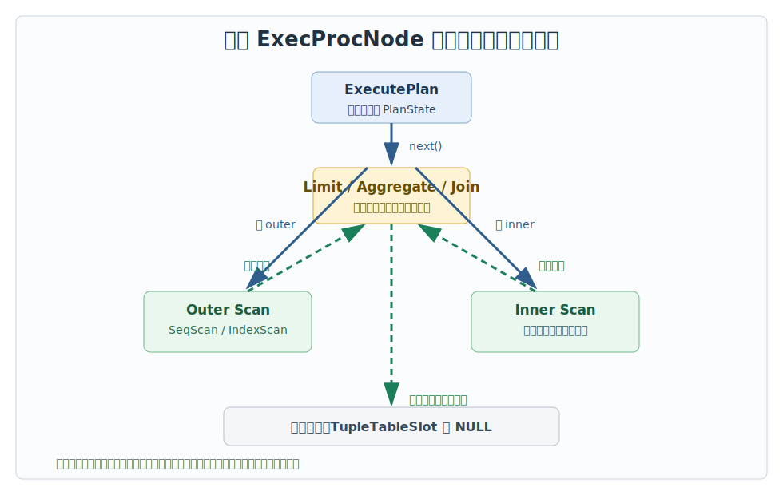
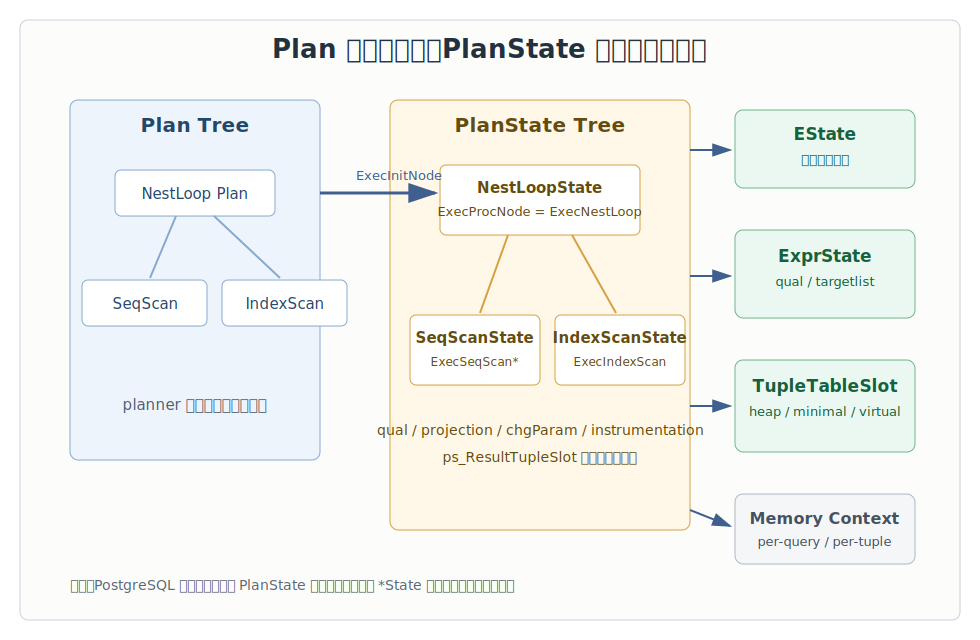
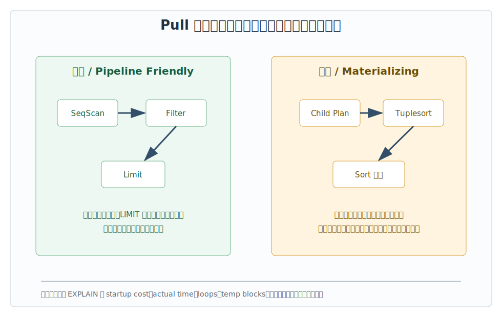
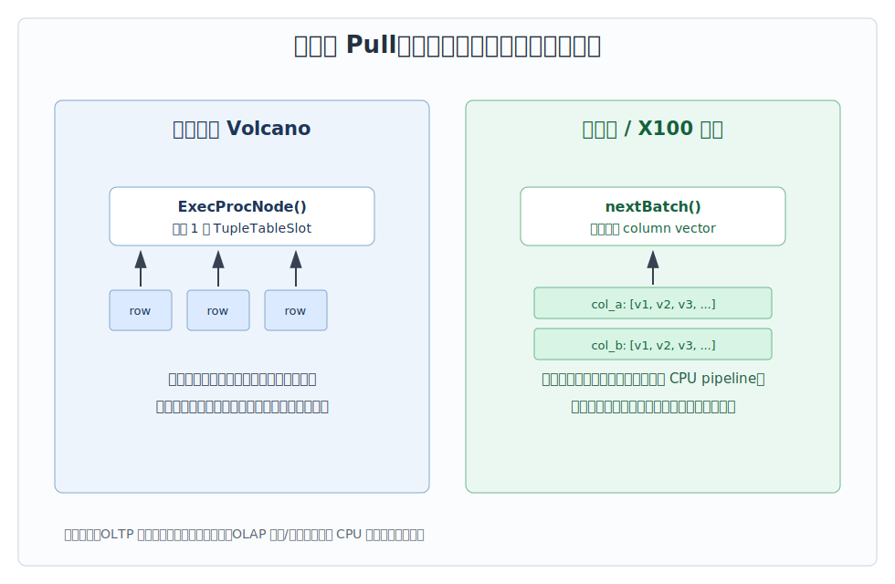

## 数据库筑基课 - 查询执行引擎“传统单行 Pull 模型 (Volcano)”
                                                                                            
### 作者                                                                
digoal                                                                
                                                                       
### 日期                                                                     
2026-05-30                                                      
                                                                    
### 标签                                                                  
PostgreSQL , 应用开发者 , 数据库筑基课 , 查询执行 , Volcano , Pull 模型 , Iterator 模型  
                                                                                           
----                                                                    

## 背景
   
  

本文属于“数据库筑基课”里的查询执行基础能力：优化器生成计划以后，执行器如何把一棵计划树变成一行一行的结果。

业务同学通常先看到的是 SQL 响应慢：同样的表、同样的索引，有的查询第一行很快返回，有的查询必须等很久；有的 `LIMIT 10` 能明显加速，有的加了 `LIMIT` 仍然要扫很多数据；有的 `EXPLAIN ANALYZE` 里一个节点 `loops=10000`，真正慢点却藏在内层索引扫描。要理解这些现象，必须先理解传统数据库执行器最常见的一种骨架：单行 Pull，也常被称为 Volcano/Iterator 模型。

本文以 PostgreSQL 源码为主线，结合 Volcano 系列论文和 MonetDB/X100 论文，回答四个问题：

1. 单行 Pull 模型到底是什么？
2. PostgreSQL 的 `ExecProcNode`、`PlanState`、`TupleTableSlot` 如何对应这个模型？
3. 它为什么简单、可组合，但在现代 OLAP 场景又会暴露 CPU 开销？
4. DBA 和开发者怎么用 `EXPLAIN` 看出 Pull 模型下的真实执行行为？

## 一、它解决什么问题？

SQL 是声明式语言。用户写的是“我要什么结果”，数据库必须把它转成“按什么顺序执行哪些物理算子”。执行器的核心问题是：不同算子如何统一组合？

例如：

```sql
SELECT *
FROM orders o
JOIN customers c ON c.id = o.customer_id
WHERE o.created_at >= current_date - 7
ORDER BY o.amount DESC
LIMIT 10;
```

这条 SQL 可能包含扫描、过滤、连接、排序、Limit。每个算子的输入输出不同，但执行器需要一种统一接口，让上层算子可以向下层算子要数据，下层算子可以在没有全局调度器干预的情况下继续工作。

传统单行 Pull 模型把问题简化成一句话：

> 每个物理算子都实现一个“给我下一行”的接口；父节点需要数据时调用子节点，子节点返回一行，或者返回空表示结束。

这个设计解决了三个工程问题：

1. **组合性**：扫描、过滤、连接、投影、Limit 可以像积木一样接在一起。
2. **懒执行**：上层不需要更多行时，下层就不再继续生产。`LIMIT`、`EXISTS`、游标分批拉取都受益于这个特性。
3. **状态封装**：每个算子保存自己的游标、表达式、临时结构、内存上下文，上层只关心“下一行”。

代价也很明确：

1. 每处理一行都可能发生多层函数调用和分支判断。
2. 表达式解释、slot 解构、虚函数式分发会带来 CPU 开销。
3. 对大规模扫描、聚合、分析型 workload，单行粒度不利于 CPU cache、SIMD 和批处理优化。

所以它不是“快”的代名词，而是“通用、可组合、易控制”的执行器骨架。

## 二、它是什么？

传统 Volcano/Pull 模型也叫 Iterator 模型。抽象接口通常可以理解为：

```text
open()
next() -> tuple 或 end-of-stream
close()
```

在 PostgreSQL 里，对应关系大致是：

| Volcano 抽象 | PostgreSQL 对应 | 说明 |
|---|---|---|
| `open()` | `ExecutorStart()` / `ExecInitNode()` | 初始化执行状态树、表达式、slot、扫描描述符等 |
| `next()` | `ExecProcNode()` | 从某个 `PlanState` 节点拉取下一行 |
| `tuple` | `TupleTableSlot` | 执行器节点之间传递 tuple 的容器 |
| `end-of-stream` | `NULL` 或 empty slot | 表示该节点没有更多输出 |
| `close()` | `ExecutorEnd()` / `ExecEndNode()` | 释放关系、buffer pin、临时文件、执行状态 |

PostgreSQL 官方执行器 README 明确把 plan tree 描述为“demand-pull pipeline of tuple processing operations”。`src/backend/executor/execProcnode.c` 的头部注释也用嵌套循环连接例子说明：`ExecutorRun()` 调用 `ExecutePlan()`，后者反复调用根节点 `ExecProcNode()`；根节点再递归调用子计划节点，直到扫描节点取到 tuple。



图 1 说明：调用方向是自顶向下的“我要下一行”，数据方向是自底向上的“给你一行”。上层不拉，下层不生产；下层没数据了，返回 `NULL`，结束信号再逐层向上传播。

## 三、核心原理

### 3.1 Plan 树与 PlanState 树分离

PostgreSQL 优化器输出的是只读 `Plan` 树。执行开始时，`ExecInitNode()` 递归扫描 `Plan` 树，构造结构相似的 `PlanState` 树。`Plan` 保存优化器决策，`PlanState` 保存运行期状态。

关键源码：

- `postgres/src/backend/executor/execProcnode.c`：`ExecInitNode()`、`ExecSetExecProcNode()`、`MultiExecProcNode()`、`ExecEndNode()`。
- `postgres/src/include/nodes/execnodes.h`：`PlanState`、`ExecProcNodeMtd`、`ps_ResultTupleSlot`、`lefttree/righttree`。
- `postgres/src/include/executor/tuptable.h`：`TupleTableSlot` 及不同 slot 实现。
- `postgres/src/backend/executor/execMain.c`：`ExecutorStart()`、`ExecutePlan()`、`ExecutorEnd()`。

`PlanState` 的公共字段里最关键的是：

```c
typedef TupleTableSlot *(*ExecProcNodeMtd) (PlanState *pstate);

typedef struct PlanState
{
    Plan *plan;
    EState *state;
    ExecProcNodeMtd ExecProcNode;
    ExecProcNodeMtd ExecProcNodeReal;
    ExprState *qual;
    PlanState *lefttree;
    PlanState *righttree;
    Bitmapset *chgParam;
    TupleDesc ps_ResultTupleDesc;
    TupleTableSlot *ps_ResultTupleSlot;
    ExprContext *ps_ExprContext;
    ProjectionInfo *ps_ProjInfo;
} PlanState;
```

上面是摘取后的结构示意，不是完整源码。重点是：每个执行节点都有一个 `ExecProcNode` 函数指针，指向该节点生产下一行的实现。



图 2 说明：`Plan` 树是蓝图，执行期不改写；`PlanState` 树保存游标、表达式状态、结果 slot、参数变化标记和 instrumentation。这个分离让 plan cache、prepared statement、并发执行和执行期状态管理更清晰。

### 3.2 顶层循环：ExecutePlan 反复拉根节点

`execMain.c` 的 `ExecutePlan()` 是最直观的 Pull 模型入口。它设置扫描方向，然后循环：

1. 重置 per-output-tuple 表达式上下文。
2. 调用根 `PlanState` 的 `ExecProcNode(planstate)`。
3. 如果返回空，结束。
4. 否则把 slot 交给目标接收器，例如返回客户端、写入目标表、丢弃给 `EXPLAIN ANALYZE` 统计。
5. 如果调用者只要固定数量的行，达到数量后提前停止。

这就是为什么游标、扩展查询协议、`LIMIT`、`EXISTS` 可以天然受益于 Pull：执行器不必先把全量结果算完再交给上层。

### 3.3 扫描节点：从访问方法拿下一行

以 `nodeSeqscan.c` 为例，`ExecInitSeqScan()` 初始化扫描关系、表达式上下文、扫描 slot、结果类型和 qual，然后根据是否有 qual/projection 选择更专门的 `ExecSeqScan*` 变体。

真正取数据的是 `SeqNext()`：

1. 如果还没有 scan descriptor，就调用 table access method 的 `table_beginscan()`。
2. 调用 `table_scan_getnextslot(scandesc, direction, slot)`。
3. 成功则返回 `TupleTableSlot`，失败则返回 `NULL`。

PostgreSQL 这里不是把 heap tuple 直接裸传给上层，而是放进 `TupleTableSlot`。slot 可以表示 buffer 中的 heap tuple、palloc 出来的 heap tuple、minimal tuple，也可以是虚拟 tuple。`tuptable.h` 说明 virtual slot 用 Datum/isnull 数组减少物理拷贝；非虚拟 slot 的属性解构是 lazy 的，只在需要访问某些列时填充 `tts_values/tts_isnull`。

### 3.4 连接节点：父节点也是子节点的消费者

以 `nodeNestloop.c` 为例，`ExecNestLoop()` 的主循环很符合 Volcano 模型：

1. 如果需要新的 outer tuple，就调用 `ExecProcNode(outerPlan)`。
2. 如果 outer 没有更多 tuple，连接结束。
3. 把 outer tuple 写入表达式上下文。
4. 对需要相关参数的 inner plan 设置 `chgParam`，然后 `ExecReScan(innerPlan)`。
5. 调用 `ExecProcNode(innerPlan)` 逐行取 inner tuple。
6. 对 outer/inner 组合执行 join qual 和 other qual。
7. 命中后通过 `ExecProject()` 返回结果 slot。

这解释了 `EXPLAIN ANALYZE` 里 nested loop 内层节点 `loops` 很大的原因：inner 节点可能被 outer 每一行驱动一次。这个不是显示问题，而是执行模型真实发生的调用次数。

### 3.5 阻塞节点：接口仍是 Pull，内部可能先吃完整个输入

Pull 模型只规定“父节点怎么要数据”，不保证每个节点都能马上返回一行。

`nodeSort.c` 的 `ExecSort()` 是典型阻塞节点：

1. 第一次被调用时，先循环调用 `ExecProcNode(outerNode)`，把子计划所有 tuple 放进 tuplesort。
2. 调用 `tuplesort_performsort()` 完成排序。
3. 后续调用才从 tuplesort 里一行一行返回。

Hash、某些 Aggregate、WindowAgg、Materialize 也可能有类似的“先积累状态，再输出”行为。它们仍然符合 Pull 接口，但首行延迟、内存和临时文件行为完全不同。



图 3 说明：流式算子可以一边拉一边返回，阻塞算子第一次被拉时可能先消费大量输入。看慢 SQL 时，不能只看“用了 Pull 模型”，还要看计划里有没有 Sort、Hash、Aggregate、Materialize 等改变首行延迟和内存形态的节点。

### 3.6 例外：不是所有执行节点都按单行 ExecProcNode 返回

PostgreSQL 里有明确例外。`nodeBitmapIndexscan.c` 的 `ExecBitmapIndexScan()` 如果被按普通 `ExecProcNode` 调用，会直接报错：BitmapIndexScan 不支持这种调用约定。它应该通过 `MultiExecBitmapIndexScan()` 生成 `TIDBitmap`，再由 `BitmapHeapScan` 使用 bitmap 去访问 heap。

`execProcnode.c` 里的 `MultiExecProcNode()` 支持：

- `HashState`
- `BitmapIndexScanState`
- `BitmapAndState`
- `BitmapOrState`

这说明“PostgreSQL 是 Volcano 风格”是主干抽象，不等于每个节点都逐行返回。工程实现会为 hash table、bitmap、并行执行、FDW、自定义扫描等引入特殊协议。

## 四、横向对比

| 维度 | 传统单行 Pull / Volcano | Push 模型 | 向量化 Pull / X100 风格 | 编译执行 / JIT |
|---|---|---|---|---|
| 主要接口 | 父节点调用子节点取下一行 | 下游注册回调，上游主动推数据 | 父节点取下一批 column/vector | 把表达式或算子路径编译成机器码 |
| 返回单位 | 单个 tuple/slot | 单个 tuple 或批次 | 一批 tuple/列向量 | 编译后的循环内部处理 |
| 首行延迟 | 流式算子低，阻塞算子高 | 取决于调度和缓冲 | 通常高于单行，但吞吐更好 | 有编译启动成本 |
| CPU 开销 | 每行函数调用和分支明显 | 可减少部分拉取开销 | 摊薄函数调用，改善 cache/SIMD | 降低解释和分支开销 |
| 状态控制 | 简单，算子局部封装 | 下游背压和停止较复杂 | 批边界、selection vector、NULL 处理更复杂 | 编译缓存、失效和安全边界更复杂 |
| 适合场景 | OLTP、混合负载、小结果、复杂算子组合 | 流处理、事件管道 | OLAP 扫描、过滤、聚合 | 热点表达式、长查询、CPU 密集查询 |
| 不适合场景 | 大宽表全表分析、纯 CPU 瓶颈 | 需要强懒执行和随机停止的查询 | 极小结果、强交互首行延迟 | 短查询、计划变化频繁 |

Volcano 论文的贡献不是“每行执行最快”，而是给执行器提供了高度可扩展的算子封装方式。并行 Volcano 论文进一步把并行性封装进 exchange operator，让普通算子不必感知生产者/消费者进程的细节。MonetDB/X100 论文批评传统 Volcano 每行解释开销太高，提出用 cache-conscious、vector-at-a-time 的方式提高现代 CPU 上的吞吐。



图 4 说明：二者都可以是 Pull，只是 `next()` 返回单位不同。传统 PostgreSQL 执行器主要围绕 tuple/slot 组织；X100/DuckDB/DataFusion 这类系统更强调批量和列向量，目标是让一次函数调用处理更多值。

## 五、效果如何？

单行 Pull 模型的收益：

1. **低耦合**：每类 plan node 只要实现初始化、取下一行、结束、重扫等接口，就能挂进执行树。
2. **天然短路**：`LIMIT`、`EXISTS`、游标 `FETCH n` 可以停止向下拉取。
3. **易解释**：`EXPLAIN` 的 plan tree 与运行期调用树基本对应，便于 DBA 定位。
4. **资源生命周期清楚**：per-query context 管整个执行，per-tuple context 降低表达式求值泄漏风险。
5. **扩展友好**：ForeignScan、CustomScan、执行器 hook 可以在这个框架里扩展。

主要代价：

1. **CPU per-tuple overhead**：每行经过多层 `ExecProcNode`、qual、projection、slot 访问和表达式求值。
2. **cache locality 不一定好**：tuple-at-a-time 常在不同函数和数据结构之间跳转。
3. **SIMD/批处理利用不足**：单行接口天然不如列向量适合批量比较、过滤、聚合。
4. **阻塞节点仍然可能重**：Sort/Hash/Aggregate 的内存、临时文件、首行延迟不是 Pull 接口能消除的。
5. **并行需要额外协议**：PostgreSQL 用 Gather/GatherMerge、parallel scan、DSM、worker instrumentation 等机制扩展，不是“把每个 iterator 自动并行”。

不要给它贴一个简单标签：它在 OLTP 和混合负载里很实用，在现代 OLAP 引擎里通常会被批处理、向量化和编译执行补强。

## 六、实操 DEMO

下面 SQL 是可执行示例，但我没有在当前环境启动 PostgreSQL 实例运行，因此不提供伪造输出。你可以在任意 PostgreSQL 测试库中执行，用 `EXPLAIN (ANALYZE, BUFFERS)` 观察 Pull 模型的行为。

### 6.1 LIMIT 如何让下层提前停止

```sql
DROP TABLE IF EXISTS demo_orders;

CREATE TABLE demo_orders (
  id bigint GENERATED ALWAYS AS IDENTITY PRIMARY KEY,
  customer_id int NOT NULL,
  amount numeric(12,2) NOT NULL,
  created_at timestamptz NOT NULL DEFAULT now()
);

INSERT INTO demo_orders (customer_id, amount, created_at)
SELECT (random() * 10000)::int,
       round((random() * 1000)::numeric, 2),
       now() - (random() * interval '30 days')
FROM generate_series(1, 200000);

ANALYZE demo_orders;

EXPLAIN (ANALYZE, BUFFERS)
SELECT *
FROM demo_orders
WHERE amount > 900
LIMIT 10;
```

观察点：

- 顶层 `Limit` 拉到 10 行后停止。
- 下层扫描实际返回行数可能远小于估算的完整匹配行数。
- 如果过滤条件选择性低，扫描仍可能读很多页才找到 10 行。

### 6.2 Sort 为什么会提高首行延迟

```sql
EXPLAIN (ANALYZE, BUFFERS)
SELECT *
FROM demo_orders
WHERE amount > 900
ORDER BY created_at DESC
LIMIT 10;
```

观察点：

- 如果没有合适索引，计划可能出现 `Sort` 或 top-N heapsort。
- `Sort` 第一次被拉时要先消费子计划输入，不能像简单 `Limit` 那样立即停止。
- 如果出现 `Sort Method`、`Memory`、`Disk`，说明排序使用了工作内存或临时文件。

### 6.3 Nested Loop 的 loops 怎么读

```sql
DROP TABLE IF EXISTS demo_customers;

CREATE TABLE demo_customers (
  id int PRIMARY KEY,
  name text NOT NULL
);

INSERT INTO demo_customers
SELECT i, 'customer-' || i
FROM generate_series(0, 10000) AS s(i);

ANALYZE demo_customers;

EXPLAIN (ANALYZE, BUFFERS)
SELECT o.id, c.name, o.amount
FROM demo_orders o
JOIN demo_customers c ON c.id = o.customer_id
WHERE o.amount > 990
LIMIT 20;
```

观察点：

- 如果选择 Nested Loop，内层索引扫描的 `loops` 通常接近外层实际行数。
- PostgreSQL 文档说明，`loops` 表示节点执行次数，actual time 和 rows 是每次执行的平均值；总成本要乘以 loops 才能理解。
- Pull 模型下，父节点每拿到一个 outer tuple，就可能驱动 inner 节点重新执行或重新探测。

### 6.4 BitmapIndexScan 为什么不是普通单行节点

```sql
CREATE INDEX demo_orders_amount_idx ON demo_orders(amount);
CREATE INDEX demo_orders_customer_idx ON demo_orders(customer_id);
ANALYZE demo_orders;

EXPLAIN (ANALYZE, BUFFERS)
SELECT *
FROM demo_orders
WHERE amount > 990
  AND customer_id BETWEEN 100 AND 200;
```

观察点：

- 计划可能出现 `Bitmap Index Scan`、`BitmapAnd`、`Bitmap Heap Scan`。
- `Bitmap Index Scan` 不是逐行返回 tuple 给父节点，而是生成 TID bitmap。
- 这类节点走 `MultiExecProcNode()` 协议，是 Volcano 主干模型的工程例外。

## 七、最佳实践

### 面向数据库架构师

1. **按 workload 选择执行引擎形态**  
   OLTP、点查、小范围查询、复杂事务优先考虑成熟的单行 Pull 执行器；大规模交互式分析、宽表扫描、聚合、明细报表，要评估向量化、列存、并行和 JIT 能力。

2. **不要只比较“有没有向量化”**  
   真正影响系统的是完整链路：存储布局、压缩、表达式执行、join/aggregate 算法、内存管理、并发控制、溢写策略、统计信息和调度。

3. **把首行延迟和总吞吐分开设计**  
   API 查询、在线页面、游标消费通常关心首行和前 N 行；离线报表、扫描聚合关心总吞吐。单行 Pull 偏前者，向量化偏后者。

### 面向 DBA

1. **看 `loops`，不要只看单节点 rows**  
   Nested Loop 内层节点 rows 很小但 loops 很大，乘起来才是实际访问量。

2. **看 startup cost 与 actual startup time**  
   Sort、Hash、Aggregate、Materialize 会提高首行延迟。`LIMIT` 不能自动绕过所有阻塞节点。

3. **看 Buffers 和 temp blocks**  
   Pull 接口不等于低 IO。排序、哈希、物化可能产生临时文件；Bitmap Heap Scan 可能减少随机访问，也可能因为 lossy bitmap 增加 recheck。

4. **用事务保护有副作用的 `EXPLAIN ANALYZE`**  
   PostgreSQL 文档明确提醒：`EXPLAIN ANALYZE` 会实际执行语句。对 DML 应使用 `BEGIN; EXPLAIN ANALYZE ...; ROLLBACK;`。

### 面向业务开发者

1. **`LIMIT` 只有在计划能早停时才显著有效**  
   如果前面有全量排序、聚合、去重，数据库可能仍要处理大量输入。

2. **避免把可索引过滤藏在表达式里**  
   Pull 模型会逐行执行 qual。能让扫描节点少返回 tuple，比在上层过滤更重要。

3. **为分页使用稳定顺序和合适索引**  
   `ORDER BY ... LIMIT` 若能用索引顺序返回，首行延迟和内存都会好很多；否则可能落入排序节点。

4. **读懂 `EXPLAIN` 的树形缩进**  
   父节点在上，子节点在下。实际执行不是从左到右打印，而是父节点按需拉子节点。

## 八、适合与不适合场景

适合：

1. **OLTP 点查和小范围查询**：首行延迟低，索引扫描、Limit、Nested Loop 可以按需取少量数据。
2. **复杂 SQL 算子组合**：每个算子封装状态，组合成本低。
3. **需要游标和分批消费**：上层取多少，下层生产多少。
4. **扩展型数据库内核**：FDW、CustomScan、执行器 hook 可以嵌入统一接口。
5. **混合负载**：既有事务查询，也有一定分析查询时，单行 Pull 是稳健基线。

不适合或需要补强：

1. **大规模 OLAP 扫描**：每行函数调用和表达式解释成本会被放大。
2. **宽表列式分析**：单行 tuple 组织不如列向量适合 cache 和 SIMD。
3. **高吞吐简单表达式过滤**：批量执行可以显著摊薄调度成本。
4. **GPU/异构执行**：单行接口通常不是合适的数据传输和计算粒度。
5. **极端并行流水线**：需要 exchange、批缓冲、调度器、背压机制等额外设计。

## 九、常见坑

1. **把 Volcano 等同于 PostgreSQL 全部执行行为**  
   PostgreSQL 主干是 Pull/Iterator，但 BitmapIndexScan、Hash、BitmapAnd/Or 等节点走 `MultiExecProcNode()`；并行执行也有 DSM、worker、Gather 等特殊机制。

2. **以为 `LIMIT` 一定少读数据**  
   `LIMIT` 能停止上层继续拉，但如果下层必须排序、聚合、去重，仍可能先处理大量输入。

3. **忽略 slot 的生命周期**  
   `TupleTableSlot` 可能引用下层 slot、buffer 或 per-tuple context 中的数据。扩展开发时，如果要跨下一次 `ExecProcNode()` 保存数据，应拷贝或物化。

4. **看 `EXPLAIN ANALYZE` 不乘 loops**  
   PostgreSQL 文档说明 nested loop 内层节点的 actual rows/time 是每次执行平均值，总量要乘 loops。

5. **用玩具表外推生产表**  
   PostgreSQL 文档提醒，计划成本不是简单线性外推。小表一页数据即使有索引也可能选择顺序扫描。

6. **把向量化理解成无条件更好**  
   向量化改善吞吐，但也带来批边界、NULL、选择向量、表达式状态、内存峰值和首行延迟问题。小结果 OLTP 不一定受益。

## 十、扩展问题

1. 如果把 `ExecProcNode()` 的返回单位从一个 `TupleTableSlot` 改成一批 slot，需要修改哪些层：表达式、投影、join、FDW、DestReceiver、EXPLAIN？
2. PostgreSQL 的 `TupleTableSlot` 已经支持虚拟 tuple 和 lazy deforming，它和列向量执行之间还差什么？
3. Sort、Hash、Aggregate 这类阻塞节点能否在 Pull 接口下做自适应输出？哪些语义会限制它？
4. Volcano 并行论文的 exchange operator 思想，与 PostgreSQL 的 Gather/GatherMerge、parallel seq scan 有哪些相同点和不同点？
5. 对一条慢 SQL，如何区分瓶颈来自 I/O、错误行数估计、阻塞节点、per-tuple CPU 开销还是 loops 放大？

## 十一、扩展阅读

### PostgreSQL 源码与文档

- `postgres/src/backend/executor/README`：PostgreSQL executor 总览，说明 demand-pull pipeline、Plan/PlanState、ExprState、内存上下文、控制流。
- `postgres/src/backend/executor/execProcnode.c`：`ExecInitNode()`、`ExecProcNode` 包装、`MultiExecProcNode()`、`ExecEndNode()`。
- `postgres/src/backend/executor/execMain.c`：`ExecutorStart()`、`ExecutePlan()`、`ExecutorEnd()`。
- `postgres/src/include/nodes/execnodes.h`：`PlanState`、`ExecProcNodeMtd`、`ExprState`。
- `postgres/src/include/executor/tuptable.h`：`TupleTableSlot` 类型和 slot ops。
- `postgres/src/backend/executor/nodeSeqscan.c`：顺序扫描如何返回下一行。
- `postgres/src/backend/executor/nodeNestloop.c`：Nested Loop 如何拉取 outer/inner。
- `postgres/src/backend/executor/nodeSort.c`：Sort 首次调用如何消费子计划并排序。
- `postgres/src/backend/executor/nodeBitmapIndexscan.c`：BitmapIndexScan 不支持普通 `ExecProcNode` 调用约定。
- `postgres/doc/src/sgml/ref/explain.sgml`：`EXPLAIN`、`ANALYZE`、`BUFFERS`、副作用提醒。
- `postgres/doc/src/sgml/perform.sgml`：`EXPLAIN` 基础、`loops` 含义、`EXPLAIN ANALYZE` caveats。
- DeepWiki `postgres/postgres`：Query Processing Pipeline 与 executor 架构说明；本文只把它作为架构索引，关键结论已回到源码核验。

### 论文

- Goetz Graefe, [“Volcano - An Extensible and Parallel Query Evaluation System”](https://15799.courses.cs.cmu.edu/spring2025/papers/04-volcano/graefe-icde1994.pdf). 该论文系统描述了 Volcano 查询执行器的 iterator、operator extensibility 和并行执行思想。说明：用户给出的 “Temporal” 题名我没有找到可核验的一手记录，本文按公开可核验的经典 Volcano 论文题名引用。
- Goetz Graefe, [“Encapsulation of Parallelism in the Volcano Query Processing System”](https://cir.nii.ac.jp/crid/1360861294513029248). 该论文讨论用 exchange operator 封装并行性，使普通算子尽量不感知并行执行细节。
- Peter Boncz, Marcin Zukowski, Niels Nes, [“MonetDB/X100: Hyper-Pipelining Query Execution”](https://www.cidrdb.org/cidr2005/papers/P19.pdf). 该论文分析传统 tuple-at-a-time 执行在现代 CPU 上的开销，并提出 vectorized query execution。

## 小结

传统单行 Pull 模型的本质不是“慢”或“旧”，而是数据库执行器的一种稳定控制协议：父节点按需拉取，子节点封装状态，tuple 逐行向上流动。PostgreSQL 的 `ExecProcNode`、`PlanState`、`TupleTableSlot` 把这个模型落到了非常清晰的工程结构里。

真正的判断要回到 workload：小结果、低首行延迟、复杂组合、扩展性，单行 Pull 很强；大扫描、高吞吐、CPU 密集分析，则需要向量化、批处理、JIT、并行和列式存储补强。理解这一层，读 `EXPLAIN` 时就不会只看节点名字，而会看“谁在拉谁、拉了多少次、哪里被迫先吃完整个输入、哪里可以提前停止”。

## 附录. 
1、询问 gemini
```
数据库查询执行引擎“传统单行 Pull 模型 (Volcano)”相关的论文和开源数据库.
```
  
2、克隆代码  
```  
git clone --depth 1 https://github.com/postgres/postgres
```  
  
3、启用 codex, 使用 [数据库筑基课 skill](../skills/README.md).  
```
文章标题: 
  数据库筑基课 - 查询执行引擎“传统单行 Pull 模型 (Volcano)”
项目源码(已克隆到当前项目如下目录中):  
  postgres
相关论文或分享:
  Volcano, an Extensible Temporal Query Evaluation System
  Encapsulation of Parallelism in the Volcano Query Execution System
  MonetDB/X100: Hyper-Pipelining Query Execution
项目 deepwiki reponame:  
  postgres/postgres
项目参考信息: 
  postgres/CLAUDE.md
```
  
  
#### [PostgreSQL 解决方案集合](../201706/20170601_02.md "40cff096e9ed7122c512b35d8561d9c8")
  
  
#### [德哥 / digoal's Github - 公益是一辈子的事.](https://github.com/digoal/blog/blob/master/README.md "22709685feb7cab07d30f30387f0a9ae")
  
  
#### [About 德哥](https://github.com/digoal/blog/blob/master/me/readme.md "a37735981e7704886ffd590565582dd0")
  
  

  
