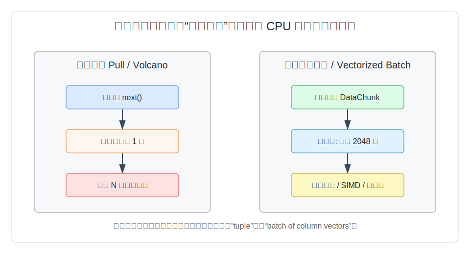
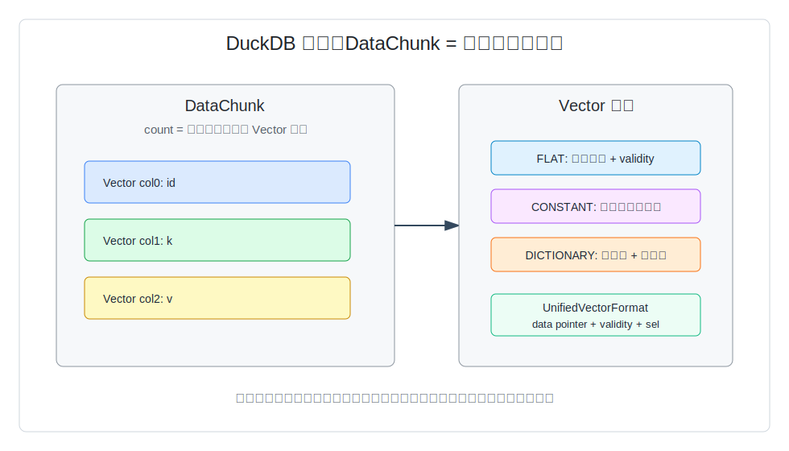
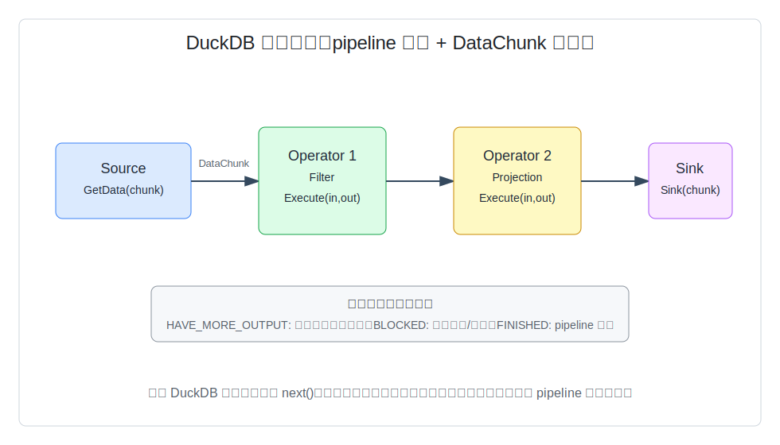
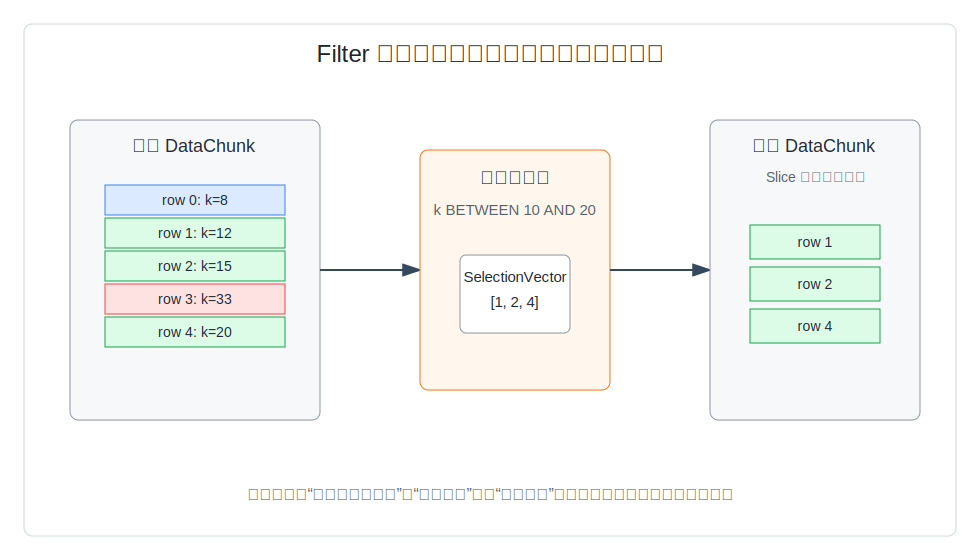

## 数据库筑基课 - 查询执行引擎“向量化 Pull 模型 (Vectorized Batch)”
                                                                                            
### 作者                                                                
digoal                                                                
                                                                       
### 日期                                                                     
2026-05-30                                                      
                                                                    
### 标签                                                                  
PostgreSQL , 应用开发者 , 数据库筑基课 , 查询执行 , 向量化执行 , Vectorized Batch , Pull 模型  
                                                                                           
----                                                                    

## 背景
   
本文属于“数据库筑基课”里的查询执行基础能力：优化器已经生成物理计划以后，执行器如何把扫描、过滤、投影、连接、聚合串起来，并让 CPU 高效地处理大量行。

上一篇传统 Volcano/Pull 模型讲的是“父算子向子算子要下一行”。这个接口非常通用，但在 OLAP 场景会遇到一个现实问题：一条扫描上亿行的查询，如果每一行都穿过多层 `next()`、表达式解释、tuple 容器和分支判断，CPU 时间会花在框架开销上，而不是花在真正的比较、计算、聚合上。

向量化 Pull 模型的核心改动很小：仍然保留按需取数的组合方式，但每次不再取一行，而是取一批行；批内采用列向量表示，让表达式、过滤、聚合在紧凑数组上循环。MonetDB/X100 论文把这个方向称为用 CPU cache 友好的小批次实现 hyper-pipelining；后来的 compiled vs vectorized 查询论文进一步讨论了向量化解释执行和代码生成之间的取舍。

本文以 DuckDB 源码为主线，说明四件事：

1. 向量化 Pull 解决什么问题。
2. `DataChunk`、`Vector`、`SelectionVector` 怎么构成批处理接口。
3. DuckDB 当前实现为什么更准确地说是“向量化批处理 + pipeline 调度”，而不是教科书式递归 Pull。
4. DBA 和应用开发者如何用它理解 SQL 性能、算子边界和工程坑。

## 一、它解决什么问题？

传统单行 Pull 的工程价值是组合性：扫描、过滤、投影、连接都实现统一接口，父节点需要数据就向子节点拉一行。问题在于执行粒度太细。

假设有一条查询：

```sql
SELECT k, sum(v)
FROM t
WHERE k BETWEEN 10 AND 20
GROUP BY k;
```

如果执行器每次只处理一行，那么每一行都要经历：

1. 扫描节点取一行。
2. 过滤节点判断一次。
3. 投影或表达式节点计算一次。
4. 聚合节点查哈希表并更新状态。
5. 外层反复调用，直到输入结束。

对短 OLTP 查询，这种开销可能不是主矛盾；对分析型查询，主矛盾常常变成 CPU 的指令 cache、数据 cache、分支预测、函数调用和解释器分发。向量化批处理把问题改写成：一次取一批，例如 DuckDB 默认 `STANDARD_VECTOR_SIZE = 2048` 行；批内每列是一个向量，表达式在向量上循环，过滤结果用选择向量表示。



图 1 说明：向量化不是把 SQL 改成矩阵计算，而是把执行器内部的“接口粒度”从单行改成批。这样做牺牲了一部分单行即时性和实现简单性，换来更少的调用开销、更好的 cache 局部性，以及更容易使用 SIMD 或紧凑循环的机会。

## 二、它是什么？

向量化 Pull 模型可以抽象成：

```text
open()
next_batch() -> batch 或 end-of-stream
close()
```

这里的 `batch` 不是行数组，而通常是列向量集合。以 DuckDB 为例，核心对象是：

| 概念 | DuckDB 对应 | 作用 |
|---|---|---|
| 批 | `DataChunk` | 执行器中间表示，包含多个等长 `Vector` |
| 列向量 | `Vector` | 一个物理类型的一批值，默认容量为 `STANDARD_VECTOR_SIZE` |
| 批大小 | `STANDARD_VECTOR_SIZE` | 默认 2048，且要求是 2 的幂 |
| 过滤后的行集合 | `SelectionVector` | 保存通过过滤的行号，避免立刻复制所有列值 |
| 统一读取格式 | `UnifiedVectorFormat` | 把 flat、constant、dictionary 等向量统一成 data pointer、validity、selection 访问方式 |

DuckDB 的 `src/include/duckdb/common/types/data_chunk.hpp` 明确把 `DataChunk` 描述为一组向量，所有向量长度相同，是执行引擎的中间表示。`src/include/duckdb/common/vector_size.hpp` 定义默认批大小为 2048。`src/include/duckdb/common/types/vector.hpp` 说明 `Vector` 可以引用其他向量、切片、字典化，并可转成 `UnifiedVectorFormat`。



图 2 说明：`DataChunk` 是“横向的一批行”，但物理上按列向量组织。算子之间传递的是批，不是单个 tuple；很多算子可以让输出向量引用输入向量，只有真正需要改写或物化时才复制。

## 三、核心原理

### 3.1 批处理接口：减少一行一调度

DuckDB 的 `PhysicalOperator` 基类把物理算子分成三类接口：

1. Source：`GetData(context, chunk, input)` 生产一个 `DataChunk`。
2. Operator：`Execute(context, input, output, ...)` 把输入批变成输出批。
3. Sink：`Sink(context, chunk, input)` 消费一个批，例如聚合 build、排序、结果收集、写出等。

这和纯 Volcano 的递归单行 `next()` 不同。DuckDB 的 `PipelineExecutor` 先从 source 取一个 chunk，再把这个 chunk 依次推过 pipeline 里的中间算子，最后交给 sink。源码位置包括：

```text
duckdb/src/include/duckdb/execution/physical_operator.hpp
duckdb/src/execution/physical_operator.cpp
duckdb/src/parallel/pipeline_executor.cpp
duckdb/src/include/duckdb/parallel/pipeline_executor.hpp
```

所以本文标题里的“Pull”更适合作为概念入口：上层仍然按需获得下一批结果；但 DuckDB 当前实现的真实执行框架，是向量化批处理放进 pipeline 调度里。



图 3 说明：DuckDB pipeline 中的数据流是 `DataChunk`，控制流由 `HAVE_MORE_OUTPUT`、`BLOCKED`、`FINISHED` 等状态驱动。这让执行器能处理阻塞算子、异步 source、并行任务和缓存算子，而不是只靠递归函数调用。

### 3.2 过滤：先生成 SelectionVector，再切片

过滤是理解向量化执行最好的入口。DuckDB 的 `PhysicalFilter::ExecuteInternal` 逻辑很直接：

1. `ExpressionExecutor::SelectExpression(input, state.sel)` 对输入批计算布尔表达式。
2. 如果全部通过，输出 `chunk.Reference(input)`，直接引用输入批。
3. 如果部分通过，输出 `chunk.Slice(input, state.sel, result_count)`，把通过行号变成切片。
4. 如果没有通过行，输出空 chunk。

源码位置：

```text
duckdb/src/execution/operator/filter/physical_filter.cpp
duckdb/src/execution/expression_executor.cpp
duckdb/src/execution/expression_executor/execute_conjunction.cpp
duckdb/src/include/duckdb/common/types/selection_vector.hpp
```

这比“过滤一行就复制一行到输出”更接近现代 CPU 的工作方式：先在布尔向量或选择回调上做紧凑循环，再把幸存行用索引表达出来。



图 4 说明：`SelectionVector` 保存的是输入批中的行号，例如 `[1, 2, 4]`。后续算子可以通过字典向量或统一格式读取这些行，而不是立刻复制所有列。对宽表、低选择率过滤、多谓词 AND/OR，这个设计可以显著减少无效数据搬运。

### 3.3 表达式：批内执行，但保留特殊表示

`ExpressionExecutor::Execute(DataChunk *input, DataChunk &result)` 会对每个表达式产出一个结果向量，并把结果批的 cardinality 设为输入批大小。表达式执行时会根据表达式类型分派到引用、常量、函数、cast、case、conjunction 等实现。

关键点不是“所有表达式都变成 SIMD”，而是：

1. 引用表达式可以直接 `Reference` 输入向量。
2. 带 selection 的引用可以 `Slice` 输入向量。
3. 常量可以用 constant vector 表示整批。
4. 函数可以对 `DataChunk` 参数批量执行。
5. 读取方可以用 `UnifiedVectorFormat` 屏蔽 flat、constant、dictionary 的差异。

这解释了一个常见误区：向量化执行并不要求每一步都把数据拍平成连续数组。相反，它保留 constant、dictionary 等轻量表示，尽量把“复制”推迟到必须发生的时候。

### 3.4 AND/OR：选择向量还能减少后续谓词计算

`execute_conjunction.cpp` 里，AND 谓词会维护当前选择集：第一个条件筛掉一批行后，后续条件只在仍然可能通过的行上执行。OR 谓词则逐步收集已通过行，并继续检查未通过行。

这与论文《Filter Representation in Vectorized Query Execution》讨论的问题一致：过滤结果到底用位图、选择向量、还是物化后的紧凑向量表示，会影响后续算子的 cache、分支和复制成本。工程上没有永久最优，取决于选择率、列宽、后续算子类型和 CPU 架构。

## 四、横向对比

| 维度 | 向量化批处理 | 传统单行 Pull / Volcano | 查询编译 / JIT |
|---|---|---|---|
| 主要目标 | 用批内循环降低解释和调用开销 | 用统一 `next()` 接口提升组合性 | 为整段计划生成专用代码，减少解释分发 |
| 执行粒度 | 一批行，DuckDB 默认 2048 | 一行 | 一段 pipeline 或表达式 |
| 数据表示 | 列向量、选择向量、字典/常量表示 | tuple/slot/row 容器 | 编译代码直接操作内存布局 |
| 首行延迟 | 通常要等一个批或阻塞算子输出 | 可做到逐行返回 | 编译启动成本可能较高 |
| CPU 效率 | 通常明显好于单行解释 | 大量行时函数调用和分支开销高 | 热查询可能更高，但依赖编译质量 |
| 实现复杂度 | 中等，需要维护向量格式和批状态 | 较低，接口直观 | 高，需要代码生成、编译缓存、退化路径 |
| 适合场景 | OLAP 扫描、过滤、聚合、宽表分析 | OLTP 点查、游标、复杂控制流 | 重复执行、表达式复杂、CPU 密集的查询 |
| 不适合场景 | 极低延迟单行交互、强行级副作用 | 大规模分析扫描 | 临时一次性短查询、编译环境受限 |

原因很重要：向量化批处理不是“编译”的反面。论文《Everything You Always Wanted to Know About Compiled and Vectorized Queries But Were Afraid to Ask》讨论的正是两者边界：向量化用固定解释器加批内 tight loop 获得稳定收益；编译可以进一步消除解释层，但要承担编译时间、代码体积、cache 压力和复杂退化路径。

## 五、效果如何？

本文不编造性能数字。可以确定的机制收益有四类：

1. **函数调用更少**：每 2048 行调用一次算子接口，比每行调用一次更省控制流开销。
2. **cache 局部性更好**：列向量把同一列的值放在连续区域，扫描、比较、聚合 key 提取更容易命中 cache。
3. **表达式计算更紧凑**：过滤、函数、cast、conjunction 可以在批内循环，减少解释器分发。
4. **少复制**：`Reference`、`Slice`、dictionary vector、constant vector 让很多中间结果只是引用或选择表。

代价也很明确：

1. **批大小成为调优边界**：批太小，调度开销降不下来；批太大，cache 压力、临时内存、首批延迟上升。
2. **算子实现更复杂**：每个算子要正确处理 flat、constant、dictionary、NULL、selection、嵌套类型。
3. **选择表示有取舍**：低选择率时选择向量很好；高选择率时全量引用可能更好；后续要随机访问时，字典层可能带来间接访问成本。
4. **阻塞算子仍然阻塞**：排序、全局聚合、某些 join build 阶段不会因为向量化就变成流式首行返回。

## 六、实操 DEMO

当前机器上没有可用的 DuckDB CLI；Python 导入到的是本地 `duckdb` 源码目录命名空间，不是已安装的 DuckDB Python 包，因此下面示例未在本机执行。它是可复制到 DuckDB CLI 或 Python DuckDB 包里执行的最小验证。

```sql
CREATE TABLE t AS
SELECT
  i::INTEGER AS id,
  (i % 100)::INTEGER AS k,
  i * 2 AS v
FROM range(0, 100000) tbl(i);

EXPLAIN
SELECT k, sum(v)
FROM t
WHERE k BETWEEN 10 AND 20
GROUP BY k
ORDER BY k;
```

你应该重点看三件事：

1. 计划里是否有 `SEQ_SCAN` 或类似 table scan 节点。
2. 过滤条件是否被放到 scan 或 filter 附近。
3. 聚合、排序等是否形成阻塞边界。

如果要观察 profile，可以在可用 DuckDB 环境中执行：

```sql
PRAGMA enable_profiling = 'json';
PRAGMA profiling_output = 'duckdb-profile.json';

SELECT k, sum(v)
FROM t
WHERE k BETWEEN 10 AND 20
GROUP BY k
ORDER BY k;
```

这不会直接显示每个 `DataChunk` 的 2048 行，但能帮助你识别算子耗时、扫描行数、过滤位置和阻塞节点。

## 七、最佳实践

面向数据库架构师：

1. 把向量化执行看成 OLAP 引擎的 CPU 基础设施，不要只看存储格式。列存如果执行器仍按单行解释，收益会被浪费。
2. 评估引擎时同时看批大小、向量格式、过滤表示、表达式执行、join/aggregate 的批处理路径。
3. 对混合负载要区分“首行延迟”和“总吞吐”。向量化更偏吞吐，不天然保证最小首行延迟。

面向 DBA：

1. 看慢 SQL 时，不要只问有没有索引。对大扫描和聚合，要看过滤能否下推、投影能否裁剪、阻塞算子在哪里。
2. 对 DuckDB 这类引擎，宽表查询尽量只选择必要列，因为 `DataChunk` 按列向量传递，少列意味着更少内存带宽。
3. 遇到复杂表达式过滤，关注谓词顺序、选择率和函数成本。DuckDB 的 conjunction 执行有自适应过滤思想，但高成本 UDF 仍可能成为瓶颈。

面向业务开发者：

1. 写分析 SQL 时尽早过滤、少取列、避免无意义的逐行 UDF。
2. 不要把 `LIMIT` 误认为一定能省扫描。遇到排序、聚合、去重、窗口函数，执行器可能必须先处理大量输入。
3. 对需要反复跑的分析任务，把数据整理成类型明确、表达式简单、列裁剪友好的形态，通常比在 SQL 里堆复杂转换更稳定。

## 八、适合与不适合场景

适合：

1. 扫描大量行并做过滤、投影、聚合的 OLAP 查询。
2. 列较多但每次只读部分列的分析任务。
3. 谓词选择率明显、可以通过选择向量减少后续计算的查询。
4. 批量导入、批量转换、批量结果写出。

不适合或收益有限：

1. 单行点查、极低延迟 RPC 式查询。
2. 每一行都触发外部副作用或高成本 UDF 的任务。
3. 需要严格逐行交互、逐行返回并立即停止的游标型工作。
4. 数据量很小、编排开销比计算更大的查询。

## 九、常见坑

1. **把向量化等同于 SIMD**：向量化首先是批处理和列向量接口，SIMD 只是可能的进一步优化。
2. **把 DuckDB 说成纯 Pull**：DuckDB 的源码显示它有 source/operator/sink 和 pipeline executor；“Pull”适合讲抽象模型，不应掩盖具体实现。
3. **忽略选择向量的间接访问成本**：过滤后不复制很省，但后续如果反复随机访问、层层字典化，也可能增加 cache miss。
4. **认为批越大越好**：批太大会伤害 cache 和首批延迟。DuckDB 默认 2048 是工程折中，不是普适常数。
5. **只看执行模型，不看算子边界**：排序、hash aggregate、hash join build 等阻塞阶段仍可能吃掉大部分时间和内存。

## 十、扩展问题

1. 为什么 `SelectionVector` 更适合低选择率过滤，而高选择率时直接引用输入批可能更好？
2. 如果一条 SQL 里既有高选择率过滤，又有宽字符串列，过滤应该尽量发生在读取字符串列之前还是之后？
3. 向量化解释执行和查询编译分别在什么情况下更容易赢？
4. 如果批大小从 2048 改成 128 或 8192，可能影响哪些指标：吞吐、首行延迟、cache miss、临时内存？
5. PostgreSQL 这类传统 tuple-at-a-time 执行器，要引入批处理，最难改的是算子接口、表达式系统、还是存储访问层？

## 十一、扩展阅读

论文与分享：

1. Peter Boncz, Marcin Zukowski, Niels Nes. *MonetDB/X100: Hyper-Pipelining Query Execution*. CIDR 2005.
2. Timo Kersten, Viktor Leis, Alfons Kemper, Thomas Neumann, Andrew Pavlo, Peter Boncz. *Everything You Always Wanted to Know About Compiled and Vectorized Queries But Were Afraid to Ask*. VLDB 2018.
3. *Filter Representation in Vectorized Query Execution*. 重点关注 selection vector、bitmap、物化过滤结果之间的取舍。

DuckDB 本地源码：

1. `duckdb/CLAUDE.md`：项目架构摘要，说明 DuckDB 是 vectorized execution engine，默认批处理约 2048 行。
2. `duckdb/src/include/duckdb/common/vector_size.hpp`：`DEFAULT_STANDARD_VECTOR_SIZE = 2048U`。
3. `duckdb/src/include/duckdb/common/types/data_chunk.hpp`：`DataChunk` 是执行引擎中间表示，包含等长 `Vector`。
4. `duckdb/src/include/duckdb/common/types/vector.hpp`：`Vector`、`Slice`、`Reference`、`UnifiedVectorFormat`。
5. `duckdb/src/include/duckdb/common/types/selection_vector.hpp`：选择向量结构与索引访问。
6. `duckdb/src/execution/operator/filter/physical_filter.cpp`：过滤算子如何生成 selection vector 并切片。
7. `duckdb/src/execution/operator/projection/physical_projection.cpp`：投影算子如何批量执行表达式。
8. `duckdb/src/execution/expression_executor.cpp` 与 `duckdb/src/execution/expression_executor/execute_conjunction.cpp`：表达式和 AND/OR 谓词的批处理选择路径。
9. `duckdb/src/include/duckdb/execution/physical_operator.hpp` 与 `duckdb/src/parallel/pipeline_executor.cpp`：source/operator/sink 接口和 pipeline 调度。
10. DeepWiki 项目：`duckdb/duckdb`，用于理解架构地图；重要结论应回到源码验证。
  
## 附录. 
1、询问 gemini
```
数据库查询执行引擎“向量化 Pull 模型 (Vectorized Batch)”相关的论文和开源数据库.
```
  
2、克隆代码  
```  
git clone --depth 1 https://github.com/duckdb/duckdb
```  
  
3、启用 codex, 使用 [数据库筑基课 skill](../skills/README.md).  
```
文章标题: 
  数据库筑基课 - 查询执行引擎“向量化 Pull 模型 (Vectorized Batch)”
项目源码(已克隆到当前项目如下目录中):  
  duckdb
相关论文或分享:
  MonetDB/X100: Hyper-Pipelining Query Execution
  Everything You Always Wanted to Know About Compiled and Vectorized Queries But Were Afraid to Ask
  Filter Representation in Vectorized Query Execution
项目 deepwiki reponame:  
  duckdb/duckdb
项目参考信息: 
  duckdb/CLAUDE.md
```
  
  
#### [PostgreSQL 解决方案集合](../201706/20170601_02.md "40cff096e9ed7122c512b35d8561d9c8")
  
  
#### [德哥 / digoal's Github - 公益是一辈子的事.](https://github.com/digoal/blog/blob/master/README.md "22709685feb7cab07d30f30387f0a9ae")
  
  
#### [About 德哥](https://github.com/digoal/blog/blob/master/me/readme.md "a37735981e7704886ffd590565582dd0")
  
  

  
