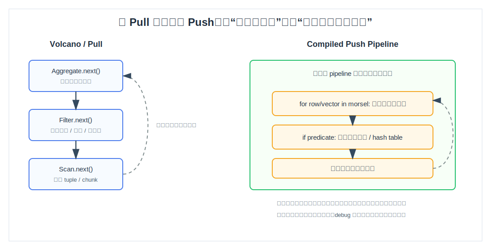
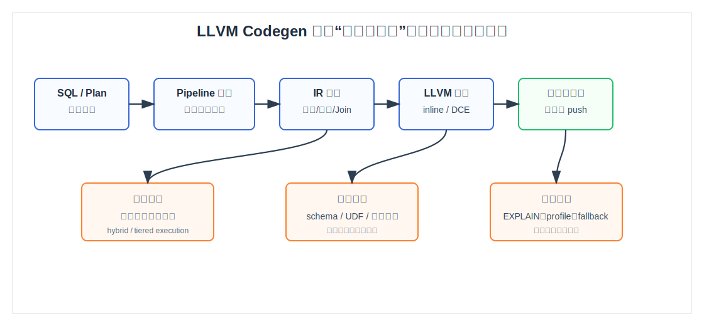
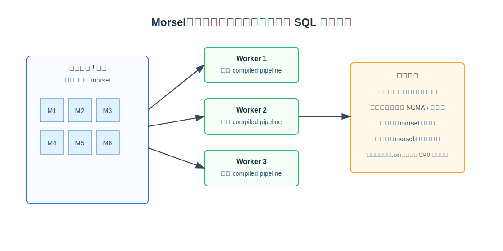
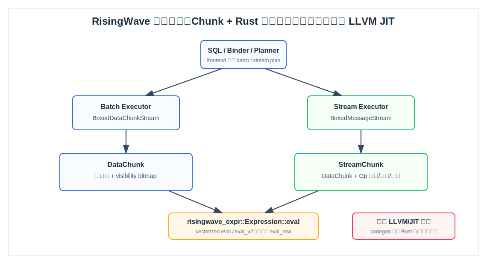
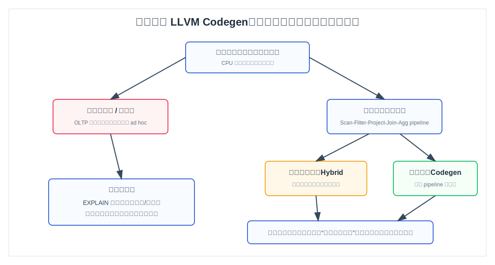

## 数据库筑基课 - 查询执行引擎“编译型 Push 模型 (LLVM Codegen)”
                                                                                            
### 作者                                                                
digoal                                                                
                                                                       
### 日期                                                                     
2026-05-30                                                      
                                                                    
### 标签                                                                  
PostgreSQL , RisingWave , 应用开发者 , 数据库筑基课 , 查询执行引擎 , LLVM , JIT , Push 模型 , 向量化执行  
                                                                                           
----                                                                    

## 背景
   
  

本文属于“数据库筑基课”的查询执行引擎专题：理解一个 SQL 计划不是“树上摆几个算子”这么简单，真正决定延迟和吞吐的，是执行器如何在 CPU cache、分支预测、函数调用、内存分配、并行调度和代码生成之间做取舍。

业务上最常见的痛点是：同一条分析 SQL，逻辑计划看起来不复杂，CPU 却被大量解释器分派、虚函数调用、临时 tuple/chunk 构造和中间结果搬运吃掉。传统 Volcano/Pull 模型很通用，但在现代 CPU 上容易把时间花在“调度执行”而不是“处理数据”上。HyPer 系列论文提出的方向是：把查询计划切成 pipeline，把 pipeline 编译成机器码，用 Push 方式让数据沿着紧循环流动。

本文同时使用 RisingWave 源码作对照。需要先说清楚边界：从当前本地源码和 DeepWiki 查询结果看，RisingWave 的 batch/stream 执行器使用 `DataChunk`/`StreamChunk` 和 Rust 表达式执行，没有发现运行时 LLVM/JIT 查询编译入口；源码里的 `codegen` 主要出现在 Rust 宏和构建期表达式函数注册语境中。因此本文不是说 RisingWave 已实现 LLVM Codegen，而是用 RisingWave 的 chunk 执行器帮助读者理解“向量化解释执行”和“编译型 Push 执行”的分界。

## 一、它解决什么问题？

编译型 Push 模型解决的是查询执行中的 CPU 效率问题，尤其是分析型、长查询、表达式密集、扫描量大、算子 pipeline 较长的场景。

传统 Pull 模型通常是父算子调用子算子的 `next()`，例如 `Aggregate.next()` 调 `Filter.next()`，再调 `Scan.next()`。这个模型的好处是接口统一，算子组合简单，容易 debug；坏处是每处理一行或一小批数据，就可能发生多层函数调用、状态机切换、虚调用、分支判断和中间结果物化。数据量小的时候这些代价不明显，数据量上来后，它们会变成 CPU 热点。

编译型 Push 模型把问题换了一种问法：既然某条 SQL 的计划在执行前已经确定，为什么还要每一行都解释同一棵表达式树、反复穿过同一套算子接口？更激进的做法是把 `Scan -> Filter -> Project -> Join/Agg` 这样的 pipeline 生成成一个专用函数，让编译器完成内联、死代码删除、寄存器分配和循环优化。

代价也很直接：编译需要时间，生成的代码需要缓存和失效，执行路径更难调试，短查询可能还没跑热就已经结束。因此它不是“所有数据库都应该默认打开”的银弹，而是一种面向高温路径的执行引擎优化。



图 1 说明：Pull 模型把控制权留给父算子逐层索取数据；编译型 Push 模型把一段可流水化的算子合并成一个紧循环。它减少的是算子边界和解释器分派成本，但会引入编译生命周期和代码管理成本。

## 二、它是什么？

编译型 Push 模型可以这样定义：

> 在查询开始前或查询运行早期，把物理计划中可流水化的一段 operator pipeline 转换成中间表示，例如 LLVM IR，再编译成本地机器码；执行时由底层数据源把 tuple、vector 或 morsel 推入 pipeline，沿途直接完成谓词、投影、join probe、聚合更新等逻辑。

几个关键词要分清：

| 术语 | 含义 | 容易混淆的点 |
|---|---|---|
| Pull 模型 | 父算子向子算子要数据，典型接口是 `next()` | 可以按行，也可以按 chunk，不等于一定低效 |
| Push 模型 | 子算子把数据推给下游 consumer | 常和 pipeline 编译一起出现，但 Push 不必然要求 LLVM |
| Pipeline | 没有阻塞边界的一段算子链 | `Sort`、全局聚合 build 阶段、hash join build 阶段会切断 pipeline |
| LLVM Codegen | 生成 LLVM IR 并编译为机器码 | 不是简单“把 Rust/C++ 编译一下”，而是运行时按查询生成代码 |
| JIT | Just-In-Time 编译 | 可能是查询开始前编译，也可能是 hybrid/tiered 边跑边编译 |
| 向量化执行 | 一次处理一批列数组 | 可解释、可编译，也可和 Push 混合 |
| Morsel | 并行执行中分给 worker 的小块数据范围 | 是调度单位，不是 SQL 语义单位 |

RisingWave 当前更接近“chunk/vectorized + Rust executor”的架构。源码中 `DataChunk` 被定义为列集合加可见性 bitmap，batch `Executor` 的 `execute()` 返回 `BoxedDataChunkStream`；表达式接口 `Expression::eval(&DataChunk)` 返回数组，也提供 `eval_v2` 和 `eval_row`。这些都是向量化执行的典型结构，但不是 LLVM JIT。

## 三、核心原理

### 1. Pipeline 切分：先找到能推到底的连续路径

不是整棵计划树都适合编译成一个函数。编译型执行通常先把计划切成 pipeline：

- `Scan -> Filter -> Project` 通常可融合。
- `HashJoin` 通常分 build pipeline 和 probe pipeline。
- `Aggregate` 可把局部聚合更新放进 pipeline，但最终输出可能是另一个阶段。
- `Sort`、全局去重、需要完整输入后才能输出的算子，会形成 pipeline breaker。

HyPer 的思路是使用生产者/消费者接口生成代码：每个 operator 不再运行时调用 `next()`，而是在代码生成阶段把自己的处理逻辑嵌进上游或下游的 generated function。最终得到的不是一棵运行时解释的算子树，而是一组 pipeline 函数。

### 2. LLVM Codegen 生命周期：计划不是终点，代码才是热路径

LLVM Codegen 的生命周期通常包括：

1. 优化器生成物理计划。
2. 执行器识别 pipeline 和 pipeline breaker。
3. 为每个 pipeline 生成 IR。
4. LLVM 对 IR 做内联、常量折叠、死代码删除、循环优化和寄存器分配。
5. 生成机器码并放入代码缓存。
6. 执行时调用机器码。
7. 当 schema、UDF、类型、参数敏感计划、统计信息或版本变化时，让缓存失效。



图 2 说明：LLVM Codegen 的工程复杂度不在“生成几行代码”，而在生命周期。编译预算、代码缓存、失效策略、profile、fallback 和 EXPLAIN 可见性，是生产系统必须补齐的部分。

### 3. Push 执行：减少中间物化，而不是消灭所有数据结构

编译型 Push 经常被误解为“不再有 batch/chunk”。更准确地说，它减少的是 operator 边界上的通用容器和分派成本，但仍然需要输入缓冲、输出缓冲、hash table、聚合状态、selection vector 或 bitmap 等数据结构。

例如一个简化查询：

```sql
SELECT region, sum(amount)
FROM orders
WHERE status = 'paid' AND amount > 100
GROUP BY region;
```

Pull 模型可能表现为：

```text
Agg.next()
  -> Filter.next()
       -> Scan.next()
```

编译型 Push 的等价热路径更像：

```text
for tuple_or_vector in scan_morsel:
    status = load(status_col)
    amount = load(amount_col)
    if status == 'paid' and amount > 100:
        region = load(region_col)
        hash_table[region].sum += amount
```

真实系统会更复杂：要处理 NULL、类型转换、溢出、collation、事务可见性、异常、UDF、向量宽度、SIMD 可用性和内存分配。也正因为如此，很多系统会选择 hybrid：短查询先用解释型或向量化执行，长查询或热点查询再切换到编译代码。

### 4. Morsel 并行：让编译后的 pipeline 能喂饱多核

`Morsel-Driven Parallelism` 解决的是另一个问题：一段 pipeline 编译得再快，如果只有一个线程跑，也无法用满多核。morsel 的基本思想是把大扫描范围切成很多小块，worker 动态领取 morsel 执行同一段 pipeline。

这种方式比静态分区更容易处理数据倾斜：快的 worker 多拿几个 morsel，慢的 worker 少拿几个。论文还强调 NUMA locality，即尽量让 worker 处理本地内存附近的数据，减少跨 socket 访问。



图 3 说明：morsel 是执行调度单位。它需要在两个方向之间取平衡：太小会增加调度开销，太大又会导致负载不均和响应变慢。

### 5. RisingWave 对照：chunk/vectorized 执行路径

RisingWave 源码提供了一个很好的对照样本：

- `src/batch/src/executor/mod.rs` 中 batch `Executor` 的 `execute()` 返回 `BoxedDataChunkStream`，并通过 `ExecutorBuilder` 从 protobuf plan 递归构建 executor。
- `src/common/src/array/data_chunk.rs` 中 `DataChunk` 是列数组加 visibility bitmap，并区分 `cardinality()` 和 `capacity()`。
- `src/expr/core/src/expr/mod.rs` 中 `Expression::eval(&DataChunk)` 是向量化表达式接口，返回 `ArrayRef`；也有 `eval_v2` 优化标量常量表达式。
- batch `FilterExecutor` 对 child chunk 调 `compact_vis()`，再执行表达式，得到 bool array 后设置 visibility。
- batch `ProjectExecutor` 对每个表达式调用 `eval(&DataChunk)`，组装新的 `DataChunk`。
- stream `ProjectExecutor` 和 `FilterExecutor` 处理的是 `StreamChunk`，即数据列加插入、删除、更新操作语义。
- `frontend/src/handler/query.rs` 中 batch 查询会在 RisingWave 自身 batch plan 和可选 DataFusion plan 之间选择；DataFusion 主要用于特定场景，例如 Iceberg 查询路径。



图 4 说明：RisingWave 已经具备 chunk/vectorized 执行基础，但这和 LLVM JIT 是两件事。向量化执行减少“按行解释”的开销；LLVM Codegen 进一步尝试减少表达式树解释、算子边界和通用分派的开销。

## 四、横向对比

| 维度 | 编译型 Push + LLVM Codegen | Volcano/Pull 解释执行 | 向量化解释执行 | Hybrid 执行 |
|---|---|---|---|---|
| 主要目标 | 为热点 pipeline 生成专用机器码 | 通用、模块化、易组合 | 批量处理列数组，降低按行开销 | 在启动延迟和长查询吞吐间折中 |
| 启动成本 | 高，需要生成 IR 和编译 | 低 | 中低 | 中等，可能先解释后切换 |
| 热路径效率 | 高，少分派、可内联、少中间物化 | 通常最低 | 通常较好 | 接近编译型，取决于切换时机 |
| 短查询表现 | 可能不划算 | 好 | 好 | 好，若先走解释路径 |
| 长分析查询表现 | 好，尤其 CPU 密集 pipeline | 容易被解释器开销拖累 | 好，但仍有表达式分派 | 好 |
| 工程复杂度 | 高 | 低到中 | 中 | 最高 |
| Debug 难度 | 高，需要 IR/机器码/profile 可见性 | 低 | 中 | 高 |
| 适合场景 | 扫描、过滤、投影、join probe、聚合更新等热点 pipeline | 控制流复杂、执行次数少、开发早期 | 通用 OLAP 和流批 chunk 处理 | 查询冷热差异大、既要低延迟又要高吞吐 |
| 不适合场景 | 高 ad hoc、UDF 黑盒多、计划频繁变化、短查询 | 极致 CPU 效率要求高的长查询 | 单行强事务路径或高度分支化逻辑 | 系统缺少代码缓存和可观测性能力 |

这个表的关键不是“谁先进”，而是“成本放在哪里”。Pull 模型把复杂度放在通用 executor 接口里；向量化把复杂度放在列数组和批处理算子里；编译型 Push 把复杂度放在代码生成、编译预算和运行时代码管理里；Hybrid 则同时承担两套路径的复杂度。

## 五、效果如何？

不要脱离 workload 谈效果。编译型 Push 的收益通常来自：

- 减少 operator 边界调用和解释器分派。
- 减少临时 tuple/chunk 物化。
- 把表达式和算子逻辑内联到一个紧循环。
- 让编译器进行寄存器分配、常量折叠、死代码删除、循环优化。
- 对长扫描、join probe、局部聚合等 CPU 密集路径更友好。
- 与 morsel 并行结合后，更容易把多核喂饱。

代价同样真实：

- 编译时间会直接进入查询端到端延迟。
- 代码缓存占内存，且需要失效策略。
- UDF、复杂类型、异常路径、NULL 语义、collation、decimal 溢出会拉高代码生成复杂度。
- 生成代码难 debug，必须让 EXPLAIN、profile、fallback 变成一等能力。
- 对一次性短查询、低 CPU 查询、I/O 等待占主导的查询，收益可能很小。

RisingWave 当前源码里的 `DataChunk::compact_vis()` 注释也体现了类似取舍：压缩 visibility 会复制列数据，成本是拷贝，收益是后续处理更少隐藏行、占用更少内存。这类局部决策和 LLVM Codegen 的大方向一致：为了热路径效率，愿意在合适位置支付前置成本，但前提是收益能覆盖成本。

## 六、实操 DEMO

本节不给伪造 benchmark。由于当前环境没有启动 RisingWave 集群，也没有在本机编译带 LLVM Codegen 的数据库内核，所以不提供虚假的执行耗时。下面给出两个可验证实验模板。

### DEMO 1：在 RisingWave 观察当前执行计划和 chunk 执行入口

如果你已经按 RisingWave 的 `CLAUDE.md` 启动了本地实例，可以执行：

```sql
CREATE TABLE orders (
  id BIGINT,
  region VARCHAR,
  status VARCHAR,
  amount DOUBLE PRECISION
);

EXPLAIN
SELECT region, sum(amount)
FROM orders
WHERE status = 'paid' AND amount > 100
GROUP BY region;
```

验证点：

- 观察计划里是否出现 scan、filter、project、aggregate 等 batch/stream 算子。
- 对照 `src/batch/executors/src/executor/filter.rs` 和 `project.rs`，确认 filter/project 是对 `DataChunk` 执行表达式。
- 对照 `src/expr/core/src/expr/mod.rs`，确认表达式入口是 `Expression::eval`/`eval_v2`，不是 LLVM IR 生成。

本文没有执行该 SQL；原因是当前任务是写作与源码研读，没有启动 RisingWave 服务。

### DEMO 2：用 PostgreSQL JIT 观察“短查询不一定划算”

如果你有 PostgreSQL，并且构建时启用了 LLVM JIT，可以做一个对照实验：

```sql
SHOW jit;

SET jit = off;
EXPLAIN (ANALYZE, BUFFERS)
SELECT sum(i) FROM generate_series(1, 10000000) AS t(i) WHERE i % 7 = 0;

SET jit = on;
EXPLAIN (ANALYZE, BUFFERS)
SELECT sum(i) FROM generate_series(1, 10000000) AS t(i) WHERE i % 7 = 0;
```

验证点：

- 看计划输出是否出现 JIT 相关信息。
- 比较总耗时和 JIT 编译耗时。
- 把数据量调小，例如 `10000`，观察短查询是否可能因为编译成本变慢。

这个实验验证的是 LLVM/JIT 的普遍机制，不代表 RisingWave 当前支持相同功能。

## 七、最佳实践

对数据库架构师：

- 先按 workload 分类，不要用“是否先进”判断执行模型。长分析查询、稳定报表、CPU 密集型表达式、热点物化查询，更可能从编译型 Push 受益。
- 要求执行引擎提供 fallback。编译失败、UDF 不支持、类型路径不支持时，必须能回到解释型或向量化执行。
- 把代码缓存、编译队列、编译耗时、命中率、失效率纳入容量设计。

对 DBA：

- 关注端到端延迟，而不是只看执行阶段。JIT 编译时间如果被单独统计，必须和执行时间一起解释。
- 观察短查询和长查询的分位数差异。开启 JIT 后平均值变好，不代表 P95/P99 一定变好。
- 对 ad hoc 查询系统要谨慎。计划变化频繁会降低代码缓存命中率。

对业务开发者：

- SQL 写法仍然重要。能让优化器形成长 pipeline 的写法，通常比把逻辑藏进黑盒 UDF 更容易被优化。
- 复杂表达式、类型转换和 NULL 语义会影响代码生成路径。不要假设所有表达式都能被同等优化。
- 对性能敏感查询，固定 SQL 形状、使用参数而不是拼接大量不同 SQL，有助于计划和代码缓存复用。

## 八、适合与不适合场景

适合：

- 扫描量大、CPU 计算占主导的 OLAP 查询。
- 重复执行的报表、仪表盘、预定义分析查询。
- `Scan -> Filter -> Project -> Join Probe -> Local Agg` 这类长 pipeline。
- 数据在内存或高速缓存中，I/O 不是主要瓶颈的场景。
- 可以接受 warm-up 或 hybrid 执行的系统。

不适合：

- 单次执行、数据量很小的短查询。
- 高度动态 SQL，计划形状经常变化。
- 黑盒 UDF 很多，无法内联或生成等价 IR。
- I/O 等待、网络等待、远端对象存储延迟占主导的查询。
- 缺少 profile、EXPLAIN、fallback、代码缓存上限的生产系统。



图 5 说明：是否使用 LLVM Codegen，第一问不是“能不能生成代码”，而是“这条路径是否热到值得编译”。编译型执行是高温路径优化，不是默认正确答案。

## 九、常见坑

1. 把“向量化”误认为“LLVM Codegen”。向量化是批量处理列数组；LLVM Codegen 是运行时生成专用机器码。两者可以组合，但不是一回事。

2. 只 benchmark 长查询。长查询变快很常见，但短查询可能因为编译成本变慢。必须按查询类别分别评估。

3. 忽略代码缓存失效。schema、函数定义、类型、统计信息和执行参数都可能影响生成代码。缓存没有边界会变成内存问题。

4. 生成代码不可观测。生产系统必须能回答：这条 SQL 是否编译了？编译用了多久？用了哪个 fallback？生成代码命中缓存了吗？

5. 把所有算子强行塞进一个 pipeline。Sort、全局聚合、hash join build 等阻塞边界天然会切断 pipeline。过度融合会让代码巨大、编译慢、指令 cache 压力增加。

6. 忽略异常语义。数据库表达式不是普通算术表达式，还包括 NULL、溢出、时区、collation、decimal、错误处理和 UDF 安全边界。

7. 在流处理里照搬批处理 Codegen。流处理有 barrier、watermark、更新语义、状态清理和一致性约束。RisingWave 的 stream executor 处理 `StreamChunk` 和 barrier，这些控制消息不能被简单当成 batch pipeline。

## 十、扩展问题

1. 如果一个系统已经有成熟的向量化执行，哪些表达式或算子最值得优先 codegen？
2. 对一个云原生数据库，代码缓存应该放在 frontend、compute node，还是跟 fragment/task 生命周期绑定？
3. 对流数据库，能否只编译 stateless `Filter/Project`，而把 stateful join/agg 保持解释型？
4. Hybrid 执行的切换点如何决定：按行数、运行时间、CPU sample，还是历史 query fingerprint？
5. EXPLAIN 应该如何展示 JIT 信息，才能让 DBA 判断“编译成本是否回本”？
6. 如果 UDF 是外部进程或 WASM，编译型 pipeline 如何跨越这个黑盒边界？

## 十一、扩展阅读

- Thomas Neumann, *Efficiently Compiling Efficient Query Plans for Modern Hardware*, PVLDB 2011. 论文核心：通过 operator produce/consume 代码生成，把查询计划编译成高效机器码，减少传统 iterator 模型开销。
- Viktor Leis et al., *Morsel-Driven Parallelism: A NUMA-Aware Query Evaluation Framework for the Many-Core Age*, SIGMOD 2014. 论文核心：用 morsel 作为动态调度单位，实现 NUMA-aware、高负载均衡的并行查询执行。
- Alfons Kemper, Thomas Neumann 等 HyPer 相关论文和分享。理解 pipeline breaker、LLVM IR 生成、编译预算、事务一致性和 OLTP/OLAP 混合执行的工程背景。
- *Compilation in the Blink of an Eye: Hybrid Query Execution for In-Memory Database Systems*. 本文按用户提供标题作为 hybrid/tiered query execution 参考主题使用；当前环境未能稳定抓取全文，因此未引用具体实验数字。
- RisingWave 本地源码：
  - `risingwave/CLAUDE.md`：项目组件划分，说明 `batch`、`stream`、`frontend`、`storage` 等 crate 的职责。
  - `risingwave/src/batch/src/executor/mod.rs`：batch executor trait、`BoxedDataChunkStream`、executor builder 注册和构建。
  - `risingwave/src/batch/executors/src/executor/filter.rs`：batch filter 对 `DataChunk` 执行表达式并生成 visibility。
  - `risingwave/src/batch/executors/src/executor/project.rs`：batch project 对多个表达式并发 eval，生成新 `DataChunk`。
  - `risingwave/src/common/src/array/data_chunk.rs`：`DataChunk` 的列数组、visibility、`compact_vis()` 成本收益说明。
  - `risingwave/src/expr/core/src/expr/mod.rs`：`Expression::eval`、`eval_v2`、`eval_row` 接口。
  - `risingwave/src/stream/src/executor/filter.rs` 与 `project/project_scalar.rs`：stream executor 对 `StreamChunk`、op 和 watermark/barrier 的处理。
  - `risingwave/src/frontend/src/handler/query.rs`：batch query plan 生成、RisingWave plan 与可选 DataFusion plan 选择。
- DeepWiki: `risingwavelabs/risingwave`。本次查询用于快速核对 RisingWave 执行架构；关键判断已回到本地源码验证。
  
## 附录 
1、询问 gemini
```
数据库查询执行引擎“编译型 Push 模型 (LLVM Codegen)”相关的论文和开源数据库.
```
  
2、克隆代码  
```  
git clone --depth 1 https://github.com/risingwavelabs/risingwave
```  
  
3、启用 codex, 使用 [数据库筑基课 skill](../skills/README.md).  
```
文章标题: 
  数据库筑基课 - 查询执行引擎“编译型 Push 模型 (LLVM Codegen)”
项目源码(已克隆到当前项目如下目录中):  
  risingwave
相关论文或分享:
  Efficiently Compiling Efficient Query Plans for Modern Hardware
  Morsel-Driven Parallelism: A Common Architecture for High-Performance Data Processing Systems on Multi-Core CPUs
  Compilation in the Blink of an Eye: Hybrid Query Execution for In-Memory Database Systems
项目 deepwiki reponame:  
  risingwavelabs/risingwave
项目参考信息: 
  risingwave/CLAUDE.md
```
   
  
#### [PostgreSQL 解决方案集合](../201706/20170601_02.md "40cff096e9ed7122c512b35d8561d9c8")
  
  
#### [德哥 / digoal's Github - 公益是一辈子的事.](https://github.com/digoal/blog/blob/master/README.md "22709685feb7cab07d30f30387f0a9ae")
  
  
#### [About 德哥](https://github.com/digoal/blog/blob/master/me/readme.md "a37735981e7704886ffd590565582dd0")
  
  

  
