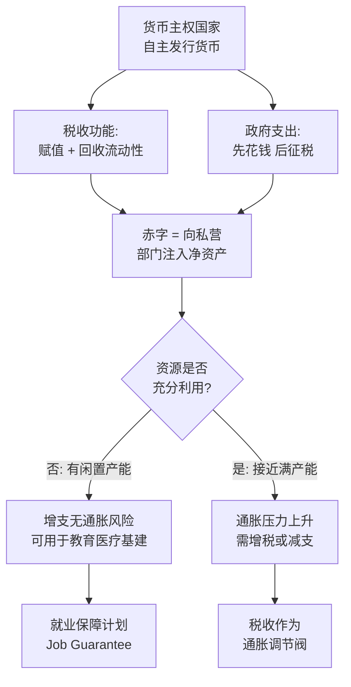

## 《赤字迷思：现代货币理论与如何更好地发展经济》读书笔记 
  
### 作者  
digoal  
  
### 日期  
2026-05-30 
  
### 标签  
读书笔记 , 赤字迷思：现代货币理论与如何更好地发展经济  
  
----  
  
## 背景 
  


---
书名: 《赤字迷思：现代货币理论与如何更好地发展经济》  
作者: 斯蒂芬妮·凯尔顿（Stephanie Kelton）  
译者: 朱虹  
出版年份: 2022（中文版）/ 2020（英文版）  
笔记日期: 2026-05-30  
豆瓣ISBN: 9787521742503  
标签: [经济学, 现代货币理论, MMT, 财政政策, 货币政策, 进步经济学]  
---

  

> **一句话**：政府赤字不是家庭负债，货币主权国家的真正约束是通胀，而非余额。  
> **适合谁读**：对经济政策感到困惑的普通人；对"国债快把子孙压垮了"这种说法将信将疑的人；想理解为什么美国可以无限"印钱"的人。  
> **阅读难度**：⭐⭐☆☆☆（通俗易懂，无需经济学背景）  
> **推荐指数**：⭐⭐⭐⭐☆（思维震撼，但需批判阅读）  

---

## 一、时代坐标：这本书从哪里来？

2020年，新冠疫情席卷全球，美国政府在几个月内砸出数万亿美元救助金。此前已被债务幽灵吓破胆的政客们，突然发现"钱"似乎凭空就来了——国会投票，美联储配合，支票寄到了每个美国家庭。

这一幕揭开了一个被刻意压制了几十年的问题：**联邦政府的钱，究竟从哪里来？**

《赤字迷思》正是在这个历史节点上出版的。作者斯蒂芬妮·凯尔顿，纽约州立大学石溪分校经济学教授，曾任伯尼·桑德斯总统竞选顾问、美国参议院预算委员会少数党首席经济学家——她是美国政治经济圈里为数不多敢于公开挑战"赤字恐惧症"的人。

她写这本书，是因为她亲眼目睹了一个荒诞的现实：美国每年在军费上大手笔花钱，从不纠结"钱从哪里来"；但一旦讨论全民医保、教育投资、基础设施建设，政客们立刻变成账本控，反复追问"赤字怎么办？谁来还钱？"

凯尔顿要打破的，正是这个**双重标准背后的认知错误**：把国家预算当成家庭收支来理解。

```
历史背景时间轴

2008 金融危机 → 量化宽松 → 通胀并未爆发 → MMT引发关注
        ↓
2016 桑德斯竞选 → 凯尔顿成为首席经济顾问 → MMT进入政治圈
        ↓
2020 新冠疫情 → 政府史无前例撒钱 → 《赤字迷思》出版 → 登上畅销榜
        ↓
2021-2022 通胀来袭 → MMT面临最大考验
```

---

## 二、核心命题：作者在说什么？

凯尔顿用六章篇幅，逐一击破六个"赤字迷思"，核心论点可以归结为以下三条。

### 观点一：货币发行者 ≠ 货币使用者

这是整本书最根本的区分。

**你我和企业是"货币使用者"**：我们必须先赚到钱，才能花钱；借太多，就会破产。

**拥有货币主权的国家政府是"货币发行者"**：美国政府支出美元，是凭借国会授权，委托美联储操作，本质上是**先花钱，再征税**。税收的功能，并不是给政府"筹钱"，而是：

1. 为货币赋予价值（你必须用美元缴税，所以你需要美元）
2. 控制通货膨胀（抽走市场上多余的流动性）

换句话说，**政府征税不是为了花钱，政府花钱也不依赖征税**。这个逻辑完全颠倒了大多数人的直觉。

### 观点二：赤字本身不是问题，通胀才是真正的约束

凯尔顿的核心主张是：**联邦赤字的真正约束不是钱的数量，而是实体经济的承载能力。**

当政府多花钱，如果市面上有闲置劳动力、闲置产能——工人没活干、工厂没订单——那政府花出去的钱只是让资源"动起来"，不会引发通胀。

**通胀只在一种情况下出现**：政府花的钱，超过了经济体实际能够生产的商品和服务的总量，导致"钱多货少"。

所以，问题从"我们有没有钱"，变成了"我们有没有资源"——这是一个根本性的重构。

### 观点三：赤字是私营部门的顺差

这是MMT里最反直觉的会计等式。

凯尔顿引用了一个三部门恒等式：

```
政府赤字 + 私营部门顺差 + 国外部门余额 = 0
```

**政府的赤字，恰恰对应私营部门的净储蓄。** 历史上每一次美国政府实现财政盈余的时期（克林顿时代是最近一例），随后都伴随着私营部门的债务积累和经济衰退。

这意味着：一味追求"财政平衡"，可能恰恰是在抽走私营部门赖以运转的金融资产。

---

## 三、论证地图：作者怎么说服你的？



**关键论据：**

- **克林顿盈余的代价**：1998-2001年美国财政盈余，随后互联网泡沫破裂，私营部门债务急剧膨胀，2001年陷入衰退。
- **日本的反直觉案例**：日本政府债务/GDP超过230%，但多年来利率极低、通胀极低，并未出现"债务危机"。
- **量化宽松的实践**：2008年后美联储大量"印钱"，通胀并未如传统模型预测的那样失控。
- **军费的双重标准**：美国国会从不追问军事支出的"资金来源"，却对医疗和教育投资斤斤计较。

**论证方式评价**：凯尔顿善用类比和故事，深入浅出；但学术严谨性偏弱，某些案例经不起深究（日本、土耳其等国情况差异极大），统计数据的选取有时略显选择性。

---

## 四、前提假设与边界：什么情况下这不成立？

MMT的逻辑链条，建立在几个核心假设之上。这些假设并非普世真理。

| 假设 | 实际情况 |
|------|----------|
| 国家拥有货币主权，以本币借债 | 仅适用于美国、日本、英国等少数国家；阿根廷、斯里兰卡等以外币举债，完全不适用 |
| 政府有能力精准控制通胀 | 政策滞后、政治博弈、供给侧冲击（如大宗商品价格）都会干扰调控能力 |
| 税收能及时充当通胀调节阀 | 加税是高度政治化的行为，往往慢于经济周期，国会不可能如此理性高效 |
| 政府支出能高效转化为生产力 | 现实中存在大量腐败、低效、寻租——政府支出质量天差地别 |

**2021-2022年的通胀反例**：新冠期间美国政府大量财政刺激后，2022年美国通胀率飙升至8%以上，创40年新高。支持者认为这主要是供应链中断和能源价格冲击所致，并非MMT政策本身的失败；批评者则认为过量财政刺激是通胀的重要推手之一。这场争论至今没有定论。

**最根本的边界**：MMT是对货币主权大国（尤其是美国）财政运作的描述性分析，并不是一张可以普遍应用的政策处方。

---

## 五、思想谱系：这本书在哪个传统里？

MMT不是凯尔顿凭空发明的，它有清晰的思想源流：

```
学术谱系

凯恩斯（政府调节需求）
        ↓
后凯恩斯学派
  ├─ 海曼·明斯基（金融不稳定假说）
  ├─ 温·戈德利（三部门均衡会计）
  └─ 克纳普（国家货币理论）
        ↓
MMT核心圈（沃伦·莫斯勒、兰德尔·雷、比尔·米切尔）
        ↓
凯尔顿《赤字迷思》→ 大众传播
```

MMT与主流经济学的根本分歧：主流经济学（新凯恩斯主义）认为货币政策（央行调利率）是调节经济的主要工具，财政政策是补充；MMT认为财政政策才是核心，货币政策相对次要。

与同时代的对话：诺贝尔经济学奖得主保罗·克鲁格曼对MMT持批评态度，认为其对财政赤字的支持过于宽泛，忽视了充分就业时期维持赤字对通胀的影响。奥地利学派和米塞斯研究院则认为MMT从根本上误解了货币的性质，政府"印钱"必然带来资源错配和财富再分配的扭曲。

---

## 六、我学到了什么？

**第一个收获：政府预算≠家庭预算，这个比喻是个陷阱。**

我们从小被教育"量入为出""借钱要还"，这些原则对个人和家庭完全正确。但当政客用同样的语言谈论国家预算时，他们在偷换概念——国家不会死，主权货币国家的政府理论上永远不会"破产"（以本币计）。认清这一点，就不会被"国债让子孙还钱"这样的说辞轻易吓到。

**第二个收获：真正的约束是资源，不是数字。**

经济政策的讨论，不应该停留在"有没有钱"这个层面，而应该聚焦"有没有人力、物力、技术、基础设施"。美国基础设施老化、气候变化应对迟缓，不是因为"没钱"，而是因为政治意愿和资源分配的问题。这个视角让我重新理解了很多公共政策争论的本质。

**第三个收获：通胀的政治经济学。**

谁在最大声喊"赤字危机"？往往是既得利益者——他们害怕政府用财政手段为普通人提供医疗、教育和就业保障，因为这会改变现有的权力格局。"财政纪律"有时是一块遮羞布，遮住的是对政府积极作为的意识形态反对。

---

## 七、举一反三：这个框架还能用在哪？

**识破"没有钱"的政治修辞**

下次听到政客说"我们支持全民医保，但现在负担不起"，你可以问：美国在伊拉克战争时怎么负担得起几万亿军费的？军费从未面临"钱从哪里来"的追问。预算约束往往是选择性执行的政治工具。

**理解中国的财政政策逻辑**

中国政府同样是货币主权国家（以人民币发债），这意味着中央政府层面的"财政约束"与地方政府（以土地财政为抵押、以美元或外币融资的债务）性质完全不同。MMT的框架可以帮助区分哪些"债务"是真正的风险，哪些只是账面上的数字转移。

**重新审视量化宽松的逻辑**

各国央行在2008年和2020年的量化宽松操作，在形式上与MMT描述的政府货币创造机制高度相似——而通胀并没有在当时立即爆发。这一现实本身，就是对传统货币数量论的一次实证挑战。

---

## 八、批判与反思

**最大的软肋：政治可行性**

凯尔顿的框架里，政府是理性、高效的通胀管理者——当通胀来临，国会会及时加税或削减支出。但现实中，加税是政治自杀，削减支出引发社会抗议，国会永远被各种利益集团绑架。MMT在技术上也许成立，但它依赖一个近乎不存在的"理性政府"假设。

**2021-2022年通胀的教训**

这是MMT迄今最难回答的挑战。当美国通胀率升至8%，不管是供应链还是财政刺激的原因，MMT支持者并没有拿出令人信服的事前预警和事后检验。凯尔顿本人承认通胀超出了预期，但解释框架总显得有些事后诸葛。

**对非美国国家的局限**

凯尔顿的论述高度以美国为中心。美元的储备货币地位给了美国独特的"超级特权"——全球愿意持有美元资产。对于大多数国家，特别是新兴市场，MMT的适用性大打折扣：本币贬值、资本外逃、外债偿还压力，都是真实的约束。

**一个隐忧：谁来决定"值得"花的钱**

如果财政约束被取消，权力就转移到了"决定花在哪里"的人手中。凯尔顿是进步派，她希望钱花在医疗、教育、气候上；但同一套逻辑，也可以用来为军事扩张、补贴大企业辩护。MMT解放了财政政策，却没有回答政治的问题。

---

## 九、金句与记忆点

1. **"问题不是'钱从哪里来'，而是'资源从哪里来'。"**
   ——把抽象的货币问题还原为具体的生产力问题，是MMT最有价值的认知转换。

2. **"政府的赤字，就是私营部门的顺差。"**
   ——这个会计等式让人意识到：为赤字哭泣，有时就是在为自己的储蓄哭泣。

3. **"税收不是为了筹钱，而是为了赋予货币价值，并管理通胀。"**
   ——彻底颠覆了"先有税收才能支出"的直觉。

4. **"美国军队的预算从不被问'钱从哪里来'。"**
   ——最犀利的政治批判：财政纪律是有选择性的。

5. **"自1971年布雷顿森林体系解体以来，美元与黄金脱钩，美联储从未真正受过金本位的约束。"**
   ——这个历史节点是理解现代货币体系的关键锚点。

6. **"失业是政府选择的结果，而不是市场的必然产物。"**
   ——MMT的政治激进性：政府本可以做"最终雇主"，提供充分就业，只是选择了不这么做。

7. **"财政盈余不是美德，而可能是在抽走私营部门赖以存活的血液。"**
   ——克林顿时代的盈余神话被彻底解构。

---

## 十、延伸阅读

1. **《货币论》（凯恩斯）**：MMT的重要思想源头，凯恩斯对政府调节需求的经典论述。适合想深入理解MMT理论根基的读者。

2. **《经济学的终结》（约翰·肯尼斯·加尔布雷思）**：批判主流经济学意识形态，与凯尔顿的批评方向一脉相承。

3. **《金融不稳定假说》（海曼·明斯基）**：MMT的另一根支柱，解释了为什么金融体系天然倾向于不稳定，政府干预不可或缺。

4. **《这次不同》（莱因哈特、罗格夫）**：MMT最著名的反面教材，以历史数据论证高债务必然带来危机。两本书对照读，能让你自己判断谁说的更有道理。

5. **《债：第一个5000年》（大卫·格雷伯）**：从人类学角度重新审视债务与货币的历史，是理解货币本质的绝佳补充。

---

*笔记写于 2026-05-30 | 基于公开资料与深度思考整理 | 作者：Claude*

---

> **附：MMT六大迷思速查表**

| 迷思编号 | 传统观点 | MMT反驳 |
|---------|---------|---------|
| 1 | 政府必须靠税收和借债才能支出 | 主权货币国家政府先支出再征税 |
| 2 | 赤字会拖累子孙后代 | 赤字是对私营部门的净资产注入 |
| 3 | 赤字会推高利率 | 主权货币国家可以控制短期利率 |
| 4 | 赤字会引发通胀 | 只有超出实际产能的支出才会通胀 |
| 5 | 赤字会削弱国际竞争力 | 贸易逆差本质上是获得实物商品 |
| 6 | 社会支出是我们"负担不起的" | 约束是通胀，不是货币数量 |
  
  
#### [PostgreSQL 解决方案集合](../201706/20170601_02.md "40cff096e9ed7122c512b35d8561d9c8")
  
  
#### [德哥 / digoal's Github - 公益是一辈子的事.](https://github.com/digoal/blog/blob/master/README.md "22709685feb7cab07d30f30387f0a9ae")
  
  
#### [About 德哥](https://github.com/digoal/blog/blob/master/me/readme.md "a37735981e7704886ffd590565582dd0")
  
  

  
