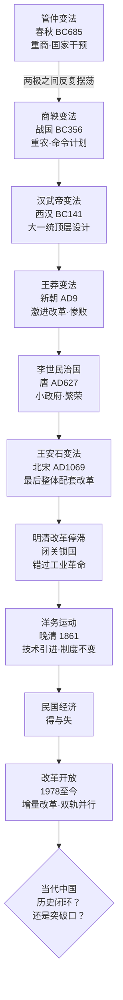

## 《历代经济变革得失》读书笔记 
  
### 作者  
digoal  
  
### 日期  
2026-05-30 
  
### 标签  
读书笔记 , 历代经济变革得失  
  
----  
  
## 背景 
  
  
---
书名: 《历代经济变革得失》  
作者: 吴晓波  
出版年份: 2013  
笔记日期: 2026-05-30  
豆瓣链接: https://book.douban.com/subject/24851460/  
豆瓣评分: 8.1  
标签: [中国经济史, 经济变革, 改革, 历史, 制度分析]  
---

  

> **一句话**：用两个分析框架，穿越2700年时光，看懂中国历次经济变革为什么总是那么相似。  
> **适合谁读**：想理解"中国为什么是中国"的普通读者；对时事有迷惑，想从历史找答案的人；经济、政策、商业从业者。  
> **阅读难度**：⭐⭐☆☆☆（语言流畅，不需要专业背景）  
> **推荐指数**：⭐⭐⭐⭐☆  
  
---

## 一、时代坐标：这本书从哪里来？

2013年，习近平主政第一年，三中全会即将召开，"改革"重新成为最热的词。举国上下都在谈新一轮改革，但目光大多停留在三十五年前的1978年。

吴晓波觉得这个时间跨度远远不够。

他已经写了《激荡三十年》（企业史1978-2008）、《跌宕一百年》（近代百年商业史）、《浩荡两千年》（中国商业史），这次决定把焦距推到最远：从春秋管仲一路写到改革开放，横跨2700年，专门研究历代经济体制改革的得与失。

书名是向钱穆先生的《中国历代政治得失》致敬。钱穆研究政治制度，吴晓波研究经济制度；钱穆是史学家，吴晓波是财经作家。这个差异很重要——这本书的长处和局限，都藏在这里。

开篇引用的是熊彼特的话：**"人们可以用三种方式去研究经济：通过理论、通过统计和通过历史。"** 吴晓波选择的是第三条路。

---

## 二、核心命题：作者在说什么？

吴晓波提炼出两套分析工具，用这两把"解剖刀"切开两千七百年的历史。

### 观点一：一切改革，都是四大利益集团的博弈

中国历史上所有经济问题，本质上都是四个集团的利益冲突与妥协：

- **中央政府**：追求财政充盈与权力集中
- **地方政府**：争取自主权与资源截留
- **有产阶级**（豪强、士绅、商人、今日的民营企业家）：保护财产，争取政策空间
- **无产阶级**（农民、工人）：温饱生存，是改革成本的最终承担者

读懂这个模型，很多"历史巧合"就消失了。为什么每次中央财政吃紧，就有盐铁专营？为什么每次地方做大，就有推恩令？为什么改革总是从收割无产者开始，收益却沉淀到有产者手中？——因为权力的天平永远向上倾斜。

### 观点二：四大基本制度，是两千年统一的基石

中国能维持两千年中央集权的"大一统"，靠的是四根支柱：

- **郡县制度**：中央对地方的人事任免权，杜绝封建割据
- **尊儒制度**：统一意识形态，让全体国民共享一套价值观
- **科举制度**：把社会精英吸纳进体制，消弭反对力量
- **国有专营制度**：控制盐铁等战略资源，掌握经济命脉

这四根柱子，形式在变，但逻辑从未变过。吴晓波认为，理解了这个结构，就理解了为什么中国所有的经济改革都有一条隐形的天花板——改革可以推进，但不能动摇这个结构本身。

### 观点三：两个有争议的结论

书的结尾，吴晓波提出两个他自认"也许会引起争议"的判断：

**结论一**：改革开放三十年的经济崛起，与其说是"人类行为的意外后果"，不如说是两千年经济变革史的合理演进——我们至今仍有陷入历史闭环的危险。

**结论二**：中国经济制度上的"结构性缺陷"（国进民退、土地财政、金融管制等），不是改革不彻底的失误，而是维持中央集权统一的"建设性结果"。

换言之：这些"缺陷"的存在，是有功能的。

---

## 三、论证地图：十次变法，一条主线

书中最精彩的案例，是两组对照：

**管仲 vs 商鞅**：管仲是"放活微观、管制宏观"的国家干预主义者——鼓励工商、通过盐铁专营控制宏观；商鞅是"命令型计划经济的鼻祖"——以农立国、严刑峻法、把国家变成一台高效的战争机器。这两个极端，此后两千年的所有改革都在它们之间摇摆。

**王安石变法**：吴晓波认为这是中国历史上"最后一次整体配套改革"的尝试，也是失败代价最惨重的一次。宋代工商业高度发达（最早的股份公司、职业经理人、期货贸易、纸币都出现在这里），人口超过一亿。但王安石变法失败后，那个充满活力、敢于创新的中国，就变成了一个谨小慎微、更愿意闭关锁国的中国。

---

## 四、前提假设与边界：什么情况下这不成立？

吴晓波的框架很强大，但它建立在几个假设之上，值得审视：

**假设一：四大利益集团是相对稳定的**。现实中，这四个集团的边界模糊且动态变化。有产阶级和无产阶级的分野，在21世纪的中国已经不再是清晰的二元对立，中间阶层的兴起使博弈更加复杂。

**假设二："统一文化"是永恒的边界**。这是全书最具争议的预设。吴晓波认为自由化改革的边界始终是维护大一统，但这个判断本身是历史归纳，不是逻辑必然——它描述了过去，不一定能预测未来。

**假设三：历史的内在逻辑可以被清晰提炼**。这本书的分析框架非常整齐，但整齐本身就是一种危险。批评者指出，书中选择了能支持框架的历史事实，忽略了很多矛盾案例——比如影响深远的张居正改革竟然基本缺席，明显是一个遗漏。

这本书更像是一张地图，不是精确的GPS导航。地图帮你看清方向，但细节需要你自己去找。

---

## 五、思想谱系：这本书在哪个传统里？

吴晓波明确致敬了**钱穆**（《中国历代政治得失》）——但钱穆是专业史学家，治学严谨；吴晓波是财经作家，追求可读性与洞见。两者气质不同，各有所长。

在问题意识上，这本书与**黄仁宇**的大历史观有相通之处——都试图找到中国历史演进的内在逻辑，而不是停留于事件叙述。黄仁宇的答案是"数目字管理"的缺失，吴晓波的答案是"四大制度的路径依赖"。

在当代对话上，这本书可以与**科斯《变革中国》**（市场经济的中国之路）对读——一个从经济史角度看，一个从制度经济学角度看，互为补充。

这本书出版后被评为2013年度最有影响力的十本书之一，可见其社会关注度。但学术界对它的评价是：普及有余，严谨不足。

---

## 六、我学到了什么？

**收获一：历史不是故事，是结构。**

读完这本书，我发现看古代变法的方式变了。以前读历史，关注的是"谁赢了谁输了"；现在更想问"哪个利益集团受益了，哪个付出了代价"。这个视角一旦建立，很多当代经济新闻都变得更容易理解——地方债、土地财政、国企改革……背后都是那几个集团在博弈。

**收获二：改革者的两难，是永恒命题。**

书中反复出现一个悲剧结构：改革者往往靠中央权威推行改革，但这种改革本身又会强化或削弱某个集团，最终反噬改革者自身。商鞅死于自己创立的法律；王安石变法成为北宋衰亡的转折点；洋务派引进技术却不改制度，最终事倍功半。改革的悖论在于：改变需要权力，而权力本身就是要改变的对象之一。

**收获三："结构性缺陷"可能是"功能性存在"。**

吴晓波的第二个结论最让我深思：那些显而易见的"缺陷"，为什么几十年都没被"修复"？如果把它们理解为功能性设计而非偶然失误，很多困惑就会消解——不是没人看到，而是它在发挥某种必要的功能。这个思路让我对制度分析有了新的维度。

---

## 七、举一反三：这个框架还能用在哪？

**场景一：解读政策新闻**。每当看到一条经济政策出台，可以快速问：这对四个集团分别意味着什么？谁是推动者，谁是阻力，谁是最终买单者？这比看政策文本本身更有信息量。

**场景二：理解企业环境**。国有专营制度的逻辑，在今天表现为哪些行业的市场准入壁垒？历史上每次"国进民退"的周期，对于在其中的企业意味着什么？四大制度框架可以帮商业人士做更长线的环境判断。

**场景三：跨国比较**。读完这本书，可以反问：其他文明是否也有类似的"统一逻辑"？欧洲为什么走上了不同的路？把吴晓波的框架当成一个镜子，去照其他历史，会发现很有意思的异同。

---

## 八、批判与反思

**最大的问题：选择性叙事。**

书中显著缺少张居正变法（明代最重要的财税改革）。一个批评者指出这本书的问题在于：选择事实、忽略细节、缺乏结构化研究方法、二元化简单归因、先验立场。这些批评不无道理。当你有了一个很好的分析框架，就很容易只看能支持这个框架的历史证据。

**时代已经变了的部分。**

吴晓波2013年在书中建议应尽快开征房产税，但十年后他自己的表态已截然不同。这说明理论预判与现实政策博弈之间存在巨大的不确定性。书中对"未来改革走向"的判断，很多在今天看来已经需要更新。

**这是"财经写作"，不是"经济史学"。**

吴晓波自己也不是历史学家，他更像是历史的整理者和解读者。这本书的价值在于：用一个普通人能看懂的框架，把两千七百年的变革脉络梳理出来，让读者有了登高望远的视角。它的局限也在这里——登高看到的是轮廓，不是细节。想要细节，需要去读真正的学术著作。

---

## 九、金句与记忆点

1. **"为了当代"** ——被问到研究历代经济变革的目的，吴晓波只说了这三个字。研究历史的人，心里装的是当下。

2. **"管仲是中国古代的凯恩斯"** ——放活微观、管制宏观，国家干预经济的古典模式。两千七百年后，这个辩论还在继续。

3. **"百代都行秦政法"** ——毛泽东对商鞅变法的评价。郡县制、中央集权、统一度量衡……秦制的基因渗透在此后每一个朝代。

4. **"王安石变法是一个转折点，变法之前是一个中国人，变法之后是另外一个中国人"** ——宋代本是工商业最发达的时代，这场失败的改革，让中国从进攻型走向了防御型。

5. **"统一文化是一切经济改革的边界"** ——这是全书最大胆也最有争议的判断。它既是历史归纳，也是现实预言。

6. **"结构性缺陷是建设性结果"** ——把"问题"重新理解为"功能"，这个认知框架的翻转，让很多看似无解的现象有了新的解释路径。

7. **"无产阶级在每次改革中付出了最大的代价"** ——产权清晰化运动中，上千万产业工人被抛弃。经济奇迹的背后，有人欢喜有人哭。

---

## 十、延伸阅读

1. **《中国历代政治得失》钱穆**——本书的精神前辈，从政治制度角度做同样的历史梳理，学术深度更高，是这本书的绝佳对照读物。

2. **《浩荡两千年》吴晓波**——吴晓波自己的中国商业史，与本书高度互补，后者关注体制，前者关注商人。

3. **《变革中国：市场经济的中国之路》科斯 & 王宁**——诺贝尔经济学奖得主科斯对中国改革开放的制度经济学分析，与本书结论互相印证，视角更为学术。

4. **《万历十五年》黄仁宇**——同样是大历史视野，以1587年一个普通年份为切口，解剖明代制度崩溃的深层逻辑，与本书互相参照，收获倍增。

5. **《置身事内：中国政府与经济发展》兰小欢**——2021年出版的当代经济学分析，把吴晓波的历史框架落地到当代财政、土地、金融的具体机制，是"以史为鉴"之后的"知今"。

---

*笔记写于 2026-05-30 | 基于公开资料与深度思考整理*
  
  
#### [PostgreSQL 解决方案集合](../201706/20170601_02.md "40cff096e9ed7122c512b35d8561d9c8")
  
  
#### [德哥 / digoal's Github - 公益是一辈子的事.](https://github.com/digoal/blog/blob/master/README.md "22709685feb7cab07d30f30387f0a9ae")
  
  
#### [About 德哥](https://github.com/digoal/blog/blob/master/me/readme.md "a37735981e7704886ffd590565582dd0")
  
  

  
